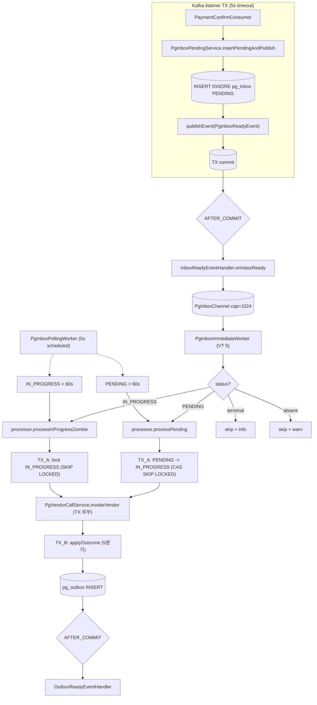
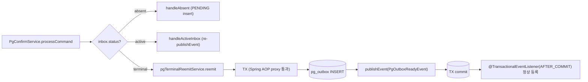

# PG-CONFIRM-LISTENER-SPLIT 완료 브리핑

> 2026-05-09 완료 · PR #73 머지 대기 · 16 태스크 + review 흡수 4 major + minor 4

## 작업 요약

`pg-service` 의 Kafka consumer (`PaymentConfirmConsumer`) 가 결제 확정 명령을 받으면 같은 listener 스레드 안에서 PG 벤더(Toss / NicePay) HTTP 호출까지 처리했다. 이 구조는 두 가지 도메인 리스크를 동시에 안고 있었다. 첫째, 벤더가 응답 지연을 일으키면 listener 스레드가 묶여 동일 partition 안의 다음 메시지가 polling 되지 않는다. partition 내 throughput 이 벤더 latency 의 함수가 된다. 둘째, listener TX 가 길어져 DB connection 이 벤더 응답까지 점유되며, Spring `@KafkaListener` 의 ack 타이밍이 벤더 응답에 의존한다. 운영 측 위키 (`pg-confirm-flow.md`) 는 이미 "listener 는 PENDING insert 만, 벤더 호출은 워커 thread 가" 로 분리 안을 봉인해 둔 상태였으나 코드는 따라가지 못했다.

본 작업은 위키 봉인을 코드 정합으로 끌어올렸다. listener TX 는 `PgInboxPendingService.insertPendingAndPublish` 한 메서드로 좁혀 5초 timeout + INSERT IGNORE + `PgInboxReadyEvent` publish 만 수행하고, AFTER_COMMIT 시점에 `InboxReadyEventHandler` 가 in-memory 채널 (`PgInboxChannel`, `LinkedBlockingQueue` cap=1024) 에 inboxId 를 적재한다. `PgInboxImmediateWorker` 가 VT 5개로 채널을 take 해 status 분기 (PENDING → `processPending`, IN_PROGRESS → `processInProgressZombie`, terminal → skip, 부재 → skip+warn) 후 처리한다. 좀비 회수는 `PgInboxPollingWorker` 가 60초 주기로 PENDING (received_at) + IN_PROGRESS (updated_at) 두 경로를 native query `FOR UPDATE SKIP LOCKED` 로 잡아 회수한다. 보정 경로는 PENDING 단계를 거치지 않고 `DuplicateApprovalHandler` 가 `transitDirectToTerminal` / `transitDirectToInProgress` 로 직접 진입한다 — PENDING 경유 시 보정 결과를 워커가 다시 처리해 ALREADY_PROCESSED 응답을 받고 같은 보정 경로로 재진입하는 무한 루프 위험을 차단한다.

review 라운드 1에서 4건의 major finding 이 나왔고 모두 흡수했다. 워커가 status 분기를 안 해 IN_PROGRESS 재진입이 silent drop 되던 문제 (M1), `PgConfirmService.handleTerminal` 의 `@Transactional` self-invocation proxy 우회 (M2), `pg_inbox.zombie_recovered_total` 카운터 누락 (M3), `processInProgressZombie` 의 row-level 락 부재로 인한 race window (M4) 가 핵심이었다. M1 은 `PgInboxImmediateWorker.process` 안 status 4분기, M2 는 `PgTerminalReemitService` 별 빈 추출, M3 는 status 태그 카운터 신설, M4 는 `selectInProgressForUpdateSkipLocked` repo 메서드 + JpaPgInboxRepository native query 두 곳 모두 `FOR UPDATE SKIP LOCKED` 로 처리했다. 라운드 2 에서 critic / domain 양쪽 pass.

## 핵심 설계 결정

### §1.1 — listener TX 분리 (`PgInboxPendingService` 봉인)
**무엇**: `PaymentConfirmConsumer.handle` 안에서 직접 호출하던 inbox 처리를 application service `PgInboxPendingService.insertPendingAndPublish` 한 메서드로 좁힌다. `@Transactional(propagation=REQUIRED, timeout=5)` 로 listener TX 봉인 + INSERT IGNORE + `PgInboxReadyEvent` publish.
**근거**: listener 스레드에서 벤더 호출 0 보장. TX timeout=5 는 벤더 응답에 묶이는 사고를 1차 차단. timeout 발화 시 `pg_inbox.listener_tx_timeout_total` Counter 증가 + `EventType.PG_INBOX_LISTENER_TX_TIMEOUT` 로깅.
**대안 기각**: (a) listener 안에서 벤더 호출 — partition throughput 가 벤더 latency 함수가 됨. (b) `@Async` listener — Kafka offset commit 와 비동기 처리 사이 lost ack 위험.

### §1.2 — `PgInboxChannel` (in-memory 작업 큐)
**무엇**: `LinkedBlockingQueue<InboxJob>` cap=1024. `InboxJob` 은 `inboxId + otelContext + snapshot` record.
**근거**: listener 스레드와 워커 스레드 사이 큐. cap 도달 시 워커가 못 따라가는 상태로 인지하고 channel.full warn 로그 + RDB 가 SoT 라 polling 폴백이 회수.
**대안 기각**: (a) Redis 큐 — 추가 인프라 의존 + 도메인 정합 복잡도. (b) Kafka self-loop — 이미 outbox 측 Kafka self-loop 가 있어 listener 측 추가 시 토픽 fan-out 복잡.

### §1.3 — `PgInboxImmediateWorker` (VT 워커 status 분기)
**무엇**: `SmartLifecycle` + Virtual Thread 5개. 채널에서 `InboxJob` take 후 OTel Context + MDC 복원 → `inboxRepository.findById(inboxId)` 로 status 확인 → 4분기:
- PENDING → `processor.processPending(inboxId)`
- IN_PROGRESS → `processor.processInProgressZombie(inboxId)` (M1 흡수)
- terminal → skip + LogFmt info
- 부재 → skip + LogFmt warn
**근거**: handleActiveInbox 가 PENDING / IN_PROGRESS 모두 `publishEvent` 로 채널 적재하므로 워커에서 분기 필수. M1 review finding.

### §1.4 — `PgInboxPollingWorker` (60s 좀비 회수)
**무엇**: `@Scheduled(fixedDelay=5000)` 으로 batchSize=10. PENDING 좀비 (received_at < now-60s) + IN_PROGRESS 좀비 (updated_at < now-60s) 두 경로 회수. native query `FOR UPDATE SKIP LOCKED` 로 멀티 워커 race 차단. 폴링 진입은 OTel 새 root span (원 Kafka traceparent 와 끊김 — L3 한계).
**근거**: 채널 cap full / 워커 크래시 / IN_PROGRESS race window 회복용 폴백. 60s 통일은 inbox / outbox 측 동일 baseline.

### §1.5 — `PgInboxStatus` PENDING 추가 + NONE 폐기
**무엇**: NONE 제거, PENDING / IN_PROGRESS / APPROVED / FAILED / QUARANTINED 5상태로 정의. Flyway V2 가 NONE → PENDING 데이터 변환 + ENUM 재정의 + DEFAULT 'PENDING'.
**근거**: NONE 은 "row 없음" 의미라 ENUM 으로 표현 부적합. PENDING 은 listener 가 박은 입구 상태로 의미 명확. dev/test 만 운영 데이터 부재 가정.

### §1.6 — 워커 두 진입점 (`PgInboxProcessUseCase`)
**무엇**: 입력 포트에 `processPending(Long)` + `processInProgressZombie(Long)` 두 메서드. `PgInboxProcessor` 가 구현 — 각 진입점은 TX_A (락 + 상태 검사 + updated_at 갱신) + 벤더 호출 (TX 외부) + TX_B (`applyOutcome` 결과 반영) 3단계.
**근거**: PENDING 측은 `transitPendingToInProgress` CAS 로 동시 워커 한쪽만 통과. IN_PROGRESS 측은 `selectInProgressForUpdateSkipLocked` 신규 메서드로 lock 후 진행 — M4 흡수. lock 짧게 잡고 release 후 벤더 호출.

### §1.7 — 위키 + 영구 문서 동기화 (PCS-16)
**무엇**: `payment-platform.wiki/pg-confirm-flow.md` + `outbox-channel-dispatch.md` 본문 갱신. `docs/context/ARCHITECTURE.md`, `CONFIRM-FLOW.md`, `STRUCTURE.md`, `TODOS.md` 동기화.
**근거**: 위키가 SoT 였고 코드가 따라가지 못한 갭이 본 토픽 출발점. 동기화 이후 위키-코드 일관성 회복 + TC-14 봉인.

### §1.8 — 보정 경로 PENDING 우회 (`DuplicateApprovalHandler`)
**무엇**: `handleDbAbsentAmountMatch/Mismatch` 가 `transitDirectToTerminal(APPROVED|QUARANTINED)`. `handleVendorIndeterminate` 가 `transitDirectToInProgress` + `transitToQuarantined`. 모두 같은 active TX 에서 atomic.
**근거**: 보정 경로는 결과를 박는 행위지 처리 시작이 아니다. PENDING 거치면 워커가 다시 벤더 호출 → ALREADY_PROCESSED → 보정 → 무한 루프. C-F3 / D-F1 흡수.

### review 흡수 결정 — `PgTerminalReemitService` 별 빈 (M2)
**무엇**: `PgConfirmService.handleTerminal` 을 `PgTerminalReemitService.reemit(PgInbox)` 외부 빈으로 추출. `@Transactional` Spring AOP proxy 통과 보장.
**근거**: self-invocation 은 proxy 를 우회해 `@Transactional` 무력화 → `pg_outbox.save` 가 자체 TX 즉시 commit, 후속 `publishEvent` 가 active TX 외부로 떨어져 `OutboxReadyEventHandler(@TransactionalEventListener(AFTER_COMMIT))` 가 등록되지 않는다. `fallbackExecution=true` 가 기능 안전망이긴 하나 봉인 의도(active TX 안 publish) 위반.
**대안 기각**: (a) `AopContext.currentProxy()` — 명시 의존 + 가독성 떨어짐. (b) self proxy 주입 — circular dependency 흔적. (c) javadoc 만 정정 — 의도와 실제 분리.

## 변경 범위

### 도메인 (pg-service/.../domain)
- `enums/PgInboxStatus.java` — NONE 제거, PENDING / IN_PROGRESS / APPROVED / FAILED / QUARANTINED 정의 + `isTerminal()` / `isActive()` 가드
- `PgInbox.java` — `createPending` / `createDirectInProgress` / `createDirectTerminal` 정적 팩토리 + `markInProgress` / `markApproved` / `markFailed` / `markQuarantined` 사전 가드 + `casNonTerminalToQuarantined` SQL CAS
- `event/PgInboxReadyEvent.java` (신규) — listener AFTER_COMMIT publish 이벤트 record

### Application 입력 포트 (pg-service/.../application/port/in)
- `PgInboxProcessUseCase.java` (신규) — `processPending(Long)` + `processInProgressZombie(Long)` 두 진입점

### Application 출력 포트 (pg-service/.../application/port/out)
- `PgInboxRepository.java` — `insertPending`, `transitPendingToInProgress`, `transitDirectToInProgress`, `transitDirectToTerminal`, `findPendingZombieIdsBefore`, `findInProgressZombieIdsBefore`, `selectInProgressForUpdateSkipLocked` 7 신규 + `transitNoneToInProgress` 폐기

### Application Service (pg-service/.../application/service)
- `PgInboxPendingService.java` (신규) — listener TX 봉인. `insertPendingAndPublish(Long, PaymentConfirmCommand)` `@Transactional(timeout=5)` + INSERT IGNORE + publishEvent + `TransactionTimedOutException` Counter
- `PgInboxProcessor.java` (신규) — `PgInboxProcessUseCase` 구현. 두 진입점 + TX_A / 벤더 호출 / TX_B 3단계
- `PgVendorCallService.java` (신규) — `invokeVendor(request)` (TX 외부) + `applyOutcome(outcome, ...)` (TX_B) 분리 + 5분기 처리
- `GatewayOutcome.java` (신규) — sealed interface (Success / DefinitiveFailure / RetryableFailure / HandledInternally)
- `PgConfirmService.java` (수정) — `handle(command)` → `processCommand(command)` 안 inbox 분기 라우팅. terminal 분기는 `pgTerminalReemitService.reemit(inbox)` 외부 빈 위임 (M2)
- `PgTerminalReemitService.java` (신규 — review M2) — `reemit(PgInbox)` `@Transactional` 외부 빈
- `DuplicateApprovalHandler.java` (수정) — `transitNoneToInProgress` 호출 모두 `transitDirectTo*` 로 교체. PENDING 우회 룰 적용
- `PgInboxAmountService.java` (수정) — dead service. `transitNoneToInProgress` 호출 컴파일 에러 해소. **TC-16 후속 토픽으로 제거 예정**

### Infrastructure (pg-service/.../infrastructure)
- `channel/InboxJob.java` (신규) — `inboxId + otelContext + snapshot` record
- `channel/PgInboxChannel.java` (신규) — `LinkedBlockingQueue<InboxJob>` cap=1024 + Micrometer 게이지
- `listener/InboxReadyEventHandler.java` (신규) — `@TransactionalEventListener(AFTER_COMMIT, fallbackExecution=true)` + `PgInboxChannel.offerNow` 호출
- `scheduler/PgInboxImmediateWorker.java` (신규) — `SmartLifecycle` + VT 5개. status 4분기 dispatch (M1)
- `scheduler/PgInboxPollingWorker.java` (신규) — `@Scheduled(fixedDelay=5000)`. PENDING + IN_PROGRESS 두 경로. `pg_inbox.zombie_recovered_total{status}` Counter (M3)
- `repository/JpaPgInboxRepository.java` (수정) — native query 추가: `selectForUpdateSkipLockedPending`, `selectForUpdateSkipLockedInProgress`, `findPendingZombieIdsBefore`, `findInProgressZombieIdsBefore` (모두 `FOR UPDATE SKIP LOCKED`, M4)
- `repository/PgInboxRepositoryImpl.java` (수정) — 7개 신규 메서드 구현 + javadoc 갱신

### 메트릭 + 로깅 (pg-service/.../core/common/log)
- `EventType.java` 신규 enum 값:
  - `PG_INBOX_WORKER_STARTED / STOPPED / LOOP_ERROR / FAIL`
  - `PG_INBOX_ZOMBIE_RECOVERED_PENDING / IN_PROGRESS`
  - `PG_INBOX_LISTENER_TX_TIMEOUT`
  - `PG_INBOX_POLLING_PENDING_FOUND / IN_PROGRESS_FOUND / ZOMBIE_FAIL`
  - `PG_INBOX_CHANNEL_OVERFLOW`
- rename: `PG_CONFIRM_NONE_TO_IN_PROGRESS` → `PG_CONFIRM_PENDING_INSERT`, `PG_INBOX_AMOUNT_NONE_TO_IN_PROGRESS_PREEMPTED` → `PG_INBOX_AMOUNT_PENDING_PREEMPTED`
- `LogDomain.java` — `PG_INBOX` 신규
- Micrometer Counters: `pg_inbox.process_fail_total`, `pg_inbox.zombie_fail_total`, `pg_inbox.zombie_recovered_total{status}`, `pg_inbox.listener_tx_timeout_total`
- Micrometer Gauges: `pg_inbox_channel_queue_size`, `pg_inbox_channel_remaining_capacity`

### 설정 (pg-service/src/main/resources)
- `application.yml`:
  ```yaml
  pg:
    inbox:
      channel:
        capacity: 1024
        worker-count: 5
    scheduler:
      inbox-polling-worker:
        fixed-delay-ms: 5000
        batch-size: 10
        pending-timeout-ms: 60000
        in-progress-timeout-ms: 60000
  ```
- `db/migration/V2__add_pg_inbox_pending_status.sql` — NONE → PENDING 데이터 변환 + ENUM 재정의 + DEFAULT 'PENDING'
- `db/migration/V3__add_pg_inbox_payment_key_vendor_type.sql` — `payment_key` / `vendor_type` 컬럼 추가 (보정 경로 inbox 신설 시 필요)

### 테스트 (pg-service/src/test)
- 단위: `PgInboxStatusTest`, `PgInboxTest`, `PgInboxPendingServiceTest`, `PgInboxProcessorTest`, `PgVendorCallServiceTest`, `PgConfirmServiceTest`, `PgTerminalReemitServiceTest`, `DuplicateApprovalHandlerTest`, `PgInboxChannelTest`, `InboxReadyEventHandlerTest`, `PgInboxImmediateWorkerTest`, `PgInboxPollingWorkerTest`, `PgInboxRepositoryImplTest`
- 통합: `PgConfirmListenerSplitIntegrationTest` (A1~A4 acceptance + Embedded Kafka + Testcontainers MySQL)
- Fake: `FakePgInboxRepository` (재구성)
- Testcontainers: `docker-java.properties` `api.version=1.44` (Docker 29.4.2 호환)

## 다이어그램

### listener 분리 안 — 처리 플로우



### terminal 재수신 직접 처리 (M2 흡수)



## 코드 리뷰 요약

### review 라운드 1 — revise

| ID | severity | 요지 | 흡수 |
|---|---|---|---|
| critic M1 + domain #1 | major | 워커가 `processPending` 만 호출, IN_PROGRESS 재진입 silent drop | `process` 안 status 4분기 |
| critic M2 + domain #3 | major | `handleTerminal` `@Transactional` self-invocation 우회 | `PgTerminalReemitService` 별 빈 추출 |
| critic M3 + domain #4 | major | `pg_inbox.zombie_recovered_total` Counter 부재 (acceptance F3) | status 태그 Counter 신설 |
| critic M4 + domain #2 + domain #5 | major | `processInProgressZombie` row 락 부재 + native query SKIP LOCKED 누락 | `selectInProgressForUpdateSkipLocked` + native query 양쪽 SKIP LOCKED |
| critic m1 | minor | `PgInboxAmountService` dead service 룰 위반 | TC-16 별 토픽 등록 |
| critic m2 | minor | `PgInboxProcessor` 클래스 javadoc stale TODO | 갱신 |
| critic m3 | minor | `PgInboxRepositoryImpl` javadoc stale 메서드 참조 | 신규 메서드 기준 재작성 |
| domain #5 | minor | `EventType` NONE 잔재 (rename) | `PG_CONFIRM_PENDING_INSERT` / `PG_INBOX_AMOUNT_PENDING_PREEMPTED` |

### review 라운드 2 — pass

- critic: minor 1건 (토픽 §1.4 line 373/377 SoT 가 폴링 SELECT 자체의 SKIP LOCKED 를 명시하나 코드는 진입 락으로 대체 — 1줄 정합)
- domain: minor 1건 + 1 informational (`selectInProgressForUpdateSkipLocked` 의 lock TX 가 SELECT-only 라 sequential polling rediscovery race 잔존 — 자금 손실 0, 트리거 조건 까다로움 → PHASE2 deferred)

각 잔존 minor 는 자금 손실 위험 0 + 토픽 §알려진 한계 / TC-15 PHASE2 정밀화 항목으로 흡수.

## 수치

| 항목 | 값 |
|---|---|
| 태스크 | 16 (PCS-1 ~ PCS-16) |
| review 흡수 finding | major 4 / minor 4 |
| 테스트 | pg-service 281 → 294 PASS (+13) |
| 테스트 (전체) | BUILD SUCCESSFUL |
| 커밋 (메인 repo) | 28 (16 GREEN + 9 RED + 3 docs) |
| 커밋 (위키 repo) | 1 (`payment-platform.wiki` 639b973) |
| Flyway 마이그레이션 | V2 / V3 |
| 신규 클래스 | 11 (도메인 1, application 5, infrastructure 5) |
| rename | EventType 2 + 폐기 enum 1 (NONE) |
| 신규 메트릭 | Counter 2 + Gauge 0 (기존 inbox 게이지 1 활용) |

## 후속 작업

- **TC-15 (PHASE2 정밀화)**: 워커 VT 풀 / 채널 cap / 좀비 임계 측정 기반 정밀화 (T4-B 부하 측정), 멀티 인스턴스 worker concurrency 검증, 좀비 폴링 traceparent 이어붙이기 (stored_traceparent RDB 보관)
- **TC-16 (PgInboxAmountService 제거)**: dead service 정리 별 토픽
- **TC-13 (payment-service confirmed consumer EOS 전환)**: 위키-코드 sync 잔여 갭 — stock_outbox 묶음 제거 + Kafka tx
