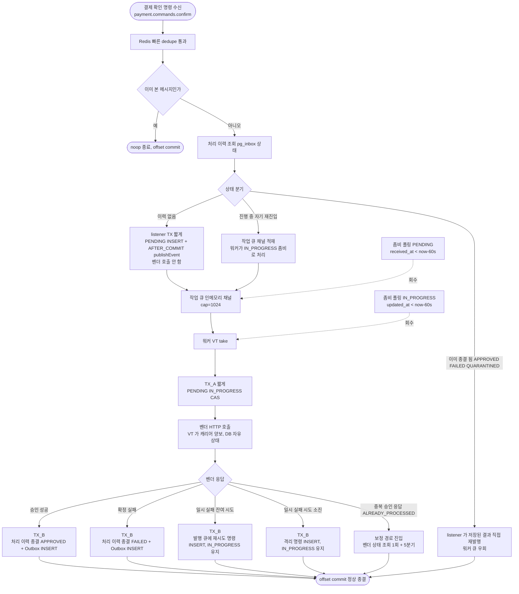
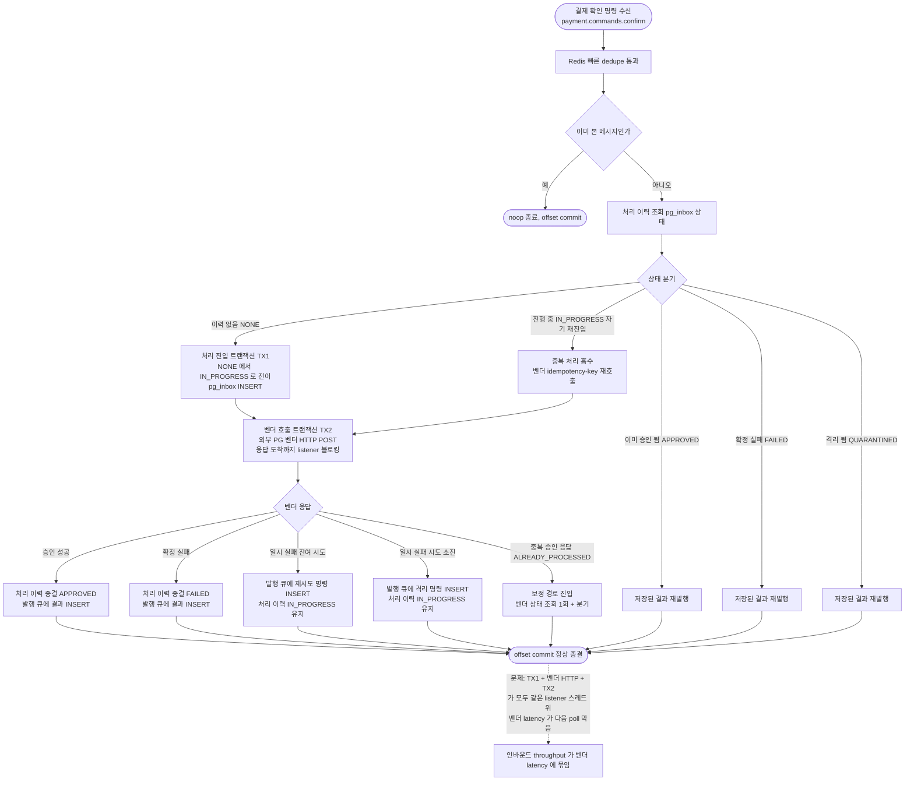
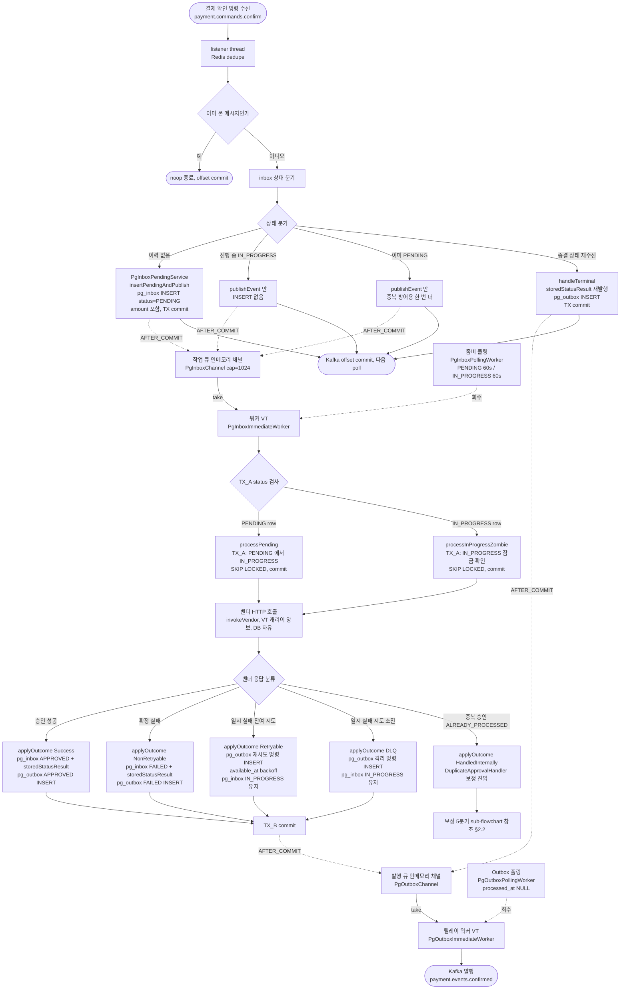
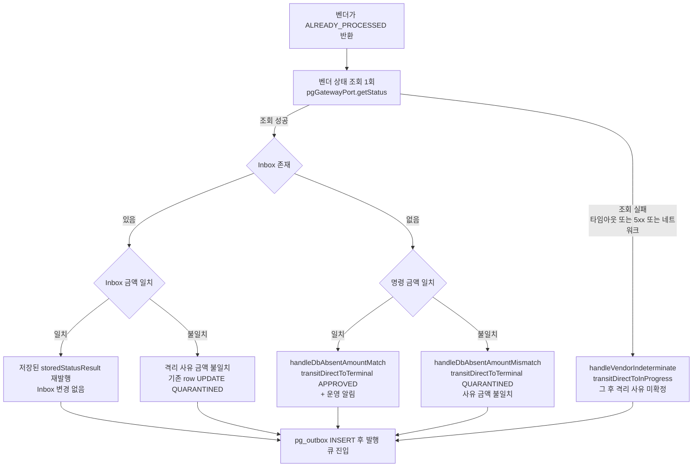

# PG-CONFIRM-LISTENER-SPLIT — 사전 브리핑 (Baseline 0)

> 토픽 시작: 2026-05-09
> 이슈: #73
> 브랜치: `#73`
> 단계: discuss 종결 (Round 2 critic + domain 둘 다 pass) → plan 진입 대기

---

## 요약 브리핑

### 결정된 접근

위키 `pg-confirm-flow.md` 가 봉인한 **listener / 워커 VT / 발행 릴레이 3단 분리** 를 코드에 그대로 정합한다. listener 는 `pg_inbox PENDING INSERT + AFTER_COMMIT 채널 적재 + Kafka ack` 까지만 책임지고, 별도 워커 VT 풀이 인메모리 채널에서 take 해 TX_A (`PENDING → IN_PROGRESS` CAS) → 벤더 HTTP → TX_B (종결 + Outbox INSERT) 순으로 진행한다. 좀비 폴링이 PENDING / IN_PROGRESS 두 경로로 회수해 채널 휘발 + 워커 크래시 시 RDB SoT 가 회복한다.

`pg_inbox` 의 `NONE` 상태는 폐기하고 `PENDING` 을 신규 추가해 위키 stateDiagram (`[*] --> PENDING`) 에 정합. 보정 경로 (`DuplicateApprovalHandler`) 는 PENDING 우회 후 직접 종결 / IN_PROGRESS 로 신설해 무한 루프 위험을 차단한다. terminal 재수신 (이미 종결된 결제의 자기 재배달) 은 listener 가 직접 outbox 재발행 — latency 우위.

### 변경 후 보상 흐름 (전체 경로 — to-be)



### 핵심 결정 ID

- **§1.1** — listener 책임 축소. 신규 `PgInboxPendingService.insertPendingAndPublish` `@Transactional(REQUIRED, timeout=5)` 가 PENDING INSERT + publishEvent 묶음
- **§1.2** — 작업 큐 신규 `PgInboxChannel` (`LinkedBlockingQueue<InboxJob>` cap=1024)
- **§1.3** — 워커 VT 신규 `PgInboxImmediateWorker` (워커 5개 baseline)
- **§1.4** — 좀비 폴링 신규 `PgInboxPollingWorker` (PENDING / IN_PROGRESS 두 경로, 60s 통일, 5s 주기, 새 root span)
- **§1.5** — `PgInboxStatus` 변경. PENDING 추가 + NONE 폐기 (위키 stateDiagram 정합)
- **§1.6** — 워커 처리자 두 진입점 `processPending(inboxId)` + `processInProgressZombie(inboxId)` 분리. 신규 입력 포트 `PgInboxProcessUseCase`
- **§1.7** — 위키 갱신 폭. `pg-confirm-flow.md` 본문 (listener 책임 정의 + terminal 재수신 직접 처리 + 보정 경로 PENDING 우회 + 폴링 traceparent) + `outbox-channel-dispatch.md` (작업 큐 + 발행 큐 2개 채널)
- **§1.8** — 보정 경로 (`DuplicateApprovalHandler`) PENDING 우회 룰 봉인. 신규 repo 메서드 4종 (`insertPending` / `transitDirectToInProgress` / `transitDirectToTerminal` / `transitPendingToInProgress`)
- **§1.9** — Spring Kafka 인프라 부속 결정 (config 변경 0, listener factory wiring 유지)

### 트레이드오프 / 후속 작업

- **받아들이는 trade-off** — 인메모리 채널 휘발성 (RDB SoT 가 폴링 폴백 보장), 측정 없는 baseline (좀비 임계 60s / 워커 5 / 채널 cap 1024), 좀비 폴링 회수는 새 root span (원 traceparent 연결은 PHASE2)
- **PHASE2 (별 토픽)** — 워커 VT 풀 / 채널 cap / 좀비 임계 측정 정밀화, 멀티 인스턴스 worker concurrency 검증, polling 회수 traceparent 연결, DLQ 처리 정책 (TQ-1), TC-13 (payment-service confirmed consumer EOS)
- **회귀 surface** — listener / 워커 / 채널 / 폴링 / `DuplicateApprovalHandler` 의 호출처 인벤토리 — port 시그니처 변경이 컴파일 에러로 즉시 감지

---

## 사전 브리핑

### 현재 이해한 문제

PG 결제 확인 메시지 1건이 도착하면 컨슈머 listener 스레드 안에서 RDB 트랜잭션 두 개와 외부 PG 벤더 HTTP 호출이 모두 순차 진행된다. 벤더 호출이 느려질수록 listener 가 다음 메시지를 가져오지 못하고, 결국 인바운드 처리량이 벤더 latency 에 직접 묶인다. 위키 `pg-confirm-flow.md` 는 이 책임을 listener / 워커 / 발행 릴레이 세 단계로 쪼갠 분리 안을 봉인했지만 코드는 합쳐서 처리하는 상태로 남아 있다.

### 현재 시스템 동작 (as-is)



### 이번 discuss 에서 결정하려는 것

- listener 와 벤더 호출 워커 사이의 **책임 경계** — listener 가 어디까지 동기로 처리하고 어디부터 비동기 워커에 넘기는가
- **처리 이력 상태 머신 변경** — 신규 PENDING 상태를 추가할 것인지, 다른 방식 (별 컬럼 / 별 테이블) 으로 표현할 것인지
- **인메모리 채널 vs 다른 핸드오프** — 위키가 그리는 작업 큐 인메모리 채널 그대로 갈지, 다른 메커니즘 (DB 폴링 단독 / 별 메시지 / Reactive 등) 도 검토할지
- **좀비 회수 임계** — PENDING 좀비 / IN_PROGRESS 좀비 두 경로의 임계 시간을 측정 없이 baseline 으로 잡을지, 다른 정책으로 갈지
- **기존 pg-service Outbox 발행 메커니즘과의 정합** — 이미 위키와 정합한 발행 측 채널 (`PgOutboxImmediateWorker` + 폴링) 패턴을 작업 큐에 그대로 재사용할지

### 열린 질문 / 가정

- listener 의 INSERT 트랜잭션이 짧아도 같은 메시지가 같은 partition 으로 자주 들어오면 contention 가능 — 측정 없이 가정만 가능
- 워커 VT 풀 크기 / 채널 capacity 는 본 토픽 단독 결정 범위 안인지 PHASE2 부하 측정 후 정밀화인지
- `DuplicateApprovalHandler` 의 ALREADY_PROCESSED 보정 경로가 listener 분리 안에서도 그대로 작동하는지 (워커 크래시 후 좀비 회수 시 벤더 재호출 → 멱등성 응답 → 보정)
- 위키의 다른 페이지 (`outbox-channel-dispatch.md`) 갱신 폭이 본 토픽 plan 범위에 들어가는지

---

## 배경

위키 `pg-confirm-flow.md` 는 PG 결제 확인 처리 흐름이 **listener / 워커 VT / 릴레이 워커 3단 분리** 로 봉인되어 있다. 페이지 상단에 "도메인 설계 의도 기준, 현재 코드는 일부 단계가 합쳐져 있음" 노티까지 명시되어 있다. 그러나 현재 코드는 listener thread 안에서 TX1 + 벤더 HTTP + TX2 가 같은 스레드 위에서 순차 진행 — 벤더 latency 가 인바운드 throughput 에 직접 묶인다.

`docs/context/TODOS.md` TC-14 항목으로 등록된 위키-코드 sync 잔여 갭 중 하나. 직전 토픽 STOCK-COMPENSATION-RECOVERY (PR #72, 2026-05-08) 가 payment-service 측 위키-코드 sync 를 끝낸 직후, 본 토픽이 pg-service 측 정합을 잡는다.

---

## 위키가 묘사하는 분리 안 (봉인된 진실원)

```
1. listener thread — Inbox 시그널 INSERT + ack 까지만
   - Redis dedupe (markSeen) 통과 후 INSERT pg_inbox status=PENDING
   - AFTER_COMMIT 으로 InboxReadyEvent(inboxId) 채널에 적재
   - Kafka offset commit + 다음 poll
   - 벤더 호출 안 함

2. 작업 큐 (인메모리 채널) — 워커 VT 가 take

3. 워커 VT — TX_A → 벤더 HTTP → TX_B
   - TX_A: SELECT FOR UPDATE SKIP LOCKED + status=IN_PROGRESS UPDATE 후 즉시 commit (lock 해제)
   - 벤더 HTTP (블로킹, VT 라 캐리어 양보)
   - TX_B: Inbox UPDATE (APPROVED + storedStatusResult) + Outbox INSERT (events.confirmed) + AFTER_COMMIT publishEvent

4. 발행 큐 (인메모리 채널) — 릴레이 워커 VT 가 take

5. 릴레이 워커 VT — Kafka send + processed_at = now (별도 TX)
```

**폴백 경로**:
- Inbox PENDING 좀비: `WHERE status=PENDING AND received_at < now-Ns` 폴링 회수
- Inbox IN_PROGRESS 좀비: `WHERE status=IN_PROGRESS AND updated_at < now-60s` 폴링 회수 — 벤더 idempotency-key + `DuplicateApprovalHandler` 가 중복 흡수
- Outbox processed_at NULL: 폴링 회수 → 재발행

---

## 현재 코드 (합쳐서 처리)

`pg-service/.../application/service/PgConfirmService.java`:
- `handleNone` 안에서 TX1 (`transitNoneToInProgress`) → TX2 (`callVendor`) 가 같은 listener thread 위에서 순차 진행
- TX2 안에서 벤더 HTTP + Outbox INSERT + Inbox 종결 모두 수행

`pg-service/.../application/service/PgVendorCallService.java` — 단일 TX2 안에 벤더 호출 + 결과 반영 합쳐서 처리.

`pg-service/.../infrastructure/messaging/consumer/PaymentConfirmConsumer.java` — listener 진입점. 현재 listener thread 가 TX1 + TX2 + 벤더 호출 다 직접 호출.

`pg_inbox` 의 status enum 에 PENDING 상태가 **없다** — 분리 안 도입 시 신규 상태 추가 필요.

---

## 본 토픽 목표

위키의 분리 안을 코드에 정합. 즉:

1. **listener 책임 축소** — `INSERT pg_inbox status=PENDING + Kafka ack` 까지만. 벤더 호출 안 함.
2. **작업 큐 도입** — listener 가 AFTER_COMMIT 으로 inboxId 를 인메모리 채널에 적재. 별도 워커 VT 가 take.
3. **워커 VT 가 TX_A → 벤더 HTTP → TX_B 진행** — 가운데 벤더 호출이 끼므로 한 TX 로 묶지 않는다.
4. **좀비 폴링 도입** — `WHERE status=PENDING AND received_at < now-Ns` + `WHERE status=IN_PROGRESS AND updated_at < now-60s` 두 경로.
5. **위키 다른 페이지 갱신** — `outbox-channel-dispatch.md` 가 분리 안 적용 시 작업 큐 + 발행 큐 채널 2개로 본문 갱신 필요 (현재는 발행 큐 1개 기준).

---

## 비교 효과

| 축 | 현재 (합쳐서 처리) | 분리 안 (위키) |
|---|---|---|
| listener 책임 | TX1 + 벤더 + TX2 | INSERT + ack 까지만 |
| 벤더 latency 영향 | 인바운드 throughput 에 직접 영향 | 워커 VT 풀에 격리 |
| `max.poll.interval.ms` 위험 | 벤더 latency × poll 수 | listener 가 가벼워 안전 |
| 동시 처리 수 통제 | listener concurrency | 워커 VT 풀 + DB connection pool |
| 좀비 회수 | 단일 경로 | PENDING + IN_PROGRESS 두 경로 |
| 발행 측 채널 | 1개 (Outbox) | 1개 (Outbox) — 변경 없음. 단 작업 큐 추가 |

---

## 검토 필요 사항 (discuss 입력)

1. **`pg_inbox` status enum 에 PENDING 추가** — 신규 상태. Flyway migration 1건. 기존 `NONE → IN_PROGRESS → APPROVED/FAILED/QUARANTINED` 에 PENDING 진입 추가.
2. **listener vs 워커 책임 경계 정밀화** — listener 의 `INSERT pg_inbox` TX 안에 AFTER_COMMIT 채널 적재까지. 채널 가득 시 폴백 폴링이 회수.
3. **워커 VT 풀 크기** — 동시 처리 수 통제 변수. yml 설정 키.
4. **좀비 회수 임계** — PENDING (수십 초?) / IN_PROGRESS (60s, 벤더 timeout × 2) — 측정 기반 결정 또는 baseline 채택.
5. **PgConfirmService.handleNone 의 분기 보존** — 현재 NONE / IN_PROGRESS self-loop / APPROVED 재수신 / FAILED 재수신 / QUARANTINED 재수신 처리. 분리 안에서 어느 단계가 어느 분기를 처리하는지.
6. **`DuplicateApprovalHandler` 와 좀비 회수 정합** — 워커 크래시 후 재진입 시 벤더 재호출 → `ALREADY_PROCESSED` → 보정 경로. 위키 분리 안에 명시.
7. **위키 다른 페이지 (`outbox-channel-dispatch.md`) 갱신** — 발행 측 채널 1개 → 작업 큐 + 발행 큐 2개 로 본문 갱신.

---

## non-goal (본 토픽 범위 외)

- PG 벤더 자체 정책 변경 (Toss / NicePay / Fake 어댑터 변경 0)
- `pg_outbox` 의 발행 측 채널 메커니즘 변경 (이미 위키와 정합 — `PgOutboxChannel` + `PgOutboxImmediateWorker` + `PgOutboxPollingWorker`)
- payment-service 측 변경 0
- DLQ 처리 정책 변경 (TQ-1 별 토픽)

---

## 관련 위키

- `pg-confirm-flow.md` — 메인 (분리 안 봉인)
- `outbox-channel-dispatch.md` — 분리 안 적용 시 작업 큐 + 발행 큐 채널 2개로 본문 갱신 필요

## 관련 코드

- `pg-service/src/main/java/.../application/service/PgConfirmService.java`
- `pg-service/src/main/java/.../application/service/PgVendorCallService.java`
- `pg-service/src/main/java/.../infrastructure/messaging/consumer/PaymentConfirmConsumer.java`
- `pg-service/src/main/java/.../domain/PgInbox.java` (status enum)
- `pg-service/src/main/java/.../infrastructure/repository/PgInboxRepositoryImpl.java`
- `pg-service/src/main/java/.../application/service/DuplicateApprovalHandler.java`
- `pg-service/src/main/java/.../infrastructure/scheduler/PgOutboxImmediateWorker.java` (참조 패턴)
- `pg-service/src/main/java/.../infrastructure/scheduler/PgOutboxPollingWorker.java` (참조 패턴)
- `pg-service/src/main/java/.../infrastructure/channel/PgOutboxChannel.java` (참조 패턴)

---

## §1. 채택안 골격 (Round 2 갱신)

위키 `pg-confirm-flow.md` 가 봉인한 분리 안의 컴포넌트별 결정. Round 0 ledger 의 가정 8건을 각 컴포넌트의 결정으로 승격하고, 기존 `pg_outbox` 발행 측 패턴 (`PgOutboxChannel` + `PgOutboxImmediateWorker` + `PgOutboxPollingWorker`) 을 그대로 거울로 삼아 작업 큐 측에 재사용한다.

**Round 2 신설/갱신 항목**:
- §1.1 — listener TX 경계 봉인 (`PgInboxPendingService.insertPendingAndPublish`) — D-F3 흡수
- §1.4 — PENDING 좀비 임계 60s 통일 + traceparent 정책 명시 — D-F4 / D-F5 흡수
- §1.5 — `NONE` 폐기 단일화 (안 B 기각) — C-F4 흡수
- §1.6 — 안 B 단일 채택 + `processPending` / `processInProgressZombie` 두 진입점 분리 봉인 — C-F5 흡수
- §1.7 — `pg-confirm-flow.md` 본문 갱신 폭 확장 — D-F2 흡수
- §1.8 — 신설: 보정 경로 PENDING 우회 룰 봉인 + 신규 repo 메서드 시그니처 — C-F3 / D-F1 흡수
- §1.9 — trade-off + 알려진 한계 (Round 2 신규 결정 반영)
- §2 / §3 / §4 / §7 / §8 — 각 섹션에 Round 2 흡수 매핑

### 1.1 listener 책임 (`PaymentConfirmConsumer`)

**현재**: `consume` → `PgConfirmCommandService.handle(command, attempt)` 위임 → `PgConfirmService.handle` 안에서 dedupe + 5상태 분기 (`handleNone` / `handleInProgress` / `handleTerminal`) + `handleNone` 안에서 `transitNoneToInProgress` (INSERT + IN_PROGRESS 한 번) + `callVendor` 까지 같은 listener thread.

**변경**:
- listener thread 는 dedupe (Redis markSeen) + 분기 결정 + **`pg_inbox` INSERT (status=PENDING) 또는 분기별 짧은 작업** + AFTER_COMMIT 채널 적재 + Kafka offset commit 까지만.
- **벤더 HTTP 호출 안 함**.
- 분기별 listener 책임:
  - **inbox 부재 (이력 없음)** — `INSERT pg_inbox status=PENDING` (amount 포함). AFTER_COMMIT 으로 `PgInboxReadyEvent(inboxId)` 채널 적재. **입력 골격의 핵심 변경점**.
  - **`IN_PROGRESS` 자기 재진입** — self-loop / 동시 race. 분리 안에서 listener 는 벤더 호출 안 함 → 채널 적재만 (§1.6 안 B 채택. 워커가 동일 inboxId 받으면 TX_A SKIP LOCKED 가 IN_PROGRESS row 도 take, 또는 `processInProgressZombie` 진입점이 별도 처리 — 결정은 §1.6 봉인).
  - **종결 상태 재수신 (APPROVED / FAILED / QUARANTINED)** — `handleTerminal` 의 `storedStatusResult` 재발행 (`pg_outbox` INSERT). 벤더 호출 없음 → listener 가 직접 처리 (§1.6 안 B 채택). 위키 본문 (`pg-confirm-flow.md`) 도 같은 표기로 갱신 (§1.7 참조).

**layer 위치**: `PaymentConfirmConsumer` 는 `infrastructure/messaging/consumer/` 그대로. 분기 결정 / dedupe 호출 / `pg_inbox` INSERT 트리거는 `application/service/` 의 use case 가 책임. `PgConfirmCommandService` (presentation port — 입력 포트로 분류된 인터페이스) 의 계약을 유지하면서 구현체 (`PgConfirmService`) 의 분기 의미를 재정의한다.

**listener TX 경계 (Round 2 봉인)** — D-F3 흡수:
- listener 측 `INSERT pg_inbox status=PENDING + AFTER_COMMIT publishEvent` 의 TX 경계는 신규 application service `PgInboxPendingService.insertPendingAndPublish` 한 메서드에 봉인한다.
- 위치: `application/service/PgInboxPendingService.java` (신규).
- 시그니처: `@Transactional(propagation = REQUIRED, timeout = 5)` 로 `(orderId, amount, eventUuid, vendorType, paymentKey)` 입력. 메서드 안에서:
  1. `pgInboxRepository.insertPending(...)` 호출 — 같은 TX 위에서 `pg_inbox.status=PENDING` 로 INSERT. `order_id` UNIQUE 충돌 시 (동시 listener race) IGNORE 후 select 로 inboxId 회수.
  2. 같은 TX 위에서 `applicationEventPublisher.publishEvent(new PgInboxReadyEvent(inboxId))` 호출.
  3. AFTER_COMMIT 단계에서 `InboxReadyEventHandler` (infrastructure/listener) 가 `PgInboxChannel.offerNow` 호출 → 채널 적재.
- 사유: publishEvent 가 active TX 외부에서 호출되면 `@TransactionalEventListener(AFTER_COMMIT)` 등록 안 됨 → 채널 적재 0 → 폴링이 5s 주기로 회수 (silent latency 5s). 정합성은 살아있지만 정상 흐름의 의미가 다르다 (`docs/context/PITFALLS.md` §3 짝패턴).
- timeout 5s 채택: `docs/context/CONVENTIONS.md` §"Kafka consumer 진입 (짧은 작업)" 룰 — listener TX 는 짧은 INSERT 1건 + publishEvent 1건이라 50ms 안쪽 정상 처리. timeout=5s 는 GC pause / Hikari 대기 마진 + Kafka `max.poll.interval.ms` 안에 들어옴.

**layer 룰 관점**: listener 가 INSERT + ack 까지만 하기 위해 application 의 새 입력 포트가 필요하다 — 현재 `PgConfirmCommandService.handle(command, attempt)` 1개 메서드. 분리 후 `handle` 의 책임이 "분기 결정 → `PgInboxPendingService.insertPendingAndPublish` 호출 또는 분기별 처리" 로 재정의되지만 메서드 시그니처 자체는 유지 가능. **listener 코드 (`PaymentConfirmConsumer`) 는 변경 없음**, 변경은 application 안쪽에서 일어난다 (port 안정 + 어댑터 안정 = 좋은 경계).

### 1.2 작업 큐 채널 (신규 — `PgInboxChannel`)

**위치**: `pg-service/.../infrastructure/channel/PgInboxChannel.java` (기존 `PgOutboxChannel.java` 옆).

**구조** — `PgOutboxChannel` 패턴 1:1 거울:
- `LinkedBlockingQueue<InboxJob>` (cap=1024, 동등 baseline)
- `offerNow(Long inboxId)` → 호출 시점 `Context.current()` + `ContextSnapshotFactory.captureAll()` 로 OTel + MDC 캡처해 `InboxJob` 동봉
- `take()` → 워커 VT 가 호출
- `size()` / `isNearFull()` 메트릭 게이지

**`InboxJob`** (신규 record):
- 위치: `pg-service/.../infrastructure/channel/InboxJob.java` (기존 `OutboxJob.java` 옆)
- 필드: `Long inboxId`, `io.opentelemetry.context.Context otelContext`, `io.micrometer.context.ContextSnapshot snapshot`
- `OutboxJob` 과 같은 record 시그니처 — outboxId 가 inboxId 로 바뀐 것뿐. 코드 중복 우려는 의도적 — 작업 큐와 발행 큐의 의미가 다르므로 record 를 공유하지 않는다 (삭제·교체 비용 관점에서 분리 유지가 우선).

**yml 설정**:
- `pg.inbox.channel.capacity` (기본 1024)
- 메트릭 이름: `pg_inbox_channel_queue_size`, `pg_inbox_channel_remaining_capacity` (`pg_outbox_*` 와 같은 명명 규칙)

### 1.3 워커 VT (`PgInboxImmediateWorker`)

**위치**: `pg-service/.../infrastructure/scheduler/PgInboxImmediateWorker.java` (기존 `PgOutboxImmediateWorker.java` 옆).

**구조** — `PgOutboxImmediateWorker` 패턴 1:1 거울:
- `SmartLifecycle` 구현 — `start()` 에서 VT 워커 N개 기동, `stop()` 에서 interrupt + awaitTermination(10s)
- `getPhase()` = `Integer.MAX_VALUE - 100` (채널보다 나중에 stop, drain 보장)
- `relayExecutor` = `ContextAwareVirtualThreadExecutors.newWrappedVirtualThreadExecutor()` — 기존 헬퍼 재사용
- `workerLoop` → `channel.take()` → `relayExecutor.submit(() -> processWithContext(job))`
- `processWithContext` 안에서 `job.snapshot().setThreadLocals()` + `job.otelContext().makeCurrent()` 이중 try-with-resources scope → `PgInboxProcessUseCase` 호출

**처리자 진입점 두 종 (§1.6 봉인)**:

워커는 `PgInboxProcessUseCase` 의 두 메서드를 호출. status 검사 조건만 다르고 TX_A → 벤더 → TX_B 사이클은 동일. 어느 쪽을 호출할지는 `InboxJob` 가 담은 inboxId 의 row status 가 결정 — 단, 정상 흐름의 채널 적재는 PENDING / IN_PROGRESS 양쪽 모두 가능하므로 워커 진입 시 status 를 먼저 SELECT 후 분기 (또는 두 진입점을 차례로 시도, 0 row 면 다음으로).

**`processPending(inboxId)` 흐름** — 정상 흐름의 신규 진입 / PENDING 자기 재배달 / PENDING 좀비 회수:

1. **TX_A** (`@Transactional` 단독, application layer):
   - `SELECT pg_inbox FOR UPDATE SKIP LOCKED WHERE id=? AND status=PENDING`
   - 0 row → 다른 워커 선점 / 이미 처리됨 → return (정상 종료)
   - 1 row → `UPDATE status=IN_PROGRESS, updated_at=now`
   - TX_A commit (lock 즉시 해제)
2. **벤더 HTTP** (TX 밖, VT 라 캐리어 양보, DB 자유 상태):
   - `PgVendorCallService.invokeVendor(request)` 호출 → `GatewayOutcome` 반환
3. **TX_B** (`@Transactional` 단독):
   - `PgVendorCallService.applyOutcome(outcome, request, attempt, now)` 안에서 5분기 (Success / Retryable / NonRetryable / HandledInternally / DLQ) 처리
   - `pg_inbox` UPDATE + `pg_outbox` INSERT + AFTER_COMMIT `PgOutboxReadyEvent` publishEvent
   - TX_B commit

**`processInProgressZombie(inboxId)` 흐름** — IN_PROGRESS 자기 재배달 / IN_PROGRESS 좀비 회수:

1. **TX_A** (`@Transactional` 단독):
   - `SELECT pg_inbox FOR UPDATE SKIP LOCKED WHERE id=? AND status=IN_PROGRESS`
   - 0 row → 다른 워커 선점 / 이미 종결 → return (정상 종료)
   - 1 row → `updated_at=now` 갱신만 (status 는 IN_PROGRESS 유지)
   - TX_A commit
2. **벤더 HTTP** (TX 밖) — `PgVendorCallService.invokeVendor` (멱등성 layer 3종 의존, 응답 ALREADY_PROCESSED 가능)
3. **TX_B** (`@Transactional` 단독) — `applyOutcome` 안에서 5분기 처리. ALREADY_PROCESSED 응답 시 `DuplicateApprovalHandler` 보정 경로 (§1.8 — 기존 row 가 IN_PROGRESS 라 부재 분기 안 탐, 금액 일치 분기로 종결)

**예외 처리**:
- TX_A 0 row → return (선점 / 종결 흡수, 정상)
- 벤더 RuntimeException → TX_B 미진입 → `pg_inbox` 가 `IN_PROGRESS` 잔존 → 좀비 폴링 (1.4) 회수 → 재진입 시 `processInProgressZombie` 진입 → `DuplicateApprovalHandler` 의 ALREADY_PROCESSED 보정 경로 적용
- TX_B commit 실패 → 동일 (IN_PROGRESS 잔존)
- worker loop 에서 RuntimeException 포획 → ERROR 로그 + 카운터 increment, 워커 자체는 죽지 않음

**yml 설정**:
- `pg.inbox.channel.worker-count` (기본 5 — `PgOutboxImmediateWorker` 의 기본값 1 보다 큼. 사유: 벤더 HTTP latency 가 큰 작업이라 동시 처리 수가 발행 측보다 더 필요. baseline 으로 5 채택, PHASE2 측정 정밀화)

**메트릭**:
- `pg_inbox.process_fail_total` 카운터 (워커 RuntimeException)

### 1.4 좀비 폴링 (`PgInboxPollingWorker`)

**위치**: `pg-service/.../infrastructure/scheduler/PgInboxPollingWorker.java` (기존 `PgOutboxPollingWorker.java` 옆).

**구조** — `PgOutboxPollingWorker` 패턴 거울이지만 **두 회수 경로**:
- `@Scheduled(fixedDelayString = "${pg.scheduler.inbox-polling-worker.fixed-delay-ms:5000}")` (5초 주기 — `pg_outbox` 폴링 2초보다 길게. 좀비 회수는 즉시성 요구가 낮고, 정상 흐름은 채널 + 즉시 워커가 처리)
- `poll()` 안에서 두 경로 분리:
  - **PENDING 좀비 회수**:
    - `findPendingZombies(batchSize, threshold)` — `WHERE status=PENDING AND received_at < now - INTERVAL Ns FOR UPDATE SKIP LOCKED`
    - 회수 시: 워커의 `processPending(inboxId)` 메서드 직접 호출 — 채널 우회 (§1.6 결정). 채널에 다시 넣으면 정상 흐름과 경합 + TX_A SKIP LOCKED 가 race 차단하나 cycle 낭비
    - threshold yml: `pg.scheduler.inbox-polling-worker.pending-timeout-ms` (기본 **60000**, IN_PROGRESS 와 동일 — Round 2 D-F4 흡수)
  - **IN_PROGRESS 좀비 회수**:
    - `findInProgressZombies(batchSize, threshold)` — `WHERE status=IN_PROGRESS AND updated_at < now - INTERVAL 60s FOR UPDATE SKIP LOCKED`
    - 회수 시: 워커의 `processInProgressZombie(inboxId)` 메서드 직접 호출 (§1.6 결정 — TX_A 가 `status=IN_PROGRESS` row 만 잠금 후 벤더 재호출 → ALREADY_PROCESSED 응답 → `DuplicateApprovalHandler` 보정 경로 또는 정상 종결)
    - threshold yml: `pg.scheduler.inbox-polling-worker.in-progress-timeout-ms` (기본 60000 — 위키 인용 "벤더 timeout × 2")

**PENDING / IN_PROGRESS 임계 통일 사유 (Round 2)**:
- 위키 `pg-confirm-flow.md` line 224 baseline 은 "벤더 호출 timeout × 2 정도가 안전" — IN_PROGRESS 기준 60s. PENDING 임계도 같은 baseline 채택.
- 부하 시나리오: 채널 cap=1024 가득 + 워커 5개 모두 벤더 응답 대기 + 벤더 read-timeout 10s 시 워커 한 cycle 평균 5×3s = 15s, 피크 시 5×10s = 50s. 30s baseline 은 정상 처리 중인 PENDING 도 회수 cycle 발동 → cycle 낭비. 60s 통일이 baseline 안전.
- PHASE2 측정 정밀화 (§6) 항목에 PENDING / IN_PROGRESS 비대칭성 검증 추가.

**좀비 폴링 traceparent 정책 (Round 2 D-F5 흡수)**:
- `PgInboxPollingWorker` 의 `@Scheduled` 진입은 OTel **새 root span** 으로 시작. 좀비 회수가 메시지 1건씩 가지고 있는 inboxId 만으로는 원 Kafka message 의 traceparent 와 이어붙일 수 없다.
- 정상 흐름 (`InboxJob` 동봉 캡처 + 워커 복원) 과 의도적으로 다른 컨텍스트 정책 — `outbox-channel-dispatch.md` 의 발행 측 폴링 워커 패턴과 동일 결정.
- 본 토픽 범위 외: Kafka headers 의 원 traceparent 를 RDB 에 stored_traceparent 로 보관 후 폴링 회수 시 이어붙이기 — PHASE2 (§6) 로 명시 deferred. PITFALLS §12 (Virtual Thread / Async 경계 MDC 손실) 정합.
- 위키 `pg-confirm-flow.md` 갱신 본문에도 같은 한 줄 명시 (§1.7 참조).

**SoT 보장**: 인메모리 채널은 휘발성. RDB `pg_inbox` 가 SoT — JVM 재시작 / 채널 가득참 / 워커 크래시 어디서 죽어도 폴링 회수 보장.

**yml 설정 인덱스**:

| 키 | 기본값 | 의미 |
|---|---|---|
| `pg.inbox.channel.capacity` | 1024 | 채널 큐 capacity |
| `pg.inbox.channel.worker-count` | 5 | 즉시 워커 VT 수 |
| `pg.scheduler.inbox-polling-worker.fixed-delay-ms` | 5000 | 좀비 폴링 주기 |
| `pg.scheduler.inbox-polling-worker.batch-size` | 10 | 폴링 한 번에 회수할 row 수 |
| `pg.scheduler.inbox-polling-worker.pending-timeout-ms` | **60000** | PENDING 좀비 임계 (벤더 timeout × 2 — Round 2 IN_PROGRESS 와 통일) |
| `pg.scheduler.inbox-polling-worker.in-progress-timeout-ms` | 60000 | IN_PROGRESS 좀비 임계 (벤더 timeout 30s × 2) |

### 1.5 `pg_inbox` status enum + Flyway migration

**도메인 변경** — `PgInboxStatus`:
- 신규 상태: `PENDING` 추가
- 의미: listener 가 INSERT 한 직후 워커가 take 하기 전 — 명시적 작업 대기 상태
- 기존 4 종결 / 진행 상태 (`IN_PROGRESS / APPROVED / FAILED / QUARANTINED`) 와 동등 layer. `NONE` 은 폐기 (아래)
- `isTerminal()` 가드: PENDING 은 non-terminal (변경 없음)

**`NONE` 폐기 (Round 2 봉인, C-F4 흡수)**:
- 위키 SoT (`pg-confirm-flow.md` stateDiagram line 117 `[*] --> PENDING`) 가 NONE 미언급 — Round 1 의 안 B (NONE 보존) 는 위키 SoT 비정합으로 **기각**.
- 단일 채택: **안 A — `NONE` enum 폐기**. listener INSERT 시 `PENDING` 으로 시작. row 미존재 의미는 `Optional<PgInbox>` 부재로만 표현.
- 영향 받는 호출처:
  - `PgConfirmService.handleNone` — 의미상 `handleAbsent` 로 rename. `transitNoneToInProgress` 호출 → `PgInboxPendingService.insertPendingAndPublish` 로 변경 (§1.1 봉인).
  - `DuplicateApprovalHandler.handleDbAbsentAmountMatch` / `handleDbAbsentAmountMismatch` / `handleVendorIndeterminate` — 보정 경로 전용 신규 repo 메서드 사용 (§1.8 봉인).
- 운영 데이터 부재 → 단일 Flyway migration 안전 (§4.2).

**Flyway migration**:
- 위치: `pg-service/src/main/resources/db/migration/V<N>__add_pg_inbox_pending_status.sql`
- 변경: `pg_inbox.status` ENUM 컬럼에 `PENDING` 추가 + `NONE` 제거 (단일 migration)
- 운영 데이터 영향: 현재 dev / test / benchmark 환경만 — 운영 데이터 부재 (§검증 plan 4.2)

### 1.6 `PgConfirmService` 분기 재배치 (Round 2 봉인)

**현재 `processCommand` 5 분기** (위 §사전 브리핑 다이어그램 참조):
1. inbox 부재 → `handleNone` → `transitNoneToInProgress` (INSERT + IN_PROGRESS) → `callVendor`
2. `IN_PROGRESS` 자기 재진입 → `handleInProgress` → `callVendor` (3단 멱등성 layer 의존)
3. terminal 재수신 (APPROVED / FAILED / QUARANTINED) → `handleTerminal` → `storedStatusResult` 재발행

**채택 (Round 2 단일화) — 안 B**: listener 가 분기 판단 후 신규 진입 / IN_PROGRESS 재진입은 채널, terminal 재수신은 listener 가 직접 처리.

| 진입 분기 | listener 책임 | 워커 책임 |
|---|---|---|
| inbox 부재 | `PgInboxPendingService.insertPendingAndPublish` (INSERT PENDING + AFTER_COMMIT publishEvent) | `processPending(inboxId)` — TX_A → 벤더 → TX_B |
| `PENDING` 재수신 | AFTER_COMMIT publishEvent (중복 방어 — 채널은 멱등 흡수, TX_A SKIP LOCKED 가 중복 처리 0 보장) | `processPending(inboxId)` |
| `IN_PROGRESS` 재진입 | AFTER_COMMIT publishEvent (기존 inboxId) | `processInProgressZombie(inboxId)` — TX_A → 벤더 재호출 → TX_B (멱등성 3단 layer + `DuplicateApprovalHandler` 흡수) |
| terminal 재수신 | listener 안의 application use case 가 직접 `storedStatusResult` 재발행 (벤더 호출 안 함 → 워커 큐 대기 의미 없음) | — |

**채택 사유**:
- terminal 재수신은 본질적으로 벤더 호출 안 함 → 워커 큐 대기 의미 없음. latency 우위.
- listener `application use case` (= `PgConfirmCommandService` 구현 = `PgConfirmService`) 안에서 분기는 이미 존재 (`handleTerminal`), Layer 룰 침범 없음 (application 안쪽 분기일 뿐, listener 자체는 dedupe + use case 호출만).
- 워커는 `PENDING / IN_PROGRESS` 두 status 만 다루면 됨 — 두 메서드 분리 (`processPending` / `processInProgressZombie`) 로 의도 명료.
- 단점 인정: listener 진입 분기 두 갈래 (채널 / 직접) — 응집도 약화. **위키 본문 (`pg-confirm-flow.md`) 갱신 필수** (§1.7 — D-F2 흡수).

**워커 처리자 시그니처 봉인 (Round 2 — C-F5 흡수)**:

`PgInboxImmediateWorker` 가 호출하는 application 메서드는 두 진입점으로 분리 — 단일 메서드 + status 분기보다 의도가 명확하고 위키 sequence diagram (line 169 `WHERE status=PENDING` 만 검사) 정합 유지.

| 메서드 | TX_A 검사 조건 | 호출처 |
|---|---|---|
| `processPending(Long inboxId)` | `WHERE id=? AND status=PENDING FOR UPDATE SKIP LOCKED` | `PgInboxImmediateWorker` (정상 흐름) + `PgInboxPollingWorker` (PENDING 좀비 회수) |
| `processInProgressZombie(Long inboxId)` | `WHERE id=? AND status=IN_PROGRESS FOR UPDATE SKIP LOCKED` | `PgInboxImmediateWorker` (IN_PROGRESS 자기 재진입 채널 적재 시) + `PgInboxPollingWorker` (IN_PROGRESS 좀비 회수) |

- 두 메서드 모두 TX_A → 벤더 호출 → TX_B 같은 3-phase 사이클. status 검사 조건만 다름.
- TX_A 0 row → 정상 return (다른 워커 선점 / 이미 종결 상태 / 채널 적재 race).
- `processInProgressZombie` 의 벤더 재호출은 멱등성 layer 3종 (`Idempotency-Key=orderId` + 벤더 측 ALREADY_PROCESSED 응답 + `DuplicateApprovalHandler` 보정) 이 중복 흡수.

**`PgConfirmService` 변경 후 책임 (안 B)**:
- `handle(command, attempt)` — dedupe → inbox 분기 →
  - 부재 → `PgInboxPendingService.insertPendingAndPublish(...)` 호출 → return
  - `PENDING` → `applicationEventPublisher.publishEvent(new PgInboxReadyEvent(inboxId))` (active TX 외부 가능 — 폴링 폴백이 SoT 보장) → return
  - `IN_PROGRESS` → 동일 (publishEvent — 워커는 `processInProgressZombie` 진입)
  - terminal → `handleTerminal` 그대로 (`storedStatusResult` 재발행 + `pg_outbox` INSERT — 별 application service 또는 같은 service 의 메서드)

**`PgVendorCallService` 변경**:
- 현재 `callVendor` 가 단일 `@Transactional` 으로 벤더 호출 + 5분기 처리 묶여 있음 → 분리 안에서 **벤더 호출과 결과 반영을 두 메서드로 분리**:
  - `invokeVendor(PgConfirmRequest)` — TX 없이 벤더 HTTP 호출 + `GatewayOutcome` 반환
  - `applyOutcome(GatewayOutcome, PgConfirmRequest, attempt, now)` — `@Transactional` (TX_B) + 5분기 (Success / Retryable / NonRetryable / HandledInternally / DLQ) 처리
- 워커 `processPending` / `processInProgressZombie` 는 `invokeVendor` → `applyOutcome` 순서로 호출. 현재의 `callVendor` 메서드는 호환 유지 (테스트 / 다른 호출처 보호) 또는 deprecated 표기.

**Layer 위치 + 입력 포트 (Round 2 봉인)**:
- `PgConfirmService` / `PgVendorCallService` / `PgInboxPendingService` — `application/service/` 그대로
- 워커 `PgInboxImmediateWorker` — `infrastructure/scheduler/` (출력 측 호출은 application 메서드들로)
- 입력 포트 도입: `application/port/in/PgInboxProcessUseCase` (신규) — `processPending` / `processInProgressZombie` 두 메서드를 인터페이스로 노출. 워커는 인터페이스로 의존, 구현체는 `application/service/PgInboxProcessor` (또는 `PgConfirmService` 가 같이 구현).
- 사유: 어댑터 (워커) 가 application 입력 포트로 의존하면 워커 자리에 다른 구현체 (Reactor / Async) 갈아 끼우기 비용이 줄어든다 (삭제·교체 비용 우위). hexagonal layer 룰의 "infrastructure → application.port.in 호출" 정합.

### 1.7 위키 갱신 (Round 2 봉인)

**`outbox-channel-dispatch.md`** — 발행 측 채널 1개 (`PgOutboxChannel` + `PgOutboxImmediateWorker` + `PgOutboxPollingWorker`) 만 기술. 페이지 상단에 "🚧 Phase 6 작업 중 — 일부 미반영" noti.

갱신 후:
- "토폴로지" 섹션 (`flowchart LR Consumer ... -> Channel -> Worker`) 을 작업 큐 + 발행 큐 2단계로 확장 — listener → `PgInboxChannel` → `PgInboxImmediateWorker` → (TX_A → 벤더 → TX_B) → `PgOutboxChannel` → `PgOutboxImmediateWorker`
- "관련 설정" 표에 `pg.inbox.channel.*` / `pg.scheduler.inbox-polling-worker.*` 키 추가
- "장애 / 폴백 시나리오" 표에 PENDING 좀비 / IN_PROGRESS 좀비 두 row 추가
- "왜 VT 무한 발급으로 안 갔나" 본문은 그대로 (작업 큐에도 같은 논리 적용)
- 폴링 워커 traceparent 정책 명시 — "polling 회수는 새 root span 으로 시작 — 원 message traceparent 와의 연결은 PHASE2"
- 페이지 상단 "🚧 일부 미반영" noti 제거 시점은 **verify 단계** (코드 정합 확인 후)

**`pg-confirm-flow.md`** — Round 1 시점에는 본문 변경 0 으로 봤으나 Round 2 D-F2 흡수로 본문 갱신도 plan 범위에 포함:

갱신 후:
- "단계별 정리" §1 (line 195) 의 listener 책임 정의를 다음으로 명시:
  - listener 책임 = Inbox 시그널 INSERT + ack. **단, terminal 재수신 (APPROVED / FAILED / QUARANTINED 자기 재배달) 은 listener 가 직접 outbox INSERT + 재발행** (벤더 호출 안 일어남, 워커 큐 우회).
- "한눈에 보는 흐름" mermaid (line 28~54) 의 listener 박스 (`L[1. listener<br/>Inbox PENDING INSERT<br/>+ Kafka ack]`) 에 분기 노드 추가 — 신규/PENDING/IN_PROGRESS 는 채널, terminal 은 직접 outbox 발행.
- "벤더 응답 4분기" mermaid (line 234~244) 옆 본문에 보정 경로 (DuplicateApprovalHandler) 의 inbox 신설은 PENDING 거치지 않고 직접 종결 (APPROVED / QUARANTINED) 또는 IN_PROGRESS 진입 한 줄 추가 (§1.8 봉인).
- 폴링 워커 traceparent 정책 한 줄 명시 (위와 동일).
- 페이지 상단 "🚧 Phase 6 작업 중" noti 만 verify 단계에서 제거.

### 1.8 보정 경로 PENDING 우회 룰 봉인 (Round 2 신설 — C-F3 + D-F1 흡수)

**룰**: PENDING 진입은 **listener 분기 (inbox 부재 신설) 전용**. 보정 경로 (`DuplicateApprovalHandler`) 의 inbox 신설은 PENDING 거치지 않고 **직접 종결 (APPROVED / QUARANTINED) 또는 IN_PROGRESS** 로 진입한다.

**위키 SoT 인용**:
- `pg-confirm-flow.md` stateDiagram (line 116~127):
  - `[*] --> PENDING : listener INSERT` — listener 진입만 PENDING
  - `PENDING --> QUARANTINED : 벤더만 승인 + 이력 부재 + 금액 불일치 / 벤더 조회 미확정` — 보정 경로 진입 가능 변환 (단 inbox 신설은 listener 가 PENDING 으로 한 후 보정이 종결시키는 게 아니라 보정이 직접 신설)
- `pg-confirm-flow.md` 중복 승인 보정 mermaid (line 263~274):
  - `ApprA[Inbox 신설 -> APPROVED]` — 부재+금액 일치 시 APPROVED 직접 신설 (PENDING 우회)
  - `QuarA[Inbox 신설 -> QUARANTINED]` — 부재+금액 불일치 시 QUARANTINED 직접 신설 (PENDING 우회)

**왜 우회**: 보정 경로 자체가 이미 벤더 호출 1회 + 응답 분기를 끝낸 상태. PENDING 으로 돌리면 워커가 또 벤더 호출 → 응답 ALREADY_PROCESSED → 같은 보정 경로 → **무한 루프** 가능. 보정 경로의 inbox 신설은 **결과를 박는 행위**지 처리 시작이 아니다.

**신규 repo 메서드 시그니처 (Round 2 봉인)**:

기존 `PgInboxRepository.transitNoneToInProgress(orderId, amount)` 한 메서드를 분리 안 의미에 맞게 셋으로 분리:

| 메서드 | 호출처 | TX 안 행위 | 사용 status |
|---|---|---|---|
| `insertPending(orderId, amount, ...)` | `PgInboxPendingService.insertPendingAndPublish` (listener) | INSERT row + status=PENDING (UNIQUE 충돌 시 IGNORE → 기존 row 의 inboxId 반환) | PENDING |
| `transitDirectToInProgress(orderId, amount)` | `DuplicateApprovalHandler.handleVendorIndeterminate` (보정 경로 — 벤더 응답 미확정 후 IN_PROGRESS 신설 후 격리) | INSERT row + status=IN_PROGRESS (PENDING 우회) | IN_PROGRESS |
| `transitDirectToTerminal(orderId, amount, terminalStatus, storedStatusResult, reasonCode)` | `DuplicateApprovalHandler.handleDbAbsentAmountMatch` / `handleDbAbsentAmountMismatch` (보정 경로 — 부재 + 금액 매칭 후 직접 종결) | INSERT row + status ∈ {APPROVED, QUARANTINED} + storedStatusResult 박음 | APPROVED / QUARANTINED |
| `transitPendingToInProgress(inboxId)` | `PgInboxImmediateWorker.processPending` (TX_A) | UPDATE WHERE id=? AND status=PENDING → status=IN_PROGRESS, FOR UPDATE SKIP LOCKED | PENDING → IN_PROGRESS |

기존 `transitNoneToInProgress` 는 **deprecated → 삭제**. 운영 데이터 부재 (§4.2) 라 마이그레이션 부담 작음.

**§1.5 / §1.6 / §1.7 위키 갱신과 cross-link**:
- §1.5 enum 결정 (NONE 폐기) 와 정합 — 보정 경로도 NONE 이 아니라 IN_PROGRESS / 종결 중 하나로 직접 신설.
- §1.6 워커 처리자 시그니처 (`processPending` / `processInProgressZombie`) 와 정합 — 워커 TX_A 는 status 검사 조건이 명확.
- §1.7 위키 갱신 본문에 보정 경로 PENDING 우회 한 줄 추가.

### 1.9 받아들이는 trade-off + 알려진 한계

| 항목 | 한계 | 대응 / 인정 |
|---|---|---|
| 인메모리 채널 휘발성 | JVM 죽으면 채널 안의 inboxId 들 유실 | RDB SoT (`pg_inbox` PENDING 폴링) 가 다음 부팅에 회수 — 손실 0, 회수 지연만 |
| listener INSERT contention | 같은 partition 으로 같은 orderId 가 자주 들어오면 row contention | 측정 baseline 없음. 단일 인스턴스 가정 (멀티 인스턴스는 PHASE2). orderId UNIQUE 제약이 같은 row 두 번 INSERT 막음 — duplicate key 충돌 시 IGNORE + 기존 inboxId 반환 (`insertPending` 시그니처) |
| 워커 VT 풀 / 채널 cap baseline | 측정 없음 — 위키 인용 + 발행 측 거울 값 | PHASE2 부하 측정 (T4-B / TC-XX) 정밀화. yml 키 도입으로 운영 시 즉시 조정 가능 |
| 좀비 임계 baseline | PENDING / IN_PROGRESS 모두 60s 통일 — 측정 없음 | 위키 봉인 값 (벤더 timeout × 2). PHASE2 정밀화. 너무 짧으면 정상 처리 중 작업 중복 진입 cycle 낭비, 너무 길면 회수 지연 |
| JDK VT pinning | 벤더 latency 동안 carrier 양보 — synchronized / native frame 안에서는 pinning | 기존 `tx-scope.md` PITFALLS 인용. 발행 측 워커도 같은 패턴 사용 중 — 새 위험 0 |
| `NONE` enum 폐기 | `transitNoneToInProgress` 호출처 다수 영향 (`PgConfirmService.handleNone` + `DuplicateApprovalHandler` 3곳) | §1.8 신규 repo 메서드 셋 (`insertPending` / `transitDirectToInProgress` / `transitDirectToTerminal`) 으로 호출처 별 의미 명시. 운영 데이터 부재로 마이그레이션 부담 작음 |
| terminal 재수신 listener 직접 처리 (안 B) | listener 진입 분기 두 갈래 | 응집도 약화 인정. terminal 재수신은 벤더 호출 안 하므로 워커 latency 회피 우위. **위키 본문 (`pg-confirm-flow.md`) 갱신 필수** (§1.7) — D-F2 흡수 |
| 좀비 폴링 traceparent 새 root span | 원 message traceparent 와 끊김 — 운영 시 trace 추적 끊김 | 의도된 결정 (`outbox-channel-dispatch.md` 발행 측 폴링 워커와 동일). PHASE2 (§6) 로 명시 deferred. 위키 갱신 본문에도 한 줄 명시 |

---

## §2. to-be 플로우차트

위키 `pg-confirm-flow.md` 의 분리 안을 도메인 용어로 인용 (위키 SoT 그대로). Round 2 갱신 — 벤더 응답 4분기 + ALREADY_PROCESSED 보정 5분기 명시 (C-F2 흡수).

### 2.1 정상 흐름 (listener → 채널 → 워커 → 릴레이)



### 2.2 ALREADY_PROCESSED 보정 5분기 (`DuplicateApprovalHandler`)

위키 `pg-confirm-flow.md` line 263~274 의 보정 경로 mermaid 1:1 인용. **벤더 호출은 보정 경로 안에서도 단 1회만** (`pgGatewayPort.getStatus(orderId)`). PENDING 진입 우회 (§1.8 봉인) 적용.



**보정 경로 status 전이 — 위키 stateDiagram 정합**:
- 부재 + 금액 일치 → `transitDirectToTerminal(APPROVED)` — 위키 line 272 `ApprA[Inbox 신설 -> APPROVED]` 정합
- 부재 + 금액 불일치 → `transitDirectToTerminal(QUARANTINED)` — 위키 line 273 `QuarA[Inbox 신설 -> QUARANTINED]` 정합
- 벤더 조회 실패 → `transitDirectToInProgress` 후 격리 — 위키 line 123 `PENDING --> QUARANTINED` 의 우회 (보정 경로는 PENDING 안 거침, IN_PROGRESS 거쳐 격리)
- 존재 + 금액 일치 → 기존 row 변경 없음 + storedStatusResult 재발행 — 위키 line 269 `Reemit` 정합
- 존재 + 금액 불일치 → 기존 row UPDATE QUARANTINED — 위키 line 270 `QuarE` 정합

---

## §3. 컴포넌트 인벤토리 (Round 2 갱신)

| 영역 | 컴포넌트 | 변경 종류 | 비고 |
|---|---|---|---|
| domain | `PgInboxStatus` enum | 변경 | `PENDING` 추가, `NONE` 폐기 (§1.5 단일 채택). 5 상태 (`PENDING / IN_PROGRESS / APPROVED / FAILED / QUARANTINED`) |
| domain | `PgInbox` | 변경 | `create` 가 PENDING 으로 시작. `markInProgress` 진입 조건 `PENDING → IN_PROGRESS`. 보정 경로 신설용 정적 팩토리 (`createDirectInProgress`, `createDirectTerminal`) — 도메인 룰: PENDING 우회 신설은 `DuplicateApprovalHandler` 호출 한정 |
| application/port/in | `PgInboxProcessUseCase` | 신규 | 워커 → application 입력 포트. `processPending(Long inboxId)` + `processInProgressZombie(Long inboxId)` 두 메서드 (§1.6 봉인) |
| application/service | `PgInboxPendingService` | 신규 | listener TX 경계 봉인 (§1.1) — `@Transactional(timeout=5)` `insertPendingAndPublish(orderId, amount, eventUuid, vendorType, paymentKey)` |
| application/service | `PgInboxProcessor` (또는 `PgConfirmService` 일부) | 신규 / 변경 | `PgInboxProcessUseCase` 구현. `processPending` / `processInProgressZombie` 가 `invokeVendor` → `applyOutcome` 호출 |
| application/service | `PgConfirmService` | 변경 | `handleNone` → `handleAbsent` rename, `PgInboxPendingService.insertPendingAndPublish` 호출. `handleInProgress` / `handlePending` → `applicationEventPublisher.publishEvent(new PgInboxReadyEvent(inboxId))`. `handleTerminal` 그대로 (안 B) |
| application/service | `PgVendorCallService` | 변경 | `callVendor` 단일 메서드 → `invokeVendor` (TX 없음) + `applyOutcome` (`@Transactional` TX_B) 둘로 분리 |
| application/service | `DuplicateApprovalHandler` | 변경 | `transitNoneToInProgress` 호출처 3곳 (§1.8 봉인) — `handleDbAbsentAmountMatch` → `transitDirectToTerminal(APPROVED)`, `handleDbAbsentAmountMismatch` → `transitDirectToTerminal(QUARANTINED)`, `handleVendorIndeterminate` → `transitDirectToInProgress` 후 격리. 보정 경로는 PENDING 우회 + 워커 큐 우회 |
| application/port/out | `PgInboxRepository` | 변경 | 신규 메서드 4종 (§1.8 봉인): `insertPending(orderId, amount, ...)` / `transitDirectToInProgress(orderId, amount)` / `transitDirectToTerminal(orderId, amount, terminalStatus, storedStatusResult, reasonCode)` / `transitPendingToInProgress(inboxId)` (TX_A SELECT FOR UPDATE SKIP LOCKED + UPDATE). `findPendingZombies` / `findInProgressZombies` 신규 (좀비 폴링용). 기존 `transitNoneToInProgress` 삭제 |
| infrastructure/repository | `PgInboxRepositoryImpl` | 변경 | 새 포트 메서드 구현. JPA Repository 측 native query (`SELECT ... FOR UPDATE SKIP LOCKED`) 추가 |
| infrastructure/channel | `PgInboxChannel` | 신규 | `PgOutboxChannel` 1:1 거울. `LinkedBlockingQueue<InboxJob>` cap=1024. `offerNow` / `take` / 메트릭 (`pg_inbox_channel_queue_size`, `pg_inbox_channel_remaining_capacity`) |
| infrastructure/channel | `InboxJob` | 신규 | record (`Long inboxId`, OTel Context, ContextSnapshot) |
| infrastructure/scheduler | `PgInboxImmediateWorker` | 신규 | `PgOutboxImmediateWorker` 1:1 거울. SmartLifecycle + VT 워커 5개 baseline. `PgInboxProcessUseCase.processPending` / `processInProgressZombie` 호출 |
| infrastructure/scheduler | `PgInboxPollingWorker` | 신규 | `PgOutboxPollingWorker` 패턴 + 두 회수 경로 (PENDING 60s / IN_PROGRESS 60s). @Scheduled 5초 주기. 회수는 채널 우회 — `processPending` / `processInProgressZombie` 직접 호출. traceparent 새 root span (§1.4) |
| infrastructure/listener | `InboxReadyEventHandler` | 신규 | AFTER_COMMIT — `PgInboxReadyEvent` → `PgInboxChannel.offerNow` (기존 `OutboxReadyEventHandler` 1:1 거울) |
| domain/event | `PgInboxReadyEvent` | 신규 | record (`Long inboxId`) — `PgOutboxReadyEvent` 거울 (Spring `ApplicationEventPublisher` 용. 거울 위치 정합: `PgOutboxReadyEvent` 도 `domain/event/` 위치 — PC-F5 흡수) |
| infrastructure/messaging/consumer | `PaymentConfirmConsumer` | 변경 0 | 입력 포트 시그니처 (`PgConfirmCommandService.handle`) 유지 — listener 코드는 변경 없음 |
| 메트릭 | `pg_inbox_channel_queue_size` / `pg_inbox.process_fail_total` / `pg_inbox.zombie_recovered_total` | 신규 | acceptance 노출 (§7) |
| Flyway | `V<N>__add_pg_inbox_pending_status.sql` | 신규 | enum 컬럼에 PENDING 추가 + NONE 제거 (§1.5 단일 migration) |
| 위키 | `pg-confirm-flow.md` | 본문 변경 | listener 책임 정의에 terminal 재수신 직접 처리 한 줄 + 보정 경로 PENDING 우회 한 줄 + 폴링 워커 traceparent 한 줄 추가. 페이지 상단 "🚧 Phase 6 작업 중" noti 도 verify 단계에서 제거 (§1.7 — D-F2 흡수) |
| 위키 | `outbox-channel-dispatch.md` | 본문 변경 | 토폴로지 / 관련 설정 / 장애 폴백 표에 작업 큐 (`PgInboxChannel` 등) 추가. 폴링 워커 traceparent 정책 한 줄 명시. 페이지 상단 noti 도 verify 단계에서 제거 |
| 영구 문서 | `docs/context/ARCHITECTURE.md` | 변경 | "비동기 어댑터 위치" 표에 `PgInboxChannel` / `PgInboxImmediateWorker` / `PgInboxPollingWorker` / `InboxReadyEventHandler` row 추가 |
| 영구 문서 | `docs/context/CONFIRM-FLOW.md` | 변경 | pg 측 분리 안 인용 본문 갱신 (현재 합쳐서 처리 묘사 → 분리 안) |
| 영구 문서 | `docs/context/STRUCTURE.md` | 변경 | pg-service 디렉토리 트리에 신규 컴포넌트 추가 |
| 영구 문서 | `docs/context/TODOS.md` | 변경 | TC-14 (pg-service 위키-코드 sync) 봉인 표기. PHASE2 정밀화 항목 신규 |

---

## §4. 검증 plan (Round 2 갱신)

Round 1 의 §4.4 / §4.5 / §4.6 결정 항목은 Round 2 에서 §1.6 / §1.8 본문 봉인 결정으로 흡수. 본 §4 는 plan 단계 입력으로 남는 환경 가정 / 마이그레이션 영향 / 위키 갱신 폭만 정리.

### 4.1 단일 vs 멀티 인스턴스 가정

- 현재 운영: 단일 pg-service 인스턴스 가정 (Eureka 등록은 다중 가능하지만 docker compose / k6 부하 모두 단일)
- 분리 안의 `SELECT FOR UPDATE SKIP LOCKED` 는 멀티 인스턴스 동시 실행 시 row 분배 보장
- 단일 인스턴스에서도 워커 N개 (기본 5) 동시 실행 → SKIP LOCKED 같은 인스턴스 안에서도 동시 처리 안전
- **결정**: 본 토픽은 단일 인스턴스 가정으로 baseline. 멀티 인스턴스 검증은 PHASE2

### 4.2 `pg_inbox` enum 마이그레이션 운영 영향

- 현재 dev / test / benchmark 환경만 — 운영 데이터 부재
- 단일 Flyway migration 으로 `PENDING` 추가 + `NONE` 제거 안전 (§1.5 단일 안 A 채택)
- 운영 데이터 등장 시점 (현재 미정) 의 무중단 마이그레이션 절차는 본 토픽 범위 외

### 4.3 위키 갱신 폭

- `outbox-channel-dispatch.md` + `pg-confirm-flow.md` 두 페이지 본문 갱신 (§1.7 봉인)
- plan 단계에서 정확한 diff 작성 (위키 본문이 별 repo — `payment-platform.wiki/`)

### 4.4 테스트 3계층 (Round 2 — C-F6 흡수)

본 토픽 plan 단계가 산출할 테스트 계층:

**단위 테스트** (`*Test.java`, Mockito):
- `PgInboxPendingService.insertPendingAndPublish` — `@Transactional` 안에서 repository INSERT + publishEvent 호출 검증 + UNIQUE 충돌 시 IGNORE + 기존 inboxId 반환
- `PgInboxImmediateWorker.processPending` — TX_A SKIP LOCKED → 벤더 → TX_B 분리 호출 sequence + TX_A 0 row 반환 시 정상 종료
- `PgInboxImmediateWorker.processInProgressZombie` — TX_A `WHERE status=IN_PROGRESS` 검사 + 벤더 재호출 + ALREADY_PROCESSED 응답 시 `DuplicateApprovalHandler` 위임
- `DuplicateApprovalHandler.handleDbAbsent*` 보정 경로 — `transitDirectToTerminal(APPROVED)` / `transitDirectToTerminal(QUARANTINED)` / `transitDirectToInProgress` 호출 검증 (PENDING 우회)
- `PgInboxChannel.offerNow` 채널 가득 시 `false` 반환 + 메트릭 increment + 폴링 폴백이 회수 — 채널 가득 시뮬레이션
- `PgInboxPollingWorker` — `findPendingZombies` / `findInProgressZombies` 호출 후 `processPending` / `processInProgressZombie` 직접 호출 (채널 우회)
- 도메인 enum: `@ParameterizedTest @EnumSource` 로 PENDING / IN_PROGRESS / 종결 3종 상태 전이 가드 (PENDING → IN_PROGRESS 만 허용, terminal → terminal 멱등 흡수)

**통합 테스트** (`*IntegrationTest.java`, Embedded Kafka + Testcontainers MySQL):
- listener throughput 격리 — Mock 벤더 응답 지연 ≥ 5s 시 listener 가 다음 record 를 즉시 poll 가능 (벤더 latency 가 인바운드 처리량에 영향 0)
- 좀비 회수 시나리오 — TX_A 후 워커 크래시 simulation (예: `RuntimeException` throw) + `PgInboxPollingWorker` 가 60s 후 회수 → `DuplicateApprovalHandler` ALREADY_PROCESSED 보정 경로 동작
- 채널 가득 폴백 — `pg.inbox.channel.capacity=1` 로 축소 후 동시 listener INSERT N건 → 채널 가득 → 폴링이 PENDING row 회수
- 보정 경로 status 전이 — 부재+금액 일치 시 `transitDirectToTerminal(APPROVED)` 결과 row 가 PENDING 거치지 않음 검증

**회귀 테스트**:
- 기존 pg-service 207 tests PASS 유지 (현재 baseline). 분리 안 도입 후도 기존 테스트가 변경된 호출처 시그니처에 맞춰 갱신 후 PASS 보장

### 4.5 위키 SoT 정합 검증

- §1.7 갱신 본문 (listener 책임 / 보정 경로 / 폴링 traceparent) 이 plan 산출물에 포함
- verify 단계에서 위키 본문 vs 코드 호출처 grep 결과 cross-check

---

## §5. 받아들이는 trade-off

§1.9 표 + 다음 항목 추가:

- **본 토픽 plan 작업량 증가**: 위키 `outbox-channel-dispatch.md` 갱신, ARCHITECTURE / CONFIRM-FLOW / STRUCTURE / TODOS 갱신, Flyway migration, 도메인 enum 변경 — plan 단계 task 수 늘어남. 사용자 결정 (Round 0 ledger §scope) 으로 인정
- **삭제·교체 비용 우위 인정**: 작업 큐 / 발행 큐 두 채널을 인메모리로 두는 결정은 `outbox-channel-dispatch.md` 가 이미 봉인한 trade-off (CDC / Reactor / @Async / 채널 디스패치 4안 비교). 본 토픽이 같은 trade-off 를 작업 큐 측에 그대로 적용. CDC 로 가야 할 시점이 오면 두 채널을 동시에 갈아엎어야 하는 비용은 인정 — 단 그건 트래픽 한계 도달 시점 (PHASE2 이후)
- **listener / 워커 책임 분리의 학습 비용**: 코드 entry point 가 한 곳 → 두 곳으로 분리됨. 디버깅 / 장애 추적 시 채널 + 워커 + 폴링 세 경로 다 봐야 함. 발행 측에 이미 같은 패턴 운영 중이라 학습 비용 추가 0

---

## §6. PHASE2 (별 토픽)

본 토픽 범위 외, 후속 측정 / 정밀화 항목.

- **워커 VT 풀 / 채널 cap / 좀비 임계 측정 기반 정밀화** — 부하 측정 후 yml 값 조정 (T4-B Phase 4 부하 측정 항목). PENDING / IN_PROGRESS 임계 비대칭성 검증 (현재 60s 통일)
- **k6 / p95 / 목표 TPS 측정 정밀화** — listener TX duration / 벤더 latency 격리 효과 / 좀비 회수 latency 정량화. 본 토픽 acceptance (§7) 는 관찰 가능 지표만 정의, 부하 기반 SLO 는 PHASE2
- **멀티 인스턴스 worker concurrency 검증** — 현재 단일 인스턴스 가정. SKIP LOCKED 가 정상 작동하는지 멀티 인스턴스 통합 테스트 (현재 별 토픽 없음, 신규 등록 가치)
- **DLQ 처리 정책** — TQ-1 별 토픽 (현재 운영 DLQ consumer 는 격리 큐 처리만)
- **TC-13 (payment-service confirmed consumer EOS 전환)** — 다른 위키-코드 갭. 본 토픽과 독립
- **CDC (Debezium) outbox relay 검토** — 트래픽이 인메모리 채널 + 폴링 폴백 한계를 넘는 시점. PHASE3+
- **운영 데이터 무중단 enum 마이그레이션 절차** — 운영 등장 시점
- **좀비 폴링 회수 시 원 message traceparent 이어붙이기** — 현재 새 root span (§1.4 봉인). Kafka headers 의 traceparent 를 RDB 에 stored_traceparent 로 보관 후 폴링 회수 시 복원하는 안. 디버깅 비용 절감 가치 측정 후 결정

---

## §7. Acceptance (Round 2 신설 — C-F1 흡수)

본 토픽이 "분리됐다" 라고 선언하기 위한 관찰 가능한 성공/실패 신호. 정량 SLO (k6 / p95 / TPS) 는 PHASE2 (§6) 에 위임 — 본 §7 은 listener 책임 축소 + 인메모리 채널 도입 + 좀비 회수가 코드에 정합 됐다는 신호만 정의한다.

### 7.1 성공 신호 (관찰 가능)

| # | 신호 | 검증 방법 |
|---|---|---|
| A1 | listener TX duration 안에서 벤더 HTTP 호출이 발생하지 않는다 | 단위 테스트 — `PaymentConfirmConsumer.consume` 호출 후 Mockito verify 로 `PgGatewayPort.confirm` / `getStatus` 호출 0 확인 (분리 전: 1회 호출, 분리 후: 0회) |
| A2 | 벤더 응답 지연 시 listener throughput 영향 0 | 통합 테스트 — Embedded Kafka + Testcontainers MySQL + Mock 벤더 응답 지연 ≥ 5s. listener 가 다음 record 를 즉시 poll 하는지 검증 (records consumed/s 가 벤더 latency 와 무관) |
| A3 | TX_A 후 워커 크래시 시 좀비 폴링이 회수 | 통합 테스트 — `processPending` 안에서 TX_A 커밋 후 `RuntimeException` 강제 throw 시뮬레이션. 60s 후 `PgInboxPollingWorker` 가 IN_PROGRESS row 회수 → `processInProgressZombie` 진입 → ALREADY_PROCESSED 보정 |
| A4 | 보정 경로 inbox 신설은 PENDING 거치지 않음 | 단위 테스트 — `DuplicateApprovalHandler.handleDbAbsentAmountMatch` 호출 후 `pg_inbox.status` 가 직접 APPROVED. PENDING 중간 상태 0 (위키 stateDiagram 정합) |
| A5 | listener INSERT TX 안에서 publishEvent 가 active TX 위에서 호출됨 | 단위 테스트 — `TransactionSynchronizationManager.isActualTransactionActive()` mock 으로 publishEvent 호출 시점에 TX 활성 검증. AFTER_COMMIT listener 발화 검증 |

### 7.2 실패 신호 (관찰 가능)

| # | 신호 | 노출 방법 |
|---|---|---|
| F1 | 채널 가득참 빈도 | Micrometer gauge `pg_inbox_channel_queue_size` / `pg_inbox_channel_remaining_capacity` 노출. `remaining_capacity == 0` 빈도가 운영 신호 |
| F2 | 워커 RuntimeException 발생 | Micrometer counter `pg_inbox.process_fail_total` 노출. Loki 로그 `EventType.PG_INBOX_WORKER_FAIL` 검색 |
| F3 | 좀비 폴링이 회수한 row 수 | Micrometer counter `pg_inbox.zombie_recovered_total{status=PENDING\|IN_PROGRESS}` 노출. 정상 흐름이라면 0 또는 매우 낮음, 부하 / 워커 크래시 시 증가 |
| F4 | listener TX timeout (5s) 발화 | Spring `TransactionTimedOutException` 카운터 + Loki 로그. 정상 처리는 50ms 안쪽이라 5s timeout 도달은 외부 의존성 hang 신호 |

### 7.3 본 토픽 acceptance 범위 외

- 정량 SLO (p95 latency / 목표 TPS / 벤더 latency 격리 효과 정량화) — PHASE2 부하 측정 (§6) 후 결정
- 멀티 인스턴스 동시 실행 시 SKIP LOCKED 정상 작동 검증 — PHASE2 (§6)
- 운영 데이터 등장 시점의 무중단 마이그레이션 — PHASE2 (§6)

---

## §8. Round 2 흡수 노트

Round 1 critic + domain expert finding 11건 (major 6 / minor 5) 의 흡수 매핑. 본 노트는 Round 2 critic / domain 라운드의 재판정에서 같은 finding 이 다시 등장하지 않도록 추적 가능한 흔적을 남긴다.

| Finding ID | severity | 출처 | 요지 | 흡수 위치 |
|---|---|---|---|---|
| C-F1 | major | critic-1 | 관찰 가능한 acceptance 부재 | §7 신설 (성공 5건 / 실패 4건 신호 정의) |
| C-F2 | major | critic-1 | §2 다이어그램 ALREADY_PROCESSED 보정 5분기 누락 | §2.1 정상 흐름 + §2.2 보정 5분기 sub-flowchart 신설 |
| C-F3 | major | critic-1 | 보정 경로 PENDING 우회 결정 §1 미승격 | §1.8 신설 — 보정 경로 PENDING 우회 룰 봉인 + 신규 repo 메서드 시그니처 |
| C-F4 | minor | critic-1 | §1.5 안 B (NONE 보존) 위키 SoT 비정합 | §1.5 안 B 제거, 안 A (NONE 폐기) 단일 채택 |
| C-F5 | minor | critic-1 | 워커 TX_A status 검사 조건 결정 미완 | §1.6 — `processPending` (PENDING) / `processInProgressZombie` (IN_PROGRESS) 두 메서드 분리 봉인 + §3 인벤토리 갱신 |
| C-F6 | minor | critic-1 | 본문에 테스트 계층 부재 | §4.4 신설 — 단위 / 통합 / 회귀 3계층 본문 명시 |
| D-F1 | major | domain-1 | 보정 경로 PENDING 우회 룰 봉인 누락 (C-F3 중복) | §1.8 신설 (C-F3 와 같은 위치에서 함께 흡수) |
| D-F2 | major | domain-1 | 안 B (terminal listener 직접 처리) 위키 본문 갱신 누락 | §1.7 — `pg-confirm-flow.md` 본문 갱신 폭에 listener 책임 정의 갱신 추가 |
| D-F3 | major | domain-1 | listener TX 경계 (PENDING INSERT + AFTER_COMMIT publishEvent) 미명세 | §1.1 — `PgInboxPendingService.insertPendingAndPublish` `@Transactional(timeout=5)` 봉인 + §3 인벤토리 |
| D-F4 | minor | domain-1 | PENDING 좀비 임계 30s baseline 안전성 사유 부재 | §1.4 — PENDING 임계 60s 로 통일 (IN_PROGRESS 와 동일 baseline). 사유 본문 명시 |
| D-F5 | minor | domain-1 | 좀비 폴링 traceparent 정책 명시 부재 | §1.4 — polling 회수는 새 root span, 원 traceparent 연결은 PHASE2 (§6) 한 줄 명시. 위키 갱신 본문에도 동일 (§1.7) |

**Round 2 라운드의 의도된 결과**:
- 미해결 결정 항목 0건 — Round 1 의 §4.4 / §4.5 / §4.6 결정 항목 모두 §1 채택안 골격으로 승격
- 위키 SoT 비정합 결정 0건 — `NONE` 폐기 단일화, 안 B + 위키 본문 갱신 동봉 (트레이드오프 인정 후 봉인)
- listener TX 경계 / 워커 처리자 시그니처 / 보정 경로 repo 메서드 — implementer 가 임의 결정할 여지 0
- 관찰 가능한 acceptance — 성공 5 / 실패 4 신호로 분리 완료 신호 정의 (정량 SLO 는 PHASE2 위임)
