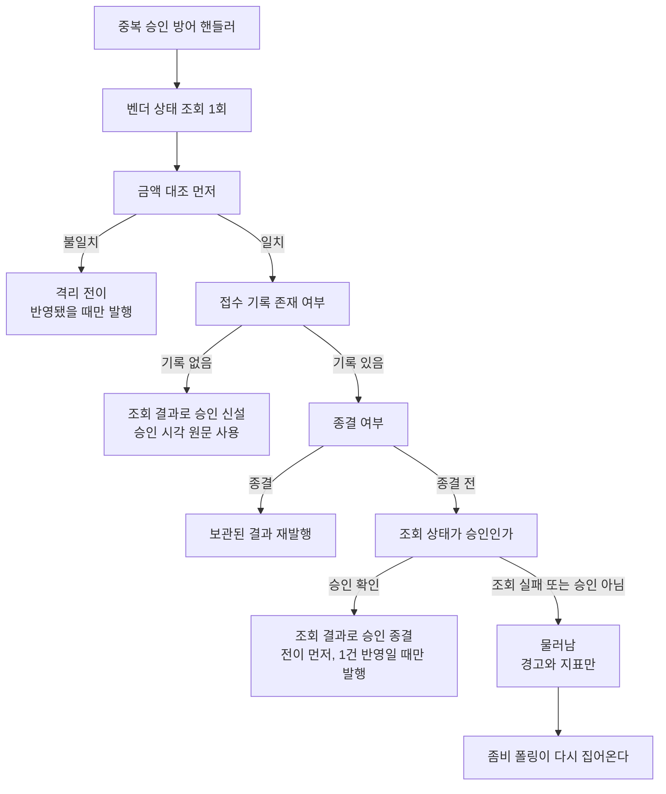

# 중복 승인 응답을 받은 결제의 종결 — 완료 브리핑

> 완료일: 2026-08-13 · 이슈 #140 · 브랜치 `#140`

## 작업 요약

앞선 토픽(PG-MESSAGE-DEDUPE-LAYER-REMOVAL)이 pg 리스너의 Redis 필터를 걷어내면서, 그 필터가 우연히 억제하던 갈래 하나가 드러났다 — 처리 중인 접수 기록에 확정 명령이 재전송되면 벤더 승인 호출이 겹친다. 이중 청구 위험으로 분류돼 "벤더 호출 구간 표시 컬럼"을 처방으로 달고 후속 토픽이 됐다.

조사에서 전제가 무너졌다. **두 벤더 모두 겹친 승인 호출을 거부한다.** Toss 는 주문번호를 멱등키로 받아 처리 중 재요청에 409(`IDEMPOTENT_REQUEST_PROCESSING`)를 돌려주고, NicePay 는 같은 거래번호 재승인에 2201(기승인 존재)로 답한다. 이중 청구는 나지 않는다. 대신 우리 쪽이 그 거부를 못 알아들어 겹친 호출이 재시도 예산을 먹고 있었다 — 409 코드가 벤더 에러 목록에 없어 "알 수 없는 에러"로 떨어지고, 그 분류는 재시도 대상이다.

게이트에서 중심이 한 번 더 옮겨졌다. reviewer 가 물러남 게이트를 진입 경로별로만 걸면 **진짜 좀비 회수는 기존 결함을 그대로 재현한다**고 지적했고, 그 지점을 파 보니 겹침과 무관한 더 큰 구멍이 있었다. 중복 승인 방어 핸들러는 *이미 종결된* 결제를 전제로 쓰였는데, 실제 진입 경로 셋 중 둘(좀비 회수, 자체 재시도)은 아직 종결되지 않은 기록을 들고 들어온다. 그 상태에서는 보관된 결과가 없어 빈 값으로 재발행을 시도하다 발행 대장 제약에 걸려 롤백되고, 롤백이라 진행 중 표시가 남아 폴링 주기마다 같은 일이 반복된다. **벤더는 승인했고 카드망에 청구가 남았는데 시스템은 그 사실을 영영 기록하지 못한다.**

그래서 토픽을 "겹침 차단"에서 "중복 승인 응답을 받은 결제의 종결"로 다시 잡았다. 핸들러가 **접수 기록의 종결 여부로만** 처신을 가르게 하면 진입 경로별 결과가 같아진다. 그 결과 호출 경로를 요청에 실어 나르는 배관과 접수대장 컬럼 추가가 모두 불필요해져 설계가 오히려 작아졌다.

라이브 실측으로 두 경로를 확인했다. 겹친 호출은 처리 중 거부로 흡수돼 시도횟수가 1로 유지됐고, 좀비 회수는 승인으로 종결돼 무한 반복이 끊겼다.

## 핵심 설계 결정

| 결정 | 근거 |
|:---:|:---:|
| 접수 기록의 종결 여부로 처신을 가른다 | 진입 경로(좀비 회수 / 자체 재시도 / 겹침)별 결과가 같아진다. 경로를 구분할 이유가 사라진다 |
| 종결 전 + 승인 확인 → 조회 결과로 승인 종결 | 기록이 아예 없을 때 이미 쓰는 방식을 같은 자리에 적용. 벤더가 승인한 사실을 시스템이 기록하는 유일한 길 |
| 종결 전 + 승인 미확인 → 물러남 | 격리는 되돌릴 자동 경로가 없는 사실상의 종결이다. 남겨두면 좀비 폴링이 다시 집어가지만 격리시키면 아무도 다시 보지 않는다(`CONCERNS.md` L-14 의 "비종결 잔류가 복구 여지 면에서 안전"과 같은 판단) |
| 기록이 아예 없는 경로는 손대지 않는다 | 좀비 폴링이 존재하는 행만 훑는다. 여기서 물러나면 아무 흔적 없이 소실된다 |
| 금액 대조를 종결 여부보다 먼저 | 금액 불일치는 종결 여부와 무관한 이상 신호다 |
| 벤더 상태값을 실제로 확인 | `APPROVED_STATUSES` 가 선언만 되고 쓰이지 않아 금액만 대조하고 있었다 |
| 결과 반영 전이는 전이 선행 + 0건이면 발행 행 미생성 | 발행 이벤트만 건너뛰면 저장된 행이 남아 폴링 안전망이 2초 뒤 그대로 발행한다 — 억제가 무력화된다 |
| 승인 시각은 조회 응답 원문 보존 | 조회 결과 DTO 가 오프셋을 버렸고 페이로드 빌더는 현재 시각을 썼다. 자정 경계에서 정산일이 밀린다(`PITFALLS.md` §13) |
| Toss 겹침 거부를 전용 결과로 | 등재 전에는 `UNKNOWN` → 재시도 대상이라 겹친 호출이 예산을 소모했다 |

**기각된 대안**

- **접수대장에 벤더 호출 구간 표시 컬럼** (원안) — 벤더가 이미 겹침을 거부하는 것이 확인돼 컬럼 추가와 마이그레이션의 무게를 정당화하지 못한다. 겹침만 막고 좀비 회수·자체 재시도 입구는 손대지 못한다. 표시를 세운 채 프로세스가 죽으면 회수가 막혀 만료 개념이 따라온다.
- **호출 경로를 요청에 실어 입구별로 가르기** — 좀비 회수와 자체 재시도가 여전히 고장난 경로를 탄다. 경로를 요청 DTO·이벤트·진입 포트·워커 둘에 걸쳐 실어 날라야 하고, application 이 만든 값을 infrastructure 가 다시 application 으로 되돌려 보내는 우회가 생긴다.
- **리스너에서 시간 유예** — 자체 재시도 명령이 같은 창으로 도착해 함께 막힌다. 벤더 제한시간을 덮는 유예를 걸면 지연이 60초로 늘어난다.

## 변경 범위

| 영역 | 변경 | 의도 |
|:---:|:---:|:---:|
| `DuplicateApprovalHandler` | 금액 대조 선행 → 종결 여부 분기 → 승인 확인. 종결 전 승인 종결 경로 신설, 승인 미확인 시 물러남, 격리 전이 반환값 가드 | 본체 결함 해소 |
| `PgStatusResult` + 세 벤더 전략 | 승인 시각 원문 필드 추가 및 채움 | 정산 시각 정확성 |
| `PgInboxRepository` / `Impl` | `transitToApproved` / `transitToFailed` 반환 타입 `void` → `int` | 0건 가드의 재료 |
| `PgVendorCallService` | 승인·확정실패 전이 선행 재배치 + 0건이면 발행 행 미생성, 겹침 분기 | 접수대장과 payment 갈림 차단 |
| `TossPaymentErrorCode` / `TossPaymentGatewayStrategy` / `GatewayOutcome` / `PgGatewayConcurrentCallException`(신규) | 겹침 거부 전용 경로 | 재시도 예산 보호 |
| `FakePgGatewayStrategy` | 진행 중 주문 집합 + 처리 중 거부 응답 | 겹침 입구 재현 |
| `PgFinalConfirmationGate` | 주석만 정정 (동작 불변) | 미배선 경로라 범위 밖 |

**무관** — payment-service 전체(발행 페이로드 스키마 불변), `pg_inbox`/`pg_outbox` 스키마(마이그레이션 없음), `PgDlqService`(전이 선행·가드 이미 준수), `PgConfirmService`·두 워커(호출 경로 배관이 불필요해져 손대지 않음).

## 다이어그램

## 코드 리뷰 요약

ship 1차에서 reviewer 는 pass, domain-expert 는 fail 을 냈다.

| finding | severity | 처리 |
|:---:|:---:|:---:|
| `handleVendorIndeterminate` 의 격리 전이가 반환값을 무시해, 기록이 이미 종결된 경우 0건 반영에도 격리 발행이 나간다 | critical | 채택 — 반환값 가드 + 단위 회귀 1건 + 그 분기를 태우는 경합 통합 1건 |
| `PgFinalConfirmationGate` 주석이 "조회 결과에 승인 시각 원문이 없다"고 서술하나 이번에 생겼다 | minor | 채택 — 주석 정정 + 배선 판단 항목에 메모 |

critical 은 물러남 가드가 "기록 있음 + 종결 전"만 걸러 "기록 있음 + 이미 종결"이 무방비로 통과하던 자리다. discuss 1라운드에서 처음 지목됐는데 구현 단계에서 금액 불일치 쪽만 고쳐져 빠졌고, 테스트도 금액 불일치 분기로만 경합을 만들어 잡히지 않았다.

재리뷰는 둘 다 pass, 새 findings 없음. 이후 사용자 판단으로 개선 하나를 더 넣었다 — 경합 테스트의 고정 지연(20ms)을 승인 스레드의 종결 커밋 신호 대기로 교체해, CI 부하와 무관하게 매 회차 목표 분기를 타게 했다.

**앞선 단계 게이트에서 걸러진 것** (이 작업의 실질적 소득)

- discuss 1차 domain-expert **fail** — 0건 반영 시 발행 억제가 폴링 안전망에 무력화된다. 발행 이벤트만 건너뛰면 저장된 행이 2초 뒤 발행된다
- discuss 2차 reviewer **fail** — 물러남을 진입 경로별로만 걸어 좀비 회수가 기존 결함을 재현한다. **이 지적이 토픽 중심을 옮긴 계기**
- discuss 3차 domain-expert revise — 조회 기반 승인 페이로드가 벤더 승인 시각 대신 현재 시각을 쓴다. 정산일이 밀린다
- plan 1차 domain-expert revise — 겹침 검증을 모의 벤더 거부로만 재현하면 두 번째 호출이 DB 전이를 시도조차 하지 않아 0건 가드 수렴이 검증되지 않는다. 승인 시각 원문도 기록 없음 경로에 미적용
- plan 1차 reviewer revise — 0건 검증에 Mockito `verify` 를 지정했으나 그 픽스처는 Fake 구현체라 실행이 깨진다

## 라이브 실측

모의 벤더 백본으로 세 장면을 돌렸다. 리포트: `live-drill/report-issue-140.html` (저장소 밖).

| 장면 | 결과 |
|:---:|:---:|
| 정상 결제 | 완료 종결, 시도횟수 1, 발행 1건 — 회귀 없음 |
| 겹친 승인 호출 | 처리 중 거부로 흡수, **시도횟수 1 유지**, 발행 1건. `pg_vendor_concurrent_call_total` 1 |
| 좀비 회수 | 승인으로 종결, 보관 결과 복구 — 무한 반복 해소 |

**실측에서 찾은 것** — 좀비 회수 후 발행이 2건 늘었다. 추적해 보니 벤더 전략이 중복 응답을 이벤트 발행과 예외 두 갈래로 신호해 핸들러가 한 응답에 두 번 실행된다. 이번 변경이 만든 구조는 아니지만(기존 통합 테스트 주석이 이미 이 이중 경로 때문에 발행 건수 단언을 피해 왔다) 결과가 달라졌다 — 이전에는 두 실행이 모두 롤백됐고 지금은 첫 실행이 종결시키고 두 번째가 재발행에 성공한다. 두 발행의 `eventUuid` 가 같고 payment 측 종결 가드가 둘 다 흡수해 실제 피해는 없다. `TODOS.md` 에 후속으로 등재했다.

**한계** — 좀비를 운영자 화면으로 만들 수단이 없어 접수대장을 DB 로 직접 되돌려 조성했고, 겹침도 브로커에 명령을 직접 넣어 일으켰다. 실 벤더 응답은 확인하지 못했다(모의 벤더로만 구동).

## 수치

- 태스크 9개 / 커밋 22개 (설계·플랜 2 + TDD 사이클 17 + 리뷰 수정 2 + 린트 1)
- 36개 파일, 2223줄 추가 / 91줄 삭제
- 테스트: pg-service 단위 437건 + 통합 48건 통과. 전체 `./gradlew test integrationTest --rerun` 통과, 린트 게이트 통과
- findings: critical 1 / major 0 / minor 1 (ship 기준). 앞선 단계 게이트에서 critical 2 · major 4 추가로 걸러짐
