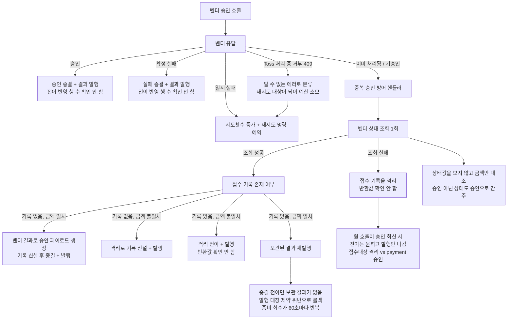
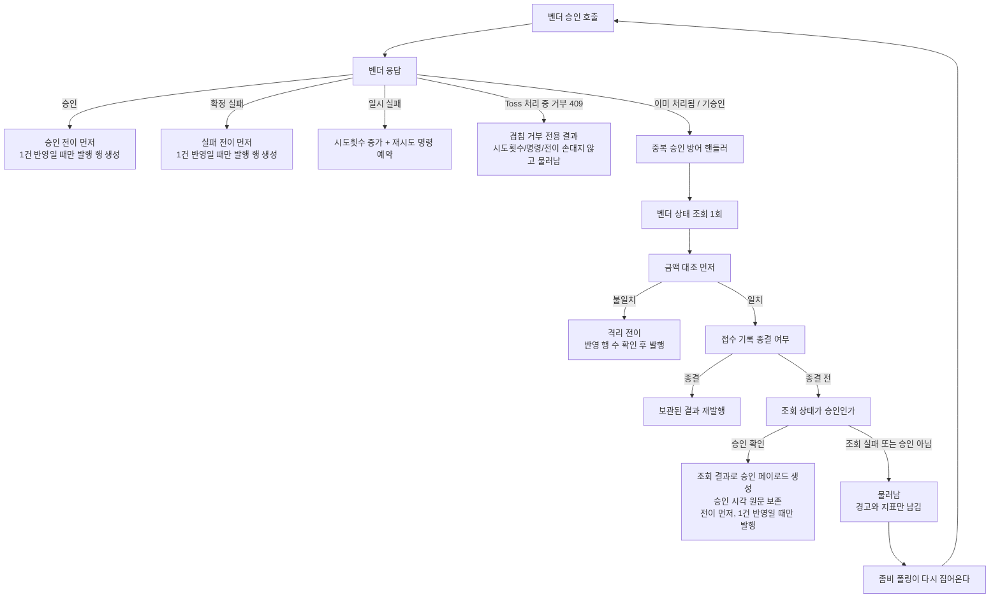

# 중복 승인 응답을 받은 결제의 종결 설계

> 최종 수정: 2026-08-12

## 사전 브리핑

### 현재 이해한 문제

벤더가 "이미 처리된 결제"라고 답하면 중복 승인 방어 핸들러가 받는다. 이 핸들러는 **이미 종결된 결제**를 전제로 쓰였다. 그런데 실제 입구 셋 중 둘은 아직 종결되지 않은 접수 기록을 들고 들어온다.

| 입구 | 접수 기록 상태 | 벤더가 중복이라 답하는 이유 |
|:---:|:---:|:---:|
| 좀비 회수 | 진행 중 | 원 호출이 승인을 받아냈지만 작업자가 죽어 결과를 못 남겼다 |
| 자체 재시도 | 진행 중 | 우리 쪽만 시간이 초과됐고 벤더는 승인을 마쳤다 |
| 종결 후 재수신 | 종결 | 이미 끝난 결제에 명령이 다시 왔다 |

전제가 어긋난 자리에서 세 갈래로 샌다.

**하나 — 승인이 영영 반영되지 않는다.** 종결 전 기록에는 보관된 결과가 없다. 핸들러는 그 빈 값을 그대로 실어 재발행하려 하고, 발행 대장이 값을 요구해 트랜잭션이 통째로 롤백된다. 롤백이라 아무것도 커밋되지 않고 진행 중 표시도 그대로 남아, 좀비 회수는 60초 뒤 처음 걸린 다음 폴링 주기(기본 5초)마다 같은 일을 반복한다. 벤더는 승인했고 카드망에는 청구가 남았는데 시스템은 그 사실을 영영 기록하지 못한다.

**둘 — 진행 중인 결제를 격리시킨다.** 벤더 상태 조회가 실패하면 핸들러가 접수 기록을 격리로 넘긴다. 뒤이어 원 호출이 승인으로 돌아오면 승인 전이는 0건 반영으로 조용히 묻히는데(반영 행 수를 확인하지 않는다) 발행은 그대로 나간다. 접수대장은 격리, payment 쪽에는 승인. 두 사실이 갈라진다.

**셋 — 벤더가 알려준 상태를 보지 않는다.** 승인으로 인정할 상태 집합이 선언만 되어 있고 쓰이는 데가 없다. 금액만 맞으면 승인으로 간주한다.

### 겹침이라는 입구

이 토픽은 처음에 "처리 중 재전송의 벤더 호출 겹침 차단"으로 출발했다. 조사에서 **두 벤더 모두 겹친 승인 호출을 거부한다**는 것이 확인돼(Toss 는 주문번호 멱등키로 처리 중 재요청을 409 로 거부, NicePay 는 같은 거래번호 재승인에 2201) 이중 청구 전제가 철회됐고, 게이트에서 겹침이 위 핸들러로 들어가는 여러 입구 중 하나임이 드러나 중심을 옮겼다.

겹침 입구에는 고유한 문제가 하나 더 있다. Toss 의 처리 중 거부 코드가 벤더 에러 목록에 없어 "알 수 없는 에러"로 떨어지고, 그 분류는 재시도 대상이다. 겹친 호출이 시도횟수를 1 올리고 재시도 명령을 예약한다. 예산 4회 중 1회가 사라지고, 원 호출도 실패하면 같은 주문에 재시도 명령이 2건 걸려 2초 뒤 다시 겹친다.

확신의 근거는 두 벤더에서 다르다. Toss 는 공개 문서에 처리 중 재요청의 응답이 명시돼 있고, NicePay 는 멱등키 자체가 없어 승인이 진행 중일 때도 2201 이 오는지가 미확정이다. 아래 설계는 이 미확정에 기대지 않는다 — 벤더 응답이 무엇이든 접수 기록의 종결 여부로 처신을 가른다.

### 현재 시스템 동작

기록이 없을 때(`NEW`)는 벤더 조회 결과로 승인 내용을 만들어 종결시키는 경로가 **이미 있다.** 기록이 있는데 종결 전인 경우만 그 방식을 쓰지 못하고 빈 보관 결과로 넘어간다.

### 이번 discuss에서 결정하려는 것

- 종결 전 접수 기록을 만났을 때 핸들러의 처신
- 벤더 조회로 승인이 확인되지 않을 때의 처신 — 지금은 격리시킨다
- 결과 반영 전이가 0건일 때 발행을 어떻게 막을 것인가
- 겹침 입구의 재시도 예산 소모를 어디서 끊을 것인가
- 무엇으로 검증할 것인가

### 열린 질문 / 가정

- 종결 전 기록을 벤더 조회 결과로 종결시키면, 같은 결제를 처리 중인 다른 작업자와 결과가 겹칠 수 있다. 어느 쪽이 이기든 하나로 수렴해야 한다
- NicePay 의 진행 중 겹침 응답은 확정되지 않는다. 설계가 이 미확정에 기대지 않아야 한다
- 결제 상태 전이·멱등성·경합 창·외부 벤더 연동에 모두 걸리므로 게이트에 domain-expert 를 포함한다

---

## 요약 브리핑

### 결정된 접근

중복 승인 방어 핸들러가 **접수 기록의 종결 여부**로 처신을 가른다. 종결됐으면 지금처럼 보관 결과를 재발행하고, 아직 종결 전인데 벤더 조회로 승인이 확인되면 그 조회 결과로 승인 내용을 만들어 종결시킨다 — 접수 기록이 아예 없을 때 이미 쓰는 방식을 같은 자리에 적용한다. 승인이 확인되지 않으면 격리시키지 않고 물러난다.

입구(좀비 회수 / 자체 재시도 / 겹침)를 구분하지 않아도 결과가 같아지므로 호출 경로를 실어 나르는 배관은 두지 않는다. 겹침 입구에는 벤더의 처리 중 거부를 전용 결과로 받아 재시도 예산을 지키는 처방을 따로 얹는다.

### 변경 후 동작

### 핵심 결정

- 접수 기록이 있으면 **금액 대조가 먼저**, 일치할 때만 종결 여부로 분기한다
- 종결 전 기록 + 승인 확인 → 조회 결과로 승인을 종결시킨다. 지금은 빈 보관 결과로 롤백돼 승인이 영영 반영되지 않는 자리다
- 종결 전 기록 + 승인 미확인 → 격리시키지 않고 물러난다. 종결되지 않은 채 남는 쪽이 복구 여지 면에서 안전하다
- 벤더가 알려준 **상태값을 실제로 확인**한다. 지금은 금액만 대조한다
- 승인 시각은 조회 응답의 **원문을 보존**해 싣는다. 지금은 현재 시각을 쓴다
- 결과 반영 전이는 전이를 먼저 하고 0건이면 발행 행 자체를 만들지 않는다 — 승인·실패는 순서 재배치, 격리는 반환값 가드
- 겹침 거부는 전용 결과로 받아 재시도 예산을 소모하지 않는다
- 호출 경로 구분과 접수대장 컬럼 추가는 두지 않는다

### 트레이드오프 / 후속 작업

- 벤더 조회가 만성적으로 실패하면 접수 기록이 종결되지 않은 채 남는다. 자동 종결 대신 지표와 경고로 드러내기로 했고, 그 가시성 자체를 검증 항목에 넣었다
- 겹침이 일어날 때 벤더 왕복 하나는 여전히 나간다. 호출 자체를 막으려면 컬럼과 만료 설계가 따라오는데, 벤더가 거부해 주는 이상 그 무게를 지지 않기로 했다
- NicePay 의 진행 중 겹침 응답은 확정되지 않는다. 종결 여부로 가르는 설계라 이 미확정에 기대지 않지만, 핸들러에 도달하지 못하는 응답이 오면 닿지 않는다
- `docs/context/TODOS.md` 의 해당 항목은 제목과 처방이 모두 옛 방향이라 ship 단계에서 맞춘다

---

## 문제 정의

중복 승인 방어 핸들러가 종결 전 접수 기록을 다루지 못한다. 그 결과 벤더가 승인한 결제를 시스템이 기록하지 못하거나(무한 반복), 진행 중인 결제를 격리시켜 접수대장과 payment 를 갈라놓는다. 상세는 위 사전 브리핑의 "새는 갈래 셋".

## 영향 범위

| 구분 | 대상 | 성격 |
|:---:|:---:|:---:|
| 변경 | `DuplicateApprovalHandler` | 종결 여부로 처신 분기, 벤더 상태값 확인, 격리 전이 반환값 가드 |
| 변경 | `PgVendorCallService` | 승인·실패 경로의 전이 선행 재배치 + 0건이면 발행 행 미생성, 겹침 거부 분기 |
| 변경 | `PgInboxRepository` | `transitToApproved` / `transitToFailed` 반영 행 수 반환 |
| 변경 | `TossPaymentErrorCode` | 처리 중 거부 코드 등재 + 분류 메서드 |
| 변경 | `TossPaymentGatewayStrategy` | 처리 중 거부를 전용 예외로 전파 |
| 변경 | `GatewayOutcome` | 겹침 결과 분기 추가 (sealed permits 확장) |
| 변경 | `PgStatusResult` | 벤더 승인 시각 원문 보존 필드 추가 |
| 변경 | 세 벤더 전략의 조회 결과 변환 | 승인 시각 원문을 채움 (Toss / NicePay / 모의) |
| 변경 | `FakePgGatewayStrategy` | 처리 중 거부 응답 재현 + 조회 결과에 승인 시각 원문 |
| 신규 | `PgGatewayConcurrentCallException` | 겹침 거부 전용 예외 |
| 무관 | `PgDlqService` | 전이 선행·반환값 가드 모두 이미 준수 |
| 무관 | `PgConfirmService` / 두 워커 / `PgInboxProcessUseCase` | 호출 경로 전달이 불필요해져 손대지 않는다 |
| 무관 | payment-service 전체 | 발행 페이로드 스키마 불변 |
| 무관 | `pg_inbox` / `pg_outbox` 스키마 | 컬럼 추가 없음, 마이그레이션 없음 |

## 설계 옵션 비교

### 접수 기록의 종결 여부로 처신을 가르기 (채택)

핸들러가 기록의 종결 여부만 보고 갈라진다. 종결이면 보관 결과를 재발행하고, 종결 전이면 벤더 조회 결과로 승인 내용을 만들어 종결시킨다 — 기록이 아예 없을 때 이미 쓰는 방식을 그대로 적용한다.

- 입구를 구분하지 않아도 된다. 좀비 회수든 자체 재시도든 겹침이든 결과가 같다.
- 겹쳐도 결과 반영 전이의 0건 가드가 하나로 수렴시킨다.
- 벤더 조회가 실패하면 승인을 확정할 수 없어 별도 처신이 필요하다.

### 호출 경로를 실어 날라 입구별로 가르기 (기각)

요청에 호출 경로를 달아 겹침이면 물러나고 좀비 회수면 진행시킨다.

- 겹침 입구만 놓고 보면 직관적이다.
- 좀비 회수와 자체 재시도는 여전히 고장난 경로를 그대로 탄다 — 새는 갈래 하나가 남는다.
- 경로를 요청 DTO·이벤트·진입 포트·워커 둘에 걸쳐 실어 날라야 한다. application 이 만든 값을 infrastructure 가 다시 application 으로 되돌려 보내는 우회가 생긴다.

### 접수대장에 벤더 호출 구간 표시 (기각)

벤더 호출 직전 표시를 세우고 결과 반영에서 내려 겹침을 채널 진입 전에 막는다.

- 벤더 왕복 하나를 아낀다.
- 겹침만 막고 좀비 회수·자체 재시도 입구는 손대지 못한다.
- 표시를 세운 채 프로세스가 죽으면 회수가 막혀 만료 개념이 따라온다. 컬럼 추가 + 마이그레이션.

## 결정 사항

| 항목 | 결정 | 이유 |
|:---:|:---:|:---:|
| 분기 평가 순서 | 기록이 있으면 **먼저 금액을 대조**하고, 일치할 때만 종결 여부로 분기 | 금액 불일치는 종결 여부와 무관한 이상 신호라 앞단에서 갈라야 한다 |
| 종결된 기록 | 지금처럼 보관 결과 재발행 | 이미 올바르게 동작한다 |
| 종결 전 기록 + 승인 확인됨 | 벤더 조회 결과로 승인 페이로드를 만들어 종결 + 발행 | 기록이 없을 때 쓰는 경로와 같다. 벤더가 승인한 사실을 시스템이 기록하는 유일한 길 |
| 승인 시각 | 조회 응답의 승인 시각 **원문**을 보존해 페이로드에 싣는다. 원문이 없을 때만 현재 시각으로 대체 | 조회 결과 DTO 는 승인 시각을 오프셋 없는 형식으로만 담아 이미 손실이 있고, 지금 페이로드 빌더는 아예 현재 시각을 쓴다. 좀비 회수가 자정 근처에 돌면 정산일이 어긋난다. 승인 응답 쪽은 원문 보존이 이미 되어 있다 |
| 종결 전 기록 + 승인 미확인 | 아무것도 하지 않고 물러남. 경고와 지표만 남긴다 | 겹침이면 원 호출이 결과를 낸다. 좀비면 폴링이 다시 온다. 지금처럼 격리시키면 진행 중인 결제를 잘못 종결시킨다 |
| 벤더 상태 확인 | 조회 결과의 상태값이 승인일 때만 승인으로 종결 | 지금은 금액만 대조한다. 승인 아닌 상태를 승인으로 기록할 수 있다 |
| 금액 불일치 | 지금처럼 격리, 단 전이 반영 행 수를 확인 | 금액 불일치는 종결 여부와 무관한 이상 신호다 |
| 결과 반영 전이 | 승인·실패는 전이를 **먼저** 하도록 순서를 뒤집고, 격리는 순서가 이미 맞으므로 반환값 가드만 추가. 0건이면 발행 행 자체를 만들지 않는다 | 발행 이벤트만 건너뛰면 저장된 행이 남아 폴링 안전망이 2초 뒤 그대로 발행한다. 재시도 예약이 이미 쓰는 순서와도 맞는다 |
| 겹침 거부 응답 | Toss 의 처리 중 거부 코드를 벤더 에러 목록에 등재하고 전용 결과로 받아, 시도횟수·재시도 명령·상태 전이를 건드리지 않고 물러남 | 지금은 "알 수 없는 에러"로 떨어져 재시도 예산을 먹는다. 원 호출이 결과를 낸다 |
| 호출 경로 구분 | 두지 않는다 | 종결 여부로 가르면 입구별 결과가 같아진다. 배관을 만들 이유가 없다 |
| 모의 벤더 | 원 호출이 응답 대기 중이면 두 번째 호출에 처리 중 거부를 반환 | 지금은 곧바로 이미 처리됨을 돌려줘 겹침 입구가 통합 테스트·라이브 드릴에서 재현되지 않는다 |

## 장애 시나리오와 대응

| 시나리오 | 대응 |
|:---:|:---:|
| 작업자가 죽고 벤더는 승인 완료 | 60초 뒤 좀비 회수가 중복 응답을 받고, 벤더 조회 결과로 승인을 종결시킨다. 지금의 무한 반복이 끊긴다 |
| 우리 쪽만 시간 초과, 벤더는 승인 완료 | 자체 재시도가 같은 경로로 승인을 종결시킨다 |
| 겹친 두 호출이 나란히 종결을 시도 | 먼저 전이한 쪽만 발행 행을 만든다. 나중 쪽은 0건 반영으로 발행하지 않는다 |
| 종결 전 기록인데 벤더 조회가 실패 | 물러난다. 겹침이면 원 호출이, 좀비면 다음 폴링이 처리한다. 종결되지 않은 채 남는 쪽이 복구 여지 면에서 안전하다 |
| 벤더 조회는 됐으나 상태가 승인이 아님 | 승인으로 종결하지 않고 물러난다. 상태가 확정되면 다음 회수가 처리한다 |
| 종결 전 기록인데 금액이 벤더와 다름 | 종결 여부보다 금액 대조가 앞서므로 격리로 간다. 전이 반영 행 수를 확인해 이미 종결된 기록에는 격리 발행이 나가지 않는다 |
| 벤더 승인이 자정 직전, 좀비 회수는 자정 이후 | 조회 응답의 승인 시각 원문을 그대로 실어 정산일이 밀리지 않는다 |
| 벤더 조회가 계속 실패해 기록이 진행 중으로 오래 남음 | 좀비 회수 실패 지표와 경고로 드러난다. 자동 종결은 하지 않는다 |
| NicePay 가 진행 중 겹침에 기승인이 아닌 코드로 응답 | 기존 분류로 흐른다. 종결 여부 판단이 벤더 응답 종류에 기대지 않으므로 핸들러에 도달하기만 하면 같은 처신을 한다 |
| 벤더가 거부 코드 문구를 변경 | 겹침 거부가 다시 "알 수 없는 에러"로 떨어져 재시도 예산 소모만 회귀한다. 종결 경로는 영향받지 않는다 |

## 검증 전략

- 종결 전 기록이 중복 응답을 받으면 벤더 조회 결과로 승인 종결되고 발행이 한 건 나간다 — 지금은 롤백되는 자리
- 좀비 회수가 같은 결제를 두 번 돌아도 종결과 발행이 각각 한 번만 일어난다
- 벤더 조회 결과의 상태가 승인이 아니면 승인으로 종결하지 않는다
- 벤더 조회가 실패하면 접수 기록이 격리되지 않고 그대로 남고, 경고 로그와 지표가 남는다 — 물러남을 안전하다고 본 근거가 가시성이므로 함께 검증한다
- 조회 응답의 승인 시각 원문이 페이로드까지 오프셋을 잃지 않고 전달된다
- 결과 반영 전이가 0건이면 발행 행이 저장되지 않는다 — 승인·실패·격리 세 경로 각각. 폴링 안전망이 뒤늦게 발행하지 않는 것까지 확인한다
- 겹침 거부 응답이 시도횟수를 올리지 않고 재시도 명령도 예약하지 않는다
- 모의 벤더의 처리 중 거부로 실제 겹침을 재현해, 접수 기록이 한 번만 종결되고 발행도 한 건인지 확인한다

## 제외 범위

| 제외 | 이유 |
|:---:|:---:|
| 접수대장 호출 구간 표시 컬럼 | 벤더가 겹침을 거부하고, 종결 여부 판단이 입구를 가리지 않으므로 필요 없어졌다 |
| 재시도 창 26초 자체의 재조정 | 별도 항목. 이번 작업은 예산이 헛되이 소모되는 것만 막는다 |
| 벤더 취소·환불 경로 | 포트 자체가 없다 |
| NicePay 동시 승인 요청 규격 확정 | 공개 문서로 확정되지 않는다. 설계가 이 미확정에 기대지 않게 하는 것이 이번 대응 |
| 격리된 결제의 복구 | 별도 항목 |
| 소진 시점 자동 벤더 확인 경로 배선 | 별도 판단 항목 |

## 후속 메모

- `docs/context/TODOS.md` 의 해당 항목은 제목이 "처리 중 재전송의 벤더 호출 겹침 차단"이고 처방이 "호출 구간 표시 컬럼 + 마이그레이션"으로 적혀 있다. 이번에 중심과 처방이 모두 바뀌었으므로 ship 단계에서 맞춘다.

## 참고

- `docs/archive/pg-message-dedupe-layer-removal/` — 이 갈래가 드러난 경위
- `docs/context/CONCERNS.md` L-9 — 취소·환불 포트 부재 / L-14 검토 기록 — 비종결 잔류가 복구 여지 면에서 안전 방향이라는 도메인 판정
- `docs/context/PITFALLS.md` §13 — 승인 시각 오프셋을 버리면 정산 앵커가 최대 9시간 어긋난다. 승인 응답 경로는 원문 보존으로 해소됐고 조회 경로는 남아 있었다
- [토스페이먼츠 멱등키](https://docs.tosspayments.com/guides/using-api/idempotency-key) — 처리 중 재요청 시 409
- [나이스페이 결과코드](https://developers.nicepay.co.kr/manual-code.php) — 2201 기승인 존재
