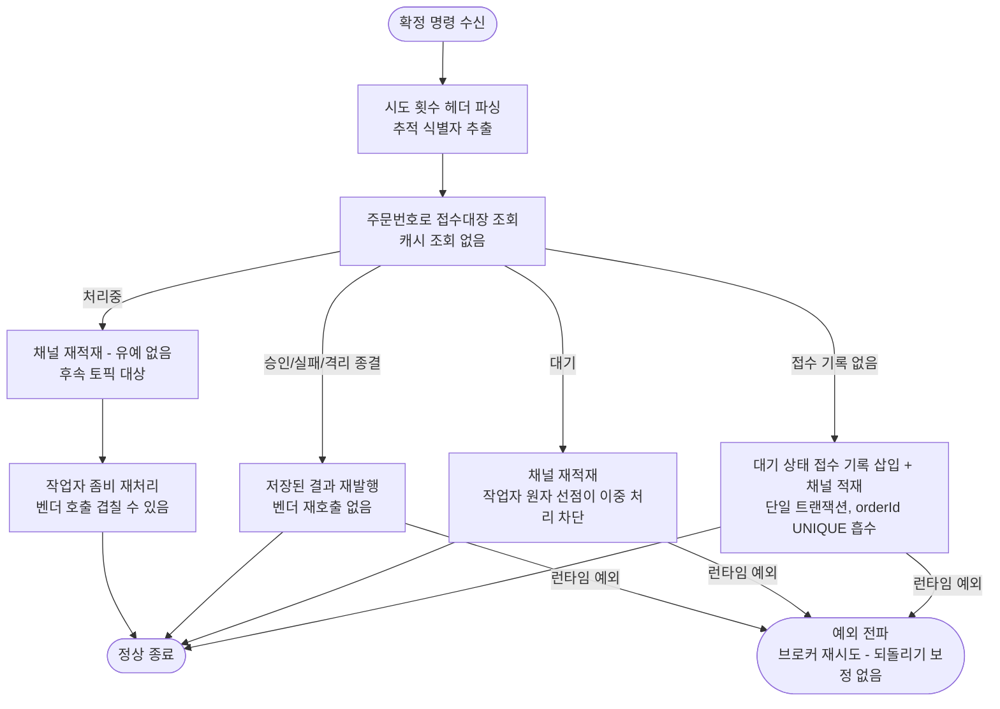
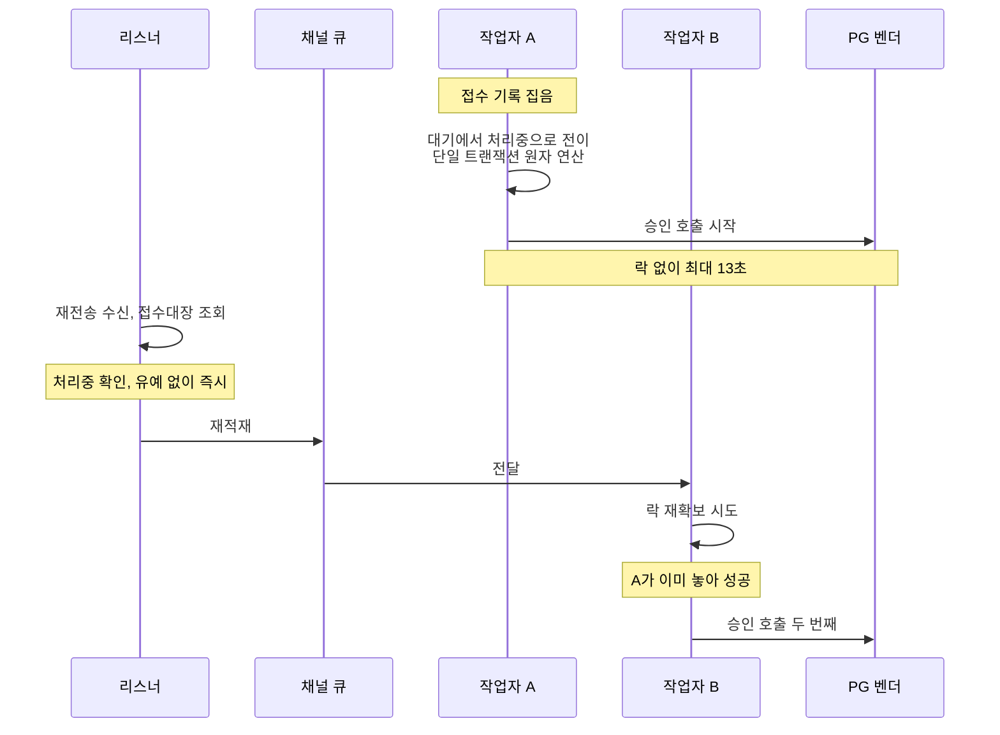

# pg 리스너 메시지 dedupe 층 제거 — 완료 브리핑

> 완료: 2026-08-11 · 이슈 #138 · 브랜치 `#138` · 커밋 9개

## 작업 요약

pg-service 리스너는 확정 명령을 받으면 가장 먼저 Redis에 이벤트 식별자를 찍어 "이미 본 메시지"를 걸러냈다. 중복 승인을 막겠다는 의도였다.

블로그 글을 쓰며 코드를 대조하다 이 필터가 그 일을 하지 않는다는 게 드러났다. 중복 승인을 실제로 막는 것은 `pg_inbox.order_id` UNIQUE 제약과 워커의 상태 조건부 선점이다. 벤더 호출은 리스너가 아니라 워커가 하므로 필터를 통과한 중복 메시지도 벤더까지 도달하지 못한다. 게다가 self-loop 재시도 명령은 발행할 때마다 새 식별자를 받는다 — 그래야 재시도가 성립하므로 처음부터 통과하도록 설계된 것이다. 남는 절감분은 종결된 주문을 다시 받았을 때 결과 재발행 한 건이었다.

대가는 두 가지였다. `markSeen`이 예외를 던지면 소비가 멈춰 최적화 목적의 층이 새 장애점을 만들었고, 식별자를 찍은 뒤 PENDING INSERT 커밋 전에 프로세스가 죽으면 재전송이 필터에 막혀 사라졌다 — 접수 기록이 없어 폴링 회수 대상도 아니었고, 코드의 되돌리기 보정은 `catch (RuntimeException)`이라 프로세스 사망을 잡지 못했다.

사용자 결정으로 위키 4종·README·포트폴리오·블로그를 제거 완료 기준으로 먼저 갱신해 둔 상태에서 코드를 뒤따라 맞췄다. 필터 층과 그에 딸린 캐시 의존 전체(라이브러리·설정·컨테이너 의존·가용성 지표 축)를 걷어냈고, 중복 방어를 접수대장 단일 층에 일임했다.

게이트에서 두 가지가 드러났다. 필터가 **처리 중 재전송을 억제하는 부수효과**를 실제로 갖고 있었다는 것(명시된 목적이 아니라 아무도 인지하지 못했다), 그리고 이를 검증할 재수신 테스트가 **항상 참인 값을 검사하고 있었다**는 것이다. 전자는 원인 지점을 고쳐 닫기로 하고 후속 토픽으로 분리했으며, 후자는 실제 흡수를 관측하는 형태로 다시 짰다.

## 핵심 설계 결정

### 필터를 걷어내고 접수대장 단일 방어로 정리

**결정**: 포트·어댑터·Fake·호출 분기·되돌리기 보정을 전부 제거.

**근거**: 중복 승인 방어에 기여하지 않으면서 가용성 의존과 유실 창을 만든다. 제거로 두 비용이 함께 사라진다.

**기각된 대안**:
- *선점 기록을 INSERT 커밋 이후로 이동* — 유실 창은 닫히지만 필터가 값을 못 낸다는 본질은 그대로다. 커밋과 기록 사이에 새 창이 생겨 완전히 닫히지도 않는다.
- *유지* — 절감분(재발행 한 건)보다 비용이 크고, 문서가 이미 제거 기준으로 나가 있었다.

### 처리 중 재전송 구멍을 이번 범위에서 닫지 않음

**결정**: 알려진 한계로 기록하고 후속 토픽(`PG-INPROGRESS-REDELIVERY-GRACE`)으로 분리.

**근거**: 단순한 시간 유예로는 갈라지지 않는다. 재시도 명령은 벤더 호출 실패 직후 `updated_at`을 갱신하고 약 2초 뒤 도착하므로, 벤더 타임아웃(13초)을 덮는 유예를 걸면 재시도까지 차단돼 지연이 60초로 늘어난다. attempt 헤더 비교도 첫 시도 중 재전송(헤더와 저장값이 모두 1)을 가르지 못한다. 정확히 가르려면 벤더 호출 구간에만 유지되는 표시가 필요하고 컬럼 추가와 마이그레이션이 따라온다 — 필터 제거와 성격이 다른 변경이다.

**기각된 대안**:
- *한 토픽으로 둘 다* — 플랜이 두 배가 되고 성격이 다른 변경이 한 리뷰에 섞인다.
- *유예를 먼저, 필터는 다음에* — 순서상 가장 안전하나 문서가 이미 제거 기준으로 나가 있어 불일치 기간이 길어진다.

### 재수신 테스트를 삭제하지 않고 재작성

**결정**: 접수 기록 삽입 서비스를 실제 인스턴스 스파이로 바꾸고, 접수 기록 수와 삽입 호출 여부를 단언.

**근거**: 기존 테스트의 "벤더 호출 0회" 단언은 검증력이 0이었다. `PgConfirmService`가 어느 분기에서도 벤더를 호출하지 않아(필드 선언만 있고 사용처 0) 값이 항상 0이었고, 삽입 서비스가 전체 mock이라 두 번째 수신도 접수대장이 빈 것으로 보여 "접수 없음" 경로로 재진입했다. 분기를 통째로 지워도 통과하는 구조라, 이름만 바꿔 재사용했다면 제거로 잃는 보장을 하나도 잠그지 못한 채 넘어갔다.

접수 기록 수만 보면 흡수된 삽입과 대기 상태 라우팅이 같은 결과로 수렴하므로 호출 여부까지 봐야 분기 회귀가 잡힌다. 단언을 일부러 뒤집어(`times(1)`→`times(2)`, `hasSize(1)`→`hasSize(8)`) 실제로 실패하는지 확인했다.

## 변경 범위

**제거 (pg-service)**

- `EventDedupeStore` 포트 + `EventDedupeStoreRedisAdapter` + `FakeEventDedupeStore`
- `PgConfirmService.handle`의 필터 분기와 되돌리기 보정 — `processCommand`가 순수 위임이 되어 `handle`에 병합
- `EventType.PG_CONFIRM_DUPLICATE_UUID` (참조 0건 확인 후)
- `PgVendorCallService` 주입 필드 — 선언만 있고 사용처 0이던 죽은 의존
- `insertPending` / `insertPendingAndPublish`의 미사용 `eventUuid` 인자
- `DependencyHealthMetrics`의 캐시 축 (연결 타입 import, 게이지, 폴링 분기)
- `spring-boot-starter-data-redis` 의존, `spring.data.redis` / `pg.event-dedupe` 설정, compose의 `depends_on` + 접속 환경변수, 알람 테스트의 pg 캐시 시리즈

**유지 (의도적)**

- `redis-dedupe` 인스턴스와 payment-service의 의존 — checkout 요청 멱등성 저장소가 계속 사용
- payment / product의 동명 `EventDedupeStore` — RDB 기반 별개 구현
- 통합 테스트의 `spring.autoconfigure.exclude` — 캐시 라이브러리와 별개 관심사이며, 클래스가 없으면 Spring이 조용히 무시

**문서 동기화 8종**

`ARCHITECTURE`(dedupe 표·토폴로지·인프라 표) / `PAYMENT-FLOW`(플로우차트·멱등성 표·§4.11) / `PITFALLS`(§10) / `INTEGRATIONS`(장애 표) / `STACK`(의존성 주석·인프라 표) / `STRUCTURE`(dedupe 디렉토리) / `PAYMENT-FLOW-GUIDE`(17번) / `TODOS`(완료 삭제 + 후속 2건)

## 다이어그램

### 변경 후 리스너 진입 흐름

### 처리 중 재전송의 벤더 호출 겹침 (후속 대상)

## 코드 리뷰 요약

reviewer·domain-expert 모두 **pass**. critical 0 / major 0 / minor 2 — 코드 수정 finding은 없었고 두 건 모두 문서 동기화로 해소했다.

| finding | 처리 |
|---|---|
| `TODOS.md` 항목이 "판단 전" 미결로 남아 있으나 제거안이 실행됨 (reviewer) | 채택 — 항목 삭제, 후속 2건으로 대체 |
| 영구 문서 7종이 필터를 현재형으로 서술 (domain-expert) | 채택 — 실제로는 8종이었고 전부 갱신 |

**앞선 단계 게이트에서 걸러진 것** (이 작업의 실질적 소득):

- discuss 1차 domain-expert **fail** — 처리 중 재전송 시 벤더 호출 겹침 경로. 코드로 검증해 지적이 옳음을 확인하고 후속 토픽으로 분리
- discuss 2차 domain-expert revise — "이중 청구로 이어지지 않는다"가 검증 불가 외부 가정을 사실처럼 서술. 벤더 멱등 흡수는 벤더가 에러로 알려줄 때만 타는 경로라 순차 중복 보장이지 동시 중복 보장이 아니다. 확신 수준을 낮추고 전제가 깨질 때의 결과를 명시
- discuss 1차 reviewer major — 캐시 라이브러리를 빼면 `DependencyHealthMetrics`가 컴파일되지 않음. 초안의 "설정만 빼면 자동 정리된다"는 판단이 틀렸음이 드러나 Task 4로 분리
- plan 1차 domain-expert major — 재수신 테스트 2건이 tautology. 테스트 설계를 다시 함
- plan 1차 reviewer major — Task 3에서 `PgConfirmServiceTest`의 6인자 mock이 깨져 컴파일 불가. 태스크에 반영

**리뷰에서 확인된 것**: reviewer가 9개 커밋을 각각 체크아웃해 빌드 — 의도된 RED 커밋만 실패하고 나머지 전부 통과, 테스트 수 추이(408→408→408→407→407→406)가 PLAN 기재와 일치.

## 검증

| 항목 | 결과 |
|---|---|
| 전체 테스트 (4서비스 + eureka + gateway) | 1096건 통과 |
| pg-service 통합테스트 (`--rerun`) | 16건 통과 |
| 린트 (checkstyle/spotbugs main·test) | 통과 |
| promtool 알람 규칙 | 통과 |
| 스택 기동 헬스체크 | 27항목 전부 PASS |
| pg 가용성 지표 | `db` 축만 노출 (payment는 캐시 2축 유지 — 대조 확인) |
| pg 로그 캐시 흔적 | 0건 |
| 결제 관통 | 리스너 → 접수 → 워커 → 벤더 → 종결 정상 |
| 종결 재수신 | 재발행 1건 증가, `attempt` 불변 (벤더 재호출 없음) |

라이브 검증은 실제 스택을 띄워 수행했다. 통합테스트는 Testcontainers라 compose 설정을 타지 않으므로, 캐시 없이 컨텍스트가 뜨는지는 이 경로로만 확인된다.

## 수치

- 태스크 6개 (계획 5 + 게이트 발견 1)
- 커밋 9개 (docs 2 + test 1 + feat 6)
- 코드 변경 25파일 · +97 / −493
- 테스트 1096건 통과
- findings: critical 0 / major 0 / minor 2 (ship 기준). 앞선 단계 포함 시 fail 1 · major 4 · minor 6

## 후속

| 항목 | 내용 |
|---|---|
| `PG-INPROGRESS-REDELIVERY-GRACE` | 처리 중 재전송의 벤더 호출 겹침 차단. 벤더 호출 구간 표시 컬럼 + 마이그레이션. **우선순위 근거**: 겹침의 안전성이 벤더의 동시 요청 직렬화라는 검증 불가 외부 가정에 의존하고, 전제가 깨지면 되돌릴 수단이 없다(취소·환불 포트 미구현, `CONCERNS.md` L-9) |
| `PG-INBOX-CONCURRENT-INSERT-TEST` | 접수대장 UNIQUE의 실제 동시 경합 검증. 현재는 순차 중복으로만 확인됨 |
| 테스트 정리 | `PaymentConfirmConsumerTest`의 나머지 4개 분기 테스트도 "벤더 호출 0회"를 단언하는데 항상 참이다. 같은 분기의 라우팅 검증을 `PgConfirmServiceTest`가 담당해 커버리지 손실은 없다 |

## 참고

- 설계: `PG-MESSAGE-DEDUPE-LAYER-REMOVAL-CONTEXT.md`
- 플랜 + 리뷰 처리: `PG-MESSAGE-DEDUPE-LAYER-REMOVAL-PLAN.md`
- 설명 페이지: `.archive/explanations/2026-08-11-pg-message-dedupe-layer-removal.html`
