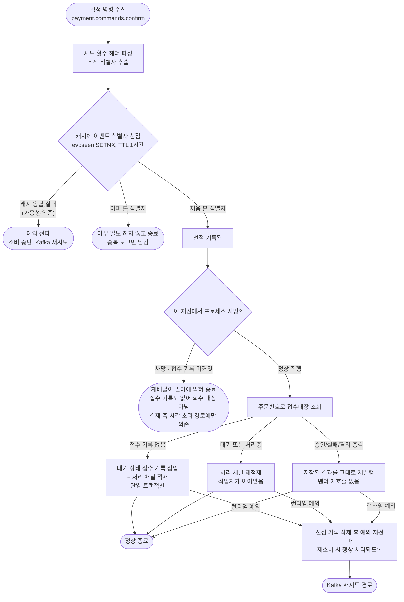
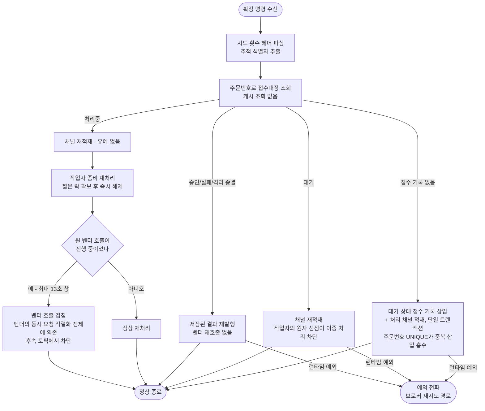

# pg 리스너 메시지 dedupe 층 제거 설계

> 최종 수정: 2026-08-10

## 사전 브리핑

### 현재 이해한 문제

pg 리스너가 확정 명령을 받으면 가장 먼저 캐시에 이벤트 식별자를 찍어 "이미 본 메시지"를 걸러낸다. 그런데 이 필터가 실제로 중복 승인을 막는 일은 하지 않는다. 중복 승인은 접수대장의 주문번호 UNIQUE 제약과 작업자의 상태 조건부 선점이 막고 있고, 재시도 명령은 매번 새 식별자를 달고 오므로 애초에 이 필터를 통과하게 설계돼 있다. 남는 효과는 종결된 주문을 다시 받았을 때 결과 재발행 한 건을 아끼는 정도인데, 그 대가로 캐시 가용성 의존과 크래시 시 메시지가 사라지는 창을 함께 진다.

문서(위키·README·포트폴리오·블로그)는 사용자 결정에 따라 이미 이 층이 없는 기준으로 갱신돼 있다. 코드만 남아 문서와 어긋난 상태다.

### 현재 시스템 동작 (as-is)

오른쪽 세 갈래(접수 없음 / 진행 중 / 종결)는 대체로 각자 멱등하다. 접수 없음은 주문번호 UNIQUE로 삽입 충돌을 흡수하고, 종결은 저장된 결과만 되돌려 보낸다. 진행 중은 대기 상태라면 작업자의 원자 선점이 이중 처리를 막지만, 이미 벤더를 부르고 있는 중이면 그렇지 않다 — 게이트에서 드러난 지점이며 장애 시나리오 절에서 따로 다룬다.

### 이번 discuss에서 결정하려는 것

- 캐시 필터를 걷어낸 뒤 접수대장 단일 방어로 충분한지 — 네 갈래 재수신 시나리오를 하나씩 짚어 확인
- 실패 시 선점을 되돌리던 보정 분기가 사라지면서 예외 전파 경로가 어떻게 달라지는지
- pg가 캐시를 쓰는 유일한 기능이 이 필터다. 캐시 의존 자체를 어디까지 걷어낼지 (라이브러리 의존 / 접속 설정 / compose 의존 / 의존성 가용성 지표의 캐시 축)
- 중복 감지 로그 종류를 남길지 지울지
- 접수 기록 삽입에 이벤트 식별자를 계속 넘길지

### 열린 질문 / 가정

- **가정**: "제거한다"는 방향은 사용자가 이미 결정했고 문서에 선반영됐다. 이번 discuss는 제거 여부가 아니라 제거 범위와 안전성 확인이 목적이다.
- 제거하면 접수 기록 미커밋 크래시 창이 함께 사라진다(재배달이 정상적으로 접수 기록을 만든다). 다만 이 창이 실제로 발생한 적 있는지는 측정하지 않았다 — 제거의 근거로 삼되 실측 주장으로 쓰지는 않는다.
- pg에서 캐시를 완전히 걷어내면 의존성 가용성 지표의 pg 캐시 축이 사라진다. 알람 규칙은 지표 전체 부재만 잡으므로 발화에 영향은 없으나, promtool 테스트에 박아둔 시리즈는 실제와 어긋나게 된다.
- 종결 재수신 시 결과 재발행이 늘어나는 것은 수용한다는 전제다. **확인 완료** — 결제 측 종결 가드가 받아 재고 확정을 다시 발행하고, 재고 쪽이 결정적 키로 흡수해 차감은 1회다.
- **게이트에서 드러난 것**: 필터가 처리중 재전송을 억제하는 부수효과를 실제로 갖고 있었다. 이 구멍은 이번 범위에서 닫지 않고 후속 토픽으로 분리한다 — 근거와 판단은 장애 시나리오 절 참조.

**domain-expert 포함** — 중복 승인 방어 층을 걷어내는 변경이라 멱등성·race window 관점 검토가 필요하다.

---

## 요약 브리핑

### 결정된 접근

pg 리스너 진입부의 캐시 필터를 통째로 걷어내고, 중복 방어를 접수대장 UNIQUE와 작업자 선점에 맡긴다. 필터가 pg의 유일한 캐시 사용처였으므로 라이브러리·설정·컨테이너 의존과 가용성 지표의 캐시 축까지 함께 정리한다. 캐시 인스턴스 자체는 결제 서비스가 계속 쓰므로 남긴다.

게이트에서 예상 밖의 사실이 하나 나왔다. 필터가 값을 못 낸다는 판단은 대체로 맞았지만, **처리중 재전송을 억제하는 부수효과**만은 실제로 있었다. 이 구멍은 필터를 되살려 가리는 대신 원인 지점(유예 없는 즉시 재적재)을 고쳐 닫기로 하고, 성격이 다른 변경이라 후속 토픽으로 분리했다.

### 변경 후 동작 (to-be)

as-is와 견주면 왼쪽 필터 기둥이 통째로 사라지고, 캐시 장애로 소비가 멈추던 갈래와 선점 후 크래시로 메시지가 사라지던 갈래가 함께 없어진다. 대신 오른쪽 처리중 갈래의 겹침이 드러난 채로 남는다.

### 핵심 결정 목록

- 필터 층(포트·어댑터·Fake·호출 분기)과 되돌리기 보정을 전부 제거한다
- pg의 캐시 의존을 라이브러리까지 걷어내고, 그에 딸린 가용성 지표의 캐시 축도 코드에서 함께 뺀다
- 접수 기록 삽입이 받기만 하고 쓰지 않던 식별자 파라미터를 정리한다
- 재수신 테스트는 지우지 않고 접수대장 기준으로 재작성해 보장을 유지한다
- 처리중 재전송 구멍은 알려진 한계로 기록하고 후속 토픽으로 넘긴다

### 트레이드오프 / 후속 작업

- **얻는 것**: 캐시 장애점 제거, 접수 기록 미커밋 크래시 유실 창 제거, 이해해야 할 층 하나 감소, 문서와 코드의 정합 회복
- **잃는 것**: 종결 재수신 시 결과 재발행이 늘고 그 빈도의 자연 상한이 사라진다. 처리중 재전송 억제 효과를 잃는다
- **감수하는 전제**: 겹친 벤더 호출의 안전성은 벤더가 동일 멱등 키의 동시 요청을 직렬화한다는, 이 저장소에서 검증할 수 없는 외부 가정에 의존한다. 전제가 깨지면 되돌릴 수단이 없다(취소·환불 포트 미구현)
- **후속**: 리스너 재적재 경로의 유예 부재를 닫는 토픽. 위 전제 의존이 그 우선순위의 근거다

---

## 문제 정의

pg 리스너의 첫 관문인 캐시 필터가 값을 못 낸다. 세 가지가 겹쳤다.

**중복 승인 방어의 주력이 아니다.** 중복 승인을 실제로 막는 것은 접수대장의 주문번호 UNIQUE 제약, 작업자의 상태 조건부 선점, 그리고 벤더 층의 중복 승인 흡수다. 필터는 이 셋 앞에 붙은 선택적 관문이다. (예외가 하나 있다 — 처리중 재전송을 억제하는 부수효과는 실제로 있었다. 장애 시나리오 절에서 따로 다룬다.)

**걸러야 할 대상이 애초에 안 걸린다.** 재시도 명령은 발행할 때마다 새 이벤트 식별자를 받는다. 그래야 재시도가 성립하기 때문이다. 그래서 필터가 실제로 잡는 것은 동일 식별자의 브로커 재전송뿐이고, 그 경우도 접수대장이 안전하게 흡수한다. 순수 절감분은 종결된 주문을 다시 받았을 때의 결과 재발행 한 건이다.

**대가는 두 가지다.** 하나는 가용성 — 캐시가 응답하지 않으면 소비가 멈춘다. 최적화 목적의 층이 새 장애점을 만들었다. 다른 하나는 유실 창 — 선점 기록은 남았는데 접수 기록 커밋 전에 프로세스가 죽으면, 재전송이 필터에 막혀 아무 일 없이 종료되고 접수 기록도 없어 회수 대상에서 빠진다. 코드의 되돌리기 보정은 런타임 예외만 잡으므로 이 경우를 못 잡는다.

문서(위키 4종·README·포트폴리오·블로그)는 사용자 결정으로 이미 이 층이 없는 기준으로 갱신됐다. 코드만 남아 문서와 어긋난 상태이며, 이 작업이 그 간극을 닫는다.

## 영향 범위

**제거**

| 대상 | 위치 |
|---|---|
| dedupe 포트 | `pg/application/port/out/EventDedupeStore.java` |
| 캐시 어댑터 | `pg/infrastructure/dedupe/EventDedupeStoreRedisAdapter.java` |
| 테스트 Fake | `pg/mock/FakeEventDedupeStore.java` |
| 리스너 진입 필터 + 되돌리기 보정 | `PgConfirmService.handle` |
| 중복 감지 로그 종류 | `EventType.PG_CONFIRM_DUPLICATE_UUID` |
| 캐시 접속 설정 + TTL 설정 | `pg-service/src/main/resources/application-docker.yml` |
| 캐시 라이브러리 의존 | `pg-service/build.gradle` |
| compose 캐시 의존 + 접속 환경변수 | `docker/docker-compose.apps.yml` (pg 블록) |
| 사용하지 않는 식별자 파라미터 | `PgInboxRepository.insertPending` / 구현체 / `PgInboxPendingService.insertPendingAndPublish` |
| 의존성 가용성 지표의 캐시 축 | `pg/infrastructure/metrics/DependencyHealthMetrics.java` (캐시 게이지·폴링·연결 타입 import) |
| 알람 테스트의 pg 캐시 시리즈 | `observability/prometheus/rules/tests/availability_test.yml` |

**변경**

- pg 통합 테스트 4종의 Fake 빈 등록 블록 — 등록 대상이 사라지므로 `TestConfiguration` 정리
- `PgConfirmServiceTest` — 필터 mock 제거, 생성자 인자 조정
- `PaymentConfirmConsumerTest` — 재수신 테스트 2건을 접수대장 기준으로 재작성. 공용 `setUp`이 필터 Fake를 만들어 생성자에 넘기므로 그 조정까지 포함하며, 같은 `setUp`을 쓰는 나머지 테스트도 컴파일 영향을 받는다
- `insertPending` 호출 테스트들 — 인자 조정 (`PgInboxRepositoryImplTest`, `PgInboxPendingServiceTest`, `FakePgInboxRepository`, 통합 테스트 3종)
- `DependencyHealthMetricsTest` — 캐시 게이지 검증 케이스 제거

> **주의**: 초안은 "지표 코드는 캐시 연결 팩토리를 optional로 주입받으므로 설정만 빠지면 자동으로 정리된다"고 봤으나 틀렸다. optional 주입은 라이브러리가 classpath에 남아 있을 때만 성립하고, 라이브러리 자체를 걷어내면 연결 타입 import 단계에서 컴파일이 깨진다. 캐시 축을 코드에서 함께 제거해야 한다.

**무관**

- payment-service·product-service의 동명 `EventDedupeStore` — RDB 기반 별개 구현. 손대지 않는다
- 캐시 인스턴스(`redis-dedupe`) 자체 — payment의 결제 요청 멱등성 저장소가 계속 쓴다

## 설계 옵션 비교

**필터를 걷어내고 접수대장 단일 방어로 정리** — 채택. 값을 못 내는 층을 없애 가용성 의존과 유실 창을 함께 제거한다. 대가는 종결 재수신 시 결과 재발행이 늘어나는 것과, 처리중 재전송 억제 효과를 잃는 것이다. 후자는 후속 토픽에서 원인 지점(유예 없는 즉시 재적재)을 직접 고쳐 닫는다.

**선점 기록을 접수 기록 커밋 이후로 옮김** — 미채택. 유실 창은 닫히지만 필터가 값을 못 낸다는 본질은 그대로다. 커밋 이후로 옮기면 커밋과 기록 사이에 새 창이 생겨 완전히 닫히지도 않는다. 층 하나를 살리려고 순서 제약을 추가하는 거래가 남는 게 없다.

**그대로 유지** — 미채택. 절감분(재발행 한 건)보다 비용(가용성 의존 + 유실 창 + 이해해야 할 층 하나)이 크다. 이미 문서가 제거 기준으로 나가 있다.

## 결정 사항

| 항목 | 결정 | 이유 |
|---|---|---|
| 필터 층 | 포트·어댑터·Fake·호출 분기 전부 제거 | 중복 승인 방어에 기여하지 않으면서 장애점과 유실 창을 만든다 |
| 되돌리기 보정 | 함께 제거 | 되돌릴 기록이 없어진다. 예외는 그대로 브로커 재시도 경로로 전파된다 |
| 중복 감지 로그 종류 | enum 상수까지 제거 | 로그를 찍는 지점이 사라지고, 알람·대시보드 참조가 0건이다 |
| pg의 캐시 의존 | 라이브러리·설정·compose 의존까지 완전 제거 | 필터가 pg의 유일한 캐시 사용처였다. 쓰지 않는 연결을 헬스 체크만 하는 상태를 남기지 않는다 |
| pg의 캐시 가용성 지표 축 | 코드에서 함께 제거 | 라이브러리를 걷어내면 연결 타입을 import하는 지표 코드가 컴파일되지 않는다. 관측할 의존 자체가 없어지므로 축을 남길 이유도 없다 |
| 캐시 인스턴스 | 유지 | payment의 결제 요청 멱등성 저장소가 계속 사용한다 |
| 사용하지 않는 식별자 파라미터 | 접수 기록 삽입 경로에서 제거 | 접수대장에 해당 컬럼이 없어 이미 무시되던 인자다. 필터가 사라지면 존재 이유가 완전히 없어진다 |
| 재수신 테스트 2건 | 삭제하지 않고 접수대장 기준으로 재작성 | "같은 명령을 두 번 받아도 벤더 호출 0회"라는 보장은 대기·종결 재수신에서 그대로 유지된다(처리중은 알려진 한계 절 참조). 그 보장을 지키는 주체만 바뀐다 |
| 알람 테스트 시리즈 | pg 캐시 축 제거 | 실제로 노출되지 않을 지표가 테스트에 남으면 실제와 어긋난다 |

## 장애 시나리오와 대응

제거 후 남는 방어는 네 겹이다. 각 재수신 경로가 어디서 흡수되는지 정리한다.

| 시나리오 | 제거 전 | 제거 후 | 결과 |
|---|---|---|---|
| 동일 식별자 브로커 재전송, 접수 기록 없음 | 필터가 차단 | 접수 기록 삽입이 주문번호 UNIQUE 충돌을 흡수하고 기존 기록 번호로 채널에 적재. 작업자의 조건부 선점이 이중 처리를 막음 | 벤더 호출 0회 |
| 동일 식별자 재전송, 대기 | 필터가 차단 | 채널 재적재. 작업자의 대기→처리중 전이가 단일 트랜잭션 원자 선점이라 늦게 온 쪽이 실패 | 벤더 호출 0회 |
| 동일 식별자 재전송, 처리중 | 필터가 차단 | 즉시 재적재 → 좀비 재처리 → **벤더 재호출 가능** (아래 별도 항목) | 벤더 호출이 겹칠 수 있음 |
| 동일 식별자 재전송, 종결 | 필터가 차단 | 저장된 결과를 재발행. 벤더를 부르지 않음 | 재발행 1건 증가 |
| 재시도 명령(새 식별자) | 통과 (설계상 통과해야 함) | 동일 | 변화 없음 |
| 선점 후 접수 기록 커밋 전 프로세스 사망 | 재전송이 필터에 막혀 유실. 결제 측 시간 초과에만 의존 | 재전송이 정상적으로 접수 기록을 만듦 | **유실 창 제거** |
| 캐시 장애 | 소비 중단 | 캐시를 쓰지 않음 | **장애점 제거** |

### 처리중 재전송 — 이번 변경으로 열리는 유일한 경로 (알려진 한계)

초안은 이 행을 "작업자가 선점 실패하니 벤더 호출 0회"로 적었으나 틀렸다. 대기 상태의 선점은 조회와 전이가 한 트랜잭션에 묶인 원자 연산이라 안전하지만, 처리중 재처리의 선점은 **락 확보만 하고 곧바로 커밋하는 짧은 트랜잭션**이다. 벤더 호출은 락이 풀린 상태에서 진행되므로, 그 사이 도착한 재전송이 선점에 다시 성공한다.

여기에 리스너 재적재 경로에는 유예가 없다는 점이 겹친다. 폴링 회수는 마지막 갱신 후 60초를 기다리지만, 리스너는 처리중을 보면 곧바로 채널에 넣고 즉시 작업자가 좀비 재처리로 넘긴다. 벤더 호출은 최대 13초(연결 3초 + 응답 10초)이므로 그 창 안에 재전송이 오면 호출이 겹친다.

**필터가 실제로 막던 것이 이 경로다.** 다만 필터의 명시된 목적은 메시지 멱등성이었고 이 억제 효과는 부수적이었다. 재시도 명령은 원 호출이 끝난 뒤 백오프를 두고 발행되므로 겹치지 않고, 폴링 회수는 60초 유예 덕에 정상 호출과 겹치지 않는다.

**왜 이번 범위에서 닫지 않는가**: 단순한 시간 유예로는 갈라지지 않는다. 재시도 명령은 벤더 호출 실패 직후 시도 횟수와 갱신 시각을 올리고 약 2초 뒤 도착하므로, 벤더 타임아웃을 덮을 만큼 유예를 잡으면 재시도까지 막혀 재시도 지연이 2초에서 60초로 늘어난다. 시도 횟수 헤더 비교도 첫 시도 중 재전송(헤더와 저장값이 모두 1)을 가르지 못한다. 정확히 가르려면 벤더 호출 구간에만 유지되는 표시(호출 직전 기록, 결과 반영 시 해제)가 필요하고, 컬럼 추가와 마이그레이션이 따라온다. 성격이 다른 변경이라 후속 토픽으로 분리한다.

**그래서 지금 안전한가 — 조건부다.** 중복 승인 흡수 경로는 벤더가 "이미 처리된 결제"임을 **에러로 명시해 돌려줄 때만** 진입한다. 이는 순차 중복(앞선 요청이 끝나고 기록된 뒤 같은 키로 다시 옴)에 대한 보장이며, 지금 문제가 되는 동시 중복(앞선 요청이 아직 처리 중인데 같은 키로 겹쳐 들어옴)에 대한 보장이 아니다.

따라서 안전성은 **벤더가 동일 멱등 키의 동시 요청을 자기 쪽에서 직렬화한다**는 전제에 의존한다. 이 전제는 이 저장소 안에서 검증할 수 없다 — 상대는 외부 결제사이고, 테스트용 대역도 이 동시성 상황을 흉내 내지 않는다. 전제가 성립하면 두 번째 호출이 이미 처리됨 응답을 받아 흡수되고, 겹침이 늘어나는 것은 호출 빈도뿐이며 상한은 재전송 빈도에 선형으로 묶인다.

전제가 깨져 두 요청이 모두 승인으로 돌아오면 카드망에 청구가 두 번 나간 뒤다. 그 시점부터 우리 쪽 방어는 내부 상태 정합만 지킬 뿐 실제 청구를 되돌리지 못한다 — 취소·환불 포트 자체가 없다(`CONCERNS.md` L-9). 후속 토픽의 우선순위를 정할 때 이 점을 근거로 삼는다.

### 종결 재발행이 번지는 범위

pg가 결과를 재발행하면 결제 측이 그 결과를 다시 받는다. 결제가 이미 종결 상태면 진입 가드가 걸러내되, 승인 종결이면 재고 확정 이벤트를 다시 발행한다(크래시 내성 목적의 기존 동작). 재고 확정 쪽은 주문·상품 조합에서 결정적으로 도출한 키로 흡수하므로 실제 차감은 1회다. 관련 계측 지표는 알람 규칙에 묶여 있지 않아 발화로 이어지지 않는다.

한편 기존 필터는 식별자 단위로 한 시간에 한 번이라는 자연스러운 상한을 재발행 빈도에 걸고 있었다. 제거하면 그 상한이 사라져 재수신마다 재발행이 반복될 수 있다. 재고 정합은 위 결정적 키가 지키므로 돈이 새지는 않지만, 재발행 계측 지표를 관찰 대상으로 남겨 실제 빈도를 확인한다.

## 검증 전략

- 재수신 테스트 2건을 접수대장 기준으로 재작성해 "같은 명령 2회 수신 시 벤더 호출 0회"를 계속 고정한다(대기·종결 경로 한정 — 처리중은 알려진 한계로 남는다). 통과 경로가 필터에서 접수대장으로 바뀌는 것이 이번 변경의 핵심이므로, 테스트 이름과 주석도 그 주체를 가리키게 고친다
- 동시 진입 테스트는 이름과 달리 스레드마다 다른 식별자를 쓰고 있어 이미 접수대장 UNIQUE를 검증하고 있었다. 이름을 실제 검증 대상에 맞춘다
- pg 통합 테스트 4종이 Fake 빈 등록 없이 뜨는지 확인 — 컨텍스트 로딩 자체가 회귀 감지 지점이다
- `./gradlew test`로 4개 서비스 전체 회귀 확인. 통합 테스트가 캐시 없이 도는 것은 원래부터였으므로(어댑터가 조건부 등록이라 테스트에서는 비활성) 거동 변화가 없어야 한다
- promtool로 알람 규칙 테스트 통과 확인
- **라이브 검증 필요** — compose에서 pg의 캐시 의존과 접속 환경변수를 걷어내고 라이브러리까지 빼므로, 컨텍스트가 캐시 없이 실제로 뜨는지는 테스트로 대체되지 않는다. `docs/smoke/infra-healthcheck.md`로 스택 기동과 4서비스 헬스를 확인하고, pg의 의존성 가용성 지표에서 캐시 축이 사라지고 DB 축은 남는지 함께 본다. 결제 한 건을 끝까지 흘려 리스너·작업자 경로가 정상인지도 확인한다

## 제외 범위

- **처리중 재전송의 유예 구멍** — 위 장애 시나리오에서 다룬 항목. 벤더 호출 구간 표시가 필요해 컬럼 추가와 마이그레이션이 따라오고, 필터 제거와 성격이 다르다. 후속 토픽으로 분리하고 TODOS에 근거와 함께 등록한다
- **payment·product의 dedupe 저장소** — 이름만 같고 RDB 기반 별개 구현이며, 각자 자기 층에서 실제로 일하고 있다
- **재시도 소진 후 벤더 재확인 경로 배선** — 별건으로 남아 있는 판단 항목이다. 이번 변경과 무관
- **유실 창 실측** — 제거로 창이 닫히므로 재현 실험의 실익이 없다. 정적 분석 근거로만 서술하고 "측정했다"고 쓰지 않는다
- **위키·README·포트폴리오·블로그 갱신** — 이미 제거 기준으로 선반영돼 있다. ship 단계에서 코드와 최종 대조만 한다
- **캐시 인스턴스 정리** — payment가 계속 쓴다

## 참고

- `docs/context/TODOS.md` — PG-MESSAGE-DEDUPE-LAYER-REVIEW 항목(분석 원본)
- `docs/context/PAYMENT-FLOW.md` — pg 리스너 분리와 작업자 처리 흐름
- `docs/context/CONFIRM-FLOW.md` — 결제 측 종결 가드와 재고 확정 재발행
