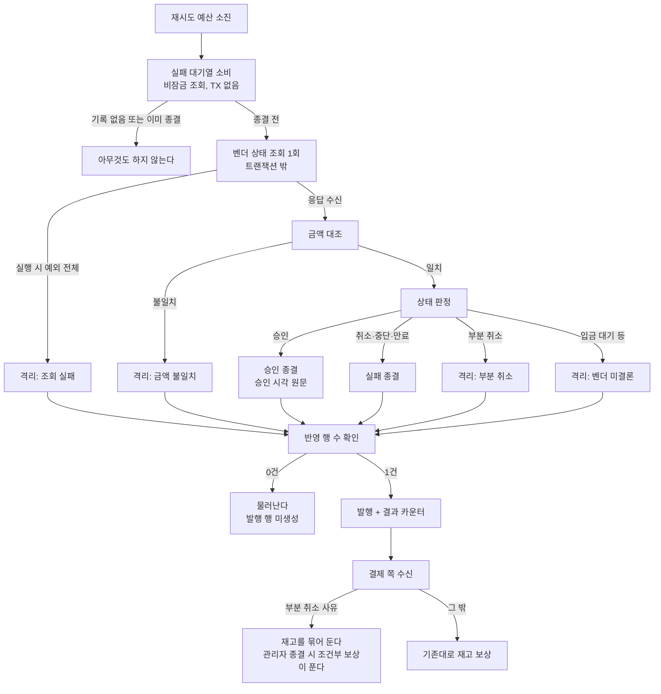

# 벤더 응답 신호 경로 단일화 — 완료 브리핑

> 완료일: 2026-08-14 · 이슈 #142 · 브랜치 `#142`

## 작업 요약

직전 토픽(PG-DUPLICATE-APPROVAL-SETTLEMENT)이 라이브 실측 도중 남긴 관찰에서 출발했다 — 좀비 회수 한 번에 발행 행이 2건 늘었다. 추적해 보니 벤더 전략이 중복 승인 응답을 이벤트와 예외 **두 갈래로 동시에** 신호해, 방어 핸들러가 한 응답에 두 번 돌고 있었다. 두 실행은 서로 다른 트랜잭션에서 돌았다 — 이벤트 쪽은 벤더 호출 도중 리스너가 새 트랜잭션을 열어 커밋하고, 예외 쪽은 워커의 결과 반영 트랜잭션에 참여한다. 발행 식별자가 같아 결제 쪽 종결 가드가 둘 다 흡수했지만, 통합 테스트가 발행 건수 단언을 비워 둘 만큼 구조가 불투명했다.

같은 계열로 두 항목이 더 걸려 있었다. 접수대장의 주문번호 유일 제약이 앞선 토픽에서 유일한 삽입 방어선이 됐는데 순차 호출로만 검증돼 있었고, 재시도 소진 시점에 벤더에 한 번 물어 결론을 내는 관문은 코드만 있고 프로덕션 호출처가 0이었다. 사용자가 셋을 한 토픽으로 묶고 관문 배선까지 포함하기로 결정했다.

**discuss 게이트가 5라운드 걸렸고, 그 과정이 이 작업의 실질이다.** 2라운드에서 domain-expert 가 낸 지적이 토픽 범위를 바꿨다 — pg 안에서 부분 취소를 격리로 **분류만** 바꾸면 아무것도 달라지지 않는다는 것이었다. 결제 쪽 격리 처리도 사유를 보지 않고 도착 즉시 재고를 전액 풀기 때문에, 실패로 보냈을 때와 재고 결과가 같았다. 재고를 풀지 말지는 결제 쪽 정책이므로 방어선도 그쪽에 있어야 했다. 그래서 payment-service 가 범위에 들어왔다.

plan 게이트에서는 배포 순서가 곧 안전장치라는 지적이 나왔다. 관문 배선이 결제 쪽 게이트보다 먼저 들어가면 그 틈에 부분 취소 격리가 재고를 전액 푼다. 순서를 뒤집어 닫았다 — 게이트를 먼저 넣어도 pg 가 그 사유를 발행하기 전까지는 아무 동작도 하지 않는다.

라이브 실측으로 세 장면을 확인했다. 재시도 4회 소진 뒤 관문이 벤더에 물어 **자동 승인 종결**(예전이면 격리), 좀비 회수에 **발행 1건**(이전 실측에서는 2건), 격리가 0인 상태에서 **소진 도달 알람 발화**.

## 핵심 설계 결정

| 결정 | 근거 |
|:---:|:---:|
| 중복 승인은 예외 한 갈래로만 신호 | 순환 의존은 전략이 핸들러를 직접 부를 때 생긴다. 예외를 받아 핸들러를 부르는 것은 벤더 호출 서비스이고 그 서비스는 상태 조회 포트와 무관하다. 트랜잭션 경계도 워커와 일치한다 |
| 이벤트 타입·수신 메서드 삭제 | 유일한 발행처와 유일한 수신처가 동시에 사라진다. 이벤트가 나르던 정보는 확정 요청 객체에 전부 있다 |
| 관문 호출 자리는 실패 대기열 소비 시점 | 소진 도달 지표·알람과 대기열을 거치는 기존 흐름이 유지된다 |
| 승인·확정실패 모두 자동 확정 | 격리에 쌓아도 사람이 할 수 있는 건 실패 종결뿐이고 그때까지 재고가 묶인다 |
| **부분 취소는 확정실패에서 제외** | 벤더가 대금 일부를 쥔 상태다. 실패 확정은 재고를 전액 되돌리는데 그 경로에는 금액 대조가 없고, 이번에 넣은 관문 금액 대조로도 안 잡힌다 — 조회 총액이 부분 취소로 변하지 않는다 |
| **결제 쪽이 부분 취소 사유의 즉시 보상을 건너뛴다** | pg 의 분류 변경만으로는 재고 결과가 같다. 흔적을 남겨 두면 관리자 종결 시 조건부 보상이 풀고, 먼저 푼 쪽이 흔적을 지우므로 이중 보상도 없다 |
| 게이트는 부분 취소에만 | 조회 실패는 모르는 상태지만 벤더 장애 때 대량으로 쏟아진다. 여기까지 묶으면 정상 판매가 광범위하게 막히고 흔적 만료 미복원도 대량으로 따라온다 |
| 관문 조회는 트랜잭션 밖 | 외부 호출이 DB 커넥션을 쥐지 않는다. 벤더 호출 서비스가 이미 쓰는 분리 방식 |
| 금액 대조를 상태 판정보다 먼저 | 자동 승인 확정을 켜는 이상 중복 승인 경로와 같은 방어선이 필요하다 |
| 조회 예외를 실행 시 예외 전체로 포착 | 두 게이트웨이 예외만 잡으면 나머지가 대기열 소비자까지 새어나가 재소비를 부른다 — "1회 조회" 불변이 깨진다 |
| 격리 사유 4갈래 분리 | 남는 격리는 사람이 판단할 것들이다. 특히 "묻지 못한 것"과 "벤더가 아직 결론을 안 낸 것"을 섞으면 나중에 승인될 건을 실패로 종결시킬 수 있다 |
| 소진 도달 알람을 관문 결과 합산으로 | 격리 전이만 세면 자동 확정된 소진 건이 신호에서 사라진다 |
| 배포 순서: 결제 게이트 → 관문 배선 | 반대로 두면 그 사이 부분 취소 격리가 재고를 전액 푼다. 이 순서는 안전하다 — 게이트는 사유가 발행되기 전까지 no-op |

**기각된 대안**

- **예외 쪽 호출을 막고 이벤트만 남긴다** — 예외는 어차피 남아야 한다(중복 승인을 승인 성공과 구분하려면). 결국 신호가 둘 다 남고 한쪽 실행만 막는 형태가 되며, 벤더 호출 도중 리스너가 새 트랜잭션을 여는 구조도 그대로다
- **관문 트랜잭션에 제한시간만 건다** — 규칙이 허용하지만 확정 한 건이 벤더 응답을 기다리며 커넥션을 계속 쥔다. 소진 건은 이미 벤더가 불안정한 상황이라 대기가 길어질 자리다
- **조회 실패 사유까지 재고를 묶는다** — 벤더 장애 때 대량 발생해 정상 판매를 광범위하게 막는다

## 변경 범위

| 영역 | 변경 | 의도 |
|:---:|:---:|:---:|
| 벤더 전략 3종 | 중복 승인 이벤트 발행·발행자 의존 제거, cycle 회피 Javadoc 정정 | 신호를 예외 한 갈래로 |
| `DuplicateApprovalDetectedEvent` + 수신 메서드 | 삭제 | 수신처·발행처 동시 소멸 |
| `pg/mock/FakePgGatewayAdapter` | 이벤트 생성·발행자 배선 제거 | 13개 테스트가 공유하는 대역 |
| `PgFinalConfirmationGate` | 금액 대조 선행, 부분 취소 분리, 사유 4갈래, 실행 시 예외 전체 포착, 전이 반영 가드 3곳, 승인 시각 원문 전달, 조회/반영 TX 분리, 결과 분포 카운터, 격리 도달 카운터 이관 | 배선의 전제를 모두 갖춤 |
| `PgDlqService` | 격리 직행 → 관문 위임, 전위 조회 비잠금, TX 경계 제거, `RETRY_EXHAUSTED` 상수 정리 | 관문을 실제로 켠다 |
| `PaymentConfirmResultUseCase` | 부분 취소 사유의 즉시 재고 보상 건너뜀 + 전용 로그 | 재고 누수 차단 |
| `FakePgGatewayStrategy` | `fake-lost-` 시나리오(확정 실패 + 조회 승인) | 자동 승인 장면 재현 수단 |
| `dlq.yml` / `dlq_test.yml` | 앱 카운터 pg 분기를 관문 결과 합산으로, 자동 승인 단독 발화 케이스 추가 | 관측 공백 차단 |
| 검증 | 접수대장 동시 삽입, 대기열→종결 통합 5종, 자기루프 발행 건수 단언 | — |

**무관** — 접수대장·발행대장 스키마(마이그레이션 없음), 발행 페이로드 구조(사유 문자열만 증가), payment 의 승인·실패 수신 처리.

## 다이어그램

## 코드 리뷰 요약

ship 1차에서 reviewer 는 revise(major 2), **domain-expert 는 pass**(findings 없음). domain-expert 는 배선의 도메인 위험을 코드로 대조하고 경합 통합 테스트 10회와 양쪽 서비스 테스트를 직접 실행해, 전이 반영 가드가 세 갈래 모두에 걸렸고 양쪽 서비스의 사유 문자열이 일치하며 격리 도달 카운터의 멱등 지점이 유지됐음을 확인했다.

| finding | severity | 처리 |
|:---:|:---:|:---:|
| 관문 Javadoc 이 "후속 Phase 에서 연결 예정"이라는 미배선 시절 문구를 그대로 둠 | major | 채택 — 호출 주체 명시로 정정 |
| `ConfirmedEventPayload.quarantinedWithAmount` 가 고아가 됨 | major | 채택 — 삭제. 결제 쪽이 격리 결과에서 금액을 쓰지 않는 것(금액 검증은 승인 경로 한정)을 먼저 대조 |

재리뷰 pass, 새 findings 없음.

**앞선 단계 게이트에서 걸러진 것** (이 작업의 실질적 소득)

- discuss 2차 domain-expert **fail** — 부분 취소를 격리로 보내도 결제 쪽이 사유를 보지 않아 재고 결과가 같다. **이 지적이 토픽 범위를 두 서비스로 넓혔다**
- discuss 3차 domain-expert **fail** — 즉시 보상을 미뤄 생긴 대기 창이 재고 재동기화 도구·8일 흔적 수명과 부딪힌다
- discuss 1차 domain-expert **fail** — 부분 취소를 자동 실패 확정하면 벤더 보유분이 남은 채 재고만 전액 복원된다
- discuss 4차 domain-expert revise — "애매하면 재고를 풀지 않는다"를 부분 취소에만 적용한 비대칭에 설명이 없다
- discuss 1차 reviewer revise — 관문 배선이 기존 소진 도달 알람을 조용히 무력화한다
- plan 1차 domain-expert **major** — 배선이 결제 게이트보다 먼저 배포되면 재고 누수가 재현된다. **순서 변경으로 닫음**
- plan 1·2차 reviewer revise — 이벤트 삭제가 13개 테스트 공유 대역을 깨뜨리고, 대기열 서비스 생성자 변경이 다른 컨슈머 테스트를 컴파일 실패시키며, 배선 후 소진 사유 변경이 기존 통합 테스트 단언을 깨뜨린다

## 라이브 실측

모의 벤더 백본으로 세 장면. 리포트: `live-drill/report-issue-142.html` (저장소 밖).

| 장면 | 결과 |
|:---:|:---:|
| 소진 후 벤더가 승인으로 답함 | 시도 4회 소진 후 **자동 승인 종결**, 발행 1건, 격리 도달 카운터 0 |
| 중복 승인 응답(좀비 회수) | 회수 1회에 **발행 1건**(이전 실측 2건). 두 발행의 승인 시각 동일 — 조회 원문 보존 확인 |
| 소진 도달 알람 | 격리 0인 상태에서 발화 — 자동 확정 건도 신호에 잡힌다 |

**실측이 찾은 것** — 알람 표현식 값이 조건을 넘겼는데도 발화하지 않아 파 보니 Prometheus 가 옛 규칙을 들고 있었다. 규칙 파일을 고쳐도 컨테이너가 리로드하지 않으면 알람은 예전대로 돈다(`curl -X POST :9090/-/reload` 로 해소). 코드 결함이 아니라 배포 절차의 사실이며, promtool 픽스처 통과만으로는 드러나지 않는 자리다.

**한계** — 발행 건수와 좀비 회수는 운영자 화면에 노출되지 않아 대장을 직접 조회했다. 좀비는 화면으로 만들 수단이 없어 접수 기록을 DB 로 되돌려 조성했다. 부분 취소·입금 대기 같은 벤더 상태는 모의 벤더로 재현하지 않았고 단위·통합 테스트로만 덮여 있다.

## 미결 / 후속

- **재고 재동기화의 진행 중 선차감 가드** — 이번 결정이 대기 창을 며칠로 늘려 충돌 확률이 올라갔다. 도구 자체의 한계는 이전부터 있었다
- **선차감 흔적 만료 임박 알람** — 8일 경계가 부분 취소 격리에 적용됐다. 지표·규칙 신설 필요
- **관리자 조회 서비스의 부분 취소 분류** — 자동 경로만 고쳤다. 사람 경로는 판정값·화면·종결 가드까지 손봐야 한다

셋 다 `TODOS.md` 에 등재했다.

## 수치

- 태스크 12개 / 커밋 25개 (설계·플랜 2 + TDD·구현 21 + 리뷰 수정 1 + 중단 WIP 1)
- 39개 파일, 2878줄 추가 / 740줄 삭제
- 테스트: pg-service 단위 454 + 통합 62, payment-service 단위 622 + 통합 149 — 네 갈래 모두 캐시 없이 실제 실행 확인. 린트 게이트 통과, `promtool` 26케이스 통과
- findings: ship 기준 critical 0 / major 2 / minor 0. 앞선 단계 게이트에서 critical 3 · major 6 추가로 걸러짐
