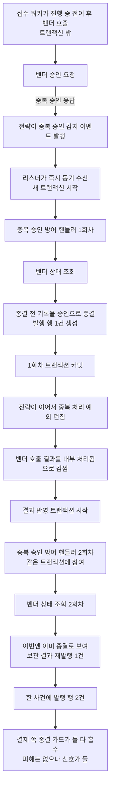
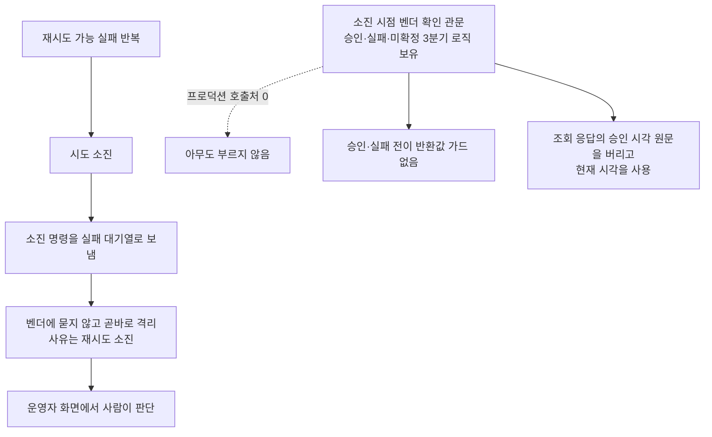
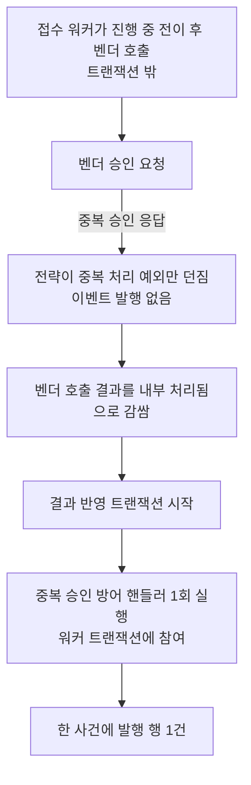
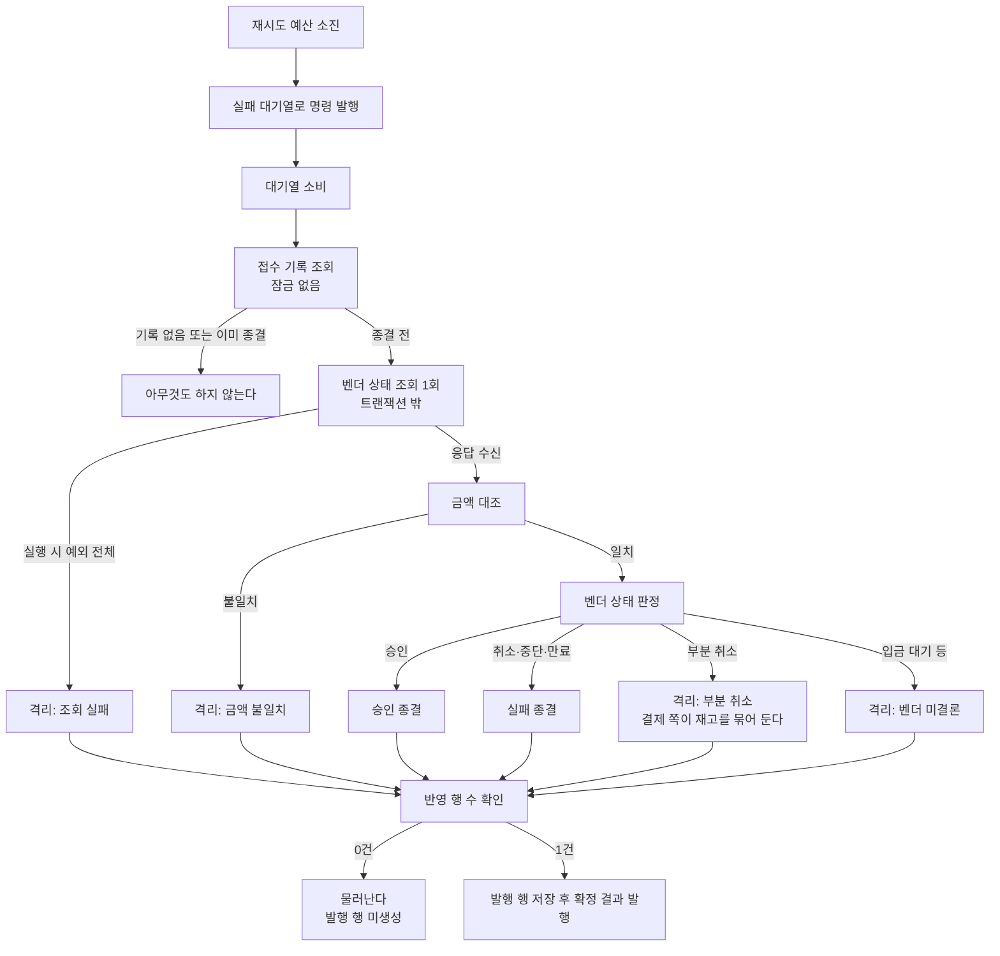
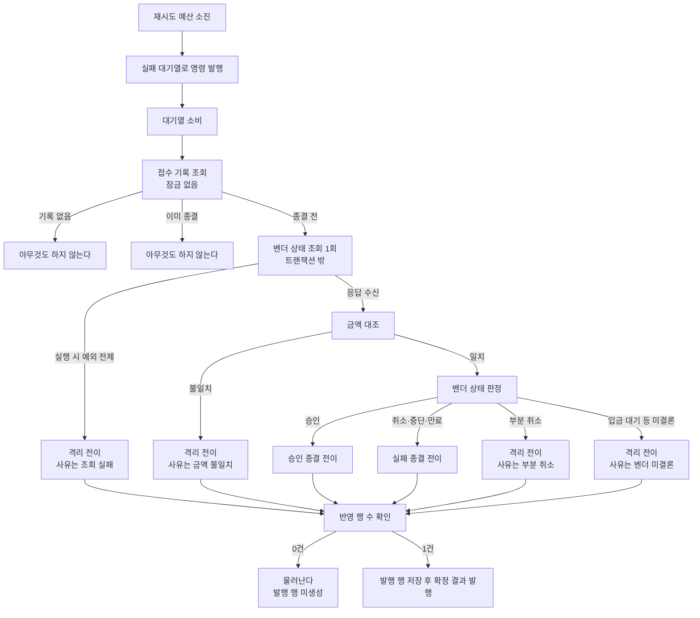

# 벤더 응답 신호 경로 단일화 설계

> 최종 수정: 2026-08-13

## 사전 브리핑

### 현재 이해한 문제

벤더가 중복 승인이라고 답하면 pg 는 그 사실을 **두 갈래로 동시에** 알린다 — 애플리케이션 이벤트 하나, 예외 하나. 두 갈래가 각각 중복 승인 방어 핸들러를 돌려 한 응답에 처리가 두 번 실행되고, 같은 사건에 확정 결과 발행이 2건 나간다. 지금은 두 발행이 같은 식별자를 달고 나가 결제 쪽 종결 가드가 흡수하지만, 신호가 둘이라는 사실 자체가 흡수 규칙에 기대는 구조다.

같은 벤더 응답 처리 계열에 두 항목이 더 걸려 있다 — 접수대장의 주문번호 유일 제약이 실제 동시 삽입으로 검증된 적이 없고, 재시도 소진 시점에 벤더에 한 번 물어 결론을 내는 관문은 코드만 있고 아무도 부르지 않는다.

### 현재 시스템 동작 (as-is)

**중복 승인 신호가 두 갈래로 갈라지는 구간**

**재시도 소진 이후 — 관문은 있으나 아무도 부르지 않는다**

**접수대장 유일 제약**

주문번호 유일 제약이 중복 삽입을 흡수하는 유일한 방어선인데, 검증은 한 스레드가 두 번 부르는 순차 호출뿐이다. 실제 두 스레드가 같은 순간 삽입을 시도하는 경로는 어느 테스트도 밟지 않는다.

### 이번 discuss 에서 결정하려는 것

- 중복 승인 신호를 **어느 갈래로 줄일지** — 이벤트를 걷을지, 예외 쪽 실행을 막을지. 이벤트 갈래는 순환 의존 회피가 도입 이유였으므로 그 제약을 깨지 않아야 한다
- 남기는 갈래의 **트랜잭션 경계**가 어디여야 하는지 — 지금 두 갈래는 서로 다른 트랜잭션에서 돈다
- 접수대장 유일 제약의 **동시 삽입 검증을 어느 계층**에 둘지
- 재시도 소진 시점 벤더 확인 관문을 **배선할지 말지**, 배선한다면 이번 토픽 범위인지 후속인지
- 배선하기로 하면 딸려오는 두 결함(전이 반환값 가드 부재, 승인 시각 원문 유실)의 처리 범위

### 열린 질문 / 가정

- **가정**: 중복 승인 방어 핸들러의 내부 분기 로직 자체는 직전 토픽에서 정리를 마쳤으므로 이번엔 손대지 않는다. 바꾸는 것은 그 핸들러를 **몇 번, 어느 트랜잭션에서 부르는가**뿐이다
- **가정**: 발행이 2건에서 1건으로 줄어도 결제 쪽은 변화가 없다 — 흡수하던 두 번째가 사라지는 것뿐이라 payment-service 는 무관 범위로 본다. 설계 단계에서 이 전제를 다시 확인한다
- **확정 (2026-08-13 사용자 판단)**: 관문을 배선하고 **이번 토픽 범위에 포함**한다. 벤더가 승인이라 답하면 자동 승인 종결, 실패라 답하면 자동 실패 종결까지 간다 — 격리는 미확정에만 남긴다. 격리에 쌓아 두면 사람이 누를 수 있는 것도 실패 종결뿐이고 그때까지 재고가 묶인다는 점이 근거다
- **확정 (2026-08-13 사용자 판단)**: 관문은 **실패 대기열을 소비하는 시점**에 부른다 — 지금 벤더에 묻지 않고 곧바로 격리시키는 그 자리를 대체한다. 소진 도달 지표와 알람, 대기열을 거치는 기존 흐름이 유지된다

**domain-expert 포함** — 결제 상태 전이·멱등성·외부 벤더 연동을 모두 건드린다.

---

## 요약 브리핑

### 결정된 접근

중복 승인 신호에서 **이벤트 갈래를 걷어내고 예외 갈래만 남긴다** — 순환 의존이 애초에 없는 경로이고 트랜잭션 경계가 워커와 맞는 쪽이다. 한 응답에 핸들러가 한 번만 돌고 발행도 1건이 된다.

재시도 소진 시점에는 **벤더에 한 번 묻고 결과대로 확정한다.** 승인이면 완료, 취소·중단·만료면 실패, 그 밖은 격리. 격리 사유를 네 갈래로 나눠 사람이 판단할 재료를 남긴다. 조회는 트랜잭션 밖에서 하고 반영만 트랜잭션 안에서 한다.

한 곳은 결제 쪽까지 손댄다 — **부분 취소는 벤더가 대금 일부를 쥔 상태**라 실패로 확정하지도, 재고를 즉시 풀지도 않는다. 재고는 관리자가 격리를 종결할 때 기존 조건부 보상이 푼다.

### 변경 후 동작 (to-be)

**중복 승인 신호 — 한 갈래로**

**재시도 소진 이후 — 묻고 가른다**

### 핵심 결정

- 중복 승인 이벤트 타입과 수신 메서드를 삭제하고, 전략 3종이 발행자에 걸던 의존을 끊는다
- 관문을 실패 대기열 소비 시점에 배선해 지금의 격리 직행을 대체한다
- 확정 실패는 취소·중단·만료 셋만. 부분 취소는 전용 사유로 격리하고 결제 쪽이 즉시 보상을 건너뛴다
- 금액 대조를 상태 판정보다 먼저 넣고, 실행 시 예외 전체를 조회 실패로 접는다
- 모든 전이가 반영 행 수를 확인하고 0건이면 발행 행을 만들지 않는다
- 소진 도달 알람을 관문 결과 합산으로 재정의해 자동 확정된 건도 신호에 남긴다

### 트레이드오프 / 후속 작업

- **재고가 며칠 묶일 수 있다** — 부분 취소 격리는 관리자가 종결해야 재고가 풀린다. 선차감 흔적에 8일 수명이 있어 그 안에 종결하지 못하면 복원되지 않는다. 모자라는 쪽이라 과매도로 번지지는 않지만 사람이 대사해야 한다
- **재고 재동기화 도구와 겹칠 수 있다** — 그 창이 초 단위에서 며칠로 늘어난다. 대기 중 재동기화를 실행하면 재고가 부풀 수 있어 실행 전 확인이 필요하다. 도구 자체의 가드는 후속
- **게이트를 부분 취소에만 건다** — 조회 실패는 모르는 상태지만 벤더 장애 때 대량으로 쏟아져, 여기까지 묶으면 정상 판매가 광범위하게 막힌다
- **후속으로 넘긴 것** — 재동기화 도구의 진행 중 선차감 가드, 흔적 만료 임박 알람, 관리자 화면 벤더 조회 서비스의 같은 상태 분류

---

## 문제 정의

pg 가 벤더 응답을 받아 결제를 종결짓는 경로에 세 가지가 겹쳐 있다.

**신호가 둘이다.** 중복 승인 응답 하나에 애플리케이션 이벤트와 예외가 동시에 나가, 중복 승인 방어 핸들러가 한 응답에 두 번 돈다. 두 실행은 서로 다른 트랜잭션에서 도는데 — 이벤트 쪽은 벤더 호출 도중 리스너가 새 트랜잭션을 열어 커밋하고, 예외 쪽은 워커의 결과 반영 트랜잭션에 참여한다 — 첫 실행이 종결시킨 뒤 두 번째가 그 결과를 재발행해 같은 사건에 발행 행이 2건 남는다. 두 발행의 식별자가 같아 결제 쪽 종결 가드가 흡수하지만, 발행 건수를 단언할 수 없어 통합 테스트가 그 항목을 비워 둔 상태다.

**소진 후 아무것도 묻지 않는다.** 재시도 예산이 끝나면 벤더 상태를 확인하지 않고 곧바로 격리시킨다. 벤더가 이미 승인했든 명확히 실패했든 구분 없이 한 자리에 모이고, 격리를 벗어나는 자동 경로는 없다. 승인·실패를 가려낼 관문 로직은 이미 있으나 부르는 곳이 없고, 그 로직 자체에도 전이 반환값을 확인하지 않는 자리와 조회 응답의 승인 시각을 버리는 자리가 남아 있다.

**유일 제약이 실제 경합으로 검증된 적 없다.** 앞선 토픽이 pg 리스너의 중복 필터를 걷어내면서 접수대장의 주문번호 유일 제약이 중복 삽입을 막는 유일한 방어선이 됐는데, 검증은 한 스레드가 두 번 부르는 순차 호출뿐이다.

## 영향 범위

| 구분 | 대상 | 내용 |
|:---:|:---:|:---:|
| 변경 | 벤더 전략 3종 (실서비스 2 + 모의 1) | 중복 승인 이벤트 발행 제거, 예외만 남김 |
| 변경 | 중복 승인 방어 핸들러 | 이벤트 수신 메서드 제거 (분기 로직 자체는 불변) |
| 변경 | 소진 시점 벤더 확인 관문 | 조회와 반영의 트랜잭션 분리, 금액 대조 추가, 확정 실패 판정 축소, 조회 예외 포착 확대, 전이 반환값 가드, 승인 시각 원문 전달, 격리 사유 분리, 결과 분포 지표 |
| 변경 | 실패 대기열 처리 서비스 | 격리 직행을 관문 호출로 교체. 전위 조회를 비잠금으로 |
| 변경 | 모의 벤더 | 확정은 실패하고 조회는 승인으로 답하는 시나리오 추가 |
| 변경 | 소진 도달 알람 규칙 | 카운터 의미 변화에 맞춰 표현식·설명 갱신 |
| 삭제 | 중복 승인 감지 이벤트 타입 | 유일한 수신자가 사라진다 |
| 변경 | payment-service 격리 결과 처리 | 부분 취소 사유일 때 즉시 재고 보상을 건너뛴다 |
| 신규 | 접수대장 동시 삽입 검증 | 실제 DB 위 다중 스레드 테스트 |
| 무관 | 발행 페이로드 스키마 | 사유 문자열만 늘어난다. 구조·필드 불변 |
| 무관 | 접수대장·발행대장 스키마 | 마이그레이션 없음 |

## 설계 옵션 비교

### 중복 승인 신호를 어느 갈래로 줄일까

**이벤트를 걷고 예외만 남긴다** — 전략은 예외만 던지고, 그 예외를 받은 벤더 호출 서비스가 핸들러를 부른다.

- 순환 의존이 생기지 않는다. 순환은 *전략이 핸들러를 직접 부를 때* 만들어지는데(전략은 상태 조회 포트의 구현이고 핸들러는 그 포트를 쓴다), 이 경로에서 핸들러를 부르는 것은 전략이 아니라 벤더 호출 서비스다. 그 서비스는 이미 핸들러를 필드로 들고 있고 상태 조회 포트와는 무관하다
- 트랜잭션 경계가 워커의 정상 경계와 일치한다. 벤더 호출은 트랜잭션 밖에서, 결과 반영은 반영 트랜잭션 안에서 — 프로젝트의 트랜잭션 규칙 그대로다
- 이벤트가 실어 나르던 정보(주문번호·금액·벤더 구분)는 확정 요청 객체에 전부 들어 있어 잃는 것이 없다
- 이벤트 타입과 수신 메서드, 전략 3종의 발행자 의존이 함께 사라진다

**예외 쪽 핸들러 호출을 막고 이벤트만 남긴다**

- 예외는 어차피 남아야 한다 — 벤더 호출 서비스가 정상 반환을 전부 승인으로 감싸기 때문에, 중복 승인을 승인 성공과 구분하려면 예외로 빠져나가는 길이 필요하다. 결국 신호는 둘 다 남고 한쪽의 실행만 막는 형태가 된다
- 벤더 호출 도중(트랜잭션 밖) 리스너가 새 트랜잭션을 열어 DB 를 쓰는 구조가 그대로 남는다. 워커의 반영 트랜잭션과 롤백 단위가 갈린다
- 이벤트 발행과 예외 전파 사이에서 프로세스가 죽으면 첫 실행만 커밋된 채 워커는 결과를 모른다

→ **이벤트를 걷는다.**

### 관문의 벤더 조회를 어느 트랜잭션에 둘까

관문은 지금 메서드 전체가 하나의 트랜잭션이고 그 안에서 벤더 HTTP 를 호출한다. 부르는 곳이 없어 드러나지 않았을 뿐, 배선하는 순간 외부 호출이 DB 커넥션을 쥔 채 대기하는 구조가 된다 — 벤더 호출은 트랜잭션 밖에서 한다는 규칙에 정면으로 걸린다.

**조회와 반영을 나눈다** — 벤더 호출 서비스가 이미 쓰는 분리 방식(호출은 트랜잭션 없이, 반영은 트랜잭션 안에서)을 그대로 따른다. 같은 모듈에 같은 패턴이 하나 더 생기는 것이라 읽는 사람이 새로 배울 것이 없다.

**트랜잭션에 제한시간만 건다** — 규칙이 허용하는 대안이지만, 확정 요청 한 건이 벤더 응답을 기다리는 동안 커넥션을 계속 쥔다. 소진 건은 이미 벤더가 불안정한 상황에서 발생하므로 대기가 길어질 확률이 높은 자리다. 기각.

### 자동 승인 확정에 금액 대조를 넣을까

중복 승인 방어 핸들러는 벤더 조회 금액과 접수 금액을 먼저 대조하고, 어긋나면 금액 불일치 사유로 격리시킨다. 관문에는 그 대조가 없다 — 조회 결과에서 상태만 보고 금액은 버린다.

지금까지는 관문이 아무도 부르지 않는 코드라 문제가 없었지만, 배선하면 **벤더가 승인이라 답했다는 사실만으로 결제가 완료로 확정된다**. 금액이 어긋난 승인은 그대로 통과해 결제 쪽 정산까지 흘러간다. 같은 상황을 중복 승인 경로에서는 이상 신호로 잡아 격리시키는데 소진 경로에서만 통과시킬 이유가 없다.

→ **관문에도 금액 대조를 넣는다.** 상태 판정보다 먼저 대조하고, 어긋나면 금액 불일치 사유로 격리시킨다 — 중복 승인 핸들러와 같은 순서·같은 사유다.

### 어떤 벤더 상태를 "확정 실패"로 볼까

관문은 지금 취소·부분 취소·중단·만료 넷을 한 덩어리로 묶어 확정 실패로 본다. 부르는 곳이 없어 이 분류가 검증된 적이 없는데, 자동 실패 확정을 켜면 이 목록이 곧 **재고를 되돌려도 되는 상태의 정의**가 된다.

**부분 취소는 이 목록에 있으면 안 된다.** 부분 취소는 벤더가 대금의 일부를 여전히 쥐고 있다는 뜻이다. 실패로 확정하면 결제 쪽은 실패 처리 경로를 타고 재고를 전액 되돌린다 — 그 경로에는 승인 쪽과 달리 금액 대조가 없다. 이번에 넣는 관문 금액 대조도 이 건은 잡지 못한다. 조회 응답의 총액 필드는 부분 취소 여부와 무관하게 원 주문 금액을 그대로 유지하기 때문에 값이 어긋나지 않는다. 결과는 상품이 판매 가능 재고로 돌아오고 고객은 일부 과금이 남는 상태다.

**그런데 격리로 보내는 것만으로는 아무것도 달라지지 않는다.** 결제 쪽 격리 처리도 사유를 보지 않고 도착 즉시 재고를 전액 푼다 — 실패 처리와 똑같은 보상 호출을 똑같이 무조건 실행한다. pg 안에서 분류만 바꾸면 라벨만 달라지고 재고 결과는 동일하다. 재고를 풀지 말지는 애초에 결제 쪽 정책이므로, 방어선도 그쪽에 있어야 한다.

**고칠 재료는 이미 있다.** 관리자가 격리를 종결시킬 때 도는 조건부 보상은 선차감 흔적이 남아 있을 때만 재고를 푼다. 결제 쪽이 이 사유에 한해 즉시 보상을 건너뛰면 흔적이 남고, 관리자가 종결하는 시점에 그 경로가 재고를 푼다. 이중 보상도 생기지 않는다 — 먼저 푼 쪽이 흔적을 지우기 때문이다. "애매하면 재고를 풀지 않는다"는 프로젝트 방침과도 결이 같다.

→ **부분 취소를 확정 실패에서 빼 전용 사유로 격리시키고, 결제 쪽 격리 처리에 그 사유의 즉시 보상을 거르는 게이트를 둔다.** 남은 셋(취소·중단·만료)은 벤더가 대금을 보유하지 않는 상태라 실패 확정과 재고 복원이 성립한다.

### 조회 중 예상 못한 예외를 어떻게 다룰까

관문은 게이트웨이 재시도 가능·불가 두 예외만 잡는다. 그 밖의 실행 시 예외는 대기열 소비자까지 그대로 새어나가고, pg 쪽 대기열 소비자에는 전용 오류 처리기가 없어 기본 동작에 맡겨진다 — 짧은 간격의 재소비로 벤더에 여러 번 묻게 되거나, 조용히 포기돼 좀비 폴링으로 떠넘겨진다. 어느 쪽이든 "한 번만 묻는다"는 불변이 깨진다.

같은 함정을 관리자 화면의 벤더 조회 서비스가 이미 겪고 고쳤다 — 실행 시 예외 전체를 확인 불가로 접고 타입과 사유를 로그에 남긴다. 관문도 같은 형태를 따른다.

→ **실행 시 예외 전체를 미확정으로 접는다.**

### 미확정 격리 사유를 하나로 둘까

미확정에는 성격이 다른 둘이 섞인다 — **벤더에 묻지 못한 것**(제한시간 초과·5xx·네트워크 오류)과 **벤더가 아직 결론을 내지 않은 것**(입금 대기 등). 후자는 시간이 지나면 벤더 스스로 승인으로 갈 수 있는 상태다.

둘을 같은 사유로 격리시키면 운영자가 격리 화면에서 구분할 수 없다. 흔한 소진 건으로 보고 실패 종결을 누르면, 나중에 입금이 완료돼도 시스템은 영구 실패로 남고 과금은 벤더에 남는다. 격리 건수가 줄어드는 대신 남는 건의 판단 재료가 얇아지는 것은 이 배선이 노리는 방향과 반대다.

→ **사유를 둘로 나눈다.** 조회 자체가 실패한 건과 벤더가 결론을 내지 않은 건을 다른 사유 코드로 격리시킨다.

## 결정 사항

| 항목 | 결정 | 이유 |
|:---:|:---:|:---:|
| 중복 승인 신호 | 이벤트 갈래 제거, 예외 갈래만 유지 | 순환 의존이 애초에 없는 경로이고, 트랜잭션 경계가 워커와 일치한다 |
| 이벤트 타입·수신 메서드 | 함께 삭제 | 유일한 발행처와 유일한 수신처가 동시에 사라진다 |
| 핸들러 분기 로직 | 손대지 않는다 | 직전 토픽에서 정리를 마쳤다. 이번에 바꾸는 것은 호출 횟수와 트랜잭션뿐 |
| 관문 호출 자리 | 실패 대기열 소비 시점 — 격리 직행을 대체 | 소진 도달 지표·알람과 대기열을 거치는 기존 흐름이 유지된다 |
| 관문 결과 분기 | 승인이면 승인 종결, 확정 실패면 실패 종결, 그 밖은 모두 격리 | 격리에 쌓아도 사람이 할 수 있는 건 실패 종결뿐이고 그때까지 재고가 묶인다 |
| 확정 실패로 볼 상태 | 취소·중단·만료 셋만. **부분 취소는 제외**하고 전용 사유로 격리 | 부분 취소는 벤더가 대금 일부를 쥔 상태다. 실패 확정은 재고를 전액 되돌리는데 그 경로에는 금액 대조가 없다 |
| 부분 취소의 재고 | 결제 쪽 격리 처리가 이 사유일 때만 즉시 보상을 건너뛴다. 관리자가 격리를 종결할 때 기존 조건부 보상이 푼다 | 격리로 보내는 것만으로는 재고가 그대로 풀린다 — 격리 처리도 사유를 보지 않고 무조건 보상한다. 흔적이 남아 있어야 종결 시점 보상이 작동하고, 먼저 푼 쪽이 흔적을 지우므로 이중 보상도 없다 |
| 다른 격리 사유의 재고 | 조회 실패·벤더 미결론·금액 불일치는 지금처럼 즉시 보상한다 — 게이트는 부분 취소에만 건다 | 부분 취소는 벤더가 대금 일부를 쥐고 있다고 **명시적으로 답한** 확정 사실이고 발생도 드물다. 조회 실패는 모르는 상태이며 벤더 장애 때 대량으로 쏟아진다 — 여기까지 묶으면 정상 판매가 광범위하게 막히고 8일 만료 미복원도 대량으로 따라온다. 벤더 미결론은 아직 대금을 잡지 않은 상태라 보상이 안전하다 |
| 선차감 흔적의 수명 | 8일 안에 종결하지 못하면 재고가 복원되지 않는다는 것을 받아들이고 문서에 남긴다 | 흔적에 걸린 기존 만료를 이 결정 때문에 늘리지 않는다. 넘치는 쪽이 아니라 모자라는 쪽으로 틀어지므로 과매도로 번지지 않는다. 알려진 한계(`CONCERNS.md` L-15)의 연장선이고, 만료 임박 격리 알람은 후속 몫 |
| 재고 재동기화 도구와의 겹침 | 이번 결정이 겹침 창을 초 단위에서 며칠로 늘린다는 사실을 명시하고, 도구 자체의 진행 중 선차감 가드는 후속으로 위임 | 재동기화가 진행 중 선차감을 덮어쓰는 것은 이 결정이 만든 결함이 아니라 그 도구의 알려진 한계다. 다만 창이 길어져 마주칠 확률이 올라간 것은 이 결정의 대가다 |
| 사유 문자열 계약 | pg 와 payment 양쪽에 같은 사유 상수를 각자 둔다 | 서비스 간 공통 모듈을 두지 않는다는 기존 방침. 사유는 이미 자유 문자열로 흐르고 수신 측 역직렬화는 값을 검증하지 않는다 |
| 관문 트랜잭션 | 조회는 트랜잭션 밖, 반영만 트랜잭션 안 | 외부 호출이 DB 커넥션을 쥐지 않는다. 벤더 호출 서비스와 같은 패턴 |
| 대기열 소비의 전위 조회 | 잠금 없이 조회한다 | 잠금을 쥔 채 벤더 응답을 기다리면 막으려던 문제가 형태만 바꿔 되살아난다. 원자성은 반영 단계의 조건부 전이가 맡는다 |
| 금액 대조 | 상태 판정보다 먼저, 어긋나면 금액 불일치 사유로 격리 | 자동 승인 확정을 켜는 이상 중복 승인 경로와 같은 방어선이 필요하다 |
| 조회 예외 포착 범위 | 실행 시 예외 전체를 미확정으로 접고 타입·사유를 로그에 남긴다 | 두 게이트웨이 예외만 잡으면 나머지가 소비자까지 새어나가 재소비를 부른다. 관리자 조회 서비스가 같은 함정을 이미 고쳤다 |
| 전이 반환값 | 승인·실패·격리 모든 전이가 반영 행 수를 확인하고 0건이면 발행 행을 만들지 않는다 | 폴링 안전망이 발행 행을 그대로 집어 억제가 무력화되는 것을 막는다 |
| 승인 시각 | 조회 응답 원문을 승인 페이로드까지 전달 | 현재 시각을 쓰면 자정 경계에서 정산일이 밀린다 |
| 진행 중 아닌 기록 | 승인·실패 전이가 0건이면 물러난다 (격리로 강등하지 않는다) | 이미 다른 경로가 종결시켰다는 뜻이다. 되돌릴 자동 경로가 없는 격리로 밀어 넣을 이유가 없다 |
| 벤더 조회 횟수 | 대기열 소비 1회당 1회 (기존 불변 유지) | 소진은 벤더가 불안정한 상황이다. 관문에서 재시도를 얹지 않는다 |
| 격리 사유 | 네 갈래로 나눈다 — 조회 실패, 벤더 미결론, 부분 취소, 금액 불일치 | 남는 격리 건은 사람이 판단할 것들이다. 판단 재료가 사유에 실려야 한다 |
| 관문 결과 지표 | 승인·실패·격리 사유별 분포를 새 카운터로 노출 | 배선의 효과(격리로 오던 건 중 몇 할이 자동 확정되는지)를 관찰할 수단이 필요하다 |
| 기존 소진 도달 카운터 | 격리 전이 지점 그대로 두되, 의미가 "자동 확정하지 못해 사람에게 넘어간 건"으로 좁아짐을 문서화 | 사람 개입이 필요한 건수는 그 자체로 볼 가치가 있는 신호다 |
| 소진 도달 알람 | 표현식을 관문 결과 카운터 합산으로 바꿔 "소진이 발생했다"는 신호를 복원하고 설명을 갱신 | 격리 전이만 세면 자동 확정된 소진 건이 알람에서 사라진다 |
| 모의 벤더 | 확정은 실패하고 조회는 승인으로 답하는 시나리오를 추가 | 지금 구현으로는 이번 배선의 핵심 장면(소진 후 승인 확인)을 라이브로 재현할 수 없다 |
| 접수대장 동시 삽입 | 실제 DB 위 다중 스레드 테스트 | 단위 테스트의 대역은 삽입 흡수를 자체 로직으로 처리해 이 층을 대신 검증하지 못한다 |

### 계층 배치

관문·핸들러·실패 대기열 처리 서비스 모두 application 계층에 그대로 둔다. 새 포트는 만들지 않는다 — 관문이 쓰는 벤더 상태 조회 포트와 접수·발행대장 포트가 이미 있다. 벤더 전략 3종은 infrastructure 에 남고, 이번 변경은 그 전략들이 application 의 발행자에 걸던 의존을 **끊는** 방향이라 계층 의존은 줄기만 한다.

결제 쪽도 마찬가지다. 격리 결과 처리 use-case 안에 조건 분기 하나가 늘 뿐이고, 재고 보상은 이미 있는 포트를 그대로 쓴다 — 새 포트도 새 어댑터도 없다.

## 상태 전이

## 장애 시나리오와 대응

| 시나리오 | 대응 |
|:---:|:---:|
| 관문의 벤더 조회가 제한시간 초과·5xx·네트워크 오류 | 조회 실패 사유로 격리. 재시도하지 않는다 (관문 불변) |
| 조회 중 게이트웨이 예외가 아닌 실행 시 예외 (응답 파싱 실패 등) | 같은 조회 실패 사유로 접는다. 소비자까지 새어나가 재소비를 부르지 않는다 |
| 벤더가 입금 대기처럼 아직 결론 나지 않은 상태로 답함 | 벤더 미결론 사유로 격리 — 시간이 지나면 승인이 될 수 있는 건임을 사유로 구분한다 |
| 벤더가 부분 취소로 답함 | 부분 취소 사유로 격리하고, 결제 쪽이 그 사유의 즉시 재고 보상을 건너뛴다. 재고는 관리자가 격리를 종결할 때 풀린다 |
| 부분 취소 격리를 관리자가 종결하기 전에 같은 주문에 다른 결과가 도착 | 격리는 종결 상태라 결제 쪽 격리 전이가 no-op 으로 흡수한다. 재고 흔적도 그대로라 종결 시점 보상은 여전히 유효하다 |
| 부분 취소 격리를 8일 안에 종결하지 못함 | 선차감 흔적이 만료돼 종결 시점 보상이 아무것도 복원하지 않는다. 재고는 묶인 채 남는다 — 모자라는 쪽이라 과매도로 번지지는 않으나 사람이 대사해 풀어야 한다 |
| 조회 실패로 격리됐는데 사실은 벤더가 승인했던 경우 | 재고는 격리 진입 즉시 풀린다. 관리자가 종결하기 전 벤더에 다시 물어 승인이면 종결이 거부되므로 결제 상태는 방어되지만, 이미 풀린 재고는 되돌아오지 않는다 — 격리된 승인 결제를 되살리는 경로가 없다는 알려진 공백(TQ-2 잔여)의 한 갈래다 |
| 부분 취소 격리 대기 중 그 상품에 재고 재동기화를 실행 | 묶어둔 수량이 가용으로 돌아오고, 나중의 종결 시점 보상이 같은 수량을 한 번 더 얹어 재고가 부풀 수 있다. 재동기화는 진행 중 선차감을 덮어쓰는 도구라는 기존 경고가 이 창에서 더 무거워진다 — 실행 전 그 상품의 미종결 격리를 확인해야 한다 |
| 조회 응답 금액이 접수 금액과 다름 | 금액 불일치 사유로 격리. 자동 승인·자동 실패 어느 쪽으로도 보내지 않는다 |
| 관문이 조회를 마친 사이 다른 경로(좀비 회수·겹친 호출)가 먼저 종결시킴 | 전이 반영 0건 → 발행 행을 만들지 않고 물러난다 |
| 접수 기록이 진행 중이 아닌 상태로 대기열에 도착 | 승인·실패 전이가 진행 중만 잡으므로 0건 → 물러난다. 격리로 강등하지 않는다 |
| 반영 트랜잭션 커밋 직전 프로세스 종료 | 대기열 오프셋 미커밋 → 재기동 후 재소비 → 관문 재호출. 접수 기록이 이미 종결이면 아무것도 하지 않는다 |
| 조회는 성공했으나 반영이 롤백 | 같은 트랜잭션이라 발행 행도 함께 롤백. 재소비 시 다시 조회한다 (벤더에 두 번 묻는 셈이지만 조회는 부작용이 없다) |
| 중복 승인 응답과 겹친 호출 거부가 같은 주문에 연달아 도착 | 각각 기존 경로 그대로 — 신호 갈래를 줄이는 변경이라 분기 자체는 불변 |
| 접수대장 동시 삽입 경합 | 유일 제약이 한쪽을 무시하고, 양쪽 모두 같은 식별자를 돌려받는다 (이번에 검증할 대상) |

## 검증 전략

**단위** — 관문의 여섯 갈래(승인·실패·조회 실패·벤더 미결론·부분 취소·금액 불일치) 각각의 전이와 발행. 부분 취소가 실패로 확정되지 않는 것은 회귀로 고정할 항목이다. 전이 0건일 때 발행 미생성, 승인 시각 원문 전달, 게이트웨이 예외가 아닌 실행 시 예외도 조회 실패로 접히는 것. 중복 승인 핸들러가 한 응답에 한 번만 호출되는 것.

결제 쪽에서는 두 갈래를 가른다 — 부분 취소 사유의 격리는 즉시 보상을 호출하지 않고, 그 밖의 격리 사유는 지금처럼 호출한다. 재고 흔적이 남아 격리 종결 시점 보상이 실제로 작동하는 것까지 이어서 확인한다.

**통합 (실제 DB)** — 접수대장 동시 삽입 다중 스레드 경합. 대기열 소비부터 관문을 거쳐 종결까지의 경로. 기존 자기루프 흡수 테스트가 비워 둔 **발행 건수 단언을 이번에 채운다** — 신호를 한 갈래로 줄이는 변경의 성패가 정확히 그 숫자다.

**관찰 수단** — 관문 결과 분포 카운터로 승인·실패·격리 사유별 건수를 가른다. 실패는 세 가지로 드러난다: 발행 행이 한 사건에 2건 생기면 신호 단일화 실패, 소진 건이 전부 격리로만 떨어지면 배선이 무의미해진 것, 소진 도달 알람이 자동 확정 건을 놓치면 관측 회귀다.

**라이브 실측** — 런타임 동작이 바뀌므로 ship 단계에서 모의 벤더로 두 장면을 돌린다. 재시도 소진 후 벤더가 승인으로 답하는 장면(자동 승인 종결 확인), 중복 승인 응답 장면(발행 1건 확인). 앞 장면은 지금의 모의 벤더로 재현되지 않는다 — 확정은 계속 실패하는데 조회는 승인으로 답하는 시나리오가 없어 조회가 예외로 떨어진다. 그 시나리오 추가가 이번 범위에 들어간다. 세부는 plan 에서 확정한다.

## 제외 범위

- **격리된 승인 결제를 되살리는 복구** — 관문이 승인으로 확정하는 건은 애초에 격리에 들어오지 않게 되지만, 이미 격리된 기록을 되살리는 경로는 여전히 없다. 재고 원장 되쓰기가 선결이라 별도 토픽 몫이다
- **벤더 취소·환불** — 포트 자체가 없다
- **관문 조회 재시도** — 소진은 벤더가 불안정한 상황이라는 뜻이다. 한 번만 묻는다는 불변을 유지한다
- **관리자 화면 벤더 조회 서비스의 같은 상태 분류** — 그쪽도 부분 취소를 확정 실패로 묶는다. 제대로 고치려면 판정값을 늘리고 화면 표시와 종결 가드까지 손봐야 해서 별도 토픽 몫이다. 자동 경로와 달리 사람이 벤더 화면을 대조할 수 있다는 점에서 위험 등급도 다르다. `TODOS.md` 로 위임한다
- **재고 재동기화 도구의 진행 중 선차감 가드** — 재동기화가 진행 중 선차감을 덮어쓰는 문제는 이 도구의 알려진 한계이고 이번 결정이 만든 것이 아니다. 상품별 미종결 격리 조회가 새로 필요해 범위가 한 번 더 늘어난다. `TODOS.md` 로 위임한다
- **선차감 흔적 만료 임박 알람** — 8일 경계를 알람으로 잡으려면 격리 나이를 재는 지표와 규칙이 따로 필요하다. 이번에는 경계의 존재와 결과를 문서에 남기는 데 그치고, 알람은 `TODOS.md` 로 위임한다
- **중복 승인 핸들러 분기 로직** — 직전 토픽에서 정리를 마쳤다. 호출 횟수와 트랜잭션 경계만 바꾼다
- **접수대장·발행대장 스키마** — 마이그레이션 없음
- **payment-service 의 그 밖의 경로** — 이번에 손대는 것은 격리 결과 처리의 재고 보상 게이트 하나뿐이다. 승인·실패 수신 처리와 페이로드 스키마는 그대로다

## 참고

- `docs/archive/pg-duplicate-approval-settlement/COMPLETION-BRIEFING.md` — 이중 발행을 발견한 라이브 실측 기록
- `docs/context/TODOS.md` — 이번 토픽이 닫는 세 항목(중복 승인 신호 이중, 접수대장 동시 경합 검증, 관문 배선 판단)
- `docs/context/conventions/transactions.md` — 외부 호출과 트랜잭션 경계 규칙
- `docs/context/PITFALLS.md` §13 — 승인 시각을 현재 시각으로 대체할 때의 정산일 밀림
- `docs/context/CONCERNS.md` L-15 — 선차감 흔적 만료 후 미복원. 이번 결정이 그 경계를 부분 취소 격리에도 적용시킨다
