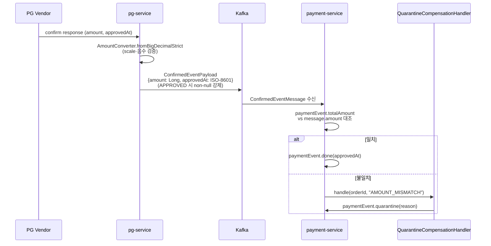

# PRE-PHASE-4-HARDENING 완료 브리핑

## 작업 요약

MSA 분리(Phase 0~3.5)를 마치고 Phase 4(Toxiproxy 장애 주입 + k6 재설계 + 로컬 오토스케일러)에 진입하기 전, 베이스라인 리뷰에서 식별된 **critical 4 · major 8 · minor 5** 부채를 19개 태스크(T-A1~T-J4 + K1~K15)로 분해해 한 라운드에 봉인했다. 사고 재구성 가능성과 회귀 저항성을 확보하기 위해 세 축으로 나눠 진행했다.

1. **축 1 — 비즈니스 로직 정확성**: 상태 전이 불변식, 금액 불변식 양방향 방어, FAIL/QUARANTINED 경로 재고 실복원, dedupe TTL 정합
2. **축 2 — traceId 정확 추적**: HTTP → Kafka → Kafka → HTTP 다중 홉 traceId 연속, Virtual Thread/Async 경계 MDC 전파, outbox relay 원본 traceparent 보존
3. **축 3 — 코드 작성 수준**: 포트 계약 null 금지, 동기 Kafka publish의 `@Transactional` Hikari 점유 제거, worker/aspect `catch (Exception)` swallow 제거

## 핵심 설계 결정

### D1 — `ConfirmedEvent` 계약 확장 (`amount`, `approvedAt`)

`ConfirmedEventPayload`(pg 발행) + `ConfirmedEventMessage`(payment 수신) 양쪽에 `amount(Long)` + `approvedAt(String, ISO-8601)` 필드 추가. APPROVED 일 때 둘 다 non-null 강제.

- **근거**: ADR-15 AMOUNT_MISMATCH 의 역방향 방어선. payment-service가 수신 amount 와 `paymentEvent.totalAmount` 불일치 시 `QUARANTINED(AMOUNT_MISMATCH)` 격리. `Long`(minor unit) 선택 — `pg_inbox.amount` + `AmountConverter.fromBigDecimalStrict` 와 일관. ISO-8601 String — Jackson JSR310 불필요, Kafka 직렬화 단순, OffsetDateTime 으로 PG 벤더 시각대 정보 보존.

### D2 — Stock event publish AFTER_COMMIT 분리 + TX timeout 명시

`PaymentConfirmResultUseCase.handleApproved` 내 직접 Kafka publish 제거 → `ApplicationEventPublisher.publishEvent(StockCommitRequestedEvent)` 로 위임. `StockEventPublishingListener` (`@TransactionalEventListener(AFTER_COMMIT)`) 가 실제 발행. `@Transactional(timeout=5)` 명시.

- **근거**: 동기 Kafka publish 가 `@Transactional` 안에서 Hikari 커넥션을 붙잡으면 broker 지연 시 커넥션 풀 고갈 → 카스케이드 장애. AFTER_COMMIT 분리로 TX 와 발행 격리. timeout 5초 명시로 PG/DB 지연 시 부팅 스레드 점유 한계 시각화.

### D3 — Redis DECR 보상 경로

`OutboxAsyncConfirmService.executeConfirmTx` 실패 시 `decrementStock` 으로 차감한 재고를 `StockCachePort.increment` 로 보상. caller 측 catch 에서 try/catch(RuntimeException) → `compensateStock` 호출 → 원본 예외 re-throw.

- **근거**: confirm TX 가 롤백되면 DB 재고는 원복되지만 Redis 캐시는 별도 경로라 발산. 보상 INCR 로 정합 회복. 보상 자체 실패는 LogFmt.error 후 삼킴 (원본 TX 예외가 우선).

### D4 — Dedupe two-phase lease

`EventDedupeStore.markWithLease(eventUuid, shortTtl=PT5M)` 으로 짧게 락 잡고, 처리 성공 후 `extendLease(eventUuid, longTtl=P8D)` 로 연장. 처리 실패 시 `remove(eventUuid)` 실패면 `payment.events.confirmed.dlq` 로 발행.

- **근거**: 짧은 lease 로 잠금 → 처리 → 연장 패턴은 워커 크래시 시 다음 워커가 빠르게 재진입 가능하게 함. P8D = Kafka retention 7d + 복구 버퍼 1d + product-service `StockRestoreUseCase.DEDUPE_TTL` 정렬.

### D5 — pg-service `PgEventPublisher` 동기 publish

`whenComplete` fire-and-forget → `.get(timeout)` 동기 호출로 변경. publisher 가 broker 도달 보장 후 outbox done.

- **근거**: fire-and-forget 은 broker 미도달 상태에서 outbox done 처리 → 메시지 유실 가능. 동기 + timeout 으로 실패 가시화.

### D6 — Consumer groupId 분리

`StockCommitConsumer` / `StockRestoreConsumer` 가 같은 groupId 였던 부분을 `product-service-stock-commit` + `product-service-stock-restore` 로 분리.

- **근거**: 같은 groupId 면 두 토픽 메시지가 한 컨슈머 인스턴스로 라운드 로빈 → 한 토픽 처리 지연 시 다른 토픽까지 끌려감. 분리하면 독립 스케일 가능.

### D7 — `K1~K15` PaymentCommandUseCase 위임 일원화

`PaymentConfirmResultUseCase.handleApproved/handleFailed` 가 직접 `done()+saveOrUpdate()` 호출하던 부분을 `markPaymentAsDone/markPaymentAsFail` 위임으로 통일. AOP(`@PublishDomainEvent`+`@PaymentStatusChange`) `payment_history` DONE/FAILED 기록 회복.

- **근거**: 직접 호출은 AOP 우회 → audit trail 누락. 위임 일원화로 모든 상태 전이가 같은 path 를 통과.

## 변경 범위

### 도메인 (domain)
- `PaymentEventStatus.isTerminal()` 단일 진실 원천 활용 확장 (T-C2 가드)
- `PaymentEvent.quarantine()` 가드 강화 (`IllegalStateException` 이중 가드)
- `EventDedupeStore` 포트: `markWithLease/extendLease/remove` 신설, `markSeen` deprecated default

### Application (application)
- `PaymentConfirmResultUseCase`: AOP 위임 일원화, two-phase lease 적용, ApplicationEventPublisher 경유 stock 분리, `@Transactional(timeout=5)`
- `OutboxAsyncConfirmService`: D3 보상 경로 추가, `executeConfirmTxWithStockCompensation` 추출
- `FailureCompensationService.compensate(orderId, productId, qty)` 단일 productId 오버로드 신설
- `StockEventPublishingListener` 신규 (AFTER_COMMIT)
- `PaymentConfirmDlqPublisher` 포트 + DLQ 발행 경로
- `LocalDateTimeProvider` 주입 — `LocalDateTime.now()` 위조 제거

### Infrastructure (infrastructure)
- `EventDedupeStoreRedisAdapter`: SET NX EX (markWithLease) / SET XX EX (extendLease) / DEL→boolean (remove). 기본 TTL P8D
- `PaymentConfirmDlqKafkaPublisher` 신규 (`payment.events.confirmed.dlq` 전용 String KafkaTemplate)
- `KafkaProducerConfig`: stock_outbox / confirmedDlq 자체 생성 ProducerFactory 에 ObservationRegistry 명시 wiring (T-J2 — traceparent 전파 누락 보완)
- `PgEventPublisher`: `whenComplete` → `.get(timeout)` 동기 전환 (D5)
- `KafkaMessageConverterConfig` (product-service): record deserialize 회귀 해소 (T-I3)

### PG (pg-service)
- `PgConfirmService`/`DuplicateApprovalHandler`/`PgFinalConfirmationGate`: APPROVED 분기 amount/approvedAt non-null 주입
- `FakePgGatewayStrategy` 신설 (`pg.gateway.type=fake` `@ConditionalOnProperty`, PostConstruct 경고 배너)

### Consumer (product-service)
- `StockCommitConsumer` / `StockRestoreConsumer` groupId 분리 (D6)

### 트레이스 + 관측
- `OtelMdcMessageInterceptor` (T-E1) — Kafka consumer 측 traceparent 헤더 → MDC 복원
- `HttpOperatorImpl` traceparent 전파 검증 — MockWebServer 기반 테스트 (T-E2)
- `scripts/smoke/trace-continuity-check.sh` (T-E3) — HTTP→Kafka→Kafka→HTTP 다중 홉 자동 검증

### Contract test (T3.5-10)
- `ProductHttpAdapterContractTest` + `UserHttpAdapterContractTest` 각 4케이스 — 404/503/429/500 분기 계약 고정

## 다이어그램 — `ConfirmedEvent` 양방향 amount 방어선

## 코드 리뷰 요약

3 라운드 교차 리뷰 (Critic + Domain Expert 병렬). 베이스라인 critical 4 · major 8 · minor 5 → 라운드 3 종결 시 critical 0 · major 0 · minor 0. T-H1(PaymentConfirmPublisherPort non-blocking 계약 Javadoc + <50ms assertion) 와 T-H2(StockEventPublishingListener `stock.kafka.publish.fail.total` counter + Phase 4 TODO 명시) 로 Round 2 의 잔여 major 두 건 해소.

| 라운드 | Critic verdict | Domain verdict |
|---|---|---|
| 1 (baseline) | fail (critical 2 / major 5 / minor 3) | fail (critical 2 / major 4 / minor 3) |
| 2 | major 2 잔존 | minor 1 잔존 |
| 3 | **PASS (0/0/0)** | **PASS (0/0/0)** |

## 수치

| 항목 | 값 |
|------|---|
| 태스크 | 19 (T-A1~T-J4) + 15 (K1~K15) = 34 |
| 테스트 | 357/357 PASS (회귀 0) |
| 베이스라인 → 종결 | critical 4·major 8·minor 5 → 0·0·0 |
| 봉인 시각 | 2026-04-24 |
| 후속 토픽 | `PHASE-4` (Toxiproxy + k6 + 로컬 오토스케일러) |

## 인덱스

- 본 plan 전체: `PRE-PHASE-4-HARDENING-PLAN.md` (같은 디렉토리)
- 토픽 컨텍스트: `PRE-PHASE-4-HARDENING-CONTEXT.md`
- 라운드 로그: `rounds/`
- T-E3 트레이스 연속성 산출물: `phase-gate/trace-continuity-smoke.md` (영구 가이드는 `docs/smoke/trace-continuity-check.md` 로 추출됨)
