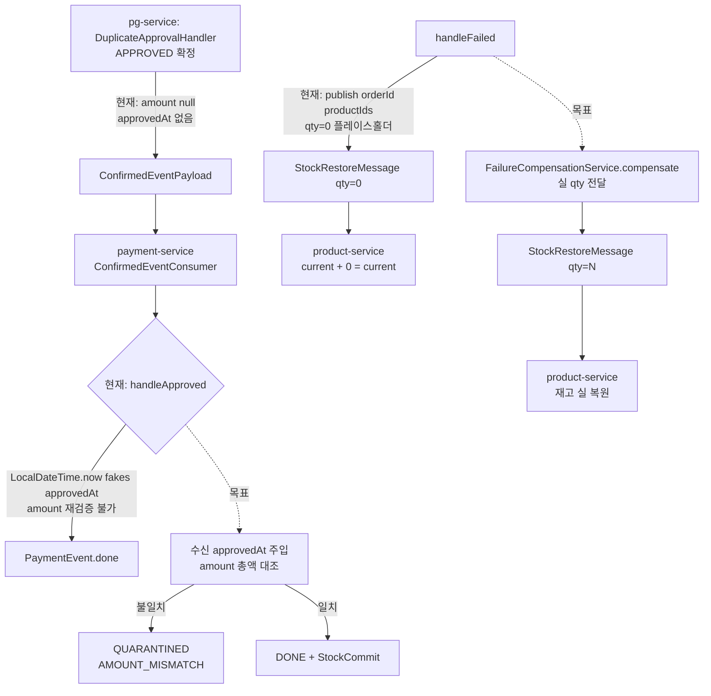

# PRE-PHASE-4-HARDENING

> **배경**: Phase 3.5 완료 후 Phase 4(Toxiproxy 장애 주입 + k6 재설계 + 로컬 오토스케일러) 진입 전에
> 세 축(비즈니스 로직 정확성·traceId 정확 추적·코드 작성 수준)을 하드닝해 사고 재구성 가능성과 회귀 저항성을 확보한다.
>
> **Baseline 리뷰**: `docs/rounds/pre-phase-4-hardening/review-critic-1.md` (critic fail: critical 2 / major 5 / minor 3)
> + `docs/rounds/pre-phase-4-hardening/review-domain-1.md` (domain fail: critical 2 / major 4 / minor 3)

## 목표 (세 축)

1. **축 1 — 비즈니스 로직 정확성**
   - 상태 전이(PaymentStatus 5 × PgInbox 5) 불변식이 모든 진입 경로에서 지켜진다
   - 금액 불변식(ADR-15 AMOUNT_MISMATCH)이 양방향(pg→payment)으로 방어된다
   - FAIL/QUARANTINED 경로의 재고 보상이 실제로 복원된다
   - 멱등성 키 TTL 이 Kafka retention + DLQ 재처리 윈도우와 정렬된다

2. **축 2 — traceId 정확 추적**
   - HTTP → Kafka → Kafka → HTTP 다중 홉에서 traceId 가 연속된다
   - Virtual Thread/Async executor 경계에서 MDC 가 전파된다
   - outbox relay 경로에서도 원본 traceparent 가 보존된다
   - compose-up 스모크로 경로별 traceId 연속성이 검증 가능하다

3. **축 3 — 코드 작성 수준**
   - 포트 계약: null 반환 금지, Optional/예외로 의도 표현
   - 동기 Kafka publish 가 `@Transactional` 내부에서 Hikari 커넥션을 붙잡지 않는다
   - worker/aspect 의 `catch (Exception)` swallow 패턴이 제거되거나 ERROR 승격 + 유형 축소된다
   - ARCHITECTURE.md 가 실제 코드와 일치한다

## 종료 조건

- [ ] Critic + Domain Expert 재리뷰 양쪽 SHIP_READY verdict (critical 0, major 0)
- [ ] `scripts/smoke/trace-continuity-check.sh` (신규) PASS — 다중 홉 traceId 연속성 자동 검증
- [ ] `./gradlew test` 전수 PASS (회귀 없음)

## 설계 결정

### D1 — 이벤트 계약 확장(`amount`, `approvedAt`)

**결정**: `ConfirmedEventPayload`(pg 발행) + `ConfirmedEventMessage`(payment 수신) 양쪽에 다음 두 필드 추가.

| 필드 | 타입 | nullable | 설명 |
|---|---|---|---|
| `amount` | `Long` | **APPROVED 일 때 non-null**, FAILED/QUARANTINED 일 때 nullable 허용 | `BigDecimal` 대신 `Long`(minor unit) — `AmountConverter.fromBigDecimalStrict` 와 일관 |
| `approvedAt` | `String` (ISO-8601, `OffsetDateTime`) | **APPROVED 일 때 non-null** | 역직렬화 측에서 `OffsetDateTime.parse` → `LocalDateTime` 변환 |

**정당화**:
- `Long` 선택 이유: `pg_inbox.amount` 가 이미 `Long`, `AmountConverter` 가 `BigDecimal → Long` 검증(scale/음수 거부) 후 직렬화 경계에서 Long 유지. payload 에서도 같은 타입을 쓰면 재변환 경로가 한 번만 발생.
- `String` ISO-8601 선택 이유: Jackson JSR310 불필요, Kafka 직렬화 단순. `Instant` 대신 `OffsetDateTime` (PG 벤더 시각대 정보 보존).

**영향**: pg-service `PgConfirmService`/`DuplicateApprovalHandler`/`PgFinalConfirmationGate` 가 APPROVED 분기에서 항상 실제 벤더 시각·금액을 payload 에 주입. payment-service `handleApproved` 는 수신 `approvedAt` 을 `PaymentEvent.done(...)` 에 전달하고, `paymentEvent.getTotalAmount()` 와 수신 `amount` 불일치 시 `QUARANTINED(AMOUNT_MISMATCH)` 로 격리(**역방향 방어선**, 축 1 핵심).

### D2 — Payment dedupe TTL

**결정**: `payment.event-dedupe.ttl` 기본값을 **`P8D`** (8일) 로 재설정. `application.yml` 에 명시.

**정당화**:
- 현재 기본값 `PT1H` 는 `@Value` fallback 만 존재, application.yml override 없음
- product-service `StockRestoreUseCase.DEDUPE_TTL = Duration.ofDays(8)` 과 대칭
- Kafka `retention.ms = 7d` + DLQ 재처리 + consumer lag 복구 윈도우 커버

**대안 기각**:
- 7d 정렬(retention 과 동일): 경계값에서 race — 재처리 메시지와 dedupe 만료 동시 발생 가능
- 30d: Redis 메모리 과용, payment_event 테이블 보관 정책과 비대칭

### D3 — Redis DECR ↔ Confirm TX 원자성

**결정**: **옵션 B — executeConfirmTx 실패 시 caller 에서 명시적 보상 호출** (`OutboxAsyncConfirmService` 레벨에서 try/catch → `stockCachePort.increment`).

**정당화**:
- 옵션 A (AFTER_COMMIT 리스너 이동): Redis DECR 을 TX 밖으로 옮기면 **race**(동시 주문 시 재고 오버셀) 가능. 현재 DECR 을 TX 전에 수행하는 이유가 "승인 시도 전 재고 예약" 이라 의미론이 변한다.
- 옵션 C (TCC): 복잡도 대비 이득 부족 (결제 도메인 내 1쌍 관계만).
- 옵션 B 는 기존 경로를 유지하면서 보상 경로만 추가 — 최소 변경.

**세부**:
- `OutboxAsyncConfirmService.confirm` 의 `decrementStock` 직후 `executeConfirmTx` 실패 `catch` 블록에서 `stockCachePort.increment(productId, quantity)` 호출
- `try 블록 내 외부 변수 재할당 금지` 규약(사용자 preference)을 지키기 위해 `executeConfirmTxWithStockCompensation` private 메서드로 추출

### D4 — Dedupe Redis flap 대응

**결정**: **옵션 B — remove 실패 시 DLQ 전송** + **추가 보상**: dedupe 키에 `ttl-short(5m)` 초기 lease 를 찍고, 성공 시 TTL 을 `P8D` 로 extend.

**정당화**:
- 옵션 A (DB 이관): Redis 제거 자체가 큰 이동. Phase 4 진입 후 성능 측정 이후에 재평가.
- 옵션 B 단독: remove 실패 후 DLQ 발생 시 원본 dedupe 키 재처리가 lease 만료로 가능해짐. Two-phase lease 패턴.

**구현 순서**:
1. `EventDedupeStore.mark(eventUUID, shortTtl)` → `extend(eventUUID, longTtl)` 인터페이스 분리
2. `PaymentConfirmResultUseCase` 에서 `processMessage` 성공 후에만 `extend` 호출
3. `remove` 실패 시 DLQ 전송 시도 + 로그 ERROR

### D5 — MDC/OTel 전파 유틸

**결정**: **옵션 A — Micrometer Context Propagation** (`io.micrometer:context-propagation` + `ContextExecutorService.wrap`).

**정당화**:
- 이미 Micrometer Tracing 을 Kafka observation-enabled 용도로 쓰고 있음 — 동일 stack
- 자체 `MdcPreservingExecutor` 보다 유지보수 비용 낮음
- OTel context + MDC 둘 다 한 방에 전파

**적용 위치**:
- `pg-service/PgOutboxImmediateWorker.relayExecutor`
- `payment-service/OutboxWorker` 내 VT executor
- `@Async("outboxRelayExecutor")` 의 `ThreadPoolTaskExecutor.setTaskDecorator(new MdcTaskDecorator())` (Spring-level)

### D6 — HTTP 클라이언트 ObservationRegistry

**결정**: Spring Boot auto-config 의 `RestClient.Builder` / `WebClient.Builder` 를 주입받아 사용. 수동 `.build()` 제거.

**정당화**:
- Boot 3.2+ 는 `RestClient.Builder` auto-config + observationRegistry 자동 적용 — 명시 호출 불필요
- `HttpOperatorImpl` 2곳(payment-service·pg-service) 모두 동일 수정 필요

## 태스크 그룹 개요

| 그룹 | 의도 | 핵심 태스크 | 의존 | tdd | domain_risk |
|---|---|---|---|---|---|
| A | 이벤트 계약 확장(`amount`/`approvedAt`) | A1·A2 | - | ✔ | ✔ |
| B | 재고 보상 실 복원 | B1·B2 | — (B1→B2 내부) | ✔ | ✔ |
| C | 멱등성 수복 | C1·C2·C3 | A1(C2) | ✔ | ✔ |
| D | TX-발행 분리 | D1·D2 | A1·B1 | ✔ | ✔ |
| E | traceId 연속성 | E1·E2·E3·E4 | - | 부분 | ✔ |
| F | 코드 규율 | F1·F2·F3·F4 | - | 부분 | F1만 |
| G | minor 정리 | G1·G2·G3 | - | ✘ | ✘ |
| Gate | 기준선 재리뷰 + 종료 검증 | T-Gate | all | ✘ | ✔ |

## 리스크

- **D4 two-phase lease 복잡성**: 구현 실수 시 기존 dedupe 동작 퇴행. RED 테스트 강화(lease 만료·extend 실패·remove 실패 각 케이스) 필수.
- **A1 `amount` 타입 변경**: 현재 `ConfirmedEventPayload.approved(orderId, eventUuid)` 를 호출하는 경로 모두 감사 필요(grep 으로 호출처 찾기).
- **E1 Micrometer Context Propagation 의존 추가**: 의존성 충돌 여지. gradle clean 후 build 검증.

## Mermaid — 축 1 (돈·재고 보상) 현 상태 vs 목표



## Mermaid — 축 2 (traceId 연속성) 현 상태 vs 목표

```mermaid
flowchart LR
    subgraph 현재
    A1[HTTP checkout<br/>traceId=X] --> B1[PaymentTransactionCoordinator<br/>@Transactional]
    B1 --> C1[OutboxImmediateEventHandler<br/>@Async]
    C1 --> D1[VT executor submit<br/>MDC 단절 → traceId=N/A]
    D1 --> E1[KafkaMessagePublisher<br/>traceparent 자동=현재 span]
    E1 --> F1[pg-service consumer<br/>다른 trace 시작]
    end
```

```mermaid
flowchart LR
    subgraph 목표
    A2[HTTP checkout<br/>traceId=X] --> B2[PaymentTransactionCoordinator]
    B2 --> C2[@Async + MdcTaskDecorator<br/>MDC 전파 X 유지]
    C2 --> D2[ContextExecutorService.wrap VT<br/>traceId=X 유지]
    D2 --> E2[KafkaMessagePublisher<br/>traceparent=X]
    E2 --> F2[pg-service consumer<br/>traceId=X 승계]
    F2 --> G2[HTTP ProductAdapter<br/>RestClient observationRegistry<br/>traceparent=X]
    end
```

## ADR 영향

- **신규 ADR 없음** — 기존 ADR-15(AMOUNT_MISMATCH)·ADR-30(EventDedupeStore)·ADR-22(HTTP Cross-Context)·ADR-13(격리 트리거) 불변식을 **보강**하는 작업.
- D3(Redis DECR 보상) 경로는 TODOS.md 의 "Redis 캐시 장애 즉시 격리 → FAILED 전환 검토" 항목과 상호작용 — 해당 검토는 별도 discuss(`REDIS-CACHE-FAILURE-POLICY`)로 이관 유지.

## 다음 단계

1. 이 토픽 승인 후 `docs/PRE-PHASE-4-HARDENING-PLAN.md` 작성
2. plan-review → execute 루프 진입
3. 최종 verify 에서 archive(`docs/archive/pre-phase-4-hardening/`) + STATE.md 종결
