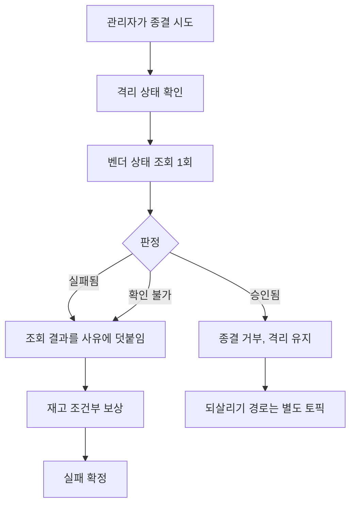
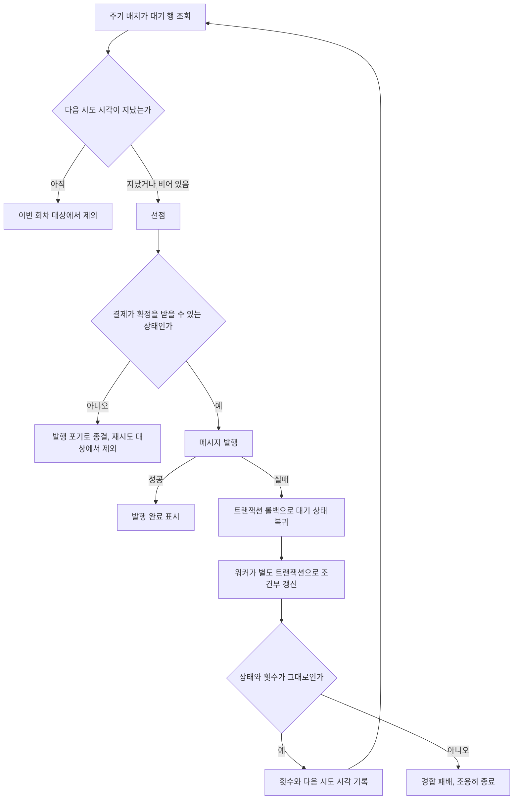

# 재시도 소진 이후 처리 (RETRY-EXHAUSTION-DISPOSITION) — 완료 브리핑

> 기간: 2026-08-05 ~ 2026-08-06 / 이슈·브랜치: #136

## 작업 요약

결제 경로에 재시도가 두 군데 있는데 소진 이후의 처리가 양쪽 다 비어 있었다. 승인 재시도는 소진되면 벤더에 아무것도 묻지 않고 결제를 격리로 보냈고, 격리를 벗어나는 유일한 경로인 관리자 안전 실패 종결도 사유 문자열이 비었는지만 검사했다. 결제 서비스에서 벤더 상태를 물을 통로가 아예 없어 관리자가 확인하려 해도 수단이 없었다. 응답만 유실된 승인이었다면 시스템은 실패로 정리하고 벤더 쪽 과금은 남는다. 발행 재시도는 소진이라는 개념 자체가 없어, 브로커가 죽어 있는 동안 5초마다 무한히 두드렸다.

두 자리에 각각 뒷처리를 붙였다. 격리 종결은 직전에 벤더 상태를 반드시 한 번 묻게 하고, 승인으로 확인되면 종결을 거부한다. 실패나 확인 불가면 진행하되 조회 결과를 사유에 자동으로 붙여 남긴다. 발행 재시도는 워커가 실패를 받아 별도 트랜잭션으로 다음 시도 시각을 기록해 간격을 만든다. 한도 소진 종결은 붙이지 않았다 — 발행 못 한 채 끝나는 결제는 재고를 이미 선차감한 상태라 되돌리는 경로를 함께 만들어야 하고, 지금의 문제는 "영원히 재시도한다"가 아니라 "쉬지 않고 재시도한다"이기 때문이다.

이 토픽은 게이트가 전제를 세 번 뒤집었다. discuss 에서는 "소진 후 시스템이 벤더에 한 번 묻는다"는 초안의 전제가 미연결 죽은 코드를 근거로 삼은 것이었고, plan 에서는 조회 통로를 기존 클라이언트에 얹으면 시간 제한을 물려받아 정상 응답도 끊긴다는 것과 간격 기록을 읽고 저장하면 다른 워커의 선점을 되돌린다는 것이 잡혔다. 셋 다 그대로 구현했으면 조용히 망가졌을 종류다.

ship 리뷰에서 돈이 새는 경로가 하나 더 나와 발행 직전 결제 상태 가드를 넣었는데, 재리뷰가 그 가드가 겨냥한 시나리오에서 발동하지 않음을 잡았다. 원인은 이번 변경이 아니라 우려 대장에 이미 있던 한계였고, 이번 발견의 값어치는 그것이 단순한 상태 잔류가 아니라 **돈이 새는 경로의 전제**라는 사실이다. 가드는 올바른 방어라 남기고, 그 연결을 닫는 일은 재고 보상까지 함께 설계해야 하는 규모라 다음 작업으로 올렸다.

## 핵심 설계 결정

### 벤더 상태를 어디서 얻을 것인가

격리된 결제에는 벤더 상태 근거가 전혀 없다 — 소진에서 격리까지 오는 동안 아무도 묻지 않았기 때문이다. 관리자가 종결하려 할 때 묻는 쪽을 택했다.

**기각한 대안** — 소진 시점에 자동으로 묻는 경로를 잇는 것. 미연결로 남아 있는 최종 확인 컴포넌트를 배선하면 승인·실패로 확정되는 건이 격리에 들어오지 않지만, 벤더 응답 하나로 결제를 자동 승인·자동 실패시키는 결정이라 사람이 개입하는 현재 구조와 성격이 다르다. 배선 여부 자체가 별도 판단을 요구한다.

### 조회 결과별 종결 판정

| 조회 결과 | 판정 | 근거 |
|:---:|:---:|:---:|
| 승인됨 | 종결 차단 | 실패로 정리하는 것 자체가 틀린 처리다. 잘못된 종결보다 격리 잔류가 낫다 |
| 실패됨 | 종결 허용 | 실패 종결이 사실과 맞는다 |
| 확인 불가 | 종결 허용 | 막으면 벤더 장애가 길어질 때 격리를 전혀 풀 수 없어 적체된다 |

강제의 실질은 "확인 없이 종결할 수 없다"이지 "확인되어야만 종결할 수 있다"가 아니다. 확인 불가에서 막지 않는 대신 조회 시도와 결과를 사유에 자동으로 붙여 기록에 남긴다.

판정은 격리 사유와 무관하게 모든 격리 결제에 적용된다. 판단 근거가 저장된 사유가 아니라 그 순간 새로 얻은 벤더 상태이므로 사유별 분기가 필요 없다.

### 조회 통로를 분리한 이유

기존 관리자 조회용 클라이언트에 메서드만 추가하면 시간 제한을 물려받는다. 그 값은 화면 부가 조회용이라 짧게(연결 1초·읽기 2초) 잡혀 있고, 새 조회는 pg 가 벤더를 부르는 시간(읽기 10초)을 포함한다. 정상 응답도 먼저 끊겨 상시 확인 불가로 떨어지는데, 확인 불가는 종결 허용 분기라 로그만 봐서는 정상으로 보인다 — 이 설계가 막으려던 사고를 조용히 재생산한다.

이름(서비스 식별자)은 그대로 두고 설정 네임스페이스만 분리했다. 이름을 바꾸면 서비스 조회가 깨지고, 그걸 막으려 정적 주소를 박으면 인스턴스 목록 해석과 부하 분산을 우회해 특정 인스턴스 장애가 조회 전체 실패로 이어진다.

### 발행 간격을 어디에 어떻게 기록할 것인가

발행 실패는 트랜잭션을 롤백시키므로 같은 트랜잭션에서 횟수를 올려봐야 함께 되돌아간다. 워커가 실패를 받아 별도 트랜잭션으로 기록한다 — 발행 경로의 단일 트랜잭션 불변을 건드리지 않는다.

기록은 **조건부 갱신**이다. 읽어서 고친 뒤 저장하는 방식은 저장이 조건절 없는 전체 덮어쓰기이고 낙관적 잠금도 없어, 읽은 뒤 다른 워커가 선점하거나 발행을 끝낸 행을 대기 상태로 되돌린다. 그러면 같은 확정 명령이 다시 나간다.

**기각한 대안** — 기존 재시도 증가 메서드 재사용. 진행 중 상태 전용 가드가 있어 롤백 직후 대기 상태 행에 쓸 수 없고, 가드를 푸는 것은 전이 의미가 다른 두 용도를 한 메서드에 섞는 일이다.

간격을 적용하는 코드는 새로 만들지 않았다. 대기 행 조회와 선점 쿼리가 이미 다음 시도 시각을 조건으로 읽고 있어, 값이 채워지는 순간부터 작동한다.

### 소진 종결을 붙이지 않은 결정

**기각한 대안** — 한도 소진 시 실패 종결. 설계 당초 의도였으나 발행 못 한 채 끝나는 결제가 생기고, 그 건은 재고를 이미 선차감한 상태라 되돌리는 경로를 함께 만들어야 한다.

이 결정으로 회차에 상한이 없어져 지수 백오프의 시프트 넘침이 실제 위험이 됐다. 실측 결과 기본 간격 1초 기준 54회차부터 지연이 음수가 된다. 시프트 전에 회차를 자르는 처리를 넣었다.

## 변경 범위

| 영역 | 변경 | 의도 |
|:---:|:---:|:---:|
| pg 조회 (신규) | 벤더 상태 조회 엔드포인트 + 조회 서비스 + 판정 값 | 벤더에 1회 묻고 세 값으로 답한다. 모든 실행 시 예외를 확인 불가로 접는다 |
| payment 통로 (신규) | 조회 포트 + 전용 Feign 클라이언트·설정 | 시간 제한을 독립적으로 잡는다. 어댑터는 예외를 던지지 않는다 |
| payment 종결 | 격리 종결 유스케이스에 조회·판정 삽입 | 승인이면 거부. 조회·판정이 비가역인 재고 보상보다 앞 |
| payment 화면 | 격리 상세에 조회 버튼·결과 표시·승인 시 경고 | 종결 전에 눌러 확인할 수 있게. 상세 진입 시 자동 조회는 하지 않는다 |
| payment 정책 | 소진 판정·한도 제거, 지수 백오프 시프트 상한 | 쓰지 않기로 확정된 것을 걷고, 그로 인해 생긴 넘침을 막는다 |
| payment 도메인 (신규) | 대기 상태 전용 간격 기록 메서드, 발행 포기 전이 | 상태 전이 없는 용도를 기존 메서드와 분리 |
| payment 발행 | 워커가 실패를 받아 조건부 갱신으로 기록, 발행 직전 결제 상태 가드 | 동시 선점을 되돌리지 않는다. 종결된 결제에 명령이 나가지 않는다 |
| payment 스키마 | 값이 고정된 컬럼과 그 인덱스 제거 (Flyway V6) | 이번 결정으로 남는 컬럼은 실제로 쓰이게 되고 이것만 죽은 채 남는다 |
| 테스트 표시명 | 내부 식별자 라벨 7개 파일 제거 | 그 작업 당시의 일련번호는 의미 있는 이름이 아니다 |
| 무관 | 벤더 승인 호출 자체, 재시도 백오프 계산식, 소진 토픽 전이 경로, 재고 보상 Lua |

## 다이어그램

### 격리 종결 판정

조회와 판정이 재고 보상보다 앞이다. 보상은 비가역이라 거부될 건에 먼저 나가면 되돌릴 수 없다.

### 발행 재시도 간격

## 코드 리뷰 요약

Reviewer pass(minor 1), Domain Expert revise(major 1 / minor 1) → 수정 → 재리뷰 fail(critical 1).

| severity | finding | 처리 |
|:---:|:---:|:---:|
| major | 발행 재시도가 결제 종결·만료와 분리돼 있어, 브로커 장애가 만료 시한을 넘기면 이미 만료된 결제에 확정 명령이 뒤늦게 나간다. 벤더가 승인하면 되돌릴 수 없는 과금이 생긴다 | 부분 채택 — 발행 직전 결제 상태 가드 추가. 아래 재리뷰 결과 참고 |
| critical (재리뷰) | 그 가드가 겨냥한 시나리오에서 발동하지 않는다 | 사용자 결정으로 가드 유지, 한계 기록 후 종료 |
| minor | 조회 어댑터가 통신 실패와 판정값 매핑 실패를 같은 확인 불가로 접는다 | 스킵 — 실패 방향이 항상 안전 측이고, 지표 라벨 추가는 아직 없는 사고에 대한 범위 확대 |
| minor | pg 조회 서비스의 벤더 종류 해석 헬퍼가 null 을 반환한다 | 스킵 — 컨벤션의 null 금지 범위는 공개 유스케이스·포트이고 이것은 private 헬퍼 |

discuss·plan 게이트에서도 각각 revise 를 받았고, 그 findings 가 이 작업의 실질을 만들었다.

- discuss 1라운드 critical — 설계 초안이 "소진 후 최종 확인이 벤더에 묻는다"를 전제했으나 그 컴포넌트는 프로덕션 호출처가 0인 미연결 코드였다. 실제로는 벤더 확인 없이 격리된다
- plan 1라운드 major — 조회 통로를 기존 클라이언트에 얹으면 시간 제한을 물려받아 상시 확인 불가로 떨어진다
- plan 1라운드 major — 간격 기록을 읽고 저장하면 다른 워커의 선점을 되돌린다
- plan 1라운드 major — 모의 벤더가 미처리 주문의 상태 조회에 던지는 예외를 좁게 잡으면, 하필 재시도 소진 격리 건이 그 경우라 오류가 난다

## 미결 / 후속

### 발행 직전 가드가 지금은 발동하지 않는다

가드가 쓰는 판정은 대기 상태를 통과시키는데, 문제의 결제는 정확히 대기 상태에 머문다.

- 발행 대기 행이 생길 때 결제는 진행 중이고 그 시점에 주문은 실행 중으로 바뀐다
- 브로커 장애가 길어지면 정리 작업이 결제를 대기로 되돌리는데 주문은 실행 중 그대로 둔다
- 만료 처리는 주문이 시작 전 상태일 때만 허용하므로, 실행 중 주문을 가진 결제는 만료 시도마다 실패하고 대기에 영구히 머문다

가드가 실제로 막는 나머지 상태들은 모두 확정 명령이 한 번은 성공적으로 발행된 뒤에야 도달하는 상태라, "아직 한 번도 발행 못 한 행"과 동시에 성립하지 않는다.

원인은 우려 대장 L-14 의 알려진 한계다. 그리고 **그 잔류는 사고가 아니라 의도된 선택**이다 — L-14 에 이미 검토 기록이 남아 있다. 정리 작업이 주문을 시작 전으로 되돌리면 만료가 통과해 종결에 도달하는데, 종결 상태는 확정 결과 적용 가드에 막혀 유실 메시지 재주입 복구까지 봉쇄한다. 그래서 2026-06-30 다른 토픽의 plan 게이트가 그 변경을 거부하고 되돌렸다. 비종결 대기 잔류가 복구 여지 면에서 안전한 방향이라는 판단이다.

이번 발견은 그 판단에 값을 하나 더 붙인다. 대기 잔류의 대가가 "복구 여지를 남긴다" 만이 아니라 **"만료되지 못한 결제에 확정 명령이 뒤늦게 나갈 수 있다"** 는 것이다. 두 위험을 같이 놓고 다시 저울질해야 하는 자리가 됐다. 재고 보상 없이 만료시키면 선차감분이 영구히 묶이는 문제까지 얽혀 있어, 이 셋을 함께 설계해야 하는 규모다.

가드는 유지했다 — 올바른 방어이고 해롭지 않으며, 대기 잔류가 해소되면 그대로 효력이 생긴다.

### 그 밖

- 소진 시점에 자동으로 벤더를 확인하는 경로 배선은 범위 밖으로 뒀다. 벤더 응답 하나로 결제를 자동 전이시키는 결정이라 성격이 다르다
- 격리를 승인으로 되살리는 복구는 재고 확정 재발행과 캐시 재정렬, 동시성이 선결이라 별도 토픽이다. 이번 작업은 그 필요를 화면에 드러내는 데까지 했다
- 격리 종결의 동시 이중 제출은 상태 조건만으로 판정한다. 두 요청이 거의 동시에 들어오면 먼저 통과한 쪽이 이긴다
- 재시도 한도·간격 값의 적정성은 부하 측정 뒤에 정한다
- 라이브 검증은 수행하지 않았다. 관리자 운영 경로가 바뀐 토픽이라 원칙상 대상이지만, 이번 세션에서 스택을 기동하지 않았다. 미검증 항목은 격리 결제를 실제로 만들어 화면에서 조회·종결을 눌러보는 것과 벤더 응답 세 갈래를 화면에서 확인하는 것이다

## 수치

- 태스크: 9개 (+ 리뷰 finding 수정 1회)
- 커밋: 19개
- 테스트: 단위 payment 617 · pg 408 / 통합 payment 149 · pg 16 (모두 캐시 없이 재실행)
- 새 테스트: 저장소 계약, 조회 계약 2층, 설정 계약, 상태별 판정, 동시 선점 반복 50회, 발행 간격 통합
- findings: critical 1(재리뷰) / major 1 / minor 2
