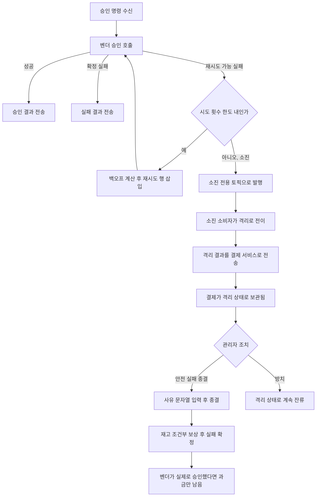
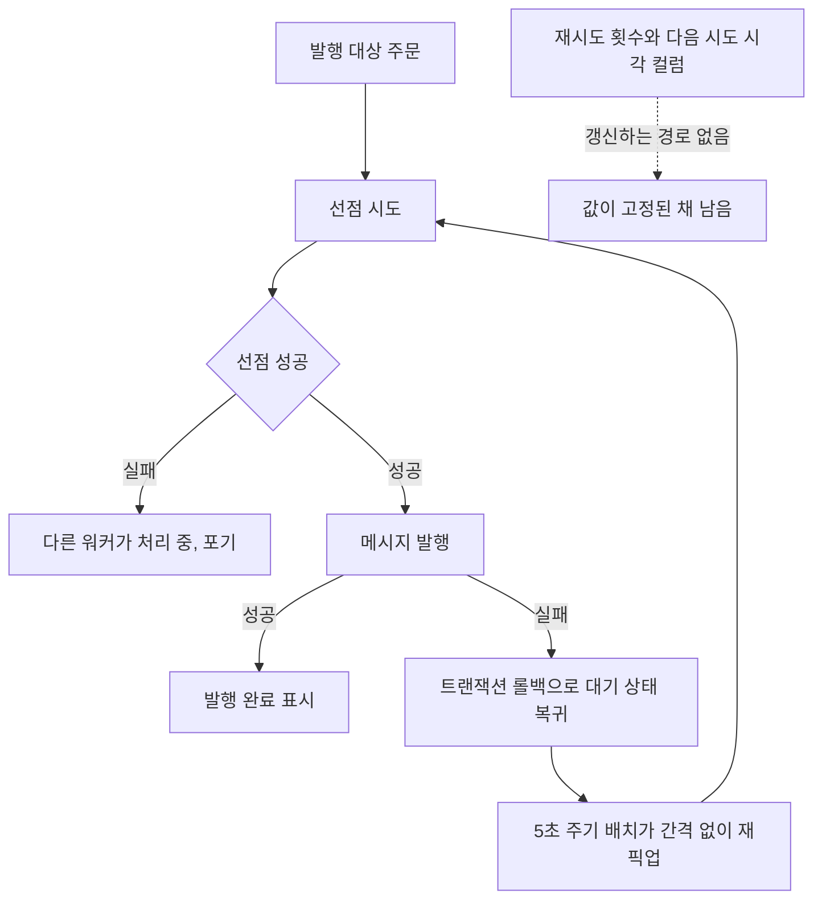
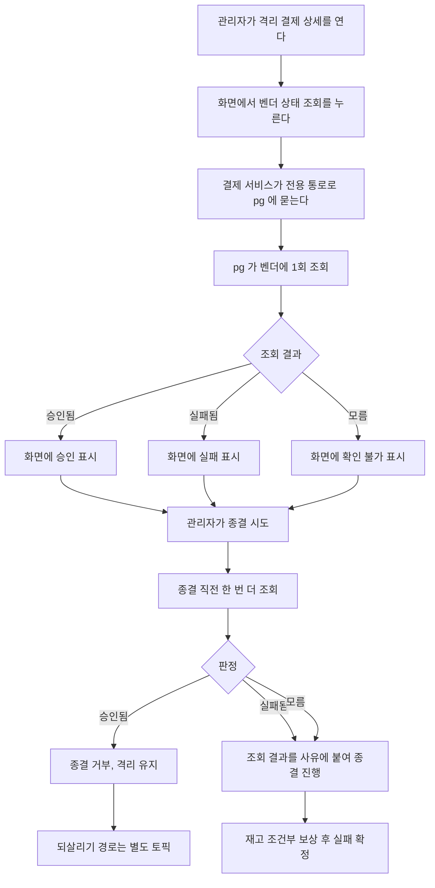
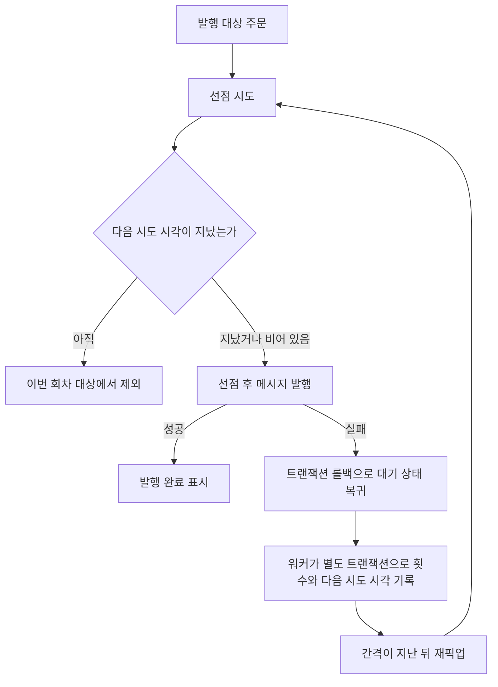

# 재시도 소진 이후 처리 설계

> 최종 수정: 2026-08-05

## 사전 브리핑

### 현재 이해한 문제

결제 경로에는 재시도가 두 군데 있는데, 소진 이후의 처리가 양쪽 다 비어 있다. 승인 재시도는 소진되면 벤더에 아무것도 묻지 않고 결제를 격리로 보내고, 격리를 벗어나는 유일한 경로도 벤더 상태를 보지 않는 실패 종결이라 벤더 쪽 과금이 남을 수 있다. 발행 재시도는 아예 소진이라는 개념이 없어 브로커가 죽어 있는 동안 5초마다 무한히 두드린다.

### 현재 시스템 동작

**승인 재시도와 격리 (pg 측)**

소진에서 격리까지 오는 동안 **벤더에게 상태를 묻는 지점이 한 번도 없다**. 승인 요청이 벤더에 도달했는데 응답만 유실된 경우와, 아예 도달하지 못한 경우가 구분되지 않은 채 같은 격리로 들어온다.

관리자가 종결할 때 사유 입력은 필수이고 그 자리의 설명에도 "벤더 상태 확인 결과를 담으라"고 적혀 있다. 그런데 검사하는 것은 문자열이 비었는지뿐이라, 확인 없이 아무 문장이나 적어도 통과한다. 화면에는 pg 가 남긴 시도 이력이 보이지만 그것은 우리 쪽 기록이지 벤더의 현재 상태가 아니다. 결제 서비스에서 벤더 상태를 물을 수 있는 통로 자체가 없다.

**발행 재시도 (payment 측)**

재시도 횟수를 올리는 코드는 타임아웃 회수 하나뿐인데, 발행이 단일 트랜잭션이라 진행 중 상태가 커밋된 채 남지 않아 그 회수도 대상 행을 찾지 못한다. 결과적으로 횟수는 늘 0, 다음 시도 시각은 늘 비어 있고, 두 값을 읽는 지표 둘도 움직이지 않는다.

### 이번 discuss 에서 결정하려는 것

- 격리 결제를 안전 종결하기 전에 벤더 상태 확인을 코드로 강제할지, 강제한다면 무엇을 근거로 판정할지
- 그 확인을 위해 결제 서비스가 벤더 상태를 물을 통로를 새로 낼지, 아니면 관리자가 화면에서 판단하도록만 도울지
- 발행 재시도에 대기 간격을 둘지, 둔다면 소진 종결까지 붙일지 간격만 둘지
- 발행 재시도에 정책을 두지 않기로 하면 값이 고정된 컬럼과 지표를 걷을지
- 위 결정들이 남기는 잔여 위험을 어디에 기록할지

### 열린 질문 / 가정

- 발행 재시도에 소진 종결을 붙이면 발행하지 못한 채 끝나는 결제가 생긴다. 재고를 이미 선차감한 건이라 복구 경로가 없으면 지금의 무한 재시도보다 나빠질 수 있다. 간격만 두고 포기는 하지 않는 중간안이 실제 후보다.
- 벤더 상태 확인을 강제하려면 조회가 실패했을 때 종결을 막을지 허용할지 정해야 한다. 막으면 벤더 장애 중에 격리를 전혀 풀 수 없고, 허용하면 강제의 의미가 옅어진다.
- 벤더 상태 조회는 외부 호출이라 관리자 요청 경로에 지연을 더한다. 화면 흐름을 어디까지 바꿀지는 조회 통로 결정에 딸린다.
- 재시도 정책 값(한도·간격)의 적정성 검증은 부하 측정이 필요해 이번 범위 밖이다. 이번에는 정책 유무와 구조만 정하고 값은 기존 기본값을 쓴다.
- 검토는 도메인 검토자를 포함한다. 결제 종결 전이와 벤더 과금이 걸린 경로다.

### 조사 중 바로잡은 착오

설계 초안은 "소진 후 최종 확인 단계가 벤더에 한 번 묻고, 그 답이 미확정일 때만 격리된다"고 적었다. **틀렸다.** 두 검토자가 게이트에서 잡았고 코드로 확인했다.

- `PgFinalConfirmationGate.performFinalCheck` 는 프로덕션 호출처가 0이다. 테스트만 부른다 — `ARCHITECTURE.md` 도 미연결로 명시하고 있다.
- 실제 경로는 소진 전용 토픽 소비자가 `PgDlqService.handle` 을 부르고, 그것이 벤더 조회 없이 곧바로 격리로 전이시킨다(사유 `RETRY_EXHAUSTED`).

대장의 원래 서술("격리 사유가 재시도 소진인 건")이 맞았다. 이 정정으로 설계의 방향은 바뀌지 않고 오히려 근거가 강해진다 — 관리자 재조회는 두 번째 확인이 아니라 **그 결제에 대한 최초의 벤더 확인**이다.

---

## 요약 브리핑

### 결정된 접근

격리 결제를 실패로 종결하기 전에 벤더 상태를 반드시 한 번 묻게 한다. 승인으로 확인되면 종결을 거부하고 격리를 유지하며, 실패면 진행하고, 답을 못 얻으면 진행하되 그 사실을 사유에 남긴다. 조회 통로는 pg 에 새로 내되 기존 관리자 조회와 시간 제한이 달라 클라이언트를 분리한다.

발행 재시도에는 대기 간격을 도입한다. 워커가 발행 실패를 받아 별도 트랜잭션으로 다음 시도 시각을 기록하면 기존 조회 조건이 그대로 간격으로 작동한다. 한도 소진 종결은 붙이지 않는다 — 발행 못 한 채 끝나는 결제는 새 복구 부채를 만든다.

### 변경 후 동작

### 핵심 결정 목록

- 격리 종결 전 벤더 상태 조회를 강제한다. 격리 사유와 무관하게 모든 격리 결제에 적용된다.
- 승인으로 확인되면 종결을 막는다. 되살리기는 재고 원장 되돌리기가 선결이라 별도 토픽으로 남긴다.
- 답을 못 얻으면 종결을 허용한다. 막으면 벤더 장애 중 격리가 적체된다.
- 조회 실패는 예외가 아니라 모름 값으로 돌려준다.
- 조회 통로는 전용 클라이언트로 분리하고 시간 제한을 pg 의 벤더 호출보다 길게 잡는다.
- 발행 실패 간격은 워커가 별도 트랜잭션으로 기록하고, 대기 상태 전용 도메인 메서드를 새로 만든다.
- 발행 소진 종결은 도입하지 않고, 쓰이지 않게 된 소진 판정과 한도 설정을 제거한다.
- 값이 고정된 발행 예정 시각 컬럼과 그 인덱스를 제거한다.

### 트레이드오프 / 후속 작업

- 승인으로 확인된 격리는 되살릴 수단이 없어 잔류한다. 재고는 격리 진입 시점에 이미 풀려 있어 잠기지는 않는다.
- 소진 시점에 자동으로 벤더를 확인하는 경로를 잇는 일은 이번 범위 밖이다. 벤더 응답 하나로 결제를 자동 전이시키는 결정이라 성격이 다르다.
- 재시도 한도·간격 값의 적정성은 부하 측정 뒤에 정한다. 이번에는 구조만 세우고 기존 기본값을 쓴다.
- 관리자가 조회를 반복하면 벤더 호출이 늘어난다. 요청당 1회·재시도 없음이 유일한 방어다.

---

## 문제 정의

**격리가 벤더 확인 없이 만들어지고, 벗어나는 길도 벤더를 보지 않는다.** 승인 재시도가 소진되면 소진 전용 토픽을 거쳐 격리로 전이된다. 이 구간에 벤더 상태를 묻는 지점이 없어, 승인이 벤더에 도달했는지 여부가 판정되지 않은 채 격리로 들어온다. 격리를 벗어나는 유일한 경로인 관리자 안전 실패 종결(`QuarantineResolveUseCase.resolve`)도 사유 문자열이 비었는지만 검사한다. 결제 서비스에서 벤더 상태를 물을 통로가 없어 관리자가 확인하려 해도 수단이 없다. 응답만 유실된 승인이었다면 시스템은 실패로 정리하고 벤더 쪽 과금은 남는다.

**발행 재시도에 간격이 없다.** 발행 실패는 트랜잭션 롤백으로 대기 상태에 돌아가고 5초 주기 배치가 곧바로 다시 집는다. 재시도 횟수를 올리는 코드는 타임아웃 회수 하나뿐인데, 발행이 단일 트랜잭션이라 진행 중 상태가 커밋된 채 남지 않아 그 회수도 대상 행을 찾지 못한다. 브로커가 죽어 있는 동안 5초마다 무한히 두드리며, 재시도 횟수와 다음 시도 시각 컬럼은 값이 고정된 채 남는다.

## 영향 범위

| 구분 | 대상 |
|:---:|:---:|
| 신규 (pg) | 벤더 상태 조회 엔드포인트 — 기존 시도 이력 컨트롤러에 추가 |
| 신규 (payment) | 벤더 상태 조회 포트 + **전용 Feign 클라이언트**(기존 관리자 조회용과 시간 제한이 달라 분리) |
| 신규 (payment) | 발행 실패 시 다음 시도 시각을 기록하는 도메인 메서드 |
| 변경 (payment) | 격리 종결 유스케이스에 조회·판정 삽입, 관리자 화면에 벤더 상태 표시 |
| 변경 (payment) | 워커가 발행 실패를 받아 별도 트랜잭션으로 기록, 재시도 정책 값 객체에서 소진 판정·한도 제거 |
| 변경 (payment) | 값이 고정된 컬럼·인덱스 제거 (Flyway) |
| 변경 (pg) | 통합 테스트 표시명에 남은 태스크 식별자 라벨 정리 |
| 무관 | 벤더 승인 호출 자체, 재시도 백오프 계산식, 소진 토픽 전이 경로, 재고 보상 Lua, 미연결 최종 확인 컴포넌트 |

## 설계 옵션 비교

### 벤더 상태를 어디서 얻을 것인가

격리된 결제에는 벤더 상태 근거가 전혀 남아 있지 않다 — 소진에서 격리까지 오는 동안 아무도 묻지 않았기 때문이다.

- **소진 시점에 자동으로 묻는 경로를 잇는다** — 미연결로 남아 있는 최종 확인 컴포넌트를 배선하면 승인·실패로 확정되는 건이 격리에 들어오지 않는다. 그런데 그것은 벤더 응답 하나로 결제를 자동 승인·자동 실패시키는 결정이고, 지금 격리에 사람이 개입하는 구조와 성격이 다르다. 배선 여부 자체가 별도 판단을 요구한다.
- **관리자가 종결하려 할 때 묻는다** — 사람이 개입하는 지점에 확인을 붙인다. 자동 전이가 없어 잘못 판정해도 돈이 자동으로 움직이지 않는다.

두 번째를 택한다. 자동 경로를 잇는 일은 이번 범위 밖으로 두되, 그 필요가 관측되도록 대장에 남긴다.

### 조회 결과별로 종결을 어떻게 판정할 것인가

조회는 세 갈래로 끝난다.

| 조회 결과 | 판정 | 근거 |
|:---:|:---:|:---:|
| 승인됨 | 종결 차단 | 실패로 정리하는 것 자체가 틀린 처리다. 잘못된 종결보다 격리 잔류가 낫다 |
| 실패됨 | 종결 허용 | 실패 종결이 사실과 맞는다 |
| 모름 (조회 실패·미확정) | 종결 허용 | 막으면 벤더 장애가 길어질 때 격리를 전혀 풀 수 없어 적체된다 |

모름에서 막지 않는 대신, 조회를 시도했다는 사실과 그 결과를 종결 사유에 자동으로 붙여 기록에 남긴다. 강제의 실질은 "확인 없이 종결할 수 없다"이지 "확인되어야만 종결할 수 있다"가 아니다.

**이 판정은 격리 사유와 무관하게 모든 격리 결제에 적용된다.** 이 문서는 재시도 소진을 중심으로 서술하지만 격리 사유는 그것 하나가 아니다 — 금액 불일치, 금액 누락, 중복 승인 미확정, 캐시 다운도 있다. 판단 근거가 저장된 사유가 아니라 그 순간 새로 얻은 벤더 상태이므로 사유별 분기가 필요 없다. 종결 유스케이스도 원래 사유로 분기하지 않고 격리 상태인지만 본다.

### 조회 실패를 어떻게 표현할 것인가

- **예외로 던진다** — 결제 서비스가 예외를 잡아 모름으로 바꿔야 하는데, 그 변환이 유스케이스에 들어가면 종결 판정이 예외 처리와 뒤섞인다.
- **모름을 값으로 돌려준다** — pg 가 벤더 조회에 실패하면 모름을 담아 정상 응답한다. pg 자체가 닿지 않으면 결제 서비스 어댑터가 모름으로 변환한다. 포트는 예외를 던지지 않고 항상 세 값 중 하나를 돌려준다.

두 번째를 택한다. 유스케이스의 판정이 세 갈래 분기 하나로 끝난다.

### 새 조회를 기존 관리자 조회 통로에 얹을 것인가

- **기존 클라이언트에 메서드만 추가한다** — 선언은 한 줄이지만 시간 제한이 클라이언트 이름 단위로 걸린다. 기존 값은 관리자 화면 부가 조회용으로 짧게(연결 1초, 읽기 2초) 잡혀 있고, 새 조회는 pg 가 벤더를 부르는 시간(읽기 10초)을 포함한다. 정상 응답도 먼저 끊긴다.
- **전용 클라이언트를 따로 선언한다** — 이름을 나눠 시간 제한을 독립적으로 잡는다.

두 번째를 택한다. 첫 번째를 고르면 조회가 상시 모름으로 떨어지는데, 모름은 정상 분기라 로그만 봐서는 알아채기 어렵다 — 이 설계가 막으려던 사고를 조용히 재생산한다.

### 발행 실패 간격을 어디에 기록할 것인가

발행 실패는 트랜잭션을 롤백시키므로, 같은 트랜잭션에서 횟수를 올려봐야 함께 되돌아간다.

- **발행 서비스가 실패를 잡아 스스로 기록한다** — 발행 서비스가 자기 트랜잭션 경계를 넘나들게 되고, 선점부터 완료 표시까지 한 트랜잭션이라는 현재의 단순한 불변이 깨진다.
- **워커가 발행 실패를 잡아 별도 트랜잭션으로 기록한다** — 발행 서비스는 지금처럼 예외를 전파하고 롤백된다. 워커가 그 예외를 받아 별도 트랜잭션으로 횟수와 다음 시도 시각만 기록한다.

두 번째를 택한다. 발행 경로의 트랜잭션 불변을 건드리지 않는다.

기록만 하면 간격은 저절로 걸린다. 대기 행 조회와 선점 쿼리가 이미 다음 시도 시각을 조건으로 읽고 있어, 값이 채워지는 순간부터 그 시각 전까지 대상에서 빠진다.

**기존 횟수 증가 메서드를 재사용할 수 없다.** `PaymentOutbox.incrementRetryCount` 는 진행 중 상태에서만 허용하는 가드를 갖는데, 롤백 직후 행은 대기 상태다. 그대로 쓰면 매 실패마다 예외가 나고, 워커가 그 예외를 삼키면 다음 시도 시각이 여전히 비어 이번에 고치려던 증상이 새 코드 뒤에 숨는다. 대기 상태에서 횟수와 다음 시도 시각만 갱신하는 별도 도메인 메서드를 만든다 — 상태 전이가 없으므로 기존 메서드와 의미가 다르고, 가드를 느슨하게 푸는 것보다 안전하다.

### 소진 종결을 붙일 것인가

- **붙인다** — 설계 당초 의도다. 다만 발행하지 못한 채 끝나는 결제가 생기고, 그 건은 재고를 이미 선차감한 상태라 되돌리는 경로를 함께 만들어야 한다.
- **붙이지 않는다** — 간격만 두어 폭주를 막고, 발행 의도는 끝까지 유지한다. 브로커가 복구되면 결국 발행된다.

두 번째를 택한다. 지금의 문제는 "영원히 재시도한다"가 아니라 "쉬지 않고 재시도한다"이다. 포기는 새 복구 부채를 만든다.

이 결정으로 소진 판정과 한도 설정은 쓰이지 않기로 확정되므로 값 객체에서 함께 제거한다. 남겨두면 이번에 없앤 것과 같은 오독이 다시 생긴다.

## 결정 사항

| 항목 | 결정 | 이유 | 기각한 대안 |
|:---:|:---:|:---:|:---:|
| 벤더 상태 확인 방식 | pg 에 상태 조회 엔드포인트를 내고 결제 서비스가 포트로 호출한다 | 격리된 건에 벤더 상태 근거가 전혀 없다 | 미연결 자동 확인 경로 배선 — 벤더 응답 하나로 자동 전이시키는 결정이라 성격이 다르다 |
| 조회 시점 | 관리자가 화면에서 누를 때, 그리고 종결 시점에 한 번 더 | 화면에서 먼저 보고 판단하되, 종결 직전 값으로 판정한다 | 격리 상세 진입 시 자동 조회 — 외부 호출이라 화면이 매번 느려지고 보지도 않을 조회가 벤더에 나간다 |
| 조회 호출 횟수 | 요청당 1회, 재시도 없음 | 조회를 재시도로 감싸면 벤더 부하가 배가된다 | 실패 시 자동 재시도 — 관리자가 다시 누르면 되므로 자동화 이득이 없다 |
| 조회 통로 | 기존 관리자 조회와 분리된 전용 클라이언트로 선언한다 | 시간 제한이 클라이언트 이름 단위라, 합치면 정상 응답도 먼저 끊긴다 | 기존 클라이언트에 메서드 추가 — 조회가 상시 모름으로 떨어지고 로그로는 안 보인다 |
| 조회 시간 제한 | pg 가 벤더를 부르는 시간 제한보다 길게 잡고, 두 값의 관계를 설정에 주석으로 고정한다 | 관계가 뒤집히면 조회가 무의미해진다 | 기본값 사용 — 벤더 호출 시간이 포함된 경로라 기본값으로는 짧다 |
| 승인으로 확인된 경우 | 종결을 거부하고 격리를 유지한다 | 실패 종결이 사실과 어긋난다. 되살리기는 재고 원장 되돌리기가 선결이라 이번 범위 밖 | 경고만 띄우고 종결 허용 — 막으려던 사고를 그대로 통과시킨다 |
| 모름으로 끝난 경우 | 종결을 허용하되 조회 시도와 결과를 사유에 자동 기록한다 | 막으면 벤더 장애 중 격리가 적체된다 | 종결 차단 — 장애가 길어지면 격리를 전혀 풀 수 없다 |
| 조회 실패 표현 | 예외가 아니라 모름 값으로 돌려준다 | 유스케이스 판정을 세 갈래 분기 하나로 유지 | 예외 전파 — 판정이 예외 처리와 뒤섞인다 |
| 조회와 재고 보상 순서 | 조회·판정이 재고 보상보다 먼저 | 보상은 비가역이라, 거부될 건에 보상이 먼저 나가면 안 된다 | 보상 후 판정 — 거부된 건에 유령 보상이 남는다 |
| 발행 실패 간격 | 워커가 발행 실패를 받아 별도 트랜잭션으로 횟수·다음 시도 시각을 기록한다 | 발행 경로의 단일 트랜잭션 불변을 유지 | 발행 서비스가 자체 기록 — 트랜잭션 경계를 넘나들게 된다 |
| 간격 기록 수단 | 대기 상태에서 횟수·다음 시도 시각만 갱신하는 도메인 메서드를 새로 만든다 | 기존 메서드는 진행 중 상태 전용 가드가 있어 롤백 직후 행에 쓸 수 없다 | 기존 메서드의 가드 완화 — 전이 의미가 다른 두 용도가 한 메서드에 섞인다 |
| 간격 적용 지점 | 새로 만들지 않는다 — 기존 대기 행 조회·선점 쿼리의 조건을 그대로 쓴다 | 배선이 이미 있고 값만 비어 있었다 | 별도 조회 조건 추가 — 같은 판정이 두 곳으로 갈라진다 |
| 발행 소진 종결 | 도입하지 않는다 | 발행 못 한 채 끝나는 결제는 재고 되돌리기 부채를 새로 만든다 | 한도 소진 시 실패 종결 — 복구 경로를 같이 만들어야 해 범위가 커진다 |
| 소진 판정·한도 설정 | 값 객체와 설정에서 제거한다 | 쓰지 않기로 확정됐고, 남기면 같은 오독이 재발한다 | 유지 — 직전 토픽이 지운 것과 같은 죽은 코드가 된다 |
| 지수 백오프 상한 | 시프트 연산 전에 회차를 상한으로 자른다 | 소진 종결이 없어 횟수가 무한히 커질 수 있고, 그대로 두면 시프트가 넘쳐 지연이 음수가 된다 | 그대로 둠 — 기본값이 고정 간격이라 당장은 안 터지지만 설정 한 줄로 활성화된다 |
| 미사용 컬럼 | 코드가 읽지 않는 발행 예정 시각 컬럼과 그 인덱스를 제거한다 | 이번 결정으로 남는 컬럼은 실제로 쓰이게 되고, 이것만 죽은 채 남는다 | 유지 — 값이 고정된 컬럼을 남기면 스키마가 계속 거짓을 말한다 |
| 종결 사유 보존 | 관리자 입력 사유에 조회 결과를 덧붙여 저장한다 | 나중에 감사할 때 무엇을 근거로 종결했는지 남아야 한다 | 조회 결과 별도 컬럼 — 사유 하나로 읽히는 편이 감사에 낫고 스키마 변경도 없다 |

## 장애 시나리오와 대응

| 시나리오 | 대응 |
|:---:|:---:|
| 격리 종결 시점에 pg 가 닿지 않는다 | 어댑터가 모름으로 변환해 종결을 허용한다. 사유에 조회 불가 사실이 남는다 |
| 시간 제한을 잘못 잡아 조회가 상시 모름으로 떨어진다 | 전용 클라이언트로 분리하고 두 시간 제한의 관계를 설정 주석으로 고정한다. 정상 벤더 응답 시간에 끊기지 않는지 검증에 포함한다 |
| 벤더 장애가 길어져 재조회가 계속 모름을 돌려준다 | 종결은 계속 가능하다. 관리자가 판단을 미루면 격리로 남을 뿐이고, 이 상태가 쌓이는 것은 관측 대상이지 차단 대상이 아니다 |
| 벤더가 승인으로 답해 종결이 거부된 격리가 쌓인다 | 의도된 결과다. 재고는 격리 진입 시점에 이미 보상돼 풀려 있으므로 잔류가 재고를 잠그지 않는다 — 남는 것은 결제·주문 상태가 격리에 머무는 부기 문제다. 되살리는 경로가 없다는 사실이 화면에 드러나야 그 경로의 우선순위가 정해진다. 대장에 남긴다 |
| 관리자가 재조회를 반복해 벤더에 부하를 준다 | 요청당 1회·재시도 없음이 기본 방어다. 자동 반복 호출 경로는 만들지 않는다 |
| 브로커 장애가 길어져 발행 재시도 횟수가 계속 커진다 | 지수 백오프에서 시프트 전에 회차를 자른다. 고정 간격에서는 무관하지만 설정으로 지수로 바꿀 수 있으므로 값 객체에서 막는다 |
| 발행 실패 기록이 실패한다 | 별도 트랜잭션이라 실패해도 발행 롤백에는 영향이 없다. 간격 없이 다음 배치가 재픽업하는 현재 동작으로 떨어질 뿐이다 |
| 간격이 걸린 동안 결제가 만료 판정에 걸린다 | 기본 간격이 5초라 만료 시한과 자릿수가 다르다. 설정으로 간격을 크게 늘리면 겹칠 수 있으므로 최대 지연과 만료 시한의 관계를 검증에 넣는다 |
| 컬럼 제거가 운영 중 배포와 겹친다 | 어떤 코드도 읽지 않는 컬럼이라 구버전 인스턴스가 남아 있어도 동작에 영향이 없다. 같은 형태의 컬럼 제거 선례가 이미 있다 |

## 검증 전략

- 종결 판정 세 갈래를 유스케이스 단위 테스트로 고정한다 — 승인이면 거부, 실패면 진행, 모름이면 진행. 거부 케이스는 재고 보상이 호출되지 않았음까지 단정한다.
- 조회 포트의 계약을 두 층으로 검증한다. pg 응답 코드가 도메인 값으로 매핑되는지, 통신 예외가 모름으로 변환되는지.
- 전용 클라이언트의 시간 제한이 기존 관리자 조회용 값과 분리돼 적용되는지 설정 단위로 확인한다. 클라이언트 이름이 겹치면 값이 섞이므로 구조 계약으로 고정한다.
- pg 엔드포인트는 슬라이스 테스트로 입력 매핑과 벤더 조회 실패 시 모름 응답을 확인한다.
- 발행 간격은 통합 테스트로 확인한다 — 발행을 실패시킨 뒤 다음 시도 시각이 채워지고, 그 시각 전에는 배치가 그 행을 집지 않으며, 시각이 지나면 다시 집는다.
- 새 도메인 메서드가 대기 상태에서 동작하고 진행 중·종결 상태에서는 거부하는지 상태별로 고정한다.
- 지수 백오프 상한은 큰 회차를 넣어 지연이 음수가 되지 않고 최대값에 머무는지 단위 테스트로 고정한다.
- 컬럼 제거는 마이그레이션 적용 후 통합 테스트 부팅으로 확인한다.
- 라이브 검증 — 격리 결제를 만들어 관리자 화면에서 조회와 종결을 실제로 눌러본다. 벤더 응답을 승인·실패·모름으로 각각 유도해 세 갈래를 화면에서 확인한다. 스택 기동이 필요하므로 못 하면 사유를 남긴다.
- 전체 회귀와 린트 4종을 캐시 없이 재실행한다.

## 제외 범위

- **소진 시점 자동 벤더 확인 경로 배선** — 미연결로 남아 있는 최종 확인 컴포넌트를 잇는 일. 벤더 응답 하나로 결제를 자동 승인·자동 실패시키는 결정이라 사람이 개입하는 이번 경로와 성격이 다르다. 대장에 남긴다.
- 격리를 승인으로 되살리는 복구 — 재고 확정 재발행과 캐시 재정렬, 동시성이 선결이라 별도 토픽이다. 이번 작업은 그 필요를 화면에 드러내는 데까지만 한다.
- 벤더 취소·환불 실행 — 포트 자체가 없다.
- 재시도 한도·간격 값의 적정성 검증 — 부하 측정이 필요하다. 이번에는 구조만 정하고 값은 기존 기본값을 쓴다.
- 격리 결제의 자동 재조회·자동 복구 — 사람이 누르는 경로만 만든다.
- 발행 소진 종결과 그에 딸린 재고 되돌리기.

## 참고

- 미해결 항목 대장: `docs/context/TODOS.md` — 현재 과업 1건과 TC-7
- 우려 대장: `docs/context/CONCERNS.md` L-15 · L-16
- 직전 토픽: `docs/archive/backlog-residue-cleanup/COMPLETION-BRIEFING.md`
- 실제 격리 진입: `pg-service/.../application/service/PgDlqService.java`
- 미연결 자동 확인: `pg-service/.../application/service/PgFinalConfirmationGate.java`
- 격리 종결: `payment-service/.../application/usecase/QuarantineResolveUseCase.java`
- 기존 관리자 조회 통로: `payment-service/.../infrastructure/adapter/http/feign/PgFeignClient.java`
