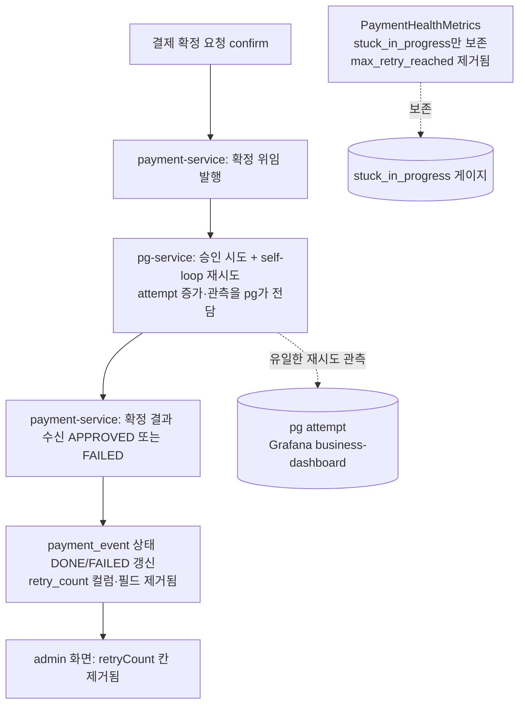

# RETRY-METRIC-CLEANUP — payment 재시도 metric 잔재 정리 완료 브리핑

> 완료일: 2026-06-22 / 이슈·브랜치: #110

## 작업 요약

비동기 confirm 재시도 주도권이 payment-service에서 pg-service self-loop로 이전(PR #106, ADR-04)된 뒤, payment-service는 확정 결과(APPROVED/FAILED)만 수신하고 재시도 진행 자체를 알지 못하게 됐다(`ConfirmedEventPayload`에 attempt 필드 없음). 그 결과 `payment_event.retry_count`를 증가시키는 코드 경로가 사라져 값이 항상 0인 **死 metric**이 됐고, 이를 읽는 `max_retry_reached` 게이지도 항상 0이 됐다. 직전 작업(CLEANUP-BATCH-E)은 RETRYING 상태/코드만 정리하고 이 컬럼·게이지는 후속 분리로 보존했는데, 본 토픽이 그 후속이다.

접근은 死 잔재를 성격별 3개 태스크로 분해해 제거하는 것이었다. (1) `max_retry_reached` 게이지 경로(게이지 + `maxRetryCount` @Value + `max-retry-count` 설정 키 + `countByRetryCountGreaterThanEqual` 포트·구현·Fake), (2) `payment_event.retry_count` 데이터 경로(V5 컬럼 DROP + 도메인 필드 + 엔티티 매핑 + 응답 DTO 2종 + admin HTML 2종 + 관련 테스트), (3) 재시도 로깅 死 enum 2종(`PAYMENT_RETRY_COUNT_INCREASED`, `PAYMENT_RETRY_START`). 이름만 같은 `payment_outbox.retry_count`(살아있는 Kafka 발행 재시도)·`RetryPolicy`·`stuck_in_progress` 게이지는 보존했다. 데이터 경로 제거의 핵심 안전장치는 `PaymentEvent.retryCount` 필드를 제거하면 컴파일러가 PaymentEvent 빌더 호출처만 에러로 가리켜 별개 타입인 PaymentOutbox 빌더와 자동 구분된다는 점이었다.

결과적으로 payment-service 단위 450 + 통합 37 테스트가 회귀 없이 통과했고, 死 경로 grep 잔재는 0이다. flyway-on 통합 테스트가 V5를 실제 적용해 `ddl-auto: validate` 부팅 정합성까지 실증됐다.

## 핵심 설계 결정

| 결정 | 근거 | 기각된 대안 |
|------|------|-------------|
| `payment_event.retry_count`를 V5 신규 마이그레이션으로 DROP | Flyway immutable 정책(V1~V4 수정 불가), 死 값이라 데이터 손실 무의미 | 컬럼 보존·코드만 제거 → orphan 컬럼 잔존, 정리 목적에 위배 |
| `payment_outbox.retry_count` 보존 | 살아있는 Kafka 발행 재시도 관측 (별개 테이블·도메인) | — |
| admin 응답 DTO·HTML retryCount 전부 제거 | 자체 Thymeleaf SSR, 외부 JSON 클라이언트 없음 → 호환 깨짐 없음 | 화면만 제거·응답 0 고정 → orphan 필드 잔존 |
| `max_retry_reached` 게이지 + `maxRetryCount` @Value + `max-retry-count` 키 제거 | 항상 0인 死 metric, Grafana 패널도 부재. 재시도 관측은 pg attempt가 SSOT(business-dashboard) | — |
| `stuck_in_progress` 게이지 보존 | 정상 동작 중인 health metric | — |
| 死 enum 2종 함께 제거 | 재시도 로깅 전용, 사용처 0, 본 토픽 직결 (사용자 확정) | EventType 정리를 별도 토픽으로 분리 |
| V5는 plain `DROP COLUMN retry_count` (IF EXISTS 불가) | MySQL은 컬럼 단위 `IF EXISTS` 미지원(MariaDB 전용 확장). flyway-on 통합테스트가 적용 정합 자동 검증 | `DROP COLUMN IF EXISTS` → MySQL 문법 오류로 통합테스트 실패 |

## 변경 범위

- **제거 (death 데이터 경로)**: `PaymentEvent.retryCount` 필드 + `create()`의 `.retryCount(0)` / `PaymentEventEntity`의 `@Column retry_count` + `from()`·`toDomain()` 매핑 / `PaymentEventResult`·`PaymentEventResponse` 필드 + 매핑 / `payment-events.html`(th+td+colspan 9→8)·`payment-event-detail.html`(통계 박스)
- **제거 (death 게이지 경로)**: `PaymentHealthMetrics`의 `max_retry_reached` 게이지·`maxRetryCount` @Value·갱신 블록·로그 토큰 / `application.yml`의 `metrics.payment.health.thresholds.max-retry-count` / `countByRetryCountGreaterThanEqual`(`PaymentEventRepository` 포트·`JpaPaymentEventRepository`·`PaymentEventRepositoryImpl`·`FakePaymentEventRepository`)
- **제거 (death enum)**: `EventType.PAYMENT_RETRY_COUNT_INCREASED`, `PAYMENT_RETRY_START`
- **신규**: `V5__drop_payment_event_retry_count.sql` (`ALTER TABLE payment_event DROP COLUMN retry_count`)
- **테스트 정정**: PaymentEvent 빌더 `.retryCount(0)` 호출 전수 제거(컴파일 에러 추적), INSERT SQL 3종(`PaymentEventRepositoryImplTest`·`PaymentSchedulerTest`·`PaymentControllerTest`) 컬럼 축소, `PaymentEventTest` retryCount 단언·extract 제거
- **보존(무손상)**: `PaymentOutbox`/`PaymentOutboxEntity`/`RetryPolicy`/`PaymentOutboxUseCase`/`PaymentOutboxMetrics`, V1의 `payment_outbox.retry_count`, `stuck_in_progress` 게이지, pg attempt 관측

## 다이어그램

## 코드 리뷰 요약

- **discuss 게이트**: reviewer R1 revise(major 2: 死 enum 누락·존재하지 않는 테스트 의존 / minor 2) → R2 pass. domain-expert pass(minor 1). 死 enum 2종 스코프 포함은 사용자 확정.
- **plan 게이트**: reviewer R1 revise(major 1: application.yml 死 설정 키 누락) → R2 pass. domain-expert R1 revise(major 1: V5 검증 토폴로지 부정확) → R2 pass. 완료 기준을 create-drop 그룹/flyway-on 그룹 안전망으로 정밀화.
- **ship 코드 리뷰**: reviewer pass(findings 0) / domain-expert pass(minor 1). critical 0 / major 0 / minor 1.
  - **[minor 스킵]** V5 재실행 멱등성 부재(MySQL 컬럼 단위 `IF EXISTS` 미지원). `ALTER TABLE`은 DDL 암묵 커밋 + 단일 컬럼 DROP이 원자적이라 partial 상태가 사실상 불가, 死 값이라 데이터 손실도 없음. 운영 적용 시 Flyway validate 실패 모니터링으로 충분 → 추가 코드 변경 불요.
- **execute 중 Rule 1 자동 수정**: (1) `DROP COLUMN IF EXISTS` → plain `DROP COLUMN`(MySQL 미지원, flyway-on 통합테스트가 즉시 검출), (2) Testcontainers `withReuse` 컨테이너의 1차 실패 레코드 로컬 정리(코드 변경 아님).

## 수치

- 태스크: 3개 (전부 tdd=false, Task 2만 domain_risk=true)
- 테스트: payment 단위 450 + 통합 37 통과, checkstyle/spotbugs BUILD SUCCESSFUL
- 커밋: execute 3 (`390ee969`/`4f7d304e`/`8170050e`) + 문서 3 (discuss·plan·ship)
- 리뷰 findings: discuss(major 2·minor 3) / plan(major 2·minor 4) / ship(critical 0·major 0·minor 1) — 전부 처리 또는 근거 스킵
