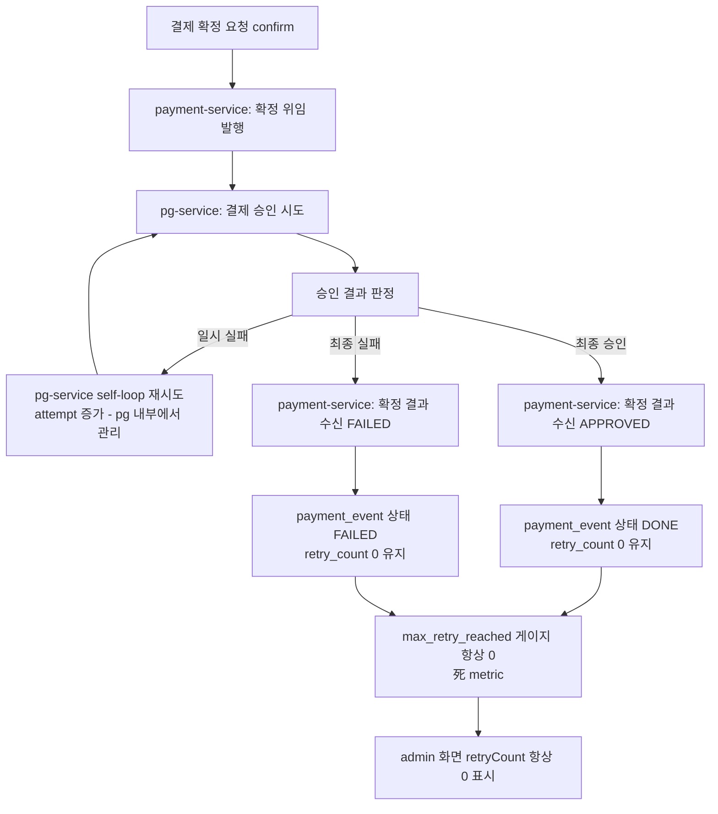
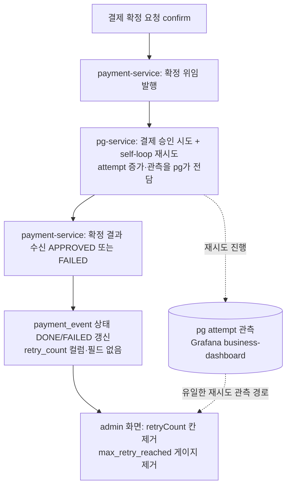

# payment 재시도 metric 잔재 정리 설계

> 최종 수정: 2026-06-22

## 사전 브리핑

### 현재 이해한 문제

비동기 confirm 재시도 주도권이 payment-service에서 pg-service self-loop로 이전된 이후, payment-service의 결제 이벤트(`payment_event`)에 남아있는 재시도 횟수(`retry_count`)는 항상 0에 머무는 **死 metric**이다. payment-service는 확정 결과(승인/실패)만 수신하고 재시도 진행 자체를 모르기 때문이다. 이 죽은 컬럼·게이지·필드·응답 값·admin 표시를 일괄 제거한다. (살아있는 Kafka 발행 재시도인 `payment_outbox.retry_count`는 **보존**한다.)

### 현재 시스템 동작 (as-is)

### 이번 discuss에서 결정하려는 것

- admin 결제 이벤트 화면(서버 렌더링 HTML)에서 `retryCount` 표시를 **완전 제거**할지, 다른 의미 있는 값으로 대체할지
- `payment_event.retry_count` 컬럼 제거를 V5 신규 마이그레이션(immutable 정책)으로 처리하는 방향 확정
- 死 metric 게이지(`max_retry_reached`)와 그 부속(`maxRetryCount` @Value, repository count 메서드)을 함께 제거하는 범위 확정
- 재개 메모의 "PaymentEventPublisher 로그 retryCount 제거" 항목 처리 (실제 코드에 해당 로그가 **없음** — 범위에서 제외)

### 열린 질문 / 가정

- **가정**: admin 화면은 Thymeleaf 서버 렌더링 자체 UI이며 외부 JSON 클라이언트가 없다 → 응답 스키마에서 `retryCount`를 빼도 호환 깨짐 없음 (코드 조사로 확인됨: `payment-events.html`, `payment-event-detail.html` 2곳에서만 사용).
- **가정**: `stuck_in_progress` 게이지는 살아있는 정상 metric이므로 보존, `max_retry_reached`만 제거.
- **열린 질문**: admin 화면의 retryCount 칸을 단순 삭제할지, pg 측 실제 재시도 관측(이미 Grafana business-dashboard에 존재)으로 안내를 대체할지. → **결정: 전부 제거** (화면 칸 + 응답 DTO 필드 + 도메인/엔티티/컬럼 일괄).

---

## 요약 브리핑

### 결정된 접근

`payment_event.retry_count`를 중심으로 한 payment 측 死 재시도 관측을 일괄 제거한다 — DB 컬럼(V5 DROP), 도메인 필드, 엔티티 매핑, 응답 DTO·admin 화면 표시, `max_retry_reached` 게이지와 그 부속(@Value·repository count 메서드), 재시도 로깅 전용 死 enum 2종까지. 살아있는 `payment_outbox.retry_count`(Kafka 발행 재시도)와 `stuck_in_progress` 게이지는 보존한다. 재시도 관측은 이미 pg attempt 데이터로 Grafana에 존재하므로 관측 공백이 없다.

### 변경 후 동작 (to-be)

### 핵심 결정 목록

- `payment_event.retry_count`는 V5 신규 마이그레이션으로 DROP, `payment_outbox.retry_count`는 보존 (이름만 같은 별개 테이블).
- `max_retry_reached` 게이지 + `maxRetryCount` @Value + `countByRetryCountGreaterThanEqual` 제거, `stuck_in_progress` 게이지 보존.
- admin 응답 DTO·HTML 표시 전부 제거 (자체 SSR, 외부 호환 무관).
- 재시도 로깅 전용 死 enum `PAYMENT_RETRY_COUNT_INCREASED` + `PAYMENT_RETRY_START` 함께 제거 (사용자 확정).
- 재개 메모의 "PaymentEventPublisher 로그 retryCount" 항목은 실재하지 않아 범위 제외.

### 트레이드오프 / 후속 작업

- 엔티티 매핑 제거 + V5 DROP은 `ddl-auto: validate` 부팅 정합성 때문에 **반드시 같은 PR**에 포함.
- `PaymentHealthMetrics` 참조 단위 테스트가 0개라 게이지 변경의 회귀 안전망이 컴파일·정적분석뿐 — plan에서 `stuck_in_progress` 보존 가드 테스트 신규 작성을 선택 태스크로 검토.
- 테스트 영향 파일이 ~13개로 분산 → plan에서 grep 전수 체크리스트화.

---

## 문제 정의

비동기 confirm 재시도 주도권이 payment-service → pg-service self-loop로 이전(PR #106, ADR-04)된 뒤, payment-service는 확정 결과(APPROVED/FAILED)만 수신하고 재시도 진행을 모른다(`ConfirmedEventPayload`에 attempt 필드 없음). 그 결과 `payment_event.retry_count`를 증가시키는 코드 경로가 더 이상 존재하지 않아 값이 항상 0이며, 이를 읽는 `max_retry_reached` 게이지도 항상 0인 死 metric이다. CLEANUP-BATCH-E가 RETRYING 상태/코드만 치우고 이 컬럼/게이지는 후속 분리로 보존했으며, 그 후속이 본 토픽이다.

핵심 구분: `payment_event.retry_count`(死, 제거)와 `payment_outbox.retry_count`(살아있는 Kafka 발행 재시도, **보존**)는 이름만 같고 별개 테이블·도메인이다.

## 영향 범위

| 레이어 | 클래스/파일 | 변경 |
|--------|------------|------|
| infrastructure (migration) | `V5__drop_payment_event_retry_count.sql` | **신규** — `payment_event.retry_count` 컬럼 DROP |
| domain | `PaymentEvent` | `retryCount` 필드 + `create()`의 `.retryCount(0)` 제거 |
| infrastructure (entity) | `PaymentEventEntity` | `@Column retry_count` 필드 + `from()`/`toDomain()` 매핑 제거 |
| application (port) | `PaymentEventRepository` | `countByRetryCountGreaterThanEqual` 제거 |
| infrastructure (repo) | `JpaPaymentEventRepository`, `PaymentEventRepositoryImpl` | `countByRetryCountGreaterThanEqual` 제거 |
| core/common/metrics | `PaymentHealthMetrics` | `max_retry_reached` 게이지 등록(line 44) + `maxRetryCount` @Value(line 34) + `updateHealthGauges()` 게이지 갱신 블록(line 68~70) + init/update 로그 문자열의 `maxRetryCount=`(line 41)·`maxRetryReached=`(line 73) 제거 (`stuck_in_progress`는 보존) |
| infrastructure (config) | `application.yml` | `metrics.payment.health.thresholds.max-retry-count: 5`(line 157) 死 설정 키 제거 (`maxRetryCount` @Value 제거로 orphan) |
| core/common/log | `EventType` | `PAYMENT_RETRY_COUNT_INCREASED`(line 31) + `PAYMENT_RETRY_START`(line 30) 死 enum 상수 제거 (둘 다 사용처 0, 재시도 로깅 전용) |
| application (dto) | `PaymentEventResult` | `retryCount` 필드 + `from()` 매핑 제거 |
| presentation (dto) | `PaymentEventResponse` | `retryCount` 필드 + `from()` 매핑 제거 |
| presentation (view) | `payment-events.html` | `<th>Retry</th>` 헤더(line 88) + `<td>` 셀(line 110) + empty-state `colspan` 9→8(line 120) |
| presentation (view) | `payment-event-detail.html` | retryCount 통계 박스(line 75) 제거 |
| test | `FakePaymentEventRepository` | `countByRetryCountGreaterThanEqual` 제거 |
| test | `PaymentEventRepositoryImplTest`, `PaymentSchedulerTest`, `PaymentControllerTest` | INSERT SQL의 `retry_count` 컬럼/값 제거 |
| test | `PaymentEventTest` 등 PaymentEvent 빌더에 `.retryCount(0)`를 쓰거나 retryCount 필드를 단언/extract하는 단위·통합 테스트 | 해당 호출·단언 제거 (PaymentOutbox 빌더의 `.retryCount(...)`는 **보존**) |

**무관(보존)**: `PaymentOutbox`/`PaymentOutboxEntity`/`RetryPolicy`/`PaymentOutboxUseCase`/`PaymentOutboxMetrics`, `V1`의 `payment_outbox.retry_count`, `stuck_in_progress` 게이지, Grafana 대시보드(`max_retry_reached` 패널 없음), pg-service attempt 관측.

## 설계 옵션 비교

### 컬럼 처리

- **Option A — V5 신규 마이그레이션으로 DROP** (채택): Flyway immutable 정책상 적용 완료된 V1~V4는 수정 불가, 신규 V5로 `ALTER TABLE payment_event DROP COLUMN retry_count`. 죽은 값이라 데이터 손실 의미 없음.
- **Option B — 컬럼 보존, 코드만 제거**: 스키마와 코드 불일치(orphan 컬럼)를 남김. 死 데이터를 영구 잔존시켜 정리 목적에 어긋남. 기각.

### admin 응답/화면 처리

- **Option A — 전부 제거** (채택): 死 값이라 노이즈만 됨. 자체 SSR HTML이라 외부 호환 깨짐 없음.
- **Option B — 화면만 제거, 응답 0 고정**: 외부 클라이언트가 없어 호환 대비 가치 없음. orphan 필드 잔존. 기각.

## 결정 사항

| 항목 | 결정 | 이유 |
|------|------|------|
| `payment_event.retry_count` 컬럼 | V5 신규 마이그레이션으로 DROP | Flyway immutable 정책, 死 값이라 손실 무의미 |
| `payment_outbox.retry_count` | 보존 | 살아있는 Kafka 발행 재시도 관측 (별개 테이블) |
| `max_retry_reached` 게이지 + `maxRetryCount` @Value + `max-retry-count` 설정 키 | 제거 | 항상 0인 死 metric, Grafana 패널도 없음, @Value 제거로 설정 키도 orphan |
| `stuck_in_progress` 게이지 | 보존 | 정상 동작 중인 health metric |
| admin 응답/화면 retryCount | 전부 제거 (DTO 필드 + HTML 헤더/셀/colspan/통계박스) | 자체 SSR, 외부 호환 무관 |
| `EventType.PAYMENT_RETRY_COUNT_INCREASED` + `PAYMENT_RETRY_START` | 제거 | 재시도 로깅 전용 死 enum, 사용처 0, 본 토픽 직결 (사용자 확정) |
| "PaymentEventPublisher 로그 retryCount" 항목 | 범위 제외 | 실제 코드에 해당 로그 없음 (재개 메모 오류) |
| `countByRetryCountGreaterThanEqual` (포트+구현+Fake) | 제거 | 死 게이지 전용, 다른 호출처 없음 |

> **plan 인계**: `PaymentEvent.builder().retryCount(...)`를 호출하는 테스트가 grep 기준 약 13개 파일에 흩어져 있다(영향 범위 표는 대표 파일만 명시). plan 태스크 분해 시 `rg -n "retryCount" payment-service/src/test`로 전수를 체크리스트화할 것 — PaymentOutbox 빌더의 `.retryCount(...)` 호출은 **보존** 대상이므로 PaymentEvent 빌더 호출만 골라낸다.

## 장애 시나리오와 대응

- **엔티티 필드와 DB 컬럼 제거 순서**: 같은 배포에 포함되어 정합. DB에 없는 컬럼을 엔티티가 참조하면 부팅 실패하므로, 엔티티 매핑 제거와 V5 DROP을 한 PR로 함께 반영한다.
- **통합 테스트 INSERT SQL**: `PaymentEventRepositoryImplTest`/`PaymentSchedulerTest`가 `retry_count` 컬럼에 명시적 INSERT하므로, V5 적용 후 컬럼이 없으면 즉시 실패 → 같은 작업에서 SQL 수정. (회귀가 자동 감지되는 안전망)
- **운영 DB 데이터 손실**: 該 컬럼은 死 값(0)만 보유 → DROP으로 잃을 정보 없음.

## 검증 전략

- `./gradlew :payment-service:test` 전체 회귀 (단위 + Testcontainers 통합) — V5 마이그레이션이 통합 테스트 컨테이너에서 깨끗이 적용되는지, INSERT SQL에 `retry_count`를 쓰는 통합 테스트(`PaymentEventRepositoryImplTest`/`PaymentSchedulerTest`/`PaymentControllerTest`)가 컬럼 DROP 후에도 통과하는지 포함.
- **`PaymentHealthMetrics`는 현재 참조 단위 테스트가 0개**이므로 게이지 변경을 잡아줄 기존 회귀 안전망이 없다 → 死 참조 잔재 0은 **컴파일·정적분석 통과**로 확인한다. (선택) `stuck_in_progress` 보존을 명시 검증하려면 plan에서 PaymentHealthMetrics 단위 테스트 신규 작성을 태스크로 고려.
- `EventType` enum 상수 제거 후 컴파일 통과로 死 참조 0 확인.

## 제외 범위 (non-goals)

- `payment_outbox.retry_count` 및 PaymentOutbox 재시도 로직 전반 — 살아있는 발행 재시도.
- `stuck_in_progress` 게이지 — 정상 metric.
- Grafana 대시보드 변경 — `max_retry_reached` 패널이 애초에 없어 영향 없음.
- pg-service attempt 관측 추가/이전 — 이미 business-dashboard에서 충족.
- payment → pg 간 attempt 전파 신설 — 사용자 의도(pg 데이터로 관측)에 반함.

## 참고

- `docs/archive/cleanup-batch-e/COMPLETION-BRIEFING.md` — 본 토픽 출처 (retryCount 死 metric 후속 분리)
- `docs/context/stack/flyway-operations.md` — V5 마이그레이션 작성 규약
- PR #106 / ADR-04 — 재시도 주도권 pg self-loop 이전
