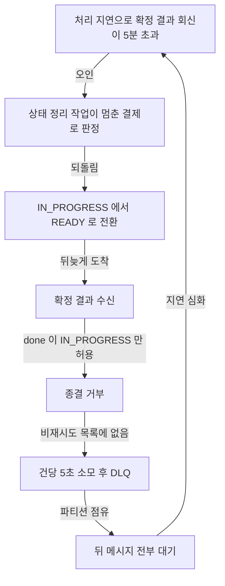

# SHARED-RESOURCE-SCALEOUT — 완료 브리핑

> 이슈/브랜치: #146 · 기간: 2026-08-15 ~ 09-04 (보류 1회) · 커밋 53
> 정본 기록: `SHARED-RESOURCE-SCALEOUT-INVESTIGATION.md` (측정 경위·정정 이력)

## 작업 요약

payment 인스턴스를 1대에서 2대로 늘려도 확정 처리율이 오르지 않았다.
앞선 측정은 그 원인을 공유 자원 — 저장소와 메시지 커밋 직렬화 — 으로 지목했고, 이 작업은 그 자원을 실제로 늘리면 천장이 밀리는지 확인하려고 열렸다.
합격선은 인스턴스 1 → 2에서 확정 처리율 1.6배 하나였다.

인프라를 붙이고 측정에 들어가자 측정 환경 자체가 결론을 낼 수준이 아니라는 게 드러났다.
자원 표본화 대상에 돈 경로의 두 번째 DB가 빠져 있었고, 잠금은 "현재 대기 중"으로만 재서 줄곧 0으로 읽혔고, 사이클마다 이전 상태가 남아 비교가 오염됐고, 파티션 수는 아무도 보고 있지 않았다.
계측 결함이 14건 나왔다. 그래서 작업의 몸통이 **성능을 측정할 수 있는 상태를 만드는 것**으로 옮겨갔다 — 클린 사이클, 자원 표본화 확장, 측정 손잡이, 상품 100종 부하 프로필.

기반을 갖추고 조건을 하나씩만 바꿔 다시 재자 원래 가설이 반증됐다.
**어느 공유 자원도 차 있지 않았다.** 디스크는 낼 수 있는 강제 기록의 절반 이하를 썼고, MySQL 서버는 초당 5,987커밋을 내는데 앱은 492회(8%)를 썼고, CPU는 구간 평균 최대 0.6코어였다.
막혀 있던 것은 Kafka 토픽의 파티션 3이었다. pg-service가 컨슈머 동시성을 지정한 적이 없어 Spring 기본값 1로 돌았고, 파티션 수가 컨슈머 병렬도의 상한이라 스레드도 인스턴스도 그 위로 갈 수 없었다.
여덟 번의 증설 중 파티션을 늘린 적은 한 번도 없었다.

파티션과 동시성을 9로 풀자 **인스턴스를 그대로 두고 1.86배**가 나왔다.
다만 거기까지였다 — 파티션 18에 인스턴스를 2대씩 붙여도 1.09배다. 앞 단계 대기는 평균 10.6배 줄었으나 뒤 단계는 2.5배에 그치고 정점은 2만 건에서 움직이지 않았다. 병목이 뒤로 옮겨갔을 뿐이다.

**당초 합격선은 미달이다(1.6배 목표, 1.09배).** 그 합격선은 "천장이 공유 자원"이라는 전제 위에 있었고 그 전제가 반증됐다. 늘려야 했던 건 저장소가 아니라 파티션이었고, 그건 자원이 아니라 설정값이다.

측정 중 결함 하나를 발견했다. 과부하가 지속되면 상태 정리 작업이 정상 처리 중인 결제를 멈춘 것으로 오판해 되돌리고, 뒤늦게 온 확정 결과가 거부되며 그 예외가 재시도로 분류돼 파티션을 막는다 — 부하가 몰릴수록 심해지는 자기 강화 구조다. `CONCERNS.md` L-19로 등재했다.

## 핵심 설계 결정

|결정|근거|기각한 대안|
|:---:|:---:|:---:|
|폴링 전용 조회 포트를 신설하고 그 어댑터만 복제본에 묶는다|결제 이벤트 조회를 돈 경로 판정 일곱이 공유하고 그중 넷은 감싸는 트랜잭션이 없다. 새 포트만 묶으면 안전이 호출처를 빠짐없이 세는 데 의존하지 않는다|읽기 전용 표시 자동 분기 — 복제 지연 중 격리 종결이 낡은 상태를 읽어 승인된 결제에 비가역 재고 복원을 낸다|
|복제본은 질의 템플릿으로 읽고 영속성 컨텍스트를 태우지 않는다|폴링이 쓰는 값이 셋뿐이라 매핑이 불필요하고 기존 데이터소스 구성을 건드리지 않는다|복제본 전용 영속성 컨텍스트 — 통합 테스트 구성을 흔들고 어느 컨텍스트가 붙었는지 코드에서 안 보인다|
|재고 캐시·멱등 저장소는 클러스터로 전환하되 멱등 저장소 대수는 고정|나눌 준비는 하되 변수는 재고 캐시 하나로 유지한다. 멱등 저장소는 값을 읽어 없으면 선점하는 구조라 낡은 읽기가 중복 결제를 통과시킨다|둘 다 변수화 — 어느 저장소가 효과를 냈는지 갈리지 않는다|
|슬롯이 하나라도 비면 전체를 멈추는 클러스터 기본 동작을 끈다|복제 노드가 없는 구성이라 노드 하나가 죽으면 전 상품 캐시 호출이 예외가 되고, 그 예외가 캐시 장애 격리로 매핑돼 사이클이 통째로 날아간다|기본값 유지|
|측정 손잡이는 전부 설정값으로 연다 (제품 코드 0줄)|파티션 수·컨슈머 동시성·Worker 수·인스턴스 수를 코드 변경 없이 사이클마다 바꿔야 변수 분리가 가능하다|코드에 상수로 두고 빌드마다 변경|
|L-19는 고치지 않고 회피한 채 측정한다|수정이 돈 경로 예외 분류라 별도 설계가 필요하다. 결함이 다른 측정을 전부 덮어버려 회피 없이는 어떤 수치도 못 낸다|측정을 멈추고 먼저 수정 — 이 작업 범위를 벗어난다|

## 변경 범위

|영역|내용|의도|
|:---:|:---:|:---:|
|payment 조회 경로|폴링 전용 조회 포트·스냅샷 타입 신설, 복제본 질의 어댑터, 복제본 데이터소스 설정, 격리 계약 테스트|돈 경로 판정은 원본을 읽고 폴링만 복제본을 읽게 분리|
|Redis|재고 캐시·멱등 저장소 클러스터 모드 전환 (설정값으로 단독 노드와 양립)|캐시 노드 대수를 변수로 열기|
|인프라|payment DB 비동기 읽기 복제본, Redis 클러스터, Docker 메모리 20GB|확장 대상 자원 확보|
|측정 환경|클린 사이클 스크립트, MySQL·Redis·컨테이너·Kafka 브로커 자원 표본화, 측정 손잡이 6종, 고정 도착률 측정|조건을 하나만 바꿔 재는 상태 확보|
|부하·검증|상품 100종 다중화, 정합 검증 상품별 확장, 부하 도구가 확정 접수까지만 확인하도록 수정|키를 흩어 노드 대수가 의미를 갖게 하고, 표본 수집이 부하가 되지 않게|
|버그 수정|`pg_inbox` 인덱스 복합 전환(V8), user-service docker 시드 마이그레이션|데드락 제거, 측정 시드 정상화|
|문서|조사 기록, 대장 문서(CONCERNS L-19 / TODOS 4건) 등재, context 동기화|발견 사실과 후속 과제 보존|

## 다이어그램

측정 중 발견한 L-19의 자기 강화 경로.

## 코드 리뷰 요약

reviewer + domain-expert 병렬 실행 (2026-09-01). **critical 0 / major 0 / minor 1.**

- minor — 복제본을 켜면 `GET /status` 폴링이 복제 지연 창에서 404를 반환할 수 있다.
  **의도적 스킵.** 복제본 라우팅은 기본값이 꺼져 있어 벤치마크 조건에서만 열리는 창이고, 돈 경로 판정 일곱은 그대로 원본을 읽어 영향이 없다. 상시 운영 승격 시 확인할 항목으로 `TODOS.md`에 남겼다.
- 리뷰 중 함께 확인 — 파티션 수 3이 네 곳에 하드코딩돼 있다(`create-topics.sh`, 양 서비스 `KafkaTopicConfig`, 브로커 기본값). 단일 출처로 모으는 것이 복제본 상시 운영 승격의 선행 작업이다.

리뷰 이후 코드 변경 없음 — 후속 커밋은 전부 문서다.

## 미결 / 후속

- **L-19 수정** (`TODOS.md` CONFIRM-RESULT-NONRETRYABLE-STATUS / RECONCILER-SLOW-VS-STUCK) — 확정 결과 거부 예외의 재시도 분류부터. 예외 타입을 통째로 묶으면 안 된다(에러코드 15종, CAS 충돌은 재시도가 유효)
- **`pg_inbox` 보존 정책 부재** — 처리가 끝나도 행이 남는다. 데드락의 실제 원인이고 인덱스 수정은 증상만 없앴다
- **측정 조건이 결과 파일에 안 남는다** (`TODOS.md` BENCH-CONDITIONS-NOT-RECORDED) — 파티션 수·pg 컨슈머 동시성 미기록으로 결과만으로는 재현·검증 불가
- **파티션 상수 산재 4곳** — 복제본 상시 운영 승격의 선행 작업
- **절대 처리량은 이 환경에서 무의미** — 캡처용 브라우저와 대시보드가 측정과 같은 기계에서 돌았고 단일 머신 컨테이너 환경이라 같은 조건에서 잰 값끼리의 비율만 유효하다
- **라이브 검증** — 사이클 자체가 라이브 구동이었다(30회+). 별도 smoke 재실행은 하지 않았다

## 수치

|항목|값|
|:---:|:---:|
|태스크|22개 완료|
|커밋|53개|
|측정 사이클|30회+ (유효 재측정 4회)|
|늘려본 자원|8종|
|드러난 계측 결함|14건|
|리뷰 findings|critical 0 / major 0 / minor 1|
|테스트|전체 통과 (통합테스트 `--rerun` 포함)|
|처리량 결과|파티션·동시성 9로 1.86배 / 인스턴스 2대씩 추가 시 1.09배|
|당초 합격선|**미달** (1 → 2에서 1.6배 목표, 1.09배)|
