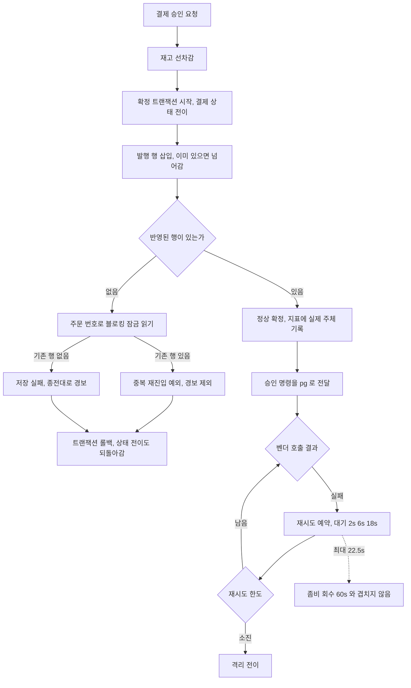

# 운영 신호 정합과 규칙 자동 검출 정비 — 완료 브리핑

> 이슈/브랜치: #132 · 2026-08-03 ~ 2026-08-04

## 작업 요약

미해결 항목 대장에 측정 환경 없이 손댈 수 있는 항목이 쌓여 있었다. 여러 토픽이 각자 "범위 밖"으로 밀어낸 잔여들이라 서로 연관이 없어 보였지만, 실제로 열어보니 성격이 셋으로 갈렸다. **신호가 사실과 다르게 말하는 자리**, **타이밍이 설계와 어긋난 자리**, **규칙을 사람 눈으로만 지키던 자리**다. 한 번에 최대한 많이 처리해 달라는 요청에 따라 12건을 한 토픽·단일 PR로 묶었다.

신호 쪽 문제는 조용해서 오래 남아 있었다. 상태 전이 지표는 전이를 일으킨 주체를 호출 스택에서 클래스 이름을 문자열로 맞춰 짐작했는데, 승인 경로는 스택의 실제 구현 클래스 이름이 달랐고 복구 경로는 대상 클래스가 리팩터로 삭제돼 두 분기 모두 영구 미스매치였다. 만료 전이만 라벨이 정확했고 나머지는 전부 "모름"으로 뭉개졌다. 이 방식은 이름이 바뀌면 그 순간 깨지는데 컴파일도 되고 테스트도 통과한다 — 실제로 두 번 깨졌고 아무도 몰랐다. 재고 쪽에서는 같은 주문의 확정이 동시에 들어왔을 때 진 쪽이 주문 단위 유니크 제약에 걸리는데, 그 예외가 확정 실패와 한 갈래로 잡혀 재고를 잃어버렸다는 경보를 남겼다. 이긴 쪽이 정상 처리했으므로 실제 누수는 없었다. 정상 동작이 사고 신호를 만들면 그 경보는 몇 번 반복되고 신뢰를 잃는다.

타이밍 쪽은 한 줄짜리 실수가 다른 안전장치와 겹친 경우였다. 벤더 호출 실패 시 백오프를 계산하며 실패한 회차가 아니라 다음 회차를 넘겨, 대기가 설계값 2초/6초/18초 대신 6초/18초/54초로 한 단계씩 밀려 있었다. 늘어난 최대 대기(지터 포함 67.5초)가 좀비 회수 타임아웃 60초를 넘기면서, 좀비 폴러가 예약된 재시도보다 먼저 깨어나 벤더를 다시 부르는 구간이 생겼다. 한도가 소진된 상태면 그 자리에서 격리로 넘어가고, 뒤늦게 도착한 원래 재시도는 종결을 발견하고 조용히 건너뛰어져 **벤더를 부른 적 없는 발행 기록**이 이력에 남았다. 호출부를 정정하자 최대 대기가 22.5초로 내려가 겹침이 함께 닫혔다.

접근에서 가장 많이 다듬은 것은 중복 확정 판정이다. 설계 게이트 3라운드에 걸쳐 세 번 뒤집혔다. 처음에는 어댑터가 충돌 예외를 전용 예외로 번역하는 안이었으나 프로젝트의 예외 계층 규칙과 충돌했고, 다음으로 어댑터가 예외를 잡아 값으로 돌려주는 안으로 옮겼으나 제약 충돌 이후 영속성 세션을 이어 쓰는 형태가 되어 되돌리기가 실패하면 의도한 예외가 다른 예외로 대체될 위험이 지적됐다. 최종적으로 **충돌이 아예 일어나지 않게 삽입**하고 반영 행이 없을 때 잠금 읽기로 확인하는 방식을 택했다. 그런데 여기서 한 겹이 더 있었다 — 확정 트랜잭션은 발행 행 삽입 전에 결제 상태를 먼저 바꾸며 읽기 스냅샷을 잡으므로, 평범한 조회로는 방금 자신을 막은 행을 보지 못한다. 이 지적으로 확인 조회를 블로킹 잠금 읽기로 못박고, 단일 스레드 테스트로는 잡히지 않는 이 조건을 지키기 위해 잠금 선언 자체를 검사하는 계약 테스트를 함께 뒀다.

결과적으로 15개 태스크를 모두 완료했고 전체 테스트 1033건 + 통합 121건이 통과한다. 신호 넷이 실제와 맞춰졌고, 재시도 대기가 설계값으로 돌아오며 겹침이 사라졌고, 다섯 개 코드 스타일 규칙과 지침 문서 검사가 자동 검출로 넘어갔다. 로그 마스킹은 5개 서비스에 다시 깔았다.

## 핵심 설계 결정

| 결정 | 근거 | 기각한 대안 |
|---|---|---|
| 전이 주체를 호출 스택 짐작이 아니라 전이 지점이 선언 | 문자열 이름 대조는 리팩터에 조용히 깨지고 이미 두 번 깨졌다. 선언은 누락이 컴파일·테스트에 드러난다 | 클래스 이름을 현재 이름으로 갱신 — 당장은 동작하지만 같은 함정이 반복된다 |
| 중복 확정을 충돌 없는 삽입 + 잠금 읽기 확인으로 판정 | 제약 충돌 이후의 영속성 세션은 상태를 신뢰할 수 없고, 되돌리기가 실패하면 의도한 예외가 대체돼 경보 제외가 무력화된다 | ① 어댑터가 전용 예외 throw — 예외는 domain/application 에서만 던진다는 규칙 위반 ② 어댑터가 충돌 예외를 잡아 값 반환 — 세션 오염 위험 |
| 확인 조회는 **블로킹 쓰기 잠금 읽기** | 확정 TX 가 상태 전이를 먼저 해 읽기 스냅샷을 잡으므로 평범한 조회로는 자신을 막은 행을 못 본다. 그러면 중복이 저장 실패로 오분류돼 오탐이 좁아진 창으로 계속 샌다 | ① 평범한 조회 ② pg 워커 선점용 `SKIP LOCKED` 복사 — 앞선 커밋을 기다리지 않아 목적이 정반대로 깨진다 |
| 반영 행 0을 곧바로 중복으로 읽지 않고 조회로 확인 | 조용히 넘어가는 삽입은 중복이 아닌 이유로도 행을 넣지 않을 수 있다. 조회 없이는 진짜 실패를 중복으로 오판한다 | 반영 행 수만으로 2분기 |
| 잠금 방식을 계약 테스트로 고정 | 단일 스레드 기능 테스트는 어떤 잠금이든 똑같이 통과해 이 회귀를 못 잡는다. 경합 타이밍에 기대는 통합 테스트도 단독으로는 보장이 못 된다 | 통합 테스트만으로 커버 |
| 백오프를 설계값으로 복원(타임아웃은 유지) | 최대 대기가 22.5초로 내려가 좀비 회수 60초와의 겹침이 함께 닫힌다. 한 수정으로 두 문제가 종결 | 좀비 타임아웃을 90초로 상향 — 겹침은 없어지나 첫 재시도가 계속 6초고 워커 사망 시 회수가 그만큼 늦어진다 |
| 추적 구간은 생성 자체를 테스트 단정 대상에 포함 | 복원한 원격 구간에 속성만 붙이면 예외 없이 버려진다. 속성만 검사하면 통과하는데 백엔드엔 아무것도 안 남는다 | 속성 단정만 |
| 마스킹은 출력 직전 일괄, 패턴은 설정에서 관리 | 새 로그를 추가하며 빠뜨려도 걸린다. 조사 결과 지금 새는 경로가 없어 안전망 성격이 크므로 패턴 수는 적게 유지 | 로그를 남기는 자리마다 개별 마스킹 |
| 정적 검출은 보고만, 빌드 차단 없음 | 목적이 지금 강제하는 게 아니라 규모를 드러내는 것. 기존 위반은 억제로 기준선 0 | 처음부터 빌드 실패 — 기존 위반 정리가 범위를 폭발시킨다 |
| 구조 판정 2규칙은 커스텀 검사기 직접 작성 | ArchUnit 은 바이트코드 의존 그래프만 다뤄 메서드 본문의 제어 흐름(catch 안 재throw 유무, try 밖 선언 변수 재할당)을 표현할 수 없다 | ArchUnit 도입 |

## 변경 범위

**payment-service**
- 상태 전이 지표 측면에서 호출 스택 탐색 제거, `@Trigger` 파라미터 애노테이션 신설, 전이 지점 4곳이 주체를 선언
- 발행 행 생성 경로 교체 — `INSERT IGNORE` + `@Lock(PESSIMISTIC_WRITE)` 확인 조회, 결과 3분기(`PaymentOutboxCreationResult`), 포트에 생성 전용 메서드 추가(기존 `save` 시그니처 불변)
- 중복 재진입 예외 신설(기존 결제 예외와 같은 자리), 승인 서비스가 그 예외만 재고 미회수 경보에서 제외하고 재throw
- 체크아웃 응답 본문에 중복 여부 필드 복원

**pg-service**
- 재시도 백오프 호출부 정정(실패 회차 전달), 난수 생성기를 주입 방식으로 전환, 좀비 회수 타임아웃과의 관계를 설정에 주석
- 재시도 워커가 복원 문맥을 부모로 자체 추적 구간 생성 + 주문 번호 속성
- 벤더 응답 파싱 실패 로그의 원문 길이 제한(Toss·NicePay 양쪽)

**공통**
- 5개 서비스에 로그 마스킹 계층 + 설정 연결(패턴 4종)
- checkstyle 5규칙 검출 — 문자열 판정 3종 + 커스텀 구조 판정 2종, 기존 위반 억제로 기준선 0
- 지침 문서 검사 스크립트를 CI 독립 job으로 편입(게이트 아님)

**문서**
- 결제 흐름 문서 2종 다이어그램 라벨 정리(유니코드 화살표 40건), 리뷰 체크리스트의 사라진 메서드 참조 정정
- 영구 문서 8종 갱신, 위키 4종 갱신(마스킹·백오프·전이 주체·워커 추적)

## 다이어그램

## 코드 리뷰 요약

ship 코드 리뷰에서 Reviewer 는 revise(major 1 / minor 2), Domain Expert 는 findings 0건으로 pass 했다. **실질 코드 결함 지적은 없었고 세 건 모두 커밋 이력·규약 문제**라 전부 기록만 하고 넘어갔다.

- **major** — Task 1·2·6 이 `tdd=true` 인데 실패 테스트 커밋과 구현 커밋이 하나로 합쳐졌다. 원인은 오케스트레이터의 dispatch 지시였다(세 태스크에 "커밋은 태스크 단위로 하나만"을 넘겨 RED/GREEN 분리 규약과 충돌시켰고, Task 3부터 그 문구를 빼자 정상 분리됐다). 테스트는 모두 존재하고 통과하며 각 태스크 완료 결과에 실패 확인 절차가 기록돼 있다. 커밋 경계만 다르고 기능·검증 영향이 없어 이력 재작성의 실익이 위험보다 작다고 판단해 스킵.
- **minor 2건** — 커밋 하나의 scope 누락, 같은 성격 변경의 type 불일치. 둘 다 병합된 이력이라 기록만.

Reviewer 가 실측으로 확인한 무결 항목: 루트 프로젝트 검사 비활성화가 서비스별 검사 범위를 줄이지 않음(6서비스 재실행 0 위반) / Task 4 의 즉시 발행 비활성화가 검증 대상 경로를 우회하지 않음(50회 재실행 통과) / 마스킹 클래스 5벌이 해시 비교로 완전 동일 / 락 계약·추적 구간 테스트가 구조 미러링이 아닌 실제 회귀 검출 형태.

**최종 검증에서 걸린 것 1건** — `pg-service:spotbugsTest` 가 Task 10 이 추가한 테스트 2곳의 null 가능 반환값 언박싱(`ReflectionTestUtils.getField`)을 잡았다. 수정 후 재실행 통과(`297a60c9`).

**리뷰 강도 대조** (설계 결정 이행): 코드 리뷰 기준으로는 원복 조건에 해당하지 않아 Reviewer 판정 강도 하향을 유지했다. 다만 사각은 **설계 단계**에서 드러났다 — discuss 게이트 3라운드에서 Domain Expert 가 Reviewer 가 짚지 못한 중대 지적(격리 대응 근거의 오인용, 세션 오염 위험, 스냅샷 격리로 인한 확인 조회 누락)을 연달아 냈고, plan 게이트에서도 잠금 읽기가 실행 가능한 형태로 내려오지 않은 것을 잡았다. 이 지적들이 없었다면 구현은 두 결함을 안고 진행됐을 것이다. 상세는 `CONCERNS.md` C-11.

## 수치

| 항목 | 값 |
|---|---|
| 태스크 | 15개 (전부 완료) |
| 커밋 | 24개 (태스크 단위 분리) |
| 변경 | 90개 파일, +4421 / -152 |
| 테스트 | 단위 1033 / 통합 121 — 전부 통과(캐시 없이 재실행) |
| 린트 | checkstyle·spotbugs main/test 6서비스 전체 통과 |
| 게이트 | discuss 3라운드 / plan 2라운드 / ship 1라운드 |
| findings | critical 0 / major 3(설계 2 + 코드 1) / minor 6 — 코드 결함 0 |

## 후속

`TODOS.md` 섹션 E 에 3건을 등재했다.

- 정적 검출·지침 검사의 게이트 승격 판단 — 오탐이 잦아드는지 본 뒤 결정
- 기준선 억제로 덮어둔 기존 스타일 위반 정리 — `var` 2건, 빈 catch 1건, try 재할당 3건(프로덕션 2)
- 재시도 창 축소(78초 → 26초)로 커진 격리 복구 후속의 무게 — 격리 이탈 경로가 벤더 상태 재조회 없는 편도 종결뿐이고 환불 포트가 없어, 응답만 유실된 승인이면 벤더 과금이 남는다. 그 전까지는 재시도 소진 격리 건을 안전 종결하기 전에 사람이 벤더 상태를 확인한다

범위 밖으로 유지한 것: 재시도 선점 경로 존치 여부(데드 코드 판정 + 부하 측정 의존), 모의 벤더 부팅 환경 가드(배포 환경 정의 선행).
