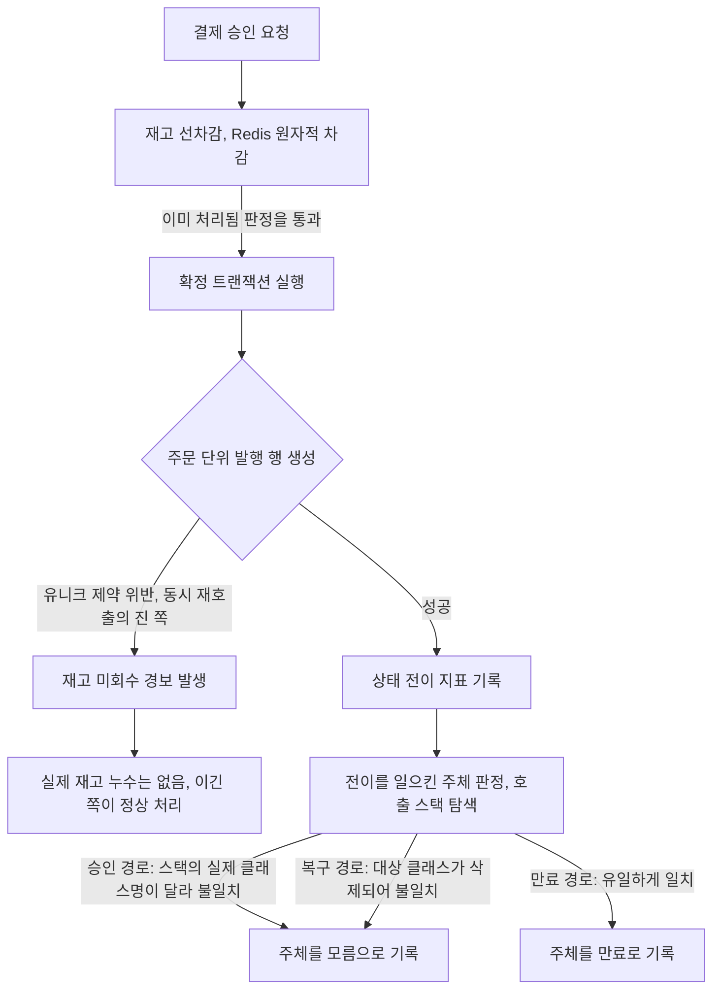
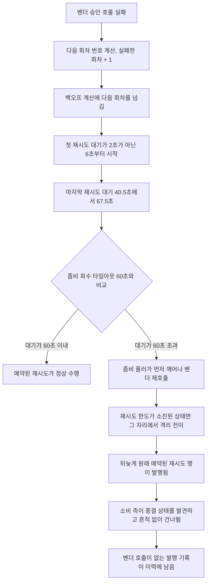
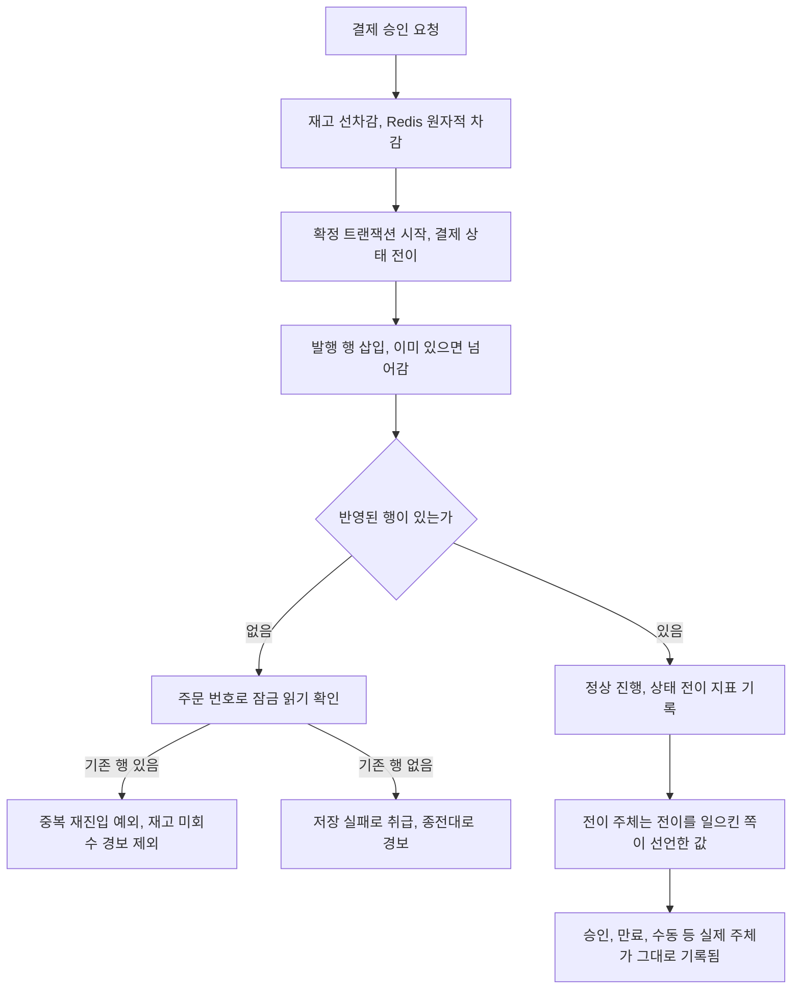
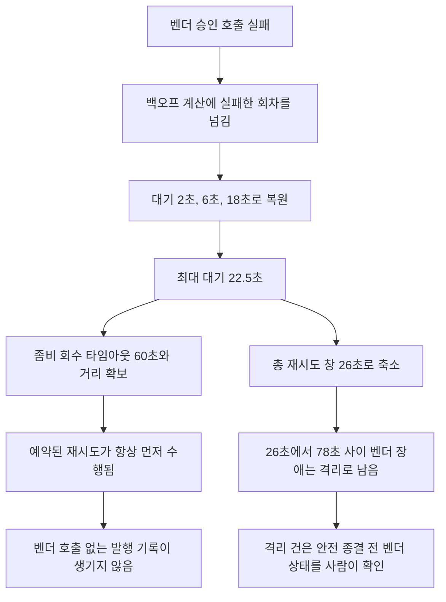

# 신호 정합과 가드레일 정비 설계

> 최종 수정: 2026-08-03

## 사전 브리핑

### 현재 이해한 문제

운영 신호가 실제 일어난 일과 다르게 말하는 자리가 여러 곳 남아 있다. 상태 전이 지표는 무엇이 그 전이를 일으켰는지 대부분 모른다고 기록하고, 정상적으로 차단된 중복 승인이 재고를 잃어버린 것과 같은 경보로 묶인다. 재시도 대기 시간은 설계가 적어둔 값보다 한 단계 길고, 그 길어진 대기가 좀비 회수 시각과 겹쳐 벤더를 부르지도 않은 발행 기록을 남긴다. 여기에 규칙을 사람 눈으로만 지키던 자리들 — 낡은 체크리스트 항목, 깨질 수 있는 다이어그램 표기, 자동 강제가 없는 코드 스타일 규칙 — 을 함께 정리한다.

### 현재 시스템 동작

**승인 경로에서 신호가 만들어지는 지점**

**pg 재시도와 좀비 회수가 겹치는 지점**

### 이번 discuss에서 결정하려는 것

- pg 재시도 백오프를 설계가 적어둔 값(첫 재시도 2초)으로 되돌릴지, 지금 도는 값(6초)을 정본으로 삼을지
- 좀비 회수 타임아웃과 최대 재시도 대기의 겹침을 어느 쪽을 움직여 없앨지
- 로그 마스킹 소실을 이번에 되살릴지, 부재만 확정하고 별도 토픽으로 넘길지
- 체크아웃 응답 본문에 중복 여부를 되살릴지, 상태 코드만으로 충분하다고 볼지
- 코드 스타일 규칙의 자동 강제를 어떤 수단으로 어디까지 도입할지, 기존 위반이 나오면 어떻게 다룰지
- 지침 문서 검사를 CI에서 막을지, 지금처럼 알려주기만 할지

### 열린 질문 / 가정

- 12건을 한 PR로 묶되 커밋은 항목별로 쪼갠다고 가정한다. 리뷰 단위는 커밋이 된다.
- 코드 스타일 자동 강제는 도입 즉시 기존 코드 위반이 드러날 수 있다. 위반 수가 크면 규칙별로 도입을 나누거나 억제 목록을 쓰는 판단이 필요하다.
- 재시도 백오프를 되돌리면 최대 대기가 22.5초로 내려가 좀비 타임아웃 겹침이 저절로 사라진다. 두 항목은 한 결정으로 묶일 수 있다.
- 재고 미회수 경보 분리는 예외 원인을 구분하는 변경이라, 확정 실패 시 재고를 되돌리지 않는다는 기존 정책 자체는 건드리지 않는다.
- 검토는 도메인 검토자를 포함한다. 소스 코드와 런타임 설정을 함께 바꾸는 토픽이다.

### 다루지 않는 것

- 재시도 선점 경로가 프로덕션에서 쓰이지 않는 문제 — 제거 여부 판정이 필요하고 부하 측정 결과에 물려 있다.
- 모의 벤더가 실 환경에서 로드되는 것을 부팅 단계에서 막는 가드 — 어떤 환경을 정상으로 볼지 정하는 배포 논의가 앞선다.

---

## 요약 브리핑

### 결정된 접근

전이를 일으킨 주체는 호출 스택을 뒤져 짐작하지 않고 전이를 일으킨 쪽이 직접 선언한다. 같은 주문의 승인이 겹쳤을 때 진 쪽은 충돌 예외로 알아채지 않고, 이미 있으면 넘어가는 삽입과 잠금 읽기 확인으로 자신이 중복임을 확인한 뒤 전용 예외를 받는다. 그 예외만 재고 미회수 경보에서 빠진다. 재시도 대기는 설계가 적어둔 값으로 되돌아가고, 그 결과 최대 대기가 좀비 회수 시각 아래로 내려가 겹침이 함께 닫힌다. 규칙을 눈으로만 지키던 자리에는 검출 장치를 깔되 빌드를 막지는 않는다.

### 변경 후 동작

### 핵심 결정 목록

- 전이 주체는 호출 스택 탐색을 버리고 전이 지점이 선언한다. 한 메서드가 여러 흐름에서 불리면 호출자가 값을 넘긴다.
- 중복 승인은 충돌 예외를 잡지 않고, 넘어가는 삽입과 잠금 읽기 확인으로 판정한다. 잠금 읽기는 선택이 아니라 조건이다.
- 재시도 대기를 2초/6초/18초로 되돌리고 좀비 회수 타임아웃 60초는 그대로 둔다.
- 로그 마스킹은 출력 직전 일괄 방식으로 다섯 서비스에 깔고, 벤더 응답 원문 로깅은 길이를 제한한다.
- 코드 스타일 검출과 지침 문서 검사는 결과만 남기고 빌드를 막지 않는다. 기존 위반은 억제 목록으로 기준선을 0으로 만든다.
- 커밋은 항목별로 나누고 PR은 하나로 낸다.

### 트레이드오프 / 후속 작업

- 재시도 창이 78초에서 26초로 줄어, 그 사이 길이의 벤더 장애에서는 전에 회복했을 결제가 격리로 남는다. 겹침 제거와 복구 여유를 맞바꾼 것이다.
- 격리를 벗어나는 관리자 경로는 벤더 상태를 다시 묻지 않는 편도 실패 종결뿐이고 환불 경로가 없다. 이 토픽에서 닫지 못하며, 격리 복구와 환불은 이미 후속 항목으로 올라 있다. 재시도 창 축소로 그 후속의 무게가 커진다.
- 모든 로그 줄에 마스킹 정규식이 도는 비용이 새로 붙는다. 지금 새는 경로가 없는 상태에서 까는 안전망이라는 점을 감안한 선택이다.
- 억제 목록에 올린 기존 스타일 위반은 그대로 남는다. 규모를 숫자로 남기고 처리는 다음으로 미룬다.

---

## 문제 정의

쌓인 미해결 항목 가운데 측정 환경 없이 손댈 수 있는 12건을 한 토픽으로 묶는다. 성격은 셋으로 갈린다.

**신호가 사실과 다르다.** 상태 전이 지표는 전이를 일으킨 주체를 호출 스택의 클래스 이름으로 짐작하는데, 승인 경로는 실제 구현 클래스 이름이 달라 빗나가고 복구 경로는 대상 클래스가 삭제돼 영영 맞지 않는다. 남는 라벨은 대부분 모름이다. 재고 쪽에서는 같은 주문으로 승인이 동시에 두 번 들어왔을 때 진 쪽이 주문 단위 유니크 제약에 걸리는데, 그 예외가 확정 실패와 한 덩어리로 잡혀 재고를 잃어버렸다는 경보를 남긴다. 실제로는 이긴 쪽이 정상 처리했으므로 재고는 멀쩡하다. 재시도 워커는 저장된 추적 문맥을 복원만 하고 자기 구간을 만들지 않아, 주문 번호로 재시도를 모아 볼 방법이 없다.

**타이밍이 설계와 다르다.** 벤더 호출이 실패하면 백오프를 계산할 때 실패한 회차가 아니라 그다음 회차를 넘긴다. 그래서 첫 재시도가 2초가 아니라 6초부터 시작하고 마지막 대기가 최대 67.5초까지 늘어난다. 이 값이 좀비 회수 타임아웃 60초를 넘는 구간에서, 좀비 폴러가 예약된 재시도보다 먼저 깨어나 벤더를 다시 부른다. 한도가 소진된 상태면 그 자리에서 격리로 넘어가고, 뒤늦게 도착한 원래 재시도는 종결을 발견하고 조용히 지나간다. 결과적으로 벤더를 부른 적 없는 발행 기록이 이력에 남는다.

**규칙을 사람 눈으로만 지킨다.** 리뷰 체크리스트는 코드에서 사라진 메서드를 경유하라고 지시하고, 코드 스타일 규칙 다섯 개는 문서에만 적혀 있어 리뷰에서 놓치면 그대로 병합된다. 결제 흐름 문서 두 개의 다이어그램은 라벨 안에 렌더러가 깨뜨릴 수 있는 문자를 쓰고 있다. 로그 마스킹은 대체 없이 사라졌다.

## 영향 범위

| 구분 | 대상 |
|---|---|
| 변경 (payment) | 상태 전이 지표 측면, 상태 전이 표식 애노테이션, 승인 서비스의 예외 처리, 발행 저장소 어댑터, 체크아웃 응답 DTO와 매퍼, 로그 설정 |
| 변경 (pg) | 재시도 정책 호출부, 재시도/좀비 워커, 벤더 응답 파싱 실패 로깅, 로그 설정 |
| 변경 (공통) | 나머지 세 서비스의 로그 설정, CI 워크플로우, 정적 분석 설정 |
| 변경 (문서) | 결제 흐름 문서 2종 다이어그램, 리뷰 체크리스트, 위키 로깅 문서, 미해결 항목 대장 |
| 무관 | 결제 상태 기계 자체, 재고 차감/보상 정책, 이벤트 스키마, 소비자 그룹 구성 |

## 설계 옵션 비교

### 전이 주체를 무엇으로 판정할 것인가

- **호출 스택의 클래스 이름을 현재 이름으로 갱신** — 지금 깨진 두 분기를 맞는 이름으로 바꾼다. 당장은 동작하지만 클래스 이름이 바뀌거나 계층이 하나 끼어들면 다시 조용히 어긋난다. 실제로 이 방식은 이미 두 번 깨졌고 아무도 알아채지 못했다.
- **전이를 일으킨 쪽이 값을 선언** — 상태 전이 표식 애노테이션은 이미 주체를 적는 자리를 갖고 있고, 지금은 세 곳만 자동 판정에 맡기고 있다. 그 세 곳을 실제 값으로 채우고 자동 판정을 없앤다. 한 메서드가 서로 다른 흐름에서 불리는 경우(실패 표시, 격리 표시)는 호출자가 값을 넘기는 형태가 필요하다. 잘못되면 컴파일 단계나 눈으로 드러나고, 런타임에 조용히 뭉개지지 않는다.

두 번째를 택한다.

### 중복 승인의 제약 위반을 어디서 갈라낼 것인가

- **승인 서비스에서 예외 타입으로 분기** — 확정 트랜잭션을 감싼 자리에서 데이터 접근 예외를 구분한다. 구현은 가장 짧지만, 응용 계층이 저장소 기술의 예외 타입을 알게 되어 계층 방향이 흐트러진다.
- **저장소 어댑터가 뜻이 있는 예외로 바꿔 던진다** — 어댑터가 중복을 가리키는 전용 예외로 번역한다. 응용 계층은 기술 예외를 몰라도 되지만, 이 프로젝트는 뜻이 있는 예외를 domain과 application에서만 던지도록 정해 두었고 어댑터가 그런 예외를 던지는 선례가 아직 없다. 규칙을 이번에 깨거나 규칙 자체를 고쳐야 한다.
- **어댑터가 충돌 예외를 잡아 값으로 바꾼다** — 어댑터가 저장 시 터진 충돌을 잡아 "이미 있음"이라는 결과로 돌려주고, 응용 계층이 그 결과를 보고 중복 재진입 예외를 던진다. 계층 규칙은 지켜지지만, 제약 위반이 한 번 터진 뒤 같은 영속성 세션을 이어 쓰는 형태가 된다. 이 테이블은 키를 데이터베이스가 매기는 방식이라 저장 호출이 곧바로 삽입을 실행하고, 충돌 이후 세션 상태는 신뢰할 수 없다. 되돌리기가 실패하면 애써 던진 중복 예외가 다른 예외로 바뀌어 승인 서비스에 닿지 않고, 없애려던 오탐이 형태만 바꿔 남는다. 이 코드베이스에 충돌 예외를 잡는 선례도 없다.
- **충돌이 아예 나지 않게 삽입한다** — 이미 있으면 조용히 넘어가는 삽입문을 쓰고, 반영된 행이 없으면 주문 번호로 조회해 실제로 기존 행이 있는지 확인한다. 있으면 중복 재진입, 없으면 진짜 저장 실패다. 응용 계층이 그 결과를 보고 중복 재진입 예외를 던지고, 승인 서비스는 그 예외만 경보에서 뺀다. 예외가 처음부터 발생하지 않으니 세션도 멀쩡하다.

네 번째를 택한다. 이 프로젝트는 같은 문제(주문 단위 동시 중복 삽입)를 pg 쪽 수신 기록 테이블에서 이미 이 방식으로 풀어 두었다 — 새 패턴이 아니라 있는 패턴을 맞춰 쓰는 것이다. 반영 행이 없을 때 조회로 한 번 더 확인하는 단계를 반드시 둔다. 조용히 넘어가는 삽입은 중복이 아닌 다른 이유로도 행을 넣지 않을 수 있어, 조회 없이는 진짜 실패를 중복으로 오판한다.

다만 pg 쪽 선례를 그대로 베끼면 안 된다. 거기서는 이 삽입이 트랜잭션의 첫 문장이라 안전했던 것이고, 승인 확정 트랜잭션은 사정이 다르다. 결제 상태를 먼저 바꾸는 과정에서 이미 읽기 스냅샷이 잡히고, 그 뒤 삽입이 앞선 요청의 커밋을 기다렸다가 충돌을 만난다. 이때 평범한 조회는 스냅샷 시점 기준이라 방금 자신을 막은 그 행을 보지 못한다. 그러면 진 쪽이 중복이 아니라 저장 실패로 분류돼, 없애려던 경보가 좁아진 창으로 계속 샌다. 그래서 확인 조회는 잠금 읽기로 못박는다 — 스냅샷이 아니라 마지막으로 커밋된 값을 보게 한다. 이 조건은 테스트로 잡기보다 코드에 고정하는 편이 확실하다. 경합 타이밍에 기대는 테스트는 통과해도 실제 환경에서 흔들릴 수 있다.

확정에 실패해도 선차감 재고를 되돌리지 않는다는 기존 정책은 그대로 둔다. 바뀌는 것은 경보에서 무엇을 뺄지뿐이다.

### 재시도 대기와 좀비 회수의 겹침을 어디서 끊을 것인가

- **좀비 타임아웃을 최대 대기 위로 올린다** — 60초를 90초 안팎으로 올려 겹침을 없앤다. 백오프는 그대로 두므로 첫 재시도는 계속 6초부터 시작하고, 워커가 죽었을 때 회수가 그만큼 늦어진다.
- **백오프를 설계 값으로 되돌린다** — 호출부가 실패한 회차를 넘기도록 고치면 대기가 2초/6초/18초가 되고 최대 22.5초로 내려간다. 60초와의 거리가 크게 벌어져 겹침이 사라지고, 타임아웃은 손대지 않는다. 재시도 소진 통합 테스트의 대기 시간도 함께 줄어든다.

두 번째를 택한다. 두 항목이 한 수정으로 함께 닫힌다.

### 마스킹을 어느 지점에 둘 것인가

- **로그를 남기는 자리마다 가린다** — 필요한 곳만 정확히 가릴 수 있지만, 새 로그를 추가할 때마다 빠뜨릴 수 있다.
- **출력 직전에 일괄로 가린다** — 로그 한 줄이 문자열로 만들어진 뒤 정규식으로 가린다. 개별 로깅 코드를 건드리지 않고, 나중에 실수로 찍힌 값도 걸린다. 대신 모든 로그 줄에 정규식이 도는 비용이 붙는다.

두 번째를 택한다. 지금 새는 경로가 없는 상태에서 도입하는 안전망이므로, 앞으로의 실수를 걸러내는 성질이 더 중요하다. 다만 정규식 수를 적게 유지하고, 벤더 응답 원문을 통째로 찍는 한 곳은 별도로 길이를 제한한다.

## 결정 사항

| 항목 | 결정 | 이유 |
|---|---|---|
| 전이 주체 판정 | 호출 스택 탐색을 없애고 전이 지점이 주체를 선언한다. 한 메서드가 여러 흐름에서 불리면 호출자가 값을 넘긴다 | 문자열 이름 대조는 리팩터에 조용히 깨지고 이미 두 번 깨졌다 |
| 중복 승인 경보 | 발행 행을 이미 있으면 넘어가는 삽입문으로 만들고, 반영 행이 없으면 주문 번호 조회로 기존 행 존재를 확인한다. 응용 계층이 그 결과로 중복 재진입 예외를 던지고, 승인 서비스는 그 예외만 재고 미회수 경보에서 제외한다 | 충돌 예외를 잡아 세션을 이어 쓰면 되돌리기 실패 시 의도한 예외가 다른 예외로 바뀐다. pg 수신 기록 테이블이 이미 쓰는 방식이라 검증된 경로다 |
| 중복 판정 근거 | 예외 타입이 아니라 삽입 반영 행 수와 뒤이은 조회 결과로 판정한다 | 예외 타입 판정은 제약이 추가되면 범위가 조용히 넓어지고, 조회 없이 반영 행 수만 보면 진짜 실패를 중복으로 오판한다 |
| 확인 조회 방식 | 확인 조회는 잠금 읽기로 한다 | 확정 트랜잭션은 결제 상태를 먼저 바꾸며 읽기 스냅샷을 잡으므로, 평범한 조회로는 자신을 막은 앞선 행을 보지 못해 중복을 저장 실패로 오분류한다. pg 쪽 선례가 안전했던 것은 그 삽입이 트랜잭션의 첫 문장이었기 때문이다 |
| 재고 보상 정책 | 바꾸지 않는다 | 이번 변경은 경보 대상 선별이지 정책 변경이 아니다 |
| 재시도 워커 추적 | 워커가 자체 추적 구간을 열고 주문 번호를 속성으로 단다 | 문맥을 복원만 하면 속성이 조용히 버려져 주문 단위 검색이 불가능하다 |
| 재시도 백오프 | 호출부가 실패한 회차를 넘기도록 고쳐 2초/6초/18초로 되돌린다 | 설계 주석이 정본이고, 최대 대기가 내려가 좀비 겹침이 함께 닫힌다 |
| 좀비 회수 타임아웃 | 60초를 유지하고, 백오프 최대값과의 관계를 설정에 주석으로 남긴다 | 백오프 정정으로 겹침이 사라진다. 관계를 적어 재발을 막는다 |
| 로그 마스킹 | 출력 직전 일괄 마스킹 계층을 다섯 서비스에 도입하고 패턴은 설정에서 관리한다 | 새 로그를 추가할 때 빠뜨려도 걸린다 |
| 벤더 응답 원문 로깅 | 파싱 실패 시 원문을 길이 제한해 남긴다 | 지금 유일하게 예상 못한 본문이 통째로 흐르는 자리다 |
| 체크아웃 응답 | 응답 본문에 중복 여부를 담고 매퍼가 채운다 | 상태 코드만으로는 클라이언트가 본문으로 판단할 수 없다 |
| 코드 스타일 강제 | 다섯 규칙을 검출해 보고하되 빌드를 실패시키지 않는다 | 기존 위반 규모를 먼저 드러내고 승격은 다음에 판단한다 |
| 기존 위반 기준선 | 도입 시 기존 위반 전량을 억제 목록에 올려 기준선을 0으로 만들고, 이후로는 새로 생긴 위반만 보고되게 한다. 억제 목록의 규모를 미해결 항목 대장에 숫자로 남긴다 | 기존 위반에 섞이면 새 위반이 묻힌다. 전량 수정은 이 토픽 범위를 넘는다 |
| 지침 문서 검사 | CI에서 실행해 결과를 남기되 게이트로 쓰지 않는다 | 오탐이 잦아드는지 먼저 본다 |
| 다이어그램 표기 | 결제 흐름 문서 두 개의 라벨 안 화살표를 아스키로 바꾼다 | 일부 렌더러에서 깨진다 |
| 체크리스트 정정 | 사라진 메서드 경유 항목을 현행 오류 처리 규칙으로 교체한다 | 리뷰어가 없는 메서드를 찾게 된다 |
| 리뷰 강도 대조 | 이 토픽의 코드 리뷰에서 도메인 검토자가 새로 잡아내는 중대 발견이 있는지 대조하고 결과를 우려 대장에 남긴다 | 강도 하향의 사각을 확인하는 조건이 이번 토픽에서 충족된다 |
| 커밋 단위 | 항목별로 커밋을 나눈다 | 한 PR이지만 리뷰와 되돌리기 단위를 항목에 맞춘다 |

## 장애 시나리오와 대응

| 시나리오 | 대응 |
|---|---|
| 백오프 단축으로 벤더가 회복하기 전에 재시도가 소진된다 | 소진 시 격리로 넘어가는 기존 경로가 그대로 받는다. 총 재시도 창은 78초에서 26초로 줄어, 벤더 장애가 26초에서 78초 사이로 지속되는 구간에서는 전에 자연 회복했을 결제가 격리로 남는다. 벤더 장애가 78초를 넘으면 어느 쪽이든 네 번으로는 못 넘긴다 |
| 격리로 몰린 결제를 관리자가 안전 종결했는데 벤더는 실제로 승인했다 | 이번 토픽에서 닫지 못하는 리스크다. 격리를 벗어나는 관리자 경로는 벤더 상태를 다시 묻지 않고 실패로 확정하는 편도 종결뿐이고, 벤더 취소·환불 포트 자체가 없다. 응답만 유실된 승인이었다면 시스템은 실패로 정리되지만 벤더 쪽 과금은 남는다. 재시도 창이 줄어드는 만큼 이 조합을 만날 확률이 올라간다. 격리 사유가 재시도 소진인 건은 안전 종결 전에 벤더 상태를 사람이 확인하도록 운영 절차에 남기고, 상태 조회를 강제하는 코드 가드와 환불 경로는 후속으로 넘긴다 |
| 중복 판정이 다른 저장 실패까지 삼킨다 | 이미 있으면 넘어가는 삽입은 중복이 아닌 이유로도 행을 넣지 않을 수 있다. 반영 행이 없을 때 반드시 조회로 기존 행 존재를 확인하고, 행이 없으면 중복이 아니라 저장 실패로 다뤄 종전대로 경보를 남긴다 |
| 동시 승인에서 진 쪽이 의도한 중복 예외를 못 받는다 | 확인 조회를 잠금 읽기로 고정해 스냅샷 때문에 앞선 행을 놓치는 경로를 코드에서 막는다. 그 위에 실제 데이터베이스로 두 승인을 동시에 태워 진 쪽이 중복 재진입 예외를 받고 그 건이 재고 미회수 경보에서 빠지는지 확인한다. 저장소를 흉내 낸 단위 테스트는 트랜잭션 경계 문제를 드러내지 못하고, 경합 타이밍에 기대는 테스트만으로는 이 경로를 보장할 수 없다 |
| 전이 주체 선언을 빠뜨린 자리가 생긴다 | 자동 판정을 없애면 값이 비는 자리는 컴파일 또는 테스트에서 드러난다. 지표 라벨을 검증하는 테스트를 함께 둔다 |
| 마스킹 정규식이 정상 값을 가려 디버깅을 막는다 | 앞자리를 남기고 뒷자리만 가리는 형태로 패턴을 잡고, 패턴을 설정에서 조정할 수 있게 둔다 |
| 마스킹 비용이 로그 처리량에 부담을 준다 | 패턴 수를 적게 유지한다. 부하 측정은 이 토픽 밖이므로, 부담이 관측되면 별도로 다룬다 |
| 워커 추적 구간 추가가 기존 문맥 전파를 깨뜨린다 | 복원한 문맥을 부모로 삼아 구간을 열어 상위 흐름과의 연결을 유지한다. 기존 추적 연속성 검사로 확인한다 |

## 검증 전략

- 단위 테스트를 기본으로 한다. 전이 주체 라벨, 백오프 회차, 응답 본문 필드, 마스킹 적용은 단위에서 고정할 수 있다.
- 중복 승인 경보 분리는 단위로 끝내지 않는다. 실제 데이터베이스를 띄워 같은 주문의 승인 두 건을 동시에 실행하고, 진 쪽이 중복 재진입 예외를 받으며 그 건에는 재고 미회수 경보가 남지 않는지 확인한다. 저장소를 흉내 낸 단위 테스트는 트랜잭션 경계에서 예외가 바뀌는 문제를 드러내지 못한다. 반영 행이 없는데 기존 행도 없는 경우가 저장 실패로 다뤄지는지도 함께 고정한다. 다만 이 경합의 안전성은 테스트가 아니라 잠금 읽기를 코드에 고정하는 것으로 확보한다 — 통합 테스트는 그 위에 얹는 확인이지 유일한 방어선이 아니다.
- 재시도 소진 통합 테스트는 백오프 단축에 맞춰 대기 시간을 조정하고, 회차별 대기 구간 단정을 함께 고친다.
- 기존 통합 테스트 전체를 회귀로 돌린다. 승인 결과 수신 경로와 추적 연속성이 주 관심사다.
- 워커 추적 구간은 구간이 실제로 만들어지고 주문 번호가 붙는지를 테스트로 확인한다. 속성만 넣고 구간을 안 만들면 테스트는 통과하는데 추적 백엔드에는 아무것도 남지 않으므로, 구간 생성 자체를 단정 대상에 넣는다.
- 라이브 구동은 하지 않는다. 런타임 행동이 바뀌는 것은 재시도 대기와 로그 출력인데, 둘 다 테스트로 관찰 가능하고 스택을 띄워야만 드러나는 성질이 아니다.
- 성공 조건: 전체 테스트 통과, 린트 결과가 도입 전 대비 새 위반 없음, 검사 스크립트와 스타일 검출이 CI에서 결과를 남김.

## 제외 범위

- 재시도 선점 경로의 존치 여부 — 데드 코드 판정에 사용자 확인이 필요하고 부하 측정 결과에 물려 있다.
- 모의 벤더 부팅 가드 — 어떤 환경을 정상으로 볼지 정하는 배포 논의가 앞선다.
- 코드 스타일 규칙과 지침 검사를 빌드 실패로 승격하는 일 — 이번에는 규모만 드러낸다.
- 기존 스타일 위반을 전부 고치는 일 — 검출 결과를 보고 별도로 판단한다.
- 마스킹 대상 필드를 데이터 분류 체계로 정리하는 일 — 이번에는 결제 키, 인증 헤더 값, 이메일, 카드번호 형태만 가린다.
- 격리된 결제를 되살리는 복구 경로와 벤더 환불 실행 — 각각 별도 후속 항목으로 이미 올라 있다. 이번에는 재시도 창이 줄어 이 후속의 무게가 커진다는 사실만 기록한다.
- 안전 종결 전에 벤더 상태 조회를 강제하는 코드 가드 — 상태 조회 포트와 관리자 화면 흐름을 함께 손봐야 해 범위를 넘는다.
- 억제 목록에 올린 기존 스타일 위반을 실제로 고치는 일.

## 참고

- 미해결 항목 대장: `docs/context/TODOS.md` 섹션 C/D/E/F
- 우려 대장: `docs/context/CONCERNS.md` C-11(리뷰 강도 하향), L-18(모의 벤더)
- 위키 로깅 문서: `structured-logging.md` 마스킹 절
