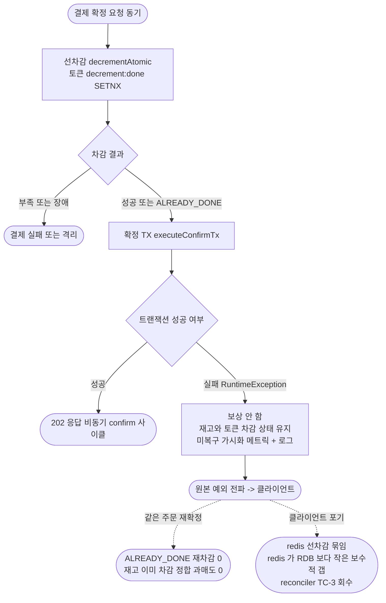

# STOCK-COMPENSATION-OTHER-PATHS — 완료 브리핑

> 봉인일: 2026-06-21
> 이슈/브랜치: #106
> 토픽 단계: discuss → plan → execute → ship (4단계 완료)

---

## 작업 요약

선행 작업(STOCK-COMPENSATION-RECOVERY)이 결제 결과 소비 경로(`handleFailed` / `handleQuarantined`)의 재고 보상을 결제 단위 atomic 보상 Lua + 중복 차단 토큰으로 정리하면서 침묵 손실을 제거했지만, "다른 보상 경로에도 같은 패턴을 적용하자"고 후속(TQ-7)으로 미뤄둔 두 지점이 남아 있었다. 본 토픽은 그 두 지점을 점검했고, 코드를 다시 들여다본 결과 둘의 성격이 처음 가정과 달랐다.

**경로 2**(`PaymentTransactionCoordinator.executePaymentFailureCompensationWithOutbox` + `compensateStockCacheGuarded`)는 과거 동기 폴링 워커(`OutboxProcessingService`)가 PG 승인 최종 실패 시 호출하던 실패 보상 가드였는데, 그 워커가 ADR-04(PG 호출·재시도·실패 보상 로직 pg-service 이관)에서 삭제되며 **운영 호출처 0의 死 코드**가 됐고, 그 책임은 이미 결과 소비 경로(`handleFailed`)가 흡수했다. 게다가 plan 단계에서 형제 outbox 처리 메서드 3개(`executePaymentSuccessCompletionWithOutbox` / `executePaymentRetryWithOutbox` / `executePaymentQuarantineWithOutbox`)도 같은 ADR-04 잔재 死 코드임이 드러나 함께 제거했다.

**경로 1**(`OutboxAsyncConfirmService.compensateStock`)은 살아있는 HTTP 동기 확정 진입 경로로, 확정 트랜잭션 실패 시 선차감 재고를 상품별 단일 `increment`로 되돌리며 예외를 try/catch로 삼키는 침묵 손실이 있었다. 더 깊은 문제는 재고는 복구하면서 선차감 중복 차단 토큰(`decrement:done:orderId`)은 정리하지 않아, 같은 주문 재확정 시 `decrementAtomic`이 `ALREADY_DONE`으로 재차감을 건너뛰면서 재고는 이미 복구돼 있어 **과매도**가 가능한 정합 결함이었다.

해법으로 처음에는 "롤백"(재고 복구 + 토큰 DEL)을 택했으나, discuss 게이트에서 domain-expert가 **confirm 엔드포인트에 동시성 직렬화(Idempotency-Key)가 없어 `decrement:done` 토큰 SETNX가 유일한 차감 멱등 보호막**이라는 점을 짚었다. 토큰을 DEL하면 그 보호막이 사라져 동시 confirm(더블클릭)·롤백 실패 시 과매도가 열린다. 그래서 방향을 전환해 **"재고 차감 유지"(보상 폐기)**를 택했다 — 확정 TX 실패 시 재고도 토큰도 건드리지 않고 차감 상태 그대로 두며, 보상 코드를 제거하고 미복구를 메트릭+로그로 가시화만 한다. 이렇게 하면 재확정은 `ALREADY_DONE`으로 정합하게 흡수되고(과매도 0), 동시 confirm도 토큰이 막아준다. 포기 시 남는 선차감 묶임은 redis < product RDB 보수적 갭(과매도 아님)이라 안전하며, 회수는 재고 reconciler(TC-3) 후속에 위임한다.

결과적으로 본 토픽은 신규 기능 추가가 아닌 **정리**(死 코드 + 보상 코드 제거)로 순 코드량이 줄었고, 과매도 0 불변식을 통합 테스트로 박아 향후 누군가 보상을 되살리면 즉시 깨지도록 회귀 가드를 남겼다.

---

## 핵심 설계 결정

### D1 — 경로 1: 보상 폐기(재고 차감 유지), 토큰 미접촉

- **결정**: 확정 TX 실패 시 재고를 복구하지 않고 선차감 재고·`decrement:done` 토큰을 차감 상태로 유지. 보상(`increment`) 호출 제거.
- **근거**: 과매도(돈·신뢰가 새는 방향)를 재고 누수(보수적 방향)보다 우선 차단. 토큰을 건드리지 않으면 동시 confirm·재확정이 모두 `ALREADY_DONE`으로 정합. 진입 실패는 일시 장애(RDB 떨림)를 포함하므로 재확정 여지를 남기는 게 도메인 의미와 맞다.
- **기각된 대안**:
  - **Option A (롤백 — 재고 복구 + 토큰 DEL)**: confirm 엔드포인트에 동시성 직렬화가 없어 토큰 SETNX가 유일 차감 멱등 보호막인데, 토큰 DEL이 ① 동시 confirm 시 중첩 차감 과매도 ② 롤백 Lua 실패 시 토큰 잔존 + 재고 미복구가 reconciler 부재로 영구 과매도. (discuss 게이트 domain-expert major 2)
  - **Option B (최종 실패 마킹)**: RDB 일시 떨림 같은 회복 가능 실패도 영구 실패로 처리 → 재확정 여지를 닫음.

### D2 — 경로 2 + 형제: ADR-04 잔재 outbox 死 코드 4메서드 제거

- **결정**: `executePaymentFailureCompensationWithOutbox` / `compensateStockCacheGuarded`(경로 2) + 형제 3개(`executePaymentSuccessCompletionWithOutbox` / `executePaymentRetryWithOutbox` / `executePaymentQuarantineWithOutbox`) + `PaymentEventStatus.canCompensateStock` + `EventType.STOCK_COMPENSATE_GUARD_SKIPPED` + 관련 테스트 제거.
- **근거**: `OutboxProcessingService`(ADR-04 삭제)가 유일 호출처였던 死 코드. 책임은 `handleFailed`가 흡수. 살아있는 `decrementStock` / `markStockCacheDownQuarantine` / `executeConfirmTx`는 보존.

### D3 — 미복구 가시화 (StockRetentionMetrics + STOCK_RETENTION_UNRECOVERED)

- **결정**: 침묵 swallow를 폐기하고, 확정 TX 실패로 회수되지 않은 선차감 건수를 `StockRetentionMetrics`(core/common/metrics) 카운터 + `LogFmt.error`(`STOCK_RETENTION_UNRECOVERED`)로 가시화한 뒤 원본 예외를 전파.
- **근거**: 동기 경로라 Kafka 재배달 backstop이 없으므로, 누수(L1)를 운영에서 관측 가능하게 만들어 reconciler 회수의 신호로 삼는다.

### D4 — 본 토픽 경계: 다음 층 orphan은 후속 위임

- **결정**: 형제 제거로 orphan이 된 `markPaymentAsRetrying`(event RETRYING 전이 유일 경로)·`outbox.toFailed`·`StockCachePort.rollback`은 본 토픽에서 제거하지 않고 TQ-8(비동기 confirm 상태 머신 정리)로 위임.
- **근거**: RETRYING 전이 경로 소멸의 상태 머신 영향(enum 제거는 DB 잔존 row 호환·SSOT 분석 선행)은 도메인 리스크가 큰 별도 주제. coordinator public 메서드 제거에서 경계를 긋는다. (RETRYING 경로 소멸 자체는 "살아있던 위험 경로가 사라지는 방향"이라 무해 — ship domain-expert 확인)

---

## 변경 범위

### 제거 (死 코드 + orphan)
- `PaymentTransactionCoordinator` — outbox 처리 4메서드(경로 2 + 형제 3개), 약 91줄
- `PaymentEventStatus.canCompensateStock()`
- `EventType` — `STOCK_COMPENSATE_GUARD_SKIPPED` / `STOCK_COMPENSATE_SUCCESS` / `STOCK_COMPENSATE_FAIL`
- `StockCachePort.increment()` + `StockCacheRedisAdapter` 구현 + `FakeStockCachePort` 구현
- 테스트: `PaymentTransactionCoordinatorTest`의 4 Nested 클래스(약 227줄), `PaymentEventStatusCrossInvariantTest`(파일 삭제), `PaymentEventStatusSplitMethodTest`의 canCompensateStock 케이스

### 변경
- `OutboxAsyncConfirmService` — `compensateStock` 제거, 확정 TX 실패 시 재고/토큰 무접촉 + 미복구 메트릭/로그 + 원본 예외 전파(`executeConfirmTxWithStockRetention`). `StockCachePort` 의존 제거
- `QuarantineCompensationHandler` — Javadoc 정정(본 핸들러는 상태 전이만, 결과 소비 경로 `compensateAtomic`은 별개 유지)
- `EventType` — `STOCK_RETENTION_UNRECOVERED` 추가
- 테스트: `OutboxAsyncConfirmServiceTest` 재작성(보상 0회·미복구 메트릭·예외 전파)

### 신규
- `core/common/metrics/StockRetentionMetrics` + `StockRetentionMetricsTest`
- `integration/StockRetentionIntegrationTest`(@SpringBootTest + Testcontainers + EmbeddedKafka, 과매도 0 회귀 가드 3종)

### 영구 문서 (ship context 동기화)
- CONFIRM-FLOW.md(§2/§8/§9), PITFALLS.md(§11/§18/§D7), ARCHITECTURE.md, TODOS.md(TQ-7 완료 + TQ-8 등재)

---

## 다이어그램

### 변경 후 확정 진입 플로우 (보상 폐기)

---

## 코드 리뷰 요약

### discuss 게이트 (2라운드)
- 1R: reviewer revise(major: increment orphan 누락 / minor 2) + domain-expert revise(major 2: **토큰 DEL 동시 confirm 과매도 / 롤백 실패 영구 과매도** — Option A 기각의 결정적 근거) → 설계를 Option A(롤백)에서 Option C(보상 폐기)로 전환.
- 2R: reviewer revise(문서 완결성 보완 5건 반영) + domain-expert **pass**(두 major 해소 소스 대조 확인).

### plan 게이트 (2라운드)
- 1R: reviewer revise(major 2: increment 단언 컴파일 / 존재하지 않는 케이스 지목) → 형제 死 코드 발견으로 Task 1 확장(4메서드 통째 제거로 단언 문제 자연 해소). domain-expert pass(minor 3).
- 2R: reviewer **pass** + domain-expert **pass**(RETRYING 경로 소멸 안전성 검증 — minor 2 반영).

### ship 코드 리뷰 (1라운드)
- reviewer revise(major 1: CONFIRM-FLOW/PITFALLS stale 참조 / minor 2: TODOS 미갱신, 테스트 tautology 단언) + domain-expert **pass**(minor 1: QuarantineCompensationHandler 주석 과잉 일반화).
- 처리: 테스트 단언·핸들러 주석은 implementer 수정(`57b7612b`), stale 문서·TODOS는 본 ship 마무리에서 정정. 코드 백본(보상 폐기·死 코드 제거)은 양쪽 다 깨끗 확인.

---

## 수치

| 항목 | 값 |
|:---:|:---:|
| 태스크 | 4개 (Task 1~4) |
| 커밋 | 8개 (discuss/plan docs 2 + Task 1·2(RED/GREEN)·3·4 5 + 리뷰 수정 1) |
| 테스트 | 단위 490 통과 / 통합 37 통과(StockRetentionIntegrationTest 3 신규) |
| 신설 | StockRetentionMetrics + EventType 1 + 통합 테스트 1 + 단위 테스트 1 |
| 제거 | outbox 死 코드 4메서드 + 가드 1 + EventType 3 + 포트 메서드 1 + 테스트 ~270줄 |
| 순 코드 | 정리 성격(제거 우세) |
| 게이트 findings | discuss critical 0 / plan critical 0 / ship critical 0, major는 모두 해소 또는 정정 |
| 알려진 한계 | L1(redis<RDB 보수적 누수 → reconciler TC-3), L2(outbox UNIQUE 충돌 재확정 비보장 → confirm 멱등성 별 토픽) |

---

## 후속 (TODOS 등재)

- **TQ-8 — 비동기 confirm 상태 머신 死 코드 정리**: 형제 제거로 드러난 `markPaymentAsRetrying`·`outbox.toFailed`·`rollback` orphan + RETRYING 전이 경로 소멸의 상태 머신 영향 검토.
- **TC-3 — 재고 동기화 정책(reconciler)**: L1 누수(redis<RDB 보수적 갭) 회수 주체.
