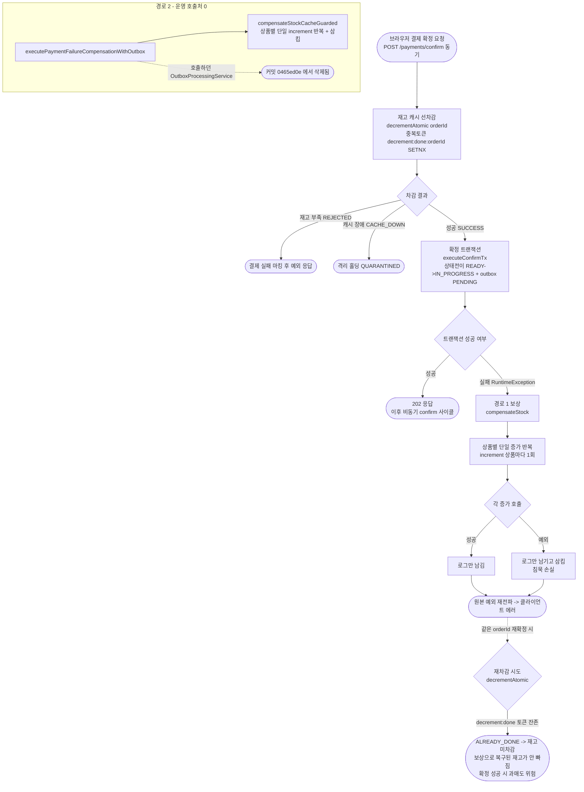
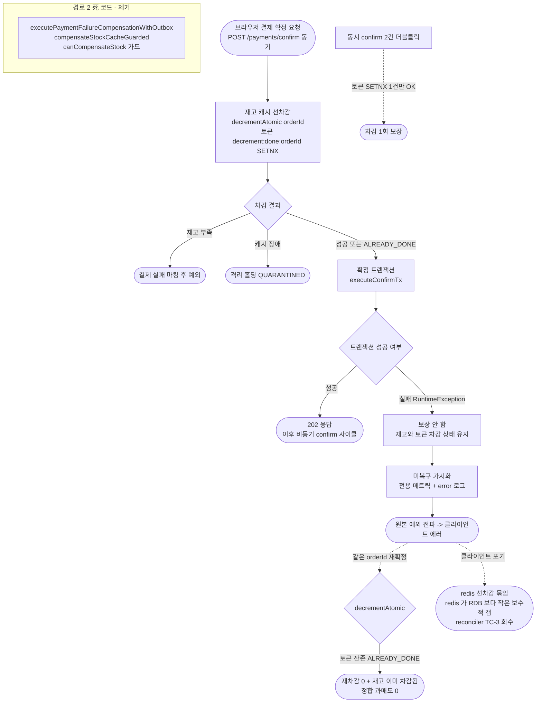

# 재고 보상 경로 일관화 설계 (STOCK-COMPENSATION-OTHER-PATHS)

> 최종 수정: 2026-06-20

## 사전 브리핑

### 현재 이해한 문제

선행 작업(STOCK-COMPENSATION-RECOVERY)이 결제 결과 메시지 소비 경로(실패·격리)의 재고 보상을 결제 단위 atomic 보상 Lua + 중복 차단 토큰으로 정리하면서 침묵 손실을 제거했다. 그런데 그때 "다른 보상 경로에도 같은 패턴을 적용하자"고 후속(TQ-7)으로 미뤄둔 두 지점이 남아 있다. 이번 작업은 그 두 지점을 점검해 보상 정책을 한 가지 모델로 통일한다 — 단, 코드를 다시 들여다보니 두 지점의 성격이 처음 가정과 다르다는 점이 드러났다.

### 두 대상 경로의 실제 상태

**경로 1 — 결제 확정 진입 시 차감 보상 (살아 있음)**

브라우저가 결제 확정을 요청하면(HTTP 동기 경로), 재고를 먼저 캐시에서 선차감한 뒤 결제 상태 전이를 트랜잭션으로 커밋한다. 이 트랜잭션이 실패하면 방금 선차감한 재고를 되돌려야 한다. 현재 이 되돌림은 상품별로 하나씩 단일 증가 호출(`increment()`)을 돌리고, 각 호출의 예외를 로그만 남기고 삼킨다(침묵 손실). 선행 작업이 만든 결제 단위 atomic 보상(`compensateAtomic()`)을 쓰지 않는다.

**경로 2 — 실패 보상 가드 (호출처 없는 死 코드)**

`PaymentTransactionCoordinator.executePaymentFailureCompensationWithOutbox()`(내부에서 `compensateStockCacheGuarded()` 호출)는 과거 스케줄러 워커(`OutboxProcessingService`)가 호출하던 보상 가드였다. 그러나 그 워커는 커밋 `0465ed0e`(ADR-04, "PG 직접 호출·재시도 정책·실패 보상 로직 pg-service 이관")에서 통째로 삭제됐고, 이후 이 메서드는 **운영 코드 호출처가 0**이다 (현재는 `PaymentTransactionCoordinatorTest`만 직접 호출). 즉 "일관화 대상"이 아니라 "제거 검토 대상"일 가능성이 크다.

### 현재 시스템 동작 (as-is)

### 이번 discuss에서 결정하려는 것

- **경로 2(死 코드) 처리 방향**: 제거할지, 미래 복원을 대비해 둘지 — 운영 호출처 0이라는 사실에 대한 사용자 판단.
- **경로 1 보상 방식 통일**: 상품별 단일 증가 반복을 결제 단위 atomic 보상(`compensateAtomic`)으로 교체할지.
- **중복 차단 토큰 정합 정책**: 보상 시 선차감 토큰(`decrement:done:orderId`)을 어떻게 다룰지 — 삭제 vs 보상 토큰 별도 적재 vs 유지. 재확정 시 과매도/재고누수가 갈리는 핵심.
- **경로 1의 회복 backstop**: 결제 결과 소비 경로와 달리 HTTP 동기 경로라 Kafka 재배달 retry/DLQ가 없다. 보상 자체가 실패했을 때 회복 수단을 둘지(예: 재확정 자연 회복에 의존 vs 별도 reconciler).

### 열린 질문 / 가정

- 경로 1의 확정 트랜잭션이 실제로 실패하는 시나리오는 무엇인가 (RDB 일시 장애, outbox 생성 충돌 등). 빈도와 회복 기대치에 따라 backstop 강도가 달라진다.
- 동일 `orderId`로의 결제 재확정이 실제 제품 플로우에서 발생하는가 (사용자 결제 버튼 재시도).
- 경로 2 제거 시 `executePaymentFailureCompensationWithOutbox` / `compensateStockCacheGuarded` / 관련 테스트 / `PaymentEventStatus.canCompensateStock()` 가드까지 동반 정리 범위가 어디까지인가.

---

## 요약 브리핑

### 결정된 접근

경로 2(과거 동기 폴링 워커가 쓰던 실패 보상 가드)는 ADR-04 비동기 전환으로 책임이 결제 결과 소비 경로로 이관돼 운영 호출처 0의 死 코드가 됐으므로 **제거**한다. 경로 1(결제 확정 진입 시 차감 보상)은 토큰을 건드리지 않는 **"재고 차감 유지"**로 간다 — 확정 트랜잭션이 실패해도 선차감 재고와 중복 차단 토큰을 그대로 두고, 보상 코드를 제거한 뒤 "재고 묶임"을 메트릭+로그로 가시화만 한다. 이렇게 하면 같은 주문 재확정은 토큰 멱등으로 정합하게 이어지고(과매도 0), 동시 확정 요청도 토큰이 막아준다. 결제가 끝내 포기될 때 남는 선차감 묶임은 재고가 실제보다 적게 보이는 보수적 갭이라 안전하며, 회수는 재고 대조(reconciler) 후속에 위임한다.

### 변경 후 동작 (to-be)

### 핵심 결정 목록

- **경로 2 제거**: 보상 가드 2메서드 + `canCompensateStock` + `STOCK_COMPENSATE_GUARD_SKIPPED` + 관련 테스트. 운영 호출처 0(ADR-04로 `handleFailed`가 책임 흡수).
- **경로 1 보상 폐기**: `compensateStock` + orphan이 된 `StockCachePort.increment()`·`STOCK_COMPENSATE_SUCCESS/FAIL` EventType 제거. 미복구 차감을 전용 메트릭+로그로 가시화.
- **토큰 유지**: `decrement:done`을 DEL하지 않는다 — SETNX가 유일한 차감 멱등 보호막이라 유지가 동시 confirm 과매도를 막는다.
- **과매도 0 / 누수는 보수적**: 재확정·동시 요청 모두 토큰으로 정합. 포기 시 redis<RDB 보수적 갭은 reconciler(TC-3) 위임.

### 트레이드오프 / 후속 작업

- **L1 — 재고 묶임 누수**: 진입 실패 후 포기 시 선차감이 회수되지 않음(보수적 갭). 자동 회수는 재고 reconciler(TC-3)의 독립 주제로 분리.
- **L2 — 재확정 회복 비보장**: outbox UNIQUE 충돌 분기에서 재확정이 영구 실패할 수 있음(과매도는 아님). confirm 멱등성 별 토픽 소관, 본 토픽 범위 밖.
- 토픽 성격은 신규 추가가 아닌 **정리**(死 코드 + 보상 코드 제거)로, 순 코드량이 줄어든다.

---

## 문제 정의

결제 결과 소비 경로(실패·격리)는 선행 작업이 결제 단위 atomic 보상 Lua + 중복 차단 토큰으로 정리해 침묵 손실을 제거했다. 그러나 두 개의 다른 재고 보상 지점이 그 정리에서 빠졌고, 코드를 다시 들여다본 결과 둘의 성격이 처음 가정과 다르다:

- **경로 1 — 결제 확정 진입 시 차감 보상**(살아 있음): 확정 트랜잭션 실패 시 선차감 재고를 상품별 단일 증가 호출로 되돌리는데, 각 호출 예외를 try/catch로 삼키는 침묵 손실이 있다. 게다가 재고는 복구(`increment`)하면서 선차감 중복 차단 토큰(`decrement:done:orderId`)은 정리하지 않는 어긋난 상태다 — 같은 주문 재확정 시 `decrementAtomic`이 `ALREADY_DONE`으로 재차감을 건너뛰는데 재고는 이미 복구돼 있어 **과매도** 가능. 이는 일관화 이전에 현재 코드에 이미 잠재한 정합 결함이다.
- **경로 2 — 실패 보상 가드**(死 코드): 과거 동기 폴링 워커(`OutboxProcessingService`)가 PG 승인 최종 실패 시 호출하던 보상 가드. 그 워커가 ADR-04(PG 호출·재시도·실패 보상 로직 pg-service 이관)에서 삭제되며 **운영 호출처 0**의 orphan이 됐고, 그 책임은 결제 결과 소비 경로(`handleFailed`)가 이미 흡수했다.

## 영향 범위

### 제거 (경로 2 — 死 코드)
- `PaymentTransactionCoordinator.executePaymentFailureCompensationWithOutbox()` (보상 가드 본체)
- `PaymentTransactionCoordinator.compensateStockCacheGuarded()` (private 보상 반복)
- `PaymentEventStatus.canCompensateStock()` — 운영 사용처가 경로 2 한 곳뿐
- `STOCK_COMPENSATE_GUARD_SKIPPED` EventType — 경로 2 전용 skip 로깅
- 관련 테스트: `PaymentTransactionCoordinatorTest`의 해당 케이스, `PaymentEventStatusCrossInvariantTest`(교차 불변식 — `canCompensateStock` 소멸로 무의미), `PaymentEventStatusSplitMethodTest`의 `canCompensateStock` 케이스

### 변경 (경로 1 — 보상 폐기 + 가시화)
- `OutboxAsyncConfirmService.compensateStock()` → 제거. 확정 TX 실패 시 재고 보상을 하지 않고, "선차감 재고가 미복구 상태로 유지됨"을 메트릭+error 로그로 가시화한 뒤 원본 예외를 전파한다(swallow 폐기, try 블록 외부 변수 재할당 없음).
- 테스트 재작성: `OutboxAsyncConfirmServiceTest.ConfirmTxFailureCompensationTest`(현재 보상 `increment` 호출을 단언하는 3 케이스) → 확정 TX 실패 시 재고 미접촉(`stockCachePort` 보상 0회) + 미복구 가시화 메트릭 1회 + 원본 예외 전파로 재작성.

### 제거 (경로 1 보상 폐기 동반 orphan)
- `StockCachePort.increment()` + `StockCacheRedisAdapter`의 구현 — 운영 호출처가 경로 1(`OutboxAsyncConfirmService`)·경로 2(`compensateStockCacheGuarded`) 둘뿐인데 본 토픽으로 모두 사라져 orphan이 된다. 선행 작업이 orphan port(`EventDedupeStore` 등)를 정리한 선례를 따른다. (관련 테스트 동반 정리)
- `EventType.STOCK_COMPENSATE_SUCCESS` / `STOCK_COMPENSATE_FAIL` — 운영 사용처가 경로 1·경로 2 둘뿐이라 본 토픽으로 orphan화. 미복구 가시화 로그는 전용 신규 EventType을 도입하므로(아래 §신규) 이 둘은 제거.

### 신규
- 재고 묶임(미복구 선차감) 가시화 — 확정 TX 실패로 선차감이 회수되지 않은 채 남은 건수 카운터를 `core/common/metrics`에 추가(기존 `PaymentConfirmGuardSkipMetrics` 패턴 준수)하고, 미복구 상태 전용 신규 `EventType`으로 error 로그를 남긴다. 롤백 Lua·신규 포트 메서드 없음.

### 무관 (건드리지 않음)
- `PaymentConfirmResultUseCase.handleFailed/handleQuarantined`의 `compensateAtomic` 경로 — 이미 정리됨
- `PaymentConfirmGuardSkipMetrics` — 결과 소비 경로의 멱등 가드 메트릭(경로 2와 별개)
- 도메인 `PaymentEvent` 상태 전이 — 변경 없음(경로 1은 READY 유지)
- confirm 엔드포인트 멱등성 / 동시성 직렬화 — 본 토픽은 토큰을 건드리지 않아 직렬화 추가 불필요(제외 범위 참고)

## 설계 옵션 비교 — 경로 1 처리

### Option A — 롤백 (선차감 취소: 재고 복구 + 토큰 DEL) ✗ 기각
선차감을 "없던 일"로 되돌린다(전 상품 INCRBY + `decrement:done:orderId` 토큰 DEL atomic). event는 READY 유지, 재확정 시 정상 재차감.
- 기각 사유(게이트 domain-expert major 2): confirm 엔드포인트에 동시성 직렬화(Idempotency-Key 등)가 없어 `decrement:done` 토큰 SETNX가 유일한 차감 멱등 보호막이다. 토큰을 DEL하면 그 보호막이 사라져 ① 동시 confirm(더블클릭) 시 토큰 DEL 직후 다른 요청이 재차감 + `execute()`가 IN_PROGRESS도 허용 → 중첩 차감 과매도, ② 롤백 Lua 자체 실패 시 토큰 잔존 + 재고 미복구가 reconciler 부재로 영구 과매도로 굳음.

### Option B — 최종 실패 마킹
event를 FAILED(terminal)로 박고 재고는 `compensateAtomic`으로 영구 복구. 재확정은 도메인 가드가 자동 차단.
- 기각 사유: RDB 일시 떨림 같은 회복 가능한 실패도 영구 실패로 처리 → 재확정 여지를 닫는다. 진입 실패의 성격과 어긋난다.

### Option C — 재고 차감 유지 (보상 폐기) ★ 채택
확정 TX 실패 시 재고를 복구하지 않고 선차감 상태 그대로 둔다(`decrement:done` 토큰도 유지). 보상 코드를 제거하고 "재고 묶임"을 가시화만 한다.
- 장점:
  - **과매도 0**: 재확정 시 `decrementAtomic`이 `ALREADY_DONE`을 반환하는데 재고는 실제로 차감돼 있어 정합. 재확정이 일어나든 안 일어나든 일관(Option A 대비 "재확정 발생" 가정에 의존하지 않음).
  - **동시 confirm 안전**: 토큰 SETNX 멱등 보호막을 그대로 유지 → confirm 직렬화를 추가할 필요 없음.
  - **롤백 실패 경로 소멸**: 보상 자체를 안 하므로 롤백 Lua 실패 backstop 문제가 발생하지 않는다.
  - **단순**: 신규 Lua·포트 메서드 없이 보상 코드를 제거(코드 감소). 토픽이 "경로 2 死 코드 제거 + 경로 1 보상 코드 제거"로 일관된 정리 성격.
- 단점(수용된 한계): 클라이언트가 재확정하지 않고 포기하면 redis 선차감 재고가 묶인 채 남는다(누수). 단 이는 **redis < product RDB 방향의 보수적 갭**(덜 파는 방향)이라 과매도가 아니며, 회수는 재고 reconciler(TC-3)에 위임한다.

**채택: Option C.** 결제 시스템에서 과매도(돈·신뢰가 새는 방향)를 원천 차단하는 것이 재고 누수(보수적 방향)보다 우선한다. Option C는 토큰을 건드리지 않아 동시성·롤백실패 과매도 경로를 모두 닫고, redis<RDB 보수적 갭은 이미 알려진 fencing in-flight 갭과 같은 성격이라 reconciler backstop 영역에 자연히 들어간다.

## 결정 사항

| 항목 | 결정 | 이유 |
|:---:|:---:|:---:|
| 토픽 범위 | 경로 2 死 코드 제거 + 경로 1 정합 수정 | TQ-7 원의도, 같은 재고 보상 주제 응집 |
| 경로 2 처리 | 보상 가드 2메서드 + `canCompensateStock` + `STOCK_COMPENSATE_GUARD_SKIPPED` + 관련 테스트 제거 | ADR-04 비동기 전환으로 책임이 `handleFailed`로 이관, 운영 호출처 0 |
| 경로 1 처리 | 보상 폐기(재고 차감 유지). `compensateStock` + `increment` orphan 제거, 미복구 가시화 메트릭+로그 | 토큰을 건드리면 confirm 직렬화 부재로 과매도. 차감 유지가 재확정·동시성 모두 정합하며 과매도 0 |
| 토큰 정책 | `decrement:done` 토큰 유지(DEL 안 함) | SETNX가 유일한 차감 멱등 보호막이라 유지가 동시 confirm 과매도를 막음 |
| 재고 누수 backstop | 가시화(메트릭+error 로그) + 재고 reconciler(TC-3) 위임, 신규 인프라 없음 | redis<RDB 보수적 갭이라 과매도 아님. reconciler는 별 주제 |
| 침묵 손실 | swallow 폐기 → 미복구 차감 메트릭 + error 로그, 원본 예외 전파 | 가시성 확보, 동기 경로라 원본 예외가 클라에 전달됨 |

## 장애 시나리오와 대응

- **동시 confirm(더블클릭)**: req-A가 `decrementAtomic` 성공(토큰 SET, 재고 -N) 후 확정 TX 실패. 토큰을 유지하므로 req-B의 `decrementAtomic`은 `ALREADY_DONE`(재차감 0). 재고는 -N 한 번만 빠진 상태로 일관 — 중첩 차감 과매도 없음.
- **확정 TX 실패 후 재확정**: event는 READY, 토큰·재고는 차감 상태 유지 → 재확정 시 `decrementAtomic`이 `ALREADY_DONE` → `SUCCESS` 매핑으로 확정 TX 재시도. 재고는 이미 차감돼 있어 정합(과매도 0). 일시 장애였다면 재확정으로 결제가 정상 완료된다.
- **클라이언트 포기(재확정 없음)**: redis 선차감 -N이 남는다. product RDB(SoT)는 결제 진입 실패라 차감되지 않았으므로 redis < RDB 보수적 갭이 된다(다른 주문이 보수적으로 거부될 수 있을 뿐 과매도 아님). 미복구 메트릭으로 가시화하고 재고 reconciler(TC-3 후속)가 RDB 기준으로 회수한다.
- **경로 1과 `handleFailed`의 관계**: 경로 1은 재고를 전혀 건드리지 않으므로(보상 폐기), 결과 소비 경로의 `compensateAtomic`(compensation:done SET)과 경로 1 사이에 재고 효과가 중첩될 여지가 원천적으로 없다. 또한 확정 TX 실패 시 confirm 발행도 같은 TX에서 롤백되어 `events.confirmed`가 오지 않으므로 `handleFailed`는 호출되지도 않는다.

## 검증 전략

- **단위(Mockito)**: `OutboxAsyncConfirmService` — 확정 TX 실패 시 ① 재고 보상 호출이 0회(stockCachePort 미접촉) ② 미복구 가시화 메트릭 1회 기록 ③ 원본 예외 전파.
- **통합(@SpringBootTest)**: 선차감 → 확정 TX 실패 → 같은 주문 재확정 → `ALREADY_DONE`으로 재차감 0 + 재고가 정확히 -N 한 번만 유지(과매도/이중차감 0). 동시 confirm 2건에서 차감 1회 보장 AND outbox UNIQUE 충돌로 실패한 건이 재고를 건드리지 않음(`increment`/`compensate` 0회) — Option C의 과매도 0 불변식을 회귀로부터 지키는 핵심 가드.
- **회귀**: 경로 2 + `increment` orphan 제거 후 전체 테스트 그린, 교차 불변식 테스트 정리 반영.

## 알려진 한계

- **L1 — 진입 실패 후 포기 시 redis 재고 묶임**: 확정 TX 실패 후 클라이언트가 재확정하지 않으면 선차감 -N이 회수되지 않는다. redis < product RDB 보수적 갭(과매도 아님)이며, 본 토픽 범위에서는 메트릭+로그 가시화에 그치고 자동 회수는 두지 않는다(수용된 한계). 회수 주체는 재고 reconciler(TC-3). 이는 CAPACITY-AND-SCALEOUT에서 관찰된 fencing in-flight 재고 갭(redis<RDB)과 같은 계열의 backstop 영역이다.
- **L2 — 재확정 회복의 비보장(범위 밖)**: "재확정 자연 회복"은 outbox UNIQUE 충돌 분기에서 깨질 수 있다. 정상 confirm으로 `payment_outbox` row가 남은 뒤 동일 orderId 재confirm이 들어오면 `createPendingRecord`의 비멱등 INSERT가 UNIQUE 위반으로 확정 TX를 실패시킨다. Option C는 이때도 재고를 건드리지 않아 과매도는 없으나(재고 정합 유지), 클라이언트가 재확정으로 결제를 완료하지 못하는 회복 불가 경로가 남는다. 이는 Option C 신설 위험이 아니라 confirm 종결 가드/멱등성 부재라는 기존 잠재 결함이며 confirm 멱등성 별 토픽 소관(본 토픽 범위 밖).

## 제외 범위

- **재고 reconciler 자체 구현** — L1 누수의 회수 주체. TC-3(재고 동기화 정책)의 독립 주제로 분리.
- **confirm 엔드포인트 동시성 직렬화(Idempotency-Key 등)** — Option A를 기각하고 토큰을 유지하므로 불필요. confirm 멱등성 강화는 별 토픽 사안.
- **DLQ admin 도구** — 별 후속.
- **pg-service 측 보상** — 경로 2가 이관된 책임은 pg-service 소관, 본 토픽 범위 밖.
- **`compensateAtomic`(결과 소비) 경로 변경** — 이미 정리됨, 건드리지 않음.

## 참고

- `docs/archive/stock-compensation-recovery/COMPLETION-BRIEFING.md` — 선행 작업(보상 Lua + 중복 토큰 + Kafka 에러 핸들러), PHASE2에 본 토픽 명시
- ADR-04 / 커밋 `0465ed0e` — `OutboxProcessingService` 삭제(경로 2 orphan화)
- `docs/context/TODOS.md` TQ-7 / TC-3(재고 동기화 정책) / fencing in-flight 재고 갭 관찰
- `docs/context/PITFALLS.md` — 보상 트랜잭션 중복 진입 race / 부팅 외 재고 동기화 부재
