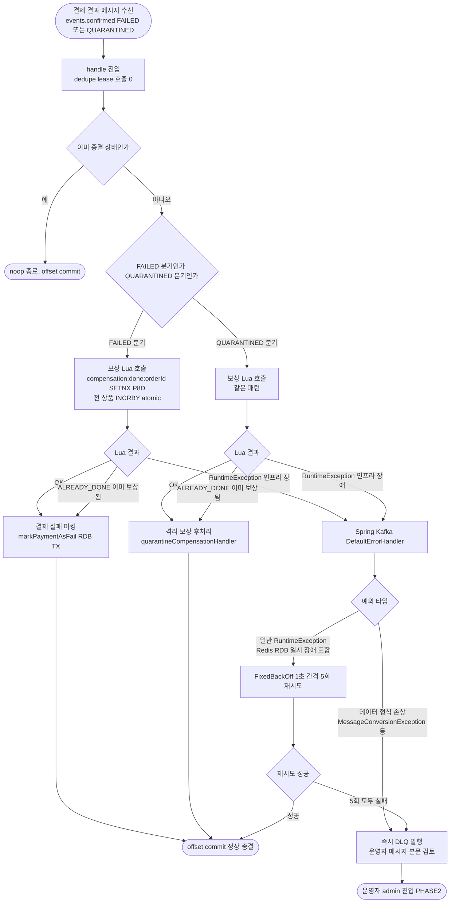
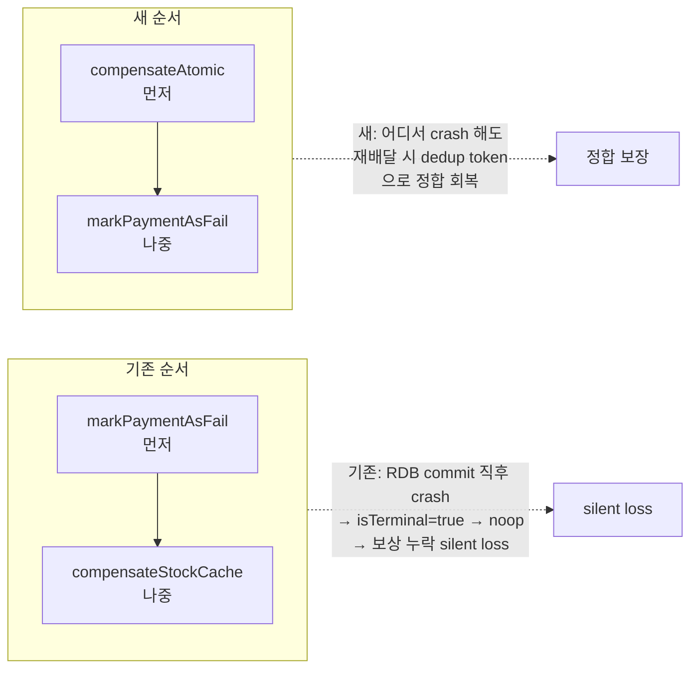

# STOCK-COMPENSATION-RECOVERY — 완료 브리핑

> 봉인일: 2026-05-08
> 브랜치: `#71`
> 토픽 단계: discuss → plan → plan-review → execute → review → verify (전 6단계 완료)

---

## 작업 요약

`payment-service` 의 `events.confirmed` consumer 가 PG 결과를 FAILED / QUARANTINED 로 받았을 때 Redis 선차감 캐시를 보상해야 하는데, 기존 `compensateStockCache` 의 `try/catch` 가 INCR 실패를 `LogFmt.error` 로만 swallow 하고 넘어가는 silent loss 가 있었다. 거기에 더해 dedupe lease (`markWithLease P5M` → 처리 후 `extendLease P8D`) 가 8일 동안 같은 메시지의 재처리를 막고 있어서, 한 번 실패한 보상은 8일이 지나기 전까지 영구히 회복되지 않는 구조였다.

본 토픽은 이 silent loss 를 회복하는 layer 를 도입한다. 대안 6라운드 + Round 7 의 사용자 직관 검증을 거쳐, **application 측 회복 책임을 모두 폐기하고 Lua atomic dedup token + Spring Kafka native 에러 핸들러 두 인프라 layer 로 회복 책임을 위임** 하는 방향이 채택됐다.

구체적으로는 (1) 결제 단위 N개 상품 atomic Lua 스크립트 2종 (`stock_decrement_atomic.lua` / `stock_compensation_atomic.lua`) 을 도입해 SETNX dedup token + 전체 INCRBY/DECRBY 를 한 번에 처리하고, (2) application 의 `try/catch + dedupe lease wrapper + 직접 DLQ publisher 호출` 을 통째로 들어내고 RuntimeException 을 그대로 throw 하며, (3) Spring Kafka 의 `DefaultErrorHandler + DeadLetterPublishingRecoverer + FixedBackOff(1s, 5)` 빈 1개로 retry / DLQ 정책을 응축했다. 추가로 `handleFailed` 의 호출 순서를 "보상 먼저, `markPaymentAsFail` 나중" 으로 뒤집어 모든 crash 지점에서 재배달이 정합 회복하도록 보장했고, Redis 의 `appendfsync` 를 `everysec` → `always` 로 강제해 AOF 부분 fsync race window 를 완화했다.

결과적으로 `EventDedupeStore` 와 `PaymentConfirmDlqPublisher` 두 port 가 main 사용처 0 인 orphan 이 되어 정리됐고, application layer 의 회복 책임 코드가 거의 사라졌다. 통합 테스트가 정상 / ALREADY_DONE 멱등 / retry 5회 후 DLQ / not-retryable 즉시 DLQ / 호출 순서 5개 시나리오를 cover 한다.

---

## 핵심 설계 결정

### D1 — 선차감 Lua 강화 (단일 상품 → 결제 단위 atomic)

- **결정**: `stock_decrement.lua` (단일 상품 단위) 와 별개로 `stock_decrement_atomic.lua` 신설. KEYS = `[decrement:done:{orderId}, stock:{prod1}, stock:{prod2}, ...]`. SETNX dedup token + 전 상품 재고 검증 + atomic DECRBY.
- **근거**: 기존 단일 상품 Lua 를 for-loop 으로 호출하면 중간에 다른 클라이언트의 쓰기가 끼어들 수 있어 부분 차감 race 발생. Lua 는 Redis 서버 측 단일 스레드 실행이라 N개 키를 한 호출 안에서 atomic 처리 가능.
- **대안 기각**: 신규 보상 outbox + 5초 워커 (Baseline 0) — 사용자가 4 이질 신호 모두 위반 (outbox 의미 변질 / Lua 두 번째 사용처 / port 시그니처 일반성 / PaymentEvent 옆 트랙 회복) 으로 거부.

### D2 — 보상 Lua 신설 (결제 단위 atomic + dedup token)

- **결정**: `stock_compensation_atomic.lua`. KEYS = `[compensation:done:{orderId}, stock:{prod1}, ...]`. SETNX dedup token + atomic INCRBY. 선차감 Lua 와 같은 패턴이지만 namespace 만 분리 (`decrement:done` vs `compensation:done`).
- **근거**: Round 7 의 (b) 신호 재해석 — Lua 는 "결제 단위 멀티-키 atomic 도구" 로 의미 정합. 양쪽 사용처가 같은 패턴이라 도구 정책이 흐려지는 게 아니라 확립.
- **대안 기각**: payment_history audit-driven (Round 6 채택안 D enhanced) — `markStockCompensateSucceeded` 등 wrapper 3 + 별 Aspect + 별 Reconciler 신설 비용. Round 7 에서 사용자 직관 ("Kafka 활용 부족, 불필요하게 복잡") 으로 폐기.

### D3 — application 측 try/catch + wrapper + DLQ 직접 호출 통째로 폐기

- **결정**: `compensateStockCache` 메서드 + `processMessageWithLeaseGuard` + `handleRemoveOnFailure` 통째로 제거. `handle` 메서드는 `processMessage(message)` 1줄. RuntimeException 은 그대로 throw.
- **근거**: dedupe lease 가 폐기되면 catch 의 두 책임 (재배달 활성화 / silent loss 방지) 자체가 redundant. retry / DLQ 책임은 인프라 bean 이 응축.
- **대안 기각**: 옵션 D2 (도메인 메서드 + 별 Aspect 가로채기) — Spring AOP proxy-based 가로채기가 도메인 메서드에서는 작동 불가 (D4-1 흡수 결과).

### D4 — dedupe lease (markWithLease / extendLease / remove) 폐기

- **결정**: `markWithLease(P5M)` / `extendLease(P8D)` / `remove` / `paymentConfirmDlqPublisher` 직접 호출 통째 폐기. 책임 위임:
  - rebalance race → Lua dedup token SETNX
  - 시간차 재처리 → Lua dedup token P8D
  - 정상 결제 race → 기존 `PaymentEvent.status.isTerminal()` 가드
- **근거**: Kafka partition 보장 (같은 consumer group 안에서 같은 partition 은 한 consumer 만) 이 동시 race 차단 책임을 이미 담당. 시간차 재처리는 Lua dedup token 이 차단. **markWithLease redundant**.

### D5 — `StockCachePort` 시그니처 변경 (결제 단위 atomic 의미 명시)

- **결정**: `decrementAtomic(orderId, List<PaymentOrder>)` / `compensateAtomic(orderId, List<PaymentOrder>)` 추가. 반환 enum 2종 (`StockDecrementAtomicResult` / `StockCompensationAtomicResult`). 기존 `decrement` / `increment` / `rollback` 은 PHASE2 의존 잔존이라 유지.
- **근거**: port 시그니처가 구현 의도를 반영해야 한다. 단일 상품 시그니처는 호출부가 for-loop 을 강요하는 구조. 시그니처 자체가 결제 단위 atomic 을 표현하면 잘못된 for-loop 사용이 컴파일 에러로 차단된다.

### D6 — `handleFailed` 호출 순서 뒤집기 (보상 → RDB)

- **결정**: 기존 `markPaymentAsFail` → `compensateStockCache` 순서를 `compensateAtomic` → `markPaymentAsFail` 로 뒤집기. `handleQuarantined` 는 이미 보상 → quarantineHandler 순서라 메서드 교체만.
- **근거**: 기존 순서는 RDB commit 직후 / 보상 직전 crash 시 `isTerminal=true` 가 재배달을 noop 종결 → 보상 누락 silent loss. 새 순서는 모든 crash 지점에서 재배달 시 정합 보장 (보상 Lua ALREADY_DONE → markPaymentAsFail 진행).
- **주의**: `handleQuarantined` 는 "순서를 뒤집는" 게 아니라 "메서드만 교체". 두 분기를 같은 어휘로 묶어 quarantineHandler 를 보상 앞으로 보내면 PITFALLS #11 보상 트랜잭션 중복 진입 race 신설 위험.

### D7 — Spring Kafka `DefaultErrorHandler` 위임 (인프라 bean 1개로 retry/DLQ 응축)

- **결정**: `KafkaErrorHandlerConfig` 신설. `DefaultErrorHandler + DeadLetterPublishingRecoverer + FixedBackOff(1s, 5)`. not-retryable 화이트리스트: `MessageConversionException` / `IllegalArgumentException` / `IllegalStateException`. 일반 RuntimeException (Redis / RDB 일시 장애 포함) 은 1초 간격 5회 retry → 회복 또는 한도 초과 후 DLQ.
- **근거**: `RedisConnectionFailureException` 등 일시 / 영구 구분 불가능한 예외는 retry 5회 안에서 자연 회복 또는 DLQ. 즉시 DLQ 보내면 1초 떨림에 회복 기회 박탈. 데이터 / 형식 손상 예외는 retry 무의미라 즉시 DLQ.
- **trade-off**: partition lag — `events.confirmed` partition key = `orderId` (`murmur2 % 3`) 라 약 1/3 의 다른 결제가 retry 중 lag 받음. 5초 (1초 × 5) 라 학습 가시성 안에서 수용 가능. production-grade 에서 lag 0 필요하면 `@RetryableTopic` non-blocking retry — PHASE2.

### D8 — Redis `appendfsync=always` 강제 (AOF race window 완화)

- **결정**: `docker-compose.infra.yml` 의 `redis-stock` 서비스 `--appendfsync everysec` → `--appendfsync always`.
- **근거**: Lua 안 SETNX + DECRBY/INCRBY 가 atomic 이지만 Redis crash + AOF 부분 fsync 시 SETNX 만 디스크 박힘 + 차감/보상 안 박힘 race 가능. `always` 는 매 명령 fsync 라 race window = 디스크 latency 수준.
- **trade-off**: throughput 감소 인정. 단일 docker-compose 가정 본 토픽 L1 정합. 벤치마크 비교 필요 시 별 override PHASE2.

---

## 변경 범위

### 도메인 layer
- 변경 없음 (`PaymentEvent` / `PaymentEventStatus` 그대로). 본 토픽은 application + infrastructure layer 변경만.

### Application layer

**추가**:
- `application/port/out/StockCachePort.java` — `decrementAtomic(String orderId, List<PaymentOrder>)` / `compensateAtomic(String orderId, List<PaymentOrder>)` 메서드 추가
- `application/port/out/StockDecrementAtomicResult.java` — enum (`OK / ALREADY_DONE / INSUFFICIENT`)
- `application/port/out/StockCompensationAtomicResult.java` — enum (`OK / ALREADY_DONE`)

**제거 (orphan port)**:
- `application/port/out/EventDedupeStore.java`
- `application/port/out/PaymentConfirmDlqPublisher.java`

**변경**:
- `application/usecase/PaymentConfirmResultUseCase.java` — `handle` 1줄로 단순화, `compensateStockCache` 메서드 + `processMessageWithLeaseGuard` + `handleRemoveOnFailure` 제거, 생성자에서 `EventDedupeStore` / `PaymentConfirmDlqPublisher` / `leaseTtl` / `longTtl` 파라미터 제거, `handleFailed` 호출 순서 뒤집기, `handleQuarantined` 메서드 교체
- `application/usecase/PaymentTransactionCoordinator.java` — `decrementStock(String orderId, List<PaymentOrder>)` 시그니처 변경, `decrementSingleStock` private 메서드 제거, `decrementAtomic` 1회 호출 + 결과 enum 분기
- `application/OutboxAsyncConfirmService.java` — `decrementStock` 호출부에 `command.getOrderId()` 전달 추가

### Infrastructure layer

**추가**:
- `infrastructure/config/KafkaErrorHandlerConfig.java` — Spring Kafka 에러 핸들러 빈
- `src/main/resources/lua/stock_decrement_atomic.lua` — 결제 단위 atomic 차감 Lua
- `src/main/resources/lua/stock_compensation_atomic.lua` — 결제 단위 atomic 보상 Lua
- `infrastructure/cache/StockCacheRedisAdapter.java` 에 `decrementAtomic` / `compensateAtomic` 메서드 추가 (`DECREMENT_ATOMIC_SCRIPT` / `COMPENSATION_ATOMIC_SCRIPT` 정적 초기화)

**제거**:
- `infrastructure/dedupe/EventDedupeStoreRedisAdapter.java`
- `infrastructure/messaging/publisher/PaymentConfirmDlqKafkaPublisher.java`
- `application.yml` 의 `payment.event-dedupe.*` 설정 키

### 인프라 / 운영
- `docker/docker-compose.infra.yml` — `redis-stock` 의 `--appendfsync` 가 `everysec` → `always`

### Test layer
- 신규 단위 테스트 4개 — `StockDecrementAtomicLuaTest` / `StockCompensationAtomicLuaTest` (Testcontainers Redis), `FakeStockCachePortAtomicTest`, `KafkaErrorHandlerConfigTest`
- 신규 통합 테스트 1개 — `StockCompensationRecoveryIntegrationTest` (`@SpringBootTest + @EmbeddedKafka + Testcontainers Redis`, 5 시나리오)
- 변경 — `PaymentTransactionCoordinatorTest`, `OutboxAsyncConfirmServiceTest`, `PaymentConfirmResultUseCaseHandleFailedTest`, `PaymentConfirmResultUseCaseHandleApprovedTest`, `PaymentConfirmResultUseCaseIdempotencyGuardTest`, `ConfirmedEventConsumerTest`, `StockCacheRedisAdapterTest`
- 신규 — `PaymentConfirmResultUseCaseHandleQuarantinedTest`
- 삭제 — `PaymentConfirmResultUseCaseTwoPhaseLeaseTest`, `EventDedupeStoreRedisAdapterTest`, `FakeEventDedupeStore`, `FakeEventDedupeStoreLeaseTest`, `FakePaymentConfirmDlqPublisher`

### 의존성
- `payment-service/build.gradle` — `spring-kafka-test` testImplementation 추가 (test-only, production 영향 0)

---

## 다이어그램

### 변경 후 보상 플로우 (전체 경로)

### 호출 순서 변경 (handleFailed) — crash 지점 정합성

---

## 코드 리뷰 요약

### plan 단계 (Round 1 → Round 2)

**Round 1 finding 흡수**:
- Critic — major 2 (SCR-7 orphan port 누락 / SCR-6 회귀 테스트 3건 누락) + minor 2 (SCR-9 profile 분기 / SCR-10 L3 cross-ref)
- Domain — major 2 (D1 ALREADY_DONE cascade / D2 markPaymentAsFail 영구 실패 cascade) + minor 3 (D3 handleQuarantined 표현 / D4 보상 결과 enum / D5 = critic minor)
- 흡수 결과 — `StockCompensationAtomicResult` enum 도입, SCR-6 본문 handleFailed/handleQuarantined 분리 기술, §알려진 한계 L6/L7 추가, SCR-7 에 `PaymentConfirmDlqPublisher` 폐기 합류, SCR-6 에 누락 테스트 3건 추가

**Round 2**: Critic + Domain 둘 다 pass, finding 0.

**plan-review-1**: Plan Reviewer pass, finding 0.

### review 단계 (1라운드)

- Critic — minor 3 (PHASE2 표시 주석 부재 / 통합 테스트 DLQ 토픽 도착 검증 부재 / `@Qualifier` 미명시) — 머지 차단 사유 아님
- Domain — minor 1 (D1 — `OutboxAsyncConfirmService.compensateStock` 의 dedup token namespace 인지) — PHASE2 인지 강화 권고
- 흡수 — PLAN PHASE2 항목에 dedup token cascade 인지 한 줄 추가 (PHASE2 작업 시 token DEL 또는 compensation token 박기 정책 정밀화 필요)

### verify 단계

- 전체 테스트 607 PASS / 0 FAIL
- 커버리지 line 89.77% / branch 95.42%
- 11개 context 문서 갱신 (CONFIRM-FLOW / ARCHITECTURE / PITFALLS / CONCERNS / TODOS / STACK / PAYMENT-FLOW / STRUCTURE / CONVENTIONS / TESTING / INTEGRATIONS)

---

## 수치

| 항목 | 값 |
|------|---|
| 태스크 | 10개 (SCR-1 ~ SCR-10) |
| TDD=true 태스크 | 8개 |
| domain_risk=true 태스크 | 4개 |
| 테스트 (전체) | 607 PASS / 0 FAIL |
| 테스트 (본 토픽 신규 / 변경) | 단위 23 + 통합 5 = 28 |
| 커버리지 | line 89.77% / branch 95.42% |
| 알려진 한계 (L1~L7) | 7건 (Redis cluster 비호환 / AOF race / P8D 만료 / DLQ admin / N 부하 / 보상 끝 결제 cascade / markPaymentAsFail 영구 실패 cascade) |
| 신설 컴포넌트 | Lua 2 + enum 2 + bean 1 + 통합 테스트 1 |
| 폐기 컴포넌트 | port 2 + 어댑터 2 + Fake 3 + application 메서드 3 |
| 코드 리뷰 findings | critical 0 / major 0 / minor 4 (review 단계) |

---

## PHASE2 (별 토픽 후속)

본 토픽 종결 시점에 다음 항목이 PHASE2 로 미뤄짐:

- **STOCK-COMPENSATION-OTHER-PATHS** — `OutboxAsyncConfirmService.compensateStock` (line 99-119) 와 `PaymentTransactionCoordinator.compensateStockCacheGuarded` (line 168-180) 의 동일 silent loss 패턴 회복. **추가**: confirm TX 실패 보상 시 `decrement:done:{orderId}` dedup token 정합 (token DEL 또는 compensation token 박기) 정책 정밀화 필요 (review Domain D1 인지)
- **DLQ admin 도구** — DLQ 토픽 조회 / 수동 재처리 / 강제 종결
- **Redis cluster 환경 대응** — hash tag 글로벌 묶음 또는 항목 단위 RDB outbox 회복
- **`@RetryableTopic` non-blocking retry** — production-grade 에서 partition lag 0 보장 시
