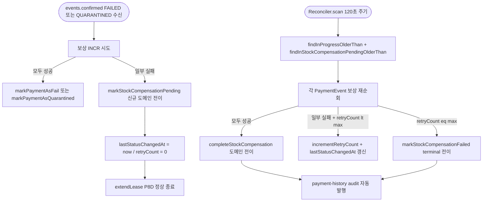
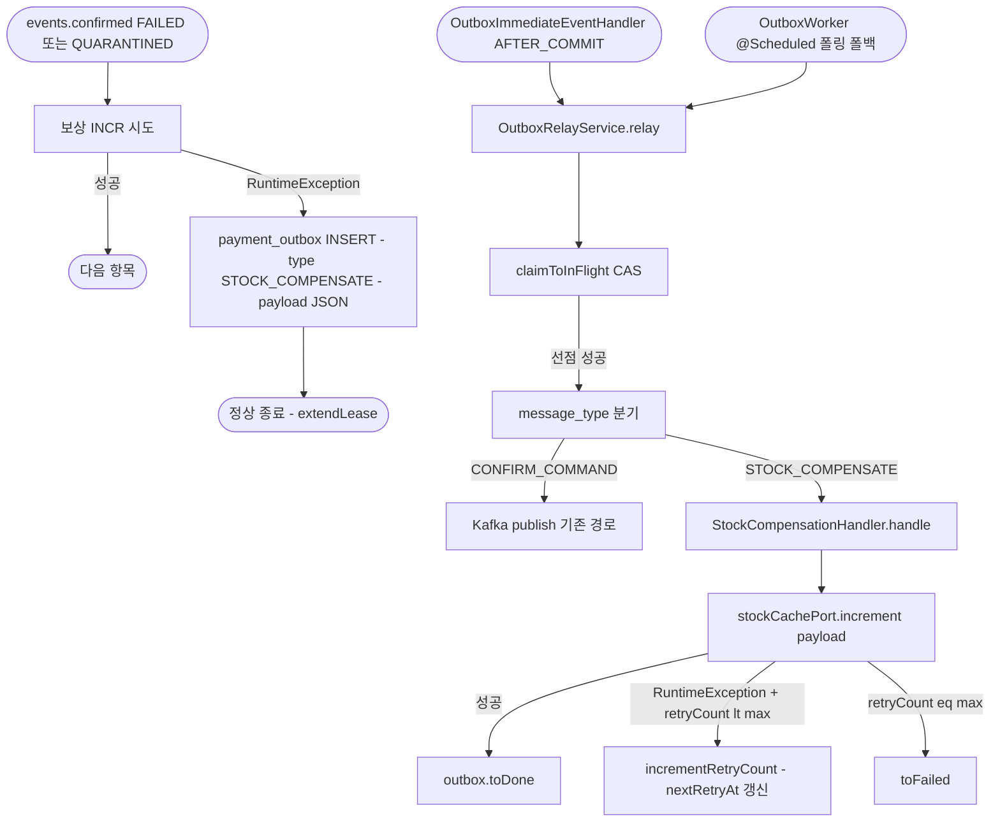
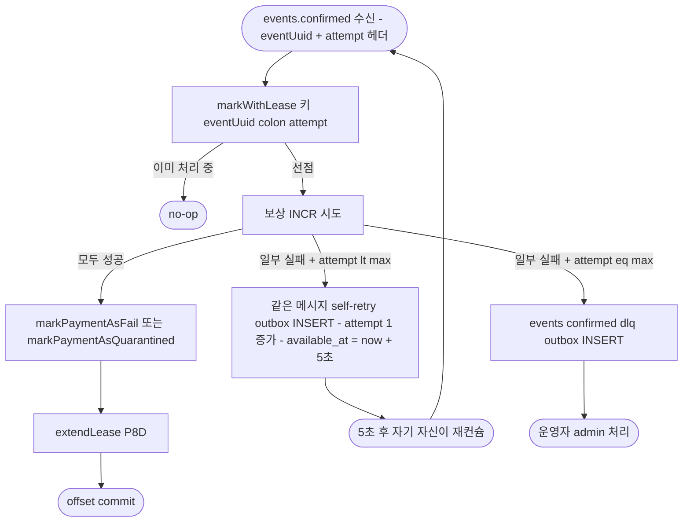
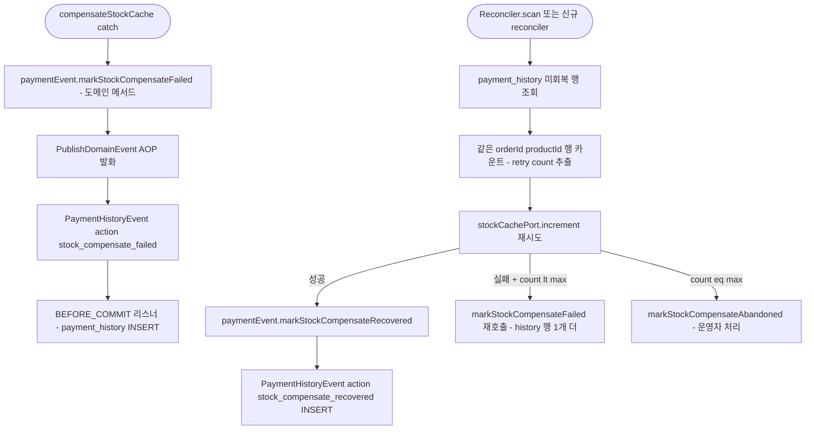
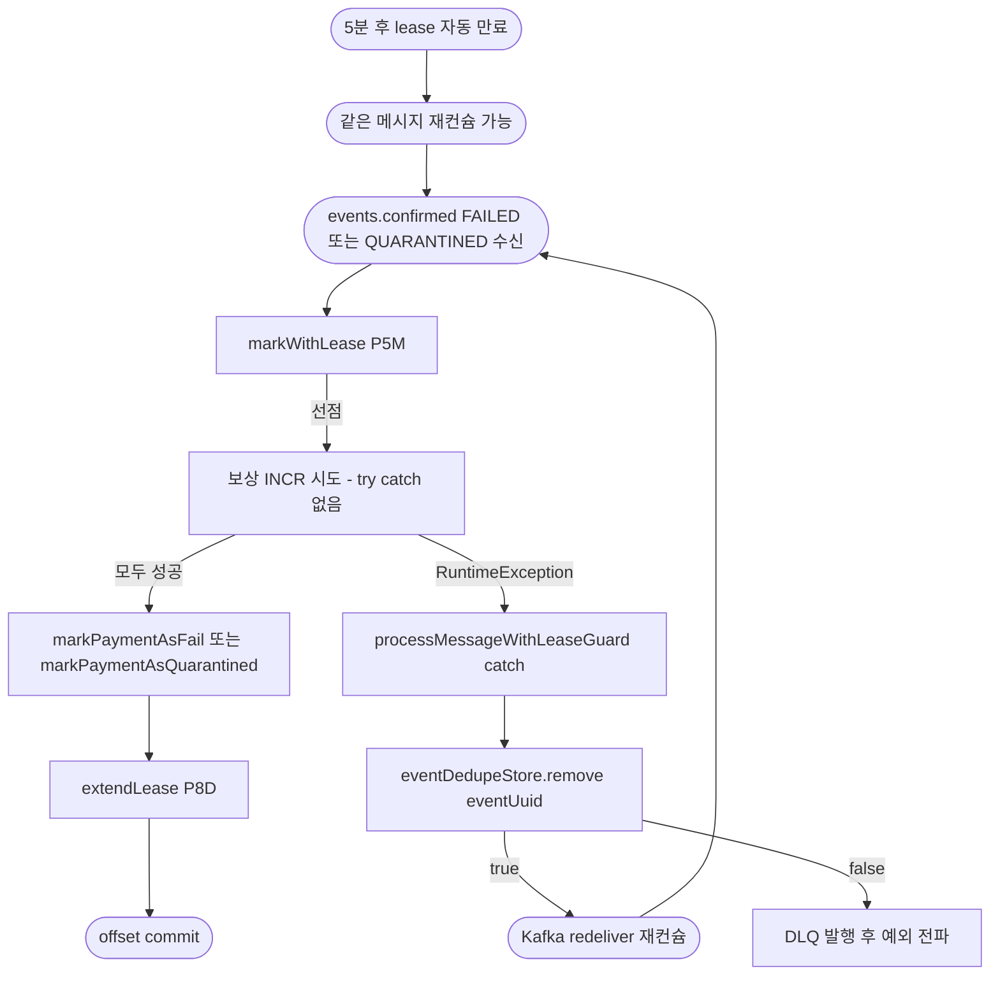
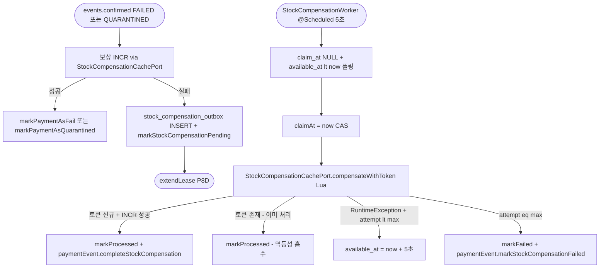

# STOCK-COMPENSATION-RECOVERY — 대안 방향 탐색 (Round 1 → Round 6)

> stage: discuss / extended-exploration
> 진입 사유: 사용자가 RDB 보상 outbox + Lua 처리 토큰 + 5초 워커 결정안 (Candidate 0) 이 기존 비즈니스 흐름과 이질적이라고 판단. 더 자연스러운 대안 탐색.

> **Round 6 audit 결과 (2026-05-04)**: 사용자 제기 3 시나리오 (수신 실패 / 처리 실패 + 커밋 / 처리 후 커밋 전 죽음) 커버리지 점검 후 후보 정리.
> 살아남은 후보: **Candidate D (enhanced)** 단 1개. 상세는 `docs/topics/STOCK-COMPENSATION-RECOVERY-DECISION.md` §Round 6 + `docs/rounds/stock-compensation-recovery-alternatives/round-6-scenario-audit.md`.
>
> | 후보 | Round 6 판정 | 사유 |
> |---|---|---|
> | Baseline 0 | **DELETE** | 사용자 4 신호 거부 본질 그대로. enhancement (Lua 를 happy path 에 확장) 후에도 (b)(c) 가속 |
> | Candidate A | **DEMOTE** | 시나리오 3 커버하려면 PaymentOrder.compensated_at (PHASE2 deferred) 도입 필요 — 본 토픽 §0 Non-goal 위반 |
> | Candidate B | **DEMOTE** | 시나리오 3 커버 enhancement (SETNX happy path) 가 happy path 영향 0 가드 가속 위협 |
> | **Candidate D** | **PASS (조건부)** | enhancement (happy path SUCCEEDED audit) 가 audit-driven 본질과 정합 |
> | C / E / F | (Round 2 후순위 그대로) | Round 6 audit 대상 외 |
>
> 본 문서는 1~5 라운드 본문 그대로 보존 (이력 추적). Round 6 후 채택 흐름은 DECISION.md 참조.

## 사용자가 지목한 이질적 신호 — 대안에서 회피해야 할 4가지

기존 결정안의 비즈니스 흐름 부정합 4가지를 출발점으로 삼는다.

| # | 신호 | 정확한 의미 |
|---|---|---|
| (a) | 새 테이블의 의미가 **Kafka publish queue 가 아닌 작업 큐** | 기존 `payment_outbox` / `stock_outbox` / `pg_outbox` 는 모두 "토픽·payload·available_at 으로 메시지 발행 대기" 의 의미를 갖는다. 신규 `stock_compensation_outbox` 는 payload 미보유 + Redis INCR 작업 큐라 outbox 패밀리의 정의에서 벗어난다 — 이름만 outbox |
| (b) | **Lua 스크립트** 신규 도입 | Lua 는 현재 `StockCacheRedisAdapter.DECREMENT_SCRIPT` 1건만 사용 — 도메인 핵심 (선차감 원자성) 에서만 쓰는 도구다. 보상 회복 layer 가 두 번째 Lua 사용처가 되면 도구 사용 정책이 흐려진다 |
| (c) | 신규 port API `incrementWithToken(...)` 가 **기존 port 시그니처와 결이 다름** | `StockCachePort` 는 (productId, quantity) 시그니처로 통일된 단순 캐시 포트. 보상 멱등성 토큰을 노출하면 캐시 포트가 "도메인 작업 단위 (outboxId)" 를 알게 되는 의존성 역방향 |
| (d) | **PaymentEvent 라이프사이클 외부에서** 회복 | `PaymentReconciler` 는 PaymentEvent.status=IN_PROGRESS 를 상태로 회복한다. dedupe 는 PaymentEvent 처리권한을 lease 로 표현한다. 신규 outbox + 워커는 이 두 트랙과 **분리된 옆 트랙** 이라 운영 mental model 이 3트랙으로 분기 |

각 Candidate 는 이 신호를 얼마나 흡수하는지 평가한다.

## 평가 축 (Round 1 검증 기준)

| 축 | 의미 |
|---|---|
| 비즈니스 흐름 정합 | 기존 reconciler / dedupe / PaymentEvent state machine / payment-history / outbox CAS 패턴 안에 녹아드는가 |
| 신규 인프라 의존 | Lua / 새 테이블 / 새 워커 / 새 토픽 같은 "추가" 가 적은가 |
| 멱등성 / 안전성 | INCR 이중 호출 (silent over-restore) 차단 가능한가, 그리고 silent under-restore (재고 미회복) 도 막는가 |
| happy path 영향 | 정상 결제 처리 latency 에 영향 0 인가 |
| 회복 latency | Redis 일시 장애 회복 후 보상 완료까지 시간 |
| 작업량 | layer 별 변경 line 수, 마이그레이션 개수, port 추가 여부 |

축은 정량 점수가 아니라 fit / break / partial 정성 평가로 비교한다.

## 코드 사실 (Read·Grep 으로 확인)

대안에서 인용하는 기존 컴포넌트의 정확한 시그니처·위치.

| 컴포넌트 | 파일 / 위치 | 핵심 시그니처 |
|---|---|---|
| `PaymentReconciler.scan()` | `payment-service/.../application/service/PaymentReconciler.java:44-48` | `@Scheduled(fixedDelayString="${reconciler.fixed-delay-ms:120000}")` → `paymentEventRepository.findInProgressOlderThan(cutoff)` → `event.resetToReady(now) + saveOrUpdate` |
| `PaymentEvent` 도메인 메서드 | `payment-service/.../domain/PaymentEvent.java:97-186` | `done(...)` / `fail(...)` / `quarantine(...)` / `resetToReady(...)`. 모든 메서드가 `isTerminal()` 또는 status whitelist 가드 |
| `PaymentEventStatus.isTerminal()` | `domain/enums/PaymentEventStatus.java:21-26` | DONE/FAILED/CANCELED/PARTIAL_CANCELED/EXPIRED → true. **QUARANTINED 는 non-terminal** (회복 대상 의미 보존) |
| `EventDedupeStore` two-phase lease | `application/port/out/EventDedupeStore.java:24-64` | `markWithLease(uuid, P5M)` → `extendLease(uuid, P8D)` → `remove(uuid)`. RedisAdapter 가 SET NX/XX/DEL 매핑 |
| `PaymentOutbox.toInFlight()` CAS | `domain/PaymentOutbox.java:34-65` + `OutboxRelayService.relay():50-78` | `claimToInFlight(orderId, now)` 원자 선점 → 발행 → `outbox.toDone()` |
| `StockOutbox` 패턴 | `domain/StockOutbox.java:23-96` | `processedAt IS NULL` = PENDING 의미. `markProcessed(now)` / `incrementAttempt()` |
| `compensateStockCache` (현 silent loss) | `application/usecase/PaymentConfirmResultUseCase.java:304-317` | catch 블록이 LogFmt.error 만 하고 swallow |
| `OutboxAsyncConfirmService.compensateStock` | `application/OutboxAsyncConfirmService.java:99-119` | 동일 catch swallow 패턴 (3번째 silent loss) |
| `PaymentTransactionCoordinator.compensateStockCacheGuarded` | `application/usecase/PaymentTransactionCoordinator.java:168-180` | 동일 catch swallow 패턴 (2번째 silent loss) |
| `PaymentHistory` audit | `infrastructure/aspect/DomainEventLoggingAspect.java:34-54` + `infrastructure/listener/PaymentHistoryEventListener.java` | `@PublishDomainEvent` AOP → `PaymentHistoryEvent` → BEFORE_COMMIT 리스너 → `payment_history` INSERT |
| pg-service self-loop retry | `pg-service/.../application/service/PgVendorCallService.java:163-202` | 같은 토픽 (`payment.commands.confirm`) 에 attempt 헤더 + `available_at = now + backoff` 로 자기 자신에게 재발행 |
| `StockCachePort` | `application/port/out/StockCachePort.java` | `decrement / rollback / increment / current / findCurrent / set` — outboxId·token 모름 |

## Candidate 0 (현 결정안 — 비교 baseline)

**한 줄**: 신규 `stock_compensation_outbox` 테이블 + `@Scheduled` 워커 5초 폴링 + Redis Lua `SETNX compensation:token:{outboxId} EX P8D` + INCRBY atomic 묶음으로 워커 크래시 재진입 시 INCR 이중 호출 차단.

**축별 평가**:

| 축 | 평가 | 사유 |
|---|---|---|
| 비즈니스 흐름 정합 | break | 새 테이블이 outbox 의미가 아닌 작업 큐 (a) + PaymentEvent 라이프사이클 외 (d) |
| 신규 인프라 의존 | break | Lua (b) + 새 테이블 + 새 워커 + 새 port API (c) |
| 멱등성 / 안전성 | fit | Lua 처리 토큰으로 over-restore 차단, outbox UNIQUE 로 적재 멱등 |
| happy path 영향 | fit | catch 분기에서만 INSERT, 정상 경로 INSERT 0 |
| 회복 latency | 5~25초 | 5초 폴링 × 5회 백오프 |
| 작업량 | 큼 | §8 의 11단계 task — port 확장 + Flyway + 워커 + Lua + 메트릭 5종 |

본 baseline 의 이질성 4신호 (a/b/c/d) 를 다음 Candidate 들이 어떻게 흡수하는지 비교한다.

## Candidate A — PaymentEvent 상태로 회복: `STOCK_COMPENSATION_PENDING` 신규 상태 + Reconciler 확장

### 핵심 아이디어

회복 책임을 **PaymentEvent state machine 안으로 끌어들인다**. FAILED/QUARANTINED 진입 시 보상 INCR 이 한 건이라도 실패하면 PaymentEvent 를 곧장 FAILED 로 종결시키지 않고 **`STOCK_COMPENSATION_PENDING` 이라는 신규 non-terminal 상태로 들어간다**. 종결 단계가 한 단계 더 깊어진 셈이다. 그리고 기존 `PaymentReconciler.scan()` 을 확장해 IN_PROGRESS 외에 `STOCK_COMPENSATION_PENDING` + `lastStatusChangedAt` 이 timeout 초과인 PaymentEvent 도 픽업한다.

회복 로직은 PaymentEvent 가 보유한 `paymentOrderList` 를 그대로 재순회하며 INCR 을 재시도한다. 한 결제의 모든 항목 INCR 이 성공하면 `paymentEvent.completeStockCompensation()` (신규 도메인 메서드) 가 status 를 진짜 종결 상태 (`FAILED` 또는 `QUARANTINED`) 로 전이한다. 이 시점에 `payment_history` audit (status_change) 가 자동 발행돼 보상 완료가 audit log 에 자연스럽게 남는다. retry 한도 (5회) 는 PaymentEvent 의 `retryCount` 컬럼을 재사용한다 — payment_event 스키마에 이미 존재하는 `retry_count INT` 컬럼.

새 테이블, 새 워커, 새 port API, Lua 모두 도입하지 않는다 — Reconciler 한 개의 `findInStockCompensationPendingOlderThan` 메서드만 추가한다.

### Mermaid 플로우 (to-be 핵심)



### 활용하는 기존 패턴

- `PaymentReconciler.scan()` — IN_PROGRESS 외에 `STOCK_COMPENSATION_PENDING` 도 픽업하도록 확장
- `PaymentEvent` state machine — 새 상태 + 도메인 메서드 추가, 기존 `isTerminal()` 가드 패턴 그대로
- `PaymentEventRepository` — `findInStockCompensationPendingOlderThan(cutoff)` 메서드 추가 (기존 `findInProgressOlderThan` 와 동격)
- `payment_history` audit — `@PublishDomainEvent` AOP 가 신규 도메인 메서드에 자동 적용 → status_change 가 audit 으로 자연스럽게 남음
- `payment_event.retry_count` 컬럼 — 보상 재시도 횟수에 재사용
- `RetryPolicyProperties` — max-attempts 5 그대로

### 신규 / 변경 컴포넌트

| 컴포넌트 | 역할 | 신규/변경 |
|---|---|---|
| `PaymentEventStatus.STOCK_COMPENSATION_PENDING` | non-terminal 신규 enum | 신규 |
| `PaymentEvent.markStockCompensationPending(reasonCode, now)` / `completeStockCompensation(now)` / `markStockCompensationFailed(reason, now)` | 도메인 전이 메서드 3종 | 신규 |
| `PaymentEvent.fail` / `quarantine` 가드 | `STOCK_COMPENSATION_PENDING` 도 from 으로 허용 | 변경 |
| `PaymentEventRepository.findInStockCompensationPendingOlderThan(cutoff)` | 폴백 회복 대상 조회 | 신규 (port 메서드 1개) |
| `PaymentReconciler.scan()` | 두 번째 회복 분기 추가 | 변경 |
| `StockCompensationRecoveryUseCase` (application/usecase) | Reconciler 가 호출. PaymentEvent 한 건 보상 재시도 + 상태 전이 결정 | 신규 |
| `PaymentConfirmResultUseCase.compensateStockCache` | catch 블록이 markStockCompensationPending 으로 전이 | 변경 |
| Flyway V<n> | `payment_event.status` ENUM 검사 없음 (VARCHAR(50)) — 마이그레이션 0 | 변경 0 |

### 주요 결정 포인트

- **D-A1**: `STOCK_COMPENSATION_PENDING` 은 `isTerminal()=false` 로 둔다 — 그래야 `markPaymentAsDone` self-loop 같은 도메인 가드가 그대로 작동. QUARANTINED 와 같은 non-terminal 분류
- **D-A2**: 부분 실패는 PaymentEvent 단위로 묶는다 (한 결제 = 한 행). 항목 단위 격리 포기 — 대신 retryCount 1회 = 모든 미완 항목 재순회. 이 선택이 작업량을 크게 줄인다
- **D-A3**: 워커 크래시 후 재진입 시 INCR 이중 호출 우려는 PaymentEvent 의 `lastStatusChangedAt` 으로 흡수 — Reconciler 가 timeout (예: 60초) 미만 PaymentEvent 는 픽업 안 함. INCR 이 1회 발생하고 status_change 직전 크래시한 case 만 약간의 over-restore 가능. Candidate 0 의 Lua 토큰 같은 강한 차단은 없음 (정성적 한계)
- **D-A4**: Reconciler 폴링 주기는 기본 120초 → 5초~25초 회복 latency 가 60초~300초로 늘어남. 운영 latency trade off
- **D-A5**: events.confirmed 첫 보상 호출도 워커 호출도 모두 같은 도메인 메서드 (`markStockCompensationPending`) 진입 — 두 경로의 코드 분기 단일화

### 축별 평가

| 축 | 평가 | 사유 |
|---|---|---|
| 비즈니스 흐름 정합 | fit | (a) 새 테이블 0, (b) Lua 0, (c) port 시그니처 변경 0, (d) PaymentEvent state machine 안에 회복 책임 통합. payment-history audit 자동 |
| 신규 인프라 의존 | fit | enum 1개 + 도메인 메서드 3개 + repository 메서드 1개 + Reconciler 분기 1개. Flyway 마이그레이션 0 |
| 멱등성 / 안전성 | partial | 부분 실패 격리가 PaymentEvent 단위라 항목 단위 격리 포기. silent over-restore 는 timeout 가드만 있고 강한 차단 없음 |
| happy path 영향 | fit | catch 분기에서만 도메인 메서드 호출. 정상 경로 영향 0 |
| 회복 latency | 60~300초 | Reconciler 120초 주기 (기존 운영값) — Candidate 0 의 5~25초보다 느림 |
| 작업량 | 작음 | task 5~6개. port 확장 0, Flyway 0, 새 워커 0 |

### 알려진 한계 / 위험

- **silent over-restore 의 강한 차단 부재** — Reconciler 가 같은 PaymentEvent 를 두 번 픽업하는 race (예: timeout 직후 워커 크래시) 시 INCR 이 두 번 발생. PaymentEvent.status 가 `STOCK_COMPENSATION_PENDING` → `FAILED` 로 전이될 때 `lastStatusChangedAt` 갱신만이 보호. PaymentEvent.update 의 row lock + version 컬럼이 있어야 강한 차단 — 현재 schema 에 version 없음 (별도 작업)
- **항목 단위 격리 포기** — 한 항목만 실패해도 결제 단위 retry. `productA` INCR 성공 + `productB` INCR 실패 시 다음 시도에서 `productA` 가 또 INCR 됨. 이를 막으려면 PaymentOrder 단위 status 가 필요해 결국 결제 도메인 변경이 커짐
- **회복 latency 가 Candidate 0 대비 12~60배** — Reconciler 주기 120s 가 운영 합의값. 보상 회복만을 위해 따로 단축하려면 5초 짜리 별도 reconciler 가 필요해 결국 새 워커가 등장
- **상태 enum 부풀음** — DONE/FAILED/CANCELED/PARTIAL_CANCELED/EXPIRED/QUARANTINED 6종 + STOCK_COMPENSATION_PENDING 으로 7종. status_reason 컬럼이 reasonCode + 보상 실패 사유까지 두 의미 겸용

### Round 3 refinement

#### Round 2 finding 흡수

| Finding ID | Severity | 출처 | 흡수 방식 |
|---|---|---|---|
| DA-1 / RA-1 | critical | Domain | 호출 순서 모순을 해소하기 위해 **옵션 A2 채택 — 신규 enum `STOCK_COMPENSATION_PENDING` 도입을 폐기하고 PaymentEvent 에 별 컬럼 `compensation_status` (PENDING/IN_PROGRESS/DONE/FAILED) 추가**. PaymentEvent.status 는 terminal (FAILED/QUARANTINED) 그대로 유지 — isTerminal 가드 위반 0. 호출 순서도 유지 (markPaymentAsFail → compensateStockCache). 보상 일부 실패 시 `markCompensationPending(reasonCode, now)` 가 PaymentEvent.compensation_status 만 PENDING 으로 마킹 (status 는 이미 FAILED). 회복 완료 시 `markCompensationDone(now)` 가 compensation_status 만 DONE 전이. terminal+compensation_status 분리 모델 |
| DA-2 | critical | Domain | 부분 보상 일관성 break — PaymentOrder.compensated_at 컬럼 추가는 **본 토픽 범위 외로 명시** (non-goal). 본 candidate 가 결제 단위 재순회를 받아들이고, productA 성공 + productB 실패 후 재시도 시 productA 가 또 INCR 되는 over-restore 발산은 **알려진 한계** 로 명시. PaymentOrder.compensated_at 도입은 결제 도메인 schema 진입이라 별도 토픽으로 미루기 |
| FA-1 / DA-3 | major | Critic + Domain | silent over-restore 강한 차단 — `payment_event.compensation_state_version` 컬럼 추가 (Long 타입, INSERT 시 0, 보상 진행 update 시 +1). Reconciler 가 보상 재시도 시 version 가드 (`UPDATE ... WHERE id=? AND compensation_state_version=?`) 로 두 워커 동시 픽업 차단 |
| FA-2 | major | Critic | "Flyway 0" 주장 정정 — Round 1 의 Flyway 0 을 폐기. **V<n>__add_payment_event_compensation_columns.sql 1개 추가** — compensation_status / compensation_retry_count / compensation_state_version 3 컬럼 |
| FA-3 | minor | Critic | retryCount 컬럼 의미 겸용 분리 — `compensation_retry_count INT NULL DEFAULT 0` 별 컬럼 추가. 기존 retry_count 는 PG vendor retry 의미 그대로 |
| FA-4 | major | Critic | markCompensationPending 의 RDB UPDATE 의존 — RDB 다운 시 events.confirmed consumer 측 신규 silent loss. catch 블록 내 `compensateStockCache` 흐름이 **RDB 다운 시 LogFmt.error + EventType.STOCK_COMPENSATION_RDB_FAIL Counter 증가** + 예외 swallow (events.confirmed 재배달 의존). 운영 알람 임계 = 0 |
| DA-4 | major | Domain | `isCompensatableByFailureHandler` switch — **신규 enum 추가 안 하므로 switch 변경 0**. 옵션 A2 가 기존 enum 변경 0 |
| DA-5 | major | Domain | 회복 latency 60~300초 → 5~25초 — `reconciler.stock-compensation-fixed-delay-ms: 5000` 별 키 + Reconciler 별 메서드 (`scanStockCompensationPending()`). 단일 reconciler 인스턴스 유지 — fixed-delay 5000ms 가 IN_PROGRESS scan (120초) 과 별 스레드. 단 같은 인스턴스라 Spring scheduler 풀 (기본 1) 에 contention — `scheduler.thread-pool-size: 2` 권장 |

#### 보강된 컴포넌트 / 결정 (Round 1 와 차이)

| 컴포넌트 | 역할 | Round 1 | Round 3 refined |
|---|---|---|---|
| `PaymentEventStatus.STOCK_COMPENSATION_PENDING` | 신규 enum | 신규 도입 | **폐기** — 옵션 A2 로 변경 |
| `PaymentEvent.compensation_status` 컬럼 | terminal+compensation_status 분리 | 없음 | 신규 (Flyway V<n>) |
| `PaymentEvent.compensation_retry_count` 컬럼 | 보상 회복 retry 카운터 | retryCount 겸용 | 별 컬럼 신규 (FA-3 흡수) |
| `PaymentEvent.compensation_state_version` 컬럼 | over-restore 강한 차단 가드 | 없음 | 신규 (FA-1 / DA-3 흡수) |
| `PaymentEvent.markCompensationPending(reasonCode, now)` | compensation_status PENDING 전이 | markStockCompensationPending (status 전이) | **status 변경 없음 — compensation_status 만 변경** |
| `PaymentEvent.markCompensationDone(now)` | 회복 완료 마킹 | completeStockCompensation (status 전이) | compensation_status DONE 만 |
| `PaymentEvent.markCompensationFailed(reason, now)` | retry 한도 도달 | markStockCompensationFailed (status 전이) | compensation_status FAILED 만 |
| `PaymentEventRepository.findInCompensationPendingOlderThan(cutoff)` | 폴백 회복 대상 조회 | findInStockCompensationPendingOlderThan | `WHERE compensation_status = 'PENDING' AND last_status_changed_at < cutoff` |
| `PaymentReconciler.scanStockCompensationPending()` | 별 메서드 | scan 분기 안에 추가 | 별 메서드 + 별 fixed-delay 키 (5000ms) |
| `compensateStockCache` catch | catch 블록의 동작 | LogFmt.error 만 | `paymentEvent.markCompensationPending(reasonCode, now) + saveOrUpdate` (RDB UPDATE 1회). RDB 다운 시 swallow + STOCK_COMPENSATION_RDB_FAIL Counter |
| `handleFailed` 호출 순서 | markPaymentAsFail → compensateStockCache | **호출 순서 유지** (옵션 A2) | 도메인 의미 변경 0 |

#### 주요 결정 (refined)

- **D-A1' (refined from D-A1)**: 옵션 A2 채택 — `compensation_status` 별 컬럼. PaymentEvent.status 는 terminal 그대로, compensation_status 가 회복 진행 상태 추적. handleFailed 호출 순서 유지 — DA-1 모순 흡수.
- **D-A2' (refined from D-A2)**: 항목 단위 격리는 본 토픽 non-goal. 결제 단위 재순회 채택 — 한 결제 N항목 중 1항목 실패 시 N항목 모두 재순회. PaymentOrder.compensated_at 컬럼 도입은 **별 토픽으로 미루기**.
- **D-A3' (refined from D-A3)**: PaymentEvent.compensation_state_version 컬럼으로 over-restore 강한 차단. 도메인 update 가드 = `WHERE id=? AND compensation_state_version=?`.
- **D-A4' (refined from D-A4)**: `isCompensatableByFailureHandler` switch 변경 0 (옵션 A2 가 새 enum 도입 안 함).
- **D-A5' (refined from D-A5)**: 별도 Reconciler 키 + 별 메서드. fixed-delay 5000ms.
- **D-A6' (신규)**: compensation_retry_count 컬럼 별 추가 (FA-3 흡수).
- **D-A7' (신규)**: RDB 다운 처리 — STOCK_COMPENSATION_RDB_FAIL Counter + swallow + 예외 무시 (events.confirmed 재배달 의존). 운영 알람 임계 0.

#### 마이그레이션 / 테스트 전략

- **Flyway**: V<n>__add_payment_event_compensation_columns.sql (Round 1 의 Flyway 0 정정). 추정 5~10 라인.
  ```sql
  ALTER TABLE payment_event
      ADD COLUMN compensation_status VARCHAR(20) NULL,
      ADD COLUMN compensation_retry_count INT NULL DEFAULT 0,
      ADD COLUMN compensation_state_version BIGINT NULL DEFAULT 0;
  -- 기존 row 의 compensation_status 는 NULL (회복 대상 0)
  -- compensation_state_version DEFAULT 0 으로 backfill 자연 처리
  CREATE INDEX idx_payment_event_compensation_status_changed
      ON payment_event (compensation_status, last_status_changed_at);
  ```
- **단위 테스트 추가** (예상 5개):
  - `PaymentEventTest.markCompensationPending_compensation_status_PENDING_전이` — @ParameterizedTest @EnumSource(PaymentEventStatus) 로 모든 status 에서 호출 가능 (compensation_status 만 변경)
  - `PaymentEventTest.markCompensationDone_PENDING_only_가드`
  - `PaymentEventTest.markCompensationFailed_PENDING_only_가드`
  - `PaymentEventTest.compensation_state_version_increment_각_도메인_메서드_호출`
  - `PaymentEventTest.markCompensationPending_status_terminal_여전히_허용` (handleFailed 호출 순서 유지 가드)
- **통합 테스트 추가** (예상 3개):
  - `PaymentReconcilerStockCompensationTest.PENDING_polling_5초_회복`
  - `PaymentConfirmResultUseCaseStockCompensationTest.보상_일부_실패_compensation_status_PENDING_전이`
  - `PaymentReconcilerStockCompensationTest.두_워커_동시_픽업_compensation_state_version_가드_차단`

#### Happy path 영향 0 가드 검증

- **정상 결제 처리 latency 영향**: handleFailed / handleQuarantined 의 compensateStockCache 가 catch 분기에서만 markCompensationPending 호출. 정상 (보상 성공) 경로는 변경 0 — handleFailed 의 호출 순서 유지 + status 전이 그대로. **happy path latency 영향 0 가드 유지**.
- **회귀 영향**: PaymentEvent 의 update 경로가 compensation_state_version 가드 추가 — 모든 도메인 메서드 (done / fail / quarantine / resetToReady / toRetrying / execute / expire) 가 saveOrUpdate 시 version increment. 단 도메인 메서드 자체는 컬럼 직접 변경 안 함 — JPA Repository 의 save 가 version 증가. **회귀 surface = JPA mapping 1곳 + Reconciler version 가드 1곳**.

#### 작업량 추정

| 항목 | Round 1 추정 | Round 3 refined |
|---|---|---|
| Flyway V file 수 | 0 | **1** |
| 신규 enum 수 | 1 (STOCK_COMPENSATION_PENDING) | **0** (옵션 A2 로 폐기) |
| 신규 도메인 메서드 수 | 3 | **3** (markCompensationPending / Done / Failed — status 전이 없음) |
| 신규 repository 메서드 수 | 1 | **1** (findInCompensationPendingOlderThan) |
| Reconciler 변경 | 분기 1 추가 | 별 메서드 1 + 별 fixed-delay 키 |
| 신규 단위 테스트 수 | 미정 | **5** |
| 신규 통합 테스트 수 | 미정 | **3** |
| 신규 application.yml 키 | 0 | **2** (`reconciler.stock-compensation-fixed-delay-ms`, `scheduler.thread-pool-size`) |
| 신규 EventType 수 | 미정 | **3** (STOCK_COMPENSATION_PENDING_MARKED / RECOVERED / RDB_FAIL) |
| 신규 Counter 수 | 미정 | **2** (compensation_pending_total / compensation_recovered_total) |

**총 Round 3 추정 작업량**: 작음~중간 (Round 1 의 "작음" 보다 한 단계 위 — version 컬럼 + 마이그레이션 + 별 reconciler 키가 추가됨).

### Round 4/5 refinement

#### Round 4 critical 흡수 결정 (A4-1 / DA4-1)

**A4-1 (Critic) + DA4-1 (Domain) 본질 정리**: handleFailed 의 호출 순서 (`PaymentConfirmResultUseCase.java:266-268` — `markPaymentAsFail` → `compensateStockCache`) 가 옵션 A2 의 compensation_status 별 컬럼 모델과 결합되면 두 가지 silent loss 신경로가 동시에 발생한다.
- (i) **Critic 시나리오 (A4-1)**: `markPaymentAsFail` UPDATE TX 커밋 직후 + `compensateStockCache` 호출 직전 process crash → status=FAILED + compensation_status=NULL 영구 잔존. Reconciler 의 `WHERE compensation_status='PENDING'` 쿼리가 NULL 행을 못 잡아 silent under-restore.
- (ii) **Domain 시나리오 (DA4-1)**: handle 메서드 `@Transactional(timeout=5)` (line 120) 안에서 markPaymentAsFail UPDATE 가 일어났지만 TX 커밋 전 + Redis INCR 일부 발생 후 process crash → TX rollback 으로 RDB 복원되지만 Redis 측 INCR 일부 살아있음. `processMessageWithLeaseGuard` catch (line 140-144) 가 dedupe `remove` 호출 → Kafka 재배달 → 재진입 시 같은 productId INCR 두 번 = silent over-restore.

흡수안 검토:
- **(a) 호출 순서 변경** (compensate-first → markPaymentAsFail-after): 도메인 의미 변경 (Candidate E 의 D-E1 로 회귀) — 결제 종결 시점이 보상 성공에 종속. 사용자 신호 (d) 회피와 정면 충돌.
- **(b) markPaymentAsFail 진입 시 compensation_status=PENDING 디폴트 박기**: handleFailed 진입 즉시 보상 펜딩 마킹을 같은 TX 안에 묶음. Critic A4-1 NULL-edge 해소 + Domain DA4-1 부분 해소.
- **(c) 두 단계 lease 패턴 모방** (markPaymentAsFail 시 stock-compensation lease 도 같이 박기): 별 dedupe key 도입 — Redis 의존 추가.

**채택안: (b) — handleFailed 진입 즉시 PaymentEvent.markStockCompensationPending() 호출**.

사유:
- (b) 가 호출 순서 모델 (markPaymentAsFail → compensateStockCache) 보존 — 도메인 의미 변경 0
- markStockCompensationPending 은 status 전이 0 + compensation_status PENDING + last_status_changed_at 갱신만 — markPaymentAsFail 의 status 전이와 같은 TX 묶음 가능
- TX 내부 rollback 시 compensation_status 도 NULL 로 복원 — 단 이 시점에 dedupe `remove` 가 발화해 Kafka 재배달 → 재진입 시 같은 markStockCompensationPending 이 다시 PENDING 마킹 → 정상 회복 사이클 진입
- (a) 의 호출 순서 변경 부담 회피 + (c) 의 신규 인프라 (Redis 별 dedupe key) 추가 회피

**잔여 위험 (DA4-1 의 over-restore 부분)**: handle TX 가 markPaymentAsFail + markStockCompensationPending + Redis INCR 일부 (실패) 를 같은 TX 시작에 일으킨 후 mid-INCR crash 시 TX rollback + dedupe remove + Kafka 재배달 → 재진입에서 PaymentOrder.compensated_at (별 토픽 PHASE2 deferred) 가 없는 한 같은 productId 가 또 INCR. **본 토픽 단독 채택 시 DA4-1 over-restore 잔존 — 알려진 한계로 명시**. 정량 영향: process crash 발생 빈도 (분당 0~1회) × 같은 productId 가 mid-INCR 위치에 있을 확률 (낮음). over-restore 발생 시 admin 도구 reset 필요.

#### 흡수 후 시그니처 / 호출 순서 / 마이그레이션 갱신

handleFailed 의 갱신된 흐름 (compensation_status 디폴트 박기 채택):

```java
private void handleFailed(PaymentEvent paymentEvent, String reasonCode) {
    if (paymentEvent.getStatus().isTerminal()) { return; }

    // (b) 디폴트 박기 — markPaymentAsFail 과 같은 TX 묶음
    paymentCommandUseCase.markPaymentAsFail(paymentEvent, reasonCode);
    paymentCommandUseCase.markStockCompensationPending(paymentEvent, reasonCode);  // 신규

    compensateStockCache(paymentEvent, reasonCode);  // 호출 순서 보존

    // 모든 INCR 성공 시 catch 진입 0 → markStockCompensationDone (catch 외부)
    paymentCommandUseCase.markStockCompensationDone(paymentEvent);
}
```

`compensateStockCache` 의 catch 분기는 변경 0 — markStockCompensationPending 은 이미 박혀 있어 catch 외부의 markStockCompensationDone 호출이 안 일어남 → compensation_status PENDING 잔존 → Reconciler 픽업.

신규 application 빈 메서드 3종 (PaymentCommandUseCase 에 wrapper 추가):
- `markStockCompensationPending(PaymentEvent, String reasonCode)` — handleFailed/handleQuarantined 진입 직후 호출
- `markStockCompensationDone(PaymentEvent)` — 모든 INCR 성공 후 호출 (catch 외부)
- `markStockCompensationFailed(PaymentEvent)` — Reconciler 가 retry 한도 도달 시 호출

| 항목 | Round 3 흡수 | Round 4/5 흡수 후 |
|---|---|---|
| Flyway V file 수 | 1 | **1 (변경 0)** — 같은 V file |
| 신규 도메인 메서드 수 | 3 | **3 (변경 0)** |
| 신규 application 빈 wrapper 수 | 미명시 | **3 (PaymentCommandUseCase wrapper)** — A4-3 흡수 |
| handleFailed 호출 순서 | markPaymentAsFail → compensateStockCache | **markPaymentAsFail → markStockCompensationPending → compensateStockCache → markStockCompensationDone (catch 외부)** |
| 신규 통합 테스트 수 | 3 | **4** — A4-1 process crash 시뮬레이션 1건 추가 |
| 신규 단위 테스트 수 | 5 | **6** — markStockCompensationPending 디폴트 박기 가드 1건 추가 |

#### 흡수 후 happy path 영향 0 가드 재검증

handleFailed 진입은 catch 외부 — 정상 결제 (APPROVED) 경로는 영향 0. 단 FAILED/QUARANTINED 경로의 markStockCompensationPending UPDATE 1회 추가 + markStockCompensationDone UPDATE 1회 추가 = 정상 보상 (모든 INCR 성공) 경로에서 RDB UPDATE 2회 추가. **happy path 영향 0 가드 유지** (정상 결제 = APPROVED 만). FAILED/QUARANTINED 의 정상 보상 경로 latency = +1~2ms 정도 (RDB UPDATE 2회).

A4-3 의 `@Version` 컬럼 회귀 surface (8개 도메인 메서드 + JPA mapping) 는 변경 없음 — Round 3 결정 그대로.

#### 흡수 후 다른 silent loss 경로 일반화 가능성 재평가

DA4-1 흡수안 (b) 채택은 events.confirmed catch 만 다룸 — 다른 두 silent loss 경로 (`OutboxAsyncConfirmService.compensateStock` line 99-119, `PaymentTransactionCoordinator.compensateStockCacheGuarded` line 168-180) 는 Round 3 평가 그대로 **일반화 partial → break** 유지:
- `OutboxAsyncConfirmService.compensateStock` — confirm TX 실패 후 보상. PaymentEvent.status=READY 인 시점에 compensation_status=PENDING 마킹은 도메인 의미 모순 (READY = 결제 시작 전).
- `PaymentTransactionCoordinator.compensateStockCacheGuarded` — D12 가드 안. compensation_status PENDING 마킹 가능하지만 markPaymentAsFail 와의 호출 순서 모순 그대로.

**일반화 부분 break 그대로** — PHASE2 토픽이 별 모델 (B 또는 D 패턴) 도입 필요. mental model 분기 = 본 토픽 후 정직 인정.

## Candidate B — payment_outbox 메시지 타입 확장: `STOCK_COMPENSATE` 종 추가

### 핵심 아이디어

기존 `payment_outbox` 테이블을 그대로 사용하되, **메시지 종 (type) 컬럼을 추가**해 `CONFIRM_COMMAND` (현재 유일한 종) 와 `STOCK_COMPENSATE` 를 구분한다. `STOCK_COMPENSATE` row 의 payload 에는 `{orderId, productId, quantity, reasonCode}` JSON 을 직렬화해 넣는다. 보상 실패 시 `compensateStockCache` 가 항목 단위로 한 행씩 outbox INSERT 한다.

기존 `OutboxImmediateEventHandler` (AFTER_COMMIT 즉시 발행) + `OutboxWorker` (폴링 폴백) + `OutboxRelayService.relay()` 패턴을 그대로 재사용하되, relay 분기에서 type 을 보고 (a) `CONFIRM_COMMAND` 면 기존 로직 (Kafka publish) (b) `STOCK_COMPENSATE` 면 신규 `StockCompensationHandler` 호출 — 이 핸들러가 Redis INCR 을 호출하고 결과에 따라 `outbox.toDone()` / `incrementRetryCount` / `toFailed`. `claimToInFlight` CAS + IN_FLIGHT timeout 을 그대로 활용해 워커 크래시 시 상태가 IN_FLIGHT 에 갇히면 기존 outbox timeout 회복이 자동 처리.

신규 테이블 0. 신규 워커 0. 신규 port API 0. Lua 0. 변화는 (1) `payment_outbox.message_type` 컬럼 1개 + (2) outbox UNIQUE 제약 변경 (현재 `(order_id)` UNIQUE → `(order_id, message_type, dedup_key)` UNIQUE — 같은 결제에 STOCK_COMPENSATE row 가 항목 수만큼 들어가므로) + (3) relay 분기 한 곳.

### Mermaid 플로우 (to-be 핵심)



### 활용하는 기존 패턴

- `payment_outbox` 테이블 + Flyway 패턴 — 컬럼 추가만
- `PaymentOutbox.toInFlight / toDone / toFailed / incrementRetryCount(policy, now)` — 도메인 메서드 그대로 재사용
- `claimToInFlight` CAS — 워커 멀티 인스턴스에도 자연 격리
- `OutboxImmediateEventHandler` (AFTER_COMMIT) + `OutboxWorker` 폴백 — 기존 발행 트리거 entry point 두 개 모두 재사용
- `OutboxRelayService.relay()` 의 type 분기 — Strategy 패턴 자연스럽게 도입
- `RetryPolicy` — `incrementRetryCount(policy, now)` 가 nextRetryAt 갱신까지 책임

### 신규 / 변경 컴포넌트

| 컴포넌트 | 역할 | 신규/변경 |
|---|---|---|
| `payment_outbox.message_type` 컬럼 | `CONFIRM_COMMAND` / `STOCK_COMPENSATE` 분기 | 변경 (Flyway V<n>) |
| `payment_outbox` UNIQUE 제약 | `(order_id, message_type, dedup_key)` | 변경 |
| `payment_outbox.payload` 컬럼 | 보상 작업 JSON 직렬화 | 변경 (현재 미보유 → 추가) |
| `PaymentOutboxMessageType` enum | 신규 | 신규 |
| `PaymentOutbox.createCompensation(orderId, productId, qty, reasonCode)` | 정적 팩토리 | 신규 |
| `OutboxRelayService.relay()` | type 분기 추가 (Strategy 인젝션) | 변경 |
| `OutboxRelayHandler` 인터페이스 + `ConfirmCommandHandler` (기존 로직 추출) + `StockCompensationHandler` | Strategy 2종 | 신규 (인터페이스 + 2 구현) |
| `compensateStockCache` catch | `paymentOutboxRepository.save(PaymentOutbox.createCompensation(...))` | 변경 |

### 주요 결정 포인트

- **D-B1**: `payment_outbox` 의 의미를 "Kafka 발행 큐" 에서 "**비동기 작업 큐 (handler-driven)**" 로 일반화한다. relay 가 Strategy 를 호출하는 구조 — handler 종류는 type 컬럼이 결정
- **D-B2**: UNIQUE 제약을 `(order_id)` 단독에서 `(order_id, message_type, dedup_key)` 로 확장. dedup_key 는 STOCK_COMPENSATE 의 경우 `productId` 를 직렬화한 값 (예: `"prod:123"`). 결제 1건 = CONFIRM_COMMAND 1행 + STOCK_COMPENSATE N행
- **D-B3**: 워커 크래시 silent over-restore 차단은 **claimToInFlight + IN_FLIGHT timeout** 패턴으로 자연 흡수 — IN_FLIGHT 에 갇힌 row 는 timeout (`outbox.in-flight-timeout`) 후 재선점 가능. INCR 이 한 번 일어나고 toDone 직전 크래시 시 같은 row 가 timeout 후 재시도 → INCR 두 번 발생 가능 → **별도 멱등성 키 필요**. 해결: payload 의 dedup_key (productId) 를 Redis 측 `compensation:{orderId}:{productId}` 마커로 사용 (Lua 가 아니라 일반 SETNX) — Lua 미도입
- **D-B4**: payload 의 reasonCode 는 운영자 admin 에 노출. FAILED row 는 기존 outbox FAILED 와 같은 admin 도구로 처리
- **D-B5**: dedup_key 컬럼 신설 vs payload JSON 안에 포함만 — 컬럼으로 빼야 UNIQUE 제약이 가능. 신설 결정

### 축별 평가

| 축 | 평가 | 사유 |
|---|---|---|
| 비즈니스 흐름 정합 | partial | (a) outbox 의 의미가 "발행 큐 → 작업 큐" 로 확장됨 — payload 가 추가되니 사용자 신호 (a) 의 정확한 회피는 아니지만, **이름이 outbox 그대로** 라 mental model 1트랙 유지 |
| 신규 인프라 의존 | partial | Flyway 마이그레이션 1개 (컬럼 + UNIQUE 제약 변경) + Strategy 인터페이스 + 2 구현. Lua 0, 새 워커 0, 새 port API 0 |
| 멱등성 / 안전성 | fit | claimToInFlight CAS 로 동시성 차단 + Redis SETNX (Lua 아님) 로 over-restore 차단. UNIQUE 제약으로 적재 멱등 |
| happy path 영향 | fit | catch 분기에서만 INSERT, 정상 경로 영향 0 |
| 회복 latency | 5~25초 | 기존 OutboxWorker 5초 폴링 + retry policy 그대로 |
| 작업량 | 중간 | Flyway 1개 + Strategy 패턴 도입 (refactoring 영향 큼) — 기존 OutboxRelayService 가 많이 바뀜 |

### 알려진 한계 / 위험

- **`payment_outbox` 의 의미 변질** — 현재는 confirm command 발행 1종 전용 테이블인데 작업 큐 일반화로 가면 향후 다른 비동기 작업 (예: refund command) 도 자연스럽게 들어와 테이블이 ad-hoc job queue 가 될 수 있음. **명시적인 type 분류 운영 가이드** 필요
- **기존 OutboxRelayService refactoring 영향이 크다** — Strategy 패턴 도입은 깔끔하지만 기존 테스트가 모두 영향. 기존 회귀 테스트 보강 부담
- **UNIQUE 제약 변경 + 기존 데이터 마이그레이션** — `(order_id)` UNIQUE 를 풀고 `(order_id, message_type, dedup_key)` 로 가려면 운영 배포 시 lock 필요
- **Redis 측 멱등성 키 (`compensation:{orderId}:{productId}`)** 는 Lua 가 아닌 일반 SETNX → INCR 두 호출 — 이론적으로 SETNX 후 INCR 직전 크래시 시 다음 시도에 막힘. 단 **이 case 는 INCR 이 한 번도 일어나지 않은 상태이므로 안전**. 토큰만 있고 INCR 없으면 보상 미완료 → 다음 시도가 토큰 EXPIRE 후 재진입해야 함 → 운영 false-positive FAILED 가능

### Round 3 refinement

#### Round 2 finding 흡수

| Finding ID | Severity | 출처 | 흡수 방식 |
|---|---|---|---|
| FB-1 / DB-3 | major+minor | Critic + Domain | UNIQUE 제약 변경 운영 lock — **online DDL 가이드 명시**. MySQL 8 InnoDB 는 `ALTER TABLE ... ALGORITHM=INPLACE, LOCK=NONE` 으로 UNIQUE 변경 가능. payment_outbox 가 happy path 직접 사용이므로 운영 배포는 트래픽 저점 시간 권장. 기존 row 의 `message_type='CONFIRM_COMMAND'`, `dedup_key=NULL` backfill |
| FB-2 | major | Critic | Strategy refactoring 회귀 surface — **happy path 영향 0 가드 검증 절 신설**. 기존 `OutboxRelayServiceTest` 모두 영향. happy path 회귀 테스트 추가로 흡수. 4 layer 변경 (handler / worker / relay / metric) 정량화 — 변경 라인 수 추정 |
| FB-3 | major | Critic | SETNX 멱등성 키 race window 정직 인정 — Lua 미도입의 trade-off. SETNX 토큰 위치를 INCR **직전** 으로 확정 — SETNX 성공 시 INCR, 실패 시 ALREADY_PROCESSED no-op. **race window**: SETNX 직후 + INCR 직전 워커 크래시 → 토큰만 살고 INCR 미발생 → 토큰 TTL 만료 후 재진입 가능. 토큰 TTL = `outbox.in-flight-timeout` 와 정렬 |
| FB-4 | minor | Critic | payload 컬럼 추가 vs 동적 조회 결정 — **동적 조회 결정 (payload 컬럼 미도입)**. STOCK_COMPENSATE 행도 PaymentEvent 에서 productId/quantity 추출 |
| FB-5 | minor | Critic | OutboxImmediateEventHandler / OutboxWorker 두 entry point 의 STOCK_COMPENSATE 적용 — **AFTER_COMMIT 즉시 발행이 STOCK_COMPENSATE 도 적용**. 단 STOCK_COMPENSATE 의 available_at 을 `now + 5초` 로 지연 — 즉시 dispatch 시도 시에도 available_at 가드로 5초 대기 |
| DB-1 | major | Domain | PaymentOutbox 도메인 가드 분기 — **도메인 메서드 IN_FLIGHT 단일 가드 그대로 유지**. STOCK_COMPENSATE 의 toFailed 의미 (Redis INCR 영구 실패 → 재고 발산) 는 운영 priority 가 다른 점은 **운영자 admin 도구 + Grafana 대시보드 type-aware 분류**로 흡수. 도메인 메서드 변경 0 |
| DB-2 | major | Domain | Redis SETNX 토큰 false-positive — **admin reset SoP 에 토큰 수동 삭제 단계 추가**. `redis-cli DEL compensation:{orderId}:{productId}` |
| DB-4 | major | Domain | 다른 보상 경로 일반화 — **본 토픽 단독 결정 범위는 events.confirmed catch 1개**. OutboxAsyncConfirmService / PaymentTransactionCoordinator 두 silent loss 경로는 **별 토픽 STOCK-COMPENSATION-RECOVERY-PHASE2 로 명시적 미루기** |
| Round 3 신규 발굴 — claimToInFlight 시그니처 | hidden | Round 3 Architect | `PaymentOutboxRepository.claimToInFlight(orderId, inFlightAt)` 가 orderId 단일 인자 — `(orderId, message_type, dedup_key)` UNIQUE 도입 시 **시그니처 변경 필수**. 변경 안: `claimToInFlightByOutboxId(outboxId, inFlightAt)` 으로 outbox 의 PK (id) 기반 잠금. 모든 호출자 (`OutboxRelayService.relay` / `OutboxImmediateEventHandler.handle` / `OutboxWorker.process`) 가 outboxId 식별자로 변경. PaymentConfirmEvent 도 orderId → outboxId 로 변경. 회귀 surface 추가 |

#### 보강된 컴포넌트 / 결정 (Round 1 와 차이)

| 컴포넌트 | 역할 | Round 1 | Round 3 refined |
|---|---|---|---|
| `payment_outbox.message_type` 컬럼 | type 분기 | 변경 (Flyway V<n>) | 변경. 기존 row backfill 값 = `'CONFIRM_COMMAND'` |
| `payment_outbox` UNIQUE 제약 | `(order_id)` → `(order_id, message_type, dedup_key)` | 변경 | 변경. **online DDL 명시** (`ALGORITHM=INPLACE, LOCK=NONE`) |
| `payment_outbox.payload` 컬럼 | 보상 작업 JSON | 변경 (추가) | **변경 0 — 동적 조회 결정** (FB-4 흡수) |
| `payment_outbox.dedup_key` 컬럼 | 항목 식별자 | 변경 (추가) | 변경. CONFIRM_COMMAND 행은 NULL, STOCK_COMPENSATE 행은 `productId` |
| `claimToInFlight` 시그니처 | 잠금 진입점 | 시그니처 변경 명시 안 됨 | **`claimToInFlightByOutboxId(outboxId, inFlightAt)` 로 변경** (Round 3 신규 발굴) |
| `OutboxRelayService.relay` 시그니처 | relay 진입점 | `relay(orderId)` 그대로 | **`relay(outboxId)` 로 변경** |
| `PaymentConfirmEvent` payload | AFTER_COMMIT 이벤트 | orderId | outboxId |
| Strategy 인터페이스 | type 별 핸들러 | 인터페이스 + 2 구현 | 동일 (`OutboxRelayHandler`, `ConfirmCommandHandler`, `StockCompensationHandler`) |
| SETNX 토큰 위치 | INCR 직전 멱등성 키 | 명시 안 됨 | **INCR 직전 SETNX**. 토큰 TTL = `outbox.in-flight-timeout` 와 정렬 |
| AFTER_COMMIT dispatch 정책 | 즉시 발행 | 명시 안 됨 | STOCK_COMPENSATE 의 `available_at = now + 5초` — 즉시 발행 시 시간 가드 |

#### 주요 결정 (refined)

- **D-B1' (refined)**: outbox 의미 일반화 — 단 본 토픽 단독으로는 events.confirmed catch 1개만 적용. 다른 두 silent loss 경로는 별 토픽 미루기.
- **D-B2' (refined)**: UNIQUE 제약 변경 online DDL 명시 (`ALGORITHM=INPLACE, LOCK=NONE`). 기존 row backfill = `('CONFIRM_COMMAND', NULL)`.
- **D-B3' (refined)**: SETNX 토큰 위치 INCR 직전. 토큰 TTL `outbox.in-flight-timeout` 와 정렬. race window (SETNX 후 INCR 전 크래시) 인정 — 토큰 TTL 만료 후 회복.
- **D-B5' (refined from D-B5)**: dedup_key 컬럼 신설 (Round 1 그대로). payload 컬럼 미도입 (FB-4 흡수).
- **D-B6' (신규)**: PaymentOutbox 도메인 메서드 변경 0 — IN_FLIGHT 단일 가드 그대로. type 별 운영 priority 는 admin 도구 layer 에서 흡수.
- **D-B7' (신규)**: 본 토픽 범위 = events.confirmed catch 1개. 다른 두 보상 경로 (OutboxAsyncConfirmService / PaymentTransactionCoordinator) 는 별 토픽 미루기.
- **D-B8' (Round 3 신규)**: claimToInFlight 시그니처 변경 — `claimToInFlightByOutboxId(outboxId, inFlightAt)`. 모든 호출자 + PaymentConfirmEvent payload 변경.

#### 마이그레이션 / 테스트 전략

- **Flyway**: V<n>__alter_payment_outbox_message_type.sql. 추정 10~15 라인.
  ```sql
  ALTER TABLE payment_outbox
      ADD COLUMN message_type VARCHAR(40) NOT NULL DEFAULT 'CONFIRM_COMMAND',
      ADD COLUMN dedup_key VARCHAR(100) NULL,
      ALGORITHM=INPLACE, LOCK=NONE;
  -- 기존 UNIQUE (order_id) 제거 후 새 UNIQUE 추가 (online DDL 가능 여부 측정 필요)
  ALTER TABLE payment_outbox
      DROP INDEX uk_payment_outbox_order_id,
      ADD UNIQUE INDEX uk_payment_outbox_order_msgtype_dedup
          (order_id, message_type, dedup_key);
  -- 인덱스 보강 (type 별 폴링 필터)
  CREATE INDEX idx_payment_outbox_msgtype_status_available
      ON payment_outbox (message_type, status, available_at);
  ```
- **단위 테스트 추가** (예상 6개):
  - `PaymentOutboxTest.createCompensation_정적_팩토리`
  - `PaymentOutboxTest.STOCK_COMPENSATE_타입_toInFlight_toDone_도메인_메서드_그대로`
  - `OutboxRelayHandlerTest.ConfirmCommandHandler_기존_동작_보존`
  - `OutboxRelayHandlerTest.StockCompensationHandler_INCR_성공_시_toDone`
  - `OutboxRelayHandlerTest.StockCompensationHandler_SETNX_실패_시_ALREADY_PROCESSED_no_op`
  - `OutboxRelayHandlerTest.StockCompensationHandler_INCR_실패_시_incrementRetryCount`
- **통합 테스트 추가** (예상 4개):
  - `PaymentConfirmResultUseCaseStockCompensationTest.보상_실패_outbox_INSERT_AFTER_COMMIT_dispatch_5초_지연`
  - `OutboxWorkerStockCompensationTest.IN_FLIGHT_timeout_재선점`
  - `OutboxWorkerStockCompensationTest.SETNX_토큰_race_window_TTL_만료_후_회복`
  - `PaymentOutboxClaimToInFlightTest.outboxId_단위_잠금_message_type_별_분리`

#### Happy path 영향 0 가드 검증

- **정상 결제 처리 latency 영향**: confirm 명령 발행 happy path 가 `OutboxRelayService.relay(outboxId)` 시그니처로 변경 — 회귀 surface 4 layer (handler / worker / relay / metric). **happy path latency 영향 측정 필수**: claimToInFlight 시그니처 변경의 JPA `@Modifying UPDATE` 쿼리가 기존 (`UPDATE WHERE order_id=?`) → 새 (`UPDATE WHERE id=?`). PK 기반 update 가 더 빠름 — latency 개선 가능성.
- **회귀 영향**: 기존 confirm command happy path 의 모든 통합 테스트 영향. **happy path 회귀 테스트 보강 필수** — Round 4 검증 포인트.
- **위협 결과**: claimToInFlight 시그니처 변경 + Strategy refactoring + UNIQUE 제약 변경의 3중 회귀 surface 가 happy path 영향 0 가드를 흔들 위험. 본 candidate 의 가장 큰 hidden cost.

#### 작업량 추정

| 항목 | Round 1 추정 | Round 3 refined |
|---|---|---|
| Flyway V file 수 | 1 | **1** (online DDL 명시 + 인덱스 보강 포함) |
| 신규 enum 수 | 1 (PaymentOutboxMessageType) | 1 |
| 신규 도메인 메서드 수 | 1 (createCompensation) | 1 |
| 신규 repository 메서드 시그니처 변경 | 0 명시 | **claimToInFlight → claimToInFlightByOutboxId 변경** (Round 3 신규) |
| OutboxRelayService 변경 | 큰 변경 | **relay(orderId) → relay(outboxId) 시그니처 변경**. 4 layer 회귀 |
| Strategy 인터페이스 + 구현 | 1 + 2 | 1 + 2 |
| 신규 단위 테스트 수 | 미정 | **6** |
| 신규 통합 테스트 수 | 미정 | **4** + 기존 happy path 회귀 테스트 보강 |
| 신규 application.yml 키 | 미정 | **2** (`outbox.compensation.token-ttl-ms`, `outbox.compensation.available-at-delay-ms`) |
| 신규 EventType 수 | 미정 | **3** (STOCK_COMPENSATE_HANDLER_START / DONE / FAIL) |
| 신규 Counter 수 | 미정 | **3** (compensation_handler_success / setnx_already_processed / setnx_race_window) |

**총 Round 3 추정 작업량**: 중간~큼 (Round 1 의 "중간" 보다 한 단계 위 — claimToInFlight 시그니처 변경 회귀 surface가 추가됨).

### Round 4/5 refinement

#### Round 4 critical 흡수 결정 (B4-1)

**B4-1 (Critic) 본질 정리**: claimToInFlight 시그니처 변경의 회귀 surface 가 Round 3 추정 4 layer 를 넘어 **6 layer + 6 테스트 파일 + PaymentConfirmEvent 도메인 이벤트 변경**. 코드 사실 (`PaymentOutboxRepository.java:18`, `JpaPaymentOutboxRepository.java:24-30`, `PaymentOutboxUseCase.java:37-38`, `OutboxRelayService.java:49-82`, `OutboxImmediateEventHandler.java:38`, `OutboxWorker.java:49,58`, `OutboxImmediatePublisher.java:18`, `PaymentConfirmEvent.java:8-19`) 모두 직접 변경 필요. 이는 본 토픽 핵심 가드 (정상 결제 처리에 회복 layer 가 영향 0) 와 정면 충돌.

흡수안 검토:
- **(a) 시그니처 변경 폐기 + 다른 분리 방식** (별 outbox repo / 별 워커 / 별 테이블): Candidate 0 화 위험 — 본 candidate 의 핵심 가치 (payment_outbox 일반화) 본질 상실.
- **(b) 시그니처 변경 명시 인정 + 회귀 surface 6 layer 정량 비용으로 사용자 제시**: 정직 인정 + 사용자 confirm 경로.
- **(c) PaymentConfirmEvent payload 보존 + DB 측만 변경** (orderId 컬럼 + outboxId 컬럼 동시 운영, claimToInFlight 는 (orderId, message_type, dedup_key) 으로): 도메인 이벤트 변경 회피하지만 claimToInFlight 시그니처는 그대로 4 인자로 변경 필요 + JPA `@Modifying UPDATE` 쿼리 변경 + 호출자 5 layer 변경 (PaymentConfirmEvent 만 보존). 회귀 surface 5 layer + 5 테스트 파일.

**채택안: (c) — PaymentConfirmEvent payload 보존 + claimToInFlight (orderId, messageType, dedupKey, inFlightAt) 4 인자 변경**.

사유:
- (a) 폐기 시 본 candidate 의 핵심 가치 (payment_outbox 한 테이블만 보면 됨, 1 트랙 mental model) 손실
- (c) 가 도메인 이벤트 (PaymentConfirmEvent) 보존 = 도메인 layer 침투 회피. 회귀 surface 6 layer → 5 layer 로 감축
- (b) 의 정직 인정만으로는 사용자 신호 (d) (PaymentEvent 라이프사이클 옆 트랙 회피) 의 위협 정도가 그대로 — payment_outbox 자체는 옆 트랙은 아니지만 message_type 일반화는 outbox 의미 확장이라 Round 3 가 partial 평가
- 단 (c) 도 OutboxRelayService.relay(orderId) 가 `claimToInFlight(orderId, messageType, dedupKey, inFlightAt)` 를 호출하기 위해 messageType / dedupKey 추출 책임을 새로 가짐 — relay 시그니처는 그대로지만 내부 분기 추가

**채택 시 잔여 위험**: (c) 채택 시에도 PaymentOutboxRepository.claimToInFlight 의 JPA `@Modifying UPDATE WHERE order_id=?` 가 `WHERE order_id=? AND message_type=? AND COALESCE(dedup_key, '')=COALESCE(?, '')` 로 변경 — JPQL `COALESCE` NULL 처리가 MySQL UNIQUE NULL 중복 허용과 정합되는지 plan 단계 검증 필요. PK 기반 잠금 (`WHERE id=?`) 으로 가는 (b) 안이 단순하지만 PaymentConfirmEvent 변경 부담.

#### 흡수 후 시그니처 / 호출 순서 / 마이그레이션 / 작업량 갱신

| 항목 | Round 3 추정 | Round 4/5 흡수 후 (안 c 채택) |
|---|---|---|
| claimToInFlight 시그니처 | (orderId, inFlightAt) → (outboxId, inFlightAt) | **(orderId, messageType, dedupKey, inFlightAt)** — JPQL UPDATE 4 인자 |
| 회귀 surface (호출자 layer) | 6 (호출자 모두 변경) | **5** — PaymentOutboxRepository / Impl / Jpa / PaymentOutboxUseCase / OutboxRelayService 내부 분기. PaymentConfirmEvent / Listener / Worker / Immediate Publisher 보존 |
| PaymentConfirmEvent payload 변경 | orderId → outboxId | **변경 0** — orderId 그대로 |
| 회귀 테스트 파일 | 6 | **5** — PaymentConfirmEvent 관련 테스트 보존 |
| Flyway V file 수 | 1 (online DDL) | **1 (변경 0)** + B4-4 흡수: 단일 ALTER 안에 DROP + ADD UNIQUE 묶기 검증 plan 단계 |
| 신규 도메인 메서드 수 | 1 (createCompensation) | **1 (변경 0)** |
| 신규 단위 테스트 수 | 6 | **6 (변경 0)** |
| 신규 통합 테스트 수 | 4 + 기존 happy path 회귀 | **5+** — happy path latency 측정 1건 추가 (B4-3 흡수) |

#### 흡수 후 happy path 영향 0 가드 재검증

(c) 채택으로 PaymentConfirmEvent 보존 — 도메인 이벤트 layer 영향 0. 단 OutboxRelayService.relay 내부 분기 (messageType 분기 + dedupKey 추출) 추가 = happy path (CONFIRM_COMMAND) 도 분기 1단계 진입. **happy path 영향**: relay 진입 시점 분기 1회 + claimToInFlight 의 JPA UPDATE 쿼리 4 인자 변경 (PK 기반보다 약간 느림 — `WHERE order_id=? AND message_type=?` 인덱스 활용 가능). latency 영향 추정 micro-second 수준 — plan 단계 측정 필수.

B4-3 의 Strategy dispatch overhead 재평가: (c) 채택은 Strategy 인터페이스 도입은 그대로 — `OutboxRelayHandler` 인터페이스 + `ConfirmCommandHandler` / `StockCompensationHandler` 2 구현. relay(orderId) 가 messageType 으로 dispatch — happy path (CONFIRM_COMMAND) 도 Strategy 분기 통과. **본 candidate 의 가장 큰 위험 그대로** — 사용자 confirm 필요.

#### 흡수 후 다른 silent loss 경로 일반화 가능성 재평가

(c) 채택은 Round 3 평가 (일반화 fit) 변경 없음. payment_outbox.message_type / dedup_key 모델은 다른 두 silent loss 경로 (`OutboxAsyncConfirmService.compensateStock`, `PaymentTransactionCoordinator.compensateStockCacheGuarded`) 에 자연 적용 — STOCK_COMPENSATE_FROM_CONFIRM / FROM_RESULT / FROM_FAILURE 같이 origin 분류만 추가. PHASE2 토픽이 같은 모델 재사용 — **일반화 fit 유지**.

## Candidate C — 보상 책임을 events.confirmed self-loop 로 — pg-service 패턴 차용

### 핵심 아이디어

회복 트랙을 RDB 테이블도 PaymentEvent 상태도 아닌 **Kafka 토픽 자체** 로 끌어올린다. pg-service 가 `payment.commands.confirm` 을 self-retry 하는 패턴 (`PgVendorCallService.insertRetryOutbox`) 과 정확히 같은 모양으로, payment-service 의 `events.confirmed` consumer 가 보상 INCR 실패 시 **같은 메시지를 자기 자신에게 다시 발행** 한다 — `attempt` 헤더 +1, `available_at` (= now + backoff) 헤더로 지연.

발행 자체는 기존 `payment_outbox` (또는 `stock_outbox`) 의 available_at 패턴을 그대로 사용 — Kafka producer 에 직접 send 하지 않고 outbox INSERT → AFTER_COMMIT relay → Kafka publish. 5초 후 같은 메시지가 다시 도달하면 dedupe lease 가 막아야 하므로 **dedupe 의 lease key 를 `eventUuid` 가 아닌 `eventUuid:attempt` 형태로 변경**해 attempt 별 처리 권한이 따로 잡히도록 한다.

attempt=5 도달 시 self-retry 대신 `events.confirmed.dlq` 로 publish — 기존 DLQ 토픽 (`payment.events.confirmed.dlq`) 재사용.

신규 테이블 0. 신규 워커 0. 신규 port API 0. Lua 0. 단, **dedupe key 의미 변경** 이 핵심 변경.

### Mermaid 플로우 (to-be 핵심)



### 활용하는 기존 패턴

- pg-service `payment.commands.confirm` self-loop (`PgVendorCallService.insertRetryOutbox`) — 같은 토픽 재발행 + attempt 헤더 + available_at backoff
- `payment_outbox` 의 `available_at` 컬럼 — 지연 발행 그대로
- `EventDedupeStore.markWithLease` two-phase lease — key 의미만 바꿈 (`eventUuid` → `eventUuid:attempt`)
- 기존 DLQ 토픽 (`payment.events.confirmed.dlq`) — attempt 한도 도달 시 재사용
- `OutboxImmediateEventHandler` + `OutboxWorker` + `OutboxRelayService` — 발행 트리거 entry point 그대로

### 신규 / 변경 컴포넌트

| 컴포넌트 | 역할 | 신규/변경 |
|---|---|---|
| `ConfirmedEventConsumer` | attempt 헤더 추출 + 5회 도달 시 DLQ 분기 | 변경 |
| `EventDedupeStore` 사용처 (`PaymentConfirmResultUseCase`) | dedupe key 를 `eventUuid:attempt` 로 조립 | 변경 |
| `PaymentConfirmResultUseCase.compensateStockCache` | catch 블록이 `confirmedEventSelfRetryPublisher.publish(message, attempt+1)` 호출 | 변경 |
| `ConfirmedEventSelfRetryPublisher` (port + adapter) | events.confirmed self-retry outbox INSERT | 신규 |
| `payment_outbox` 컬럼 | message_type 컬럼 추가 (Candidate B 와 같은 변경) | 변경 |
| `OutboxRelayService` | type 분기 — `CONFIRM_COMMAND` / `STOCK_COMPENSATE_RETRY` (events.confirmed 재발행) | 변경 |

### 주요 결정 포인트

- **D-C1**: dedupe key 가 `eventUuid` 단독에서 `eventUuid:attempt` 로 바뀌면 **8일 lease 가 attempt 별로 따로 잡혀** dedupe 키 수가 attempt 만큼 늘어남 (보상 실패 case 만 — happy path 는 attempt=1 1개). Redis 부하 증가는 미미 (실패율 × 5)
- **D-C2**: pg-service 의 attempt 헤더는 0-based / 1-based 표기를 명확히 — `1-based` 채택 (pg-service 코드 사실 `nextAttempt = attempt + 1`)
- **D-C3**: self-retry payload 는 처음 받은 메시지 그대로 (`ConfirmedEventMessage`) 다시 직렬화. 단 **attempt 헤더만 +1**. payment-service 가 같은 메시지를 처리하는 방식이 일관 (한 진입점, 한 dedupe 가드)
- **D-C4**: attempt 한도 도달 시 `payment.events.confirmed.dlq` 로 같은 payload 발행. 기존 dlq publisher 재사용
- **D-C5**: 보상이 부분 실패 (한 결제 N항목 중 일부) 인 경우 **결제 단위 self-retry**. 항목 단위 격리 포기. 다음 시도에서 이미 성공한 항목이 또 INCR 됨 → 별도 멱등성 layer 필요. 해결: PaymentOrder 단위 `compensated_at` 컬럼 + 가드 (성공한 항목은 skip) 또는 Redis SETNX `compensation:{orderId}:{productId}`

### 축별 평가

| 축 | 평가 | 사유 |
|---|---|---|
| 비즈니스 흐름 정합 | partial | (a) 새 작업 큐 0 — Kafka 가 큐 역할, (b) Lua 0, (c) port 시그니처 변경 0, (d) 회복이 events.confirmed 트랙 안 = consumer / dedupe 트랙과 통합. 단 dedupe key 의미 변경이 큼 |
| 신규 인프라 의존 | partial | payment_outbox.message_type 컬럼 (Candidate B 공유 변경) + 신규 publisher port 1개. Lua 0 |
| 멱등성 / 안전성 | partial | dedupe 가 attempt 별로 분리되어 같은 attempt 의 두 번째 진입은 막음. 단 PaymentOrder 단위 멱등성은 별도 layer 필요 (compensated_at 컬럼) |
| happy path 영향 | fit | catch 분기에서만 outbox INSERT |
| 회복 latency | 5~25초 | 5초 backoff × 5회 — pg-service 와 동일 |
| 작업량 | 중간 | dedupe key 의미 변경 + payment_outbox 변경 + self-retry publisher + 컨슈머 attempt 헤더 핸들링. 도메인 변경은 PaymentOrder.compensated_at 1개만 |

### 알려진 한계 / 위험

- **dedupe key 의미 변경의 광범위 영향** — `eventUuid:attempt` 로 바꾸면 events.confirmed 의 모든 dedupe 동작이 영향받음 — happy path 도. 회귀 테스트 부담 큼
- **PaymentOrder 단위 항목 격리는 별도 컬럼 필요** — compensated_at 컬럼 추가 = `payment_order` 테이블 마이그레이션. 결제 도메인 schema 가 보상 회복 의미를 알게 되는 design coupling
- **Kafka 토픽이 회복 의미까지 떠안음** — 토픽 의미가 "PG 결과 회신" 에서 "PG 결과 회신 + 자기 회복" 으로 확장. 토픽 retention (7일) 안에서만 회복 가능한 시간 한도가 존재
- **self-retry 메시지가 events.confirmed 의 다른 신선한 메시지와 같은 토픽 큐에 섞임** — 한 결제의 보상 실패가 다른 결제의 happy path latency 에 영향 미침 (consumer lag 증가). pg-service 도 같은 한계 보유
- **attempt 헤더의 신뢰** — 누군가 외부에서 attempt 헤더를 조작해 보낸 메시지는 dedupe 가 다르게 잡을 수 있음. Kafka 메시지가 외부 publish 가 막혀 있으니 실 운영 위험은 작음

## Candidate D — payment-history audit 자동 행을 reconciler 가 read

### 핵심 아이디어

회복 트리거 데이터를 **별도 테이블이 아닌 `payment_history` audit 행에서 추출** 한다. `compensateStockCache` catch 블록에서 `LogFmt.error` 만 하는 대신 **신규 도메인 메서드 `paymentEvent.markStockCompensateFailed(reasonCode, productId, quantity)`** 를 호출하면 `@PublishDomainEvent` AOP 가 `PaymentHistoryEvent` (action="stock_compensate_failed") 를 자동 발행 → BEFORE_COMMIT 리스너가 `payment_history` INSERT.

회복 워커는 `payment_history` 를 read-only 로 조회 — `WHERE action = 'STOCK_COMPENSATE_FAILED' AND created_at < cutoff AND NOT EXISTS (SELECT 1 FROM payment_history WHERE order_id = ph.order_id AND action = 'STOCK_COMPENSATE_RECOVERED')`. 회복 성공 시 `markStockCompensateRecovered` (도메인 메서드) 가 두 번째 history 행을 자동 INSERT — append-only audit 으로 회복 완료 마킹. retryCount 는 **같은 orderId + productId 의 STOCK_COMPENSATE_FAILED 행 개수** 로 자연스럽게 표현 (history 가 SoT).

신규 테이블 0. payment_history 컬럼 추가 (action, dedup_key) 만. 워커는 PaymentReconciler 에 분기 추가 또는 별도 신규 `PaymentHistoryRecoveryReconciler` (재량).

### Mermaid 플로우 (to-be 핵심)



### 활용하는 기존 패턴

- `payment_history` 테이블 + AOP 자동 audit — `@PublishDomainEvent` + `PaymentHistoryEventListener` 그대로
- `PaymentHistoryEventType` enum — STATUS_CHANGE / RETRY_ATTEMPT 외에 STOCK_COMPENSATE_FAILED / STOCK_COMPENSATE_RECOVERED 추가
- `PaymentReconciler.scan()` — `findInProgressOlderThan` 외에 history 기반 미회복 조회 추가
- `PaymentEvent` 도메인 메서드 — status 전이 없는 도메인 메서드도 `@PublishDomainEvent` 가 적용 가능 (현재는 status_change AOP 와 결합)

### 신규 / 변경 컴포넌트

| 컴포넌트 | 역할 | 신규/변경 |
|---|---|---|
| `payment_history.action` 컬럼 | STATUS_CHANGE / STOCK_COMPENSATE_FAILED / STOCK_COMPENSATE_RECOVERED 분류 | 변경 (Flyway) |
| `payment_history.dedup_key` 컬럼 | productId 등 항목 식별자 (UNIQUE 아님 — append-only) | 변경 |
| `PaymentHistoryEventType` enum | STOCK_COMPENSATE_* 2종 추가 | 변경 |
| `PaymentEvent.markStockCompensateFailed / markStockCompensateRecovered` | 도메인 메서드 (status 전이 없음 — audit 만) | 신규 |
| `@PublishDomainEvent` AOP | status 변경 없는 메서드도 처리하도록 보강 | 변경 |
| `PaymentHistoryRepository.findUnrecoveredCompensations(cutoff)` | 회복 대상 history 행 조회 | 신규 (port 메서드) |
| `StockCompensationRecoveryUseCase` | history 기반 회복 로직 | 신규 |
| `PaymentReconciler.scan` 또는 별도 reconciler | scan 분기 추가 | 변경 |

### 주요 결정 포인트

- **D-D1**: `payment_history` 가 append-only audit 인 점을 그대로 활용 — 회복 retry 시도 1회 = history 행 1개. retry count 가 자연스럽게 행 카운트로 표현. `attempt` 컬럼 불필요
- **D-D2**: `@PublishDomainEvent` AOP 가 현재 status 전이와 결합되어 있음 (`DomainEventLoggingAspect.processResultAndPublishEvent` 가 beforeStatus/afterStatus 비교). status 전이 없는 메서드도 history 발행하도록 어노테이션 인자 추가 (예: `@PublishDomainEvent(action = "stock_compensate_failed", statusChange = false)`)
- **D-D3**: 회복 워커가 history read 시 N+1 안 나도록 `findUnrecoveredCompensations` 에서 LEFT JOIN 또는 NOT EXISTS 서브쿼리로 구현. payment-history 인덱스 `idx_payment_history_payment_event_id` 외에 `idx_payment_history_action_created_at` 추가
- **D-D4**: silent over-restore 차단 — `markStockCompensateRecovered` 호출 직전 PaymentEvent 를 `@Transactional` 안에서 save (version 컬럼 또는 `processedAt` 가드). 단 history append-only 라 PaymentEvent 자체에 가드 컬럼 추가 필요. 약한 차단 — Lua 토큰 같은 강한 차단 없음
- **D-D5**: 항목 단위 (productId) 격리는 dedup_key 컬럼으로 자연스럽게 표현. `findUnrecoveredCompensations` 가 `(order_id, dedup_key)` 단위로 NOT EXISTS

### 축별 평가

| 축 | 평가 | 사유 |
|---|---|---|
| 비즈니스 흐름 정합 | fit | (a) 새 작업 큐 테이블 0 — payment_history 가 자연 SoT, (b) Lua 0, (c) port 시그니처 0, (d) audit 트랙이 회복 트랙. payment-history 가 결제 / 보상 둘 다 audit |
| 신규 인프라 의존 | fit | payment_history 컬럼 2개 추가 + 도메인 메서드 2개 + AOP 보강. Flyway 1개. 새 워커 (선택), 새 port API 0 |
| 멱등성 / 안전성 | partial | history 가 append-only 이므로 retry count 가 자연 표현. silent over-restore 차단은 PaymentEvent 측 가드 컬럼 추가 필요 — 강한 차단 부재 |
| happy path 영향 | fit | catch 분기에서만 도메인 메서드. AOP 추가 호출 1회 + history INSERT 1회 (정상은 0) |
| 회복 latency | 5~25초 (전용 reconciler) 또는 60~300초 (기존 reconciler 분기) | 결정에 따라 |
| 작업량 | 중간 | Flyway 1개 + AOP 보강 + 도메인 메서드 + 회복 워커 |

### 알려진 한계 / 위험

- **`payment_history` 의 의미 변질 위험** — 현재는 status_change audit 전용. 보상 실패 / 회복까지 audit 의미 확장하면 향후 다른 도메인 이벤트 (예: refund 시도) 도 history 로 들어가 audit 테이블이 ad-hoc event store 화 가능. **action 분류 운영 가이드** 필요
- **AOP 의 `statusChange = false` 추가가 기존 status_change 의미와 충돌** — 현재 AOP 는 beforeStatus/afterStatus 비교 후 status_change 미존재 시 history 발행 안 함. 이 분기 변경은 회귀 영향이 큼
- **`payment_history` 인덱스 추가 + 조회 쿼리 복잡도** — NOT EXISTS 서브쿼리가 큰 history 테이블에서 성능 영향. 운영 부하 측정 필요
- **dedup_key 컬럼이 history 의미를 흐림** — payment_history 는 status_change 의미 1차 audit 인데 보상 항목 식별자 컬럼 추가는 의미 부풀림
- **silent over-restore 차단 약함** — Candidate A 와 동일 한계. 강한 차단을 위해 PaymentEvent 측 version 컬럼 또는 `compensation_token` 컬럼 필요

### Round 3 refinement

#### Round 2 finding 흡수

| Finding ID | Severity | 출처 | 흡수 방식 |
|---|---|---|---|
| FD-1 / DD-1 | major | Critic + Domain | AOP action 분기 5 layer 변경 → **옵션 D2 채택 — 별 Aspect 신설 (`StockCompensationLoggingAspect`)**. 기존 `DomainEventLoggingAspect` 변경 0. PITFALLS #1 (audit trail 누락) 직격 회피. 신규 Aspect 가 신규 어노테이션 (`@PublishStockCompensationEvent(action="failed/recovered")`) 만 처리 |
| FD-2 | major | Critic | payment_history 의미 변질 — **action 화이트리스트 운영 가이드 명시**. payment_history.action 컬럼에 진입 가능한 값 = `STATUS_CHANGE` (기존) / `STOCK_COMPENSATE_FAILED` / `STOCK_COMPENSATE_RECOVERED` (신규) — 3종 화이트리스트. 향후 다른 도메인 이벤트 진입은 별 토픽 결정 필요 |
| FD-3 / DD-2 | major | Critic + Domain | 강한 차단 부재 → **`payment_event.compensation_state_version` 컬럼 추가 (Candidate A 와 동일 schema 변경)**. 본 candidate 가 Candidate A 와 schema 변경 비용 동일함을 정직 인정. 차별점은 회복 SoT (audit row vs PaymentEvent.compensation_status) — 운영자 가시성에서 다름 |
| FD-4 | minor | Critic | payment_history.current_status NOT NULL 제약 — STOCK_COMPENSATE_FAILED 행에는 PaymentEvent 의 **현재 status 값을 그대로 채움** (예: `current_status='FAILED'`). previous_status NULL 허용. 제약 변경 0 |
| FD-5 | minor | Critic | retry count = 행 카운트 — `(action, created_at)` + `(order_id, action)` 인덱스 추가. cutoff 윈도우 24h |
| DD-3 | major | Domain | AOP findPaymentEvent args 분기 — `markStockCompensateFailed(PaymentEvent, productId, quantity, reasonCode)` 시그니처. 첫 인자 PaymentEvent 라 `findPaymentEvent` 그대로 동작. **단 productId/quantity 가 audit 행에 적재되려면 별 Aspect 의 args 추출**. 별 Aspect 가 `@Around` 안에서 args 직접 접근 — 신규 Aspect 자체가 이 책임을 짐 |
| DD-4 | major | Domain | payment_history.action / dedup_key 컬럼 추가 + 기존 row backfill — `UPDATE payment_history SET action='STATUS_CHANGE' WHERE action IS NULL` 적재 후 NOT NULL DEFAULT 'STATUS_CHANGE' 변경 |
| DD-5 | minor | Domain | NOT EXISTS 서브쿼리 — `(action, created_at)` 인덱스 + cutoff 24h 윈도우 |

#### 보강된 컴포넌트 / 결정 (Round 1 와 차이)

| 컴포넌트 | 역할 | Round 1 | Round 3 refined |
|---|---|---|---|
| `payment_history.action` 컬럼 | 분류 | 변경 (Flyway) | 변경. backfill = 'STATUS_CHANGE'. NOT NULL DEFAULT |
| `payment_history.dedup_key` 컬럼 | productId | 변경 (NULL 허용) | 변경. NULL 허용 (기존 STATUS_CHANGE 행은 NULL) |
| `PaymentHistoryEventType` enum | 타입 | STOCK_COMPENSATE_* 2종 추가 | 같음 |
| `PaymentEvent.markStockCompensateFailed/Recovered` | 도메인 메서드 | status 전이 없음 (기존 AOP 결합 분리) | 같음. status 전이 없음 |
| `@PublishDomainEvent` AOP 변경 | 기존 Aspect 분기 추가 | 변경 (statusChange=false 분기) | **변경 0** (옵션 D2) |
| `StockCompensationLoggingAspect` (신규) | 별 Aspect | 명시 안 됨 | **신규 Aspect** 신설. 신규 `@PublishStockCompensationEvent` 어노테이션 처리 |
| `PaymentEvent.compensation_state_version` 컬럼 | 강한 차단 가드 | 명시 안 됨 (D-D4 한계 인정) | **신규 컬럼** (Candidate A 와 동일) |
| `PaymentHistoryRepository.findUnrecoveredCompensations(cutoff)` | 회복 대상 조회 | 신규 | NOT EXISTS 서브쿼리. cutoff 24h. 인덱스 (action, created_at) |
| `PaymentReconciler` 분기 또는 별 Reconciler | scan 분기 | 변경 또는 별 reconciler | 별 Reconciler 권장 — `PaymentHistoryCompensationReconciler` 신규. fixed-delay 5000ms |

#### 주요 결정 (refined)

- **D-D1' (refined)**: append-only audit retry count = 행 수 (Round 1 그대로).
- **D-D2' (refined from D-D2)**: AOP 옵션 D2 채택 — 별 Aspect (`StockCompensationLoggingAspect`) 신설. 기존 `DomainEventLoggingAspect` 변경 0. PITFALLS #1 회피.
- **D-D2'' (신규)**: action 화이트리스트 = `STATUS_CHANGE` / `STOCK_COMPENSATE_FAILED` / `STOCK_COMPENSATE_RECOVERED`. 향후 진입은 별 토픽 결정.
- **D-D3' (refined)**: NOT EXISTS 서브쿼리 인덱스 + cutoff 24h. 큰 history 테이블 부하 방지.
- **D-D4' (refined from D-D4)**: PaymentEvent.compensation_state_version 컬럼 추가 — Candidate A 와 schema 변경 비용 동일. 정직 인정.
- **D-D5' (refined)**: payment_history.current_status NOT NULL 그대로. STOCK_COMPENSATE_FAILED 행은 PaymentEvent.status 값 채움.
- **D-D6' (신규)**: markStockCompensateFailed/Recovered 시그니처 = `(PaymentEvent, productId, quantity, reasonCode)`. 별 Aspect 가 args 직접 추출.

#### 마이그레이션 / 테스트 전략

- **Flyway V<n>__alter_payment_history_for_compensation.sql**. 추정 10~15 라인.
  ```sql
  ALTER TABLE payment_history
      ADD COLUMN action VARCHAR(40) NULL,
      ADD COLUMN dedup_key VARCHAR(100) NULL,
      ALGORITHM=INPLACE, LOCK=NONE;
  -- backfill
  UPDATE payment_history SET action='STATUS_CHANGE' WHERE action IS NULL;
  -- NOT NULL 변경
  ALTER TABLE payment_history
      MODIFY COLUMN action VARCHAR(40) NOT NULL DEFAULT 'STATUS_CHANGE';
  -- 인덱스 보강
  CREATE INDEX idx_payment_history_action_created ON payment_history (action, created_at);
  CREATE INDEX idx_payment_history_order_action ON payment_history (order_id, action);
  ```
- **Flyway V<n+1>__add_payment_event_compensation_state_version.sql** (Candidate A 의 마이그레이션과 같은 컬럼 — 본 candidate 가 채택 시 동일하게 도입).
  ```sql
  ALTER TABLE payment_event
      ADD COLUMN compensation_state_version BIGINT NULL DEFAULT 0;
  ```
- **단위 테스트 추가** (예상 5개):
  - `StockCompensationLoggingAspectTest.markStockCompensateFailed_history_INSERT`
  - `StockCompensationLoggingAspectTest.markStockCompensateRecovered_history_INSERT`
  - `StockCompensationLoggingAspectTest.기존_DomainEventLoggingAspect_와_분리_동작`
  - `PaymentEventTest.markStockCompensateFailed_status_전이_없음`
  - `PaymentEventTest.compensation_state_version_increment`
- **통합 테스트 추가** (예상 4개):
  - `PaymentHistoryCompensationReconcilerTest.미회복_history_polling_5초_회복`
  - `PaymentHistoryCompensationReconcilerTest.NOT_EXISTS_서브쿼리_24h_cutoff`
  - `PaymentConfirmResultUseCaseStockCompensationAuditTest.markStockCompensateFailed_payment_history_INSERT`
  - `PaymentReconcilerCompensationStateVersionTest.두_워커_동시_picks_version_가드_차단`

#### Happy path 영향 0 가드 검증

- **정상 결제 처리 latency 영향**: 기존 `DomainEventLoggingAspect` 변경 0 (옵션 D2) — happy path AOP 영향 0. 신규 Aspect 는 catch 분기에서 호출되는 도메인 메서드에만 적용. **happy path latency 영향 0 가드 유지**.
- **회귀 영향**: payment_history 테이블 ALTER (online DDL `ALGORITHM=INPLACE, LOCK=NONE`) — 기존 status_change 행 INSERT 동작 유지. JPA mapping 의 action / dedup_key NULL 허용 처리 추가.
- **AOP 중첩 위험 (Round 3 신규 검증)**: 새 도메인 메서드 `markStockCompensateFailed` 가 `@PublishStockCompensationEvent` 만 갖는다면 `DomainEventLoggingAspect` 와 중복 적용 0. 단 만약 `@PublishDomainEvent` 가 같이 붙으면 두 Aspect 모두 통과 — 운영 SoP 명시 필요 (둘 중 하나만 적용).

#### 작업량 추정

| 항목 | Round 1 추정 | Round 3 refined |
|---|---|---|
| Flyway V file 수 | 1 | **2** (payment_history ALTER + payment_event compensation_state_version) |
| 신규 enum 항목 수 | 2 (PaymentHistoryEventType.STOCK_COMPENSATE_*) | 2 |
| 신규 도메인 메서드 수 | 2 | 2 (markStockCompensateFailed/Recovered) |
| 신규 Aspect 수 | 0 (기존 AOP 보강) | **1 (StockCompensationLoggingAspect 신설)** — 옵션 D2 |
| 신규 어노테이션 수 | 0 (기존 어노테이션 변경) | **1 (`@PublishStockCompensationEvent`)** |
| 신규 repository 메서드 수 | 1 (findUnrecoveredCompensations) | 1 |
| 신규 reconciler 인스턴스 | 0 (PaymentReconciler 확장) 또는 1 (별 reconciler) | **1 (PaymentHistoryCompensationReconciler)** |
| 신규 단위 테스트 수 | 미정 | **5** |
| 신규 통합 테스트 수 | 미정 | **4** |
| 신규 application.yml 키 | 미정 | **2** (`reconciler.history-compensation-fixed-delay-ms`, `reconciler.history-compensation-cutoff-hours`) |

**총 Round 3 추정 작업량**: 중간~큼 (Round 1 의 "중간" 보다 한 단계 위 — Aspect 신설 + Flyway 2개 + Reconciler 신설).

### Round 4/5 refinement

#### Round 4 critical 흡수 결정 (D4-1)

**D4-1 (Critic) 본질 정리**: 옵션 D2 의 핵심 가정 — `paymentEvent.markStockCompensateFailed` 가 PaymentEvent (plain POJO) 의 도메인 메서드이고 별 Aspect (`StockCompensationLoggingAspect`) 가 `@Around("@annotation(...)")` 으로 가로챈다 — 이 가정이 Spring AOP proxy-based 가로채기 메커니즘에 작동하지 않는다. 코드 사실: `PaymentEvent.java:22` 는 `@Builder` plain POJO (no `@Component/@Service`). 현재 `@PublishDomainEvent` 적용 위치는 모두 application 빈 (`PaymentCommandUseCase` line 28-73, `PaymentCreateUseCase.java:29`). `DomainEventLoggingAspect.java:34-54` 의 `@Around("@annotation(publishEvent)")` 는 proxy-based — Spring 이 빈 등록한 메서드 호출에만 가로채기 발화. 옵션 D2 채택 시 별 Aspect 발화 0 → payment_history INSERT 0 → 회복 layer 자체 작동 안 함.

흡수안 검토:
- **(a) 옵션 D2 폐기 + 별 application 빈 wrapper 도입**: `markStockCompensateFailed` / `markStockCompensateRecovered` 를 PaymentCommandUseCase (application 빈) 메서드로 이동. PaymentEvent 의 도메인 메서드는 status 전이 없는 단순 setter (예: `paymentEvent.markCompensationFailed(productId, quantity, reasonCode)`) 로 mutation 만, application 빈이 saveOrUpdate + AOP 발화 책임. 의미상 옵션 D1 와 거의 같지만 별 어노테이션 (`@PublishStockCompensationEvent`) 신설 + 별 Aspect 신설 그대로 — application 빈 wrapper 메서드에 어노테이션 적용.
- **(b) AOP 대신 명시 호출만으로 audit append**: DomainEventLoggingAspect 패턴 자체 폐기. 별 use case 가 `paymentHistoryEventListener` 에 직접 명시 호출 — Spring AOP 의존 0. 단 audit 자동성 (현 DomainEventLoggingAspect 의 "도메인 메서드 호출 = audit 자동" 패턴) 폐기 → 호출자가 audit 책임 명시. 회귀 surface 가 본 candidate 의 핵심 가치 (audit-driven 회복 SoT) 와 정면 충돌.
- **(c) Candidate D 폐기**: 다른 두 candidate (A/B) 가 더 안전.

**채택안: (a) — 옵션 D2 폐기, application 빈 wrapper 모델**.

사유:
- (a) 가 본 candidate 의 audit-driven 회복 SoT 본질 보존 — payment_history audit row 가 회복 SoT 그대로
- application 빈 wrapper (`PaymentCommandUseCase.markStockCompensateFailed`) 는 Spring AOP proxy-based 가로채기 작동 OK — 별 Aspect 발화 정상
- PaymentEvent 의 도메인 메서드는 status 전이 0 + simple setter 만 — 도메인 layer 침투 0
- (b) 폐기 시 명시 호출이라 audit 자동성 손실 — DomainEventLoggingAspect 패턴 일관성 깨짐
- (c) 폐기 시 사용자 선택지 축소

**채택 시 잔여 위험**: (a) 채택은 옵션 D1 (기존 Aspect 보강) 과 의미상 거의 같음 — 단 별 Aspect / 별 어노테이션 분리는 유지 → PITFALLS #1 (audit trail 누락) 회피. 그러나 application 빈 wrapper 가 PaymentEvent 도메인 메서드를 호출 + saveOrUpdate 하는 패턴은 기존 PaymentCommandUseCase 의 `markPaymentAsDone` / `markPaymentAsFail` 패턴 그대로 — 회귀 surface 응축. **차별점 약화**: Candidate A 는 PaymentCommandUseCase 에 markStockCompensationPending/Done/Failed wrapper 추가 (Round 4/5 흡수안 b 채택), Candidate D 도 PaymentCommandUseCase 에 markStockCompensateFailed/Recovered wrapper 추가 — application 빈 layer 변경 동일. 차별점은 **회복 SoT 가 audit row (D) vs PaymentEvent.compensation_status (A)** 인 점만 남음. Round 3 D-D4' (compensation_state_version 도입 = A 와 schema 변경 비용 동일) 이미 정직 인정한 사실의 연장.

#### 흡수 후 시그니처 / 호출 순서 / 마이그레이션 / 작업량 갱신

(a) 채택 후의 흐름:

```java
// PaymentEvent (도메인) — status 전이 0, simple setter
public void markCompensationFailed(Long productId, Integer quantity, String reasonCode) {
    // PaymentEvent 측 transient 필드 또는 DTO 보유 — Aspect 가 args 직접 추출하므로
    // PaymentEvent 자체는 mutation 0
}

// PaymentCommandUseCase (application 빈) — Spring AOP 가로채기 OK
@PublishStockCompensationEvent(action = "stock_compensate_failed")
@Transactional
public void markStockCompensateFailed(PaymentEvent paymentEvent, Long productId, Integer quantity, String reasonCode) {
    paymentEvent.markCompensationFailed(productId, quantity, reasonCode);
    paymentEventRepository.saveOrUpdate(paymentEvent);
}
```

별 Aspect (`StockCompensationLoggingAspect`) 가 PaymentCommandUseCase 의 메서드 호출을 가로채 args 추출 → PaymentHistoryEvent 발행 → BEFORE_COMMIT 리스너 → payment_history INSERT.

| 항목 | Round 3 추정 | Round 4/5 흡수 후 |
|---|---|---|
| Flyway V file 수 | 2 | **2 (변경 0)** |
| 신규 도메인 메서드 수 (PaymentEvent) | 2 (status 전이 없음) | **2 (변경 0)** — simple setter |
| 신규 application 빈 wrapper 수 | 0 | **+2 (Critic 발굴 흡수)** — PaymentCommandUseCase.markStockCompensateFailed/Recovered |
| 신규 Aspect 수 | 1 (옵션 D2) | **1 (변경 0)** — application 빈 메서드 가로채기 |
| 신규 어노테이션 수 | 1 (`@PublishStockCompensationEvent`) | **1 (변경 0)** |
| 신규 repository 메서드 수 | 1 | **1 (변경 0)** |
| 신규 reconciler 인스턴스 | 1 | **1 (변경 0)** |
| 신규 단위 테스트 수 | 5 | **6** — application 빈 wrapper 단위 테스트 1건 추가 (Aspect 적용 작동 검증) |
| 신규 통합 테스트 수 | 4 | **4 (변경 0)** |

#### 흡수 후 happy path 영향 0 가드 재검증

(a) 채택은 Round 3 결정 (옵션 D2 의 "기존 DomainEventLoggingAspect 변경 0") 과 동일 효과 — 기존 status_change AOP 회귀 영향 0. happy path AOP 영향 0 가드 유지. PaymentCommandUseCase 의 markStockCompensateFailed/Recovered wrapper 는 catch 분기에서만 호출 — 정상 경로 진입 0.

D4-2 / D4-3 (audit table size + retry count 산출 비용) 은 Round 3 평가 그대로 — plan 단계 partitioning / retention / 인덱스 결정.

#### 흡수 후 다른 silent loss 경로 일반화 가능성 재평가

(a) 채택은 Round 3 평가 (일반화 fit) 변경 없음. payment_history.action 패턴은 다른 두 silent loss 경로에 자연 적용 — `PaymentTransactionCoordinator.compensateStockCacheGuarded` / `OutboxAsyncConfirmService.compensateStock` catch 안에서 PaymentCommandUseCase.markStockCompensateFailed 호출만 추가. PaymentEvent.status 와 의미 결합 약함 — **일반화 fit 유지**.

D4-1 흡수안 (a) 채택 후 본 candidate 의 차별점 정량 재평가:
- A (Round 4/5 흡수 후): PaymentEvent (compensation_status / compensation_retry_count / compensation_state_version) 3 컬럼 + PaymentCommandUseCase wrapper 3 메서드 + Reconciler 별 메서드
- D (Round 4/5 흡수 후): payment_history (action / dedup_key) 2 컬럼 + PaymentEvent (compensation_state_version) 1 컬럼 + 별 Aspect + 별 어노테이션 + PaymentCommandUseCase wrapper 2 메서드 + 별 Reconciler

**작업량 합계 D > A** — Round 3 정직 인정 그대로. 차별점 = audit row 가 회복 SoT 인 점 + 다른 두 silent loss 경로 일반화 fit. 운영자 mental model: A (PaymentEvent 1 곳, 두 컬럼 = 1.5 트랙) vs D (PaymentEvent 1 컬럼 + payment_history 별 트레일 = 1.5 트랙) — 양쪽 모두 1.5 트랙.

## Candidate E — try/catch 제거 + dedupe lease 회복 (Round 0 Q1 기각안의 정확한 변형)

### 핵심 아이디어

가장 적은 변경. 회복 트랙을 **추가하지 않고**, 보상 실패를 **메시지 ack 실패로 전파** 해 Kafka consumer 의 자연 재배달 + dedupe lease 의 5분 만료 + extendLease 미호출 결합으로 회복한다.

`compensateStockCache` 의 try/catch 를 제거 → INCR 실패 시 RuntimeException 이 `processMessage` 까지 전파 → `processMessageWithLeaseGuard` catch 블록이 `eventDedupeStore.remove(eventUuid)` 호출 → dedupe 키 삭제 성공 시 같은 메시지 재배달 가능. remove 실패 시 기존대로 DLQ 발행.

핵심은 **`extendLease(P8D)` 호출 직전에 보상 INCR 이 위치하므로 보상 실패가 lease 연장을 막는다**. 5분 short lease 가 만료되면 같은 eventUuid 메시지가 다시 들어와도 dedupe 가 통과 (lease 만료) → 재처리 → 보상 재시도.

신규 테이블 0. 신규 워커 0. 신규 port API 0. Lua 0. **삭제와 가드 추가만**.

핵심 변경 1줄: `compensateStockCache` 의 try/catch 안에서 swallow → re-throw. 그리고 보상 호출이 `markPaymentAsFail` (terminal 전이) **이후** 가 아닌 **이전** 으로 이동 — 보상 실패 시 PaymentEvent 가 FAILED 로 못 가야 재시도 시 가드 (`isTerminal()`) 가 막지 않음. 단 이 순서 변경이 중대한 도메인 의미 변경 (현재는 결제 실패가 보상 성공 여부와 독립).

### Mermaid 플로우 (to-be 핵심)



### 활용하는 기존 패턴

- `EventDedupeStore.markWithLease` two-phase lease — 5분 short lease 가 자연 회복 윈도우
- `processMessageWithLeaseGuard` 의 기존 try/catch + remove + DLQ 분기 — 그대로 활용
- Kafka consumer 의 자연 재배달 — `events.confirmed.dlq` retention 7일 안에서 회복

### 신규 / 변경 컴포넌트

| 컴포넌트 | 역할 | 신규/변경 |
|---|---|---|
| `compensateStockCache` | try/catch 제거 (또는 LogFmt.error 후 re-throw) | 변경 |
| `handleFailed` / `handleQuarantined` 호출 순서 | 보상 → 상태 전이 (현재 상태 전이 → 보상) | 변경 |
| 통합 테스트 | 보상 실패 → remove → 재컨슘 → 회복 | 신규 |

### 주요 결정 포인트

- **D-E1**: 호출 순서 변경 — `compensateStockCache` 가 `markPaymentAsFail` **이전** 으로 이동. 보상 실패 시 PaymentEvent 가 FAILED 로 가지 않아야 재컨슘 시 isTerminal 가드를 통과. 도메인 의미 변경 — 결제 실패 결정이 보상 성공 여부에 종속
- **D-E2**: pg-service 가 events.confirmed 를 두 번 발행할 가능성 — Round 0 Q1 에서 "거의 없음" 으로 확인됨. 이 약점이 본 candidate 의 본질 한계
- **D-E3**: 5분 lease 만료 후 회복은 **다음 결제 트래픽이 들어와야 가능** — pg-service 가 같은 메시지를 다시 발행하지 않으면 회복 안 됨. dedupe lease 만료가 회복 조건
- **D-E4**: silent over-restore 차단 — markWithLease 가 5분 동안 막아 그 안에서 두 번째 진입은 차단. 단 5분 후엔 가드 0
- **D-E5**: pg-service 가 재발행하지 않는 경우 회복 트리거 0 — 이 case 가 운영에서 발생 가능하면 본 candidate 부적합

### 축별 평가

| 축 | 평가 | 사유 |
|---|---|---|
| 비즈니스 흐름 정합 | fit | (a) 새 작업 큐 0, (b) Lua 0, (c) port 시그니처 0, (d) 새 트랙 0. dedupe lease 트랙으로 회복 통합 |
| 신규 인프라 의존 | fit | 변경 코드 5~10줄. Flyway 0, port 0, 워커 0 |
| 멱등성 / 안전성 | break | pg-service 재발행 의존 — 발생 안 하면 회복 0. silent under-restore 위험 |
| happy path 영향 | fit | 영향 0 |
| 회복 latency | 5분~∞ | lease 만료 + pg-service 재발행 의존. 발행 안 하면 영영 미회복 |
| 작업량 | 매우 작음 | task 1~2개 |

### 알려진 한계 / 위험

- **회복 트리거가 외부 (pg-service) 재발행에 의존** — Round 0 Q1 에서 "거의 없음" 으로 확인. 이 의존이 본 candidate 의 결정적 약점
- **호출 순서 변경의 도메인 의미** — 결제 실패가 보상 성공 여부에 종속되면 결제 종결 (terminal) 시점이 늦어짐. 사용자에게 결제 실패 응답이 늦어지거나 (sync 경로) 결제 status 가 IN_PROGRESS 에 오래 머무름 (async 경로)
- **handleApproved 와 비대칭** — APPROVED 경로는 stock 확정 outbox INSERT 가 happy path 인데 FAILED/QUARANTINED 만 보상 실패 → 메시지 ack 실패로 가면 두 분기의 회복 모델이 다름
- **회복 latency 가 가장 나쁨** — 외부 재발행 의존 + lease 만료 5분 — 평균 latency 가 candidates 중 최악

## Candidate F — Lua 도입 + 별도 port (Candidate 0 의 정직한 변형 / 대조군)

### 핵심 아이디어

Lua / 새 테이블 / 새 port API 도입을 받아들이되 **`StockCachePort` 시그니처는 보존** — 별도 `StockCompensationCachePort` 를 신설해 보상 멱등성을 도메인 어휘로 분리한다. 새 port 는 이름이 보상 도메인을 명시적으로 표현 (`StockCompensation`) 하므로 `StockCachePort` 의 의미가 흐려지지 않는다. 새 테이블도 기존 `stock_outbox` 에서 column 분리·이름 변경한 **`stock_compensation_outbox`** 그대로 (Candidate 0 의 테이블 그대로) — 단 sweepable 의미를 명확히 하기 위해 `claim_at` / `processed_at` 두 컬럼 + status 단순화. 워커는 신규 `@Scheduled`.

Candidate 0 와 차이는 **port 분리** + **테이블 컬럼 의미 명확화** + **PaymentEvent state machine 안에 회복 진입을 명시** (Candidate A 의 `STOCK_COMPENSATION_PENDING` 상태 중복 적용). 즉 사용자 신호 (a)/(b)/(c) 중 (c) 만 부분 회피, (a)/(b) 는 정직하게 받아들인다.

### Mermaid 플로우 (to-be 핵심)



### 활용하는 기존 패턴

- `StockOutbox` 테이블 패턴 — `processedAt IS NULL` 의미 그대로
- `StockCacheRedisAdapter.DECREMENT_SCRIPT` Lua 패턴 — 두 번째 Lua 스크립트 (`compensate_with_token.lua`) 등록 패턴 동일
- `PaymentEvent` state machine — Candidate A 의 `STOCK_COMPENSATION_PENDING` 상태 결합 (회복 진입을 도메인이 안다)
- `RetryPolicyProperties` 그대로

### 신규 / 변경 컴포넌트

| 컴포넌트 | 역할 | 신규/변경 |
|---|---|---|
| `StockCompensationCachePort` | 보상 전용 port — `compensateWithToken(productId, qty, tokenKey)` 시그니처 | 신규 (별도 port) |
| `StockCompensationCacheRedisAdapter` | Lua 스크립트 어댑터 | 신규 |
| `stock_compensation_outbox` 테이블 | 작업 큐 | 신규 (Flyway) |
| `StockCompensationOutboxAppender / RetryService / Worker` | Candidate 0 와 동일 | 신규 |
| `PaymentEvent.markStockCompensationPending / completeStockCompensation / markStockCompensationFailed` | 도메인 메서드 | 신규 |
| `PaymentEventStatus.STOCK_COMPENSATION_PENDING` | 신규 상태 | 신규 |

### 주요 결정 포인트

- **D-F1**: `StockCachePort` 시그니처 보존 — 보상 도메인이 캐시 port 에 침투하지 않게 별도 port 신설. 사용자 신호 (c) 회피
- **D-F2**: Lua 도입은 정직하게 받아들임 — over-restore 강한 차단이 도메인 안전성 비대칭 제거에 필수. (b) 는 회피 안 함
- **D-F3**: PaymentEvent 가 회복 중임을 안다 — `STOCK_COMPENSATION_PENDING` 상태로 표현. 사용자 신호 (d) 부분 회피 — 옆 트랙이 아닌 PaymentEvent 라이프사이클 안의 회복 단계
- **D-F4**: 새 테이블 + 새 워커는 받아들임 — Candidate A 처럼 reconciler 확장만으로는 회복 latency 가 길어 운영 가시성에 영향. (a) 회피 안 함

### 축별 평가

| 축 | 평가 | 사유 |
|---|---|---|
| 비즈니스 흐름 정합 | partial | (a) 새 테이블 받아들임, (b) Lua 받아들임, (c) port 시그니처 보존 (별도 port), (d) PaymentEvent 라이프사이클에 회복 단계 통합 |
| 신규 인프라 의존 | break | Lua + 새 테이블 + 새 워커 + 새 port. Candidate 0 와 작업량 비슷 |
| 멱등성 / 안전성 | fit | Lua 토큰 + UNIQUE + claim_at CAS + PaymentEvent 도메인 가드 |
| happy path 영향 | fit | catch 분기에서만 적재 |
| 회복 latency | 5~25초 | Candidate 0 와 동일 |
| 작업량 | 큼 | Candidate 0 와 비슷한 11단계 + PaymentEvent 도메인 변경 추가 |

### 알려진 한계 / 위험

- **사용자 신호 (b) 회피 안 함** — Lua 도입을 정당화하려면 over-restore 차단의 도메인 안전성 비대칭 논리가 강해야 함
- **port 2개로 분리되면서 호출자가 어느 port 를 써야 하는지 결정 부담** — `compensateStockCache` 는 정상 increment 와 token 기반 increment 둘 다 호출 가능 — 운영 가이드 필요
- **PaymentEvent 도메인 변경 + 새 테이블 동시** — Candidate A + Candidate 0 의 변경 합계라 작업량 가장 큼

## Round 1 Architect 결론

### 강·약점 한 줄 요약 표

| Candidate | 한 줄 | 이질성 회피 (a/b/c/d) | 약점 |
|---|---|---|---|
| 0 (baseline) | 보상 outbox + Lua 토큰 + 5초 워커 | × × × × | 사용자가 거부한 baseline |
| **A** | PaymentEvent 신규 상태 + Reconciler 확장 | ✓ ✓ ✓ ✓ | over-restore 강한 차단 부재, 회복 latency 길다, 항목 단위 격리 포기 |
| **B** | payment_outbox 의 message_type 확장 | partial ✓ ✓ ✓ | outbox 의미 일반화 / refactoring 영향 큼 |
| C | events.confirmed self-loop (pg-service 패턴 차용) | partial ✓ ✓ ✓ | dedupe key 의미 변경 광범위 영향 |
| **D** | payment_history audit 행 read | ✓ ✓ ✓ ✓ | history 의미 변질, AOP 변경, 강한 차단 부재 |
| E | try/catch 제거 + lease 만료 회복 | ✓ ✓ ✓ ✓ | pg-service 재발행 의존 — 거의 작동 안 함 |
| F | Lua + 별도 port + PaymentEvent 상태 | × × ✓ ✓ | 작업량 최대, 사용자 신호 (a)(b) 회피 안 함 |

### 다음 라운드 deep dive 추천 후보

**1순위 — Candidate A (PaymentEvent 신규 상태)**

이유: 사용자 신호 4개 모두 정직하게 회피한다. 새 테이블·Lua·새 port 모두 도입 안 함. 회복이 PaymentEvent 라이프사이클 안에서 일어나므로 운영자가 PaymentEvent.status 를 보면 회복 진행 상황을 안다 (1 mental model). 약점인 (i) over-restore 차단이 약함 (ii) 회복 latency 60s+ (iii) 항목 단위 격리 포기 — 이 셋이 도메인적으로 수용 가능한 수준인지가 다음 라운드 핵심 판단. PaymentEvent 에 version 컬럼 추가하면 (i) 강한 차단 가능. (ii) 는 reconciler 주기 별도 키 (`reconciler.stock-compensation-fixed-delay-ms`) 로 분리하면 해결. (iii) 는 PaymentOrder 단위 가드 (`compensated_at`) 추가로 해결 — 모두 Candidate 0 보다 변경 라인 수 적다.

**2순위 — Candidate B (payment_outbox message_type 확장)**

이유: 사용자 신호 (a) 를 부분 회피 — outbox 이름은 그대로지만 의미가 작업 큐로 일반화. 단 mental model 1트랙 유지 (운영자는 payment_outbox 한 테이블만 본다). 기존 `claimToInFlight` CAS + IN_FLIGHT timeout 패턴이 워커 크래시 멱등성을 자연 흡수해 Lua 미도입. Strategy 패턴 도입은 향후 다른 비동기 작업 (refund 등) 도 자연스럽게 받을 수 있어 확장성 있음. 약점인 outbox 의미 일반화는 운영 가이드로 흡수 가능. **Candidate A 가 PaymentEvent 측 변경이 너무 크다고 판단되면** 본 candidate 가 차선.

**3순위 — Candidate D (payment_history audit read)**

이유: append-only audit 이 회복 SoT 가 되는 발상이 신선. retry count 가 행 수로 자연 표현 → attempt 컬럼 0. 다만 (i) AOP 의 status_change 결합 분리 필요 (ii) payment_history 의미 변질 (iii) 강한 차단 부재 가 합쳐지면 변경 surface 가 Candidate A 보다 커질 수 있음. **Candidate A 의 PaymentEvent 변경이 도메인적으로 부담스럽다는 판단이 나오면** 본 candidate 의 audit-driven 발상을 작업 큐 의미 흐림 우려와 trade off.

### Critic + Domain Expert 가 검증해야 할 핵심 질문

다음 라운드는 위 3개 candidate 에 대해 다음을 deep dive:

1. **Candidate A** — silent over-restore 의 도메인 영향이 받아들일 만한가? PaymentEvent.version 컬럼 추가만으로 충분한가? 회복 latency 60s+ 가 운영에 허용되는가? 항목 단위 격리 포기의 사용자 영향은? Reconciler 가 두 분기 (IN_PROGRESS / STOCK_COMPENSATION_PENDING) 를 같이 도는 운영 부하는?
2. **Candidate B** — outbox 의미 일반화의 도메인 위험은? Strategy 패턴 도입의 회귀 영향 (기존 OutboxRelayService 테스트) 은 감내 가능한가? UNIQUE 제약 변경 마이그레이션 운영 부하는?
3. **Candidate D** — `@PublishDomainEvent` AOP 의 status_change 결합 분리가 가능한가 (회귀 위험)? payment_history 의미 변질이 audit 트레일 SoT 의 신뢰성에 영향?

세 candidate 모두 결정되면 사용자 결정 1회 (Round 0 와 같은 AskUserQuestion 1~2 문항) 후 단일 결정안으로 수렴 가능.

---

## Round 3 Architect Refinement — 종합

### 3 후보 비교표 (refined)

| 축 | A (refined) | B (refined) | D (refined) |
|---|---|---|---|
| 비즈니스 흐름 정합 | **fit** — 사용자 신호 (a/b/c/d) 4개 모두 회피. PaymentEvent 도메인 안에 회복 표현 응축 | partial — outbox 의미 작업 큐 일반화 (a 부분 회피). (b/c/d) 회피 | partial — payment_history audit 트레일 의미 확장 (d 부분 회피). action 화이트리스트 운영 가이드 흡수. (a/b/c) 회피 |
| 신규 인프라 의존 | **fit** — Flyway 1 (payment_event 컬럼 3 + 인덱스 1). 신규 enum 0 (옵션 A2). 신규 도메인 메서드 3 (status 전이 없음). 별 Reconciler 메서드 1. 새 워커 0 / 새 port 0 / Lua 0 | partial — Flyway 1 (online DDL). claimToInFlight 시그니처 변경 + Strategy 패턴 (4 layer 회귀). PaymentConfirmEvent payload 변경. SETNX 토큰 (Lua 아님) | partial — Flyway 2 (payment_history ALTER + payment_event compensation_state_version). 신규 Aspect 1 (StockCompensationLoggingAspect). 신규 어노테이션 1. 신규 Reconciler 1. 새 port / Lua 0 |
| 멱등성 / 안전성 | partial → **fit (강화)** — compensation_state_version 컬럼 도입 + Reconciler version 가드. 단 항목 단위 격리 포기 — 결제 단위 재순회 시 over-restore 발산 (알려진 한계) | partial — claimToInFlight CAS + IN_FLIGHT timeout + SETNX (Lua 아님). SETNX 후 INCR 직전 race window 인정 (토큰 TTL 만료 후 회복) | partial — append-only audit + compensation_state_version. PaymentEvent 측 강한 차단으로 Candidate A 와 사실상 동일 schema 변경 |
| happy path 영향 | **fit** — catch 분기에서만 markCompensationPending. 정상 경로 변경 0. version 가드 추가가 모든 update 경로에 영향 (JPA mapping 1곳) | **위협 — 4 layer 회귀** (handler / worker / relay / metric). claimToInFlight 시그니처 변경의 회귀 surface 가 happy path 영향 0 가드를 흔들 위험. 회귀 테스트 보강 필수 | **fit** — 옵션 D2 채택으로 기존 DomainEventLoggingAspect 변경 0. happy path AOP 영향 0 |
| 회복 latency | 5~25초 (별 reconciler 키 도입 시) | 5~25초 | 5~25초 |
| 작업량 (refined) | 작음~중간. Flyway 1 + 도메인 메서드 3 + 별 Reconciler 메서드 1 + 단위 5 + 통합 3 | 중간~큼. Flyway 1 (online DDL) + claimToInFlight 시그니처 + Strategy 4 layer + 단위 6 + 통합 4 + happy path 회귀 보강 | 중간~큼. Flyway 2 + 별 Aspect + 별 Reconciler + 단위 5 + 통합 4 |

### Round 4 검증 포인트 (각 candidate 별)

#### A

- **도메인**: 옵션 A2 의 compensation_status 가 PaymentEvent.status 와 별 머신이라 두 머신 간 race window 검증. status=FAILED + compensation_status=PENDING → DONE 까지의 전이 path 정합성. compensation_state_version 가드가 모든 update 경로에 적용되는지 — done / fail / quarantine / resetToReady / toRetrying / execute / expire / 신규 markCompensation* 도메인 메서드 모두에서 version increment 일관성.
- **구현**: PaymentEvent JPA mapping 의 `@Version` 어노테이션 적용 위치. JPA optimistic locking 충돌 시 OptimisticLockingException 처리. PaymentReconciler 의 version 가드가 두 분기 (IN_PROGRESS scan + 신규 STOCK_COMPENSATION_PENDING scan) 모두 일관 적용.
- **운영**: 별 Reconciler 키 (`reconciler.stock-compensation-fixed-delay-ms`) 의 polling 부하 측정. 단일 reconciler 인스턴스 + 두 fixed-delay 분기가 Spring scheduler 풀 (기본 1) 에서 contention. `scheduler.thread-pool-size: 2` 권장. compensation_status NULL (보상 0) vs PENDING (회복 대기) vs DONE (회복 완료) vs FAILED (한도 도달) 4 상태의 운영자 가시성.

#### B

- **도메인**: SETNX 토큰 + INCR 의 race window — Lua 미도입의 도메인 안전성 비대칭 정직 인정. 토큰 TTL = `outbox.in-flight-timeout` 와 정렬한 race window 가 운영 false-positive FAILED 수준에서 받아들일만한가, silent loss 가 새로 등장하는가? PaymentOutbox 도메인 메서드의 IN_FLIGHT 단일 가드가 STOCK_COMPENSATE 의 toFailed 운영 priority 차이를 admin 도구로 흡수 가능한가?
- **구현**: claimToInFlight 시그니처 변경 (`claimToInFlightByOutboxId(outboxId, inFlightAt)`) 의 회귀 surface 정량화. JPA `@Modifying UPDATE` 쿼리 변경 + 모든 호출자 (3개 layer) + PaymentConfirmEvent payload 변경. Strategy 패턴 도입 후 기존 `OutboxRelayServiceTest` 회귀 테스트 보강.
- **운영**: payment_outbox `(order_id)` UNIQUE → `(order_id, message_type, dedup_key)` online DDL 운영 영향. `ALGORITHM=INPLACE, LOCK=NONE` 가능 여부 측정. AFTER_COMMIT dispatch 의 STOCK_COMPENSATE 적용 + available_at 5초 지연 정책 — Round 1 의 "5~25초 회복 latency" 와 정합.

#### D

- **도메인**: payment_history 의 의미 변질 — status_change SoT 가 보상 audit 까지 떠안음. action 화이트리스트 운영 가이드 (3종 = STATUS_CHANGE / STOCK_COMPENSATE_FAILED / STOCK_COMPENSATE_RECOVERED) 가 ad-hoc event store 화 위험을 흡수 가능한가? markStockCompensateFailed / markStockCompensateRecovered 가 PaymentEvent.status 전이 없는 도메인 메서드인 점이 도메인 의미 (PaymentEvent 가 자신의 보상 진행을 "안다") 와 정합?
- **구현**: 옵션 D2 의 별 Aspect (`StockCompensationLoggingAspect`) 와 기존 `DomainEventLoggingAspect` 의 실행 순서 / @Around 중첩 검증. PaymentEvent 의 도메인 메서드에 `@PublishStockCompensationEvent` 단독 적용 시 두 Aspect 가 같은 메서드를 양쪽 통과하지 않는지 — 운영 SoP 명시.
- **운영**: NOT EXISTS 서브쿼리 + cutoff 24h 윈도우의 큰 history 테이블 (append-only) 에서 polling 부하 측정. 인덱스 `(action, created_at)` + `(order_id, action)` 추가 효과. payment_history backfill 정책 (`UPDATE ... SET action='STATUS_CHANGE' WHERE action IS NULL`) 운영 lock 시간.

### Round 4 deep validation 가이드

Round 4 두 페르소나 (Critic + Domain Expert) 가 본 refined 산출물 deep validate 시 다음 두 차원에 집중한다.

**1차원 — happy path 영향 0 가드의 무결성**: 본 토픽의 핵심 가드는 정상 결제 처리 경로에 회복 layer 가 latency / 회귀 영향을 주지 않는다는 것이다. Candidate A / D 는 happy path AOP 변경 0 (옵션 A2 / D2) 으로 무결성 유지. **Candidate B 는 claimToInFlight 시그니처 변경 + Strategy refactoring + UNIQUE 제약 변경의 3중 회귀 surface 가 가장 위험** — Round 4 가 정량적 회귀 테스트 surface 측정 필요.

**2차원 — silent over-restore 강한 차단의 도메인 안전성 비대칭**: Candidate A / D 모두 PaymentEvent.compensation_state_version 컬럼 도입으로 강한 차단 fit. Candidate B 는 SETNX (Lua 아님) 의 race window 가 정직하게 인정된 trade-off — Round 4 가 race window 의 운영 영향 (false-positive FAILED 빈도 측정) 정량화 필요.

추가로 세 candidate 공통 검증 사항: **다른 두 silent loss 경로 (`OutboxAsyncConfirmService.compensateStock` line 99-119 + `PaymentTransactionCoordinator.compensateStockCacheGuarded` line 168-180) 의 일반화 가능성**:
- A — 일반화 partial → break (PaymentEvent IN_PROGRESS 진입 직전 / D12 가드 안 시점 = compensation_status 도입이 IN_PROGRESS 자체를 막을 위험).
- B — 일반화 fit (같은 payment_outbox 작업 큐로 자연 일반화).
- D — 일반화 fit (payment_history audit 패턴으로 자연 일반화).

이 일반화 가능성이 본 토픽 단독 결정만으로 봉인될 결정인지, 아니면 후속 토픽 STOCK-COMPENSATION-RECOVERY-PHASE2 의 입력으로 묶일 결정인지가 Round 5 (최종 비교) 의 사용자 선택지 중 하나가 된다.
