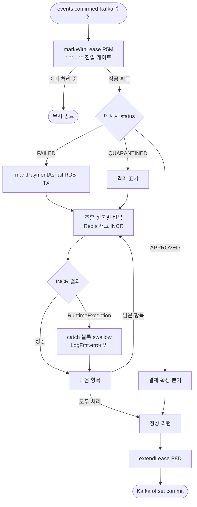
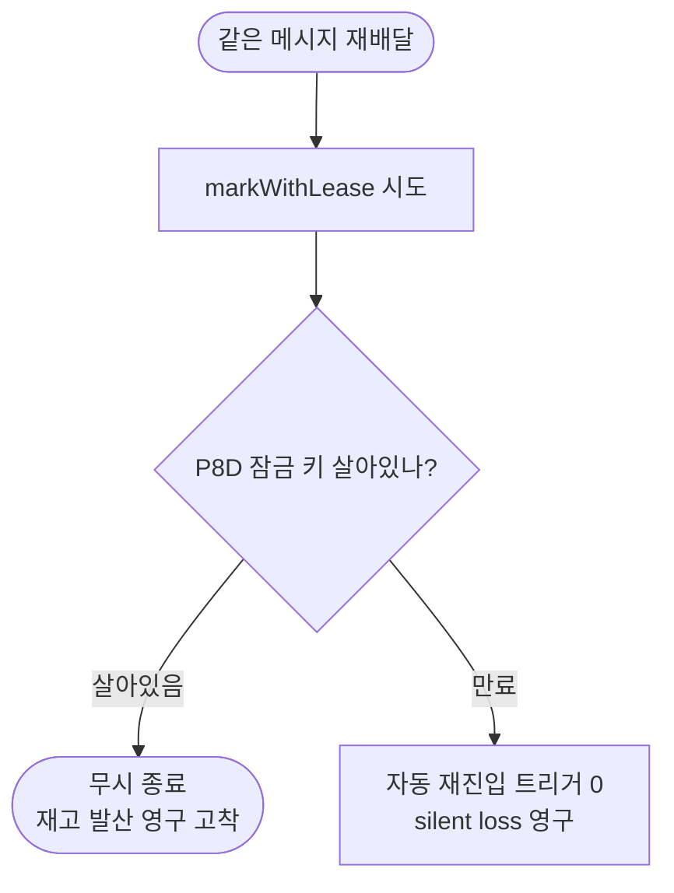
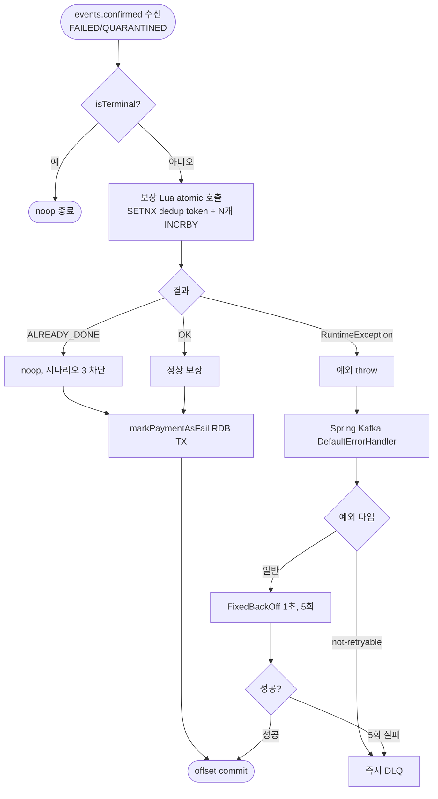
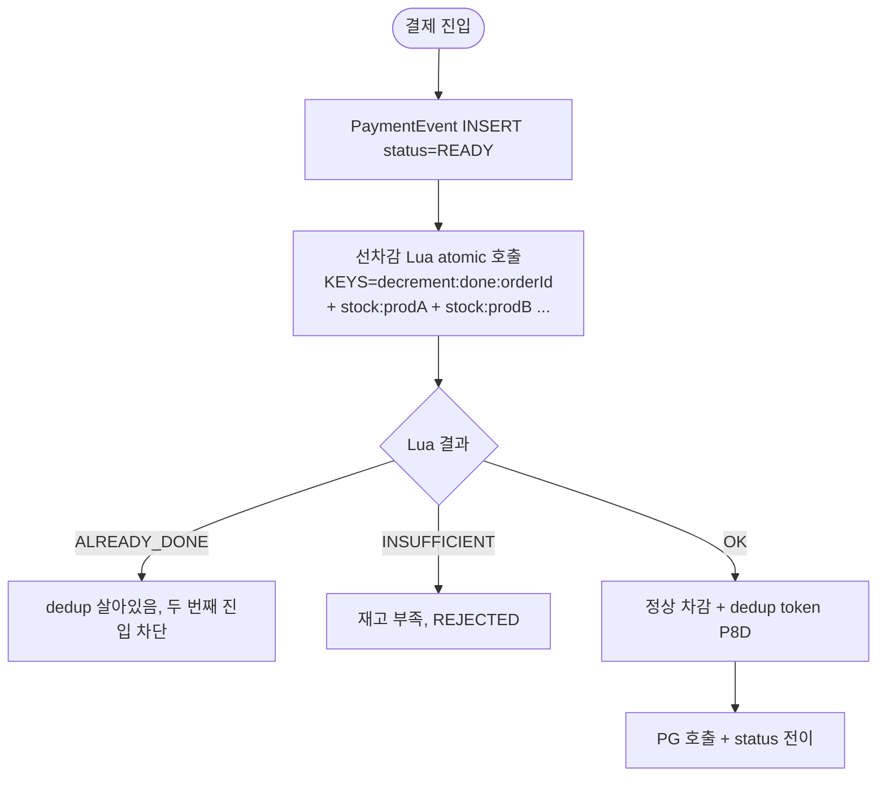
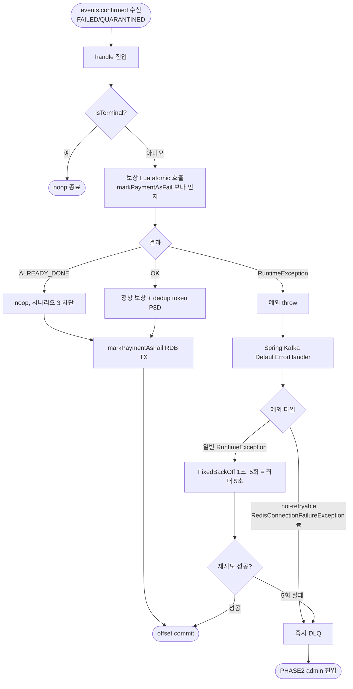

# STOCK-COMPENSATION-RECOVERY — 결제 결과 보상 실패 자동 회복 layer

> stage: discuss → plan
> 활성화 조건: `docs/STOCK-COMPENSATION-RECOVERY-PLAN.md` 생성 시 워크플로우 본격 진입
> 채택안 상세 결정 / 한계 / 이력 → `docs/topics/STOCK-COMPENSATION-RECOVERY-DECISION.md` (Round 7 채택)
> 후보 탐색 이력 → `docs/topics/STOCK-COMPENSATION-RECOVERY-ALTERNATIVES.md` (Round 1~6)

---

## 사전 브리핑

### 1. 현재 이해한 문제

결제가 FAILED 또는 QUARANTINED 로 결정되면 payment-service 는 결제 결과 메시지를 수신해 **선차감된 Redis 재고 캐시를 원복**해야 한다. 그런데 이 재고 원복 호출이 한 건이라도 실패하면 — 현재 `compensateStockCache` (PaymentConfirmResultUseCase.java:304-317) 의 catch 가 예외를 swallow 해서 **로그만 남기고 메시지를 정상 처리한 것으로 간주**한다. 결과적으로 동일 결제 결과는 **8일 dedupe 잠금** 에 갇혀 다시 들어와도 무시되고, 재고는 차감된 채로 영구 발산. 자동 재시도/회복 layer 가 비어 있어 운영자 수동 보정에만 의존하는 상태.

추가 발견 — 선차감 측도 약점 있음. `PaymentTransactionCoordinator.decrementStock` (line 43-51) 가 for loop 으로 단일 상품씩 차감 → **부분 차감 race 발생 가능** (3개 중 2개 차감 후 3번째 재고 부족 시 앞 2개는 차감된 채로 REJECTED 리턴).

### 2. 현재 시스템 동작 (as-is)

#### 2.1. 결제 결과 메시지 수신 → 보상 분기

#### 2.2. 보상 실패 후 재수신이 막히는 이유

#### 2.3. 정리

| 단계 | 현재 동작 | 문제 |
|---|---|---|
| 보상 호출 실패 | try/catch swallow, 로그만 | 외부에 노출 안 됨 |
| 메시지 처리 종료 | 정상 종료로 간주 | offset commit, 메시지 사라짐 |
| dedupe 잠금 | 8일로 연장 | 재수신해도 dedupe 로 막힘 |
| 자동 재시도 | 0 | 운영자 수동 개입 필요 |
| 선차감 부분 차감 race | for loop 중간 실패 시 앞 차감 살아있음 | 별 회복 layer 없음 |

---

## 요약 브리핑

### 결정된 접근 (Round 7 채택)

선차감 / 보상 둘 다 **결제 단위 N개 상품 atomic Lua + dedup token** 으로 묶고, 실패 시 예외 전파 → Kafka 자연 재배달 → 5회 후 DLQ. **dedupe lease (markWithLease/extendLease/remove) 는 폐기** — Lua dedup token 이 race 차단을 책임지고 정상 결제는 `PaymentEvent.status.isTerminal()` 가드가 책임. payment_history audit / 별 Aspect / 별 Reconciler / Flyway 전부 0.

핵심은 **"Kafka 재배달과 보상 회복을 분리하지 말고 같은 채널로 통합"** + **"Lua = 결제 단위 멀티-키 atomic 도구로 의미 확립"** 두 가지.

### 변경 후 동작 (to-be 압축본)

### 핵심 결정 ID 목록 (§4 풀이 참조)

- **D1**: 선차감 Lua 강화 — 단일 상품 → 결제 단위 N개 atomic + dedup token (`decrement:done:{orderId}` SETNX P8D)
- **D2**: 보상 Lua 신설 — 결제 단위 N개 atomic + dedup token (`compensation:done:{orderId}` SETNX P8D)
- **D3**: application 측 try/catch / wrapper 통째로 폐기 — `compensateStockCache` try/catch + `processMessageWithLeaseGuard` + `handleRemoveOnFailure` 다 제거. `handle` 메서드 1줄
- **D4**: dedupe lease 폐기 — `markWithLease` / `extendLease` / `remove` / `paymentConfirmDlqPublisher` 직접 호출 제거
- **D5**: `StockCachePort` 시그니처 변경 — `decrementAtomic(orderId, List<Order>)` / `compensateAtomic(orderId, List<Order>)`
- **D6**: `handleFailed` / `handleQuarantined` 호출 순서 뒤집기 — 보상 Lua 먼저, RDB 나중. silent loss race 차단
- **D7**: Spring Kafka `DefaultErrorHandler` + `DeadLetterPublishingRecoverer` 위임 — `FixedBackOff(1000L, 5)` (최대 5초) + Redis 연결 실패류 즉시 DLQ
- **D8**: Redis `appendfsync=always` 설정 강제 — Lua + AOF race window 거의 0

### 트레이드오프 / 후속

- **단일 노드 Redis 가정** — multi-key Lua 가 cluster 에서 same hash slot 요구. cluster 도입 시 별 토픽 (DECISION L1)
- **`appendfsync=always` throughput 감소** — race 안전성 trade-off 인정 (DECISION L2)
- **partition lag 1/3 트래픽 5초** — partition 3개 + retry 5초 + Kafka DefaultPartitioner hash mod 충돌. production 에서 `@RetryableTopic` 으로 격리 가능 (PHASE2)
- **DLQ admin 도구는 PHASE2** — DLQ 발행까지가 본 토픽 책임 (DECISION L4)
- **PaymentEvent SoT 의 P8D 만료 race** — Reconciler 가 status 를 다시 PENDING 으로 돌리는 race 시만 위험. 매우 드뭄, 알려진 한계 (DECISION L3)

---

## Non-goal

본 토픽은 **events.confirmed FAILED/QUARANTINED 보상 경로** 의 자동 회복만 책임진다.

| Non-goal | 사유 |
|---|---|
| Redis cluster 환경 지원 | multi-key Lua hash slot 요구. 단일 노드 가정. 별 토픽 |
| DLQ row 자동 회복 / admin 도구 | DLQ 발행까지만 본 토픽 책임. admin (조회/수동 재처리/강제 종결) 별 토픽 |
| RDB 다운 시 회복 | RDB outage 더 큰 사건, 본 layer 외 |
| 메시지 broker retention 초과 손실 | dedupe P8D + Kafka retention 7d 정렬은 별 layer |
| `OutboxAsyncConfirmService.compensateStock` (line 99-119) / `PaymentTransactionCoordinator.compensateStockCacheGuarded` (line 168-180) 회복 | 같은 silent loss 패턴이지만 진입 시점·도메인 의미 다름. PHASE2 별 토픽 |
| `@RetryableTopic` non-blocking retry | partition lag 0 인프라. production-grade 옵션, 본 토픽은 학습 가시성 우선 |

---

## §1. 결정 (Decisions)

본 라운드에서 확정한 결정 8건. 각 결정의 상세 근거는 DECISION 문서에 풀어 적는다.

| ID | 결정 한 줄 |
|---|---|
| **D1. 선차감 Lua 강화** | `stock_decrement.lua` (단일 상품 단위) → `stock_decrement_atomic.lua` (결제 단위 N개 상품). KEYS = `[decrement:done:{orderId}, stock:{prod1}, stock:{prod2}, ...]`. Lua 안에서 SETNX dedup token + 전 상품 재고 GET 검증 + atomic DECRBY. 부족 시 dedup token DEL + INSUFFICIENT 반환. **선차감 부분 차감 race 도 같이 해소** |
| **D2. 보상 Lua 신설** | `stock_compensation_atomic.lua` 신규. KEYS = `[compensation:done:{orderId}, stock:{prod1}, stock:{prod2}, ...]`. Lua 안에서 SETNX dedup token + atomic INCRBY. dedup token TTL = P8D |
| **D3. application try/catch + wrapper 폐기** | `compensateStockCache` 의 for loop + try/catch 제거 → Lua 1회 호출. `processMessageWithLeaseGuard` (line 136-144) wrapper + `handleRemoveOnFailure` (line 150-159) 통째로 제거. `handle` 메서드는 `processMessage(message)` 1줄 |
| **D4. dedupe lease 폐기** | `markWithLease(P5M)` / `extendLease(P8D)` / `remove` 모두 폐기. `EventDedupeStore` port + `EventDedupeStoreRedisAdapter` + `paymentConfirmDlqPublisher` 직접 호출 폐기. race 차단 책임 = Lua dedup token (보상 측) + `PaymentEvent.status.isTerminal()` (정상 결제 측) |
| **D5. StockCachePort 시그니처 변경** | `decrement(productId, qty)` / `increment(productId, qty)` / `rollback(productId, qty)` → `decrementAtomic(orderId, List<PaymentOrder>)` / `compensateAtomic(orderId, List<PaymentOrder>)`. 호출부 (Coordinator + ConfirmResultUseCase) + 단위 테스트 + 통합 테스트 + Lua 스크립트 5 layer 회귀 |
| **D6. 호출 순서 뒤집기** | `handleFailed` / `handleQuarantined` 안에서 **보상 Lua 먼저, `markPaymentAsFail` 나중**. silent loss race 방지 — 현재 순서 (RDB → 보상) 면 RDB commit 직후 / 보상 직전 crash 시 재배달 → `isTerminal=true` → noop 종결 → 보상 누락 |
| **D7. Spring Kafka error handler 위임** | application 코드 throw 만. `DefaultErrorHandler` + `DeadLetterPublishingRecoverer` + `FixedBackOff(1000L, 5)` (1초 간격, 5회 = 최대 5초). `addNotRetryableExceptions` 으로 `RedisConnectionFailureException` / `QueryTimeoutException` 즉시 DLQ. retry / DLQ 정책 한 bean 안에 응축 |
| **D8. Redis AOF 설정** | `appendfsync=always` 강제 — Lua 안 SETNX 와 INCRBY/DECRBY 의 부분 fsync race 거의 0. `everysec` (기본값) 시 최대 1초 race window. throughput 감소 trade-off 인정 |

---

## §2. as-is / to-be 비교

### §2.1. to-be 선차감 플로우 (강화)

핵심 차이: 단일 상품 단위 for loop → 결제 단위 atomic. 부분 차감 race 자체가 사라짐.

### §2.2. to-be 보상 플로우 + Kafka 재배달 회복

---

## §3. 컴포넌트 / 책임 분담

### §3.1. 신설

| 컴포넌트 | 역할 | 위치 |
|---|---|---|
| `stock_decrement_atomic.lua` | 결제 단위 N개 상품 atomic DECRBY + dedup token | `payment-service/src/main/resources/lua/` |
| `stock_compensation_atomic.lua` | 결제 단위 N개 상품 atomic INCRBY + dedup token | `payment-service/src/main/resources/lua/` |
| `KafkaErrorHandlerConfig` | `DefaultErrorHandler` + `DeadLetterPublishingRecoverer` + `FixedBackOff` bean | `payment-service/.../infrastructure/config/` |

### §3.2. 변경 (시그니처)

| 컴포넌트 | 변경 |
|---|---|
| `StockCachePort` | `decrement` / `increment` / `rollback` → `decrementAtomic(orderId, List<Order>)` / `compensateAtomic(orderId, List<Order>)` |
| `StockCacheRedisAdapter` | 새 시그니처 구현 + 새 Lua 스크립트 로딩 |
| `PaymentTransactionCoordinator.decrementStock` | for loop 제거 → port 1회 호출 |
| `PaymentConfirmResultUseCase.compensateStockCache` | for loop + try/catch 제거 → port 1회 호출 |
| `PaymentConfirmResultUseCase.handleFailed` / `handleQuarantined` | 호출 순서 뒤집기 (보상 → RDB) |
| `PaymentConfirmResultUseCase.handle` | wrapper 제거 → 1줄 (`processMessage(message)`) |

### §3.3. 폐기

| 컴포넌트 | 사유 |
|---|---|
| `EventDedupeStore` port + `EventDedupeStoreRedisAdapter` | dedupe lease 폐기, Lua dedup token + isTerminal 가드가 책임 흡수 |
| `PaymentConfirmDlqPublisher` 직접 호출 | Spring Kafka `DeadLetterPublishingRecoverer` 가 책임. bean 자체는 PHASE2 admin 도구가 재사용 가능 |
| `processMessageWithLeaseGuard` / `handleRemoveOnFailure` | wrapper 통째로 폐기 |

### §3.4. 설정 (신규 키)

| 키 | 값 | 위치 |
|---|---|---|
| Redis `appendfsync` | `always` | `docker/docker-compose.infra.yml` (Redis 컨테이너 cmd) |
| `payment.kafka.error-handler.backoff.interval` | `1000` (ms) | `application.yml` |
| `payment.kafka.error-handler.backoff.max-attempts` | `5` | `application.yml` |

---

## §4. 알려진 한계

DECISION 문서 §알려진 한계 섹션 참조 — L1 cluster / L2 AOF race / L3 P8D 만료 race / L4 DLQ admin.

요약:
- **L1 (Redis cluster multi-key Lua 불가)** — 단일 노드 가정. cluster 도입 시 별 토픽
- **L2 (AOF 부분 fsync race)** — `appendfsync=always` 로 race window 거의 0
- **L3 (P8D 만료 후 재진입 race)** — PaymentEvent SoT 가 자연 차단. Reconciler 가 status 돌릴 때만 위험
- **L4 (DLQ admin)** — 본 토픽은 DLQ 발행까지. admin 도구 PHASE2

---

## §5. 작업 분해 힌트 (plan 단계 입력)

태스크 구성 후보 (PLAN 단계에서 정밀화):

1. **Lua 스크립트 2개 작성** (TDD 단위 테스트)
   - `stock_decrement_atomic.lua` — SETNX + 전 상품 GET 검증 + DECRBY + 실패 rollback
   - `stock_compensation_atomic.lua` — SETNX + 전 상품 INCRBY
2. **`StockCachePort` 시그니처 변경** + `StockCacheRedisAdapter` 구현
3. **호출부 변경** — `PaymentTransactionCoordinator.decrementStock` (for loop 제거) + `PaymentConfirmResultUseCase.compensateStockCache` (try/catch 제거 + Lua 호출)
4. **호출 순서 뒤집기** — `handleFailed` / `handleQuarantined` 안 보상 → RDB
5. **wrapper / dedupe lease 폐기** — `processMessageWithLeaseGuard` / `handleRemoveOnFailure` / `EventDedupeStore` port + adapter / `paymentConfirmDlqPublisher` 직접 호출 제거
6. **`KafkaErrorHandlerConfig` bean 신설** — `DefaultErrorHandler` + `DeadLetterPublishingRecoverer` + `FixedBackOff(1000L, 5)` + `addNotRetryableExceptions`
7. **Redis AOF 설정** — docker-compose 의 Redis 컨테이너 cmd 에 `--appendfsync always` 추가
8. **통합 테스트** — Testcontainers MySQL + Redis + Kafka. 시나리오:
   - 정상 보상 (Lua OK → markPaymentAsFail → offset commit)
   - 보상 Lua 실패 (Redis 일시 다운) → 1초 5회 retry → 회복
   - Redis 영구 다운 → not-retryable 즉시 DLQ
   - mid-Lua crash 시뮬레이션 → 재배달 시 ALREADY_DONE
   - rebalance race 시뮬레이션 → Lua dedup token SETNX atomic 차단
   - 호출 순서 검증 (보상 먼저, RDB 나중)
9. **회귀 테스트** — 기존 결제 플로우 (정상 APPROVED / FAILED / QUARANTINED) 그린 확인

---

## §6. PHASE2 (별 토픽 후속)

- `OutboxAsyncConfirmService.compensateStock` (line 99-119) 회복 — 같은 Lua atomic 모델 재사용 가능
- `PaymentTransactionCoordinator.compensateStockCacheGuarded` (line 168-180) 회복 — 동일
- DLQ admin 도구 — DLQ 토픽 조회 / 수동 재처리 / 강제 종결
- Redis cluster 도입 시 multi-key Lua 대안 — hash tag 글로벌 묶음 또는 항목 단위 RDB outbox 회복
- `@RetryableTopic` non-blocking retry — production 에서 partition lag 0 보장 시
