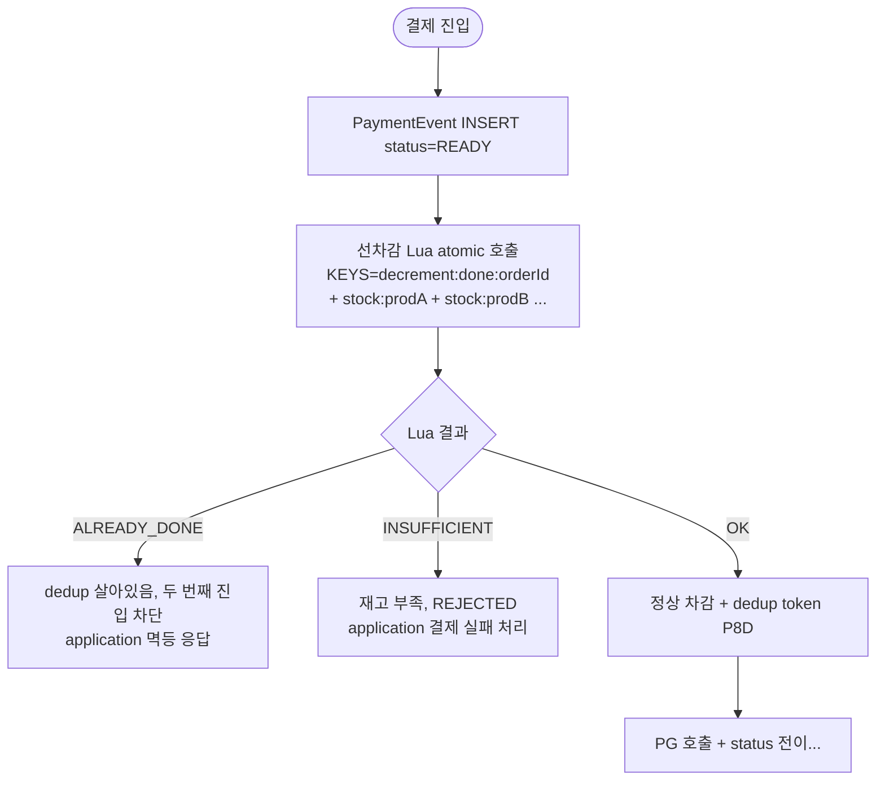
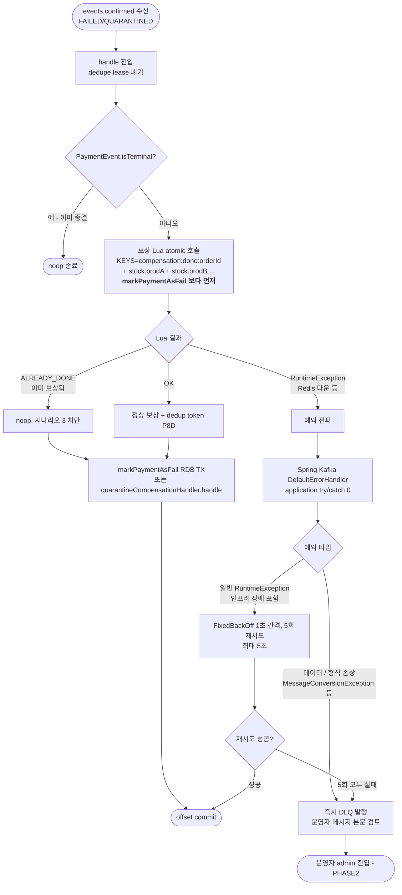
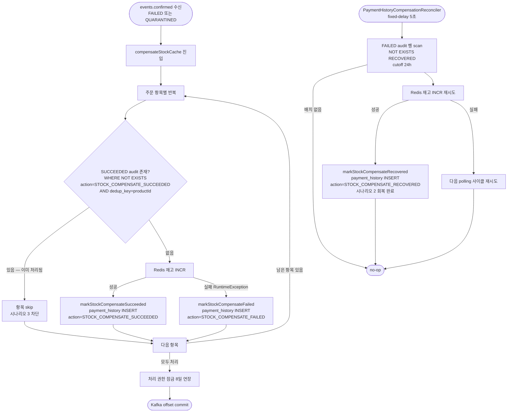

# STOCK-COMPENSATION-RECOVERY — 채택 결정

> stage: discuss → plan
> 최종 결정일: 2026-05-07 (Round 7 — 사용자 직관 기반 재탐색)
> 6라운드 탐색·검증 + Round 7 의 최종 결정. **Round 6 까지의 채택안 (Candidate D enhanced) 은 Round 7 에서 폐기**.

---

## 최종 채택 결정 (Round 7) — Lua atomic + Kafka native + dedupe lease 폐기

### 한 줄 요약

선차감 / 보상 둘 다 **결제 단위 N개 상품 atomic Lua + dedup token** 으로 묶고, 실패 시 예외 전파 → Kafka 자연 재배달 → 5회 후 DLQ. dedupe lease (markWithLease/extendLease) 는 Lua dedup token 이 책임을 흡수해 폐기. payment_history audit / 별 Aspect / 별 Reconciler 전부 0.

### 핵심 변경

1. **선차감 Lua 강화** (`stock_decrement.lua` → `stock_decrement_atomic.lua`)
   - 현재: 단일 상품 단위 Lua, for loop 호출 → 부분 차감 race 발생
   - 변경: 결제 단위 N개 상품 atomic — `KEYS = [decrement:done:{orderId}, stock:{prod1}, ...]`
   - SETNX dedup token + 전 상품 재고 검증 + atomic DECRBY
   - **선차감 부분 차감 race 도 같이 해소** (보너스)

2. **보상 Lua 신설** (`stock_compensation_atomic.lua`)
   - 결제 단위 N개 상품 atomic — `KEYS = [compensation:done:{orderId}, stock:{prod1}, ...]`
   - SETNX dedup token + atomic INCRBY

3. **application 측 try/catch / wrapper 통째로 제거** — `compensateStockCache` try/catch + `processMessageWithLeaseGuard` wrapper + `handleRemoveOnFailure` 모두 폐기
   - `handle` 메서드는 1줄: `processMessage(message)` — 예외는 그냥 throw
   - dedupe lease 가 폐기되므로 catch 의 두 책임 (재배달 활성화 / silent loss 방지) 자체가 redundant
   - retry / DLQ 정책은 Spring Kafka 인프라가 책임 (다음 항목)

4. **dedupe lease 폐기** — `markWithLease(P5M)` / `extendLease(P8D)` / `remove` / `paymentConfirmDlqPublisher` 직접 호출 폐기
   - rebalance race → Lua dedup token SETNX
   - 시간차 재처리 → Lua dedup token P8D
   - 정상 결제 race → 기존 `PaymentEvent.status.isTerminal()` 가드

5. **`StockCachePort` 시그니처 변경** — `decrement(productId, qty)` / `increment(productId, qty)` → `decrementAtomic(orderId, List<Order>)` / `compensateAtomic(orderId, List<Order>)`

6. **`handleFailed` / `handleQuarantined` 호출 순서 뒤집기** — 보상 Lua 먼저, `markPaymentAsFail` 나중

   **이유 — silent loss 방지** (실패 모드 audit 결과):
   - 현재 순서 (`markPaymentAsFail` → 보상): RDB commit 직후 / 보상 Lua 호출 전 crash 시 재배달 → `isTerminal=true` (status=FAILED) → noop 종결 → 보상 누락 silent loss
   - 새 순서 (보상 → `markPaymentAsFail`): 모든 crash 지점에서 재배달 시 정합 보장

   | crash 지점 | 재배달 거동 |
   |---|---|
   | 보상 Lua 호출 직전 | `isTerminal=false` → 정상 처리 |
   | 보상 Lua 직후 / RDB 전 | `isTerminal=false` → 보상 `ALREADY_DONE` + `markPaymentAsFail` 진행 |
   | RDB commit 직후 / offset commit 전 | `isTerminal=true` → noop → offset commit. 보상 OK + RDB OK 정합 |

   `handleQuarantined` 도 같은 순서로 통일 (보상 → `markPaymentAsQuarantined` / `quarantineCompensationHandler.handle`).

7. **Spring Kafka `DefaultErrorHandler` + `DeadLetterPublishingRecoverer` 위임** — retry / DLQ 정책이 application 코드 밖

   **bean 설정**:
   ```java
   @Bean
   public DefaultErrorHandler errorHandler(KafkaTemplate<String, String> kafkaTemplate) {
       DeadLetterPublishingRecoverer recoverer = new DeadLetterPublishingRecoverer(kafkaTemplate);
       FixedBackOff backoff = new FixedBackOff(1000L, 5);  // 1초 간격, 5회 재시도 = 최대 5초
       DefaultErrorHandler handler = new DefaultErrorHandler(recoverer, backoff);

       // 즉시 DLQ — retry 해도 같은 결과인 "데이터 / 형식 손상" 류
       handler.addNotRetryableExceptions(
           org.springframework.kafka.support.converter.MessageConversionException.class,
           IllegalArgumentException.class,
           IllegalStateException.class
       );
       return handler;
   }
   ```

   **분기 거동 — 두 DLQ 신호 의미 분리**:
   - **일반 RuntimeException** (Redis 연결 실패 / RDB timeout 등 인프라 장애 포함) → 1초 간격 5번 재시도 (최대 5초) → 회복 또는 한도 초과 시 자동 DLQ → "운영자가 인프라 검토"
   - **데이터 / 형식 손상 예외** (`MessageConversionException` / `IllegalArgumentException` / `IllegalStateException` 등) → 즉시 DLQ → "운영자가 메시지 본문 검토"
   - 두 DLQ 신호는 헤더 `kafka_dlt-exception-class` 로 자동 분기 가능
   - `RedisConnectionFailureException` / `QueryTimeoutException` 은 not-retryable 목록에서 **빠진다** — 일시 / 영구 구분 불가능하므로 retry 5회 안에서 자연 회복 또는 DLQ

   **이유 — 일시 / 영구 구분 불가능 정직 인정**:
   - `RedisConnectionFailureException` 은 1초 떨림 / 영구 다운 / DNS 실패 / pool 고갈 모두 wrap. 예외 클래스만으로는 구분 불가능
   - 즉시 DLQ 보내면 1초 떨림에 회복 기회 박탈
   - retry 5회 (최대 5초) 두면 일시 떨림 자연 회복 + 영구 다운 5초 후 DLQ — 두 케이스 모두 자연 처리
   - Lua 멱등 토큰이 retry 안전 보장 — over-restore 위험 0

   **partition lag 정직 인정**:
   - `events.confirmed` partition key = `orderId` (`PgFinalConfirmationGate.java:162` 등)
   - Kafka DefaultPartitioner 동작 — `murmur2(key) % numPartitions`. **다른 orderId 도 hash mod 결과 같으면 같은 partition 충돌**
   - 본 프로젝트 partition 수 = 3 (`KafkaTopicConfig.java:23`) → **약 1/3 의 다른 결제가 retry 중 partition 의 lag 받음**
   - retry 시간 5초 (1초 × 5회) 라 lag 영향 학습 가시성 안에서 수용 가능
   - production-grade 에서 진짜 lag 0 이 필요하면 `@RetryableTopic` (non-blocking retry) 으로 별 토픽 분리 — 본 토픽 범위 외, PHASE2

   **not-retryable 예외 목록 확정** — 위 3개 (`MessageConversionException` / `IllegalArgumentException` / `IllegalStateException`) 는 출발점. plan 단계에서 정밀화. 도메인 커스텀 예외 (예: `PaymentInvariantViolationException`) 추가 가능.

### 시나리오 커버

| 시나리오 | 차단 layer |
|---|---|
| 1. 메시지 수신 실패 | Kafka 인프라 (자연 재배달) |
| 2. 처리 실패 + 커밋 (현 silent loss) | 예외 전파 → offset 미커밋 → 재배달 |
| 3. 커밋 직전 죽음 (mid-Lua crash) | dedup token P8D → ALREADY_DONE |
| 3b. TX rollback + Reconciler resetToReady | dedup token 이 **orderId 단위** 라 새 eventUuid 와 무관하게 차단 |
| Kafka rebalance window race | Lua atomic SETNX (한쪽만 OK, 다른쪽 ALREADY_DONE) |
| Redis 일시 장애 | 예외 전파 → 1초 간격 5회 재시도 → 회복 또는 5초 후 DLQ |
| 메시지 / 데이터 형식 손상 | 즉시 DLQ — 운영자가 메시지 본문 검토 |

### 알려진 한계 (명시 인정)

#### L1. Redis cluster 환경에서 multi-key Lua 사용 불가

Lua 한 번 호출 안에서 여러 키를 다루려면 **same hash slot** 이어야 하는데, 글로벌 상품 키 (`stock:{productId}`) 들은 결제 단위로 hash tag 묶을 수 없음 (다른 결제도 같은 상품 키 공유). 본 채택은 **단일 노드 Redis 가정** 위에서 성립.

cluster 도입 시 해결 방향 (PHASE2 또는 별 토픽):
- (i) hash tag 글로벌 묶음 (`{global}stock:{productId}`) — 모든 상품을 한 노드에 강제. cluster 효율 깎임
- (ii) Lua 사용 포기 + 항목 단위 RDB outbox 회복 (Candidate B/D 변형)
- (iii) Redis cluster 미운용 결정 유지

본 토픽은 (iii) 가정. 운영 환경 변경 시 별 토픽으로 재검토.

#### L2. Redis crash + AOF 부분 fsync race window

Lua 안 SETNX + DECRBY/INCRBY 가 atomic 이지만, **Redis 가 Lua 실행 도중 crash + AOF appendfsync 가 부분 fsync 만 한 경우** SETNX 만 디스크 박히고 차감/보상 안 박히는 race 가능. 재시도 시 `ALREADY_DONE` 으로 누락.

**완화 — `appendfsync=always` 설정 강제**. 매 명령 fsync 라 race window 거의 0 (디스크 latency 만큼만). 단 throughput 감소 trade-off 인정.

`appendfsync=everysec` (기본값) 시 최대 1초 race window — 본 토픽은 `always` 강제.

#### L3. Lua dedup token TTL (P8D) 만료 후 재진입 race

P8D 후 같은 orderId 로 새 메시지 도착 시 dedup token 만료라 새 SETNX 박힘 → 보상/차감 두 번 가능. 단 `PaymentEvent.status` 가 SoT 라 `isTerminal=true` 자연 차단.

**잔여 위험**: PaymentEvent 가 FAILED 박힌 후 P8D 만료 + Reconciler 가 status 를 다시 PENDING/IN_PROGRESS 로 돌려놓는 race 시만 위험. 매우 드뭄, 알려진 한계 인정.

#### L4. DLQ 메시지의 admin 처리 책임 — PHASE2

Lua 실패 5회 후 DLQ 진입한 메시지는 자동 회복 0. **운영자 admin 도구 별 토픽** 책임. 본 토픽은 DLQ 발행까지만 책임지고 admin 도구 (DLQ 조회 / 수동 재처리 / 강제 종결) 는 PHASE2.

기존 `paymentConfirmDlqPublisher` 인프라 재사용 — DLQ 토픽 자체는 이미 존재.

#### L5. 결제 항목 수 N 부하

Lua 명령 수는 항목 수 N 에 비례 (보상 `N+2`, 선차감 `2N+2`). 단순 KV 명령만 쓰므로 정렬 / 순회 / 비교 같은 무거운 연산은 없음.

**일반 결제 (N ≤ 10) 까지는 안전** — Lua 실행 시간이 일반 네트워크 latency 안에 들어가 다른 클라이언트 영향 거의 없음.

**N 이 그 이상으로 커지는 경우 — 추가 개선 / 점검 필요**:
- application 단에서 항목 수 상한 검증 (비즈니스 상한 넘으면 Lua 진입 전 reject)
- 대량 주문 시나리오가 비즈니스 상 있다면 Lua 분할 / 비동기 분기 등 별 토픽 후속 결정
- Redis 는 Lua 실행 중 다른 명령을 블록하므로 N 이 커지면 다른 클라이언트 latency 도 같이 증가

### 폐기되는 컴포넌트 (Round 6 채택안 대비)

- payment_history `action` / `dedup_key` 컬럼 추가 (Flyway 1)
- payment_event `compensation_state_version` 컬럼 추가 (Flyway 1)
- `StockCompensationLoggingAspect` + `@PublishStockCompensationEvent` 어노테이션
- `PaymentHistoryCompensationReconciler` (5초 polling)
- `markStockCompensate{Failed,Recovered,Succeeded}` wrapper 3 메서드
- `compensateStockCache` 의 NOT EXISTS 가드

### 신설 컴포넌트

- `payment-service/src/main/resources/lua/stock_decrement_atomic.lua` (기존 stock_decrement.lua 대체)
- `payment-service/src/main/resources/lua/stock_compensation_atomic.lua` (신규)
- `StockCachePort.decrementAtomic` / `compensateAtomic` port 시그니처 변경

### 받아들이는 trade-off

- **(b) 신호 재해석** — 처음 거부 사유 "Lua 두 번째 사용처 = 도구 정책 흐림" 을 **"Lua = 결제 단위 멀티-키 atomic 도구 — 양쪽 사용처가 같은 패턴"** 으로 재정의. 도구 정책이 흐려지는 게 아니라 확립
- **port 시그니처 변경** — 5 layer 회귀 surface (Coordinator / ConfirmResultUseCase / 단위 테스트 / 통합 테스트 / Lua 스크립트). 단 Round 6 채택안의 작업량 (Flyway 2 + Aspect + Reconciler + wrapper 3) 보다 명확히 적음
- **호출 순서 변경 (보상 → RDB)** — `handleFailed` / `handleQuarantined` 의 도메인 의미는 보존되지만 호출 순서가 바뀜. 단위 / 통합 테스트 정합 맞추기 필요
- **알려진 한계 4건** (L1 Redis cluster / L2 AOF race / L3 P8D 만료 race / L4 DLQ admin) — §알려진 한계 섹션에 명시
- **DLQ 발행까지가 본 토픽 책임 끝** — admin 도구 (DLQ 조회 / 수동 재처리) 는 PHASE2 별 토픽

---

## 통합 to-be 플로우차트 (Round 7 채택안)

### 선차감 플로우 (강화)



### 보상 플로우 + Kafka 재배달 회복



---

## Round 7 결정 근거

### 사용자 직관 1 — "Kafka 활용 부족, 불필요하게 복잡"

Round 6 채택안 (audit-driven enhanced) 의 복잡도 주범은 시나리오 3 enhancement (SUCCEEDED audit + NOT EXISTS 가드). 5중 layer 가 사용자 신호 4개 회피의 자연 귀결이지만 mental model 분기 큼.

### 사용자 직관 2 — "Kafka 가 동시 처리 race 막아주니 첫 lease 불필요"

Kafka partition 보장: 같은 consumer group 안에서 같은 partition 은 한 consumer 만. 동시 처리 race 0. 단 시간차 재처리 (재배달, rebalance window) 는 살아있음.

→ markWithLease 의 동시 race 차단 책임은 Kafka 가 이미 담당. 시간차 재처리는 Lua dedup token 이 차단. **markWithLease redundant**.

### 사용자 직관 3 — "Lua 에 재고 차감 + 멱등키 같이 묶기"

(b) 신호 재해석 — Lua 가 "결제 단위 멀티-키 atomic 도구" 로 의미 정합. 양쪽 사용처가 같은 패턴 (SETNX dedup token + 전 키 atomic 처리). 도구 정책 확립.

### 핵심 fact (코드 확인)

- 현재 선차감 Lua = 단일 상품 단위 → for loop 호출 → 부분 차감 race 알려진 함정
- 현재 dedupe `processMessageWithLeaseGuard` (PaymentConfirmResultUseCase.java:136-144) → 이미 예외 시 remove + DLQ 발행 인프라 살아있음. `compensateStockCache` 의 swallow 가 작동을 막고 있을 뿐
- 현재 `PaymentEvent.status.isTerminal()` 가드 (line 259, 282) → 정상 결제 race 자연 차단

→ Round 7 채택안의 변경 = **Lua 2개 + try/catch 제거 + dedupe lease 폐기**. 인프라 신설 최소.

---

## 다음 단계

1. **PLAN.md 작성** — Round 7 채택안 기준 태스크 분해 (workflow-plan 스킬)
2. **`docs/topics/STOCK-COMPENSATION-RECOVERY.md` 갱신** — Round 7 채택안에 맞춰 §1 결정 / §2 to-be 플로우 / §3 컴포넌트 재작성 (현재는 baseline 0 기준)
3. **검증 (plan 단계)**:
   - 단일 노드 Redis 가정 명시 (application.yml / docker-compose 확인)
   - `PaymentEvent.status.isTerminal()` 가드의 race window 정밀 점검 (TX commit 직전 race)
   - port 시그니처 변경의 5 layer 회귀 surface 정량
   - Lua 스크립트 단위·통합 테스트 plan

---

## 이전 채택 (Round 6 시점, Round 7 에서 폐기) — Candidate D (enhanced)

> 이하 내용은 Round 6 종결 시점의 채택 결정 이력이다. Round 7 에서 폐기됨 — 위 §최종 채택 결정 참조.

## 채택 결정 — Candidate D (enhanced)

**선택**: payment_history audit-driven + happy path SUCCEEDED action

### 한 줄 요약

`payment_history` 의 audit row 를 **회복 SoT** 로 두고, 보상 실패뿐 아니라 **보상 성공도 audit row 로 기록**한다. 다음 진입 시 항목별 SUCCEEDED audit 존재 여부로 INCR 이중 호출을 막는다. 별 Aspect + 별 Reconciler 로 기존 audit AOP 침투 0.

### 왜 D 인가 — 다른 후보와의 비교

| 후보 | 시나리오 1/2/3 모두 커버? | 사용자 신호 위반 | 결정 |
|---|---|---|---|
| Baseline 0 | ✓ (Lua 토큰 happy path 확장 시) | (a)(b)(c)(d) 4 모두 — 사용자 명시 거부 | **DELETE** |
| Candidate A | ✓ (PaymentOrder.compensated_at 도입 시) | (d) 가속 + 본 토픽 §0 Non-goal 위반 | **DEMOTE** |
| Candidate B | ✓ (SETNX happy path 확장 시) | happy path 영향 0 가드 정면 충돌 가속 | **DEMOTE** |
| **Candidate D** | ✓ (SUCCEEDED audit happy path 추가) | (d) 부분 — audit 의미 확장이 본질과 정합 | **PASS** |

D 만이 (i) 시나리오 3 까지 커버하면서 (ii) 사용자 신호를 본질적으로 위반하지 않고 (iii) 본 토픽 non-goal 을 침범 안 함.

### 시나리오별 보호 layer

| 시나리오 | 막는 mechanism |
|---|---|
| **1. 수신 실패** | Kafka 인프라 (broker retention 7d + consumer 재시작 시 자연 재배달). 후보 차이 없음 |
| **2. 처리 실패 + 커밋** | `compensateStockCache` catch 분기에서 `markStockCompensateFailed` wrapper → audit row INSERT (action='STOCK_COMPENSATE_FAILED'). Reconciler 5초 polling 으로 NOT EXISTS scan → INCR 재시도 → `markStockCompensateRecovered` audit |
| **3. 처리 후 커밋 직전 죽음** | happy path INCR 성공 직후 `markStockCompensateSucceeded` wrapper → audit row INSERT (action='STOCK_COMPENSATE_SUCCEEDED'). 재진입 시 `compensateStockCache` 가 `WHERE NOT EXISTS (... action='STOCK_COMPENSATE_SUCCEEDED' AND dedup_key=productId)` 가드로 항목 skip → INCR 이중 호출 차단 |

### 통합 to-be 플로우차트

happy path 가드 + 보상 audit + Reconciler 회복 사이클을 한 그림으로. 시나리오 2 는 catch 분기 → FAILED audit → Reconciler 가 회복, 시나리오 3 은 SUCCEEDED audit + 재진입 시 NOT EXISTS 가드로 항목 skip.



별 Aspect (`StockCompensationLoggingAspect`) 가 wrapper 3 메서드 호출을 가로채 audit row 를 INSERT — 기존 `DomainEventLoggingAspect` 변경 0. PaymentEvent.compensation_state_version 으로 두 워커 동시 픽업 차단 (over-restore 방지).

### 핵심 변경 6개 (구현 범위)

1. **Flyway 2건** — payment_history 에 `action` / `dedup_key` 컬럼 추가 + payment_event 에 `compensation_state_version` 컬럼 추가
2. **payment_history.action 화이트리스트 4종** — STATUS_CHANGE / STOCK_COMPENSATE_FAILED / STOCK_COMPENSATE_RECOVERED / STOCK_COMPENSATE_SUCCEEDED
3. **별 Aspect** — `StockCompensationLoggingAspect` + `@PublishStockCompensationEvent` 어노테이션. 기존 `DomainEventLoggingAspect` 변경 0
4. **별 Reconciler** — `PaymentHistoryCompensationReconciler` fixed-delay 5초. NOT EXISTS 서브쿼리 + cutoff 24h
5. **PaymentCommandUseCase wrapper 3 메서드** — `markStockCompensateFailed` / `markStockCompensateRecovered` / `markStockCompensateSucceeded`. application 빈 메서드라 Spring AOP 가로채기 작동 OK
6. **compensateStockCache 항목 단위 가드** — INCR 호출 전 `WHERE NOT EXISTS (SUCCEEDED audit)` 체크 → 이미 처리된 항목 skip

### 받아들이는 trade-off

- **happy path latency +N×ms** — FAILED/QUARANTINED 정상 보상 경로만. 정상 APPROVED 경로 영향 **0**
- **payment_history 행 증가** — action 4종 × 보상 발생 결제. partitioning / retention 운영 정책은 PLAN 단계
- **action 화이트리스트 운영 가이드 책임** — DB CHECK 또는 application enum 강제, PLAN 단계 결정
- **SUCCEEDED audit INSERT 직전 crash race window** — INCR 후 audit 직전 crash 시 다음 시도에 INCR 두 번. 이는 Reconciler 가 NOT EXISTS 로 회복 가능한 잔여 race (Kafka 인프라 race window 와 같은 등급)

### PHASE2 (별 토픽) 로 미루는 것

- `OutboxAsyncConfirmService.compensateStock` (line 99-119) 의 동일 silent loss 패턴 회복
- `PaymentTransactionCoordinator.compensateStockCacheGuarded` (line 168-180) 의 동일 패턴 회복
- 다중 Reconciler 인스턴스 운용 (본 토픽은 단일 인스턴스 가정)
- admin 도구 (FAILED audit 조회 / 수동 reset / 강제 종결)
- 메시지 broker 자체 retention 초과 손실 회복 (PITFALLS 별 layer)

PHASE2 토픽이 같은 audit-driven 모델 재사용 가능 — mental model 분기 0.

---

## 5라운드 + Round 6 요약 (이력)

> 5라운드 탐색·검증 (Round 1 Architect → Round 2 Critic+Domain → Round 3 Architect refine → Round 4 Critic+Domain deep → Round 5 Architect synthesis) + Round 6 (Architect 시나리오 audit) 의 최종 비교 산출물.

---

## 배경 및 문제 (요약)

`payment-service` 의 `events.confirmed` consumer 는 PG 결과가 FAILED / QUARANTINED 일 때 Redis 선차감 캐시를 INCR 로 보상해야 하는데, `compensateStockCache` (`PaymentConfirmResultUseCase.java:304-317`) 의 catch 가 INCR 실패를 LogFmt.error 만 하고 swallow 한다. 결과적으로 dedupe lease 가 P8D 로 연장돼 같은 메시지 재배달도 막힌다 — silent loss. 같은 swallow 패턴이 두 곳 더 있다 (`OutboxAsyncConfirmService.compensateStock:99-119`, `PaymentTransactionCoordinator.compensateStockCacheGuarded:168-180`). 본 토픽은 events.confirmed catch 1개 경로의 자동 회복 layer 도입을 결정한다 — 다른 두 경로는 PHASE2 토픽에서 결정.

원래 결정안 (Candidate 0) 은 신규 `stock_compensation_outbox` 테이블 + Lua 처리 토큰 + 5초 워커 모델이었으나, 사용자가 **4가지 이질 신호** 를 들어 거부:

| # | 신호 | 의미 |
|---|---|---|
| (a) | 신규 테이블이 작업 큐 의미 — outbox 패밀리 정의 위반 | `payment_outbox` / `stock_outbox` / `pg_outbox` 는 Kafka 발행 큐. 신규 보상 outbox 는 Redis 작업 큐 |
| (b) | Lua 두 번째 사용처 — 도구 정책 흐림 | 현재 Lua 1건 (선차감 원자성). 보상이 두 번째 사용처가 되면 도구 사용 정책 모호 |
| (c) | 신규 port API 시그니처가 기존과 결 다름 | `StockCachePort.(productId, quantity)` 통일 시그니처 vs `incrementWithToken(...)` 토큰 노출 |
| (d) | PaymentEvent 라이프사이클 외부 회복 | Reconciler / dedupe / PaymentEvent state machine 3트랙 분기 |

5라운드 탐색은 **이 4 신호를 회피하는 대안** 을 찾는 작업이었다.

---

## 5라운드 요약

| 라운드 | 산출 | 결과 |
|---|---|---|
| 1 (Architect) | 6 후보 sketch (A/B/C/D/E/F + baseline 0) | A: PaymentEvent state machine 안 회복 / B: payment_outbox message_type 확장 / C: events.confirmed self-loop / D: payment_history audit-driven / E: try/catch 제거 + lease 회복 / F: Lua + 별 port 정직 변형 |
| 2 (Critic + Domain) | finding 발굴 | Critic 권고 A→D→B / Domain 권고 B→F→A |
| 3 (Architect refine) | A/B/D refine + Round 2 finding 흡수 | A 신규 enum 폐기 (옵션 A2 — compensation_status 별 컬럼) / B claimToInFlight 시그니처 변경 명시 / D 옵션 D2 (별 Aspect 신설) |
| 4 (Critic + Domain deep) | critical 4건 발굴 | A4-1 (NULL-edge silent under-restore) / B4-1 (claimToInFlight 6 layer surface) / D4-1 (옵션 D2 AOP 작동 불가) / DA4-1 (handle TX rollback + Redis INCR 잔존 over-restore) |
| 5 (Architect synthesis) | 최종 흡수 + 비교표 | 본 문서 — A: 흡수안 (b) 디폴트 마킹 / B: 흡수안 (c) PaymentConfirmEvent 보존 / D: 흡수안 (a) application 빈 wrapper |

---

## 최종 후보

### Baseline 0 — RDB 보상 outbox + Lua 처리 토큰 + 5초 워커

원래 결정안. 사용자가 4 이질 신호 (a/b/c/d) 모두 위반으로 거부.

**핵심 결정**:
- 신규 `stock_compensation_outbox` 테이블 + `@Scheduled` 워커 5초 폴링
- Redis Lua `SETNX compensation:token:{outboxId} EX P8D` + INCRBY atomic 묶음 — 워커 크래시 재진입 시 INCR 이중 호출 강한 차단
- 신규 port `StockCompensationCachePort` (또는 기존 port 확장) + outbox 멱등성 토큰 노출
- `compensateStockCache` catch 가 outbox INSERT 만, 정상 경로 INSERT 0

**한계**:
- 사용자 신호 4개 모두 위반 — outbox 의미 작업 큐 변질 (a) + Lua 두 번째 사용처 (b) + port 시그니처 일반성 깨짐 (c) + PaymentEvent 옆 트랙 회복 (d)
- 운영 mental model 3트랙 (Reconciler / dedupe / 신규 보상 워커)
- 작업량 가장 큼 (11 task)

**비교 baseline 으로 본 문서에 보존** — 사용자가 명시 비교 원할 때 입력.

---

### Candidate A — terminal+compensation_status 분리 모델 (Round 4 흡수 후)

**핵심 결정** (Round 3 옵션 A2 + Round 5 흡수안 (b) 디폴트 마킹):
- PaymentEvent 에 별 컬럼 3종 추가 — `compensation_status` (PENDING/IN_PROGRESS/DONE/FAILED) / `compensation_retry_count` / `compensation_state_version`
- PaymentEvent.status 는 terminal (FAILED / QUARANTINED) 그대로 — isTerminal 가드 위반 0
- handleFailed 진입 즉시 PaymentCommandUseCase.markStockCompensationPending 호출 (markPaymentAsFail 직후) — 같은 `@Transactional(timeout=5)` TX 묶음. compensateStockCache 호출은 호출 순서 그대로
- 모든 INCR 성공 시 catch 외부에서 markStockCompensationDone 호출 → compensation_status DONE 전이
- 별 Reconciler fixed-delay 5000ms 키 + 별 메서드 (`scanStockCompensationPending`) — IN_PROGRESS scan 과 별 분기. 회복 latency 5~25초
- compensation_state_version (JPA `@Version`) 으로 두 워커 동시 픽업 차단 — over-restore 강한 차단

**흡수된 critical findings**:
- A4-1 (NULL-edge silent under-restore): handleFailed 진입 즉시 markStockCompensationPending 디폴트 마킹으로 NULL terminal 잔존 회피
- DA4-1 (handle TX rollback + Redis INCR 잔존 over-restore) **부분 흡수** — TX rollback + dedupe remove + Kafka 재배달 시 같은 productId 가 mid-INCR 위치라면 INCR 두 번 가능. **PaymentOrder.compensated_at 컬럼 도입은 PHASE2 deferred** 라 본 candidate 단독 채택 시 잔여 위험

**잔여 위험**:
- DA4-1 over-restore 잔여 (process crash 빈도 × mid-INCR 위치 확률 — 낮음)
- DA4-5 (PaymentOrder 단위 격리 부재 시 결제 단위 재순회 over-restore) — 알려진 한계
- DA4-6 (RDB 다운 + extendLease 잠금 시 dedupe 영구 잠금) — STOCK_COMPENSATION_RDB_FAIL Counter + 운영 알람으로 흡수
- 다른 두 silent loss 경로 일반화 break — PHASE2 가 별 모델 도입 필요

---

### Candidate B — payment_outbox message_type 확장 (Round 4 흡수 후)

**핵심 결정** (Round 3 + Round 5 흡수안 (c) PaymentConfirmEvent 보존):
- payment_outbox 에 message_type / dedup_key 컬럼 추가 + UNIQUE 제약 `(order_id, message_type, dedup_key)` 변경 (online DDL `ALGORITHM=INPLACE, LOCK=NONE`)
- PaymentOutboxMessageType enum (CONFIRM_COMMAND / STOCK_COMPENSATE) 신규
- claimToInFlight 시그니처 `(orderId, inFlightAt)` → `(orderId, messageType, dedupKey, inFlightAt)` 4 인자 변경 — JPA `@Modifying UPDATE` 쿼리 4 인자 변경
- PaymentConfirmEvent payload 보존 — orderId 그대로 (도메인 layer 침투 회피)
- OutboxRelayService.relay 내부 messageType 분기 — Strategy 패턴 (`OutboxRelayHandler` 인터페이스 + `ConfirmCommandHandler` / `StockCompensationHandler`)
- Redis SETNX `compensation:{orderId}:{productId}` 토큰 (Lua 아님) + INCR — race window 정직 인정 (SETNX 후 INCR 직전 crash 시 토큰만 살고 INCR 미발생, 토큰 TTL 만료 후 회복)
- 회복 latency 5~25초 (기존 OutboxWorker 5초 폴링 + retry policy 그대로)

**흡수된 critical findings**:
- B4-1 (claimToInFlight 시그니처 6 layer surface): 흡수안 (c) 채택으로 PaymentConfirmEvent 변경 회피 → 회귀 surface 6 layer → 5 layer 로 감축. 단 OutboxRelayService 내부 분기 + Strategy 패턴 도입 그대로
- B4-3 (Strategy dispatch overhead) — happy path latency 측정 plan 단계 필수
- B4-4 (online DDL atomic 보장) — 단일 ALTER TABLE 안에 DROP + ADD UNIQUE 묶기 검증 plan 단계

**잔여 위험**:
- happy path 영향 0 가드 위협 — relay 내부 분기 + Strategy dispatch + claimToInFlight 4 인자 UPDATE 쿼리. **본 토픽 핵심 가드 와 정면 충돌**
- DB4-1 (SETNX-INCR race window) — 토큰 TTL 만료 후 회복. silent under 형태 (admin reset 으로 회복 가능)
- payment_outbox 의미 일반화 — outbox 가 작업 큐로 의미 확장 (사용자 신호 a 부분 위반)
- 다른 두 silent loss 경로 일반화 fit — PHASE2 토픽이 같은 모델 재사용 가능

---

### Candidate D — payment_history audit-driven (Round 4 흡수 후)

**핵심 결정** (Round 3 + Round 5 흡수안 (a) application 빈 wrapper):
- payment_history 에 action / dedup_key 컬럼 추가 (Flyway online DDL + backfill `action='STATUS_CHANGE'`)
- PaymentEvent 에 compensation_state_version 컬럼 추가 (Candidate A 와 schema 변경 비용 동일 정직 인정)
- PaymentHistoryEventType enum 에 STOCK_COMPENSATE_FAILED / RECOVERED 2종 추가
- **옵션 D2 폐기** (D4-1 흡수): PaymentEvent 도메인 메서드 + 별 Aspect 가로채기 모델 폐기
- 대신 PaymentCommandUseCase (application 빈) 에 wrapper 메서드 2종 추가 — `markStockCompensateFailed(PaymentEvent, productId, quantity, reasonCode)` / `markStockCompensateRecovered(...)`. application 빈 메서드라 Spring AOP proxy-based 가로채기 작동 OK
- 별 Aspect (`StockCompensationLoggingAspect`) + 별 어노테이션 (`@PublishStockCompensationEvent`) — 기존 `DomainEventLoggingAspect` 변경 0 (PITFALLS #1 회피)
- 별 Reconciler (`PaymentHistoryCompensationReconciler`) fixed-delay 5000ms — NOT EXISTS 서브쿼리 + cutoff 24h. 인덱스 (action, created_at) + (order_id, action) 추가
- 회복 SoT = payment_history audit row. retry count = `(orderId, productId)` 별 행 카운트

**흡수된 critical findings**:
- D4-1 (옵션 D2 AOP 작동 불가): 흡수안 (a) 채택으로 application 빈 wrapper 모델 도입 — Spring AOP 가로채기 작동 OK. PaymentEvent 도메인 메서드는 status 전이 0 + simple setter 만
- D4-2 (audit table size 폭증) — partitioning / retention plan 단계 결정
- D4-3 (audit row count 산출 비용) — 인덱스 + cutoff plan 단계 검증
- D4-4 (action 화이트리스트 enforcement) — DB CHECK 또는 application enum 강제 plan 단계 결정

**잔여 위험**:
- 차별점 약화 — 흡수안 (a) 채택 후 PaymentCommandUseCase wrapper 모델은 Candidate A 와 application 빈 layer 변경 동일. 차별점은 회복 SoT (audit row vs compensation_status 컬럼) 만
- DD4-2 (운영자 임의 audit row 추가/삭제 시 retry count misinterpretation) — action 화이트리스트 + audit "기록" / "회복 트리거" 의미 분기 운영 정책 plan 단계 결정
- 작업량 합계 D > A (Flyway 2 + 별 Aspect + 별 어노테이션 + 별 Reconciler + wrapper 2 메서드)
- 다른 두 silent loss 경로 일반화 fit — PHASE2 토픽이 같은 모델 재사용 가능

---

## 채택 결정 표 — 핵심 비교

| 축 | Baseline 0 | Candidate A | Candidate B | Candidate D |
|---|---|---|---|---|
| 비즈니스 흐름 정합 (사용자 신호 a/b/c/d 회피) | break — 4/4 위반 | fit — 4/4 회피 | partial — (a) 부분 위반 (outbox 작업 큐 일반화) | partial — (d) 부분 위반 (payment_history 의미 확장) |
| 신규 인프라 의존 | break — Lua + 새 테이블 + 새 워커 + 새 port | fit — payment_event 컬럼 3 + 별 reconciler 메서드 + wrapper 3 메서드 | partial — payment_outbox 컬럼 + UNIQUE 제약 변경 + Strategy 패턴 + claimToInFlight 시그니처 | partial — payment_history 컬럼 2 + payment_event 컬럼 1 + 별 Aspect + 별 어노테이션 + 별 Reconciler + wrapper 2 메서드 |
| Silent over-restore 차단 | fit — Lua 토큰 강한 차단 | partial — compensation_state_version (RDB) 강한 차단. 단 PaymentOrder 단위 격리 부재로 결제 단위 재순회 over-restore 가능 | partial — claimToInFlight CAS + IN_FLIGHT timeout + SETNX (Lua 아님) 3 layer. SETNX-INCR atomic 묶음 부재 (under 형태 race) | partial — compensation_state_version (Candidate A 와 동일 한계) |
| Silent under-restore 차단 | fit — 워커 polling + Lua 토큰 retry | fit — Reconciler scan (compensation_status=PENDING) + 별 fixed-delay 5초 | fit — outbox PENDING 영구 보존 + retry policy | fit — Reconciler NOT EXISTS scan + cutoff 24h |
| Happy path 영향 0 정직성 | fit — catch 분기에서만 outbox INSERT | partial fit — JPA `@Version` 모든 update 경로 영향 (8개 도메인 메서드). FAILED 경로 +1~2ms RDB UPDATE | **위협** — relay 내부 분기 + Strategy dispatch + claimToInFlight 4 인자 UPDATE. 본 토픽 핵심 가드와 정면 충돌 | fit — 기존 `DomainEventLoggingAspect` 변경 0. 별 Aspect 는 catch 분기 wrapper 호출만 가로챔 |
| 작업량 (line / Flyway / test) | 큼 — 11 task | 중간 — Flyway 1 + 도메인 3 + wrapper 3 + Reconciler 메서드 1 + 단위 6 + 통합 4 | 큼 — Flyway 1 (online DDL) + claimToInFlight 시그니처 변경 (5 layer) + Strategy 패턴 + 단위 6 + 통합 5+ | 큼 — Flyway 2 + 별 Aspect + 별 어노테이션 + 별 Reconciler + wrapper 2 + 단위 6 + 통합 4 |
| 다른 보상 경로 일반화 (PHASE2) | break — events.confirmed 결합 | partial → break — PaymentEvent 라이프사이클 결합 | fit — payment_outbox 작업 큐로 자연 일반화 | fit — payment_history audit 패턴으로 자연 일반화 |
| 운영자 mental model | break — 3트랙 (Reconciler / dedupe / 신규 워커) | 1.5트랙 — PaymentEvent 1 곳, status + compensation_status 동시 봐야 종결 의미 | 1트랙 — payment_outbox 한 테이블만 봄. type-aware admin 도구 보강 필요 | 1.5트랙 — PaymentEvent + payment_history 별 트레일 |
| 잔여 critical 위험 | 사용자 거부 | DA4-1 over-restore 잔여 (PHASE2 미루기 부담) | B4-1 6 layer surface 비용 (5 layer 로 감축됐으나 본 가드 위협 그대로) | D4-1 흡수안 채택 후 차별점 약화 (Candidate A 와 application 빈 layer 동등) |

---

## Architect 최종 추천

### 1순위: Candidate A (terminal+compensation_status 분리 모델)

근거:
- **사용자 신호 4개 모두 정직 회피** — Round 1 부터 본 토픽의 일관 가드. 다른 두 후보는 partial 위반.
- **happy path 영향 0 가드 무결성 가장 안전** — Candidate B 의 6 layer (흡수 후 5 layer) 회귀 surface + Strategy dispatch overhead 와 비교 불가. Candidate D 와 동등한 fit 이지만 회귀 surface 더 작음.
- **회귀 surface 가장 작음** — JPA `@Version` 1곳 + 도메인 메서드 8개 + PaymentCommandUseCase wrapper 3개. Candidate B 의 5 layer + 5 테스트 파일 vs Candidate D 의 별 Aspect + 별 어노테이션 + Reconciler 신설 + wrapper 2개 모두 더 무거움.
- **운영자 mental model 1.5트랙 단순** — PaymentEvent 1 곳에서 두 컬럼만 봄. Candidate D (PaymentEvent + payment_history 별 트레일) 와 비교 시 가시성 우위.

채택 시 trade-off 정직 인정:
- **DA4-1 over-restore 잔여 위험** — handle TX 의 mid-INCR crash 시 같은 productId 가 INCR 두 번 가능. PaymentOrder.compensated_at 컬럼 도입은 PHASE2 deferred. 본 토픽 단독 채택은 이 잔여 위험을 알려진 한계로 받아들임.
- **다른 두 silent loss 경로 일반화 break** — PHASE2 토픽이 별 모델 (B 또는 D 패턴) 도입 필요. mental model 분기 = 본 토픽 후 정직 인정.

### 2순위: Candidate D (payment_history audit-driven)

근거:
- **다른 두 silent loss 경로 일반화 fit** — PHASE2 토픽 봉인 시 같은 audit-driven 모델 재사용. mental model 분기 0.
- **happy path 영향 0 가드 fit** — 기존 `DomainEventLoggingAspect` 변경 0. 별 Aspect 는 catch 분기 wrapper 호출만 가로챔.
- **append-only audit retry count = 행 수** 발상이 도메인적으로 신선. 운영 audit 체인에 결제 / 보상 모두 한 곳.

채택 시 trade-off:
- **차별점 약화** — Candidate A 와 schema 변경 비용 동일 (compensation_state_version 도입), application 빈 wrapper layer 변경 동일. 차별점은 회복 SoT (audit row vs compensation_status 컬럼) 만.
- **작업량 합계 D > A** — Flyway 2 + 별 Aspect + 별 어노테이션 + 별 Reconciler.
- **DD4-2 운영자 임의 audit row 개입 위험** — action 화이트리스트 + 운영 정책 plan 단계 결정 부담.

### 3순위 (추천 거부): Candidate B (payment_outbox message_type 확장)

근거 (거부):
- **happy path 영향 0 가드 정면 충돌** — relay 내부 분기 + Strategy dispatch + claimToInFlight 4 인자 UPDATE 쿼리. 흡수안 (c) 채택 후에도 5 layer 회귀 surface + Strategy 패턴 도입의 위협 본질 그대로. 본 토픽 핵심 가드 위협이 본 토픽 단독 결정 범위 초과.
- **outbox 의미 작업 큐 일반화의 도메인 결정 무게** — payment_outbox 가 향후 다른 비동기 작업 (refund command 등) 도 자연 진입. 본 토픽 단독 결정으로 outbox 패턴 의미 변경하는 부담.

단, 사용자가 (i) outbox 일반화 무게 (ii) 5 layer 회귀 surface 둘 다 받아들이면 Candidate B 가 일반화 fit (PHASE2 같은 모델 재사용) + 운영자 1트랙 mental model 강점 살아남음 — 명시적 사용자 confirm 필요.

---

## 페르소나 추천 차이

| 페르소나 | 1순위 | 사유 핵심 |
|---|---|---|
| Architect (Round 1) | A | 사용자 신호 4개 정직 회피 |
| Architect (Round 5) | **A** | Round 4 critical 흡수 후도 회귀 surface 가장 작음 + happy path 가드 무결성 + mental model 가장 단순. DA4-1 잔여 over-restore 는 알려진 한계로 인정 |
| Critic (Round 2) | A | 회귀 surface 작음 |
| Critic (Round 4) | A | A4-1 NULL-edge race 흡수안 결정 시 가장 안전. B 는 6 layer surface 가 본 가드 정면 충돌, D 는 옵션 D2 무효화 후 차별점 약화 |
| Domain (Round 2) | B | 도메인 안전성 / 일반화 |
| Domain (Round 4) | **B** | silent loss 차단 layer 두꺼움 (claimToInFlight CAS + IN_FLIGHT timeout + SETNX 3 layer) + 일반화 fit + mental model 1트랙. 돈이 새는 방향이 under (회복 가능) — Candidate A 의 over (발산) 보다 안전 |

**페르소나 분기점**:
- Architect / Critic 는 **happy path 영향 0 가드 무결성 + 회귀 surface 작음** 을 1순위로 둠 → A
- Domain 은 **silent loss 차단 layer 두께 + 일반화 fit + 돈이 새는 방향 비대칭 (under vs over)** 을 1순위로 둠 → B

사용자 결정 시 고려할 핵심 분기점:
- **본 토픽 단독 vs PHASE2 묶음**: A 채택 시 PHASE2 가 별 모델 = mental model 분기 / B 또는 D 채택 시 같은 모델 재사용
- **돈이 새는 방향 비대칭**: A (over-restore 발산 가능 — admin 도구 reset 필요) vs B (under-restore 회복 가능) vs D (audit SoT trade-off — 운영자 임의 개입 위험)
- **happy path 영향 0 vs silent loss 차단 layer 두께**: A/D 가 happy path fit + 차단 partial vs B 가 happy path 위협 + 차단 두꺼움

---

## Round 6 — 3 시나리오 audit (사용자 제기)

> 사용자가 Round 5 산출물 검토 후 "현재 후보들이 정확한 해결 방법을 명시 안 한다" 지적 + Kafka consumer 신뢰성 3 시나리오 커버 여부 점검 요청. 상세 audit 은 `docs/rounds/stock-compensation-recovery-alternatives/round-6-scenario-audit.md`.

### 사용자 제기 시나리오

1. **메시지 수신 실패** — broker outage / network partition / consumer down
2. **메시지 처리 못 했는데 커밋해버림** — silent loss (현 버그)
3. **메시지 처리했는데 커밋 직전 죽음** — INCR 성공 후 extendLease/ack 직전 crash → P5M lease 만료 → redeliver → INCR 두 번 = silent over-restore

### 현행 race window (코드 사실)

호출 순서: `markWithLease(P5M)` → `processMessage(handleFailed → markPaymentAsFail → compensateStockCache)` → `extendLease(P8D)` → TX commit → ack

- **3a (INCR 성공 후 extendLease 직전 crash)**: TX rollback → markPaymentAsFail 무효화 + Redis INCR 살아있음. 5분 후 lease 만료 → redeliver → handleFailed 재진입 → isTerminal=false (TX rollback) → INCR 두 번 발산
- **3b (extendLease 후 commit 전 crash)**: dedupe 키 P8D 살아있어 redeliver 차단. 단 markPaymentAsFail rollback 으로 IN_PROGRESS 잔존 → Reconciler 가 resetToReady → 새 confirm 사이클 → 새 eventUuid 의 events.confirmed 수신 → INCR 두 번
- **3c (commit 후 ack 전 crash)**: dedupe P5M 살아있고 RDB FAILED 영구 — redeliver 시 markWithLease false → skip. silent loss 0 ✓

핵심 사실: 현행 코드에 **항목 단위 멱등성 layer 0** — Redis INCRBY 자체는 매번 누적, `compensateStockCache` 내부 dedupe 키 0.

### 후보별 시나리오 3 커버리지

| 후보 | 시나리오 3 기본 거동 | enhancement | 사용자 신호 위반 / 본질 손실 | 판정 |
|---|---|---|---|---|
| **Baseline 0** | ❌ Lua 토큰이 워커 path 에만 — consumer happy path 의 plain INCR 미보호 | Lua 토큰을 happy path 에도 적용 | (b) Lua 사용처 가속 + (c) port API 변경 그대로 | **DELETE** (사용자 거부 본질 그대로) |
| **Candidate A** | ❌ TX rollback 후 isTerminal 가드 false → INCR 두 번 | PaymentOrder.compensated_at 컬럼 도입 (PHASE2 deferred) | 본 토픽 §0 Non-goal 위반 + 채택 조건 (DA4-1 잔여 인정) 폐기 | **DEMOTE** |
| **Candidate B** | ❌ outbox row 가 catch 분기에만 — happy path crash 시 outbox 0 | SETNX 토큰을 happy path INCR 에도 적용 | happy path 영향 0 가드 정면 충돌 가속 — Round 5 거부 사유 누적 | **DEMOTE** |
| **Candidate D** | ❌ audit row 가 catch 분기에만 — happy path 성공 시 audit 0 | happy path INCR 성공 시 `STOCK_COMPENSATE_SUCCEEDED` action audit 추가 + `WHERE NOT EXISTS` 가드로 항목 skip | (d) audit 의미 확장 가속이지만 audit-driven 본질과 정합 (의미 일관성 강화) | **PASS (조건부)** |

### 살아남은 후보

**Candidate D (enhanced)** — payment_history audit-driven + happy path SUCCEEDED action

**Enhanced sketch**:
- 기본 모델: payment_history.action 화이트리스트 **4종** (STATUS_CHANGE / STOCK_COMPENSATE_FAILED / STOCK_COMPENSATE_RECOVERED / **STOCK_COMPENSATE_SUCCEEDED 신규**)
- 별 Aspect + 별 Reconciler + PaymentEvent.compensation_state_version
- consumer happy path INCR 성공 직후 `markStockCompensateSucceeded` wrapper 호출 → audit INSERT
- `compensateStockCache` 진입 시 `WHERE NOT EXISTS (action='STOCK_COMPENSATE_SUCCEEDED', dedup_key=productId)` 가드로 항목 skip → 시나리오 3a/3b 차단

**조건부 인정 사항** (PASS 조건):
- happy path latency +N×ms (N = 항목 수) — 정상 APPROVED 경로는 영향 0, FAILED/QUARANTINED 정상 보상 경로만 영향
- action 화이트리스트 4종 운영 가이드
- SUCCEEDED audit INSERT 직전 crash race window 인정 — Reconciler 가 NOT EXISTS 로 회복 (기본 거동과 동일)
- 작업량 추가 — wrapper 1 메서드 + 단위·통합 테스트 1~2건씩

### 후보 0 분기 (사용자 D 거부 시)

D enhancement 의 happy path latency / action 4종 가속이 받아들이기 어렵다면:
1. **A 또는 D 단독 채택 + 시나리오 3 은 PHASE2 미루기** — 본 토픽이 시나리오 1/2 만 커버. silent over-restore 잔여 위험 알려진 한계로 인정
2. **Baseline 0 채택 + 사용자 신호 (b)(c) 양보** — 시나리오 3 강한 차단 + Lua / port API 변경 인정
3. **본 토픽 자체 폐기 + PHASE2 합본** — 본 토픽 단독 결정 범위 초과 인정

---

## 사용자 결정 입력

Round 6 audit 결과 — 시나리오 3 까지 커버 가능한 유일한 살아남은 후보는 **Candidate D (enhanced)**. 다음 중 1개 선택:

- [ ] **Candidate D (enhanced)** — payment_history audit + happy path SUCCEEDED action (시나리오 1/2/3 ✓ + happy path latency +N×ms 인정)
- [ ] ~~Baseline 0~~ — DELETE (사용자 4 신호 거부 본질 그대로)
- [ ] **Candidate A 단독 채택 + 시나리오 3 PHASE2 미루기** — DA4-1 over-restore 잔여를 알려진 한계로 인정
- [ ] **Candidate B 단독 채택 + 시나리오 3 PHASE2 미루기** — happy path 가드 위협 인정
- [ ] **Candidate D 기본 (enhancement 없이) + 시나리오 3 PHASE2 미루기** — happy path latency 영향 0 보존
- [ ] **본 토픽 폐기 + PHASE2 합본** — 시나리오 3 까지 커버하려면 단독 결정 범위 초과 인정
- [ ] Round 7 — 추가 검증 부분 명시

---

## 채택 후 진행

채택안이 정해지면:

1. **STATE.md 갱신** — 단계 plan
2. **PLAN 입력 자료**: 채택 안의 §컴포넌트 / §결정 / §작업 분해 힌트 + 본 문서의 §흡수된 critical findings + §잔여 위험 → `docs/STOCK-COMPENSATION-RECOVERY-PLAN.md` 의 입력
3. **workflow-plan 스킬 진입**

진입 시점에 PHASE2 토픽 (다른 두 silent loss 경로 — `OutboxAsyncConfirmService.compensateStock` / `PaymentTransactionCoordinator.compensateStockCacheGuarded`) 의 위치도 함께 결정 — 본 토픽 plan 의 non-goal 명시 필요.
