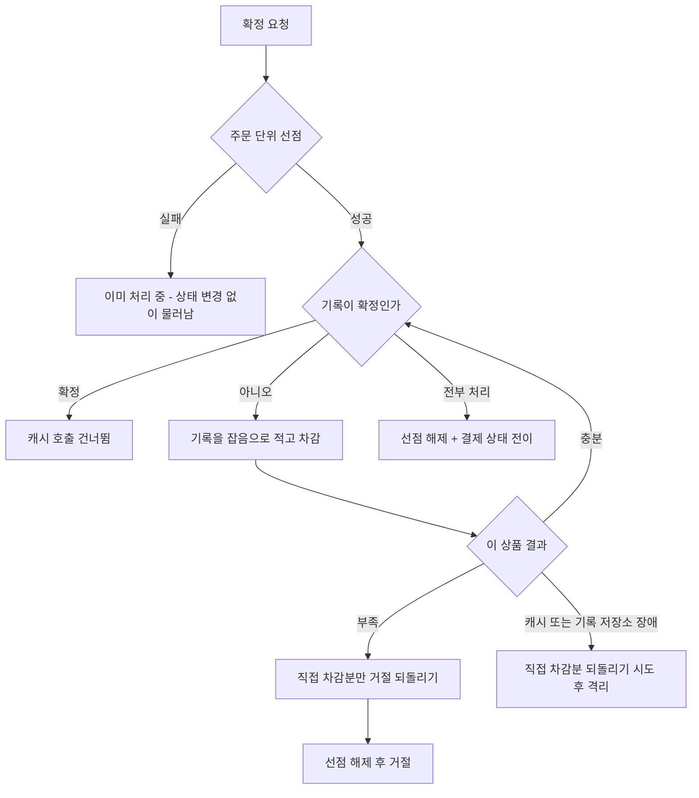
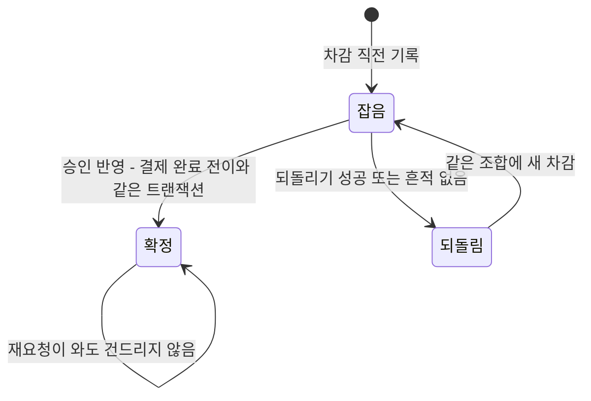
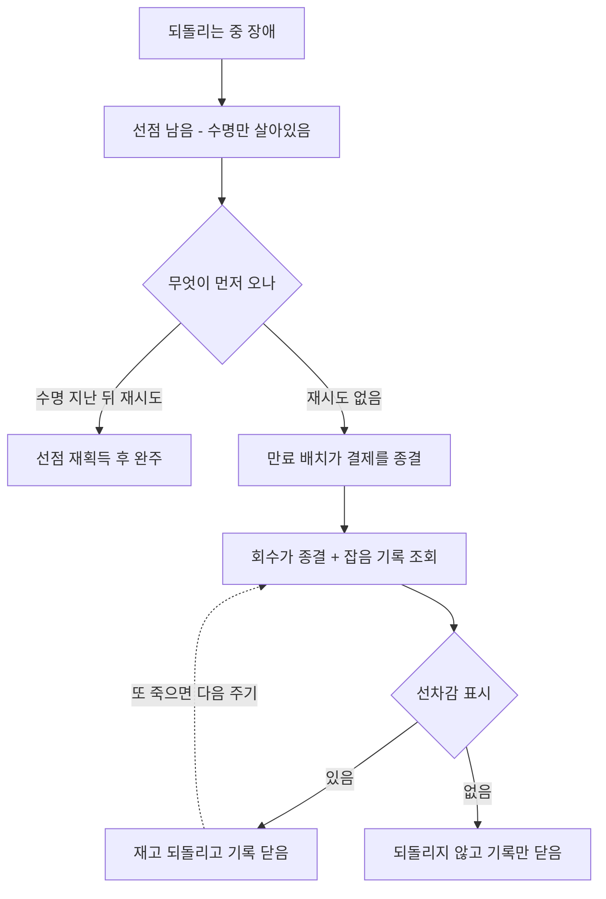

# 재고 선차감 게이트 상품 단위 분해 (STOCK-GATE-PER-PRODUCT) — 완료 브리핑

> 기간: 2026-08-15 ~ 2026-08-18 / 이슈·브랜치: #144

## 작업 요약

시작은 다른 작업이었다. 인스턴스를 늘려도 처리량이 안 늘던 직전 측정의 후속으로 공유 자원까지 함께 늘려보려 했는데, 재고 캐시를 여러 노드로 나누려면 주문당 상품 하나를 전제해야 한다는 사실이 걸렸다. 측정 편의를 위해 결제 도메인의 보장을 깎는 순서였다. 그래서 그 토픽을 보류하고 이 작업을 선행으로 세웠다.

**게이트는 잔고가 아니다.** 이 사실이 작업 전체의 근거다. 진짜 재고는 상품 서비스 DB 에 있고 승인된 결제만 거기서 빠진다. 캐시에 있는 것은 확정 진입을 빠르게 거절하는 장치일 뿐이다. 그래서 게이트에 부분 차감이 남으면 실제보다 빡빡해질 뿐 초과 판매 방향이 아니다 — 못 파는 쪽으로 기우는, 회수로 갚을 수 있는 종류의 빚이다.

원자성 경계를 주문 단위에서 상품 단위로 내렸다. 스크립트 한 번이 공짜로 주던 "전부 아니면 전무" 는 진입 경로가 지고, 되돌리다 실패한 차감은 선차감 기록과 주기 작업이 회수한다. 그런데 쪼개면서 잃은 것이 그 하나가 아니었다. 옛 스크립트는 재고를 보기 **전에** 주문 표시를 선점해 동시 중복 요청이 항상 하나로 수렴하게 했고, 재고가 부족하면 그 표시를 **지우고** 거절해 재시도가 깨끗하게 다시 오게 했다. 둘 다 명시적으로 되살려야 했다 — 주문 단위 선점과 거절 전용 되돌리기다.

조사 중 더 무거운 것이 나왔다. **초과 판매를 막는 장치가 게이트 하나뿐이었다.** 잔고를 차감하는 코드에 음수 가드가 없어 게이트가 뚫리면 재고가 음수가 되고 아무도 모른 채 저장됐다. 검증이 있는 도메인 메서드는 있었지만 프로덕션 호출처가 0 이었다. 게이트를 손대는 작업이니 두 번째 방어선을 함께 세웠고, 그러려면 그 예외를 받을 곳도 만들어야 했다 — 상품 서비스에는 소비 실패를 받는 설정이 아예 없어서, 가드만 넣으면 이미 과금된 결제의 확정 통지가 조용히 사라질 참이었다.

discuss 게이트를 9라운드 돌았다. 그중 네 라운드가 **키 이름 전환** 하나에서 연속으로 critical 을 냈다 — 격리 토픽 부재, 종결 대기가 성립하지 않음, 확정 발행과 상품 DB 반영 사이의 비동기 격차, 대기 완료와 계산 사이의 창. 매번 다른 문으로 터졌다. 돌아가는 시스템에서 키를 바꾸려니 "이미 빠져나간 재고" 를 정확히 세야 했고 그 셈이 계속 틀렸다. 그러다 전제가 뒤집혔다 — 로컬 학습 환경이고 스택을 새로 띄우는 중인데 기존 캐시 데이터를 지킬 이유가 없었다. 볼륨을 비우고 시작하면 진행 중 결제가 0 이라 셀 것 자체가 없어진다. 진입 차단, 소비 대기, 미회수 계산이 통째로 사라졌다.

execute 는 24개 태스크로 갔다. 포트는 한 번에 바꾸지 않았다 — 시그니처를 통째로 바꾸면 호출부 넷이 동시에 깨지고 그 자리에 무계획한 임시 코드가 들어가는데, 스크립트는 이미 쪼개진 상태라 그 코드가 부분 차감을 만들 수 있다. 되돌릴 로직도 회수할 기록도 없는 구간이다. 상품 단위 메서드를 추가로 두고 호출부를 하나씩 옮긴 뒤 마지막에 옛 메서드를 걷었다.

구현 중 실제로 잡은 결함이 다섯이다. 조건부 갱신을 삽입보다 먼저 둬서 난 갭 락 데드락, 벌크 갱신이 앞선 변경을 삼킨 문제, 선점 실패를 기존 분기로 매핑하면 진행 중인 이긴 쪽의 결제를 덮어쓰는 것, 격리 발행 키를 바이트로 넘겨 직렬화가 터지며 격리 자체가 무한 재시도에 빠진 것, 그리고 거절 전용 되돌리기가 무조건 복원해 이중 복원 여지를 남긴 것이다. 앞의 넷은 기존 테스트가 깨지면서 드러났고, 마지막은 동시성 검증을 짜다 순서를 바꿔보니 실제로 재현됐다.

라이브 검증에서 다섯 항목을 모두 확인했다. 그중 예정에 없던 장면이 하나 나왔다 — 거절로 되돌린 뒤 같은 주문번호로 재시도하자 게이트가 다시 줄었고, 상태 가드에 막힌 그 차감을 다음 회수 주기가 정확히 되돌렸다. 게이트 6~9라운드에서 가장 오래 다툰 기록 재오픈 메커니즘이 실제로 도는 장면이었다.

## 핵심 설계 결정

### 원자성 경계를 상품 단위로 내린 근거

게이트는 잔고가 아니라 확정 진입을 빠르게 거절하는 장치다. 부분 차감이 남으면 실제보다 빡빡해질 뿐 초과 판매 방향이 아니고, 회수 경로로 갚을 수 있다.

**기각한 대안** — 주문 단위 유지. 한 주문이 건드리는 키가 노드에 흩어지면 스크립트가 성립하지 않아 게이트가 영원히 한 노드에 묶인다.

### 키를 상품 기준 해시태그로 묶은 이유

`stock:{productId}` / `decrement:done:{productId}:orderId` / `compensation:done:{productId}:orderId`. 한 상품에 딸린 키가 같은 슬롯에 모여, 노드가 나뉘어도 스크립트가 원자적으로 돈다.

**기각한 대안** — 주문 기준 태그. 재고 키가 주문마다 갈라져 재고 개념 자체가 깨진다.

### 거절할 때 두 표시를 함께 지운다

선차감 표시만 남기면 재시도가 이미 처리됨으로 통과해 실제 차감 없이 승인된다. 되돌리기 표시만 남기면 재시도가 만든 새 차감을 다음 사이클의 되돌리기가 못 돌린다 — 조건부 되돌리기는 그 표시를 선점해야 재고를 되돌리기 때문이다. 두 표시는 한 차감 사이클의 시작과 끝이라 사이클이 무효가 되면 함께 사라져야 한다.

**나중에 보강** — 되돌리기 표시가 이미 있으면 복원을 건너뛰는 조건을 추가했다. 동시성 검증에서 순서를 바꾸니 이중 복원이 실제로 재현됐다(100 → 100 → 110). 그 순서가 지금 도달 불가능한 것은 주문 단위 선점과 상태 배타성 덕이지 코드가 막아서가 아니었다.

### 기록을 차감보다 먼저 적는다

차감 후 죽으면 그 차감은 회수 대상에서 사라져 영구히 묶인다. 반대로 기록만 있고 차감이 없는 경우는 조건부 되돌리기가 흔적을 못 찾아 넘어가므로 무해하다. 실패 방향이 안전한 쪽으로 기울게 하는 선택이다.

### 확정 표시를 승인 반영 트랜잭션 안에서 찍는다

이것이 없으면 정상 판매된 기록이 잡음으로 남아, 결제가 종결된 뒤 주기 작업이 **실제로 팔린 재고를 되돌린다.** 종결 전이와 같은 트랜잭션이라 회수가 종결을 본 시점에는 확정도 이미 커밋돼 있어 경합이 없다.

**기각한 대안** — 상품 서비스 반영 확인 후 표시. 반영을 확인할 채널이 없다. 별도 트랜잭션도 기각 — 종결과 확정 표시가 갈라져 그 사이에 회수가 끼어든다.

### 확정 기록에는 캐시 차감 호출 자체를 건너뛴다

기록만 보존하고 차감을 부르면, 선차감 표시 수명(8일)이 지난 뒤에는 선점이 성공해 이미 팔린 상품에 진짜 신규 차감이 생긴다. 그 차감은 기록이 확정으로 못박혀 있어 회수 대상 조건에 영영 걸리지 않는다 — 다른 누수는 다 닫으면서 이 경로만 열어두는 셈이다. 표시 수명이 아니라 기록을 보고 판단한다.

### 되돌리기 후보를 직접 차감 성공분으로 한정

이미 처리됨을 받은 상품은 다른 요청이 잡아 둔 것일 수 있다. 자기 차감으로 세고 되돌리면 남의 몫을 되돌리게 되는데, 그쪽 결제는 그 재고가 계속 필요하다.

### 주문 단위 선점과 그 해제 방식

옛 스크립트는 재고를 보기 전에 주문 표시를 선점해, 지는 쪽이 재고 판정 자체를 못 봤다. 상품별로 쪼개면 상품마다 승자가 갈리고, 거절된 쪽이 되돌린 재고를 진행 중인 쪽이 여전히 필요로 한다. 선점을 앞에 두어 그 보장을 되살렸다.

해제는 **명시적 해제가 주 수단이고 수명은 죽는 경우 대비 backup** 이다. 수명만으로 잡으면 처리가 그 시간을 넘길 때 두 번째 요청이 재획득해 같은 주문의 상품 반복이 둘 돌게 된다. 해제 시 토큰 일치를 요구하는 compare-and-delete 를 썼다 — 단순 삭제면 수명이 지나 다른 요청이 재획득한 선점을 지울 수 있다.

선점 실패는 **결제 상태를 건드리지 않는 별도 분기**다. 재고 부족과 같은 취급을 받으면 진 쪽이 진행 중인 이긴 쪽의 결제를 실패로 덮어쓴다.

### 키 이름 전환은 스택을 새로 띄우며

돌아가는 중에 바꾸려면 이미 빠져나간 재고를 세서 빼야 하는데 그 셈이 계속 틀렸다 — 승인은 났지만 상품 DB 반영이 아직인 건, 확정 통지가 격리에 갇힌 건이 양쪽 어디에도 잡히지 않는다. 캐시와 DB 볼륨을 모두 비우고 시작하면 진행 중 결제가 0 이라 계산 자체가 필요 없다.

**기각한 대안** — 진입 차단 후 종결 대기. 이 프로젝트에는 저절로 종결되지 않는 결제가 둘 있다(격리는 관리자가 건별로 눌러야 하고, 대기 잔류는 도구조차 없다). 대기가 끝나지 않거나, 빼고 세면 초과 판매가 재현된다.

### 재고 확정 음수 가드와 그것을 받을 곳

초과 판매는 드러나야 하는 사고다. 부족하면 예외로 멈추되, **받을 곳을 함께 만들어야 한다** — 상품 서비스에는 소비 실패를 받는 설정이 없어 기본 설정대로 재시도 후 로그만 남기고 메시지가 사라진다. 그 메시지는 이미 벤더 승인이 나 고객이 과금된 결제의 확정 통지다.

재고 부족은 재시도로 풀리지 않으므로 재시도 대상에서 제외했다. 이를 위해 재고 없음과 **다른 예외 타입**을 골랐다 — 같은 타입이면 "재고 부족만" 빼는 것이 불가능하다.

격리 메시지에는 주문번호와 상품번호로 정해지는 키를 싣는다. 음수 가드가 예외를 던지면 중복 판정 기록도 함께 롤백돼 재전송마다 새 이벤트로 처리되고, 결제 쪽 재발행까지 겹치면 같은 사고가 여러 건으로 쌓여 환불·입고가 이중 실행될 수 있다.

### 포트를 점진적으로 전환한 이유

시그니처를 한 번에 바꾸면 호출부 넷이 동시에 깨진다. 그 자리에 임시 코드가 들어가야 하는데 스크립트는 이미 쪼개진 상태라 그 코드가 부분 차감을 만들 수 있고, 되돌릴 로직도 회수할 기록도 아직 없는 구간이다. 상품 단위 메서드를 추가로 두고 호출부를 하나씩 옮긴 뒤 옛 메서드를 걷었다. 그 사이의 임시 브리지도 옛 계약을 스스로 지키게 만들었다 — 반복 중 부족을 만나면 이미 차감한 것을 되돌린 뒤 부족을 반환한다.

## 변경 범위

| 영역 | 변경 | 의도 |
|:---:|:---:|:---:|
| 캐시 스크립트 | 3종을 상품 단위로 재작성 + 거절 전용 되돌리기·선점 획득·해제 3종 신규 | 한 상품의 키가 같은 슬롯에 모여 노드를 나눠도 원자적으로 돈다 |
| 캐시 포트·어댑터 | 상품 단위 메서드 신설 → 호출부 이관 → 주문 단위 메서드 제거 | 중간 단계마다 컴파일과 동작이 유지되는 점진 전환 |
| 선차감 기록 (신규) | 포트 `application/port/out` + 엔티티 `infrastructure/entity` + JPA 어댑터 `infrastructure/repository` + Flyway V7 | 되돌리다 실패한 차감의 회수 근거. 상태는 잡음 / 되돌림 / 확정 |
| 회수 (신규) | 판정 유스케이스 + 주기 작업 `infrastructure/scheduler` | 종결됐는데 잡음으로 남은 기록을 되돌린다. 판정은 원본 DB 를 읽는다 |
| 확정 진입 | 선점 → 상품별 (기록 → 차감) 반복 → 부분 실패 되돌리기 → 선점 해제 | 주문 전체 보장을 애플리케이션이 진다 |
| 되돌리기 네 경로 | 확정 실패·격리 진입·관리자 종결·회수가 공용 유틸을 지나 상품 단위로 | 관측을 한 곳에 모으고 이중 되돌리기 방어를 공유 |
| 관측 | 되돌리기 결과별 카운터 + 이상 결과에만 로그, 회수 실행·미회수 건수 지표 | 상품 단위로 호출이 늘어 정상 복원까지 로그하면 시끄럽다 |
| 상품 서비스 | 재고 확정 음수 가드 + 격리 토픽·에러 핸들러·recoverer 신규 | 초과 판매 두 번째 방어선과 그 예외를 받을 곳 |
| 관측 규칙 | 격리 적체 알람 + 런북 대응 분류 | 관리자 재고 조정발 발화(기존 갭)와 게이트 결함을 가른다 |
| 운영 스크립트 | 시드 키 이름, 토픽 사전 생성 목록 | 통합 테스트가 구조적으로 못 잡는 배포 구성 |
| 무관 | 벤더 호출 경로, 결제 상태 전이 규칙, 주문 접수 멱등키 저장소, 발행·수신 경로 |

## 다이어그램

### 확정 진입

### 선차감 기록의 상태

회수 대상은 **결제가 종결됐는데 잡음으로 남은 기록**이다. 확정 표시가 이 설계의 안전을 떠받친다.

### 되돌리는 중 서버가 죽으면

## 라이브 검증

캐시와 DB 볼륨을 전부 비우고 스택을 새로 띄워 확인했다.

| 항목 | 결과 |
|:---:|:---:|
| 시드 키 이름 | 새 형식만 존재, 옛 형식 0건. 상품 DB 값과 일치하고 게이트가 읽어 결제를 통과시켰다 |
| 여러 상품 주문 | 상품 3종 주문이 완주. 게이트 100→98 / 100→97 / 5→4 로 상품별 차감, 표시 3개 생성, 기록 3행이 확정으로 전이. 상품 DB 와 게이트가 셋 다 일치 |
| 회수 작업 | 9회 기동, 미회수 잔량 0 수렴. 결과별 카운터 — 복원 3 / 흔적 없음 3 / **이미 처리됨 0**(이중 복원 없음) |
| 음수 가드와 격리 | 게이트를 인위로 부풀린 상태에서 결제는 승인됐으나 **잔고가 그대로 유지**. 격리 토픽 도달, 메시지 키가 주문번호와 상품번호 조합. 이후 정상 주문이 완주해 파티션이 막히지 않음을 확인 |
| 지연 | 상품 1개 25.6ms / 2개 32.3ms / 3개 36.3ms (중앙값) — **왕복 하나당 약 5ms**, 상품 수에 선형 |

**예정에 없던 관측** — 거절로 되돌린 뒤 같은 주문번호 재시도가 게이트를 다시 줄였고(종결 상태를 검사하지 않는 기존 갭, `CONCERNS.md` L-16), 그 차감이 닫혔던 기록을 잡음으로 재오픈시켜 다음 회수 주기가 정확히 되돌렸다. 게이트에서 가장 오래 다툰 재오픈 메커니즘이 실제 상황에서 도는 것을 봤다.

**환경 문제 2건** (코드 무관) — Testcontainers 잔여 컨테이너 45개가 메모리를 점유해 MySQL 두 대가 강제 종료됐고, 그 여파로 데이터 디렉터리가 손상돼 접속이 거부됐다. 라벨로 골라 정리하고 볼륨을 다시 초기화해 해소했다.

## 코드 리뷰 요약

reviewer **revise**(major 2) / domain-expert **pass**(minor 3) → 수정 → 재리뷰에서 major 1 추가 → 보강 후 종료. **critical 0.**

| severity | finding | 처리 |
|:---:|:---:|:---:|
| major | 신규 Testcontainers 통합 테스트 4개에 통합 태그 누락 — 단위 게이트에 편입되고 통합 태스크에서는 빠져 CI 보호망 밖 | 채택 — 태그 부여 후 양쪽에서 위치 확인(단위 682→673, 통합 651→660) |
| major | `StockHoldRecordEntity.openNoise()` 호출처 0. Javadoc 이 실제와 어긋나 오도 | 채택 — 메서드와 Javadoc 제거 |
| major (재리뷰) | 예외 출처 구분 수정이 만든 신규 분기에 테스트 0건 | 채택 — 로그 캡처로 두 이벤트 타입 분리와 직접 차감분 되돌리기를 단정 |
| minor | 캐시 장애와 기록 저장소 장애를 같은 이벤트 타입으로 로그 | 채택 — 전용 예외로 감싸 출처 구분. 판정과 되돌리기는 그대로 |
| minor | 거절 경로의 기록 닫기가 회수까지 지연되는데 다이어그램은 즉시 전이로 그림 | 부분 채택 — 안전성은 테스트로 고정돼 있어 코드는 두고 설계 문서에 지연 가능성 한 줄 보강 |
| minor | 라이브 검증 미수행 | 조치 불필요 — ship Phase B 에서 수행 |

도메인 검토는 다섯 되돌리기 주체와 사이클 토큰, 표시 선점의 상호작용을 코드까지 추적해 이중 복원·초과 판매 경로를 찾았으나 열리지 않았다고 판정했다. reviewer 도 설계 결정 27개를 코드와 대조해 어긋남을 찾지 못했고, 옛 주문 단위 포트 메서드와 스크립트가 참조 0 으로 완전히 걷힌 것을 확인했다.

## 게이트 경과

| 단계 | 라운드 | 비고 |
|:---:|:---:|:---:|
| discuss | 9 | 키 전환에서만 4연속 critical. 전제를 바꾸며 통째로 단순해졌고, 이후 상태 모델과 동시성 경계를 다듬어 마무리 |
| plan | 3 | 포트를 한 번에 바꾸면 호출부 넷이 동시에 깨진다는 지적으로 점진 전환으로 재구성 |
| ship | 1 + 재리뷰 1 | critical 0 |

## 미결 / 후속

- **노드별 묶음 처리** — 캐시 왕복이 주문당 1 회에서 선점 1 + 상품 N + 해제 1 로 늘었다. 같은 노드에 떨어진 상품을 한 스크립트로 묶으면 왕복이 상품 수가 아니라 노드 수에 비례한다. 병목으로 드러나면 도입 (`TODOS.md`)
- **후행 토픽 재개** — `SHARED-RESOURCE-SCALEOUT`(공유 자원 동반 스케일아웃 측정). 이 작업이 선행 조건이었고, 재고·멱등 저장소 분산을 다시 범위에 넣어 재게이트한다
- **종결 상태 조기 거부 가드 부재** — 확정 요청 검증이 종결·격리 상태를 검사하지 않아 재고 차감이 상태 가드보다 먼저 일어난다(`CONCERNS.md` L-16). 이번에 그 차감이 기록 재오픈으로 회수되는 것은 확인했으나 진입 자체를 막지는 않는다
- **재동기화 도구의 진행 중 선차감 가드** — 선차감 기록이 생겨 미종결 차감 조회가 쉬워졌다 (`TODOS.md`)
- **확정 요청 멱등키 부재** — 주문 접수에는 있으나 확정에는 없다. 이번에는 주문 단위 선점으로 대응했고 헤더 도입은 범위 밖

## 수치

- 태스크: 24개 (라이브 검증 포함)
- 커밋: 45개 (feat 21 / test 19 / docs 4 / fix 1)
- 변경: 102파일, +8104 / -998
- 테스트: 단위 1211 (payment 675 · pg 454 · product 67 · user 10 · gateway 4 · eureka 1) / 통합 685 (payment 660 · product 8 · pg 16 · user 1) — 캐시 지우고 강제 재실행
- 신규 검증: 되돌리기 다섯 주체 전 짝 동시성 500건(10조합 × 50회), 수렴 체인 5시나리오, 상품 서비스 임베디드 브로커 통합 2건
- findings: critical 0 / major 3 / minor 3
- 구현 중 잡은 결함 5건: 갭 락 데드락 · 벌크 갱신 flush 순서 · 선점 실패 분기의 상태 덮어쓰기 · 격리 발행 키 직렬화 무한 재시도 · 거절 전용 되돌리기 이중 복원 여지
