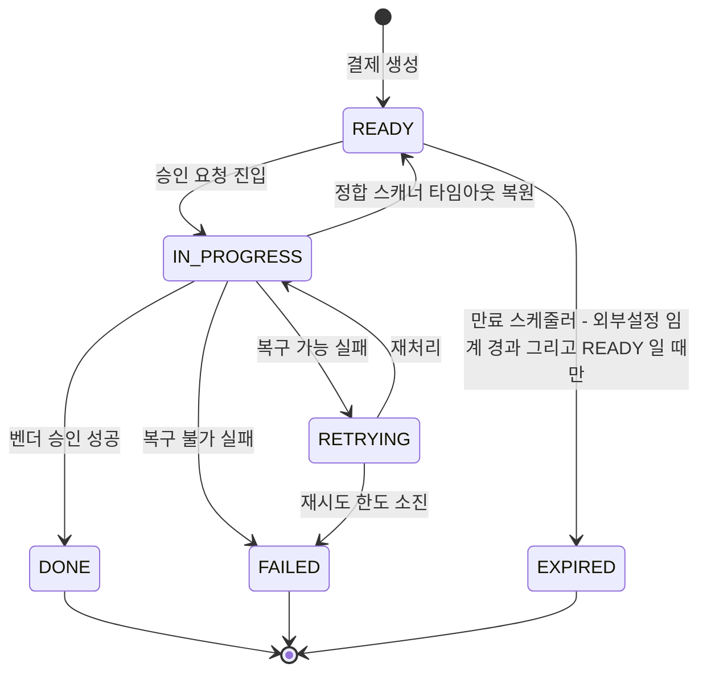
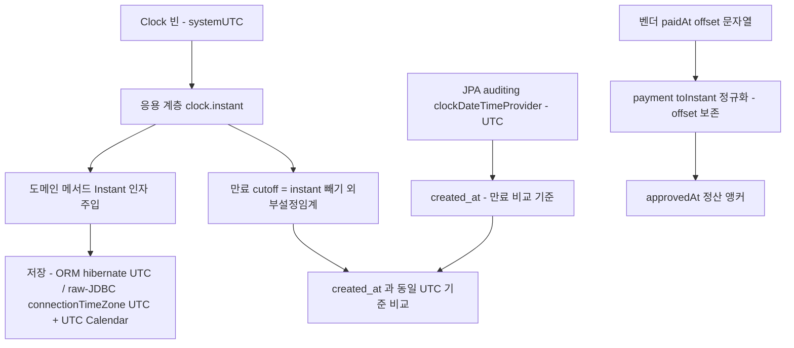

# TIME-MODEL-AND-EXPIRY 완료 브리핑

> PR B — 시간 모델 Clock/Instant 통일 + 결제 만료 정책 명문화 | 이슈/브랜치 #83 | 2026-06-01 ~ 2026-06-03

## 작업 요약

이 작업은 결제 플랫폼 4개 서비스에 흩어져 있던 시간 처리 방식을 하나의 표준으로 수렴하고, 암묵적으로만 동작하던 결제 만료(EXPIRED) 정책을 명문화한 묶음이다.

문제의 출발점은 두 가지였다. 첫째, 시간 소스가 서비스마다 제각각이었다. 결제 서비스는 자체 포트(`LocalDateTimeProvider`)에 `LocalDateTime`을 썼는데 인터페이스 주석은 UTC라면서 실제 구현은 시스템 시간대를 따라 문서와 코드가 어긋나 있었고, PG 서비스는 JDK `Clock`을 쓰면서도 도메인 내부는 `Instant.now()`를 직접 호출했으며, 상품 서비스는 추상화가 아예 없었다. 이 직접 호출들은 고정 시계를 주입할 수 없어 시간 의존 테스트를 어렵게 했고, `LocalDateTime`의 시간대 모호성은 컨테이너 TZ에 따라 의미가 달라지는 잠재 버그였다. 둘째, 결제 만료는 이미 동작하고 있었지만 임계(30분)가 도메인 상수로 박혀 있고, 스케줄러 프로퍼티 키 이름이 실제 하는 일과 어긋났으며, "어떤 상태가 만료 대상인가"가 코드에만 암묵적으로 존재했다.

접근은 discuss에서 사용자가 네 가지를 확정하며 시작됐다 — 시간 표준은 `Clock`+`Instant`, 적용은 4서비스 전부, 만료 임계는 외부화(기본 30분 유지), 만료 정책은 현행 2단 연쇄를 의도로 확정. 도메인은 `Clock`을 직접 주입받지 않고 호출자가 `Instant`를 인자로 넘기는 원칙(헥사고날 순수성)을 세웠고, UTC 저장 일관을 ORM 경로(`hibernate.jdbc.time_zone=UTC`)와 raw-JDBC 경로(`connectionTimeZone=UTC` + 명시 UTC Calendar) 양쪽에 적용했다.

실행 중 두 번의 중요한 발견이 있었다. (1) raw `JdbcTemplate` INSERT와 Hibernate native query 조회의 시각 바인딩이 비대칭이라 비-UTC JVM(KST)에서 만료 cutoff가 9시간 어긋나는 문제가 드러났고, native query 파라미터를 `Instant`로 바꿔 해소했다. (2) review에서 Domain Expert가, 만료 비교 기준인 `created_at`(BaseEntity auditing)이 JVM 기본 TZ로 채워지는데 cutoff만 UTC라 여전히 어긋날 수 있음을 잡아내, `@EnableJpaAuditing(dateTimeProviderRef="clockDateTimeProvider")`로 auditing 시각도 UTC로 일관화했다(R2 부분 해소). 마지막으로 사용자 요청에 따라 `PaymentOutbox` 도메인까지 `Instant`로 통일해(T17) 호출 경계에서 반복되던 `LocalDateTime.ofInstant(...UTC)` 변환 6곳을 제거하고 payment 도메인 시각 타입을 완전히 일치시켰다.

결과적으로 `LocalDateTimeProvider` 포트는 완전히 사라지고, payment 도메인(`PaymentEvent`/`PaymentOutbox`)은 전부 `Instant`, 4서비스가 `Clock` 빈 단일 표준을 쓰며, 만료 정책은 테스트로 명문화됐다. 전체 846개 테스트가 통과한다.

## 핵심 설계 결정

- **D1 시간 표준 = JDK `Clock` 빈 + `Instant`**
  - 근거: `Clock`은 JDK 표준이라 별도 포트·테스트 더블 비용이 없고(`Clock.fixed()` 제공), pg가 이미 쓰던 패턴이라 일관성 확보. `Instant`는 절대 시점이라 시간대 모호성이 없다.
  - 기각: 자체 포트+`LocalDateTime` 통일(시간대 안전성 포기 + 표준 재발명), payment 포트만 UTC 고정(JDK `Clock`과 1:1 중복).

- **D2 `Clock` 빈은 config에, 도메인은 `Instant` 인자 주입**
  - 근거: 도메인 → 외부 의존 0 규칙 유지. 도메인이 `Clock`을 주입받으면 순수성이 깨진다. 호출자가 `clock.instant()`로 얻어 메서드 인자로 넘긴다.

- **D3 UTC 저장 일관 (컬럼 타입 유지)**
  - 근거: ORM은 `hibernate.jdbc.time_zone=UTC`, raw-JDBC는 별도 규약(D7). 컬럼은 `DATETIME(6)` 유지 → Flyway DDL 불필요(운영 데이터 없는 학습 프로젝트, R1).
  - 기각: `TIMESTAMP` 컬럼 전환(마이그레이션·데이터 재해석 비용 과도).

- **D4 만료 임계 외부화** — `payment.expiration.ready-timeout-minutes`(기본 30). 도메인은 임계를 모르고, "언제 만료 대상인가"(정책)는 application, "전이 가능 여부"(불변)는 domain.

- **D5 만료 스케줄러 키 정정 + fallback 체인** — `scheduler.payment-expiration.*` 주키 + 기존 `payment-status-sync.*` fallback으로 운영 무중단.

- **D6 만료 정책 명문화** — "READY만 직접 만료(`expire()` 가드) + IN_PROGRESS 정체분은 정합 스캐너(PaymentReconciler)가 READY 복원 후 만료"라는 2단 연쇄를 의도된 정책으로 확정. 메커니즘 무변경, 테스트로 고정.

- **D7 raw-JDBC UTC 규약** — payment/product dedupe store에 datasource URL `connectionTimeZone=UTC&forceConnectionTimeZoneToSession=true` + 명시 UTC Calendar. `hibernate.jdbc.time_zone`이 raw-JDBC에 적용 안 되는 갭을 메우고, product의 `NOW()`(DB) vs 앱 `Instant` split-brain을 같은 UTC 세션으로 수렴.

- **D8 벤더 승인 시각 `.toInstant()` 정규화** — `OffsetDateTime.parse(approvedAtRaw).toInstant()`로 offset을 보존한 절대 시점 변환. `.toLocalDateTime()`은 offset을 버려 정산·감사 앵커가 최대 9시간 틀어지므로 금지. pg→payment 메시지 `approvedAtRaw` 문자열 contract는 무변경.

## 변경 범위

- **도메인**: `PaymentEvent` 시각 필드/메서드 인자 `LocalDateTime`→`Instant`(T2). `PaymentOutbox`+`RetryPolicy` 동일 전환(T17). pg `PgInbox`/`PgOutbox` 내부 `Instant.now()` 직접 호출 제거 → 인자 주입(T8). `expire()` READY 가드는 그대로 유지(NG2).

- **Application**: payment `PaymentCommandUseCase`/`PaymentLoadUseCase`/`PaymentCreateUseCase`/`PaymentOutboxUseCase`/`OutboxRelayService`/`PaymentReconciler`/`PaymentConfirmResultUseCase`의 `LocalDateTimeProvider` 주입 → `Clock`(T3). 만료 임계 `@Value` 외부화(T6). `parseApprovedAt` offset 정규화(T14). `PaymentTransactionCoordinator` 등 경계 `ofInstant` 변환 제거(T17).

- **Infrastructure**: payment metrics/scheduler/aspect(`PaymentHealthMetrics`/`OutboxPendingAgeMetrics`/`PaymentOutboxMetrics`/`DedupeCleanupWorker`/`PaymentStatusMetricsAspect`/`DomainEventLoggingAspect`) `Clock` 전환(T7). `PaymentEventEntity`/`PaymentOutboxEntity` 시각 매핑 `Instant`(T4/T17). `JdbcPaymentEventDedupeStore` raw-JDBC UTC 규약 + `Clock`(T12). product `ClockConfig` 신규 + `JdbcEventDedupeStore`/`DedupeCleanupWorker`/`StockCommitConsumer` 전환(T13). pg `TossPaymentGatewayStrategy` `LocalDateTime.now()` 제거 + `NicepayPaymentGatewayStrategy` fallback `clock` 기반(T15). `JpaConfig`에 `clockDateTimeProvider` + `@EnableJpaAuditing(dateTimeProviderRef)`(DM1).

- **제거**: `LocalDateTimeProvider`, `SystemLocalDateTimeProvider`, `TestLocalDateTimeProvider`(테스트 하네스는 가변 `TestClock` 빈으로 대체).

- **설정**: payment `application.yml`(만료 임계, hibernate UTC), payment/product `application(-docker).yml`(connectionTimeZone=UTC default+docker).

## 다이어그램

### 결제 만료 라이프사이클 (명문화, 메커니즘 무변경)

### 시각 흐름 (to-be)

## 코드 리뷰 요약

- **discuss**: Domain Expert가 major 2건(raw-JDBC dedupe UTC 누락, approvedAt offset 폐기로 정산 9시간 오차)을 잡아 D7/D8로 해소 후 2라운드 pass.
- **plan**: critical 1 + major 3 — `LocalDateTimeProvider` 주입처 15개 전수 매핑 누락(특히 dedupe expires_at 소스 split). T3/T7/T12 매핑으로 해소 후 2라운드 pass.
- **execute 중 발견**: raw-JDBC vs ORM 시각 바인딩 비대칭(9시간) → native query 파라미터 Instant 전환으로 해소. `BaseIntegrationTest` 구조 오류(빈 미등록) 복구.
- **review**: 1라운드 major 4(wip 커밋 잔존/`.continue-here` 추적/만료 operand created_at 불일치/product default 프로필 connectionTimeZone 누락). DM1(auditing UTC화)·DM2(product default yml)·M2(.continue-here 삭제)로 대응. 2라운드에서 "회귀 가드 무력"(dateTimeProviderRef 누락을 못 잡음) major 1 추가 → 빈 계약 단위 테스트 + auditing wiring 테스트로 보강. T17(PaymentOutbox 통일) 재리뷰 pass. 최종 전체 리뷰 critical/major 0.

## 수치

| 항목 | 값 |
|------|---|
| 태스크 | 17 (T1~T17) + DM1/DM2 + 회귀 가드 |
| 테스트 | 846 통과 (payment 단위 463 + 통합 32, pg 311+7, product 22+6, 그 외 5) |
| 커밋 | 27 (feat 10 / test 9 / fix 1 / docs 6 / wip 1 — wip는 PR squash 흡수) |
| 코드 리뷰 findings (review 단계) | critical 0 / major 5(누적, 전부 해소) / minor 다수(이연/조치불필요) |
| 영구 문서 갱신 | 5 (PITFALLS / ARCHITECTURE / INTEGRATIONS / CONVENTIONS / TODOS) |
| 후속 등재 | [TIME-PRODUCT-NOW-UNIFY] / [TZ-UTC-BACKSTOP] / [BASEENTITY-AUDIT-SOURCE] |
