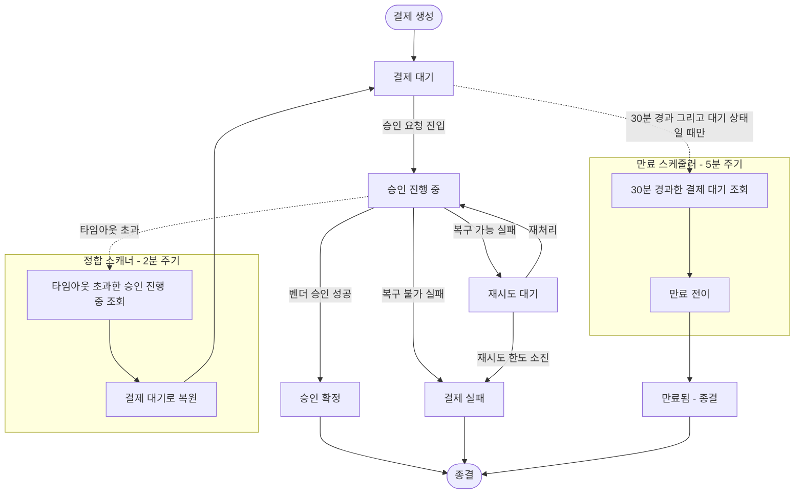
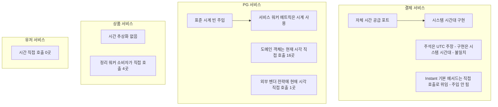
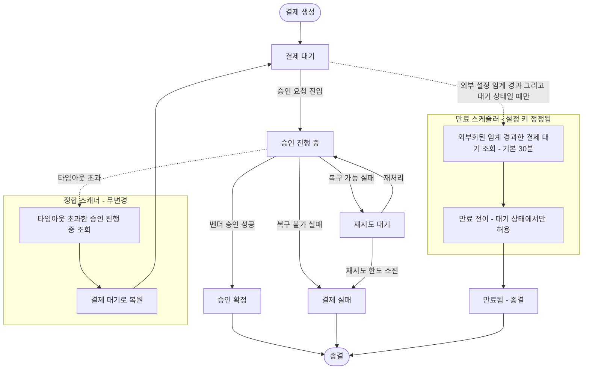
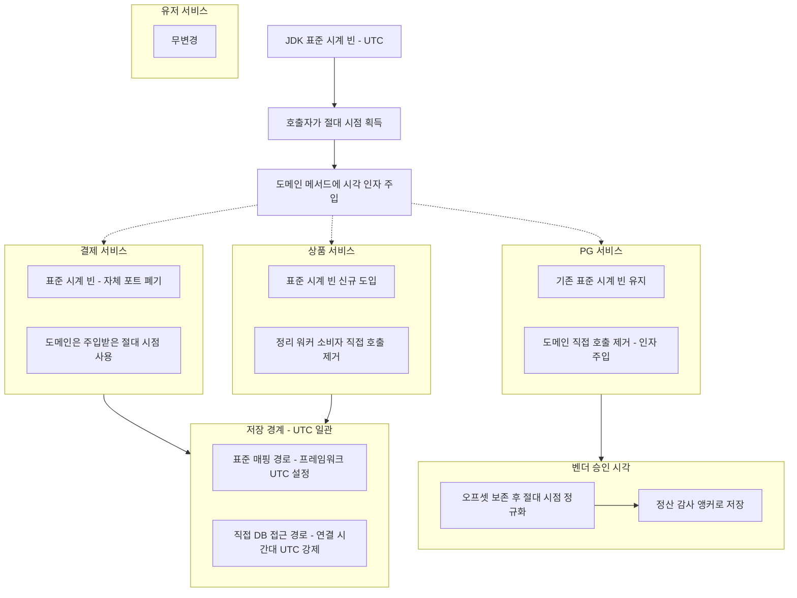
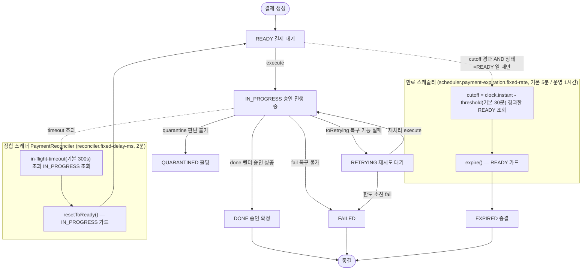

# TIME-MODEL-AND-EXPIRY

## 사전 브리핑

### 현재 이해한 문제

두 가지를 한 묶음으로 정리한다. 둘 다 "시간"이 공통 축이라 함께 결정하는 게 자연스럽다.

1. **만료 정책 (TC-4)** — 결제 만료(EXPIRED)는 이미 동작하지만, **정책이 코드에 암묵적으로 흩어져** 있다. 만료 임계(30분)는 도메인 상수로 박혀 있어 환경별 조정이 불가능하고, 만료 스케줄러를 켜고 끄는 프로퍼티 키 이름이 실제 하는 일(만료)과 어긋나 있다. 또 "어떤 상태의 결제가 만료 대상인가"가 명시적으로 정해져 있지 않다 — 현재는 결제 대기(READY)만 만료되고, 승인 진행 중(IN_PROGRESS)에서 멈춘 결제는 별도 정합 스캐너가 대기 상태로 되돌린 **뒤에야** 비로소 만료 후보가 되는데, 이 연쇄가 의도된 정책인지 우연인지 불명확하다.

2. **시간 추상화 혼재 (TC-8 + product 시간 추상화 부재)** — 서비스마다 현재 시각을 얻는 방식이 다르다. 결제 서비스는 자체 시간 공급 포트를 쓰는데 인터페이스 주석은 협정 세계시(UTC) 기준이라 적혀 있지만 실제 구현은 시스템 시간대를 따라 **문서와 구현이 어긋난다**. PG 서비스는 표준 시계(Clock) 빈을 주입하지만 도메인 객체 내부는 여전히 현재 시각을 직접 호출한다(16곳). 상품 서비스는 추상화가 아예 없어 정리 워커·소비자가 현재 시각을 직접 부른다(4곳). 이 직접 호출들은 **고정 시계를 주입할 수 없어 시간 의존 단위 테스트가 어렵다**.

### 현재 시스템 동작 (as-is)

#### 1. 결제 상태와 만료 라이프사이클

핵심 관찰:
- 만료 대상은 **결제 대기(READY) 상태만**이다. `expire()`는 대기 상태가 아니면 예외를 던진다.
- 승인 진행 중(IN_PROGRESS)에서 멈춘 결제는 정합 스캐너가 타임아웃 후 **대기 상태로 되돌린다**. 이후 대기 상태로 30분이 더 지나야 만료된다 — 즉 "진행 중 정체 → 복원 → 만료"는 두 스케줄러의 **암묵적 연쇄**다.
- 만료 임계 30분은 `PaymentEvent.EXPIRATION_MINUTES` 상수로 하드코딩(외부화 안 됨).
- 만료 스케줄러를 구동하는 프로퍼티 키는 `scheduler.payment-status-sync.fixed-rate`인데, 실제 하는 일은 만료다(이름 불일치).

#### 2. 서비스별 현재 시각 공급 방식 (as-is)

핵심 관찰:
- 결제와 PG가 **서로 다른 추상화**(자체 포트 vs 표준 시계)를 쓴다.
- 시각 타입도 혼재한다 — 결제는 시간대 정보 없는 지역 시각(LocalDateTime) 위주, PG는 협정 세계시 기준 순간(Instant) 위주.
- 추상화가 있어도 **도메인 내부는 직접 호출**해 고정 시계 주입이 도메인까지 닿지 않는다.

### 이번 discuss에서 결정하려는 것

1. **시간 표준 단일화** — 두 후보 중 택일: (a) 표준 시계(Clock) + 협정 세계시 순간(Instant) 통일(JDK 권장, 시간대 안전), (b) 자체 시간 공급 포트 + 지역 시각(LocalDateTime) 통일. 어느 쪽으로 4개 서비스를 수렴할지.
2. **도메인의 시각 주입 원칙** — 도메인 메서드 내부에서 `now()`를 직접 부르지 않고 호출자가 시각을 인자로 주입하는 규칙을 표준으로 채택할지, 채택한다면 적용 범위(전 도메인 vs 신규/변경분만).
3. **만료 임계의 외부화** — 30분 하드코딩을 환경 프로퍼티로 뺄지, 뺀다면 키 네이밍과 기본값.
4. **만료 대상 상태 정책 명문화** — 결제 대기만 만료인지, 진행 중/재시도 정체분도 직접 만료 대상에 넣을지, 아니면 현행 "정합 스캐너 복원 후 만료" 연쇄를 의도된 정책으로 확정·문서화할지.
5. **마이그레이션 범위** — 이번 PR에서 4개 서비스 전부를 표준에 맞출지, 결제/PG만 하고 상품은 별도로 둘지(폭 vs 리스크).

### 열린 질문 / 가정

- (가정) 만료 스케줄러 프로퍼티 키 이름 정정은 운영 배포 yml 동시 수정이 필요하다 — 깨지는 변경이므로 기본값을 유지하며 키만 추가할지 확인 필요.
- (가정) 결제 서비스 포트가 UTC라고 주석에 적힌 것은 의도였고, 현재 시스템 시간대 구현이 버그에 가깝다 — 표준화 시 UTC로 고정하는 방향으로 본다.
- (열림) 만료 임계 30분이 도메인 불변(비즈니스 규칙)인가, 운영 조정값인가? 이 판단이 외부화 여부를 가른다.
- (열림) 시각 타입을 협정 세계시 순간(Instant)으로 통일하면 기존 DB 컬럼·엔티티 매핑(LocalDateTime 기반)에 영향이 큰가? 마이그레이션 비용 산정 필요.
- (열림) 토픽 이름을 `TIME-MODEL-AND-EXPIRY`로 제안한다 — 다른 이름 선호 시 정정.

---

## 요약 브리핑

> discuss 2라운드 합의 완료(Critic pass / Domain Expert pass). 아래는 확정된 접근과 변경 후 동작이다. 세부 결정 근거는 `## 설계` 본문 참조.

### 결정된 접근

- **시간 표준을 JDK 표준 시계(Clock) + 절대 시점(Instant) 하나로** 4서비스를 수렴한다. 결제 서비스의 자체 시간 공급 포트는 폐기하고, 도메인은 현재 시각을 직접 부르지 않고 **호출자가 시각을 인자로 주입**받는다(고정 시계로 시간 의존 테스트 가능).
- **시각 저장 경계는 협정 세계시(UTC)로 일관 고정**한다. 표준 매핑(ORM) 경로는 프레임워크의 UTC 설정으로, 멱등성 정리 테이블처럼 **표준 매핑을 거치지 않는 직접 DB 접근 경로는 연결 자체의 시간대를 UTC로 강제**해 양쪽 모두 같은 규약을 따른다(중복 처리 방지의 핵심).
- **벤더 승인 시각(정산·감사의 돈 앵커)은 응답의 시간대 오프셋을 보존한 채 절대 시점으로 정규화**한다 — 오프셋을 버려 최대 9시간 틀어지던 위험을 차단한다. 서비스 간 메시지의 시각 문자열 형식은 그대로 둬 무중단.
- **만료 임계 30분을 환경 설정으로 외부화**(기본값 30분 유지)하고, 만료 스케줄러 설정 키 이름을 만료 의미에 맞게 정정한다(운영 무중단 폴백).
- **만료 정책을 현행 그대로 명문화**한다 — 결제 대기만 직접 만료, 승인 진행 중 정체분은 정합 스캐너가 대기로 되돌린 뒤 만료되는 두 단계 연쇄를 의도된 정책으로 확정한다(메커니즘 변경 없음).

### 변경 후 동작 (to-be)

#### 1. 결제 만료 라이프사이클 — 메커니즘 무변경, 임계·키만 정리

#### 2. 서비스별 현재 시각 공급 방식 — 단일 표준 수렴

### 핵심 결정 ID

- **D1** 시간 표준 = JDK `Clock` 빈 + `Instant`(자체 포트 폐기).
- **D2** `Clock` 빈은 서비스별 config(domain 금지), 도메인은 시각 인자 주입.
- **D3** 시각 저장은 UTC 일관 — ORM 경로는 프레임워크 UTC 설정, raw-JDBC는 D7로 분리. 컬럼 타입(`DATETIME(6)`) 유지, Flyway DDL 불필요.
- **D4** 만료 임계 외부화(`payment.expiration.ready-timeout-minutes`, 기본 30).
- **D5** 만료 스케줄러 설정 키 정정 + 폴백 체인으로 운영 무중단.
- **D6** "READY 직접 만료 + 진행 중 정체분은 정합 스캐너 복원 후 만료" 2단 연쇄 명문화(메커니즘 무변경, READY 가드 유지).
- **D7** raw-JDBC dedupe 경로 UTC 규약(`connectionTimeZone=UTC` + 명시 UTC Calendar, product `NOW()` vs `Instant` split-brain 수렴).
- **D8** 벤더 승인 시각 `.toInstant()` 정규화(오프셋 보존, 메시지 문자열 형식 무변경).

### 알려진 트레이드오프 / 후속

- **plan 게이트 위임(R1)**: 영속 운영 데이터가 존재하면 UTC 규약 고정이 기존 `DATETIME` 행 해석을 바꾼다 → plan에서 기존 행 확인 후 보정/분리 결정.
- **본 토픽 이연(R2)**: `BaseEntity`의 생성/수정 시각(auditing) 소스 일원화는 돈 앵커가 아니고 범위 초과라 이연(TODOS 등재). plan에서는 D3 연결 규약과 충돌 없음만 확인.
- **plan 결정(D7 범위)**: product의 DB `NOW()` 비교를 앱 주입 `Instant`로 통일할지(더 결정적이나 변경 폭 큼)는 plan에서 호출 그래프 기준 판단.
- **verify 동기화**: PITFALLS §13(벤더 승인 시각 경계) 본문을 Instant 전환판으로 갱신, 만료 임계 외부화·시간 표준을 영구 문서에 반영.

---

## 설계 (Discuss Round 1)

> Round 0 인터뷰(`docs/rounds/time-model-and-expiry/discuss-interview-0.md`)에서 사용자가 승인한 결정을 전제로 설계를 확정한다. 본 설계는 그 결정을 hexagonal layer 배치·DB 경계·상태 전이·검증 계층으로 구체화한다.

### 1. 목표 / 범위

#### 목표
- 4서비스(payment / pg / product / user)의 시간 소스를 **JDK `Clock` 빈 주입 + `Instant`** 단일 표준으로 수렴한다.
- 도메인·서비스 내부의 직접 `now()` 호출(pg 도메인 16곳, product 4곳, pg Toss 전략 1곳, payment 포트 구현)을 제거해 **고정 시계 주입이 도메인까지 닿게** 한다.
- 만료 임계 30분 하드코딩을 환경 프로퍼티로 외부화한다(기본값 30분 유지).
- 만료 스케줄러 프로퍼티 키를 만료 의미에 맞게 정정한다(운영 yml 무중단).
- 현행 만료 정책("READY만 직접 만료 + IN_PROGRESS 정체분은 정합 스캐너가 READY 복원 후 만료")을 **의도된 정책으로 명문화**한다.

#### In-scope (건드리는 모듈/패키지 경계)
- `payment-service`:
  - `core/common/service/port/LocalDateTimeProvider` (포트) + `core/common/infrastructure/SystemLocalDateTimeProvider` (어댑터) — 제거 또는 `Clock`으로 전환.
  - `application/usecase/PaymentLoadUseCase`, `application/service/PaymentReconciler`, `infrastructure/scheduler/DedupeCleanupWorker`, `infrastructure/dedupe/JdbcPaymentEventDedupeStore`, `core/common/metrics/PaymentHealthMetrics` 등 `LocalDateTimeProvider` 주입처 전부.
  - `domain/PaymentEvent` — `EXPIRATION_MINUTES` 상수 위치, 시각 인자 타입(`LocalDateTime` → `Instant`).
  - `infrastructure/entity/PaymentEventEntity` + `BaseEntity` 시각 컬럼 매핑.
  - `infrastructure/scheduler/PaymentScheduler` + `application/PaymentExpirationServiceImpl` — 프로퍼티 키 정정 + 임계 주입.
  - `application/usecase/PaymentConfirmResultUseCase.parseApprovedAt`(L226-230) — `.toLocalDateTime()` → `.toInstant()` 정규화(D8), `markPaymentAsDone`에 `Instant approvedAt` 주입.
  - `resources/application-docker.yml`(datasource URL `connectionTimeZone=UTC` — D7), `resources/db/migration/*`, `test/resources/application-test.yml`.
- `pg-service`: `infrastructure/config/PgServiceConfig`의 `Clock` 빈은 이미 존재. `domain/PgInbox`(10곳), `domain/PgOutbox`(3곳), `infrastructure/gateway/toss/TossPaymentGatewayStrategy`(1곳), 그 외 repository/service 내부 직접 `now()` 제거 → 호출자가 `Instant` 인자 주입. `infrastructure/gateway/{toss,nicepay}/*GatewayStrategy`의 벤더 시각 `.toLocalDateTime()` 변환 지점(D8)은 `approvedAtRaw` 보존 contract 유지하므로 무변경(파싱 정규화 권위는 payment 측) — 단 pg 내부 도메인이 `Instant`로 시각을 다룰 때 `.toLocalDateTime()`로 깎는 지점이 있으면 `.toInstant()`로 정정.
- `product-service`: `Clock` 빈 신규 도입(config). `infrastructure/scheduler/DedupeCleanupWorker`, `infrastructure/idempotency/JdbcEventDedupeStore`(raw-JDBC UTC 규약 D7 + `existsValid`/`SQL_DELETE_EXPIRED_BY_UUID`의 DB `NOW()` 정합), `infrastructure/messaging/consumer/StockCommitConsumer`의 직접 `now()`(4곳) 제거. datasource URL `connectionTimeZone=UTC`(D7).
- `user-service`: 직접 호출 0건 — **무변경**(범위 명시용으로만 포함).

#### Non-goals (이번 작업에서 안 할 것)
- **NG1**: 만료 메커니즘 자체(스케줄러 구조, 두 스케줄러 연쇄)를 변경하지 않는다 — 현행 동작을 의도로 확정·문서화만 한다.
- **NG2**: 만료 대상 상태 확장 금지. IN_PROGRESS/RETRYING을 직접 만료 대상에 넣지 않는다. `expire()`의 "READY에서만 진입" 가드를 유지한다.
- **NG3**: dedupe TTL 정책(P8D > Kafka retention 7일 불변식)·재고 캐시 token TTL·복구 사이클 정책을 변경하지 않는다. 시간 표준 전환은 이 값들의 계산 *소스*만 바꾸고 *값/의미*는 보존한다.
- **NG4**: JPA auditing의 `createdAt/updatedAt`(`BaseEntity`, Spring `AuditingEntityListener` 경유) 동작 변경 금지 — 단, 컬럼 타입 결정(D3)과 정합이 깨지지 않도록만 검토(아래 §3 참조).
- **NG5**: k6 벤치마크 불필요(측정 무관 작업).
- **NG6**: 새 상태값 추가 금지(`PaymentEventStatus` enum 불변).

### 2. 주요 결정사항

> 각 결정에 ID를 부여한다. 후속 plan/review가 이 ID로 추적한다.

#### D1 — 시간 표준 = JDK `Clock` 빈 + `Instant`
- **결정**: 4서비스 전부 `Clock` 빈(`Clock.systemUTC()`)을 주입받고, 현재 시각이 필요한 지점은 `Instant`로 표현한다. payment의 자체 포트 `LocalDateTimeProvider`는 폐기한다.
- **근거**: `Clock`은 JDK 표준이라 별도 포트 정의·테스트 더블 작성 비용이 없다(`Clock.fixed()` 표준 제공). pg가 이미 `Clock`을 쓰므로 4서비스 일관성이 확보된다. `Instant`는 시간대 모호성이 없어(절대 시점) 분산 환경에서 비교·만료 임계 계산이 안전하다. `LocalDateTime`은 시간대가 없어 컨테이너 TZ에 따라 의미가 달라지는데, 현재 payment `SystemLocalDateTimeProvider`가 `LocalDateTime.now()`(시스템 TZ)를 반환해 javadoc("UTC 기준")과 어긋난 것이 그 증거다(Round 0 가정 1).
- **기각된 대안**: (a) 자체 포트 + `LocalDateTime` 통일 — 시간대 안전성을 포기하고 표준 `Clock`을 재발명. (b) payment 포트를 유지하되 구현만 UTC 고정 — 포트가 JDK `Clock`과 1:1 중복되는데 굳이 자체 인터페이스를 유지할 이유가 없다(삭제 비용 관점에서 떼어내기 쉬운 쪽 = JDK 표준에 맡기기).

#### D2 — `Clock` 빈 layer 배치 + 도메인 시각 주입 원칙
- **결정**:
  - **(a) `Clock` 빈은 서비스별 `core` 또는 `infrastructure/config`의 `@Configuration`에 둔다.** payment는 `core/common/...` 하위(기존 포트가 있던 위치 대체), pg는 기존 `infrastructure/config/PgServiceConfig`(이미 존재), product는 config 신규. `Clock`은 횡단 인프라 wiring이므로 `core` 룰("인프라 wiring") 또는 `infrastructure/config`에 적합하다. **도메인 패키지에는 절대 두지 않는다**(domain → 외부 의존 0 규칙).
  - **(b) 도메인 메서드는 `now()`를 내부에서 호출하지 않는다.** 시각이 필요하면 호출자(application/infrastructure)가 `Clock`에서 `Instant`를 얻어 **메서드 인자로 주입**한다. 이는 `PaymentEvent.expire(Instant)`, `PgInbox.markXxx(Instant)` 등 기존 패턴(payment는 이미 `lastStatusChangedAt`를 인자로 받음)을 pg/product 도메인까지 확장하는 것이다.
- **근거**: `Clock`을 domain에 주입하면 domain이 Spring 빈/외부 의존을 갖게 되어 hexagonal 룰(domain 의존 0)을 깬다. "시각을 인자로 주입" 원칙은 domain을 순수하게 유지하면서 고정 시계 단위 테스트를 가능케 한다. payment 도메인이 이미 이 패턴을 따르므로 pg/product를 같은 규칙으로 수렴한다.
- **layer 의존 방향 검증**: `Clock`(infra config) → application/infrastructure가 주입받음 → domain 메서드에 `Instant` 값으로 전달. domain은 `Clock`도 `now()`도 모른다. port → domain → application → infrastructure 방향 위반 없음.
- **기각된 대안**: 도메인에 `Clock` 필드 주입(롬복/생성자) — domain 순수성 파괴. 도메인 정적 메서드에서 `Instant.now()` 직접 호출 유지 — 테스트 결정성 확보 불가(이번 작업의 동기 자체).

#### D3 — DB 경계: 엔티티 매핑만 `Instant`로 전환 + DB는 UTC 저장 규약 고정 (컬럼 타입 무변경)
- **결정**: payment 시각 컬럼은 MySQL `DATETIME(6)`을 **유지**한다. 엔티티 필드 타입을 `LocalDateTime` → `Instant`로 전환하고, JDBC connection이 **UTC로 저장·조회하도록 규약을 고정**한다. 컬럼 타입을 `TIMESTAMP`로 바꾸지 않는다.
- **UTC 규약은 두 경로로 나뉜다(major-1 대응)** — 시각이 DB에 닿는 경로가 Hibernate 경유와 raw-JDBC 경유 두 가지로 갈리므로, 각각에 **독립적으로** UTC를 강제해야 한다. 한쪽(Hibernate)만 잡으면 다른 쪽(raw-JDBC)이 JVM 기본 TZ로 새는 구멍이 남는다:
  - **(경로 A) Hibernate ORM 경유** (`PaymentEventEntity`, `BaseEntity` 등 `@Entity` 매핑): `hibernate.jdbc.time_zone=UTC`로 `Instant` ↔ `DATETIME(6)` 변환을 UTC 고정. 이것은 **Hibernate가 PreparedStatement에 값을 바인딩할 때만** 적용된다.
  - **(경로 B) raw-JDBC 경유** (`JdbcPaymentEventDedupeStore`, product `JdbcEventDedupeStore`): **Hibernate를 거치지 않으므로 `hibernate.jdbc.time_zone`이 적용되지 않는다.** 이 경로는 D7로 분리해 별도 UTC 규약을 명문화한다(아래 D7 참조). 두 dedupe store가 멱등성 윈도우(`expires_at`/`received_at` TTL)를 직접 다루므로, 이 구멍은 곧 NG3(TTL 의미 보존) 위반 = 중복 처리 위험이다.
- **근거**:
  - 컬럼 타입 전환(`DATETIME` → `TIMESTAMP`)은 **삭제·교체 비용이 큰** 변경이다: 기존 운영 데이터의 재해석(`DATETIME`은 TZ 없음, `TIMESTAMP`는 세션 TZ 기반 UTC 저장)이 필요하고 Flyway `ALTER`가 락을 잡으며 롤백이 어렵다. 반면 매핑+규약 고정은 **애플리케이션 레이어 변경**으로 떼어내기 쉽다.
  - 현재 시스템은 `serverTimezone`/`hibernate.jdbc.time_zone`이 미설정이라 컨테이너 TZ에 의존한다(D1이 지적한 버그의 DB 측 표현). `hibernate.jdbc.time_zone=UTC`를 명시하면 경로 A의 `Instant` ↔ `DATETIME(6)` 변환이 항상 UTC 기준으로 일관된다.
  - `DATETIME(6)`은 마이크로초 정밀도라 `Instant`(나노초 절단되어 마이크로초) 저장에 충분하다.
- **payment 엔티티 UTC 변환 방식(minor 대응)**: payment `@Entity` 매핑(경로 A)은 **Hibernate 프로퍼티 의존**(`hibernate.jdbc.time_zone=UTC`)으로 처리한다 — pg가 이미 같은 방식으로 동작하므로 4서비스 일관. pg식 "코드 내 명시 변환"은 ORM 경유 매핑에는 불필요하다(Hibernate가 바인딩 책임). 단 raw-JDBC 경로(경로 B)는 ORM이 없으므로 D7의 명시 변환 규약을 따른다 — **"ORM 경유 = 프로퍼티 의존, raw-JDBC = 명시 변환"을 D3/D7로 일관 분리**한다.
- **Flyway 마이그레이션 필요 여부**: **컬럼 타입 변경 없음 → DDL 마이그레이션 불필요**(D3 기준).
- **BaseEntity 정합(NG4 / Critic R2)**: `createdAt/updatedAt`은 Spring `AuditingEntityListener`가 채운다. 이들도 `LocalDateTime`이므로 D3의 UTC 규약과 정합을 맞춰야 한다. **본 토픽에서는 이 일원화를 이연한다**(R2 결론 = 이연). 이유: (1) auditing 시각은 정산·멱등성 앵커가 아니라 운영 관측용이라 시각 어긋남의 사고 비용이 낮고, (2) `DateTimeProvider` 빈 교체는 전 엔티티의 createdAt/updatedAt 타입 전환을 동반해 본 작업(시간 소스 추상화) 범위를 크게 넘긴다. 따라서 NG4를 유지하되, plan 게이트에 **"audit 시각이 D3의 UTC 규약과 충돌하지 않는지(같은 connection TZ를 타므로 절대시점은 일관)만 확인"** 항목을 남긴다. 일원화 자체는 후속 토픽(`docs/context/TODOS.md` 등재 권고).
- **기각된 대안**: 컬럼 타입 `TIMESTAMP` 전환(Round 0 트레이드오프 (b)) — 마이그레이션 비용·데이터 재해석 리스크가 본 작업(시간 추상화 정리)의 가치 대비 과도. plan에서 컬럼 전환을 강행하려면 별도 토픽으로 분리할 것을 권고.

#### D4 — 만료 임계 외부화
- **결정**: `PaymentEvent.EXPIRATION_MINUTES=30` 상수를 제거하고, **만료 임계를 application layer 프로퍼티로 외부화**한다. 키: `payment.expiration.ready-timeout-minutes`(기본값 30). 임계 계산(`now - threshold`)은 만료 대상을 조회하는 application 컴포넌트(`PaymentLoadUseCase.getReadyPaymentsOlder` 또는 `PaymentExpirationServiceImpl`)에서 수행하고, **domain은 임계를 모른다**.
- **근거**: 만료 임계는 비즈니스 불변이 아니라 운영 조정값이다(Round 0 가정 2). 상수가 domain에 박혀 있으면 환경별 조정이 불가능하고, "30분 경과 = 만료 대상" 판정은 시각 비교이므로 domain의 순수 상태 전이(`expire()`)와 분리되는 것이 옳다. domain은 "READY에서만 EXPIRED로 전이 가능"이라는 규칙만 가지고, "언제 만료 대상인가"는 application 정책이다.
- **layer 배치**: 임계 프로퍼티 → application 컴포넌트가 `@Value`로 주입 → `cutoff = clock.instant().minus(Duration.ofMinutes(threshold))` 계산 → repository에 `Instant` cutoff 전달. domain 무관.
- **기각된 대안**: 임계를 domain 상수로 유지하되 환경 오버라이드 — domain이 Spring `@Value`를 알게 되어 순수성 파괴.

#### D5 — 스케줄러 프로퍼티 키 정정(운영 무중단)
- **결정**: 만료 스케줄러 키 `scheduler.payment-status-sync.fixed-rate`를 만료 의미에 맞는 키(예: `scheduler.payment-expiration.fixed-rate`)로 정정한다. **무중단 전략**: 새 키를 추가하되 기존 키를 fallback으로 묶어 기본값/운영 오버라이드를 보존한다(`@Scheduled(fixedRateString = "${scheduler.payment-expiration.fixed-rate:${scheduler.payment-status-sync.fixed-rate:300000}}")` 형태). 운영 `application-docker.yml`의 기존 오버라이드(`payment-status-sync.fixed-rate: 3600000` = 1시간)가 키 정정 후에도 그대로 적용되어야 한다 — plan에서 yml 키도 동시 정정하되 전환 동안 기존 키 fallback이 깨지지 않음을 확인.
- **근거**: 키 이름이 실제 동작(만료)과 어긋나 운영자가 오해할 수 있다(가독성/운영 안전). 단, 키 변경은 yml과의 깨지는 변경이므로 fallback 체인으로 무중단 보장.
- **주의(적신호 후보)**: `payment-status-sync.fixed-rate`라는 이름은 "상태 동기화"를 시사하는데, 실제로는 만료 전용이고 별개로 `reconciler.fixed-delay-ms`(정합 스캐너, 2분)가 존재한다. 두 키의 역할을 plan에서 주석으로 명확히 분리 기술할 것.

#### D6 — 만료 정책 명문화(메커니즘 무변경)
- **결정**: 아래 §4 상태 전이 다이어그램의 "두 스케줄러 연쇄"를 **의도된 정책으로 확정**한다(Round 0 가정 3). 코드 변경 없이 문서·테스트로 의도를 고정한다. `expire()`의 "READY에서만 진입" 도메인 가드를 유지(NG2).
- **근거**: IN_PROGRESS 정체분을 직접 만료시키면 "벤더 승인이 실제 성공했는데 만료 처리" 위험(돈 새는 경로)이 있다. 정합 스캐너가 먼저 READY로 복원(타임아웃 기반)한 뒤 만료 후보가 되는 현행 연쇄는 이 위험을 회피하는 의도된 설계다.

#### D7 — raw-JDBC dedupe 경로의 UTC 규약 명문화 (Hibernate 프로퍼티 비의존) — major-1 해소
- **문제**: payment `JdbcPaymentEventDedupeStore`와 product `JdbcEventDedupeStore`는 **Hibernate ORM이 아니라 raw `JdbcTemplate`/`NamedParameterJdbcTemplate`** 으로 `Timestamp.from(instant)`를 직접 바인딩한다. 이 경로는 D3의 `hibernate.jdbc.time_zone=UTC`가 **적용되지 않는다.** `java.sql.Timestamp`는 TZ가 없는 wall-clock 값이고, JDBC 드라이버는 명시 `Calendar`가 없으면 **JVM 기본 TZ**로 컬럼에 박는다. 따라서 비-UTC JVM에서는 `expires_at`/`received_at`가 의도한 절대시점에서 어긋나 dedupe TTL 윈도우(P8D)가 조기/지연 평가되어 멱등성 윈도우 오염 → 중복 처리(돈/재고 사고). 이는 NG3(TTL 의미 보존)의 직접 위반이다.
- **추가 발견(더 깊은 구멍)**: product `JdbcEventDedupeStore`는 한 테이블 안에서 시각 비교 기준이 **두 개로 섞여 있다** — `existsValid`/`SQL_DELETE_EXPIRED_BY_UUID`는 **DB 서버 시계** `NOW()`(MySQL 세션 TZ 기준)로 만료를 판정하고, `deleteExpired`는 **앱이 넘긴 `Instant`** 로 판정한다. 앱 JVM TZ ≠ DB 세션 TZ면 같은 행을 한쪽은 만료, 한쪽은 유효로 보는 split-brain이 생긴다. D7은 이 이질성도 한 규약으로 수렴시킨다.
- **결정**: raw-JDBC dedupe 경로 전용으로 **"connection 레벨 UTC 강제"** 를 1차 규약으로 채택한다 — JDBC 연결 URL에 MySQL 드라이버 `connectionTimeZone=UTC`(+ `forceConnectionTimeZoneToSession=true`)를 명시해, raw-JDBC 바인딩과 DB 세션 `NOW()`가 **동일하게 UTC** 를 타게 한다. 이로써 (a) `Timestamp.from(instant)` 바인딩이 UTC로 저장되고, (b) `NOW()` 기반 만료 판정도 UTC 세션 시각이 되어 위 split-brain이 해소된다.
  - **2차 방어(코드 레벨, 권고)**: connection 설정이 환경별로 새지 않도록, raw-JDBC 바인딩을 `ps.setTimestamp(idx, Timestamp.from(instant), Calendar.getInstance(TimeZone.getTimeZone("UTC")))` 패턴(명시 UTC `Calendar`)으로 박는 것을 plan에서 함께 검토한다. connection 규약과 명시 Calendar는 상호 보강(둘 다 UTC를 가리키므로 충돌 없음)이며, 어느 한쪽이 환경에서 누락돼도 다른 쪽이 막는다.
  - **`NOW()` 사용처 정리**: product의 `existsValid`/`SQL_DELETE_EXPIRED_BY_UUID`가 쓰는 DB `NOW()`는 connection TZ=UTC 강제 후에는 UTC 세션 시각이 되어 앱 `Instant`와 일관된다. 단 "앱 시계 vs DB 시계" 이원화 자체를 줄이려면 `NOW()` 비교를 앱이 주입한 `Instant` 파라미터 비교로 통일하는 것이 더 결정적이다 — plan에서 범위(connection 규약만 vs `NOW()` 제거까지)를 결정한다. 본 토픽 최소선은 **connection TZ=UTC 강제**.
- **layer 배치**: connection TZ 설정은 `application-*.yml`의 datasource URL(인프라 wiring) — domain/application 무관. 명시 `Calendar` 패턴은 infrastructure 어댑터(`Jdbc*DedupeStore`) 내부에 국한 — 포트(`PaymentEventDedupeStore`/`EventDedupeStore`) 시그니처 무변경(여전히 `Instant` 인자). hexagonal 경계 위반 없음.
- **근거**: "hibernate 프로퍼티에 의존하지 않는 raw-JDBC 전용 UTC 규약"을 명문화하라는 major-1 요구를 connection 레벨에서 1차 충족하면, ORM 경로(D3)와 raw-JDBC 경로(D7)가 **같은 connection을 공유하므로 한 connection에 UTC를 박으면 두 경로가 동시에 UTC** 가 된다(중복 설정 불필요, 떼어내기 쉬운 단일 지점). 코드 레벨 명시 Calendar는 connection 설정이 누락된 환경(테스트 H2/embedded 등)에서의 안전망.
- **검증(major-1 요구 AC)**: 아래 AC8 — fixed clock + **비-UTC JVM TZ**(`-Duser.timezone=Asia/Seoul` 등)에서 `markIfAbsent`/`recordIfAbsent` 후 `received_at`/`expires_at`를 다시 읽어 **round-trip 절대시점 동일성**을 단정하는 Testcontainers 통합 테스트.
- **기각된 대안**: 컬럼을 `BIGINT` epoch millis로 전환 — TTL 비교가 명확해지지만 스키마 변경(Flyway ALTER, 데이터 재해석)을 동반해 D3의 "컬럼 타입 무변경" 원칙과 충돌하고 삭제·교체 비용이 크다. connection 규약은 스키마를 건드리지 않아 떼어내기 쉽다. raw-JDBC 경로마다 개별 변환 유틸을 흩뿌리기 — 규약이 분산돼 누락 지점이 생김(connection 단일 지점 우선).

#### D8 — 벤더 승인 시각(approvedAt = 돈/정산 앵커)의 offset 정규화 — major-2 해소
- **문제**: `approvedAt`은 PG 벤더 승인 시각으로 정산·감사의 절대 앵커다. 현재 흐름은 offset을 **두 번 버린다**:
  - pg-service: `NicepayPaymentGatewayStrategy.parsePaidAtAsOffsetDateTime(...).toLocalDateTime()`(L249/284), `TossPaymentGatewayStrategy`(L239-240)가 벤더 응답 `OffsetDateTime`을 `.toLocalDateTime()`으로 깎아 `PgConfirmResult`/`ConfirmedEventPayload`에 넣는다. NicePay는 `+09:00`(KST) offset으로 응답한다(PITFALLS §13). raw 문자열 `approvedAtRaw`는 보존되지만 LocalDateTime 변환 시점에 offset 의미가 소실된다.
  - payment-service: `PaymentConfirmResultUseCase.parseApprovedAt`(L226-230)가 `OffsetDateTime.parse(approvedAtRaw).toLocalDateTime()`으로 다시 offset을 버려 `LocalDateTime`을 `markPaymentAsDone`에 넘긴다.
  - D1/D3으로 payment `approvedAt` 컬럼/필드를 `Instant`로 올리면, 이 변환 지점에서 **offset을 어떻게 절대시점으로 정규화할지** 결정이 필수다. offset을 버린 `LocalDateTime`을 그대로 `Instant`로 올리면(예: UTC로 간주) KST(+9) 응답이 UTC로 오인되어 정산 시각이 **최대 9시간** 틀어진다(PITFALLS §13이 다룬 경계의 Instant 전환판).
- **결정**: 벤더 시각 파싱을 **`OffsetDateTime.parse(...).toInstant()`**(offset 보존 후 절대시점 변환)로 정규화하고, payment `approvedAt`이 이 `Instant`를 그대로 받게 한다. `.toLocalDateTime()`(offset 폐기)은 **금지 패턴**으로 명문화한다.
  - **앵커는 payment 측 파싱 지점**: `approvedAtRaw`(ISO-8601 offset 문자열) contract는 유지하고, payment `parseApprovedAt`을 `OffsetDateTime.parse(approvedAtRaw).toInstant()`로 바꿔 `markPaymentAsDone(Instant approvedAt)`에 주입한다. raw 문자열을 유지하므로 pg→payment 메시지 contract는 무변경(직렬화 안전).
  - **pg 측 strategy**: pg가 `ConfirmedEventPayload`에 넣는 값은 여전히 `approvedAtRaw`(원본 offset 문자열) — pg는 절대시점 해석의 권위를 갖지 않고 raw를 보존만 한다. 단 pg 내부 도메인/엔티티(`PgInbox`/`PgOutbox`)가 시각을 `Instant`로 다룰 때(D1) `.toLocalDateTime()`로 깎는 지점이 있으면 동일 원칙(`.toInstant()`)으로 정정한다.
  - **PG strategy별 포맷 차이(명시)**: Toss는 `TossPaymentApiResponse.DATE_TIME_FORMATTER`, NicePay는 `NicepayPaymentApiResponse.DATE_TIME_FORMATTER`로 파싱하며 **둘 다 offset을 포함한 `OffsetDateTime`** 으로 먼저 파싱된다(NicePay는 `+09:00`). 차이는 포맷 문자열뿐이고 정규화 규약(`.toInstant()`)은 동일하게 적용한다. Fake strategy는 이미 `OffsetDateTime.now(clock.withZone(UTC))`로 UTC를 생성하므로 `.toInstant()`로 무손실 변환된다.
- **layer 배치**: 파싱·정규화는 **application layer**(`PaymentConfirmResultUseCase` / pg `PgVendorCallService`·strategy adapter)에 둔다. domain(`PaymentEvent.done(Instant)`)은 정규화된 `Instant`만 받고 offset/파싱을 모른다 — domain 순수성 유지. PG 응답 파싱은 infrastructure gateway adapter에서, payment 수신 파싱은 application usecase에서 수행해 경계 일관.
- **근거**: `approvedAt`은 돈의 앵커라 절대시점 정합이 정산·감사 정확성과 직결된다. offset을 보존한 `.toInstant()` 변환은 벤더가 어느 TZ로 응답하든 단일 UTC 절대시점으로 수렴시켜 정산 시각이 틀어지지 않게 한다. `.toLocalDateTime()`은 "현재가 UTC일 것"이라는 암묵 가정을 깔아 D1이 제거하려는 바로 그 TZ 모호성을 재도입하므로 금지한다.
- **검증(major-2 요구 AC)**: 아래 AC9 — KST(`+09:00`) `approvedAtRaw` 입력이 payment `Instant approvedAt`으로 변환될 때 절대시점이 9시간 어긋나지 않음을 단정(예: `2026-01-01T09:00:00+09:00` → `2026-01-01T00:00:00Z`). Toss/NicePay 각 포맷별 파싱 정합 케이스.
- **참조**: PITFALLS §13(NicePay paidAt offset 정규화). 본 결정은 §13의 LocalDateTime 변환 처방을 **Instant 전환에 맞춰 갱신**한다 — §13 처방의 `.toLocalDateTime()`은 D8 적용 후 `.toInstant()`로 바뀌므로, verify 단계에서 PITFALLS §13 처방 문구도 동기화 갱신 권고.

### 3. hexagonal layer 배치 요약

| 요소 | layer/패키지 | 비고 |
|---|---|---|
| `Clock` 빈 | `core/config` (payment), `infrastructure/config/PgServiceConfig` (pg, 기존), `config` 신규 (product) | 횡단 인프라 wiring. domain 금지 |
| `LocalDateTimeProvider` 포트 + `SystemLocalDateTimeProvider` 어댑터 | **제거** (payment) | JDK `Clock`이 대체 — 자체 포트 폐기 |
| 시각 인자 주입(`Instant`) | application/infrastructure → domain 메서드 인자 | domain은 `Clock`·`now()` 모름 |
| 만료 임계 프로퍼티 | application 컴포넌트 `@Value` | domain 무관 |
| 만료 cutoff 계산 | application (`PaymentLoadUseCase`/`PaymentExpirationServiceImpl`) | `Instant` cutoff → repository |
| 엔티티 시각 컬럼 매핑 (ORM 경로 A) | infrastructure/entity (`Instant`) + `hibernate.jdbc.time_zone=UTC` | DB `DATETIME(6)` 유지 |
| raw-JDBC dedupe UTC 규약 (경로 B, D7) | datasource URL `connectionTimeZone=UTC` (yml, 인프라 wiring) + 명시 UTC `Calendar`(infra 어댑터 `Jdbc*DedupeStore`) | 포트 시그니처 무변경, Hibernate 프로퍼티 비의존 |
| 벤더 승인 시각 정규화 `.toInstant()` (D8) | application (payment `PaymentConfirmResultUseCase`) + infrastructure gateway adapter (pg strategy) | domain은 정규화된 `Instant`만 수신 |

**의존 방향 검증**: `Clock`(infra config) → application/infrastructure 주입 → domain에 `Instant` 값 전달. port → domain → application → infrastructure → presentation 방향 위반 없음. domain은 어떤 시간 소스도, offset 파싱도, JDBC TZ 규약도 모른다.

### 4. 상태 전이 / 만료 정책 (확정·명문화)

**확정 정책(D6)**:
1. **직접 만료 대상은 READY뿐**이다. `PaymentEvent.expire(Instant)`는 `status != READY`면 `INVALID_STATUS_TO_EXPIRE` 예외를 던진다(도메인 가드 유지, NG2).
2. **IN_PROGRESS 정체분은 직접 만료되지 않는다.** 정합 스캐너(`PaymentReconciler`, 2분 주기)가 `in-flight-timeout`(기본 300초) 초과한 IN_PROGRESS를 `resetToReady(Instant)`로 READY 복원 → 이후 READY로 만료 임계(기본 30분)가 더 지나야 만료 후보가 된다.
3. 이 "**진행 중 정체 → 복원 → 만료**" 2단 연쇄는 **의도된 정책**이다. 만료와 복원은 별개 스케줄러·별개 프로퍼티(`scheduler.payment-expiration.*` vs `reconciler.*`)로 독립 운영한다.
4. 시간 표준 전환 후에도 cutoff 비교는 `Instant` 기준 UTC로 수행되어 **컨테이너 TZ와 무관하게 결정적**이다(D1/D3의 핵심 효과).

### 5. 장애 시나리오 및 대응 (멱등성/정합성 관점)

> 본 작업은 메커니즘 무변경이지만, "시간 소스 교체"가 멱등성·정합성 계산에 주는 영향을 검토한다.

- **F1 — 컨테이너 TZ 불일치로 인한 만료 오판(현행 잠재 버그)**: 현재 `LocalDateTime.now()`(시스템 TZ)와 javadoc "UTC"의 불일치로, 비-UTC 컨테이너에서 만료 cutoff가 실제 의도와 어긋날 수 있다(예: KST면 9시간 차이로 조기/지연 만료). **대응**: D1/D3으로 `Clock.systemUTC()` + `hibernate.jdbc.time_zone=UTC` 고정 → cutoff·저장·조회가 전부 UTC 일관. 회귀 테스트로 비-UTC TZ에서도 결정성 확인(고정 `Clock`).
- **F2 — dedupe TTL 계산이 시계 교체로 흔들림(멱등성 직결)**: `JdbcPaymentEventDedupeStore`의 `received_at`/`expires_at`와 `DedupeCleanupWorker`의 `deleteExpired(now, batch)`는 시각 소스에 의존한다. 시계가 시스템 TZ → UTC로 바뀌면 절대 시점 자체는 동일하나, **TTL 불변식(P8D > Kafka retention 7일)이 깨지면 미삭제 행 재배달 시 멱등 판정 실패 → 중복 처리(돈 새는 경로)**. **대응**: NG3으로 TTL 값/의미 불변 고정. `now` 소스만 `Clock`으로 주입하고 `expires_at = received_at.plus(P8D)` 계산식은 그대로. 고정 `Clock` 단위 테스트로 TTL 경계(만료/미만료) 검증.
- **F2b — raw-JDBC TZ 누수로 dedupe 윈도우 오염(major-1 핵심)**: `Jdbc*DedupeStore`가 `Timestamp.from(instant)`를 명시 `Calendar` 없이 바인딩하면 JVM 기본 TZ로 컬럼에 박힌다(Hibernate 프로퍼티 비적용). 비-UTC JVM에서 `expires_at`가 의도보다 앞/뒤로 박혀 만료 행이 **조기 삭제**(재배달 윈도우 안에서 dedupe 행 소실 → 중복 처리)되거나 **지연 삭제**(테이블 비대). 추가로 product `existsValid`/`SQL_DELETE_EXPIRED_BY_UUID`의 DB `NOW()`(세션 TZ)와 앱 주입 `Instant`가 다른 TZ를 타면 같은 행을 한쪽은 만료/한쪽은 유효로 보는 split-brain. **대응(D7)**: datasource URL `connectionTimeZone=UTC`로 raw-JDBC 바인딩·DB `NOW()`를 동시에 UTC 고정 + (2차) 명시 UTC `Calendar`. AC8로 비-UTC JVM round-trip 동일성 검증.
- **F3 — 정합 스캐너 cutoff 오판으로 IN_PROGRESS 조기 복원**: `PaymentReconciler`가 `now.minusSeconds(timeout)`로 cutoff를 잡는데, 시계 교체 후 cutoff가 어긋나면 아직 처리 중인 IN_PROGRESS를 조기에 READY로 되돌려 **벤더 호출 중복·이중 승인 위험**. **대응**: `Clock` 주입으로 cutoff 계산을 결정화. 멱등성은 기존 layer(vendor/pg/payment 3종, redis-stock token)가 담당 — 본 작업은 시각 비교만 안정화하고 멱등 메커니즘은 변경하지 않음(NG3).
- **F4 — Flyway/DB 측 시각 해석 불일치**: 컬럼 타입 무변경(D3)이지만 connection TZ 규약 변경으로 기존 행의 해석이 달라질 수 있다. **대응**: 학습/개발 데이터만 존재 가정(영속 운영 데이터 없음)을 plan에서 명시 확인. 운영 데이터가 있다면 별도 데이터 보정 작업으로 분리.
- **F5 — 스케줄러 키 전환 중 만료 비활성화**: D5 키 정정 시 fallback 체인이 깨지면 만료 스케줄러가 기본값(5분)으로 떨어지거나 비활성화 → READY 결제가 영구 누적. **대응**: fallback 체인(`새키:${기존키:기본값}`)으로 운영 오버라이드(1시간) 보존. 통합 회귀로 스케줄러 빈 기동·프로퍼티 바인딩 확인.
- **F6 — 혼재 배포 중 시각 이중 해석 윈도우(minor 대응)**: rolling deploy 동안 구버전(`LocalDateTime` 위주, TZ 비명시) 인스턴스와 신버전(`Instant` + UTC 규약) 인스턴스가 **동시 가동**된다. 같은 `payment_event_dedupe`/시각 컬럼을 두 해석으로 읽고 쓰면, 비-UTC 컨테이너에서 (1) 구버전이 쓴 `received_at`/`expires_at`를 신버전이 UTC로 재해석해 만료 판정이 어긋나거나(F2b의 배포 과도기판), (2) 구버전이 만든 만료 cutoff와 신버전 cutoff가 같은 READY 행에 다른 판정을 내려 조기/지연 만료가 섞일 수 있다. `approvedAt`도 구버전 LocalDateTime 저장분과 신버전 Instant 저장분이 한 컬럼에 혼재. **대응**: (a) **본 프로젝트 컨테이너 TZ를 UTC로 고정**(JVM `-Duser.timezone=UTC` / 컨테이너 TZ=UTC)하면 구·신 양쪽 모두 UTC 절대시점이 되어 이중 해석이 무해해진다 — 가장 떼어내기 쉬운 1차 방어이며 D1/D3 효과와 정합. (b) dedupe/만료는 **수렴(idempotent)·자기치유** 구조라(다음 주기 재스캔, 만료는 종결 전이 1회) 과도기에 일부 행이 1주기 어긋나도 영구 손상은 없다. (c) 운영 환경이 비-UTC라면 plan에서 "배포 전 컨테이너 TZ=UTC 선반영"을 게이트로 명시. 본 프로젝트는 학습용 단일/소수 인스턴스라 동시 가동 윈도우가 짧다는 점을 plan에서 확인.

**재시도 정책**: 본 작업은 새 재시도 경로를 도입하지 않는다. `DedupeCleanupWorker`의 기존 패턴(예외 전파 안 함 + ERROR 로그 + 다음 fixedDelay 재시도)을 유지한다. 만료 스케줄러도 다음 주기 자동 재시도(idempotent 조회 기반).

**PII**: 새로 도입되는 민감정보 없음 — 시각 데이터만 다룸.

### 6. 트랜잭션 경계 원칙

- 시각 소스 교체는 TX 경계를 바꾸지 않는다. `Clock.instant()` 호출은 외부 I/O가 아니므로(메모리 연산) `@Transactional` 내부/외부 어디서든 안전하다.
- 만료(`PaymentExpirationServiceImpl.expireOldReadyPayments`)는 기존 `@Transactional` 유지 — 조회 + 상태 전이가 한 TX. PG I/O 없음.
- dedupe cleanup·정합 스캐너의 TX 경계 무변경. PG 벤더 I/O와 DB TX의 관계(Kafka publish는 AFTER_COMMIT 분리, 외부 호출은 TX 밖)는 본 작업이 건드리지 않는다.

### 7. 수락 조건 (관찰 가능)

- **AC1**: payment-service에 `LocalDateTimeProvider`/`SystemLocalDateTimeProvider`가 더 이상 존재하지 않는다(`grep` 0건). 대신 `Clock` 빈이 주입된다.
- **AC2**: pg(domain 16곳)·product(4곳)·pg Toss 전략(1곳)·payment 포트 구현에서 직접 `LocalDateTime.now()`/`Instant.now()` 호출이 0건이다(`grep`로 확인, 테스트 코드·`Clock` 빈 정의 제외).
- **AC3**: 만료 임계가 `payment.expiration.ready-timeout-minutes` 프로퍼티로 외부화되고, 미설정 시 기본 30분으로 동작한다(프로퍼티 오버라이드 단위 테스트 pass).
- **AC4**: 만료 스케줄러 키 정정 후에도 운영 `application-docker.yml`의 1시간 오버라이드가 그대로 적용된다(fallback 체인 바인딩 확인).
- **AC5**: 고정 `Clock`(`Clock.fixed`) 주입으로 만료 임계 경계(29분 → 비대상, 31분 → 대상) 파라미터 테스트가 결정적으로 pass한다.
- **AC6**: `expire()`가 READY가 아닌 상태(IN_PROGRESS/RETRYING/terminal)에서 `INVALID_STATUS_TO_EXPIRE`를 던지는 가드 테스트가 pass한다(`@ParameterizedTest @EnumSource`).
- **AC7**: `./gradlew test` 전체 회귀 무손상 — 메커니즘 무변경이므로 기존 통합 시나리오가 그대로 통과한다.
- **AC8 (D7, major-1)**: **비-UTC JVM TZ**(`-Duser.timezone=Asia/Seoul`)에서 fixed clock으로 `JdbcPaymentEventDedupeStore.markIfAbsent`(payment) / `JdbcEventDedupeStore.recordIfAbsent`(product) 실행 후 `received_at`/`expires_at`를 다시 읽으면 **주입한 `Instant`와 절대시점이 동일**하다(round-trip 동일성, Testcontainers MySQL). 같은 TZ에서 `deleteExpired`와 product `existsValid`/`NOW()` 기반 만료 판정이 앱 `Instant` 기준과 **동일한 만료 경계**를 본다(split-brain 부재).
- **AC9 (D8, major-2)**: KST offset `approvedAtRaw`(`2026-01-01T09:00:00+09:00`)가 payment `parseApprovedAt` → `Instant`로 변환될 때 `2026-01-01T00:00:00Z`로 정규화된다(9시간 어긋남 부재). Toss/NicePay 각 `DATE_TIME_FORMATTER` 포맷 입력별로 offset 보존 변환을 단정. `.toLocalDateTime()` 잔존 0건(`grep`로 approvedAt 경로 확인).
- **실패 관찰**: 만료 누적은 `PaymentHealthMetrics`의 READY 상태 gauge 증가로 관측. dedupe TTL 불변식 위반은 cleanup 카운터(`payment_event_dedupe.cleanup_deleted_total`) 정체 + 재배달 중복 로그로 관측.

### 8. 검증 계획 (테스트 계층)

- **단위(필수)**:
  - 고정 `Clock` 주입으로 `PaymentEvent.expire(Instant)` 가드(READY만) — `@ParameterizedTest @EnumSource` 유효/무효 상태 전부.
  - 만료 cutoff 경계(29분 vs 31분) — application 컴포넌트에 `Clock.fixed` 주입.
  - dedupe TTL 경계(만료/미만료) — `Clock.fixed`로 `received_at`/`expires_at` 계산 결정성.
  - 프로퍼티 외부화 기본값(30분) + 오버라이드 바인딩.
  - pg/product 도메인의 `Instant` 인자 주입 메서드 — 고정 시각 결정성.
  - **D8 approvedAt offset 정규화(AC9)**: payment `parseApprovedAt`의 KST/UTC offset 입력 → `Instant` 변환 정합. Toss/NicePay 포맷별 파라미터 케이스. domain `done(Instant)`는 순수 단위 테스트로 결정성 확인.
- **통합(D7 신규 — major-1 검증)**: raw-JDBC dedupe round-trip은 **반드시 통합 테스트**(Testcontainers MySQL)로 검증한다 — H2/embedded나 순수 단위로는 JDBC 드라이버의 TZ 바인딩 동작을 재현할 수 없다. **비-UTC JVM TZ를 강제한 별도 테스트 태스크/프로파일**(`-Duser.timezone=Asia/Seoul`)에서 AC8을 단정. 이 테스트는 connection 규약(`connectionTimeZone=UTC`) 또는 명시 Calendar가 누락되면 실패하도록 설계해 회귀 가드 역할을 한다.
- **통합(회귀 한정)**: 기존 `./gradlew test` 무손상 확인. **D7 round-trip 외 새 통합 시나리오 불필요**(만료 메커니즘 무변경). 단 verify 단계에서 통합테스트 UP-TO-DATE 캐시 주의 — 시각 표준 변경은 빈 wiring·프로퍼티 바인딩·connection TZ에 영향이 있으니 `--rerun` 또는 명시 실행으로 실제 기동 확인 권고(특히 AC8은 캐시되면 비-UTC 재현이 안 돌 수 있음).
- **k6**: 불필요(NG5).

### 9. 미해결 / Critic·Domain Expert 검토 요청 사항 (적신호)

- **R1 (DB 데이터 정합) — plan 게이트 항목으로 격하(Critic minor 반영)**: R1을 설계상의 단정("영속 데이터 없음")으로 박지 않는다. 본 프로젝트가 학습용이라 영속 운영 데이터가 없을 **개연성이 높다**는 정도로만 두고, **plan 단계의 명시 확인 게이트**로 남긴다 — plan은 (a) 운영 DB에 비-UTC로 저장된 기존 시각 행이 있는지 grep/조회로 확인하고, (b) 있으면 UTC 규약 고정(D3/D7) 전에 데이터 보정 또는 별도 토픽 분리를 결정한다. 설계는 어느 쪽이든 수용 가능(컬럼 타입 무변경이므로 보정은 데이터 레벨 작업).
- **R2 (BaseEntity auditing) — 본 토픽에서 이연 확정(Critic minor 반영)**: `createdAt/updatedAt`(Spring `AuditingEntityListener`)의 시각 소스 일원화(`DateTimeProvider` 빈을 `Clock` 기반으로 교체)는 **본 토픽에서 하지 않는다(이연)**. 근거는 D3의 BaseEntity 정합 절에 기술 — audit 시각은 정산/멱등성 앵커가 아니라 관측용이라 사고 비용이 낮고, 빈 교체가 전 엔티티 createdAt/updatedAt 타입 전환을 동반해 범위를 초과한다. plan 게이트로 남기는 것은 **"audit 시각이 D3 UTC connection 규약과 충돌하지 않는지(같은 connection TZ → 절대시점 일관) 확인"** 한 가지뿐. 일원화 자체는 후속 토픽으로 `docs/context/TODOS.md`에 등재 권고.
- **R3 (pg domain 인자 주입 범위)**: pg `PgInbox`(10곳)·`PgOutbox`(3곳)의 직접 `now()`를 인자 주입으로 전환하면 시그니처가 광범위하게 바뀐다. 호출자(repository/service)가 이미 `Clock`을 주입받는지, 아니면 신규 주입이 필요한지 plan에서 호출 그래프 단위로 확인 필요.
- **R4 (D5 키 네이밍)**: `scheduler.payment-expiration.*` 키 이름과 fallback 체인이 운영팀에 혼란을 주지 않는지 — Domain Expert/운영 관점 확인 요청.
