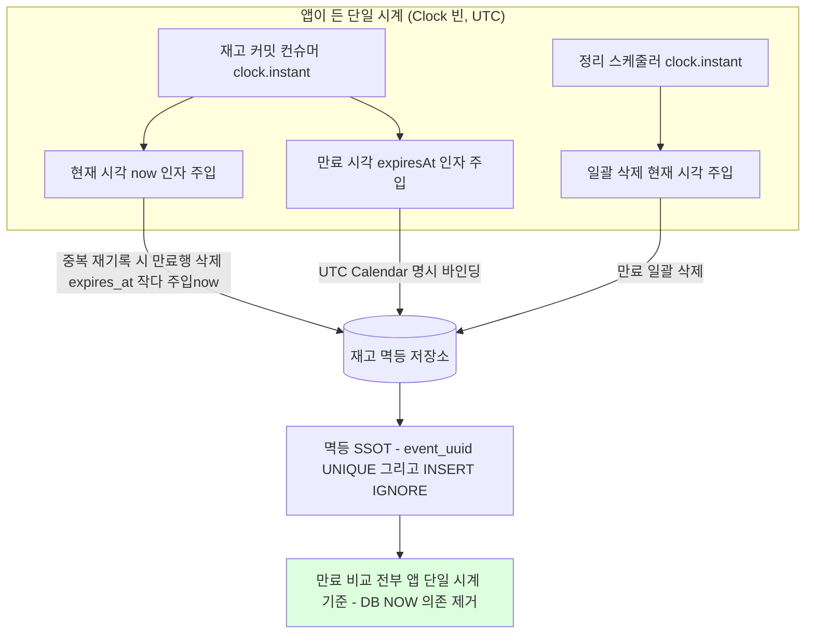
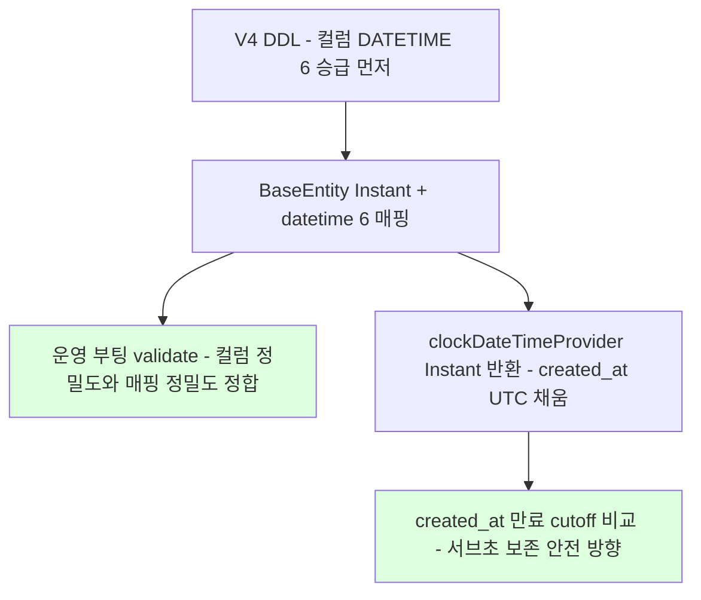

# TIME-MODEL-FOLLOWUP 완료 브리핑

> 시간 모델 잔여 정합 3건 묶음 | 이슈/브랜치 #89 | 2026-06-06 ~ 2026-06-07

## 작업 요약

직전 작업 TIME-MODEL-AND-EXPIRY(#83)는 결제 플랫폼 4개 서비스의 시간 처리를 `Clock`+`Instant`+UTC 저장 단일 표준으로 수렴했지만, 그 시점에 의도적으로 이연한 잔여 누수 3건이 TODOS에 등재돼 남아 있었다([TIME-PRODUCT-NOW-UNIFY] / [TZ-UTC-BACKSTOP] / [BASEENTITY-AUDIT-SOURCE]). 셋은 표면적으로 다른 결함이지만 하나의 축 — "시간 소스가 앱이 든 동일 시계(`Clock` 빈, UTC)로 완전히 수렴했는가" — 위의 잔여였다. 이번 작업은 이 셋을 한 PR로 닫았다.

첫째, **시각 소스 이원화 잔재**. 상품 재고 멱등 저장소(`JdbcEventDedupeStore`)의 `recordIfAbsent` 만료행 삭제 SQL이 `expires_at < NOW()`로 DB 시계에 의존했다. 같은 클래스의 `deleteExpired`는 이미 앱 주입 `Instant`를 쓰는데 `recordIfAbsent`만 `NOW()`로 남아 한 클래스 안에서 시각 소스가 불일치했고, DB `NOW()`가 앱 `Instant`와 일치하는 근거는 오직 `connectionTimeZone=UTC` 단일 설정뿐이었다. 이를 호출자 주입 `Instant`로 통일해 만료 비교 경로에서 DB 시계 의존을 제거했다. 실사용 0건이던 `existsValid`(유효 중복 확인)와, 이번 전환으로 미사용이 된 `Clock` 필드도 함께 제거했다.

둘째, **비-UTC 배포 1차 방어의 암묵성**. 만료 정합은 앱 코드(UTC Calendar, `connectionTimeZone=UTC`, auditing UTC化)로 이미 방어됐으나, 6개 서비스 Dockerfile·JVM·compose 어디에도 시간대가 명시되지 않아 베이스 이미지(temurin) 기본 시간대를 암묵 상속했다. 컨테이너/JVM/구성 파일 3겹으로 `TZ=UTC`를 명시해 1차 방어를 코드 밖 설정으로 명문화했다.

셋째, **감사 컬럼 타입 불일치**. payment `BaseEntity`의 `created_at/updated_at/deleted_at`가 `LocalDateTime`이라 도메인 표준 `Instant`와 어긋났다. 채우는 소스는 이미 UTC(`clockDateTimeProvider`, 직전 DM1)였지만, 타입이 `LocalDateTime`이라 엔티티 매핑 경계에서 수동 `.toInstant(UTC)` 변환이 반복됐다. 이를 `Instant`로 전환하고 컬럼 정밀도를 `DATETIME(6)`로 승급(Flyway V4)해 도메인 표준과 일치시켰다.

결과적으로 18개 태스크로 세 묶음을 닫았고, payment·product 단위+통합 857개 테스트가 통과한다. payment 테스트는 `flyway.enabled=false`(엔티티 기반 create-drop)라 V4 ALTER SQL이 테스트에서 실행되지 않아, verify 단계에서 docker MySQL에 V1→V4를 순차 적용해 ALTER 문법·정밀도 승급·인덱스 보존을 실제 검증했다.

## 핵심 설계 결정

- **D1 — product `recordIfAbsent` 만료 삭제를 앱 주입 `Instant`로 통일**
  - 내용: `SQL_DELETE_EXPIRED_BY_UUID`의 `expires_at < NOW()` → `expires_at < ?`(주입 `Instant`). 포트 `EventDedupeStore.recordIfAbsent`에 `Instant now` 인자 추가. 진입점(`StockCommitConsumer`)이 `now`를 1회 산출해 commit 인자와 `resolveExpiresAt` fallback base에 동일 전달.
  - 근거: 같은 클래스 `deleteExpired`가 이미 주입 `now`를 쓰는데 `recordIfAbsent`만 DB 시계라 불일치. 헥사고날 원칙(현재 시각 권한은 application/진입점, 어댑터는 self `clock.instant()` 금지)과 정합. `connectionTimeZone=UTC` 단일 설정 의존 제거.
  - 기각: (A) 어댑터가 `clock` 직접 호출 → 시계 split 위험 + 헥사고날 위반. (B) `NOW()` 유지 → 이원화 미해소, 본 토픽 목적과 배치.

- **D2 — `existsValid` 전건 제거**
  - 내용: 포트·구현·Fake·contract 테스트·round-trip AC8·cleanup 단정에서 `existsValid` + `SQL_EXISTS_VALID` 제거.
  - 근거: 실사용 0건(application 호출 없음, 테스트로만 검증되던 공개 포트 메서드). NOW() 의존 경로를 `recordIfAbsent` 하나로 축소. 사용자 확인 후 데드 판정.

- **D3 — TZ backstop 3겹**
  - 내용: 6서비스 Dockerfile `ENV TZ=UTC` + `ENTRYPOINT` JVM `-Duser.timezone=UTC` + compose `environment.TZ=UTC`(eureka는 `docker-compose.infra.yml`).
  - 근거: 동일값(UTC) 멱등이라 충돌 없는 defense-in-depth. 어느 경로로 기동해도 UTC 보장. 만료 정합은 이미 앱 코드로 방어돼 회귀 위험 낮음.

- **D4 — BaseEntity audit 컬럼 `Instant` + `DATETIME(6)` 승급**
  - 내용: `created_at/updated_at/deleted_at` `LocalDateTime` → `Instant`, `columnDefinition "datetime"` → `"datetime(6)"`, Flyway V4로 컬럼 ALTER, `clockDateTimeProvider` 반환 타입 `Instant` 동반 전환. `createdAt`의 `updatable=false`(생성 시각 갱신 금지 audit 불변) 보존. 엔티티 매핑 경계 수동 `.toInstant(UTC)` 변환 제거.
  - 근거: 도메인 표준 `Instant`와 타입 일치, 수동 변환 반복 제거. `created_at`이 만료 cutoff 비교 기준이라 정밀도 승급은 cutoff를 서브초만큼 늦추는 안전 방향(조기 만료 없음).
  - **순서 불변(DM-1)**: V4 DDL 정밀도 승급(P13)이 BaseEntity 타입 전환(P14)보다 **반드시 앞** — 그래야 `Instant`+`datetime(6)` 매핑 후 `ddl-auto: validate` 부팅 시 실제 컬럼 정밀도와 정합. (단 payment 테스트는 validate가 아닌 create-drop)

- **D5 — product `connectionTimeZone=UTC` 존치**
  - 내용: NOW() 제거 후에도 datasource URL `connectionTimeZone=UTC&forceConnectionTimeZoneToSession=true` 유지.
  - 근거: raw-JDBC `Timestamp.from(instant)` 바인딩(INSERT IGNORE / DELETE-by-uuid / deleteExpired)의 DB 세션 UTC backstop. 제거 시 다른 경로 회귀 위험.

- **D6 — AC8 round-trip 테스트 재배치**
  - 내용: 비-UTC JVM TZ split-brain 부재 검증(기존 `existsValid` 기반)을 `recordIfAbsent` 만료 DELETE 경계 검증(`expires_at < now` strict, `== now` 동치 보존)으로 갈아끼움.
  - 근거: existsValid 제거로 사라지는 회귀 가드를 폐기하지 않고 통일된 경로로 이전.

## 변경 범위

### Infrastructure / 설정
- **TZ backstop**: `payment-service`/`pg-service`/`product-service`/`user-service`/`eureka-server`/`gateway` Dockerfile 6개 — `ENV TZ=UTC` + `ENTRYPOINT ["java","-Duser.timezone=UTC","-jar","/app/app.jar"]`. `docker/docker-compose.apps.yml`(payment/pg/product/user/gateway) + `docker/docker-compose.infra.yml`(eureka) `environment.TZ=UTC`.
- **product**: `application.yml`/`application-docker.yml` connectionTimeZone=UTC 존치 + 주석 stale 정정(NOW()/existsValid 근거 → raw-JDBC 바인딩 backstop 근거).

### product-service (멱등 만료 시각 통일)
- `EventDedupeStore`(포트): `existsValid(String)` 제거, `recordIfAbsent(String, Instant expiresAt)` → `recordIfAbsent(String eventUUID, Instant now, Instant expiresAt)`.
- `JdbcEventDedupeStore`: `SQL_EXISTS_VALID`·`existsValid` 제거, `SQL_DELETE_EXPIRED_BY_UUID` `NOW()` → `?` 바인딩(`Timestamp.from(now)` + UTC Calendar), 미사용 `clock` 필드·생성자 파라미터 제거.
- `StockCommitUseCase.commit`: `now` 인자 추가·전달(Clock 신설 없음).
- `StockCommitConsumer`: `now = clock.instant()` 단일 산출 → commit 인자 + `resolveExpiresAt` fallback base 동일 전달.
- 테스트: `FakeEventDedupeStore`/`EventDedupeStoreContractTest`/`JdbcEventDedupeStoreRoundTripTest`(AC8 재배치)/`JdbcEventDedupeStoreCleanupTest`/`StockCommitUseCaseTest`/`StockCommitConsumerTest` 정합.

### payment-service (감사 컬럼 Instant 전환)
- `BaseEntity`: audit 3필드 `LocalDateTime` → `Instant`, `columnDefinition "datetime(6)"`, `createdAt updatable=false` 보존.
- `JpaConfig.clockDateTimeProvider`: `LocalDateTime.ofInstant(...)` → `clock.instant()`(`Instant` 반환).
- `PaymentEventEntity`/`PaymentOutboxEntity`: `toDomain` 매핑 경계 수동 `.toInstant(UTC)`/`toInstant(getCreatedAt())` 제거 → getter 직접. `toInstant`/`toLocalDateTime` 헬퍼는 비즈니스 컬럼(`next_retry_at`/`in_flight_at`)용으로 잔존.
- `JpaPaymentEventRepository`: 만료 cutoff native query 주석 정정.
- Flyway `V4__audit_datetime6_upgrade.sql`: 4테이블(`payment_event`/`payment_order`/`payment_outbox`/`payment_history`) × 3컬럼 `DATETIME` → `DATETIME(6)` MODIFY(12구문). nullable·DEFAULT·인덱스 정의 보존.
- 테스트(신규/보강): `BaseEntityAuditTypeTest`(타입 + updatable=false 리플렉션 단정), `PaymentEventEntityTest`/`PaymentOutboxEntityTest`(Instant 직접 매핑 + 헬퍼 잔존), `PaymentEventRepositoryImplTest`(Instant round-trip 보강), `JpaAuditingProviderWiringTest`(Instant 반환 게이트 + dateTimeProviderRef 빈 연결 가드), `JpaConfigClockDateTimeProviderTest`.

## 다이어그램

### 시각 소스 단일 시계 수렴 (to-be)

### 감사 컬럼 정밀도 승급 순서 불변 (DM-1)

## 코드 리뷰 요약

- **discuss**: Critic·Domain Expert 모두 2라운드 안에 pass. existsValid 데드 판정(라이브 0건 코드 조사), admin/presentation 응답 타입이 이미 Instant라 외부 계약 무변경 재검증.
- **plan**: Critic pass, Domain Expert가 critical 1건(순서 재배열 중 P14 BaseEntity 태스크 본문 소실 → orphan 의존)을 잡아 복원, major(P13/P14 순서)·minor 반영 후 재판정 pass. plan-review 게이트 pass(minor 2 정정).
- **review**: Critic·Domain Expert 모두 pass(critical/major 0). minor 5건 — F1(미사용 Clock 필드)·F2(existsValid 문자열 잔재)·F5(stale 주석) 수정(refactor), F4(payment 테스트 Flyway disabled로 V4 미실행) verify 인계, F3(P11 커밋 라벨) 지난 커밋이라 기록만. 재리뷰 2라운드 둘 다 pass, 새 finding 0.
- **verify**: 전체 857 PASS. **review F4 인계 처리** — docker MySQL에 payment migration V1→V4 순차 적용 실검증: ALTER 문법 통과, audit 4테이블 12컬럼 `datetime(6)` 승급 확인, `idx_payment_outbox_status_retry_created`·`idx_payment_history_created_at` 인덱스 정의 보존.

## 수치

| 항목 | 값 |
|------|---|
| 태스크 | 18 (P1~P18) |
| 테스트 | 857 통과 (payment 468+34 / pg 311+7 / product 26+6 / user 1 / gateway 3 / eureka 1) |
| 커밋 | execute 22 + workflow docs 다수 |
| 코드 리뷰 findings | critical 0 / major 0 / minor 5 (3 수정 / 1 verify 인계 / 1 기록) |
| 영구 문서 갱신 | 2 (PITFALLS §6 / ARCHITECTURE) |
| Flyway | V4 (`V4__audit_datetime6_upgrade.sql`) |
| 후속 | (없음 — 3 이연 항목 전부 해소) |
