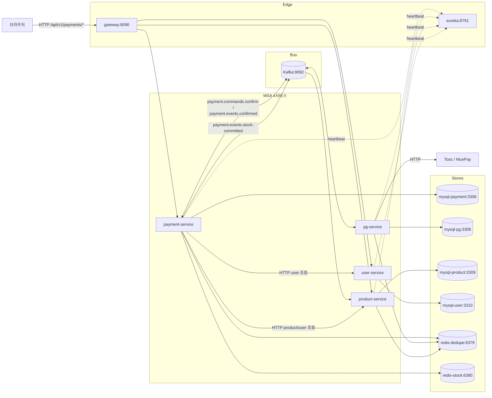

# Architecture

> 최종 갱신: 2026-05-09 (PG-CONFIRM-LISTENER-SPLIT 봉인 — inbox 작업 큐 + 워커 VT + 좀비 폴링 신규 어댑터 위치 반영)

## 개요

payment-platform 은 결제 도메인을 6개 Spring Boot 모듈로 분해한 MSA 시스템이다.

| 모듈 | 책임 |
|---|---|
| `payment-service` | 결제 도메인 본체 — checkout / confirm / status. 비동기 confirm 사이클의 진입점이자 상태 권한자. PG 호출은 직접 하지 않고 Kafka 로 위임 |
| `pg-service` | PG 벤더(Toss / NicePay) 호출 격리. `payment.commands.confirm` 소비 → 벤더 confirm/getStatus → `payment.events.confirmed` 발행 |
| `product-service` | 상품 + 재고 도메인. payment-service 의 HTTP 조회와 Kafka stock 이벤트(`payment.events.stock-committed`) 처리 |
| `user-service` | 사용자 도메인. payment-service 의 HTTP 조회 |
| `gateway` | Spring Cloud Gateway — 단일 진입점(8090). Eureka 기반 라우팅 |
| `eureka-server` | Netflix Eureka — 서비스 디스커버리 |

각 비즈니스 서비스는 독립 MySQL 인스턴스(`mysql-payment`/`mysql-pg`/`mysql-product`/`mysql-user`)를 가지며, 두 Redis(`redis-dedupe`, `redis-stock`)를 용도별로 분리해 공유한다. Kafka 는 양방향 메시징 인프라.

## 토폴로지

## Hexagonal Layer 룰

각 서비스는 동일한 6개 패키지로 구성된다. 4서비스 모두 `com.hyoguoo.paymentplatform.<bounded>` 아래에 같은 트리.

| 패키지 | 역할 | 의존 방향 |
|---|---|---|
| `domain` | 순수 도메인 — Entity, Value Object, 도메인 서비스. Spring 의존 없음 | 의존 없음 (가장 안쪽) |
| `application` | Use case + 입력 포트(`port.in`) + 출력 포트(`port.out`). Spring 만 의존 | `domain` 만 |
| `presentation` | HTTP 진입(`Controller`, request/response DTO). 입력 포트 호출 | `application.port.in` 만 |
| `infrastructure` | 출력 포트 어댑터 — JPA Repository, Kafka Publisher/Consumer, HTTP 클라이언트, Redis 어댑터, Scheduler | `application.port.out` 만 (구현) |
| `core` | 횡단 관심사 — `@Configuration`, AOP, MDC/LogFmt, Filter, KafkaProducer/Consumer 설정 | 모든 layer 가능 (인프라 wiring) |
| `exception` | 도메인·애플리케이션 예외 계층 | `domain` / `application` 에서만 throw |

**핵심 규칙**:
- 도메인 → 외부 의존 0. JPA·Spring 어노테이션 금지
- 입력 포트(`port.in`)는 use case 인터페이스. presentation 만 호출
- 출력 포트(`port.out`)는 의존성 역전 인터페이스. application 이 정의, infrastructure 가 구현
- AOP·이벤트 발행 같은 횡단 관심사는 `core` 또는 `infrastructure/listener` 에서만

## 비동기 confirm 흐름

브라우저 → checkout → PG SDK 창 → confirm → **HTTP 202 즉시 반환** → 비동기 양방향 Kafka 왕복 → 브라우저 status 폴링.

세부는 [`PAYMENT-FLOW.md`](PAYMENT-FLOW.md) 와 [`CONFIRM-FLOW.md`](CONFIRM-FLOW.md) 참조. 핵심 토픽:

| 토픽 | 발행 | 소비 | 책임 |
|---|---|---|---|
| `payment.commands.confirm` | payment-service (최초) + **pg-service self-retry** (attempt<4 시 자기 자신에게 재발행, `pg_outbox.available_at` 기반 지연) | pg-service | confirm 명령 전달 + 재시도 |
| `payment.commands.confirm.dlq` | pg-service (`PgVendorCallService.insertDlqOutbox`, attempt≥4) | (수동) | retry 한도 초과 격리 |
| `payment.events.confirmed` | pg-service | payment-service | PG 결과 회신 (APPROVED/FAILED/QUARANTINED) |
| `payment.events.confirmed.dlq` | Spring Kafka `DefaultErrorHandler` + `DeadLetterPublishingRecoverer` (retry 5회 한도 초과 시) | (수동) | 결과 처리 영구 실패 |
| `payment.events.stock-committed` | payment-service (stock_outbox AFTER_COMMIT) | product-service | 재고 확정 (APPROVED 결제만) |

## 비동기 어댑터 위치 (왜 어디 두는가)

| 어댑터 | 위치 | 이유 |
|---|---|---|
| `OutboxImmediateEventHandler` (`@TransactionalEventListener(AFTER_COMMIT)`) | `payment-service/.../infrastructure/listener` | TX 커밋 직후 발행 트리거. application 의 use case 와 분리해 retry 폴백 워커와 동일 entry point 노출 |
| `OutboxRelayService` | `payment-service/.../application/service` | claim → 발행 → done 의 비즈니스 로직. infrastructure 가 아닌 application — 발행 결정은 도메인 책임 |
| `KafkaMessagePublisher` | `payment-service/.../infrastructure/messaging/publisher` | Spring Kafka 어댑터. 출력 포트 구현 |
| `OutboxWorker` (`@Scheduled`) | `payment-service/.../infrastructure/scheduler` | 폴링 폴백. Spring Scheduler 의존이라 infrastructure |
| `ConfirmedEventConsumer` (`@KafkaListener`) | `payment-service/.../infrastructure/messaging/consumer` | Kafka 입력 어댑터 — `PaymentConfirmResultUseCase` 호출 |
| `PgInboxChannel` + `InboxJob` | `pg-service/.../infrastructure/channel` | inbox **작업 큐** (`LinkedBlockingQueue<InboxJob>` cap=1024) — `InboxJob` 은 `inboxId + otelContext + snapshot`. `InboxReadyEventHandler` (AFTER_COMMIT) 가 offer. Kafka consumer ↔ VT 워커 간 시간차 컨텍스트 경계 처리 |
| `InboxReadyEventHandler` (`@TransactionalEventListener(AFTER_COMMIT)`) | `pg-service/.../infrastructure/listener` | TX 커밋 직후 `PgInboxChannel.offerNow(inboxId)` 호출 — inbox 작업 큐 적재 트리거 |
| `PgInboxImmediateWorker` (`SmartLifecycle`) | `pg-service/.../infrastructure/scheduler` | inbox VT 워커 5개 — 채널에서 `InboxJob` take 후 컨텍스트 복원 → `PgInboxProcessUseCase.processPending` 또는 `processInProgressZombie` 호출 (TX_A → 벤더 → TX_B) |
| `PgInboxPollingWorker` (`@Scheduled`) | `pg-service/.../infrastructure/scheduler` | inbox 좀비 폴링 폴백 (5초 주기) — PENDING 좀비 (`received_at < now-60s`) + IN_PROGRESS 좀비 (`updated_at < now-60s`) 두 경로 회수. 폴링 진입은 OTel 새 root span |
| `PgOutboxChannel` + `OutboxJob` | `pg-service/.../infrastructure/channel` | outbox **발행 큐** (`LinkedBlockingQueue<OutboxJob>` cap=1024) — offer 시점 OTel Context + ContextSnapshot 캡처해 작업에 동봉 |
| `PgOutboxImmediateWorker` (`SmartLifecycle`) | `pg-service/.../infrastructure/scheduler` | outbox VT consumer loop — 채널에서 `OutboxJob` take 후 두 컨텍스트를 자기 스레드에 set 하고 `PgOutboxRelayService.relay` 호출. start/stop 은 Spring `DefaultLifecycleProcessor` 가 자동 호출 |
| `PgOutboxPollingWorker` (`@Scheduled`) | `pg-service/.../infrastructure/scheduler` | outbox 채널 가득참 / 워커 크래시 회복용 폴링 폴백 (2초 주기). RDB `pg_outbox` 직접 픽업 |
| `StockOutboxImmediateEventHandler` | `payment-service/.../infrastructure/listener` | AFTER_COMMIT + `@Async` 로 `StockOutboxRelayService.relay` 트리거 → `payment.events.stock-committed` Kafka publish (TX 와 publish 분리) |
| `KafkaErrorHandlerConfig` | `payment-service/.../infrastructure/config` | Spring Kafka `DefaultErrorHandler` + `DeadLetterPublishingRecoverer` + `FixedBackOff(1000ms, 5)` 빈. not-retryable: `MessageConversionException` / `IllegalArgumentException` / `IllegalStateException`. retry 한도 초과 시 자동으로 `payment.events.confirmed.dlq` 로 publish — 직접 DLQ 호출 / lease 폐기 |
| `ContextAwareVirtualThreadExecutors` | `payment-service` / `pg-service` `core/config/concurrent` | OTel Context + MDC 이중 래핑 VT executor 헬퍼. payment 의 `AsyncConfig.outboxRelayExecutor`, pg 의 `PgOutboxImmediateWorker.relayExecutor` 가 사용 — 호출 시점 컨텍스트를 새 VT 스레드에 자동 캡처·복원 |

## 인프라 별 책임

### MySQL — 4 인스턴스

각 서비스는 독립 DB 를 가진다. 분리 동기:
- 도메인 경계에서 schema 결합 차단
- 운영 시 백업/복구/스케일 분리
- 코드 의존이 HTTP/Kafka 로만 가능 — DB 직접 join 금지

Flyway baseline 은 4서비스 모두 동일 모델 — `V1__<bounded>_schema.sql` (스키마) + 필요 시 `V2__seed_*.sql` (시드). 자세한 운영 가이드는 [`STACK.md`](STACK.md).

### Redis — 2 인스턴스

| Redis | 책임 | 사용처 |
|---|---|---|
| `redis-dedupe` (6379) | checkout 멱등성 store + pg-service 메시지 dedupe | payment-service `IdempotencyStore` (checkout `Idempotency-Key`), pg-service `EventDedupeStore` (markSeen). product-service 는 의존 0 — `JdbcEventDedupeStore` 사용. payment-service 측 events.confirmed dedupe 는 `redis-stock` Lua atomic dedup token 으로 일원화 |
| `redis-stock` (6380) | 재고 선차감 캐시 + Lua atomic dedup token (`StockCachePort`) | payment-service 단독. confirm 진입 시 `decrementAtomic(orderId, orders)` Lua 1회 호출 (결제 단위 N개 atomic + `decrement:done:{orderId}` SETNX P8D), FAILED/QUARANTINED 회신 시 `compensateAtomic(orderId, orders)` Lua 1회 (결제 단위 N개 atomic + `compensation:done:{orderId}` SETNX P8D). 결과 enum: `StockDecrementAtomicResult` (OK / ALREADY_DONE / INSUFFICIENT) / `StockCompensationAtomicResult` (OK / ALREADY_DONE). product RDB 가 SoT, 본 캐시는 그것의 미러 — 부팅 직후 `scripts/seed-stock.sh` 가 mysql-product 에서 SELECT → redis SET 으로 시드. AOF `appendfsync=always` 운영 (L2 race window 완화 trade-off) |

### Kafka

- broker 1대(`kafka:9092`), KRaft 모드, auto-create 비활성
- 토픽 사전 생성: `scripts/smoke/create-topics.sh`
- 파티션 / replication-factor / min.insync.replicas 검증: `scripts/smoke/kafka-topic-config.sh`
- Spring Kafka `@KafkaListener` + `KafkaTemplate`. Producer 측 traceparent 전파 위해 자체 생성 ProducerFactory 들에도 `ObservationRegistry` 를 명시적으로 wiring 한다.

### Eureka + Gateway

- Eureka(`payment-eureka:8761`) — 5앱 등록 (PAYMENT-SERVICE / PG-SERVICE / PRODUCT-SERVICE / USER-SERVICE / GATEWAY — `spring.application.name` 기준 대문자화)
- Gateway(`payment-gateway:8090`) — 외부 단일 진입점. Eureka discovery 기반 라우팅

## 횡단 관심사

| 관심사 | 위치 | 비고 |
|---|---|---|
| Tracing | `core/config/AsyncConfig`, `core/config/concurrent/ContextAwareVirtualThreadExecutors`, infrastructure messaging/listener | OTel — Servlet/VT/Async/Kafka producer/consumer 모든 경계에서 traceparent 전파. pg-service in-memory channel 은 `OutboxJob` 동봉으로 명시 캡처·복원 |
| MDC + LogFmt | `core/common/log/LogFmt` (모든 서비스) | 모든 로그가 `key=value` 직렬화 + traceparent 자동 첨부 |
| AOP `@PublishDomainEvent` + `@PaymentStatusChange` | 어노테이션 정의: `application/aspect/annotation/` / 구현: `infrastructure/aspect/DomainEventLoggingAspect` (payment), `infrastructure/aspect/TossApiMetricsAspect` (pg) | `payment_history` audit trail 자동 기록 + Toss 호출 메트릭 |
| Metrics | `core/common/metrics` (payment 공통), `infrastructure/metrics/*` (서비스별 Micrometer 카운터/타이머 등록) | Prometheus 노출 — `payment_quarantined_total`, `stock_kafka_publish_fail_total`, `pg_outbox.relay_fail_total` 등 |

## 핵심 설계 결정 인덱스 (현재 운영 중)

| 결정 | 적용 위치 |
|---|---|
| 비동기 confirm 아키텍처 | payment-service `OutboxAsyncConfirmService` + Kafka 양방향 |
| 격리 트리거 (CACHE_DOWN / 판단 불가) | `QuarantineCompensationHandler` |
| AMOUNT_MISMATCH 양방향 방어 | pg `ConfirmedEventPayload(amount, approvedAt)` + payment `handleApproved` 대조 |
| 분산 멱등성 store | payment-service: Lua atomic dedup token (`decrement:done:{orderId}` / `compensation:done:{orderId}` SETNX P8D, redis-stock 에 통합) — pg / product 는 RDB JDBC dedupe (아래 사유 참고) |
| business inbox amount | pg `pg_inbox.amount BIGINT` |
| HTTP 어댑터 회복성 | 부분 — contract test 적용. CircuitBreaker 는 Phase 4 |
| DB 분리 | 4 MySQL 인스턴스 (DB per service) |
| Kafka 토픽 + dedupe TTL 정책 | 5 토픽 (운영 3 + DLQ 2), dedupe TTL P8D |
| `ConfirmedEvent` 계약 확장 | pg → payment 메시지에 amount / approvedAt non-null 강제 |
| Stock publish AFTER_COMMIT 분리 | TX commit 후 stock-committed 발행 |
| Redis DECR 보상 | TX 실패 시 stock cache INCR 로 보상 |
| Final Confirmation Gate (FCG) | 복구 사이클 한도 소진 시 벤더 getStatus 1회 재조회 |
| RecoveryDecision 값 객체 | payment 측 복구 판정 SSOT |
| 재고 복구 가드 (TX 내 재조회) | `executePaymentFailureCompensationWithOutbox` |
| pg-service IN_PROGRESS retry 활성화 | `PgConfirmService.handleInProgress(command, attempt)` — vendor 재호출 + 멱등성 layer 3종(vendor/pg/payment) 의존 |
| pg-service listener TX 분리 + inbox 작업 큐 | `PgInboxPendingService` (listener TX 5s, INSERT IGNORE + publishEvent) → `InboxReadyEventHandler` (AFTER_COMMIT) → `PgInboxChannel` (cap=1024) → `PgInboxImmediateWorker` (VT 5) — listener 스레드에서 벤더 호출 0 보장 |
| pg-service inbox 좀비 회수 | `PgInboxPollingWorker` 60s 주기 — PENDING 좀비 (received_at) + IN_PROGRESS 좀비 (updated_at) 두 경로. native query `FOR UPDATE SKIP LOCKED` 로 멀티 워커 race 차단 |
| pg-service inbox 보정 경로 PENDING 우회 | `DuplicateApprovalHandler.handleDbAbsent*` 가 `transitDirectToTerminal` / `transitDirectToInProgress` 사용 — PENDING 거치지 않음 (보정 경로는 결과를 박는 행위지 처리 시작이 아님) |

상세 history 는 archive 안 토픽별 `COMPLETION-BRIEFING.md` / `*-CONTEXT.md`.

## 결정 사유 — Dedupe 저장소 선택

세 비즈니스 서비스의 dedupe 어댑터가 서로 다른 저장소 사용:

| 서비스 | 어댑터 | 저장소 | dedupe 후 작업 | atomicity 강제 |
|---|---|---|---|---|
| payment | Lua atomic dedup token (`stock_decrement_atomic.lua` / `stock_compensation_atomic.lua` 안에서 SETNX) | Redis (redis-stock) | 같은 Lua 안에서 재고 DECR / INCR + dedup token 박기 (atomic) | **강함** — Lua 스크립트가 single-shot atomic. 차감/보상 + 멱등 표시가 한 KEYS 호출 안에서 commit |
| pg | `EventDedupeStore.markSeen` (Redis) + `PgInboxRepository.markSeen` (MySQL pg_inbox) — **2-layer** | Redis (TX 외부 빠른 거름) + MySQL (TX 내부 atomic 거름) | pg_inbox / pg_outbox 상태 전이 (RDB) | **강함** — RDB layer 가 같은 TX 필수, Redis layer 는 보조 |
| product | `JdbcEventDedupeStore` | MySQL (stock_commit_dedupe) | Stock 재고 차감 (RDB) | **강함** — 같은 TX 필수 |

**결정 룰 한 줄**:
> dedupe 와 그 이후 작업이 같은 자원 안에서 atomic 으로 묶이는 메커니즘을 우선한다 — RDB 면 같은 TX, Redis 면 같은 Lua.

**왜 이 룰인가**:
- Redis 와 RDB 는 서로 다른 시스템이라 `@Transactional` 이 둘을 같이 묶지 못함. 부분 실패 (Redis 기록 후 RDB 실패) 시 "이미 처리됨" 판정으로 후속 영영 멈춤 = **돈 새는 경로**
- product / pg 는 atomicity 가 도메인 정확성의 본질 → 같은 RDB 위에 dedupe 테이블 두기 → 같은 TX 로 commit/rollback
- payment 의 재고 차감/보상은 Redis 단일 자원 변경 — 같은 Lua 스크립트 안에서 DECR/INCR 와 dedup token SETNX 를 묶어 single-shot atomic 보장. 메시지 단위 lease (이전 `EventDedupeStore` two-phase) 는 in-memory 성능 의미만 가졌을 뿐 후속 RDB 작업과 같은 TX 가 아니라 silent loss 위험이 있어 본 토픽에서 폐기

**구현 디테일**:
- **payment**: `stock_decrement_atomic.lua` / `stock_compensation_atomic.lua` — KEYS 에 `stock:{productId}` 들 + `decrement:done:{orderId}` (또는 `compensation:done:{orderId}`) 동봉. 한 호출 안에서 dedup token SETNX → 이미 박혀 있으면 `ALREADY_DONE` early return, 아니면 N개 상품 DECR/INCR + dedup token SETNX P8D. 메시지 dedupe 는 Spring Kafka native 에러 핸들러 (retry + DLQ) 가 별도 layer 로 처리
- **pg**: pg_inbox 테이블 + UPSERT (markSeen). 같은 TX 안에서 inbox 상태 전이까지
- **product**: stock_commit_dedupe 테이블 + DELETE 만료 + INSERT IGNORE. 같은 TX 안에서 재고 차감까지

**대안 비교** (모두 검토 후 현재 안이 채택):
- 모두 Redis 통일 → product / pg 의 atomicity 깨짐, 부분 실패 위험
- 모두 RDB 통일 → payment 의 lease 패턴이 row lock 점유로 in-memory 성능 손실, 운영 추가 부담 (테이블 cleanup)
- 현재 채택 — 도메인 요구별 적합한 저장소

**Phase 4 후속**:
- TC-7 (outbox retry 정책 정렬) 와 별개
- product / pg 의 dedupe 테이블 cleanup 스케줄러 부재 → 만료 row 누적 시 운영 부담. 부하 측정 후 도입 결정 가치

## 다음 토픽

PHASE-4 — Toxiproxy 8종 장애 주입 + k6 시나리오 재설계 + 로컬 오토스케일러. 본 토폴로지를 그대로 두고 회복성 검증.
