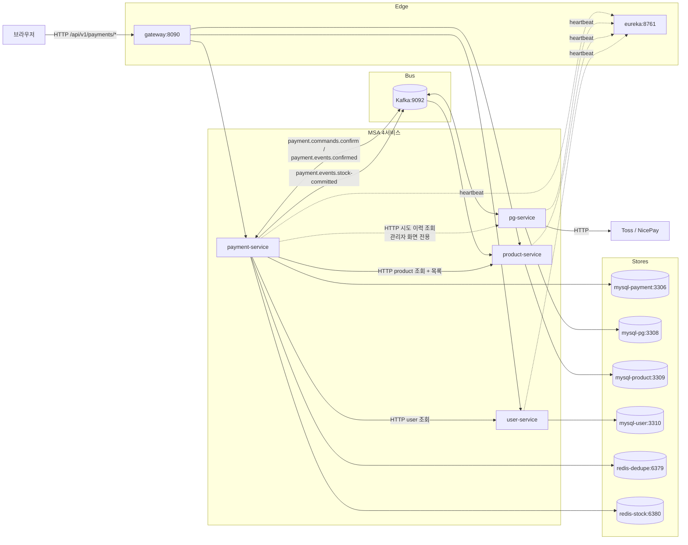

# Architecture

> 최종 갱신: 2026-08-14 (PG-VENDOR-SIGNAL-CONSOLIDATION — 핵심 설계 결정 인덱스의 FCG 행을 "(미연결)"에서 실제 배선 상태로 정정: 실패 대기열 소비가 관문에 위임, 조회/반영 TX 2단계 분리, 금액 대조 선행, 부분 취소 전용 사유 격리, 격리 사유 4종). 이전: 2026-08-11 (PG-MESSAGE-DEDUPE-LAYER-REMOVAL — dedupe 저장소 표의 pg 행을 2-layer 에서 `pg_inbox.order_id` UNIQUE 단일 층으로 정정, 구현 디테일의 존재하지 않는 `PgInboxRepository.markSeen` 표기를 실제 `insertPending`(INSERT IGNORE) 으로 교체). 이전: 2026-07-28 (ADMIN-VISIBILITY — layer 표의 `presentation` 의존 방향을 실제 관례(입력 포트 선언 위치가 `presentation/port/`, `application/port/in/` 은 pg `PgInboxProcessUseCase` 단독 예외)로 정정 + 핵심 규칙에 "presentation 은 출력 포트를 직접 호출하지 않는다" 명문화(ship 리뷰 major)). 이전: 2026-07-11 (DLQ-QUARANTINE-RECOVERY — 어댑터 위치 표에 `KafkaDlqReprocessAdapter`(`DlqReprocessPort` 구현, offset 미커밋 스캔 → 원 토픽 재발행) 추가 + 핵심 설계 결정 인덱스에 격리 관리자 수동 종결(`QuarantineResolveUseCase`, 토큰 조건부 보상·CAS 전이)·DLQ 관리자 수동 재주입(`DlqReprocessUseCase`, 나이 게이트) 2행 추가 + `events.confirmed.dlq` 소비자 서술을 "(관리자 수동 재주입)"으로 정정). 이전: 2026-07-03 (DOCS-CONSISTENCY-OVERHAUL Task 10 — 핵심 설계 결정 인덱스의 FCG/RecoveryDecision 행이 stale 마커 게이트 재검증에서 신규 발견, `PgFinalConfirmationGate`(프로덕션 호출처 0)·`RecoveryDecision`(클래스 완전 삭제) 을 현재형처럼 서술하던 것을 각각 "(미연결)"/"(폐기)" 명시로 정정). 이전: 2026-07-03 (Task 9 — CircuitBreaker 행에 상세 근거 문서(`INTEGRATIONS.md`) 링크 추가, S4 중복 SSOT 정리), 2026-07-01 (context-update 헤더 동기화 — metrics 섹션 `DependencyHealthMetrics`/availability 알람 소비 본문은 FAULT-INJECTION 6/30 ship 에서 이미 반영됨)

## 개요

payment-platform 은 결제 도메인을 6개 Spring Boot 모듈로 분해한 MSA 시스템이다.

| 모듈 | 책임 |
|---|---|
| `payment-service` | 결제 도메인 본체 — checkout / confirm / status. 비동기 confirm 사이클의 진입점이자 상태 권한자. PG 호출은 직접 하지 않고 Kafka 로 위임 |
| `pg-service` | PG 벤더(Toss / NicePay) 호출 격리. `payment.commands.confirm` 소비 → 벤더 confirm/getStatus → `payment.events.confirmed` 발행 |
| `product-service` | 상품 + 재고 도메인. payment-service 의 HTTP 조회와 Kafka stock 이벤트(`payment.events.stock-committed`) 처리 |
| `user-service` | 사용자 도메인. payment-service 의 HTTP 조회 |
| `gateway` | Spring Cloud Gateway — 단일 진입점(8090). Eureka 기반 라우팅 |
| `eureka-server` | Netflix Eureka — 서비스 디스커버리 |

각 비즈니스 서비스는 독립 MySQL 인스턴스(`mysql-payment`/`mysql-pg`/`mysql-product`/`mysql-user`)를 가진다. 두 Redis(`redis-dedupe`, `redis-stock`)는 용도별로 분리돼 있으나 **payment-service 만 사용한다** — checkout 요청 멱등성(dedupe)과 재고 선차감(stock). pg-service 는 PG-MESSAGE-DEDUPE-LAYER-REMOVAL 로 캐시 의존을 걷어냈고, product-service 는 처음부터 RDB dedupe 만 쓴다. Kafka 는 양방향 메시징 인프라.

## 토폴로지

```mermaid
flowchart LR
    Browser["브라우저"]

    subgraph Edge
        GW["gateway:8090"]
        E["eureka:8761"]
    end

    subgraph Apps["MSA 4서비스"]
        Pay["payment-service"]
        Pg["pg-service"]
        Prod["product-service"]
        Usr["user-service"]
    end

    subgraph Stores
        MyP[("mysql-payment:3306")]
        MyG[("mysql-pg:3308")]
        MyPr[("mysql-product:3309")]
        MyU[("mysql-user:3310")]
        RedD[("redis-dedupe:6379")]
        RedS[("redis-stock:6380")]
    end

    subgraph Bus
        K[("Kafka:9092")]
    end

    Browser -->|"HTTP /api/v1/payments/*"| GW
    GW --> Pay & Prod & Usr
    Pay & Pg & Prod & Usr -. heartbeat .-> E

    Pay --> MyP
    Pg  --> MyG
    Prod --> MyPr
    Usr --> MyU

    Pay --> RedD
    Pay --> RedS

    Pay <-->|"payment.commands.confirm /\npayment.events.confirmed"| K
    K <--> Pg
    Pay -->|"payment.events.stock-committed"| K
    K --> Prod

    Pg -->|HTTP| Vendor["Toss / NicePay"]
    Pay -->|HTTP product 조회 + 목록| Prod
    Pay -->|HTTP user 조회| Usr
    Pay -.->|"HTTP 시도 이력 조회<br/>관리자 화면 전용"| Pg
```

## Hexagonal Layer 룰

각 서비스는 동일한 6개 패키지로 구성된다. 4서비스 모두 `com.hyoguoo.paymentplatform.<bounded>` 아래에 같은 트리.

| 패키지 | 역할 | 의존 방향 |
|---|---|---|
| `domain` | 순수 도메인 — Entity, Value Object, 도메인 서비스. Spring 의존 없음 | 의존 없음 (가장 안쪽) |
| `application` | Use case + 입력 포트(`port.in`) + 출력 포트(`port.out`). Spring 만 의존 | `domain` 만 |
| `presentation` | HTTP 진입(`Controller`, request/response DTO) + 입력 포트 선언(`presentation/port`). 입력 포트 호출 | 입력 포트 만 (출력 포트 직접 호출 금지) |
| `infrastructure` | 출력 포트 어댑터 — JPA Repository, Kafka Publisher/Consumer, HTTP 클라이언트, Redis 어댑터, Scheduler | `application.port.out` 만 (구현) |
| `core` | 횡단 관심사 — `@Configuration`, AOP, MDC/LogFmt, Filter, KafkaProducer/Consumer 설정 | 모든 layer 가능 (인프라 wiring) |
| `exception` | 도메인·애플리케이션 예외 계층 | `domain` / `application` 에서만 throw |

**핵심 규칙**:
- 도메인 → 외부 의존 0. JPA·Spring 어노테이션 금지
- 입력 포트는 use case 인터페이스. presentation 만 호출한다. **선언 위치는 `presentation/port/`가 지배 관례** — payment 8종(`AdminPaymentService`·`PaymentCheckoutService`·`PgAttemptHistoryViewService` 등) / pg 2종 / product 2종 / user 1종이 모두 여기 있고, 구현체는 `application/` 루트 또는 `application/usecase/`에 둔다. `application/port/in/`은 pg-service `PgInboxProcessUseCase` 하나뿐인 예외다
- **presentation 이 출력 포트(`port.out`)를 직접 호출하지 않는다.** 조회 실패 흡수·폴백 판단 같은 로직도 입력 포트 구현(application)에 두고, 컨트롤러는 결과를 모델에 담는 일만 한다 (ADMIN-VISIBILITY ship 리뷰 major)
- 출력 포트(`port.out`)는 의존성 역전 인터페이스. application 이 정의, infrastructure 가 구현
- AOP·이벤트 발행 같은 횡단 관심사는 `core` 또는 `infrastructure/listener` 에서만

## 비동기 confirm 흐름

브라우저 → checkout → PG SDK 창 → confirm → **HTTP 202 즉시 반환** → 비동기 양방향 Kafka 왕복 → 브라우저 status 폴링.

세부는 [`PAYMENT-FLOW.md`](PAYMENT-FLOW.md) 와 [`CONFIRM-FLOW.md`](CONFIRM-FLOW.md) 참조. 핵심 토픽:

| 토픽 | 발행 | 소비 | 책임 |
|---|---|---|---|
| `payment.commands.confirm` | payment-service (최초) + **pg-service self-retry** (attempt<4 시 자기 자신에게 재발행, `pg_outbox.available_at` 기반 지연) | pg-service | confirm 명령 전달 + 재시도 |
| `payment.commands.confirm.dlq` | pg-service (`PgVendorCallService.insertDlqOutbox`, attempt≥4) | pg-service (`PaymentConfirmDlqConsumer` → `PgDlqService` QUARANTINED 자동 격리) | retry 한도 초과 격리 |
| `payment.events.confirmed` | pg-service | payment-service | PG 결과 회신 (APPROVED/FAILED/QUARANTINED) |
| `payment.events.confirmed.dlq` | Spring Kafka `DefaultErrorHandler` + `DeadLetterPublishingRecoverer` (retry 5회 한도 초과 시) | (관리자 수동 재주입 — `KafkaDlqReprocessAdapter`) | 결과 처리 영구 실패 |
| `payment.events.stock-committed` | payment-service (EOS producer tx 안에서 직접 발행 — `stockCommittedKafkaTemplate`) | product-service | 재고 확정 (APPROVED 결제만) |

## 비동기 어댑터 위치 (왜 어디 두는가)

| 어댑터 | 위치 | 이유 |
|---|---|---|
| `OutboxImmediateEventHandler` (`@TransactionalEventListener(AFTER_COMMIT)`) | `payment-service/.../infrastructure/listener` | TX 커밋 직후 발행 트리거. application 의 use case 와 분리해 retry 폴백 워커와 동일 entry point 노출 |
| `OutboxRelayService` | `payment-service/.../application/service` | claim → 발행 → done 의 비즈니스 로직. infrastructure 가 아닌 application — 발행 결정은 도메인 책임 |
| `KafkaMessagePublisher` | `payment-service/.../infrastructure/messaging/publisher` | Spring Kafka 어댑터. 출력 포트 구현 |
| `OutboxWorker` (`@Scheduled`) | `payment-service/.../infrastructure/scheduler` | 폴링 폴백. Spring Scheduler 의존이라 infrastructure |
| `ConfirmedEventConsumer` (`@KafkaListener`) | `payment-service/.../infrastructure/messaging/consumer` | Kafka 입력 어댑터 — `PaymentConfirmResultUseCase` 호출 |
| `PgInboxChannel` + `InboxJob` | `pg-service/.../infrastructure/channel` | inbox **작업 큐** (`LinkedBlockingQueue<InboxJob>` cap=1024) — `InboxJob` 은 `inboxId + otelContext + snapshot`. `InboxReadyEventHandler` (AFTER_COMMIT) 가 offer. Kafka consumer ↔ VT 워커 간 시간차 컨텍스트 경계 처리 |
| `InboxReadyEventHandler` (`@TransactionalEventListener(AFTER_COMMIT)`) | `pg-service/.../infrastructure/listener` | TX 커밋 직후 `PgInboxChannel.offerNow(inboxId)` 호출 — inbox 작업 큐 적재 트리거 |
| `PgInboxImmediateWorker` (`AbstractImmediateWorker` 상속, `SmartLifecycle`) | `pg-service/.../infrastructure/scheduler` | inbox VT 워커 5개 — 채널에서 `InboxJob` take 후 컨텍스트 복원 → `PgInboxProcessUseCase.processPending` 또는 `processInProgressZombie` 호출 (TX_A → 벤더 → TX_B) |
| `PgInboxPollingWorker` (`@Scheduled`) | `pg-service/.../infrastructure/scheduler` | inbox 좀비 폴링 폴백 (5초 주기) — PENDING 좀비 (`received_at < now-60s`) + IN_PROGRESS 좀비 (`updated_at < now-60s`) 두 경로 회수. 폴링 회수 시 `pg_inbox.stored_traceparent` 로 부모 추적 복원 (`TraceparentExtractor`, EOS-FOLLOWUP-CLEANUP — 이전 OTel 새 root span 에서 변경) |
| `PgOutboxChannel` + `OutboxJob` | `pg-service/.../infrastructure/channel` | outbox **발행 큐** (`LinkedBlockingQueue<OutboxJob>` cap=1024) — offer 시점 OTel Context + ContextSnapshot 캡처해 작업에 동봉 |
| `PgOutboxImmediateWorker` (`AbstractImmediateWorker` 상속, `SmartLifecycle`) | `pg-service/.../infrastructure/scheduler` | outbox VT consumer loop — 채널에서 `OutboxJob` take 후 두 컨텍스트를 자기 스레드에 set 하고 `PgOutboxRelayService.relay` 호출. SmartLifecycle 골격(start/stop/getPhase/workerLoop/`runWithContext`)은 `AbstractImmediateWorker` 공통 base, start/stop 은 Spring `DefaultLifecycleProcessor` 가 자동 호출 |
| `PgOutboxPollingWorker` (`@Scheduled`) | `pg-service/.../infrastructure/scheduler` | outbox 채널 가득참 / 워커 크래시 회복용 폴링 폴백 (2초 주기). RDB `pg_outbox` 직접 픽업 |
| `JdbcPaymentEventDedupeStore` | `payment-service/.../infrastructure/dedupe` | `payment_event_dedupe` INSERT IGNORE 어댑터. `PaymentEventDedupeStore` 포트 구현 (PET-5). EOS 트랜잭션 안에서 멱등 마킹. `deleteExpired(Instant, int)` 만료 행 일괄 삭제 추가 (EOS-FOLLOWUP-CLEANUP) |
| `DedupeCleanupWorker` (payment, `@Scheduled`) | `payment-service/.../infrastructure/scheduler` | `payment_event_dedupe` 만료 행 (`expires_at < now`) 주기 청소. `Clock` 주입으로 현재 시각 획득 (TIME-MODEL-AND-EXPIRY). `payment_event_dedupe.cleanup_deleted_total` 카운터 (EOS-FOLLOWUP-CLEANUP) |
| `DedupeCleanupWorker` (product, `@Scheduled`) | `product-service/.../infrastructure/scheduler` | `stock_commit_dedupe` 만료 행 주기 청소. `Clock` 주입 (`ClockConfig`, TIME-MODEL-AND-EXPIRY). `SchedulerConfig` (`@EnableScheduling` + `@ConditionalOnProperty scheduler.enabled`) 로 활성 게이트 (EOS-FOLLOWUP-CLEANUP) |
| `TraceparentExtractor` | `pg-service/.../infrastructure/trace` | OTel `W3CTraceContextPropagator` 래핑 — `extractFromCurrentContext` / `restoreContext`. consumer 가 추출한 traceparent 를 `pg_inbox.stored_traceparent` 에 RDB 저장 → 폴링 회수 시 부모 추적 복원. 관측성 전용, 비즈니스 비참여 (EOS-FOLLOWUP-CLEANUP) |
| `KafkaConsumerConfig` | `payment-service/.../infrastructure/config` | `kafkaListenerContainerFactory` 명시 정의 + `KafkaTransactionManager(stockCommittedProducerFactory)` wire-in (EOS consumer). `isolation.level=read_committed` 는 `application.yml` `spring.kafka.consumer.properties.isolation.level` 로 적용 |
| `KafkaProducerConfig` (EOS) | `payment-service/.../infrastructure/config` | EOS-aware `stockCommittedProducerFactory` + `KafkaTransactionManager` + `stockCommittedKafkaTemplate` 빈 (transactional.id prefix = `${spring.application.name}-${HOSTNAME:local}-`, enable.idempotence=true, transaction.timeout.ms=10000) |
| `KafkaErrorHandlerConfig` | `payment-service/.../infrastructure/config` | Spring Kafka `DefaultErrorHandler` + `DeadLetterPublishingRecoverer` + `FixedBackOff(1000ms, 5)` 빈. not-retryable: `MessageConversionException` / `IllegalArgumentException` / `IllegalStateException`. retry 한도 초과 시 자동으로 `payment.events.confirmed.dlq` 로 publish |
| `KafkaDlqReprocessAdapter` | `payment-service/.../infrastructure/messaging/publisher` | `DlqReprocessPort` 구현. `events.confirmed.dlq` 를 offset 미커밋으로 스캔(대상 페이로드 조회, 타임아웃 vs 없음 구분)해 원 토픽 `events.confirmed` 로 재발행. 실패하는 EOS tx 와 분리된 비트랜잭션 `confirmedKafkaTemplate` 사용 |
| `ContextAwareVirtualThreadExecutors` | `payment-service` / `pg-service` `core/config/concurrent` | OTel Context + MDC 이중 래핑 VT executor 헬퍼. payment 의 `AsyncConfig.outboxRelayExecutor`, pg 의 `PgOutboxImmediateWorker.relayExecutor` 가 사용 — 호출 시점 컨텍스트를 새 VT 스레드에 자동 캡처·복원 |

## 인프라 별 책임

### MySQL — 4 인스턴스

각 서비스는 독립 DB 를 가진다. 분리 동기:
- 도메인 경계에서 schema 결합 차단
- 운영 시 백업/복구/스케일 분리
- 코드 의존이 HTTP/Kafka 로만 가능 — DB 직접 join 금지

Flyway baseline 은 4서비스 모두 동일 모델 — `V1__<bounded>_schema.sql` (스키마) + 필요 시 `V2__seed_*.sql` (시드). 자세한 운영 가이드는 [`STACK.md`](STACK.md).

### Redis — 2 인스턴스

| Redis | 책임 | 사용처 |
|---|---|---|
| `redis-dedupe` (6379) | checkout 멱등성 store | payment-service `IdempotencyStore` (checkout `Idempotency-Key`) **전용**. pg-service 는 PG-MESSAGE-DEDUPE-LAYER-REMOVAL 로 의존 해제(라이브러리까지), product-service 는 처음부터 의존 0 — `JdbcEventDedupeStore` 사용. payment-service 측 events.confirmed 메시지 dedupe 는 `payment_event_dedupe` MySQL INSERT IGNORE (`JdbcPaymentEventDedupeStore`) 로 EOS 트랜잭션 안에서 처리. 재고 차감/보상 멱등은 `redis-stock` Lua atomic dedup token 으로 별도 보장 |
| `redis-stock` (6380) | 재고 선차감 캐시 + Lua atomic dedup token (`StockCachePort`) | payment-service 단독. confirm 진입 시 `decrementAtomic(orderId, orders)` Lua 1회 호출 (결제 단위 N개 atomic + `decrement:done:{orderId}` SETNX P8D), FAILED/QUARANTINED 회신 시 `compensateAtomic(orderId, orders)` Lua 1회 (결제 단위 N개 atomic + `compensation:done:{orderId}` SETNX P8D). 결과 enum: `StockDecrementAtomicResult` (OK / ALREADY_DONE / INSUFFICIENT) / `StockCompensationAtomicResult` (OK / ALREADY_DONE). product RDB 가 SoT, 본 캐시는 그것의 미러 — 부팅 직후 `scripts/seed-stock.sh` 가 mysql-product 에서 SELECT → redis SET 으로 시드. 부팅 외 발산 보정은 운영 단건 resync(`POST /admin/stock/resync/{productId}` → `StockCachePort.set`, 트래픽 조용한 시점 전제 — in-flight 선차감 덮어쓰기 주의). AOF `appendfsync=always` 운영 (L2 race window 완화 trade-off) |

### Kafka

- broker 1대(`kafka:9092`), KRaft 모드, auto-create 비활성
- 토픽 사전 생성: `scripts/smoke/create-topics.sh`
- 파티션 / replication-factor / min.insync.replicas 검증: `scripts/smoke/kafka-topic-config.sh`
- Spring Kafka `@KafkaListener` + `KafkaTemplate`. Producer 측 traceparent 전파 위해 자체 생성 ProducerFactory 들에도 `ObservationRegistry` 를 명시적으로 wiring 한다.

### Eureka + Gateway

- Eureka(`payment-eureka:8761`) — 5앱 등록 (PAYMENT-SERVICE / PG-SERVICE / PRODUCT-SERVICE / USER-SERVICE / GATEWAY — `spring.application.name` 기준 대문자화)
- Gateway(`payment-gateway:8090`) — 외부 단일 진입점. Eureka discovery 기반 라우팅

## 횡단 관심사

| 관심사 | 위치 | 비고 |
|---|---|---|
| Tracing | `core/config/AsyncConfig`, `core/config/concurrent/ContextAwareVirtualThreadExecutors`, infrastructure messaging/listener, pg `infrastructure/trace/TraceparentExtractor` | OTel — Servlet/VT/Async/Kafka producer/consumer 모든 경계에서 traceparent 전파. pg-service in-memory channel 은 `OutboxJob` 동봉으로 명시 캡처·복원. pg-service inbox 폴링 회수 경로는 `pg_inbox.stored_traceparent` RDB 보관 → `TraceparentExtractor` 로 부모 추적 복원 (좀비 회수도 원 Kafka 메시지 추적과 연결) |
| MDC + LogFmt | `core/common/log/LogFmt` (모든 서비스) | 모든 로그가 `key=value` 직렬화 + traceparent 자동 첨부 |
| AOP `@PublishDomainEvent` + `@PaymentStatusChange` | 어노테이션 정의: `application/aspect/annotation/` / 구현: `infrastructure/aspect/DomainEventLoggingAspect` (payment), `infrastructure/aspect/TossApiMetricsAspect` (pg) | `payment_history` audit trail 자동 기록 + Toss 호출 메트릭 |
| Metrics | `core/common/metrics` (payment 공통: `PaymentEventFlowMetrics`/`PaymentConfirmGuardSkipMetrics`/`PaymentConfirmTerminalResendMetrics`/`PaymentTransitionMetrics`/`PaymentStateMetrics`/`PaymentQuarantineMetrics`), `infrastructure/metrics/*` (서비스별 Micrometer 카운터/타이머; 4서비스 `DependencyHealthMetrics` = `dependency_up{component}`/`dependency_health_last_poll_timestamp_seconds` 의존성 가용성 폴링 게이지 — DataSource·RedisConnectionFactory 직접 조회를 2s 타임아웃 가드로 감싸 노출, availability 알람 그룹 소비) | Prometheus 노출 — funnel `payment_event_published_total`/`terminal_total`(발행=`PaymentCreateUseCase` READY / 종결=`PaymentStatusMetricsAspect` `isTerminal()` SSOT), `payment_confirm_guard_skip_total{status}`(가드 noop, eager 6종), `payment_confirm_terminal_resend_total{status}`(종결 가드 DONE+APPROVED 재발행, eager DONE 1종, CONFIRM-APPROVED-RESEND-GAP), `payment_quarantined_total`, `*_dedupe.cleanup_failed_total`, `kafka_producer_txn_*`(EOS producer Micrometer 리스너) 등. 관측 코드는 never-throw·결제 흐름 비참여 |

## 핵심 설계 결정 인덱스 (현재 운영 중)

| 결정 | 적용 위치 |
|---|---|
| 비동기 confirm 아키텍처 | payment-service `OutboxAsyncConfirmService` + Kafka 양방향 |
| 격리 트리거 (CACHE_DOWN / 판단 불가) | `QuarantineCompensationHandler` |
| 격리 결제 관리자 수동 종결 | `QuarantineResolveUseCase` — `decrement:done` 토큰 존재 시에만 재고 보상(`compensateIfDecremented`, 유령 재고 방지) → `resolveQuarantineToFailed` CAS(event `WHERE status='QUARANTINED'` + order 동조) FAILED 전이 + audit. 관리자 진입: `PaymentRecoveryAdminService` + `PaymentAdminController`. 정상 결제 DONE 복구는 후속(TQ-2) |
| DLQ 관리자 수동 재주입 | `DlqReprocessUseCase` + `DlqReprocessPort`(→ `KafkaDlqReprocessAdapter`) — `events.confirmed.dlq` 를 원 토픽 재발행. 나이 게이트(DONE + 종결시각+P8D 초과 차단) + `payment_dlq_reprocess_total` 계측. 조건부 자동 재시도는 후속(TQ-1) |
| AMOUNT_MISMATCH 양방향 방어 | pg `ConfirmedEventPayload(amount, approvedAt)` + payment `handleApproved` 대조 |
| 분산 멱등성 store | payment-service: Lua atomic dedup token (`decrement:done:{orderId}` / `compensation:done:{orderId}` SETNX P8D, redis-stock 에 통합) — pg / product 는 RDB JDBC dedupe (아래 사유 참고) |
| business inbox amount | pg `pg_inbox.amount BIGINT` |
| HTTP 어댑터 회복성 | 부분 — contract test 적용. CircuitBreaker 는 Phase 4 (상세: [`INTEGRATIONS.md`](INTEGRATIONS.md) §벤더/Cross-service 회복성) |
| DB 분리 | 4 MySQL 인스턴스 (DB per service) |
| Kafka 토픽 + dedupe TTL 정책 | 5 토픽 (운영 3 + DLQ 2), dedupe TTL P8D |
| `ConfirmedEvent` 계약 확장 | pg → payment 메시지에 amount / approvedAt non-null 강제 |
| Stock publish AFTER_COMMIT 분리 | TX commit 후 stock-committed 발행 |
| 시간 모델 표준 (Clock + Instant + UTC) | 4서비스 `Clock` 빈 주입 + 도메인 `Instant` 인자 주입(now() 직접 호출 0). UTC 저장 일관 — ORM `hibernate.jdbc.time_zone=UTC` + raw-JDBC `connectionTimeZone=UTC` + 명시 UTC Calendar. JPA auditing `clockDateTimeProvider`. 만료 임계 외부화(`payment.expiration.ready-timeout-minutes`). 벤더 승인 시각 `.toInstant()` 정규화 (TIME-MODEL-AND-EXPIRY, PITFALLS §6/§13) |
| 시간 모델 잔여 수렴 (TIME-MODEL-FOLLOWUP) | (1) product 재고 멱등(`JdbcEventDedupeStore`) 만료 판정 DB `NOW()` → 호출자 주입 `Instant` 통일(DB 시계 의존 제거), `existsValid`/미사용 `Clock` 필드 제거. (2) BaseEntity audit 컬럼(`created_at/updated_at/deleted_at`) `LocalDateTime` → `Instant` + V4 `DATETIME` → `DATETIME(6)` 승급, `clockDateTimeProvider` `Instant` 반환. (3) 6서비스 TZ backstop 3겹(Dockerfile `ENV TZ=UTC` + JVM `-Duser.timezone=UTC` + compose `environment.TZ`) |
| Redis DECR 보상 | TX 실패 시 stock cache INCR 로 보상 |
| Final Confirmation Gate (FCG) | `PgFinalConfirmationGate`(pg-service) — 재시도 소진 시 벤더 getStatus 1회 조회로 승인/확정실패/격리를 가른다. `PgDlqService.handle` 이 격리 직행 대신 이 관문에 위임(PG-VENDOR-SIGNAL-CONSOLIDATION, 2026-08-14). 조회는 `invokeVendor`(TX 없음) / 반영은 `applyOutcome`(`@Transactional`) 2단계 분리. 금액 대조 선행, `PARTIAL_CANCELED` 는 확정실패에서 제외해 전용 사유 격리, 격리 사유 4종(`FCG_INDETERMINATE`/`FCG_VENDOR_UNSETTLED`/`FCG_PARTIAL_CANCELED`/`AMOUNT_MISMATCH`) |
| RecoveryDecision 값 객체 (폐기) | payment 측 복구 판정 SSOT 로 설계됐으나 클래스 자체가 완전 삭제됨(grep 0). 상세: `docs/archive/payment-double-fault-recovery/COMPLETION-BRIEFING.md` |
| 재고 복구 가드 (폐기) | `executePaymentFailureCompensationWithOutbox` — ADR-04 死 코드, STOCK-COMPENSATION-OTHER-PATHS 에서 제거. 확정 진입 실패는 보상 폐기(차감 유지 + 미복구 가시화), 회신 실패/격리는 `compensateAtomic` 전담 |
| pg-service IN_PROGRESS retry 활성화 | 재수신 시 `PgConfirmService.handleActiveInbox`(채널 재적재) → 워커 `PgInboxProcessor.processInProgressZombie` 가 vendor 재호출 + 멱등성 layer 3종(vendor/pg/payment) 의존. self-loop `attempt` 는 `pg_inbox.attempt` 에 영속(SoT)돼 retry 분기마다 `incrementAttempt`(TX_B) → 한도(4) 소진 시 DLQ→QUARANTINED 자동 격리 (DLQ-REACHABILITY). 동시 진입 시 over-count(조기 격리)는 수용 한계 |
| pg-service listener TX 분리 + inbox 작업 큐 | `PgInboxPendingService` (listener TX 5s, INSERT IGNORE + publishEvent) → `InboxReadyEventHandler` (AFTER_COMMIT) → `PgInboxChannel` (cap=1024) → `PgInboxImmediateWorker` (VT 5) — listener 스레드에서 벤더 호출 0 보장 |
| pg-service inbox 좀비 회수 | `PgInboxPollingWorker` (`@Scheduled` fixedDelay 5s, 좀비 임계 60s) — PENDING 좀비 (received_at) + IN_PROGRESS 좀비 (updated_at) 두 경로. native query `FOR UPDATE SKIP LOCKED` 로 멀티 워커 race 차단 |
| pg-service inbox 보정 경로 PENDING 우회 | `DuplicateApprovalHandler.handleDbAbsent*` 가 `transitDirectToTerminal` / `transitDirectToInProgress` 사용 — PENDING 거치지 않음 (보정 경로는 결과를 박는 행위지 처리 시작이 아님) |
| payment-service EOS 전환 (PAYMENT-EOS-TRANSITION) | `ConfirmedEventConsumer` + `KafkaTransactionManager` 통합. `PaymentConfirmResultUseCase` 안에서 D7 진입 가드 + D5 멱등 마킹 (`payment_event_dedupe` INSERT IGNORE) + D8 multi-product 직접 발행 (`stockCommittedKafkaTemplate.send`). `StockOutbox` 묶음 16+ 파일 + `payment_stock_outbox` 테이블 폐기. product-service `isolation.level=read_committed` 동시 적용 |

상세 history 는 archive 안 토픽별 `COMPLETION-BRIEFING.md` / `*-CONTEXT.md`.

## 결정 사유 — Dedupe 저장소 선택

세 비즈니스 서비스의 dedupe 어댑터가 서로 다른 저장소 사용:

| 서비스 | 어댑터 | 저장소 | dedupe 후 작업 | atomicity 강제 |
|---|---|---|---|---|
| payment | (1) Lua atomic dedup token — 재고 차감/보상 멱등 (redis-stock). (2) `JdbcPaymentEventDedupeStore` (`payment_event_dedupe` INSERT IGNORE) — **메시지 단위 dedupe** (PET-5 신설). 둘은 역할이 다름 | (1) Redis (redis-stock) / (2) MySQL (mysql-payment) | (1) Lua 안에서 재고 DECR/INCR + token 박기 atomic. (2) EOS 트랜잭션 안에서 RDB dedupe + RDB 상태 전이 + Kafka 발행이 원자 | **강함** — (1) Lua single-shot atomic, (2) EOS 트랜잭션 원자성 |
| pg | `PgInboxRepository.insertPending` (`pg_inbox.order_id` UNIQUE + INSERT IGNORE) — **단일 층** | MySQL (mysql-pg) | pg_inbox / pg_outbox 상태 전이 (RDB) | **강함** — 흡수와 상태 전이가 같은 RDB 위에서 일어남 |
| product | `JdbcEventDedupeStore` | MySQL (stock_commit_dedupe) | Stock 재고 차감 (RDB) | **강함** — 같은 TX 필수 |

**결정 룰 한 줄**:
> dedupe 와 그 이후 작업이 같은 자원 안에서 atomic 으로 묶이는 메커니즘을 우선한다 — RDB 면 같은 TX, Redis 면 같은 Lua.

**왜 이 룰인가**:
- Redis 와 RDB 는 서로 다른 시스템이라 `@Transactional` 이 둘을 같이 묶지 못함. 부분 실패 (Redis 기록 후 RDB 실패) 시 "이미 처리됨" 판정으로 후속 영영 멈춤 = **돈 새는 경로**
- product / pg 는 atomicity 가 도메인 정확성의 본질 → 같은 RDB 위에 dedupe 테이블 두기 → 같은 TX 로 commit/rollback
- payment 의 재고 차감/보상은 Redis 단일 자원 변경 — 같은 Lua 스크립트 안에서 DECR/INCR 와 dedup token SETNX 를 묶어 single-shot atomic 보장. 메시지 단위 lease (이전 `EventDedupeStore` two-phase) 는 in-memory 성능 의미만 가졌을 뿐 후속 RDB 작업과 같은 TX 가 아니라 silent loss 위험이 있어 본 토픽에서 폐기

**구현 디테일**:
- **payment**: `stock_decrement_atomic.lua` / `stock_compensation_atomic.lua` — KEYS 에 `stock:{productId}` 들 + `decrement:done:{orderId}` (또는 `compensation:done:{orderId}`) 동봉. 한 호출 안에서 dedup token SETNX → 이미 박혀 있으면 `ALREADY_DONE` early return, 아니면 N개 상품 DECR/INCR + dedup token SETNX P8D. 메시지 dedupe 는 Spring Kafka native 에러 핸들러 (retry + DLQ) 가 별도 layer 로 처리
- **pg**: pg_inbox 테이블 + `insertPending` (INSERT IGNORE, `order_id` UNIQUE). 중복 삽입을 흡수하고 같은 TX 안에서 채널 적재까지. 리스너 진입부에 있던 Redis eventUuid 필터는 PG-MESSAGE-DEDUPE-LAYER-REMOVAL 에서 제거됐다 — 중복 승인 방어에 기여하지 않으면서 Redis 가용성 의존과 유실 창(필터 기록 후 INSERT 커밋 전 크래시)을 만들었다
- **product**: stock_commit_dedupe 테이블 + DELETE 만료 + INSERT IGNORE. 같은 TX 안에서 재고 차감까지

**대안 비교** (모두 검토 후 현재 안이 채택):
- 모두 Redis 통일 → product / pg 의 atomicity 깨짐, 부분 실패 위험
- 모두 RDB 통일 → payment 의 lease 패턴이 row lock 점유로 in-memory 성능 손실, 운영 추가 부담 (테이블 cleanup)
- 현재 채택 — 도메인 요구별 적합한 저장소

**Phase 4 후속**:
- TC-7 (outbox retry 정책 정렬) 와 별개
- payment / product 의 dedupe 테이블 cleanup 스케줄러 도입 완료 (EOS-FOLLOWUP-CLEANUP) — `DedupeCleanupWorker` (`@Scheduled`) 가 `expires_at < now` 만료 행을 일괄 DELETE. pg_inbox 청소는 종결 행이 confirm 재배달 멱등 SoT 라 범위 제외

## 다음 토픽

PHASE-4 — Toxiproxy 8종 장애 주입 + k6 시나리오 재설계 + 로컬 오토스케일러. 본 토폴로지를 그대로 두고 회복성 검증.
