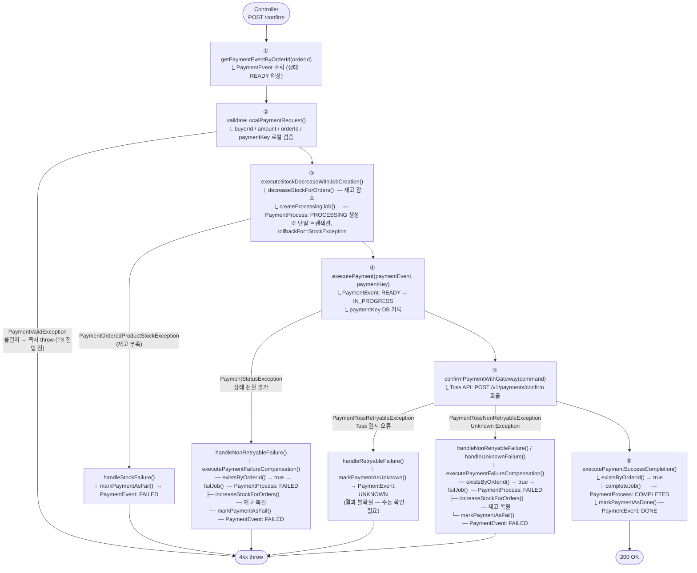
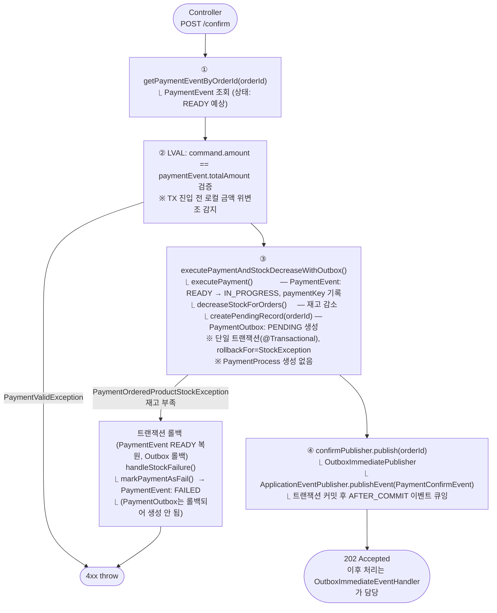
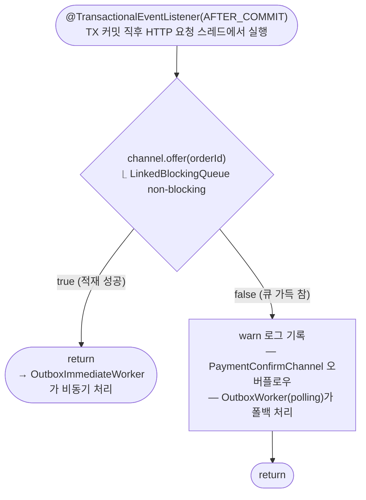
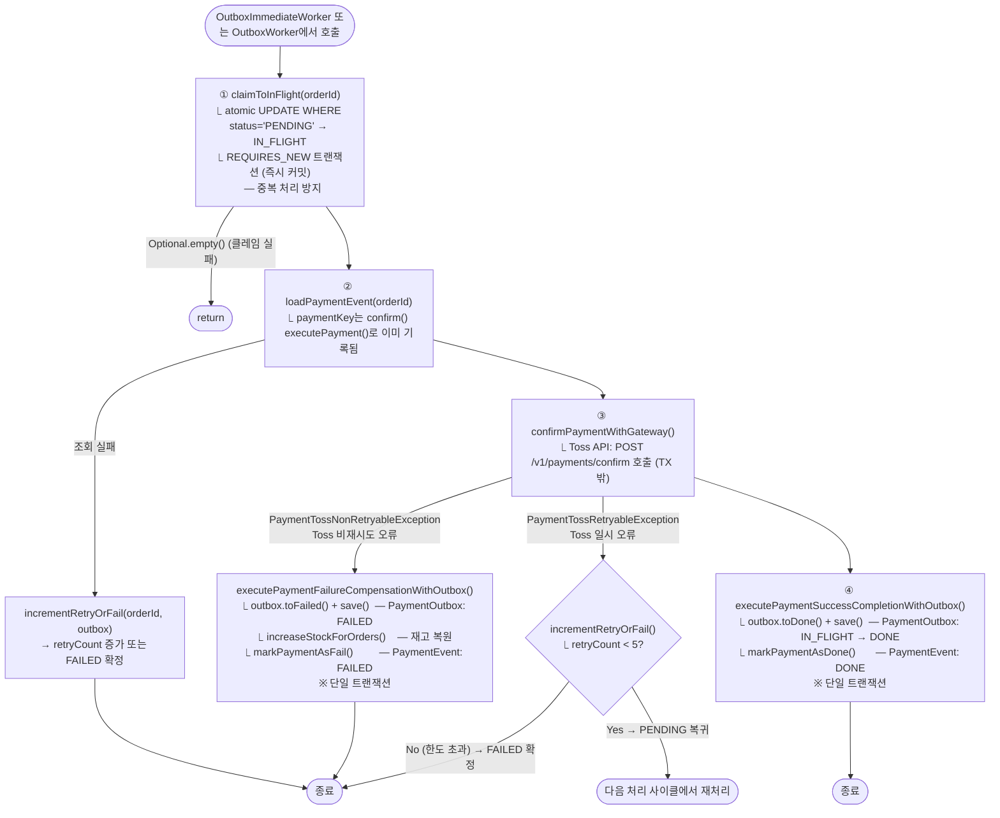
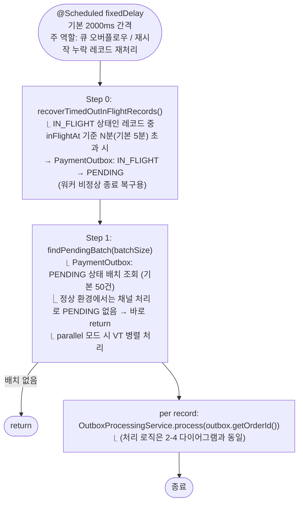
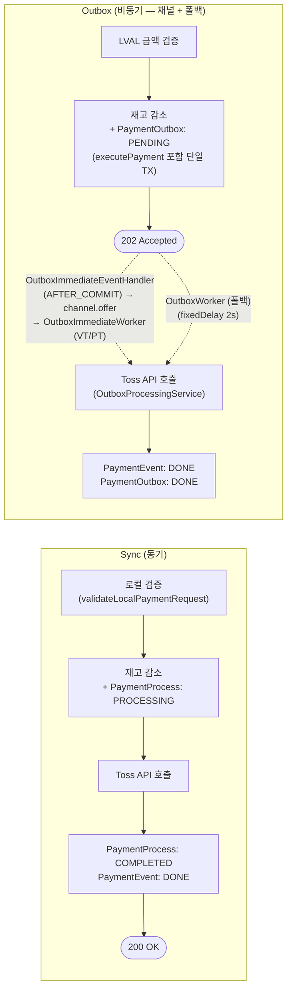
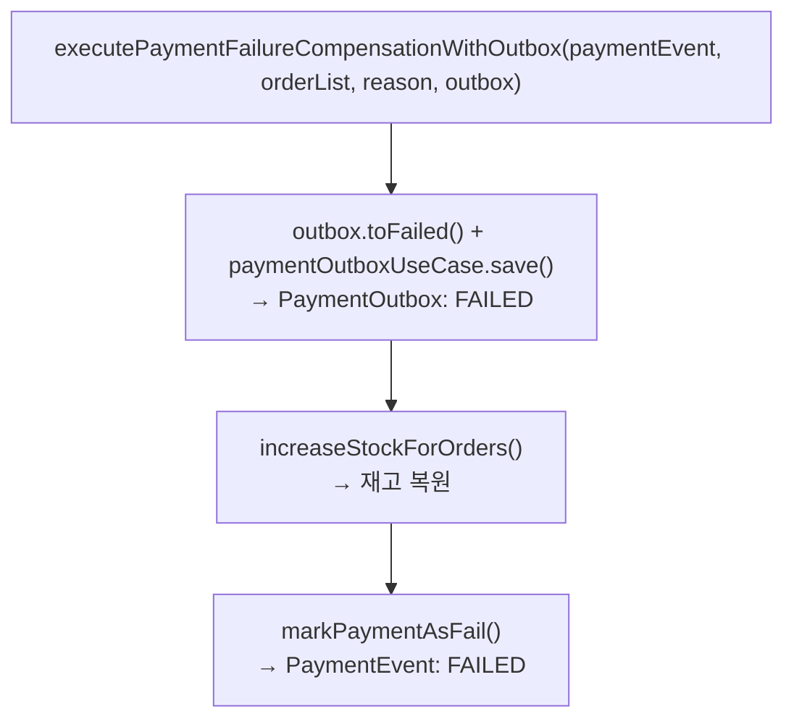

# Confirm Flow Flowchart

> 기준: 실제 코드 (`PaymentConfirmServiceImpl`, `OutboxAsyncConfirmService`,
> `OutboxImmediateEventHandler`, `OutboxImmediateWorker`, `OutboxProcessingService`,
> `OutboxWorker`, `PaymentTransactionCoordinator`)
> 최종 수정: 2026-03-31

---

## 상태(Status) 사전

### PaymentEvent 상태 (`PaymentEventStatus`)

| 상태 | 의미 | 전환 시점 |
|------|------|-----------|
| `READY` | 결제 초기 생성 상태. 아직 처리 시작 전 | 결제 주문 생성 시 |
| `IN_PROGRESS` | Toss API confirm 요청을 위해 진입. paymentKey 기록 완료 | `executePayment()` 호출 시 |
| `DONE` | Toss API confirm 성공, 결제 완료 | `markPaymentAsDone()` 호출 시 |
| `FAILED` | 재고 부족 / Toss 비재시도 오류 / 보상 완료 후 최종 실패 | `markPaymentAsFail()` 호출 시 |
| `UNKNOWN` | Toss API에서 재시도 가능 오류 발생 — 결과 불확실 (Sync 전략 전용) | `markPaymentAsUnknown()` 호출 시 |

> **핵심**: `IN_PROGRESS` 상태에서 실패하면 반드시 `FAILED`로 전환해야 한다.
> 그렇지 않으면 PaymentEvent가 `IN_PROGRESS`에 고착되어 재시도도, 정상 조회도 불가능해진다.

---

### PaymentProcess 상태 (`PaymentProcessStatus`)

| 상태 | 의미 | 전환 시점 |
|------|------|-----------|
| `PROCESSING` | 결제 처리 진행 중 (재고 감소 완료, Toss 대기) | `createProcessingJob()` 호출 시 |
| `COMPLETED` | Toss confirm 성공 | `completeJob()` 호출 시 |
| `FAILED` | 보상 트랜잭션 완료 후 최종 실패 | `failJob()` 호출 시 |

> **주의**: `PaymentProcess`는 **Sync 전략에서만 생성**된다.
> Outbox는 `executePaymentSuccessCompletion()`에서 `existsByOrderId()` 가드로 `completeJob()` 호출을 건너뛴다.

---

### PaymentOutbox 상태 (`PaymentOutboxStatus`) — Outbox 전략 전용

| 상태 | 의미 | 전환 시점 |
|------|------|-----------|
| `PENDING` | 처리 대기 중. OutboxWorker가 배치로 조회할 대상 | `createPendingRecord()` 또는 재시도 후 `incrementRetryCount()` 시 |
| `IN_FLIGHT` | 핸들러/워커가 처리를 시작함. 타임아웃 복구 대상 | `claimToInFlight()` 호출 시 (REQUIRES_NEW 트랜잭션, 즉시 커밋) |
| `DONE` | Toss confirm 성공, 처리 완료 | `executePaymentSuccessCompletionWithOutbox()` 내 `outbox.toDone()` 시 |
| `FAILED` | 재시도 한도 초과 또는 비재시도 오류. 더 이상 처리 안 함 | `executePaymentFailureCompensationWithOutbox()` 내 `outbox.toFailed()` 또는 `incrementRetryOrFail()` 한도 초과 시 |

> **IN_FLIGHT 타임아웃**: `inFlightTimeoutMinutes`(기본 5분) 초과 시 `PENDING`으로 되돌려
> 워커 재시도 기회를 확보한다. 워커/핸들러 비정상 종료 시 데드락 방지 목적.
>
> **재시도 한도**: `RETRYABLE_LIMIT = 5`. `retryCount >= 5`이면 `PENDING`으로 돌리지 않고 `FAILED` 확정.

---

## 1. Sync (`PaymentConfirmServiceImpl`)

> `spring.payment.async-strategy=sync` (`matchIfMissing=false`, 기본값: `outbox`)



---

## 2. Outbox (`OutboxAsyncConfirmService` + `PaymentConfirmChannel` + `OutboxImmediateWorker` + `OutboxWorker`)

> `spring.payment.async-strategy=outbox` (기본값)
>
> **채널 기반 비동기 처리 + 폴백 이중 구조**:
> - 정상 경로: confirm() 커밋 후 `OutboxImmediateEventHandler`가 `channel.offer()` → `OutboxImmediateWorker` VT/PT 워커가 `channel.take()` → `OutboxProcessingService.process()`
> - 폴백 경로: 큐 오버플로우 시 `OutboxWorker` (fixedDelay 2s) 가 PENDING 레코드를 배치로 재처리 → `OutboxProcessingService.process()` 위임

### 2-1. confirm() — HTTP 요청 처리 (동기 구간)



### 2-2. OutboxImmediateEventHandler.handle() — 채널 적재 (비블로킹)



### 2-3. OutboxImmediateWorker.workerLoop() — 채널 소비 (VT/PT 워커)

```mermaid
flowchart TD
    SL(["SmartLifecycle.start()\n앱 시작 시 workerCount개(기본 200)\nVT 또는 PT 워커 스레드 생성"]) --> LOOP

    LOOP["workerLoop() — 각 워커 독립 실행"]
    LOOP --> TAKE

    TAKE["channel.take()\n⎿ 큐에 항목이 올 때까지 blocking wait"]
    TAKE --> PROC

    PROC["OutboxProcessingService.process(orderId)\n⎿ claimToInFlight → Toss API → success/retry/failure\n⎿ (아래 2-4 다이어그램 참조)"]
    PROC --> LOOP

    TAKE -->|InterruptedException| STOP([루프 종료\n→ SmartLifecycle.stop()])
```

### 2-4. OutboxProcessingService.process() — 공유 처리 로직



### 2-5. OutboxWorker.process() — 폴백 스케줄러



---

## 3. 전략 비교

### 3-1. HTTP 응답 / 처리 흐름



### 3-2. Outbox 보상 패턴 (`executePaymentFailureCompensationWithOutbox`)



### 3-3. 전략별 상태 엔티티 사용 요약

| 엔티티 | Sync | Outbox |
|------|------|--------|
| `PaymentEvent` | READY → IN_PROGRESS → DONE/FAILED/UNKNOWN | READY → IN_PROGRESS → DONE/FAILED |
| `PaymentProcess` | PROCESSING → COMPLETED/FAILED | 미사용 |
| `PaymentOutbox` | 미사용 | PENDING → IN_FLIGHT → DONE/FAILED |
| HTTP 응답 | 200 OK | 202 Accepted |
| Toss API 재시도 | 없음 (UNKNOWN 처리) | incrementRetryOrFail 최대 5회 |
| 재고 + executePayment TX | 분리 (별도 단계) | 단일 TX (Outbox 포함) |
| 즉시 처리 메커니즘 | 해당 없음 | OutboxImmediateEventHandler (AFTER_COMMIT) |
| 폴백 메커니즘 | 해당 없음 | OutboxWorker (fixedDelay 5s, 배치 50) |
