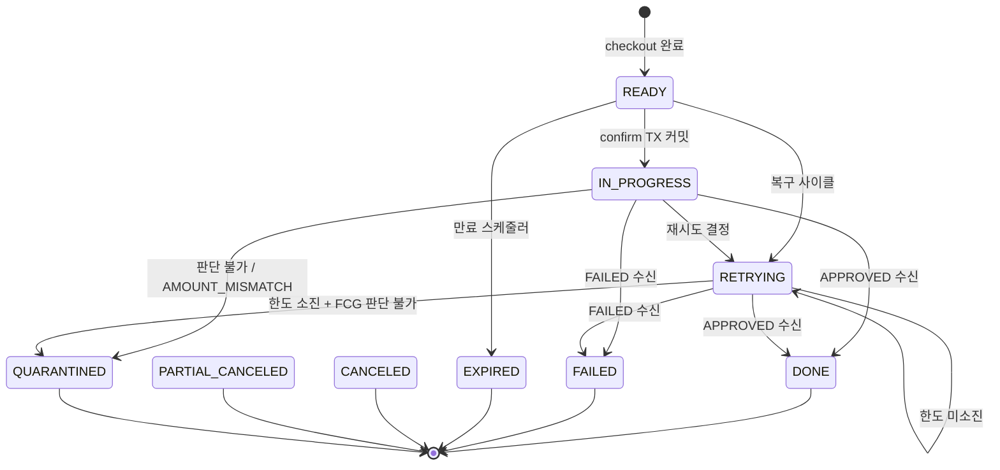
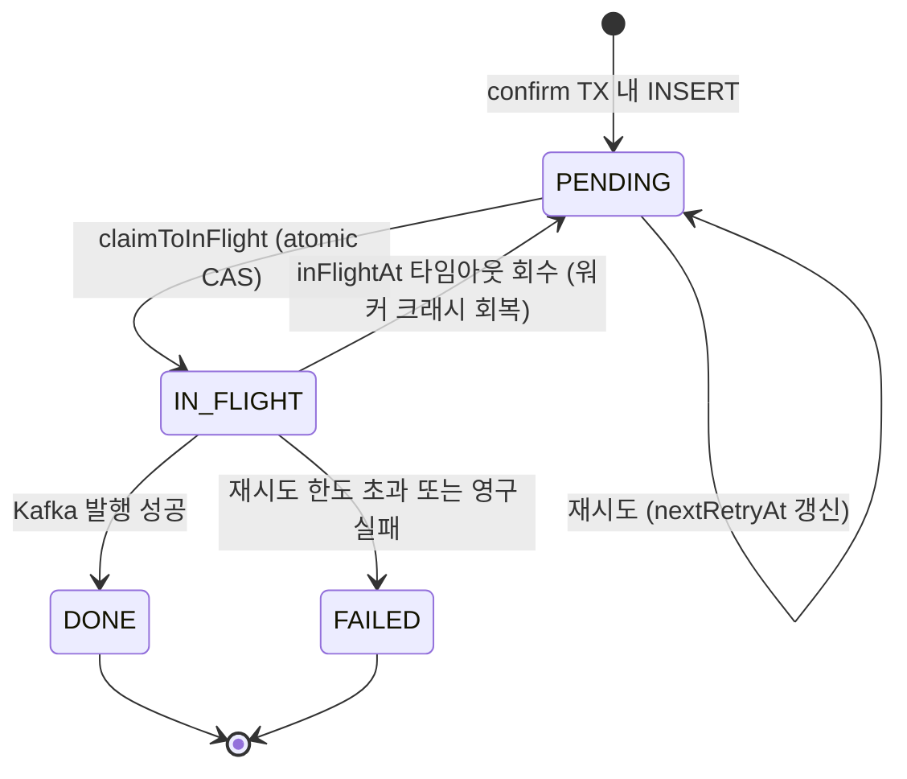
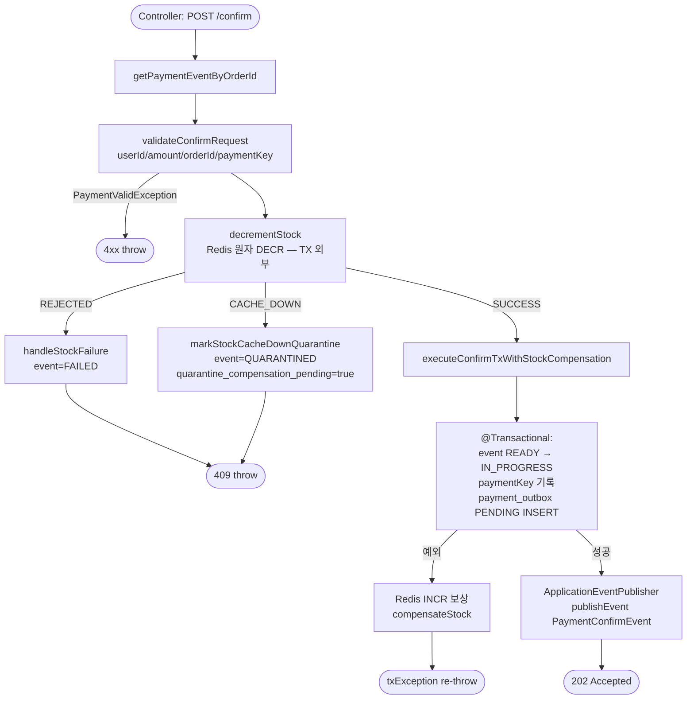
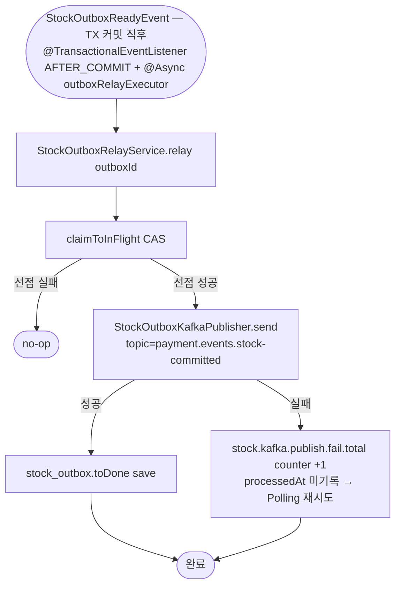
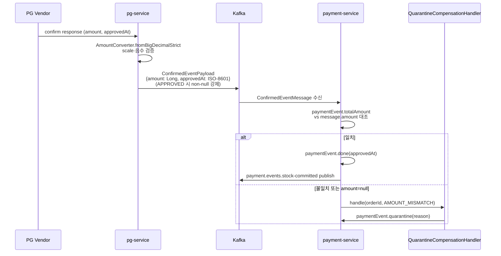
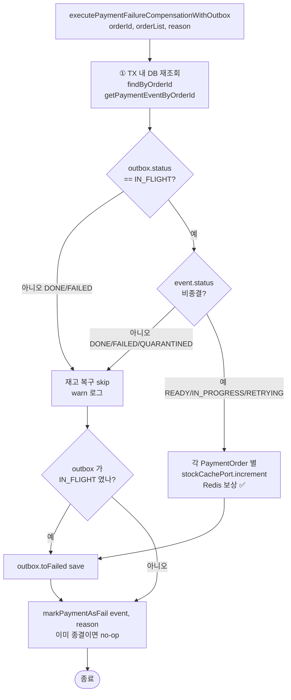

# Confirm Flow — Mermaid Flowchart

> 최종 갱신: 2026-04-27 (post-MSA + PRE-PHASE-4-HARDENING 봉인)
> 짝 문서: [`CONFIRM-FLOW-ANALYSIS.md`](CONFIRM-FLOW-ANALYSIS.md), 전체 end-to-end 는 [`PAYMENT-FLOW.md`](PAYMENT-FLOW.md)

본 문서는 payment-service 측 비동기 confirm 사이클의 시각화. PG 측 흐름은 `PAYMENT-FLOW.md` Phase 4 절.

## 1. 상태 머신

### PaymentEventStatus



### PaymentOutboxStatus



## 2. confirm 진입 — `OutboxAsyncConfirmService.confirm()`



## 3. AFTER_COMMIT 즉시 발행 — `OutboxImmediateEventHandler` + `OutboxRelayService`

```mermaid
flowchart TD
    EV([@TransactionalEventListener AFTER_COMMIT<br/>+ @Async outboxRelayExecutor VT]) --> RELAY[OutboxRelayService.relay orderId]

    RELAY --> CL[Step 1: claimToInFlight<br/>atomic UPDATE PENDING → IN_FLIGHT<br/>REQUIRES_NEW]
    CL -->|선점 실패| SKIP([no-op return])
    CL -->|선점 성공| LOAD[Step 2: outbox + paymentEvent 조회]

    LOAD --> SEND[Step 3: KafkaMessagePublisher.send<br/>topic=payment.commands.confirm<br/>payload=PaymentConfirmCommandMessage]

    SEND -->|발행 실패| HOLD[IN_FLIGHT 유지<br/>OutboxWorker 폴백 재시도]
    SEND -->|성공| DONE[Step 4: outbox.toDone save<br/>IN_FLIGHT → DONE]

    DONE --> END([완료])
    HOLD --> END
```

## 4. 폴링 폴백 — `OutboxWorker`

```mermaid
flowchart TD
    S([@Scheduled fixedDelay]) --> R0[Step 0: recoverTimedOutInFlightRecords<br/>inFlightAt 기준 N분 초과 → PENDING 복귀]
    R0 --> R1[Step 1: findPendingBatch batchSize<br/>기본 50건]
    R1 -->|배치 없음| END([no-op])
    R1 --> LOOP[배치 순회]
    LOOP --> RELAY[OutboxRelayService.relay<br/>위 3번 다이어그램과 동일]
    RELAY --> END
```

## 5. 결과 수신 — `ConfirmedEventConsumer` + `PaymentConfirmResultUseCase`

```mermaid
flowchart TD
    KC([@KafkaListener payment.events.confirmed<br/>groupId=payment-service]) --> UC[PaymentConfirmResultUseCase.handle]

    UC --> MARK[markWithLease<br/>eventUuid, leaseTtl=PT5M<br/>SET NX EX]
    MARK -->|false 이미 처리 중| SKIP([no-op return])
    MARK -->|true 권한 획득| LOAD[paymentEvent 조회]

    LOAD --> SW{message.status}

    SW -->|APPROVED| AMT[parseApprovedAt<br/>+ isAmountMismatch 검사]
    AMT -->|불일치| QU_AM[stockCachePort.increment 보상<br/>+ QuarantineCompensationHandler<br/>reason=AMOUNT_MISMATCH]
    AMT -->|일치| DONE_OK[markPaymentAsDone approvedAt<br/>각 PaymentOrder 별<br/>stock_outbox INSERT + StockOutboxReadyEvent publish]

    SW -->|FAILED| FAIL_OK[markPaymentAsFail reason<br/>각 PaymentOrder 별<br/>stockCachePort.increment 보상]

    SW -->|QUARANTINED| QU_PG[stockCachePort.increment 보상<br/>+ QuarantineCompensationHandler<br/>reason=PG_QUARANTINED]

    DONE_OK --> EXT[extendLease<br/>longTtl=P8D<br/>SET XX EX]
    FAIL_OK --> EXT
    QU_AM --> EXT
    QU_PG --> EXT
    EXT --> END([완료])

    DONE_OK -.실패시.-> RM[remove eventUuid<br/>false → DLQ publish]
    FAIL_OK -.실패시.-> RM
```

## 6. AFTER_COMMIT stock 발행 — `StockOutboxImmediateEventHandler`

APPROVED 결과에서만 발행됨 — FAILED/QUARANTINED 시 stock 발행 X (Redis 보상만).



## 7. AMOUNT_MISMATCH 양방향 방어



## 8. D12 재고 복구 가드 (`executePaymentFailureCompensationWithOutbox`)



## 관련 문서

- 진입점·use case 분석: `CONFIRM-FLOW-ANALYSIS.md`
- 전체 end-to-end (브라우저 → 폴링): `PAYMENT-FLOW.md`
- RecoveryDecision / FCG / D12 의 도입 배경: `docs/archive/payment-double-fault-recovery/COMPLETION-BRIEFING.md`
- two-phase lease, AFTER_COMMIT stock 분리, 보강 결정 시리즈: `docs/archive/pre-phase-4-hardening/COMPLETION-BRIEFING.md`
