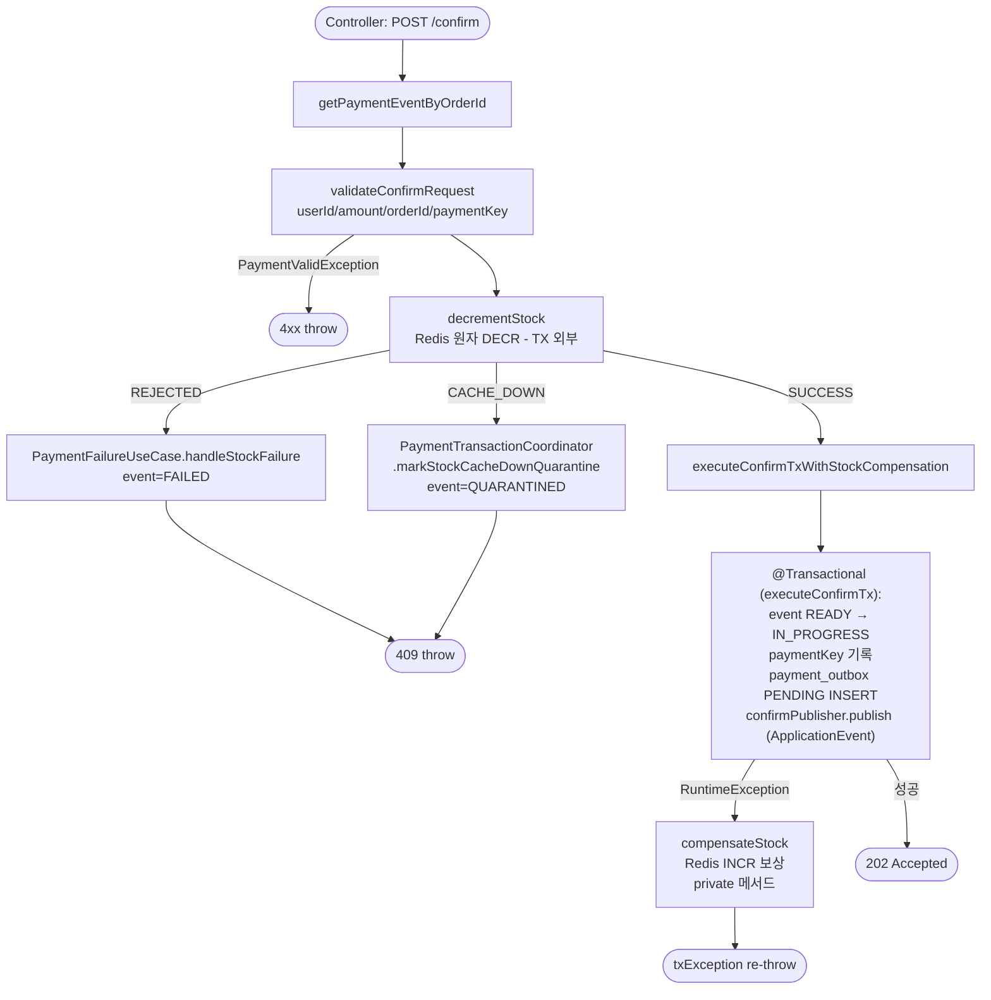
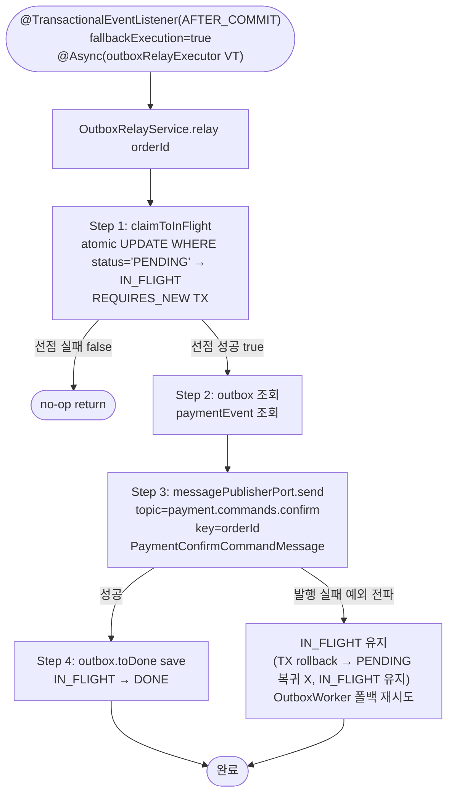
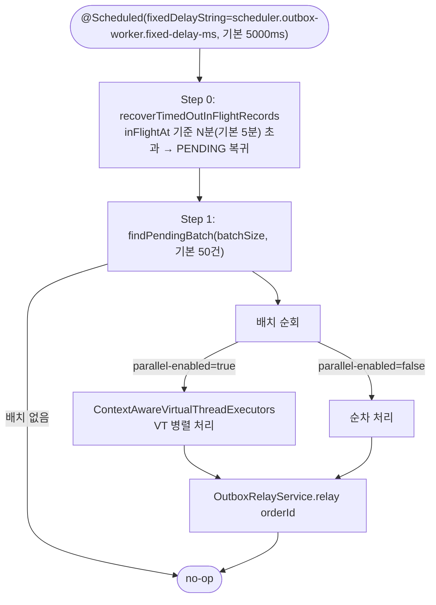
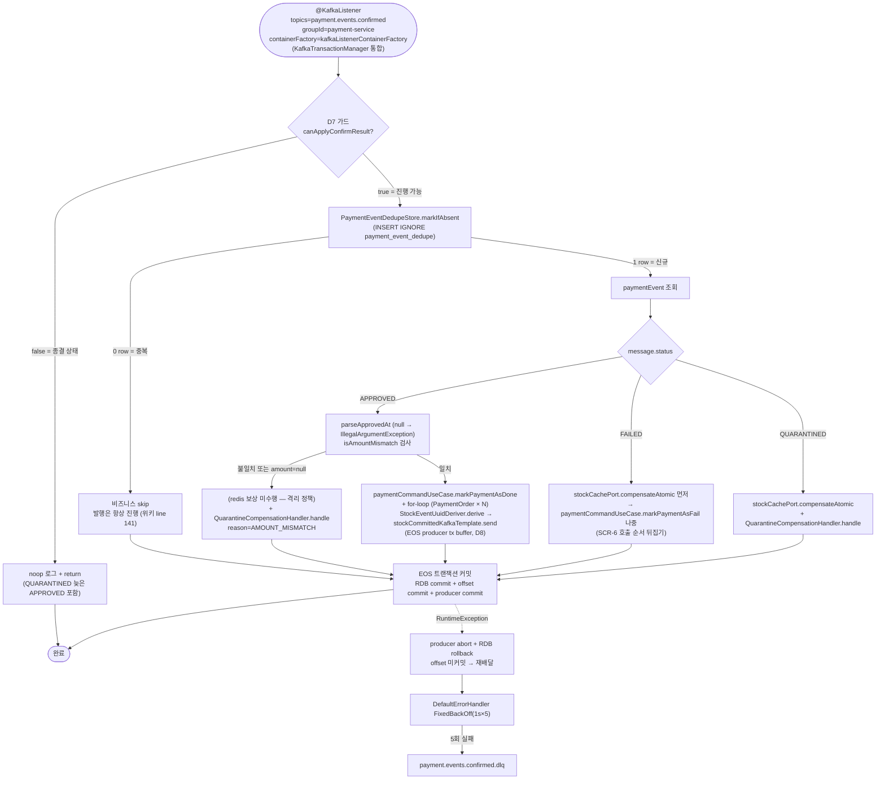
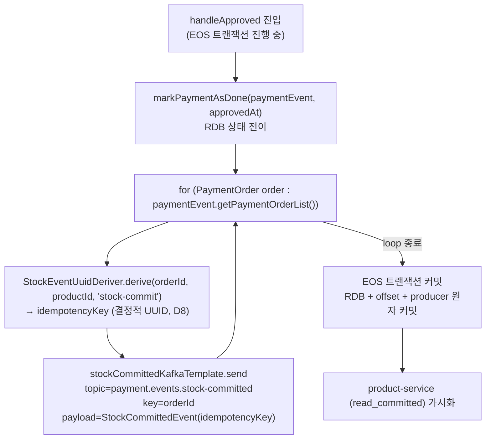
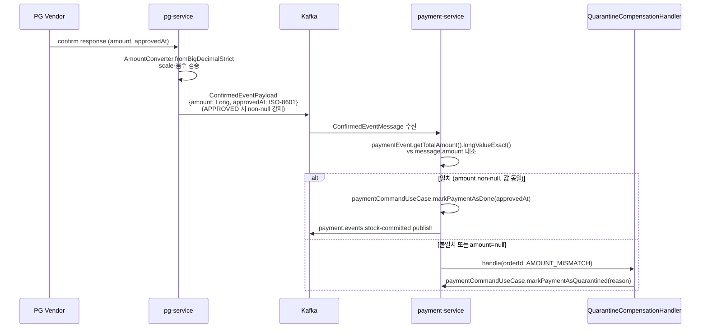
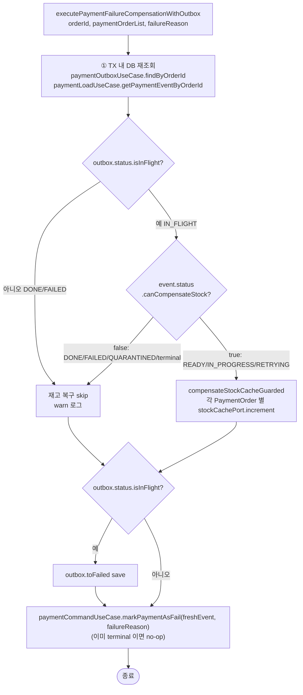
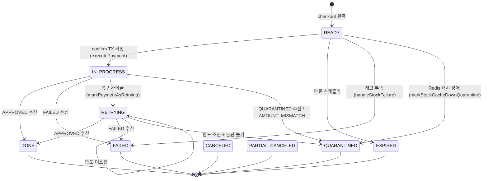
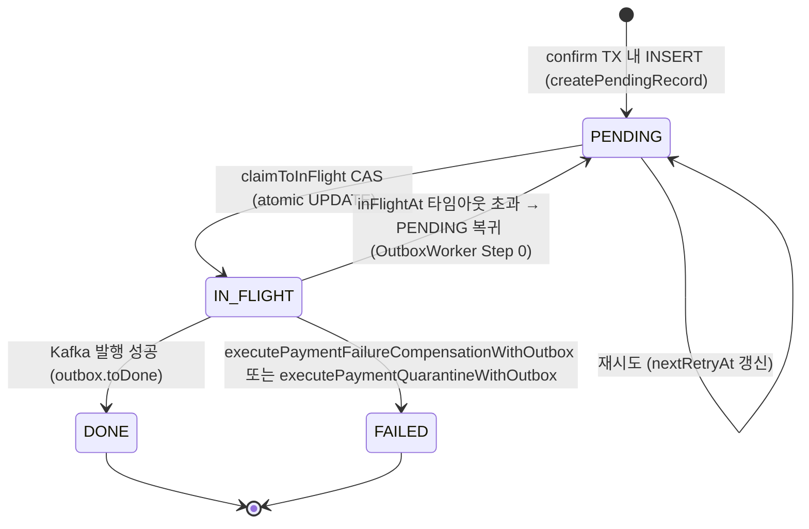

# Confirm Flow — payment-service 측 비동기 confirm 사이클

> 최종 갱신: 2026-05-29 (EOS-FOLLOWUP-CLEANUP — D7 가드 메서드 분리, TM qualifier 명시, dedupe cleanup 스케줄러 도입)
> end-to-end 플로우 (Phase 1~5 전체, pg-service 상세): [`PAYMENT-FLOW.md`](PAYMENT-FLOW.md)

본 문서는 **payment-service 측 비동기 confirm 사이클** 을 다룬다.
- PG 벤더 호출 (pg-service `PgConfirmService` + 전략 어댑터) 와 Kafka 양방향 왕복 전체 흐름은 `PAYMENT-FLOW.md` Phase 4 절이 담당한다.
- 다이어그램과 분석 텍스트를 한 파일에 통합 배치한다.
- pg-service 측 listener 분리 안 상세 (TX 경계 + 워커 분기 + 보정 경로 PENDING 우회) 는 §16 참조.

---

## 1. 개요

```
브라우저 POST /confirm
    → OutboxAsyncConfirmService (Redis DECR → TX → 202)
    → OutboxImmediateEventHandler (AFTER_COMMIT VT)
    → OutboxRelayService.relay (claimToInFlight CAS → Kafka publish)
    → [pg-service 처리 — PAYMENT-FLOW.md]
    → ConfirmedEventConsumer
    → PaymentConfirmResultUseCase.handle (EOS: KafkaTransactionManager + D7 가드 + D5 멱등 마킹 + D8 직접 발행)
    → payment.events.stock-committed 직접 발행 (EOS producer tx 안에서 APPROVED 시)
```

진입: `POST /api/v1/payments/confirm` (`PaymentController`)
출구: `payment.events.stock-committed` Kafka 발행 (APPROVED, EOS producer tx commit 시 가시화) / Redis 선차감 보상 (FAILED/QUARANTINED)

**EOS 전환 이후 변경 핵심**:
- `StockOutbox` 묶음 (`StockOutboxImmediateEventHandler` / `StockOutboxRelayService` / `StockOutboxKafkaPublisher` / `StockOutboxWorker` 등 16+ 파일) 폐기.
- 결제 결과 컨슈머가 `KafkaTransactionManager` 통합 — consumer offset commit + RDB commit + producer send 가 한 Kafka 트랜잭션으로 묶임.
- `PaymentEventDedupeStore.markIfAbsent(event_uuid)` INSERT IGNORE 로 메시지 단위 멱등 마킹.
- product-service `StockCommitConsumer` 가 `isolation.level=read_committed` 로 abort 된 메시지 invisible 보장.

---

## 2. 진입점 — `PaymentController` → `OutboxAsyncConfirmService.confirm`



**핵심 포인트:**
- `validateConfirmRequest` — TX 진입 전 도메인 가드. 위변조 / 상태 불일치 조기 차단.
- `decrementStock(orderId, paymentOrders)` — TX 외부. `PaymentTransactionCoordinator.decrementStock` 에서 `stockCachePort.decrementAtomic(orderId, paymentOrders)` Lua 1회 호출 (결제 단위 N개 상품 atomic 차감 + dedup token `decrement:done:{orderId}` SETNX P8D). 결과 enum 매핑: `OK` / `ALREADY_DONE` → `SUCCESS`, `INSUFFICIENT` → `REJECTED`, RuntimeException → `CACHE_DOWN`.
- `executeConfirmTx` — `@Transactional`. event 상태 전이 + outbox INSERT + `confirmPublisher.publish` (ApplicationEvent) 를 하나의 TX 에 원자 커밋. publish 가 TX 안에서 일어나야 AFTER_COMMIT 리스너가 TX 동기화 활성 상태에서 등록된다.
- 보상 로직은 `compensateStock` private 메서드로 추출 — try 블록 외부 변수 재할당 금지 패턴.
- 반환값: `PaymentConfirmAsyncResult` (orderId, amount). `202 Accepted` 즉시 반환.

---

## 3. AFTER_COMMIT 즉시 발행 — `OutboxImmediateEventHandler` + `OutboxRelayService`



**책임 분석:**
- `OutboxImmediateEventHandler` — `@ConditionalOnProperty(payment.monolith.confirm.enabled, matchIfMissing=true)`. 기본 활성. 비활성 시 `OutboxWorker` 폴백만 작동.
- `@Async("outboxRelayExecutor")` — `AsyncConfig` 에서 정의한 가상 스레드 executor. OTel Context + MDC 이중 래핑 (`ContextAwareVirtualThreadExecutors.newWrappedVirtualThreadExecutor()`) — traceparent 끊김 없음.
- `OutboxRelayService.relay` — `@Transactional`. `claimToInFlight` 가 `REQUIRES_NEW` 로 원자 선점. **TX 안에서 Kafka send** → 실패 시 TX rollback 이지만 outbox row 는 IN_FLIGHT 상태로 남는다 (claimToInFlight 는 별도 REQUIRES_NEW TX 에서 이미 커밋됨).
- `PaymentConfirmCommandMessage` 필드: `orderId`, `paymentKey`, `amount(BigDecimal)`, `vendorType(PaymentGatewayType)`, `eventUuid`. 현재 eventUuid = orderId 재사용 (confirm 은 orderId 당 1회만 발행되므로 orderId 가 고유 식별자로 기능).

---

## 4. 폴링 폴백 — `OutboxWorker`



**설정값 (application.yml):**
- `scheduler.outbox-worker.fixed-delay-ms`: 5000 (기본)
- `scheduler.outbox-worker.batch-size`: 50 (기본)
- `scheduler.outbox-worker.parallel-enabled`: true (기본)
- `scheduler.outbox-worker.in-flight-timeout-minutes`: 5 (기본)

정상 환경에서 `OutboxImmediateEventHandler` 가 PENDING 을 즉시 처리하므로 `OutboxWorker` 는 대부분 no-op. 리스너 스킵 / 워커 크래시 / Kafka 발행 실패 시 IN_FLIGHT 타임아웃 회수를 통해 재발행한다.

---

## 5. 결과 수신 — `ConfirmedEventConsumer` + `PaymentConfirmResultUseCase` (EOS 전환 후)



**EOS 트랜잭션 구조:**
- `KafkaConsumerConfig` 의 `kafkaListenerContainerFactory` 가 `KafkaTransactionManager(stockCommittedProducerFactory)` 를 통합.
- consumer offset commit 이 producer 트랜잭션에 동행 (`sendOffsetsToTransaction`) — RDB commit + producer commit + offset commit 이 원자적.
- abort 시 RDB rollback + 발행 버퍼 폐기 + offset 미커밋 → 동일 메시지 재배달.

**EOS atomicity SSOT (RD1-2 명시):**
- `PaymentConfirmResultUseCase.handle` 의 `@Transactional(transactionManager = "transactionManager", timeout = 5)` 는 `@Primary JpaTransactionManager` 를 qualifier 로 **명시 고정** 한다 (EOS-FOLLOWUP-CLEANUP — 이전 qualifier 미명시 시 다중 TM 환경에서 선택 모호성 제거). `KafkaTransactionManager(EOS)` 와 별개 TM 임을 코드 레벨에서 못박는다.
- 결과적으로 RDB commit 과 Kafka commit 사이에 crash 시 at-least-once 재배달이 발생한다 (best-effort 1PC 한계). 이 한계와 TM 분리 원칙은 `handle` Javadoc 에 명시되어 있다.
- **정합성 SSOT 는 EOS atomicity 그 자체가 아니라 위키 line 141 룰**: 0 row(중복) 시에도 stock-committed 발행은 항상 진행 → product-service `stock_commit_dedupe` 가 재배달을 흡수 → 최종 재고 정합 보장.
- 즉 EOS 는 "정상 경로에서 at-most-once 중복 발행 방지" 최적화이며, crash 내성은 위키 line 141 + product-service dedupe 조합이 담당한다.
- ChainedKafkaTransactionManager 도입은 미채택 — qualifier 명시로 TM 선택만 확정 (EOS-FOLLOWUP-CLEANUP 완료).

**D7 진입 가드:**
- `paymentEvent.getStatus().canApplyConfirmResult()` — READY / IN_PROGRESS / RETRYING 만 true. DONE / FAILED / CANCELED / PARTIAL_CANCELED / EXPIRED / QUARANTINED 는 false → noop return.
- QUARANTINED 결제에 늦은 APPROVED 메시지가 도착해도 D7 가드가 차단 — DLQ silent 분기 방지 (DR-3 가드).

**D5 멱등 마킹 (`payment_event_dedupe`):**
- `PaymentEventDedupeStore.markIfAbsent(eventUuid, orderId, status, receivedAt, expiresAt) → int`.
- `INSERT IGNORE INTO payment_event_dedupe(event_uuid, ...)` — affected rows 0 = 중복, 1 = 신규.
- 0 row 시 비즈니스 skip 하되 발행은 항상 진행 (위키 line 141 보장 — product-service dedupe 가 재배달 흡수).
- TTL: `expires_at = receivedAt + 8일` (Kafka retention 7d + 복구 버퍼 1d).

**D8 직접 발행 (EOS producer tx):**
- APPROVED 경로: `for-loop(paymentEvent.getPaymentOrderList())` 안에서 `StockEventUuidDeriver.derive(orderId, productId, "stock-commit")` → `stockCommittedKafkaTemplate.send(topic, key, payload)`.
- producer tx 안에서 buffer — RDB commit 과 같은 트랜잭션 커밋 시 product-service 에 원자적으로 가시화.
- multi-product 결제 N건의 idempotencyKey 가 각 productId 별로 결정적으로 다름 (DR-1 회귀 가드).

**Spring Kafka native 에러 핸들링:**
- `KafkaErrorHandlerConfig` (`infrastructure/config`) 에서 `DefaultErrorHandler` + `DeadLetterPublishingRecoverer` + `FixedBackOff(1000ms, 5)` 빈 등록.
- not-retryable 예외: `MessageConversionException` / `IllegalArgumentException` / `IllegalStateException` — 즉시 DLQ.
- 그 외 RuntimeException — 1초 간격으로 5회 재시도 후 한도 초과 시 `payment.events.confirmed.dlq` 로 publish.
- `PaymentConfirmResultUseCase` 는 예외를 그대로 throw — retry / DLQ 책임은 Spring Kafka 가 가져간다.

**Lua atomic dedup token (orderId 단위):**
- `compensateAtomic(orderId, orders)` 가 `lua/stock_compensation_atomic.lua` 1회 호출 — 결제 단위 N개 상품 atomic 보상 + dedup token `compensation:done:{orderId}` SETNX P8D. 동일 orderId 재처리 시 `ALREADY_DONE` 반환 → 보상 멱등.
- 차감 측은 `decrement:done:{orderId}` SETNX P8D 가 차감 멱등을 보장.

### handleApproved (양방향 amount 방어 + EOS 직접 발행)

```
parseApprovedAt(message.approvedAt)
      [null] → IllegalArgumentException ("APPROVED 메시지에 approvedAt 이 null") → 즉시 DLQ

isAmountMismatch(paymentEvent, message.amount)
      paymentEvent.getTotalAmount().longValueExact() vs message.amount
      [불일치 또는 message.amount null] → true

if (isAmountMismatch)
      → (redis 보상 미수행 — 격리 정책)
      → QuarantineCompensationHandler.handle(orderId, "AMOUNT_MISMATCH")
        early return

else
      paymentCommandUseCase.markPaymentAsDone(paymentEvent, receivedApprovedAt)
      // AOP @PaymentStatusChange + @PublishDomainEvent 가 상태 전이 감사 기록

      for (PaymentOrder order : paymentEvent.getPaymentOrderList()):
        String idempotencyKey = StockEventUuidDeriver.derive(orderId, productId, "stock-commit")
        StockCommittedEvent payload = new StockCommittedEvent(orderId, productId, quantity, idempotencyKey)
        stockCommittedKafkaTemplate.send(PaymentTopics.STOCK_COMMITTED, orderId, payload)
      // EOS producer tx 안에서 buffer → 트랜잭션 커밋 시 원자적으로 가시화
```

> AMOUNT_MISMATCH 시 `handleApproved` 내부에서 redis 보상을 **직접 호출하지 않는다**. `QuarantineCompensationHandler.handle` 위임 후 early return. 보상은 별도 관리 경로(격리 정책).

### handleFailed (호출 순서 뒤집기 — SCR-6)

```
stockCachePort.compensateAtomic(orderId, paymentOrders)
// Redis 선차감 캐시 복원. Lua atomic + dedup token compensation:done:{orderId} SETNX P8D.
// 보상이 먼저 끝나야 markPaymentAsFail 영구 실패 시에도 재고는 이미 복원돼 silent loss 0.

paymentCommandUseCase.markPaymentAsFail(paymentEvent, reasonCode)
// AOP 감사 기록. 영구 실패 시 예외 throw → DefaultErrorHandler → retry → 한도 초과 시 DLQ.
// L7 cascade 인지: DLQ + Reconciler resetToReady + 새 confirm 사이클 → 재고 발산 가능 (PG 멱등성으로 일반 차단)
```

### handleQuarantined

```
stockCachePort.compensateAtomic(orderId, paymentOrders)

QuarantineCompensationHandler.handle(orderId, reasonCode)
      → event 가 이미 terminal 이면 no-op (이중 전이 방지)
      → paymentCommandUseCase.markPaymentAsQuarantined
```

---

## 6. EOS 직접 발행 — `stockCommittedKafkaTemplate` (EOS 전환 후)

APPROVED 결과에서만 발행됨 — FAILED/QUARANTINED 시 stock 발행 X (redis 보상만).

EOS 전환 이후 `StockOutboxImmediateEventHandler` / `StockOutboxRelayService` / `StockOutboxWorker` 묶음은 폐기됨.
`PaymentConfirmResultUseCase.handleApproved` 안에서 `stockCommittedKafkaTemplate.send` 를 **EOS producer 트랜잭션 안에서 직접 호출**.



**책임 분석:**
- `stockCommittedKafkaTemplate` — `KafkaProducerConfig` 의 EOS-aware `stockCommittedProducerFactory` 로 생성된 `KafkaTemplate`. `transactional.id = ${spring.application.name}-${HOSTNAME:local}-` prefix.
- `StockEventUuidDeriver.derive` — DR-1 회귀 가드 보존. multi-product 결제 N건의 idempotencyKey 를 `orderId + productId + action` 으로 결정적으로 도출 → 재배달 시에도 동일 key 생성.
- `payment_stock_outbox` 테이블 — Flyway V3 (`V3__drop_payment_stock_outbox.sql`) 로 DROP 완료. 폴링 폴백 워커 없음.

**폐기된 컴포넌트** (EOS 전환 이후):
- `StockOutboxImmediateEventHandler`, `StockOutboxRelayService`, `StockOutboxKafkaPublisher`, `StockOutboxWorker`
- `StockOutbox` 도메인, `StockOutboxEntity`, `StockOutboxFactory`, `StockOutboxReadyEvent`
- `StockOutboxRepository`, `StockOutboxPublisherPort`, `JpaStockOutboxRepository`, `StockOutboxRepositoryImpl`

---

## 7. AMOUNT_MISMATCH 양방향 방어



- **pg 측 방어 (1단)**: `AmountConverter.fromBigDecimalStrict` — scale·음수 검증 (`PgInboxRepositoryImpl.insertPending` 경로 + `DuplicateApprovalHandler.amountMismatch` 경로). TC-16 dead service 제거 완료. `ConfirmedEventPayload` 에 APPROVED 시 amount non-null 강제.
- **payment 측 방어 (2단)**: `isAmountMismatch(paymentEvent, message.amount)` — `paymentEvent.getTotalAmount().longValueExact()` 와 수신 amount 대조. `message.amount` null → 불일치로 처리.

---

## 8. D12 재고 복구 가드 (`executePaymentFailureCompensationWithOutbox`)



**이중 가드 조건:**
- `outbox.status.isInFlight()` — DONE/FAILED 이면 이미 처리됨 → skip
- `event.status.canCompensateStock()` — READY/IN_PROGRESS/RETRYING 만 보상. QUARANTINED 는 `QuarantineCompensationHandler` 전담이므로 false. terminal 도 false.

---

## 9. 상태 머신

### PaymentEventStatus



| 상태 | 의미 | 진입 메서드 | `isTerminal()` | `GET /status` 폴링 응답 |
|---|---|---|---|---|
| READY | 결제 초기 생성 | checkout 완료 | false | PROCESSING (default) |
| IN_PROGRESS | confirm TX 커밋, paymentKey 기록 | `executePayment()` | false | PROCESSING (default) |
| RETRYING | 복구 사이클 재시도 대기 | `markPaymentAsRetrying()` | false | PROCESSING (default) |
| DONE | PG 결제 완료 (approvedAt non-null) | `markPaymentAsDone()` | true | DONE |
| FAILED | 재고 부족 / PG 종결 실패 | `markPaymentAsFail()` | true | FAILED |
| QUARANTINED | 판단 불가 격리 (수동 확인 필요) | `markPaymentAsQuarantined()` | **false** | PROCESSING ⚠️ |
| CANCELED | PG 취소 | 별도 경로 | true | PROCESSING (default) |
| PARTIAL_CANCELED | 부분 취소 | 별도 경로 | true | PROCESSING (default) |
| EXPIRED | 만료 스케줄러 | 별도 경로 | true | PROCESSING (default) |

> **QUARANTINED `isTerminal()` = false 코드 사실**: `PaymentEventStatus.isTerminal()` 구현에서 QUARANTINED 는 non-terminal. Javadoc: "QUARANTINED 는 후속 복구 워커가 보정/포기 결정하는 대기 상태이므로 non-terminal."
>
> **운영 영향**: `PaymentStatusServiceImpl.mapEventStatus` 의 switch 에서 DONE → StatusType.DONE, FAILED → StatusType.FAILED, 그 외 default → StatusType.PROCESSING. QUARANTINED 는 default 분기 → PROCESSING. 격리된 결제는 admin 이 DONE/FAILED 강제 전이해야 클라이언트 폴링이 종료된다.

`canApplyConfirmResult()` (confirm 결과 적용 진입 가드) = `canCompensateStock()` (보상 가드) = READY / IN_PROGRESS / RETRYING (재고 차감이 발생했을 수 있는 상태). 두 메서드는 EOS-FOLLOWUP-CLEANUP 에서 분리됐고, 종결 / QUARANTINED / EXPIRED 에서 답이 동조한다 (둘 다 false).

### PaymentOutboxStatus



| 상태 | 의미 |
|---|---|
| PENDING | 발행 대기. AFTER_COMMIT 리스너 또는 OutboxWorker 가 처리 |
| IN_FLIGHT | 워커가 선점, 발행 진행 중 (또는 타임아웃 대기) |
| DONE | Kafka 발행 성공 (`isTerminal()` = true) |
| FAILED | 발행 영구 실패 (`isTerminal()` = true) |

IN_FLIGHT 타임아웃(`inFlightTimeoutMinutes`, 기본 5분) 초과 → PENDING 복귀로 워커 크래시 회복.

---

## 10. 재시도 정책 — 두 layer 분리

두 서비스가 **다른 layer 의 다른 실패 모드** 를 각자 책임진다.

| | payment-service | pg-service |
|---|---|---|
| 책임 layer | Kafka publish (자기 → broker) | 외부 PG 호출 (vendor 응답) |
| 실패 종류 | broker 도달 실패 / ack 없음 / publish timeout | vendor 5xx / timeout / transient |
| 정책 정의 | `RetryPolicyProperties` (env 주입, `payment.retry.*`) | `pg-service/.../domain/RetryPolicy.java` (hardcoded) |
| maxAttempts | **5** (기본, `@DefaultValue("5")`) | 4 (`MAX_ATTEMPTS`) |
| backoff 전략 | **FIXED 5s** (기본, `@DefaultValue("FIXED")` + `@DefaultValue("5000")`) | EXPONENTIAL × jitter (base=2s, ×3, ±25%) |
| maxDelayMs | **60000ms** (기본) | — |
| 시각 표현 | `payment_outbox.next_retry_at` (RDB row) | `pg_outbox.available_at` (RDB row) + Kafka self-loop |
| 한도 초과 시 | outbox FAILED (DLQ 또는 수동 처리) | `payment.commands.confirm.dlq` 로 격리 |
| 트리거 | `OutboxImmediateEventHandler` / `@Scheduled OutboxWorker` | `PaymentConfirmConsumer` → self-loop (attempt 헤더) |
| 코드 진입점 | `PaymentOutboxUseCase.incrementRetryOrFail` | `PgVendorCallService.handleRetry` |

**핵심 비대칭:**
- payment 측: "내가 Kafka broker 에 publish 못함" 회복 — outbox CAS + 워커 폴백
- pg 측: "vendor 가 답을 안 함" 회복 — Kafka self-loop + attempt 헤더
- Kafka client 기본 error handler 커스터마이즈 없음 (application-level retry 가 대체)

---

## 11. 회복 시나리오 인덱스

| 장애 | 동작 |
|---|---|
| 리스너 스킵 / 워커 크래시 (payment 측) | `OutboxWorker` 가 PENDING + IN_FLIGHT 타임아웃 초과 분 PENDING 복귀 후 재픽업 |
| Kafka producer 실패 (payment → broker) | IN_FLIGHT 유지 → `OutboxWorker` 타임아웃 후 PENDING 복귀 → relay 재시도 |
| pg-service 측 retryable (5xx/timeout) | pg-service 자체 retry — `pg_outbox.available_at = now + backoff` 로 `payment.commands.confirm` 재발행. IN_PROGRESS 분기에서도 vendor 재호출 (`handleInProgress(command, attempt)`, 2026-04-27 변경). attempt < 4 까지 |
| pg-service 측 retry 한도 초과 (attempt ≥ 4) | `payment.commands.confirm.dlq` 로 격리 → `PaymentConfirmDlqConsumer` → `PgDlqService` → pg_inbox QUARANTINED → events.confirmed QUARANTINED → payment `handleQuarantined` |
| pg-service 측 non-retryable (4xx) | pg_inbox FAILED → events.confirmed FAILED → payment `handleFailed` |
| pg-service 측 판단 불가 / 5xx 한도 소진 | pg_inbox QUARANTINED → events.confirmed QUARANTINED → payment `handleQuarantined` |
| Redis 재고 캐시 장애 (CACHE_DOWN) | confirm 단계 CACHE_DOWN → event QUARANTINED + `quarantine_compensation_pending=true` |
| AMOUNT_MISMATCH 감지 | `handleApproved` 내부 격리 → `QuarantineCompensationHandler.handle(AMOUNT_MISMATCH)` |
| 중복 메시지 (payment 측 events.confirmed) | `payment_event_dedupe` INSERT IGNORE (D5 멱등 마킹) — 0 row = 비즈니스 skip + 발행 항상 진행 (위키 line 141). Lua atomic dedup token (차감/보상 단위 orderId P8D) 은 redis 보상 멱등을 별도 보장. |
| stock-committed 재배달 | product-service `JdbcEventDedupeStore` (stock_commit_dedupe UNIQUE INSERT IGNORE, 같은 TX) 가 흡수. idempotencyKey = `StockEventUuidDeriver.derive` 결정적 UUID (DR-1 보존). |
| EOS abort (producer tx abort) | RDB rollback + offset 미커밋 → 동일 메시지 재배달 → DefaultErrorHandler FixedBackOff 1s×5. product-service 측 abort 메시지 invisible (read_committed). |
| payment event IN_PROGRESS 장기 체류 | `PaymentReconciler` (`@Scheduled fixedDelayMs=120000, 2분`) — `findInProgressOlderThan(cutoff)` → `event.resetToReady` → `OutboxWorker` 재픽업 |

---

## 12. dedup token / dedupe TTL 정리 (payment-service)

| token / 테이블 | 저장소 | TTL | 의미 |
|---|---|---|---|
| `decrement:done:{orderId}` | Redis (Lua `stock_decrement_atomic.lua`) | P8D (8일) | 결제 단위 차감 완료 마커. 동일 orderId 재진입 시 `ALREADY_DONE` 반환으로 차감 멱등 보장. |
| `compensation:done:{orderId}` | Redis (Lua `stock_compensation_atomic.lua`) | P8D (8일) | 결제 단위 보상 완료 마커. 동일 orderId 재진입 시 `ALREADY_DONE` 반환으로 보상 멱등 보장. |
| `payment_event_dedupe.event_uuid` | MySQL (INSERT IGNORE) | `expires_at = receivedAt + P8D` | 메시지 단위 dedupe. 0 row = 중복 skip. TTL 정리 스케줄러는 TC-13-FOLLOW-2 후속 항목. |

P8D = Kafka retention(7d) + 복구 버퍼(1d). product-service `StockCommitUseCase.DEDUPE_TTL` 과 정렬.

---

## 13. 멱등성 layer 정리 (payment-service 측)

| 위치 | 메커니즘 | 코드 |
|---|---|---|
| confirm 진입 | `validateConfirmRequest` LVAL 가드 — TX 진입 전 도메인 검증 | `PaymentEvent.validateConfirmRequest` |
| confirm TX | `@Transactional` + `payment_outbox PENDING` 단일 TX 커밋 | `PaymentTransactionCoordinator.executeConfirmTx` |
| checkout 중복 | `IdempotencyStoreRedisAdapter` — Redis SET NX EX. 키=`Idempotency-Key` 헤더 | `IdempotencyStoreRedisAdapter.getOrCreate` |
| outbox claim | `claimToInFlight` REQUIRES_NEW atomic UPDATE — 다중 워커 선점 방지 | `PaymentOutboxRepository.claimToInFlight` |
| Kafka 멱등 | producer key=orderId. eventUuid=orderId 재사용 (1회 발행 per orderId) | `OutboxRelayService.buildMessage` |
| consumer 멱등 (재고) | **Lua atomic dedup token** — `decrement:done:{orderId}` / `compensation:done:{orderId}` SETNX P8D. 같은 orderId 재진입 시 `ALREADY_DONE` 반환으로 멱등. | `lua/stock_decrement_atomic.lua` / `lua/stock_compensation_atomic.lua` |
| consumer 멱등 (메시지 dedupe) | `payment_event_dedupe` INSERT IGNORE — 0 row 시 비즈니스 skip. `DefaultErrorHandler` + `FixedBackOff(1000ms, 5)` + DLQ 가 retry/DLQ layer 처리 | `PaymentEventDedupeStore` / `KafkaErrorHandlerConfig` |
| stock-committed 발행 결정성 | `StockEventUuidDeriver.derive(orderId, productId, "stock-commit")` — 재배달 시에도 동일 idempotencyKey. product-service dedupe 가 흡수 | `StockEventUuidDeriver` |
| product 재고 이중 차감 방지 | product-service `JdbcEventDedupeStore` (stock_commit_dedupe 테이블, 재고 차감과 같은 TX) | product-service 측 |
| 상태 전이 재진입 | `PaymentEventStatus.isTerminal()` + domain 메서드 guard — terminal 상태 재전이 차단 | `PaymentEvent.quarantine`, `markPaymentAsDone` 등 |
| AMOUNT_MISMATCH | 양방향 방어 — pg 발행 시 non-null 강제 + payment 수신 시 대조 | `AmountConverter.fromBigDecimalStrict` (pg — `insertPending` 경로) + `isAmountMismatch` (payment) |

---

## 14. VT + MDC + traceparent 전파

- **VT executor**: `AsyncConfig.outboxRelayExecutor` — `ContextAwareVirtualThreadExecutors.newWrappedVirtualThreadExecutor()`. OTel Context + MDC (`Slf4jMdcThreadLocalAccessor`) 이중 래핑.
- `@Async("outboxRelayExecutor")` 를 `OutboxImmediateEventHandler` 와 `StockOutboxImmediateEventHandler` 가 사용 → submit 시점 OTel Context + MDC 캡처 → VT 에서 복원.
- `OutboxWorker` 병렬 처리도 동일 `ContextAwareVirtualThreadExecutors.newWrappedVirtualThreadExecutor()` 사용.
- Kafka: `spring.kafka.template.observation-enabled=true` + `spring.kafka.listener.observation-enabled=true` (application.yml) — traceparent 를 Kafka 헤더에 자동 주입/추출.
- MDC 키: `traceid`, `spanid` — LogFmt 포맷에 자동 포함.

---

## 15. 코드 진입점 인덱스

| 무엇 | 파일 |
|---|---|
| HTTP 진입 | `payment-service/.../presentation/PaymentController.java` |
| confirm 오케스트레이터 | `payment-service/.../application/OutboxAsyncConfirmService.java` |
| TX 경계 조립 | `payment-service/.../application/usecase/PaymentTransactionCoordinator.java` |
| AFTER_COMMIT 리스너 (confirm) | `payment-service/.../infrastructure/listener/OutboxImmediateEventHandler.java` |
| outbox relay | `payment-service/.../application/service/OutboxRelayService.java` |
| 폴링 폴백 워커 | `payment-service/.../infrastructure/scheduler/OutboxWorker.java` |
| Kafka 발행 | `payment-service/.../infrastructure/messaging/publisher/KafkaMessagePublisher.java` |
| Kafka 수신 (결과) | `payment-service/.../infrastructure/messaging/consumer/ConfirmedEventConsumer.java` |
| 결과 처리 use case (EOS) | `payment-service/.../application/usecase/PaymentConfirmResultUseCase.java` |
| 멱등 마킹 포트 | `payment-service/.../application/port/out/PaymentEventDedupeStore.java` |
| 멱등 마킹 어댑터 | `payment-service/.../infrastructure/dedupe/JdbcPaymentEventDedupeStore.java` |
| EOS stock 발행 템플릿 | `KafkaProducerConfig.stockCommittedKafkaTemplate` (EOS-aware, transactional.id) |
| stock idempotencyKey 도출 | `payment-service/.../application/util/StockEventUuidDeriver.java` |
| consumer EOS wiring | `payment-service/.../infrastructure/config/KafkaConsumerConfig.java` |
| 격리 보상 핸들러 | `payment-service/.../application/usecase/QuarantineCompensationHandler.java` |
| 복구 사이클 스캐너 | `payment-service/.../application/service/PaymentReconciler.java` |
| Lua atomic 차감 + dedup token | `payment-service/src/main/resources/lua/stock_decrement_atomic.lua` |
| Lua atomic 보상 + dedup token | `payment-service/src/main/resources/lua/stock_compensation_atomic.lua` |
| 멱등성 저장소 (Redis, checkout 측) | `payment-service/.../infrastructure/idempotency/IdempotencyStoreRedisAdapter.java` |
| Spring Kafka 에러 핸들러 빈 | `payment-service/.../infrastructure/config/KafkaErrorHandlerConfig.java` |
| 재시도 정책 설정 | `payment-service/.../application/config/RetryPolicyProperties.java` |
| 상태 enum | `payment-service/.../domain/enums/PaymentEventStatus.java` |
| outbox 상태 enum | `payment-service/.../domain/enums/PaymentOutboxStatus.java` |
| VT executor 설정 | `payment-service/.../core/config/AsyncConfig.java` |
| MDC Thread-local accessor | `payment-service/.../core/config/Slf4jMdcThreadLocalAccessor.java` |

---

## 16. EOS 통합 검증 시나리오 (PET-12 회귀 가드)

`PaymentEosIntegrationTest` 5건 — Testcontainers Kafka + MySQL 환경에서 검증. 아래 시나리오를 건드리는 변경은 반드시 이 테스트를 통과해야 한다.

| # | 시나리오 | 검증 포인트 | 관련 결정 |
|---|---|---|---|
| 1 | **EOS commit 정상 흐름** | APPROVED 메시지 → `payment_event_dedupe` 1 row + payment DONE + stock-committed 1건 read_committed 가시화 | D1, D5, D6 |
| 2 | **EOS abort invisibility** | 비즈니스 RuntimeException 주입 → dedupe 0 row + payment 상태 불변 + stock-committed 0건 + DLQ 재시도 후 1건 | D6, DR-4 |
| 3 | **중복 INSERT IGNORE 흐름** | 동일 event_uuid 재배달 → markIfAbsent 0 row → 비즈니스 skip + stock-committed 발행 진행 + payment 불변 | D5, DR-5 |
| 4 | **multi-product DR-1 가드** | PaymentOrder 2건 → stock-committed 2건 + productId 별 idempotencyKey 결정성 + 재배달 dedupe skip | D8, DR-1 |
| 5 | **QUARANTINED D7 가드** | QUARANTINED 결제 + APPROVED 메시지 → noop + dedupe 0 row + stock-committed 0건 + DLQ 0건 | D7, DR-3 |

> **주의**: 시나리오 #2 (abort invisibility) 는 product-service `isolation.level=read_committed` 가 적용된 상태에서만 성립. deploy 순서 — product-service 먼저 배포 후 payment-service EOS 전환.

---

## 17. pg-service 측 listener 분리 안 상세

> PG-CONFIRM-LISTENER-SPLIT 봉인 (2026-05-09). 위키 진실원: `pg-confirm-flow.md`.

### listener TX 경계 (`PgInboxPendingService`)

pg-service listener 의 동기 TX 는 `PgInboxPendingService.insertPendingAndPublish` 한 메서드에 봉인된다.

- `@Transactional(propagation = REQUIRED, timeout = 5)` — 짧은 INSERT 1건 + publishEvent 1건. timeout=5s 는 GC pause / Hikari 대기 마진 포함.
- 메서드 안: `pgInboxRepository.insertPending(orderId, amount, ...)` → `INSERT pg_inbox status=PENDING` (`order_id` UNIQUE 충돌 시 IGNORE + 기존 inboxId 반환) → `applicationEventPublisher.publishEvent(new PgInboxReadyEvent(inboxId))`.
- AFTER_COMMIT 단계에서 `InboxReadyEventHandler` 가 `PgInboxChannel.offerNow(inboxId)` 호출 → 채널 적재.
- TX 가 활성 상태에서 `publishEvent` 를 호출해야 `@TransactionalEventListener(AFTER_COMMIT)` 가 등록됨 — TX 밖에서 호출하면 채널 적재 0 → 폴링 5s 지연 (`PITFALLS.md §3`).

### 처리 TX 경계 (`PgInboxProcessor`)

워커 VT 는 두 진입점을 통해 TX_A → 벤더 HTTP → TX_B 3단계를 진행한다.

| 진입점 | TX_A 검사 조건 | 호출처 |
|---|---|---|
| `processPending(inboxId)` | `WHERE id=? AND status=PENDING FOR UPDATE SKIP LOCKED` | `PgInboxImmediateWorker` (정상 흐름) + `PgInboxPollingWorker` (PENDING 좀비) |
| `processInProgressZombie(inboxId)` | `WHERE id=? AND status=IN_PROGRESS FOR UPDATE SKIP LOCKED` | `PgInboxImmediateWorker` (IN_PROGRESS 재진입) + `PgInboxPollingWorker` (IN_PROGRESS 좀비) |

- **TX_A** — `PENDING → IN_PROGRESS` (또는 IN_PROGRESS `updated_at` 갱신) 후 즉시 커밋 → lock 해제.
- **벤더 HTTP** — `PgVendorCallService.invokeVendor(request)` → `GatewayOutcome` 반환. TX 밖, DB 자유 상태. VT 가 캐리어 양보.
- **TX_B** — `PgVendorCallService.applyOutcome(outcome, request, attempt, now)` 안에서 5분기 처리 → `pg_inbox` UPDATE + `pg_outbox` INSERT + AFTER_COMMIT publishEvent → TX_B commit.

### 보정 경로 PENDING 우회 룰 (`DuplicateApprovalHandler`)

`DuplicateApprovalHandler` 의 inbox 신설은 PENDING 을 거치지 않고 직접 종결 또는 IN_PROGRESS 로 진입한다.

- **부재 + 금액 일치** → `insertDirectToTerminal(APPROVED)` — PENDING 우회. 보정 경로가 벤더 호출 1회를 이미 끝낸 상태에서 PENDING 으로 돌리면 워커가 다시 벤더 호출 → ALREADY_PROCESSED → 동일 보정 경로 → **무한 루프** 가능. 보정 경로의 inbox 신설은 결과를 박는 행위지 처리 시작이 아니다.
- **부재 + 금액 불일치** → `insertDirectToTerminal(QUARANTINED)` — 동일 우회.
- **벤더 조회 미확정** → `transitDirectToInProgress(orderId, amount)` — IN_PROGRESS 신설 후 격리 처리.

### terminal 재수신 직접 처리 (`PgTerminalReemitService.reemit`)

이미 APPROVED / FAILED / QUARANTINED 인 주문에 동일 명령이 재도착하면 `PgConfirmService` 가 `PgTerminalReemitService.reemit(inbox)` 를 호출해 `storedStatusResult` 를 `pg_outbox` 에 직접 INSERT 후 `PgOutboxReadyEvent` 를 publish 한다. 벤더 호출 없음, 워커 큐 우회 → latency 우위. 수신 측이 `eventUuid` 로 멱등 흡수.

별 빈으로 분리한 이유: `PgConfirmService` 가 자기 자신의 `@Transactional` 메서드를 호출하면 Spring AOP proxy 를 우회해 TX 가 무력화된다. `pg_outbox INSERT + publishEvent` 가 같은 active TX 안에서 실행되어야 `OutboxReadyEventHandler(@TransactionalEventListener(AFTER_COMMIT))` 가 정상 등록된다 — proxy 통과 보장 위해 `PgTerminalReemitService` 외부 빈으로 추출.

---

## 18. 관련 문서

- **end-to-end 전체 (브라우저 → 폴링)**: [`PAYMENT-FLOW.md`](PAYMENT-FLOW.md)
  - Phase 1~3: checkout / confirm TX / outbox relay
  - Phase 4: pg-service 상세 (inbox 상태 머신, vendor 호출 5분기, self-loop retry, DLQ, 멱등성 3종)
  - Phase 5: 결과 수신 overview + 폴링
- **복구 사이클 상세** (RecoveryDecision, FCG, D12): `docs/archive/payment-double-fault-recovery/COMPLETION-BRIEFING.md`
- **AMOUNT_MISMATCH 양방향 방어 도입 배경**: `docs/archive/pre-phase-4-hardening/COMPLETION-BRIEFING.md` (D1)
- **pg-service listener 분리 안 설계 기록**: `docs/archive/pg-confirm-listener-split/` (verify 완료 후 이동 예정)
