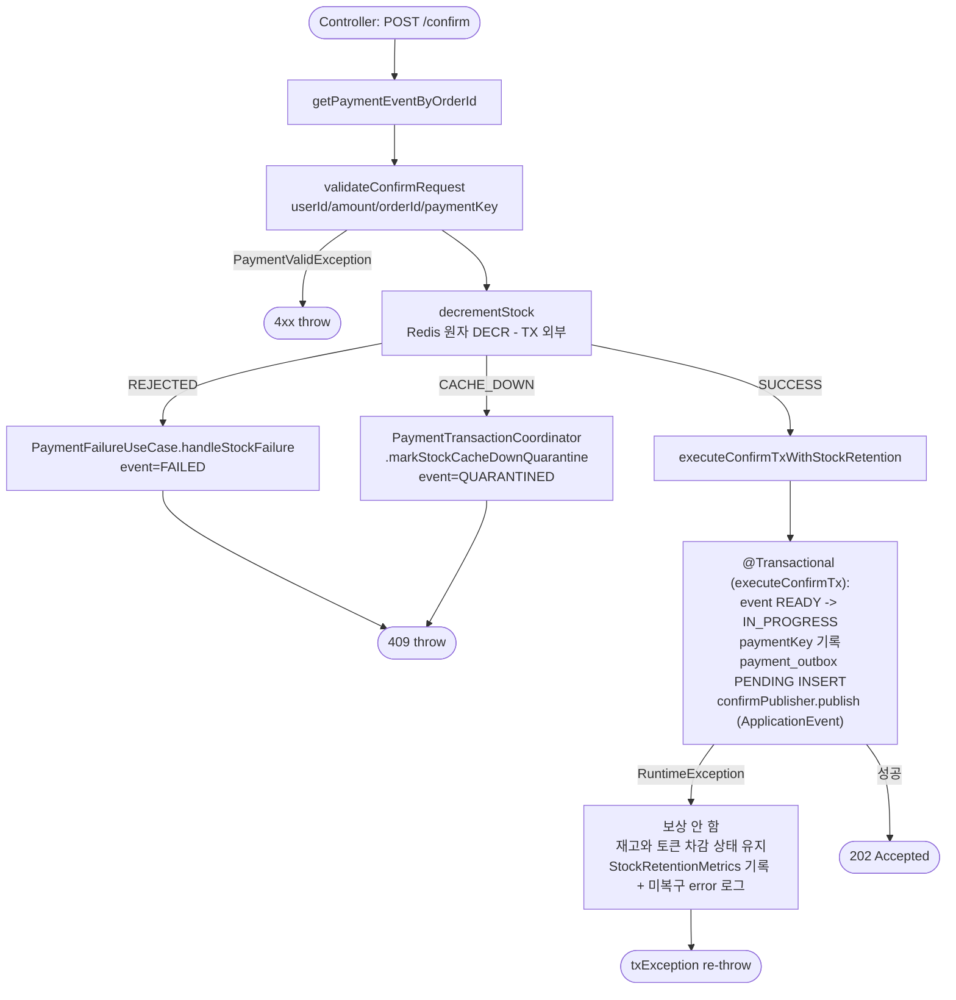
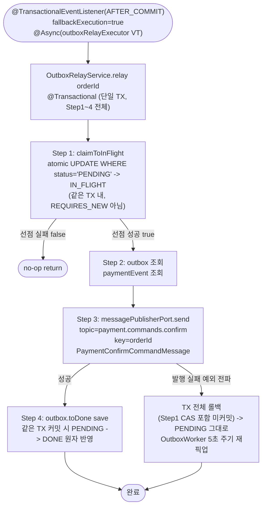
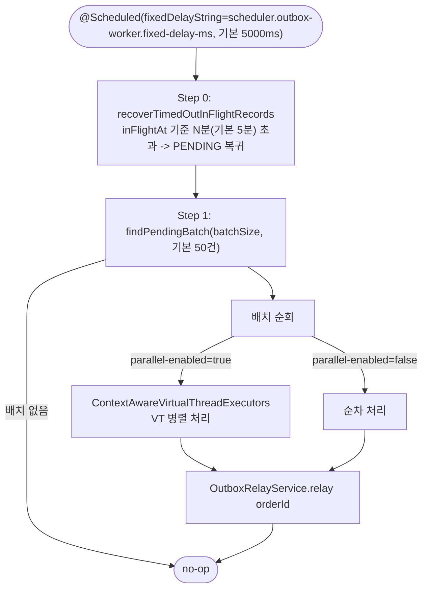
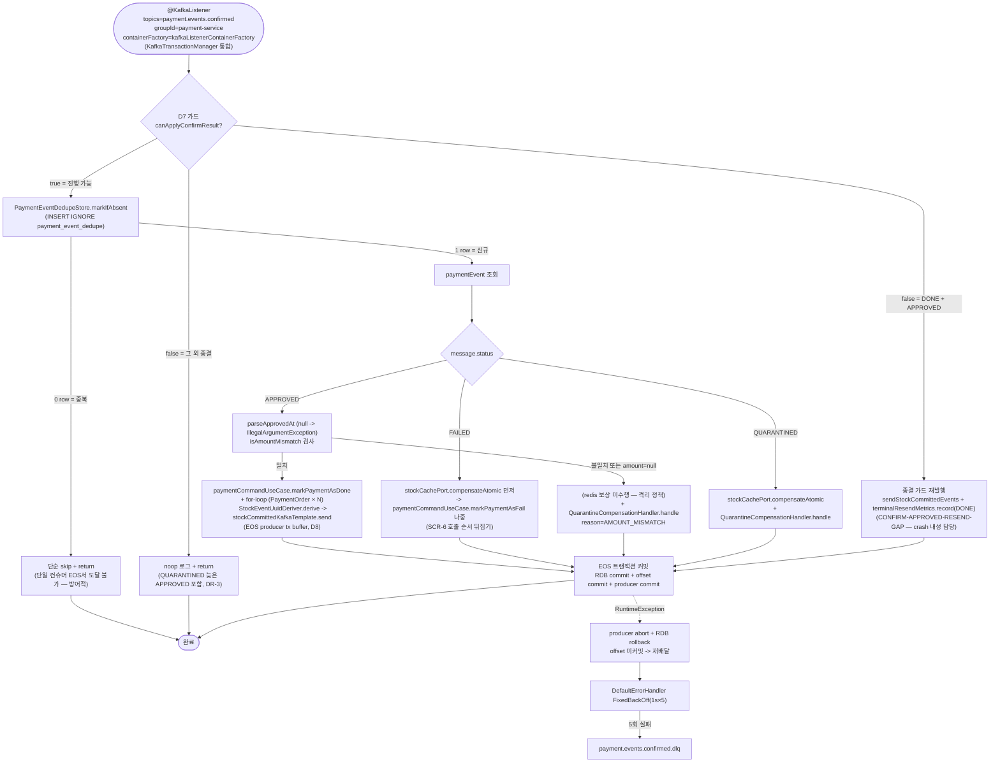
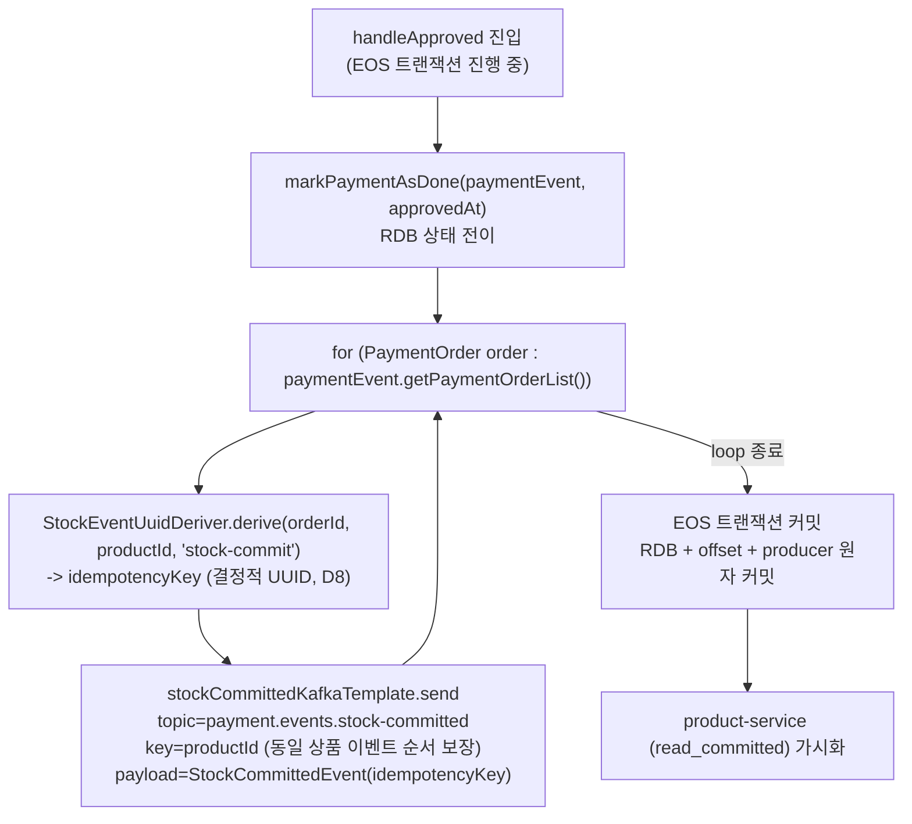
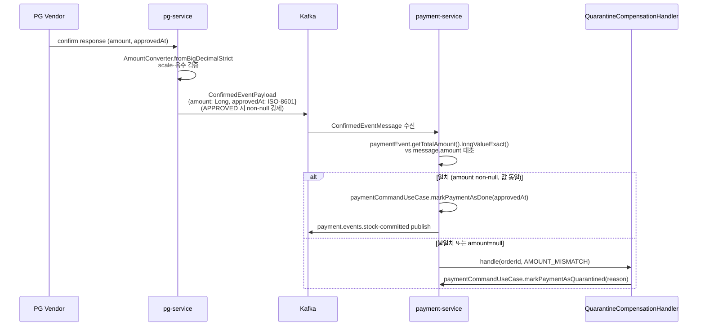
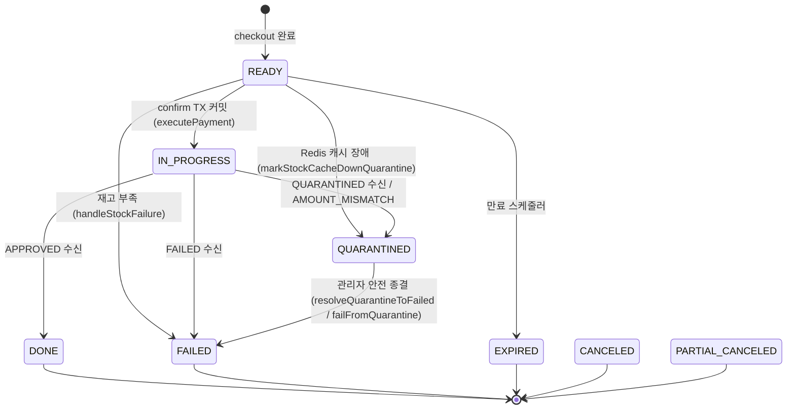
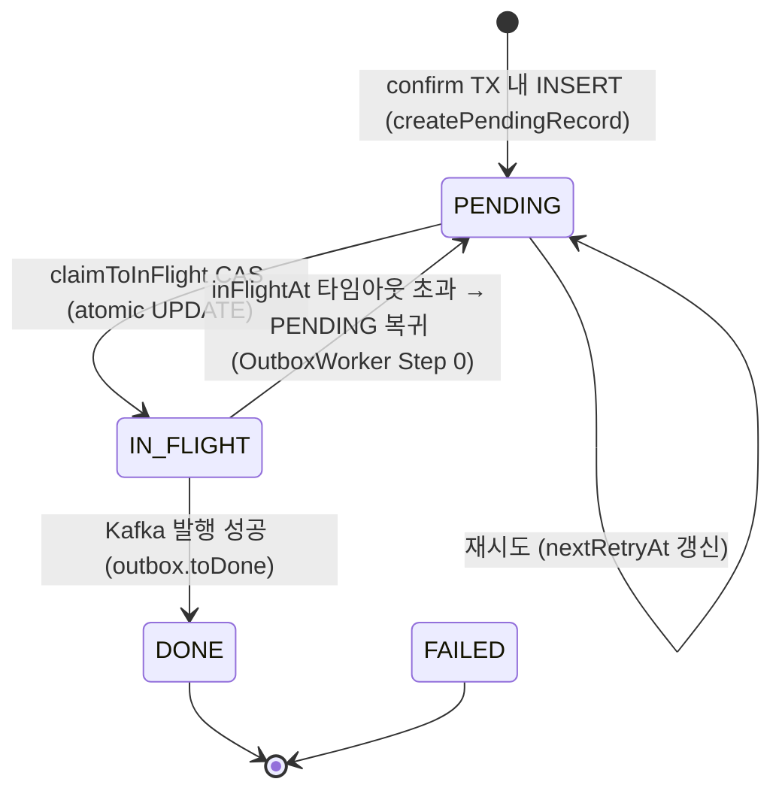

# Confirm Flow — payment-service 측 비동기 confirm 사이클

> 최종 갱신: 2026-07-11 (DLQ-QUARANTINE-RECOVERY — §9 상태 머신에 격리 복구 출구 `QUARANTINED → FAILED`(관리자 안전 종결, `resolveQuarantineToFailed` CAS) 추가 + §11 회복 시나리오에 격리 수동 종결·`events.confirmed.dlq` 수동 재주입 2행 추가 + §15 진입점 인덱스에 `QuarantineResolveUseCase`/`DlqReprocessUseCase`+`DlqReprocessPort`/`KafkaDlqReprocessAdapter`/`PaymentRecoveryAdminService`/`stock_compensation_if_decremented.lua` 등재 + §5 잔여 한계 서술을 "수동 재주입 도입, 자동 재시도 후속"으로 정정). 이전: 2026-07-07 (ship 코드 리뷰 반영 — §5·§6 stock-committed 발행 key 를 orderId 에서 실제 코드 기준 productId 로 정정("동일 상품 이벤트 순서 보장" 주석 반영, `PaymentConfirmResultUseCase.java:232-236`) + 상수명 `STOCK_COMMITTED` → `EVENTS_STOCK_COMMITTED` 정정 + §5 D5 멱등 마킹의 `markIfAbsent` 시그니처를 실제 4-인자(`eventUuid, orderId, status, expiresAt`)로 동기화(`PaymentEventDedupeStore.java:25`)). 이전: 2026-07-03 (DOCS-CONSISTENCY-OVERHAUL Task 10 — stale 마커 게이트 재검증에서 신규 발견, §14 VT+MDC 전파 서술이 EOS 전환에서 이미 폐기된 `StockOutboxImmediateEventHandler` 를 `OutboxImmediateEventHandler` 와 나란히 현재형으로 서술하던 것을 정정). 이전: 2026-07-02 (Task 7 — outbox 발행 실패 복구 서술을 단일 TX 롤백 기준으로 정정, `PaymentOutboxStatus.FAILED` dead-terminal 각주, `parallel-enabled` 기본값 코드/프로파일 층위 병기), 2026-06-23 (`parallel-enabled` 기본값 false 정정 — 코드 대조), 2026-05-29 (EOS-FOLLOWUP-CLEANUP — D7 가드 메서드 분리, TM qualifier 명시, dedupe cleanup 스케줄러 도입)
> end-to-end 플로우 (Phase 1~5 전체, pg-service 상세): [`PAYMENT-FLOW.md`](PAYMENT-FLOW.md)

본 문서는 **payment-service 측 비동기 confirm 사이클** 을 다룬다.
- PG 벤더 호출 (pg-service `PgConfirmService` + 전략 어댑터) 와 Kafka 양방향 왕복 전체 흐름은 `PAYMENT-FLOW.md` Phase 4 절이 담당한다.
- 다이어그램과 분석 텍스트를 한 파일에 통합 배치한다.
- pg-service 측 listener 분리 안 상세 (TX 경계 + 워커 분기 + 보정 경로 PENDING 우회) 는 §16 참조.

---

## 1. 개요

```
브라우저 POST /confirm
    → OutboxAsyncConfirmService (Redis DECR → TX → 202)
    → OutboxImmediateEventHandler (AFTER_COMMIT VT)
    → OutboxRelayService.relay (claimToInFlight CAS → Kafka publish)
    → [pg-service 처리 — PAYMENT-FLOW.md]
    → ConfirmedEventConsumer
    → PaymentConfirmResultUseCase.handle (EOS: KafkaTransactionManager + D7 가드 + D5 멱등 마킹 + D8 직접 발행)
    → payment.events.stock-committed 직접 발행 (EOS producer tx 안에서 APPROVED 시)
```

진입: `POST /api/v1/payments/confirm` (`PaymentController`)
출구: `payment.events.stock-committed` Kafka 발행 (APPROVED, EOS producer tx commit 시 가시화) / Redis 선차감 보상 (FAILED/QUARANTINED)

**EOS 전환 이후 변경 핵심**:
- `StockOutbox` 묶음 (`StockOutboxImmediateEventHandler` / `StockOutboxRelayService` / `StockOutboxKafkaPublisher` / `StockOutboxWorker` 등 16+ 파일) 폐기.
- 결제 결과 컨슈머가 `KafkaTransactionManager` 통합 — consumer offset commit + RDB commit + producer send 가 한 Kafka 트랜잭션으로 묶임.
- `PaymentEventDedupeStore.markIfAbsent(event_uuid)` INSERT IGNORE 로 메시지 단위 멱등 마킹.
- product-service `StockCommitConsumer` 가 `isolation.level=read_committed` 로 abort 된 메시지 invisible 보장.

---

## 2. 진입점 — `PaymentController` → `OutboxAsyncConfirmService.confirm`


```mermaid
flowchart TD
    A([Controller: POST /confirm]) --> B[getPaymentEventByOrderId]
    B --> LVAL[validateConfirmRequest<br/>userId/amount/orderId/paymentKey]
    LVAL -->|PaymentValidException| FAIL_4XX([4xx throw])
    LVAL --> DECR[decrementStock<br/>Redis 원자 DECR - TX 외부]

    DECR -->|REJECTED| RJ[PaymentFailureUseCase.handleStockFailure<br/>event=FAILED]
    DECR -->|CACHE_DOWN| CD[PaymentTransactionCoordinator<br/>.markStockCacheDownQuarantine<br/>event=QUARANTINED]
    DECR -->|SUCCESS| TX[executeConfirmTxWithStockRetention]

    RJ --> FAIL_409([409 throw])
    CD --> FAIL_409

    TX --> TX_INNER["@Transactional (executeConfirmTx):<br/>event READY -> IN_PROGRESS<br/>paymentKey 기록<br/>payment_outbox PENDING INSERT<br/>confirmPublisher.publish (ApplicationEvent)"]
    TX_INNER -->|RuntimeException| COMP[보상 안 함<br/>재고와 토큰 차감 상태 유지<br/>StockRetentionMetrics 기록 + 미복구 error 로그]
    COMP --> RETHROW([txException re-throw])
    TX_INNER -->|성공| RESP([202 Accepted])
```

**핵심 포인트:**
- `validateConfirmRequest` — TX 진입 전 도메인 가드. 위변조 / 상태 불일치 조기 차단.
- `decrementStock(orderId, paymentOrders)` — TX 외부. `PaymentTransactionCoordinator.decrementStock` 에서 `stockCachePort.decrementAtomic(orderId, paymentOrders)` Lua 1회 호출 (결제 단위 N개 상품 atomic 차감 + dedup token `decrement:done:{orderId}` SETNX P8D). 결과 enum 매핑: `OK` / `ALREADY_DONE` → `SUCCESS`, `INSUFFICIENT` → `REJECTED`, RuntimeException → `CACHE_DOWN`.
- `executeConfirmTx` — `@Transactional`. event 상태 전이 + outbox INSERT + `confirmPublisher.publish` (ApplicationEvent) 를 하나의 TX 에 원자 커밋. publish 가 TX 안에서 일어나야 AFTER_COMMIT 리스너가 TX 동기화 활성 상태에서 등록된다.
- 확정 TX 실패 시 재고를 보상하지 않는다 (재고와 토큰을 차감 상태로 유지). 미복구를 `StockRetentionMetrics` + `LogFmt.error`(`STOCK_RETENTION_UNRECOVERED`) 로 가시화한 뒤 원본 예외를 전파 — 과매도 0 정책 (STOCK-COMPENSATION-OTHER-PATHS). 토큰을 건드리지 않아 동시 confirm / 재확정이 모두 `ALREADY_DONE` 으로 정합하며, 포기 시 누수(redis < RDB 보수적 갭)는 재고 reconciler 후속(TC-3) 위임.
- 반환값: `PaymentConfirmAsyncResult` (orderId, amount). `202 Accepted` 즉시 반환.

---

## 3. AFTER_COMMIT 즉시 발행 — `OutboxImmediateEventHandler` + `OutboxRelayService`


```mermaid
flowchart TD
    EV(["@TransactionalEventListener(AFTER_COMMIT)<br/>fallbackExecution=true<br/>@Async(outboxRelayExecutor VT)"]) --> RELAY["OutboxRelayService.relay orderId<br/>@Transactional (단일 TX, Step1~4 전체)"]

    RELAY --> CL["Step 1: claimToInFlight<br/>atomic UPDATE WHERE status='PENDING' -> IN_FLIGHT<br/>(같은 TX 내, REQUIRES_NEW 아님)"]
    CL -->|선점 실패 false| SKIP([no-op return])
    CL -->|선점 성공 true| LOAD[Step 2: outbox 조회<br/>paymentEvent 조회]

    LOAD --> SEND["Step 3: messagePublisherPort.send<br/>topic=payment.commands.confirm<br/>key=orderId<br/>PaymentConfirmCommandMessage"]

    SEND -->|발행 실패 예외 전파| ROLLBACK["TX 전체 롤백<br/>(Step1 CAS 포함 미커밋) -> PENDING 그대로<br/>OutboxWorker 5초 주기 재픽업"]
    SEND -->|성공| DONE["Step 4: outbox.toDone save<br/>같은 TX 커밋 시 PENDING -> DONE 원자 반영"]

    DONE --> END([완료])
    ROLLBACK --> END
```

**책임 분석:**
- `OutboxImmediateEventHandler` — `@ConditionalOnProperty(payment.monolith.confirm.enabled, matchIfMissing=true)`. 기본 활성. 비활성 시 `OutboxWorker` 폴백만 작동.
- `@Async("outboxRelayExecutor")` — `AsyncConfig` 에서 정의한 가상 스레드 executor. OTel Context + MDC 이중 래핑 (`ContextAwareVirtualThreadExecutors.newWrappedVirtualThreadExecutor()`) — traceparent 끊김 없음.
- `OutboxRelayService.relay` — **단일 `@Transactional`** 메서드 안에서 claim(Step1)·조회(Step2)·Kafka 발행(Step3)·완료 마킹(Step4) 을 전부 수행한다. `claimToInFlight` 는 같은 TX 소속 `@Modifying` UPDATE(propagation 미지정 = REQUIRED)로, REQUIRES_NEW 로 별도 커밋되지 않는다. Kafka 발행(Step3)이 실패해 예외가 전파되면 TX 전체가 롤백되어 Step1 의 IN_FLIGHT 갱신도 함께 취소되고, row 는 (커밋된 적 없는) PENDING 그대로 남는다 — `OutboxWorker` 의 5초 주기 배치 재픽업이 1차 회복 경로다.
- `PaymentConfirmCommandMessage` 필드: `orderId`, `paymentKey`, `amount(BigDecimal)`, `vendorType(PaymentGatewayType)`, `eventUuid`. 현재 eventUuid = orderId 재사용 (confirm 은 orderId 당 1회만 발행되므로 orderId 가 고유 식별자로 기능).

---

## 4. 폴링 폴백 — `OutboxWorker`


```mermaid
flowchart TD
    S(["@Scheduled(fixedDelayString=scheduler.outbox-worker.fixed-delay-ms, 기본 5000ms)"]) --> R0["Step 0: recoverTimedOutInFlightRecords<br/>inFlightAt 기준 N분(기본 5분) 초과 -> PENDING 복귀"]
    R0 --> R1["Step 1: findPendingBatch(batchSize, 기본 50건)"]
    R1 -->|배치 없음| END([no-op])
    R1 --> LOOP[배치 순회]
    LOOP -->|parallel-enabled=true| PAR["ContextAwareVirtualThreadExecutors<br/>VT 병렬 처리"]
    LOOP -->|parallel-enabled=false| SEQ["순차 처리"]
    PAR --> RELAY[OutboxRelayService.relay orderId]
    SEQ --> RELAY
    RELAY --> END
```

**설정값 (application.yml):**
- `scheduler.outbox-worker.fixed-delay-ms`: 5000 (기본)
- `scheduler.outbox-worker.batch-size`: 50 (기본)
- `scheduler.outbox-worker.parallel-enabled`: 코드 fallback **false** (`OutboxWorker` 생성자 `@Value("${scheduler.outbox-worker.parallel-enabled:false}")`) / default 프로파일(로컬·docker 실구동 값)은 **true** (`application.yml`)
- `scheduler.outbox-worker.in-flight-timeout-minutes`: 5 (기본)

정상 환경에서 `OutboxImmediateEventHandler` 가 PENDING 을 즉시 처리하므로 `OutboxWorker` 는 대부분 no-op. 1차 회복 경로는 `findPendingBatch` 의 5초 주기 PENDING 배치 재픽업이며, 리스너 스킵과 §3 의 TX 롤백(Kafka 발행 실패)이 모두 여기로 수렴한다. `recoverTimedOutInFlightRecords` 의 IN_FLIGHT 타임아웃 회수는 워커 프로세스 비정상 종료 등 드문 경로에 대한 보조 안전장치다.

---

## 5. 결과 수신 — `ConfirmedEventConsumer` + `PaymentConfirmResultUseCase` (EOS 전환 후)


```mermaid
flowchart TD
    KC(["@KafkaListener<br/>topics=payment.events.confirmed<br/>groupId=payment-service<br/>containerFactory=kafkaListenerContainerFactory<br/>(KafkaTransactionManager 통합)"]) --> GUARD{"D7 가드<br/>canApplyConfirmResult?"}

    GUARD -->|false = DONE + APPROVED| RESEND_T["종결 가드 재발행<br/>sendStockCommittedEvents + terminalResendMetrics.record(DONE)<br/>(CONFIRM-APPROVED-RESEND-GAP — crash 내성 담당)"]
    GUARD -->|false = 그 외 종결| NOOP["noop 로그 + return<br/>(QUARANTINED 늦은 APPROVED 포함, DR-3)"]
    GUARD -->|true = 진행 가능| DEDUPE["PaymentEventDedupeStore.markIfAbsent<br/>(INSERT IGNORE payment_event_dedupe)"]

    DEDUPE -->|0 row = 중복| RESEND["단순 skip + return<br/>(단일 컨슈머 EOS서 도달 불가 — 방어적)"]
    DEDUPE -->|1 row = 신규| LOAD[paymentEvent 조회]
    LOAD --> SW{message.status}

    SW -->|APPROVED| AMT["parseApprovedAt (null -> IllegalArgumentException)<br/>isAmountMismatch 검사"]
    AMT -->|불일치 또는 amount=null| QU_AM["(redis 보상 미수행 — 격리 정책)<br/>+ QuarantineCompensationHandler.handle<br/>reason=AMOUNT_MISMATCH"]
    AMT -->|일치| DONE_OK["paymentCommandUseCase.markPaymentAsDone<br/>+ for-loop (PaymentOrder × N)<br/>  StockEventUuidDeriver.derive -> stockCommittedKafkaTemplate.send<br/>(EOS producer tx buffer, D8)"]

    SW -->|FAILED| FAIL_OK["stockCachePort.compensateAtomic 먼저<br/>-> paymentCommandUseCase.markPaymentAsFail 나중<br/>(SCR-6 호출 순서 뒤집기)"]

    SW -->|QUARANTINED| QU_PG["stockCachePort.compensateAtomic<br/>+ QuarantineCompensationHandler.handle"]

    DONE_OK --> COMMIT["EOS 트랜잭션 커밋<br/>RDB commit + offset commit + producer commit"]
    FAIL_OK --> COMMIT
    QU_AM --> COMMIT
    QU_PG --> COMMIT
    RESEND_T --> COMMIT
    RESEND --> END([완료])
    NOOP --> END
    COMMIT --> END

    COMMIT -.->|RuntimeException| ABORT["producer abort + RDB rollback<br/>offset 미커밋 -> 재배달"]
    ABORT --> RETRY["DefaultErrorHandler FixedBackOff(1s×5)"]
    RETRY -->|5회 실패| DLQ["payment.events.confirmed.dlq"]
```

**EOS 트랜잭션 구조:**
- `KafkaConsumerConfig` 의 `kafkaListenerContainerFactory` 가 `KafkaTransactionManager(stockCommittedProducerFactory)` 를 통합.
- consumer offset commit 이 producer 트랜잭션에 동행 (`sendOffsetsToTransaction`) — RDB commit + producer commit + offset commit 이 원자적.
- abort 시 RDB rollback + 발행 버퍼 폐기 + offset 미커밋 → 동일 메시지 재배달.

**EOS atomicity SSOT (RD1-2 명시):**
- `PaymentConfirmResultUseCase.handle` 의 `@Transactional(transactionManager = "transactionManager", timeout = 5)` 는 `@Primary JpaTransactionManager` 를 qualifier 로 **명시 고정** 한다 (EOS-FOLLOWUP-CLEANUP — 이전 qualifier 미명시 시 다중 TM 환경에서 선택 모호성 제거). `KafkaTransactionManager(EOS)` 와 별개 TM 임을 코드 레벨에서 못박는다.
- 결과적으로 RDB commit(JPA inner) 과 Kafka commit(EOS outer) 사이에 crash 시 at-least-once 재배달이 발생한다 (best-effort 1PC 한계). 이 한계와 TM 분리 원칙은 `handle` Javadoc 에 명시되어 있다.
- **crash 내성 SSOT 는 종결 가드 재발행 (CONFIRM-APPROVED-RESEND-GAP, #112)**: APPROVED 경로에서 RDB DONE 커밋 후 EOS 커밋이 유실되면 재배달이 D7 종결 가드에 도달하는데, `status==DONE && message==APPROVED` 이면 `sendStockCommittedEvents` 를 **재발행**한다(`terminalResendMetrics.record(DONE)` 계측). product-service 가 결정적 키 `StockEventUuidDeriver.derive(orderId, productId)`(message eventUuid 와 독립) 로 멱등 흡수 → 차감 정확히 1회. over-publish 무해 / under-publish 위험 비대칭을 이용한다.
- **과거 SSOT(폐기)**: "0 row(중복) 시 발행 항상 진행(위키 line 141)" 분기는 dedupe 마킹과 종결 전이가 같은 JPA tx 로 원자 커밋되어 "dedupe됨+비종결" 조합이 단일 컨슈머 EOS 흐름에서 발생 불가 → **도달 불가 dead branch** 였다. CONFIRM-APPROVED-RESEND-GAP 에서 제거(단순 skip)되고 crash 내성은 위 종결 가드 재발행으로 이전됐다.
- **잔여 한계 (over-sell)**: 종결 가드 재발행도 같은 EOS producer tx 안에서 발행되므로, EOS 커밋이 **지속** 실패하면 재발행 자체가 매번 abort 돼 stock-committed 완전 유실(payment DONE 인데 재고 확정 영구 소실 → redis 선차감과 product RDB 발산 → over-sell). 단 입력 `events.confirmed` 메시지는 명시 연결된 `AfterRollbackProcessor` 가 backoff 소진 후 DLQ 로 발행해 **가시화**한다(DLQ-REACHABILITY, 아래 에러 핸들링 절). DLQ 적체분은 관리자 수동 재주입(`DlqReprocessUseCase`, §11)으로 원 토픽에 되돌려 재처리한다. 조건부 자동 재시도는 후속(TQ-1).
- EOS 는 "정상 경로에서 at-most-once 중복 발행 방지" 최적화이다. ChainedKafkaTransactionManager 도입은 미채택 — qualifier 명시로 TM 선택만 확정 (EOS-FOLLOWUP-CLEANUP 완료).

**D7 진입 가드:**
- `paymentEvent.getStatus().canApplyConfirmResult()` — READY / IN_PROGRESS 만 true. DONE / FAILED / CANCELED / PARTIAL_CANCELED / EXPIRED / QUARANTINED 는 false → 종결 분기.
- **종결 분기(false)**: `status==DONE && message==APPROVED` 이면 stock-committed 재발행(위 crash 내성 SSOT, CONFIRM-APPROVED-RESEND-GAP), 그 외 종결은 noop return.
- QUARANTINED 결제에 늦은 APPROVED 메시지가 도착해도 status≠DONE 이라 재발행 미트리거 + noop 차단 — DLQ silent 분기 방지 (DR-3 가드 불변).

**D5 멱등 마킹 (`payment_event_dedupe`):**
- `PaymentEventDedupeStore.markIfAbsent(eventUuid, orderId, status, expiresAt) → int`.
- `INSERT IGNORE INTO payment_event_dedupe(event_uuid, ...)` — affected rows 0 = 중복, 1 = 신규.
- 0 row 시 **단순 skip + return** — 단일 컨슈머 EOS 흐름에서 dedupe 마킹과 종결 전이가 같은 JPA tx 로 원자 커밋되어 이 분기는 도달 불가(방어적). 과거 "발행 항상 진행(위키 line 141)" 은 dead branch 라 CONFIRM-APPROVED-RESEND-GAP 에서 제거됨 (crash 내성은 종결 가드 재발행으로 이전).
- TTL: `expires_at = receivedAt + 8일` (Kafka retention 7d + 복구 버퍼 1d).

**D8 직접 발행 (EOS producer tx):**
- APPROVED 경로: `for-loop(paymentEvent.getPaymentOrderList())` 안에서 `StockEventUuidDeriver.derive(orderId, productId, "stock-commit")` → `stockCommittedKafkaTemplate.send(topic, key, payload)`.
- producer tx 안에서 buffer — RDB commit 과 같은 트랜잭션 커밋 시 product-service 에 원자적으로 가시화.
- multi-product 결제 N건의 idempotencyKey 가 각 productId 별로 결정적으로 다름 (DR-1 회귀 가드).

**Spring Kafka native 에러 핸들링:**
- `KafkaErrorHandlerConfig` (`infrastructure/config`) 에서 `DefaultErrorHandler` + `DeadLetterPublishingRecoverer` + `FixedBackOff(1000ms, 5)` 빈 등록.
- not-retryable 예외: `MessageConversionException` / `IllegalArgumentException` / `IllegalStateException` — 즉시 DLQ.
- 그 외 RuntimeException — 1초 간격으로 5회 재시도 후 한도 초과 시 `payment.events.confirmed.dlq` 로 publish.
- `PaymentConfirmResultUseCase` 는 예외를 그대로 throw — retry / DLQ 책임은 Spring Kafka 가 가져간다.
- **두 실패 경로 구분 (DLQ-REACHABILITY)**: 위 `DefaultErrorHandler`(+DLQ recoverer) 는 **리스너가 던진 도메인 예외**에만 적용된다. EOS `commitTransaction()` 자체의 실패는 리스너 반환 *이후* 컨테이너 트랜잭션 커밋 단계라 별개 경로인 **`AfterRollbackProcessor`** 로 처리된다. 과거에는 컨테이너 디폴트(interval 0, maxAttempts 9, recoverer 단순 로그)라 DLQ 미진입·단순 스킵이었으나, 이제 `KafkaConsumerConfig` 가 `factory.setAfterRollbackProcessor(...)` 로 **동일 `DeadLetterPublishingRecoverer`**(비트랜잭션 `confirmedDlqKafkaTemplate` 공유 — 실패하는 EOS tx 와 분리) + `FixedBackOff`(신규 설정키 `payment.kafka.after-rollback.backoff.{interval,max-attempts}`, 기본 1000ms×5)를 **명시 연결**한다 → backoff 소진 후 `events.confirmed.dlq` 로 발행 + `PaymentEosCommitFailureMetrics`(`payment_eos_commit_failure_dlq_total`) 계측. 단 종결 가드 재발행도 같은 EOS tx 라 commit 이 지속 실패하면 stock-committed 자체는 여전히 완전 유실(over-sell 잔여 위험) — DLQ 메시지는 코디네이터 회복 후 재주입으로 복구(자동 복구는 후속 TQ-1).

**Lua atomic dedup token (orderId 단위):**
- `compensateAtomic(orderId, orders)` 가 `lua/stock_compensation_atomic.lua` 1회 호출 — 결제 단위 N개 상품 atomic 보상 + dedup token `compensation:done:{orderId}` SETNX P8D. 동일 orderId 재처리 시 `ALREADY_DONE` 반환 → 보상 멱등.
- 차감 측은 `decrement:done:{orderId}` SETNX P8D 가 차감 멱등을 보장.

### handleApproved (양방향 amount 방어 + EOS 직접 발행)

```
parseApprovedAt(message.approvedAt)
      [null] → IllegalArgumentException ("APPROVED 메시지에 approvedAt 이 null") → 즉시 DLQ

isAmountMismatch(paymentEvent, message.amount)
      paymentEvent.getTotalAmount().longValueExact() vs message.amount
      [불일치 또는 message.amount null] → true

if (isAmountMismatch)
      → (redis 보상 미수행 — 격리 정책)
      → QuarantineCompensationHandler.handle(orderId, "AMOUNT_MISMATCH")
        early return

else
      paymentCommandUseCase.markPaymentAsDone(paymentEvent, receivedApprovedAt)
      // AOP @PaymentStatusChange + @PublishDomainEvent 가 상태 전이 감사 기록

      for (PaymentOrder order : paymentEvent.getPaymentOrderList()):
        String idempotencyKey = StockEventUuidDeriver.derive(orderId, productId, "stock-commit")
        StockCommittedEvent payload = new StockCommittedEvent(orderId, productId, quantity, idempotencyKey)
        stockCommittedKafkaTemplate.send(PaymentTopics.EVENTS_STOCK_COMMITTED, String.valueOf(productId), payload)
      // 메시지 키는 productId — 동일 상품 이벤트의 순서를 보장한다
      // EOS producer tx 안에서 buffer → 트랜잭션 커밋 시 원자적으로 가시화
```

> AMOUNT_MISMATCH 시 `handleApproved` 내부에서 redis 보상을 **직접 호출하지 않는다**. `QuarantineCompensationHandler.handle` 위임 후 early return. 보상은 별도 관리 경로(격리 정책).

### handleFailed (호출 순서 뒤집기 — SCR-6)

```
stockCachePort.compensateAtomic(orderId, paymentOrders)
// Redis 선차감 캐시 복원. Lua atomic + dedup token compensation:done:{orderId} SETNX P8D.
// 보상이 먼저 끝나야 markPaymentAsFail 영구 실패 시에도 재고는 이미 복원돼 silent loss 0.

paymentCommandUseCase.markPaymentAsFail(paymentEvent, reasonCode)
// AOP 감사 기록. 영구 실패 시 예외 throw → DefaultErrorHandler → retry → 한도 초과 시 DLQ.
// L7 cascade 인지: DLQ + Reconciler resetToReady + 새 confirm 사이클 → 재고 발산 가능 (PG 멱등성으로 일반 차단)
```

### handleQuarantined

```
stockCachePort.compensateAtomic(orderId, paymentOrders)

QuarantineCompensationHandler.handle(orderId, reasonCode)
      → event 가 이미 terminal 이면 no-op (이중 전이 방지)
      → paymentCommandUseCase.markPaymentAsQuarantined
```

---

## 6. EOS 직접 발행 — `stockCommittedKafkaTemplate` (EOS 전환 후)

APPROVED 결과에서만 발행됨 — FAILED/QUARANTINED 시 stock 발행 X (redis 보상만).

EOS 전환 이후 `StockOutboxImmediateEventHandler` / `StockOutboxRelayService` / `StockOutboxWorker` 묶음은 폐기됨.
`PaymentConfirmResultUseCase.handleApproved` 안에서 `stockCommittedKafkaTemplate.send` 를 **EOS producer 트랜잭션 안에서 직접 호출**.


```mermaid
flowchart TD
    APPROVED["handleApproved 진입<br/>(EOS 트랜잭션 진행 중)"] --> MARK_DONE["markPaymentAsDone(paymentEvent, approvedAt)<br/>RDB 상태 전이"]
    MARK_DONE --> LOOP["for (PaymentOrder order : paymentEvent.getPaymentOrderList())"]
    LOOP --> DERIVE["StockEventUuidDeriver.derive(orderId, productId, 'stock-commit')<br/>-> idempotencyKey (결정적 UUID, D8)"]
    DERIVE --> SEND["stockCommittedKafkaTemplate.send<br/>topic=payment.events.stock-committed<br/>key=productId (동일 상품 이벤트 순서 보장)<br/>payload=StockCommittedEvent(idempotencyKey)"]
    SEND --> LOOP
    LOOP -->|loop 종료| COMMIT["EOS 트랜잭션 커밋<br/>RDB + offset + producer 원자 커밋"]
    COMMIT --> VISIBLE["product-service (read_committed) 가시화"]
```

**책임 분석:**
- `stockCommittedKafkaTemplate` — `KafkaProducerConfig` 의 EOS-aware `stockCommittedProducerFactory` 로 생성된 `KafkaTemplate`. `transactional.id = ${spring.application.name}-${HOSTNAME:local}-` prefix.
- `StockEventUuidDeriver.derive` — DR-1 회귀 가드 보존. multi-product 결제 N건의 idempotencyKey 를 `orderId + productId + action` 으로 결정적으로 도출 → 재배달 시에도 동일 key 생성.
- `payment_stock_outbox` 테이블 — Flyway V3 (`V3__drop_payment_stock_outbox.sql`) 로 DROP 완료. 폴링 폴백 워커 없음.

**폐기된 컴포넌트** (EOS 전환 이후):
- `StockOutboxImmediateEventHandler`, `StockOutboxRelayService`, `StockOutboxKafkaPublisher`, `StockOutboxWorker`
- `StockOutbox` 도메인, `StockOutboxEntity`, `StockOutboxFactory`, `StockOutboxReadyEvent`
- `StockOutboxRepository`, `StockOutboxPublisherPort`, `JpaStockOutboxRepository`, `StockOutboxRepositoryImpl`

---

## 7. AMOUNT_MISMATCH 양방향 방어


```mermaid
sequenceDiagram
    participant Vendor as PG Vendor
    participant Pg as pg-service
    participant K as Kafka
    participant Pay as payment-service
    participant Quar as QuarantineCompensationHandler

    Vendor->>Pg: confirm response (amount, approvedAt)
    Pg->>Pg: AmountConverter.fromBigDecimalStrict<br/>scale·음수 검증
    Pg->>K: ConfirmedEventPayload<br/>{amount: Long, approvedAt: ISO-8601}<br/>(APPROVED 시 non-null 강제)
    K->>Pay: ConfirmedEventMessage 수신
    Pay->>Pay: paymentEvent.getTotalAmount().longValueExact()<br/>vs message.amount 대조

    alt 일치 (amount non-null, 값 동일)
        Pay->>Pay: paymentCommandUseCase.markPaymentAsDone(approvedAt)
        Pay->>K: payment.events.stock-committed publish
    else 불일치 또는 amount=null
        Pay->>Quar: handle(orderId, AMOUNT_MISMATCH)
        Quar->>Pay: paymentCommandUseCase.markPaymentAsQuarantined(reason)
    end
```

- **pg 측 방어 (1단)**: `AmountConverter.fromBigDecimalStrict` — scale·음수 검증 (`PgInboxRepositoryImpl.insertPending` 경로 + `DuplicateApprovalHandler.amountMismatch` 경로). TC-16 dead service 제거 완료. `ConfirmedEventPayload` 에 APPROVED 시 amount non-null 강제.
- **payment 측 방어 (2단)**: `isAmountMismatch(paymentEvent, message.amount)` — `paymentEvent.getTotalAmount().longValueExact()` 와 수신 amount 대조. `message.amount` null → 불일치로 처리.

---

## 8. D12 재고 복구 가드 — 폐기 (ADR-04 + STOCK-COMPENSATION-OTHER-PATHS)

`executePaymentFailureCompensationWithOutbox`(내부 `compensateStockCacheGuarded` + `event.status.canCompensateStock()` 가드)는 payment-service 가 PG 를 직접 폴링하던 시절 `OutboxProcessingService` 가 호출하던 실패 보상 가드였다. ADR-04(PG 호출·재시도·실패 보상 로직 pg-service 이관)로 그 워커가 삭제되며 운영 호출처 0 의 死 코드가 됐고, STOCK-COMPENSATION-OTHER-PATHS 에서 메서드·가드·`canCompensateStock`·관련 테스트를 제거했다 (형제 outbox 처리 메서드 `executePaymentSuccessCompletionWithOutbox` / `executePaymentRetryWithOutbox` / `executePaymentQuarantineWithOutbox` 도 동반 제거).

현행 재고 보상 책임 분담:
- **확정 진입 실패** (executeConfirmTx RuntimeException): 보상하지 않고 차감 상태 유지 + 미복구 가시화 — 과매도 0 정책 (§2 참고).
- **결과 수신 실패 / 격리** (events.confirmed FAILED / QUARANTINED): `PaymentConfirmResultUseCase.handleFailed` / `handleQuarantined` 가 `compensateAtomic` 으로 보상.

---

## 9. 상태 머신

### PaymentEventStatus


```mermaid
stateDiagram-v2
    [*] --> READY : checkout 완료

    READY --> IN_PROGRESS : confirm TX 커밋 (executePayment)
    READY --> EXPIRED : 만료 스케줄러
    READY --> FAILED : 재고 부족 (handleStockFailure)
    READY --> QUARANTINED : Redis 캐시 장애 (markStockCacheDownQuarantine)

    IN_PROGRESS --> DONE : APPROVED 수신
    IN_PROGRESS --> FAILED : FAILED 수신
    IN_PROGRESS --> QUARANTINED : QUARANTINED 수신 / AMOUNT_MISMATCH

    QUARANTINED --> FAILED : 관리자 안전 종결 (resolveQuarantineToFailed / failFromQuarantine)

    DONE --> [*]
    FAILED --> [*]
    EXPIRED --> [*]
    CANCELED --> [*]
    PARTIAL_CANCELED --> [*]
```

| 상태 | 의미 | 진입 메서드 | `isTerminal()` | `GET /status` 폴링 응답 |
|---|---|---|---|---|
| READY | 결제 초기 생성 | checkout 완료 | false | PROCESSING (default) |
| IN_PROGRESS | confirm TX 커밋, paymentKey 기록 | `executePayment()` | false | PROCESSING (default) |
| DONE | PG 결제 완료 (approvedAt non-null) | `markPaymentAsDone()` | true | DONE |
| FAILED | 재고 부족 / PG 종결 실패 | `markPaymentAsFail()` | true | FAILED |
| QUARANTINED | 판단 불가 격리 (수동 확인 필요, 관리자 FAILED 안전 종결 가능) | `markPaymentAsQuarantined()` | **false** | PROCESSING ⚠️ |
| CANCELED | PG 취소 | 별도 경로 | true | PROCESSING (default) |
| PARTIAL_CANCELED | 부분 취소 | 별도 경로 | true | PROCESSING (default) |
| EXPIRED | 만료 스케줄러 | 별도 경로 | true | PROCESSING (default) |

> **QUARANTINED `isTerminal()` = false 코드 사실**: `PaymentEventStatus.isTerminal()` 구현에서 QUARANTINED 는 non-terminal. Javadoc: "QUARANTINED 는 후속 복구 워커가 보정/포기 결정하는 대기 상태이므로 non-terminal."
>
> **운영 영향**: `PaymentStatusServiceImpl.mapEventStatus` 의 switch 에서 DONE → StatusType.DONE, FAILED → StatusType.FAILED, 그 외 default → StatusType.PROCESSING. QUARANTINED 는 default 분기 → PROCESSING. 격리된 결제는 admin 이 강제 전이해야 클라이언트 폴링이 종료된다 — 현재 관리자 도구는 **FAILED 안전 종결**만 지원한다(`QuarantineResolveUseCase` → `resolveQuarantineToFailed` CAS 전이 + `decrement:done` 토큰 조건부 재고 보상 + audit). 정상 결제를 DONE 으로 되살리는 복구는 후속(TQ-2).

`canApplyConfirmResult()` (confirm 결과 적용 진입 가드) = READY / IN_PROGRESS (재고 차감이 발생했을 수 있는 상태). 과거 RETRYING 진입 경로(`markPaymentAsRetrying`)는 운영 호출처 0 으로 CLEANUP-BATCH-E 에서 enum 케이스·전이·가드 분기와 함께 제거됐다. 과거 짝이던 `canCompensateStock()` 보상 가드는 STOCK-COMPENSATION-OTHER-PATHS 에서 死 코드로 제거됐다 (확정 진입 보상 폐기 + D12 가드 死 코드 정리). 교차 동조 불변식 테스트(`PaymentEventStatusCrossInvariantTest`)도 함께 제거.

### PaymentOutboxStatus


```mermaid
stateDiagram-v2
    [*] --> PENDING : confirm TX 내 INSERT (createPendingRecord)

    PENDING --> IN_FLIGHT : claimToInFlight CAS (atomic UPDATE)
    IN_FLIGHT --> DONE : Kafka 발행 성공 (outbox.toDone)
    IN_FLIGHT --> PENDING : inFlightAt 타임아웃 초과 → PENDING 복귀 (OutboxWorker Step 0)
    PENDING --> PENDING : 재시도 (nextRetryAt 갱신)

    DONE --> [*]
    FAILED --> [*]
```

| 상태 | 의미 |
|---|---|
| PENDING | 발행 대기. AFTER_COMMIT 리스너 또는 OutboxWorker 가 처리 |
| IN_FLIGHT | 워커가 선점, 발행 진행 중 (또는 타임아웃 대기) |
| DONE | Kafka 발행 성공 (`isTerminal()` = true) |
| FAILED | 정의된 종결 상태(`isTerminal()` = true). **현재 도달하는 코드 경로 0건** — `PaymentOutbox.toFailed()` 삭제, `PaymentOutboxUseCase.incrementRetryOrFail` 호출처 0(dead terminal state) |

IN_FLIGHT 타임아웃(`inFlightTimeoutMinutes`, 기본 5분) 초과 → PENDING 복귀. 워커 프로세스 비정상 종료 등 드문 경로에 대한 보조 회복이며, Kafka 발행 실패의 1차 회복 경로는 §3 의 TX 롤백 → PENDING 즉시 복귀다.

---

## 10. 재시도 정책 — 두 layer 분리

두 서비스가 **다른 layer 의 다른 실패 모드** 를 각자 책임진다.

| | payment-service | pg-service |
|---|---|---|
| 책임 layer | Kafka publish (자기 → broker) | 외부 PG 호출 (vendor 응답) |
| 실패 종류 | broker 도달 실패 / ack 없음 / publish timeout | vendor 5xx / timeout / transient |
| 정책 정의 | `RetryPolicyProperties` (env 주입, `payment.retry.*`) | `pg-service/.../domain/RetryPolicy.java` (hardcoded) |
| maxAttempts | **5** (기본, `@DefaultValue("5")`) | 4 (`MAX_ATTEMPTS`) |
| backoff 전략 | **FIXED 5s** (기본, `@DefaultValue("FIXED")` + `@DefaultValue("5000")`) | EXPONENTIAL × jitter (base=2s, ×3, ±25%) |
| maxDelayMs | **60000ms** (기본) | — |
| 시각 표현 | `payment_outbox.next_retry_at` (RDB row) | `pg_outbox.available_at` (RDB row) + Kafka self-loop |
| 한도 초과 시 | outbox FAILED — enum 정의만 존재, 전이 코드 경로 0건(dead terminal). 현재는 PENDING 상태로 무기한 재픽업(별도 한도 없음) | `payment.commands.confirm.dlq` 로 격리 |
| 트리거 | `OutboxImmediateEventHandler` / `@Scheduled OutboxWorker` | `PaymentConfirmConsumer` → self-loop (attempt 헤더) |
| 코드 진입점 | `OutboxWorker` 5초 주기 배치 재픽업(`OutboxRelayService.relay`) — `PaymentOutboxUseCase.incrementRetryOrFail` 는 정의만 있고 호출처 0(dead) | `PgVendorCallService.handleRetry` |

**핵심 비대칭:**
- payment 측: "내가 Kafka broker 에 publish 못함" 회복 — outbox CAS + 워커 폴백
- pg 측: "vendor 가 답을 안 함" 회복 — Kafka self-loop. attempt 는 `pg_inbox.attempt`(Flyway V5) 에 영속·증가(retry 분기 TX_B `incrementAttempt`)해 한도(4) 소진 시 DLQ→QUARANTINED 자동 격리 (DLQ-REACHABILITY). 상세: [PAYMENT-FLOW §4.6/§4.10](PAYMENT-FLOW.md)
- Kafka client 기본 error handler 커스터마이즈 없음 (application-level retry 가 대체)

---

## 11. 회복 시나리오 인덱스

| 장애 | 동작 |
|---|---|
| 리스너 스킵 / 워커 크래시 (payment 측) | `OutboxWorker` 가 PENDING + IN_FLIGHT 타임아웃 초과 분 PENDING 복귀 후 재픽업 |
| Kafka producer 실패 (payment → broker) | `OutboxRelayService.relay` 단일 TX 전체 롤백 → PENDING 즉시 복귀 → `OutboxWorker` 5초 주기 재픽업 |
| pg-service 측 retryable (5xx/timeout) | pg-service 자체 retry — `pg_outbox.available_at = now + backoff` 로 `payment.commands.confirm` 재발행. IN_PROGRESS 분기에서도 vendor 재호출 (`handleInProgress(command, attempt)`, 2026-04-27 변경). attempt < 4 까지 |
| pg-service 측 retry 한도 초과 (attempt ≥ 4) | `payment.commands.confirm.dlq` 로 격리 → `PaymentConfirmDlqConsumer` → `PgDlqService` → pg_inbox QUARANTINED → events.confirmed QUARANTINED → payment `handleQuarantined` |
| pg-service 측 non-retryable (4xx) | pg_inbox FAILED → events.confirmed FAILED → payment `handleFailed` |
| pg-service 측 판단 불가 / 5xx 한도 소진 | pg_inbox QUARANTINED → events.confirmed QUARANTINED → payment `handleQuarantined` |
| Redis 재고 캐시 장애 (CACHE_DOWN) | confirm 단계 CACHE_DOWN → event QUARANTINED + `quarantine_compensation_pending=true` |
| AMOUNT_MISMATCH 감지 | `handleApproved` 내부 격리 → `QuarantineCompensationHandler.handle(AMOUNT_MISMATCH)` |
| 중복 메시지 (payment 측 events.confirmed) | `payment_event_dedupe` INSERT IGNORE (D5 멱등 마킹) — 0 row = **단순 skip(도달 불가 dead branch)**. Lua atomic dedup token (차감/보상 단위 orderId P8D) 은 redis 보상 멱등을 별도 보장. |
| APPROVED RDB DONE 커밋 후 EOS 발행 유실 (일시적) | 재배달이 D7 종결 가드 도달 → `status==DONE && APPROVED` 면 stock-committed **재발행**(CONFIRM-APPROVED-RESEND-GAP, #112). product 결정적 키 흡수 → 차감 1회. crash 내성 SSOT. |
| stock-committed 재배달 | product-service `JdbcEventDedupeStore` (stock_commit_dedupe UNIQUE INSERT IGNORE, 같은 TX) 가 흡수. idempotencyKey = `StockEventUuidDeriver.derive` 결정적 UUID (DR-1 보존). |
| EOS abort — 리스너 도메인 예외 | RDB rollback + offset 미커밋 → 재배달 → DefaultErrorHandler FixedBackOff 1s×5 → 한도 시 DLQ. product-service 측 abort 메시지 invisible (read_committed). |
| EOS abort — `commitTransaction` 지속 실패 | 명시 연결된 `AfterRollbackProcessor`(공유 DLQ recoverer + `FixedBackOff` 기본 1000ms×5) → backoff 소진 후 `events.confirmed.dlq` 발행 + `payment_eos_commit_failure_dlq_total` metric. 단 종결 가드 재발행도 같은 EOS tx 라 stock-committed 자체는 완전 유실(over-sell 잔여, 회복 후 재주입 복구) — DLQ-REACHABILITY. |
| payment event IN_PROGRESS 장기 체류 | `PaymentReconciler` (`@Scheduled fixedDelayMs=120000, 2분`) — `findInProgressOlderThan(cutoff)` → `event.resetToReady` → `OutboxWorker` 재픽업 |
| 격리(QUARANTINED) 결제 수동 종결 | 관리자 `POST /admin/.../resolve-quarantine` → `QuarantineResolveUseCase`: `decrement:done` 토큰 존재 시에만 재고 보상(`compensateIfDecremented`, 유령 재고 방지) → `resolveQuarantineToFailed` CAS(event `WHERE status='QUARANTINED'` → order 동조 전이) → FAILED 안전 종결 + audit. |
| `events.confirmed.dlq` 적체 메시지 복구 | 관리자 `POST /admin/.../reprocess-dlq` → `DlqReprocessUseCase` → `KafkaDlqReprocessAdapter` 가 offset 미커밋 스캔으로 대상 페이로드 조회 → 원 토픽 `events.confirmed` 재발행 → EOS 컨슈머 재처리. 나이 게이트(DONE + 종결시각+P8D 초과) 차단. `payment_dlq_reprocess_total` 계측. 자동 재시도는 후속(TQ-1). |

---

## 12. dedup token / dedupe TTL 정리 (payment-service)

| token / 테이블 | 저장소 | TTL | 의미 |
|---|---|---|---|
| `decrement:done:{orderId}` | Redis (Lua `stock_decrement_atomic.lua`) | P8D (8일) | 결제 단위 차감 완료 마커. 동일 orderId 재진입 시 `ALREADY_DONE` 반환으로 차감 멱등 보장. |
| `compensation:done:{orderId}` | Redis (Lua `stock_compensation_atomic.lua`) | P8D (8일) | 결제 단위 보상 완료 마커. 동일 orderId 재진입 시 `ALREADY_DONE` 반환으로 보상 멱등 보장. |
| `payment_event_dedupe.event_uuid` | MySQL (INSERT IGNORE) | `expires_at = receivedAt + P8D` | 메시지 단위 dedupe. 0 row = 중복 skip. TTL 정리는 `DedupeCleanupWorker`(`@Scheduled fixedDelayMs=3600000, 1시간`)가 `deleteExpired` 로 만료 행을 배치 삭제(구현 완료). |

P8D = Kafka retention(7d) + 복구 버퍼(1d). product-service `StockCommitUseCase.DEDUPE_TTL` 과 정렬.

---

## 13. 멱등성 layer 정리 (payment-service 측)

| 위치 | 메커니즘 | 코드 |
|---|---|---|
| confirm 진입 | `validateConfirmRequest` LVAL 가드 — TX 진입 전 도메인 검증 | `PaymentEvent.validateConfirmRequest` |
| confirm TX | `@Transactional` + `payment_outbox PENDING` 단일 TX 커밋 | `PaymentTransactionCoordinator.executeConfirmTx` |
| checkout 중복 | `IdempotencyStoreRedisAdapter` — Redis SET NX EX. 키=`Idempotency-Key` 헤더 | `IdempotencyStoreRedisAdapter.getOrCreate` |
| outbox claim | `claimToInFlight` 단일 TX 내 atomic UPDATE — 다중 워커 선점 방지 | `PaymentOutboxRepository.claimToInFlight` |
| Kafka 멱등 | producer key=orderId. eventUuid=orderId 재사용 (1회 발행 per orderId) | `OutboxRelayService.buildMessage` |
| consumer 멱등 (재고) | **Lua atomic dedup token** — `decrement:done:{orderId}` / `compensation:done:{orderId}` SETNX P8D. 같은 orderId 재진입 시 `ALREADY_DONE` 반환으로 멱등. | `lua/stock_decrement_atomic.lua` / `lua/stock_compensation_atomic.lua` |
| consumer 멱등 (메시지 dedupe) | `payment_event_dedupe` INSERT IGNORE — 0 row 시 비즈니스 skip. `DefaultErrorHandler` + `FixedBackOff(1000ms, 5)` + DLQ 가 retry/DLQ layer 처리 | `PaymentEventDedupeStore` / `KafkaErrorHandlerConfig` |
| stock-committed 발행 결정성 | `StockEventUuidDeriver.derive(orderId, productId, "stock-commit")` — 재배달 시에도 동일 idempotencyKey. product-service dedupe 가 흡수 | `StockEventUuidDeriver` |
| product 재고 이중 차감 방지 | product-service `JdbcEventDedupeStore` (stock_commit_dedupe 테이블, 재고 차감과 같은 TX) | product-service 측 |
| 상태 전이 재진입 | `PaymentEventStatus.isTerminal()` + domain 메서드 guard — terminal 상태 재전이 차단 | `PaymentEvent.quarantine`, `markPaymentAsDone` 등 |
| AMOUNT_MISMATCH | 양방향 방어 — pg 발행 시 non-null 강제 + payment 수신 시 대조 | `AmountConverter.fromBigDecimalStrict` (pg — `insertPending` 경로) + `isAmountMismatch` (payment) |

---

## 14. VT + MDC + traceparent 전파

- **VT executor**: `AsyncConfig.outboxRelayExecutor` — `ContextAwareVirtualThreadExecutors.newWrappedVirtualThreadExecutor()`. OTel Context + MDC (`Slf4jMdcThreadLocalAccessor`) 이중 래핑.
- `@Async("outboxRelayExecutor")` 를 `OutboxImmediateEventHandler` 가 사용(과거 `StockOutboxImmediateEventHandler` 도 같은 executor 를 썼으나 EOS 전환에서 `StockOutbox` 묶음과 함께 폐기) → submit 시점 OTel Context + MDC 캡처 → VT 에서 복원.
- `OutboxWorker` 병렬 처리도 동일 `ContextAwareVirtualThreadExecutors.newWrappedVirtualThreadExecutor()` 사용.
- Kafka: `spring.kafka.template.observation-enabled=true` + `spring.kafka.listener.observation-enabled=true` (application.yml) — traceparent 를 Kafka 헤더에 자동 주입/추출.
- MDC 키: `traceid`, `spanid` — LogFmt 포맷에 자동 포함.

---

## 15. 코드 진입점 인덱스

| 무엇 | 파일 |
|---|---|
| HTTP 진입 | `payment-service/.../presentation/PaymentController.java` |
| confirm 오케스트레이터 | `payment-service/.../application/OutboxAsyncConfirmService.java` |
| TX 경계 조립 | `payment-service/.../application/usecase/PaymentTransactionCoordinator.java` |
| AFTER_COMMIT 리스너 (confirm) | `payment-service/.../infrastructure/listener/OutboxImmediateEventHandler.java` |
| outbox relay | `payment-service/.../application/service/OutboxRelayService.java` |
| 폴링 폴백 워커 | `payment-service/.../infrastructure/scheduler/OutboxWorker.java` |
| Kafka 발행 | `payment-service/.../infrastructure/messaging/publisher/KafkaMessagePublisher.java` |
| Kafka 수신 (결과) | `payment-service/.../infrastructure/messaging/consumer/ConfirmedEventConsumer.java` |
| 결과 처리 use case (EOS) | `payment-service/.../application/usecase/PaymentConfirmResultUseCase.java` |
| 멱등 마킹 포트 | `payment-service/.../application/port/out/PaymentEventDedupeStore.java` |
| 멱등 마킹 어댑터 | `payment-service/.../infrastructure/dedupe/JdbcPaymentEventDedupeStore.java` |
| EOS stock 발행 템플릿 | `KafkaProducerConfig.stockCommittedKafkaTemplate` (EOS-aware, transactional.id) |
| stock idempotencyKey 도출 | `payment-service/.../application/util/StockEventUuidDeriver.java` |
| consumer EOS wiring | `payment-service/.../infrastructure/config/KafkaConsumerConfig.java` |
| 격리 보상 핸들러 | `payment-service/.../application/usecase/QuarantineCompensationHandler.java` |
| 격리 수동 종결 use case | `payment-service/.../application/usecase/QuarantineResolveUseCase.java` |
| DLQ 재주입 use case / 포트 | `payment-service/.../application/usecase/DlqReprocessUseCase.java` / `application/port/out/DlqReprocessPort.java` |
| DLQ 재주입 어댑터 (Kafka) | `payment-service/.../infrastructure/messaging/publisher/KafkaDlqReprocessAdapter.java` |
| 관리자 복구 서비스 / 컨트롤러 | `payment-service/.../application/service/PaymentRecoveryAdminService.java` / `presentation/PaymentAdminController.java` |
| 복구 사이클 스캐너 | `payment-service/.../application/service/PaymentReconciler.java` |
| Lua atomic 차감 + dedup token | `payment-service/src/main/resources/lua/stock_decrement_atomic.lua` |
| Lua atomic 보상 + dedup token | `payment-service/src/main/resources/lua/stock_compensation_atomic.lua` |
| Lua 조건부 보상 (토큰 존재 시만) | `payment-service/src/main/resources/lua/stock_compensation_if_decremented.lua` |
| 멱등성 저장소 (Redis, checkout 측) | `payment-service/.../infrastructure/idempotency/IdempotencyStoreRedisAdapter.java` |
| Spring Kafka 에러 핸들러 빈 | `payment-service/.../infrastructure/config/KafkaErrorHandlerConfig.java` |
| 재시도 정책 설정 | `payment-service/.../application/config/RetryPolicyProperties.java` |
| 상태 enum | `payment-service/.../domain/enums/PaymentEventStatus.java` |
| outbox 상태 enum | `payment-service/.../domain/enums/PaymentOutboxStatus.java` |
| VT executor 설정 | `payment-service/.../core/config/AsyncConfig.java` |
| MDC Thread-local accessor | `payment-service/.../core/config/Slf4jMdcThreadLocalAccessor.java` |

---

## 16. EOS 통합 검증 시나리오 (PET-12 회귀 가드)

`PaymentEosIntegrationTest` 7건 — 임베디드 Kafka(`@EmbeddedKafkaBroker`) + Testcontainers MySQL 환경에서 검증. 아래 시나리오를 건드리는 변경은 반드시 이 테스트를 통과해야 한다. #6·#7 은 테스트 시드 `CommitFailureInjectingProducerPostProcessor`(`ProducerPostProcessor` 로 `commitTransaction()` N회 결정적 실패 주입, 운영 코드 무변경) 사용.

| # | 시나리오 | 검증 포인트 | 관련 결정 |
|---|---|---|---|
| 1 | **EOS commit 정상 흐름** | APPROVED 메시지 → `payment_event_dedupe` 1 row + payment DONE + stock-committed 1건 read_committed 가시화 | D1, D5, D6 |
| 2 | **EOS abort invisibility** | 비즈니스 RuntimeException 주입 → dedupe 0 row + payment 상태 불변 + stock-committed 0건 + DLQ 재시도 후 1건 | D6, DR-4 |
| 3 | **종결 가드 재발행(실효 교체)** | DONE 결제 + 동일 event_uuid 재배달 → 종결 가드 재발행 stock-committed 1건 + payment DONE 불변 + dedupe row 불변 + affected==0 분기 미진입(발행 책임 이전 실증) | DR-5, #112 |
| 4 | **multi-product DR-1 가드** | 정상 경로 PaymentOrder 2건 → stock-committed 2건 + productId 별 idempotencyKey 결정성 | D8, DR-1 |
| 5 | **QUARANTINED D7 가드** | QUARANTINED 결제 + APPROVED 메시지 → noop + dedupe 0 row + stock-committed 0건 + DLQ 0건 (status≠DONE 재발행 미트리거) | D7, DR-3 |
| 6 | **결정적 커밋 실패(복구)** | 1차 `commitTransaction` 실패 주입 → RDB DONE + dedupe row 1건 + stock-committed 유실 → 재배달이 종결 가드 재발행 → stock-committed 1건 복구 + 차감 정확히 1회 + `terminalResend(DONE)` +1 | #112 |
| 7 | **결정적 커밋 지속실패(bound)** | N회 연속 실패 주입 → 명시 `AfterRollbackProcessor` backoff(max-attempts=5) 소진 → `events.confirmed.dlq` 1건 도달 + payment DONE + dedupe row 유지(재주입 복구 전제) + stock-committed 0건(over-sell 잔여) + `payment_eos_commit_failure_dlq_total` +1 | DLQ-REACHABILITY |

> **주의**: 시나리오 #2 (abort invisibility) 는 product-service `isolation.level=read_committed` 가 적용된 상태에서만 성립. deploy 순서 — product-service 먼저 배포 후 payment-service EOS 전환.

---

## 17. pg-service 측 listener 분리 안 상세

> PG-CONFIRM-LISTENER-SPLIT 봉인 (2026-05-09). 위키 진실원: `pg-confirm-flow.md`.

### listener TX 경계 (`PgInboxPendingService`)

pg-service listener 의 동기 TX 는 `PgInboxPendingService.insertPendingAndPublish` 한 메서드에 봉인된다.

- `@Transactional(propagation = REQUIRED, timeout = 5)` — 짧은 INSERT 1건 + publishEvent 1건. timeout=5s 는 GC pause / Hikari 대기 마진 포함.
- 메서드 안: `pgInboxRepository.insertPending(orderId, amount, ...)` → `INSERT pg_inbox status=PENDING` (`order_id` UNIQUE 충돌 시 IGNORE + 기존 inboxId 반환) → `applicationEventPublisher.publishEvent(new PgInboxReadyEvent(inboxId))`.
- AFTER_COMMIT 단계에서 `InboxReadyEventHandler` 가 `PgInboxChannel.offerNow(inboxId)` 호출 → 채널 적재.
- TX 가 활성 상태에서 `publishEvent` 를 호출해야 `@TransactionalEventListener(AFTER_COMMIT)` 가 등록됨 — TX 밖에서 호출하면 채널 적재 0 → 폴링 5s 지연 (`PITFALLS.md §3`).

### 처리 TX 경계 (`PgInboxProcessor`)

워커 VT 는 두 진입점을 통해 TX_A → 벤더 HTTP → TX_B 3단계를 진행한다.

| 진입점 | TX_A 검사 조건 | 호출처 |
|---|---|---|
| `processPending(inboxId)` | `WHERE id=? AND status=PENDING FOR UPDATE SKIP LOCKED` | `PgInboxImmediateWorker` (정상 흐름) + `PgInboxPollingWorker` (PENDING 좀비) |
| `processInProgressZombie(inboxId)` | `WHERE id=? AND status=IN_PROGRESS FOR UPDATE SKIP LOCKED` | `PgInboxImmediateWorker` (IN_PROGRESS 재진입) + `PgInboxPollingWorker` (IN_PROGRESS 좀비) |

- **TX_A** — `PENDING → IN_PROGRESS` (또는 IN_PROGRESS `updated_at` 갱신) 후 즉시 커밋 → lock 해제.
- **벤더 HTTP** — `PgVendorCallService.invokeVendor(request)` → `GatewayOutcome` 반환. TX 밖, DB 자유 상태. VT 가 캐리어 양보.
- **TX_B** — `PgVendorCallService.applyOutcome(outcome, request, attempt, now)` 안에서 5분기 처리 → `pg_inbox` UPDATE + `pg_outbox` INSERT + AFTER_COMMIT publishEvent → TX_B commit.

### 보정 경로 PENDING 우회 룰 (`DuplicateApprovalHandler`)

`DuplicateApprovalHandler` 의 inbox 신설은 PENDING 을 거치지 않고 직접 종결 또는 IN_PROGRESS 로 진입한다.

- **부재 + 금액 일치** → `insertDirectToTerminal(APPROVED)` — PENDING 우회. 보정 경로가 벤더 호출 1회를 이미 끝낸 상태에서 PENDING 으로 돌리면 워커가 다시 벤더 호출 → ALREADY_PROCESSED → 동일 보정 경로 → **무한 루프** 가능. 보정 경로의 inbox 신설은 결과를 박는 행위지 처리 시작이 아니다.
- **부재 + 금액 불일치** → `insertDirectToTerminal(QUARANTINED)` — 동일 우회.
- **벤더 조회 미확정** → `transitDirectToInProgress(orderId, amount)` — IN_PROGRESS 신설 후 격리 처리.

### terminal 재수신 직접 처리 (`PgTerminalReemitService.reemit`)

이미 APPROVED / FAILED / QUARANTINED 인 주문에 동일 명령이 재도착하면 `PgConfirmService` 가 `PgTerminalReemitService.reemit(inbox)` 를 호출해 `storedStatusResult` 를 `pg_outbox` 에 직접 INSERT 후 `PgOutboxReadyEvent` 를 publish 한다. 벤더 호출 없음, 워커 큐 우회 → latency 우위. 수신 측이 `eventUuid` 로 멱등 흡수.

별 빈으로 분리한 이유: `PgConfirmService` 가 자기 자신의 `@Transactional` 메서드를 호출하면 Spring AOP proxy 를 우회해 TX 가 무력화된다. `pg_outbox INSERT + publishEvent` 가 같은 active TX 안에서 실행되어야 `OutboxReadyEventHandler(@TransactionalEventListener(AFTER_COMMIT))` 가 정상 등록된다 — proxy 통과 보장 위해 `PgTerminalReemitService` 외부 빈으로 추출.

---

## 18. 관련 문서

- **end-to-end 전체 (브라우저 → 폴링)**: [`PAYMENT-FLOW.md`](PAYMENT-FLOW.md)
  - Phase 1~3: checkout / confirm TX / outbox relay
  - Phase 4: pg-service 상세 (inbox 상태 머신, vendor 호출 5분기, self-loop retry, DLQ, 멱등성 3종)
  - Phase 5: 결과 수신 overview + 폴링
- **복구 사이클 상세** (RecoveryDecision, FCG, D12): `docs/archive/payment-double-fault-recovery/COMPLETION-BRIEFING.md`
- **AMOUNT_MISMATCH 양방향 방어 도입 배경**: `docs/archive/pre-phase-4-hardening/COMPLETION-BRIEFING.md` (D1)
- **pg-service listener 분리 안 설계 기록**: `docs/archive/pg-confirm-listener-split/`
