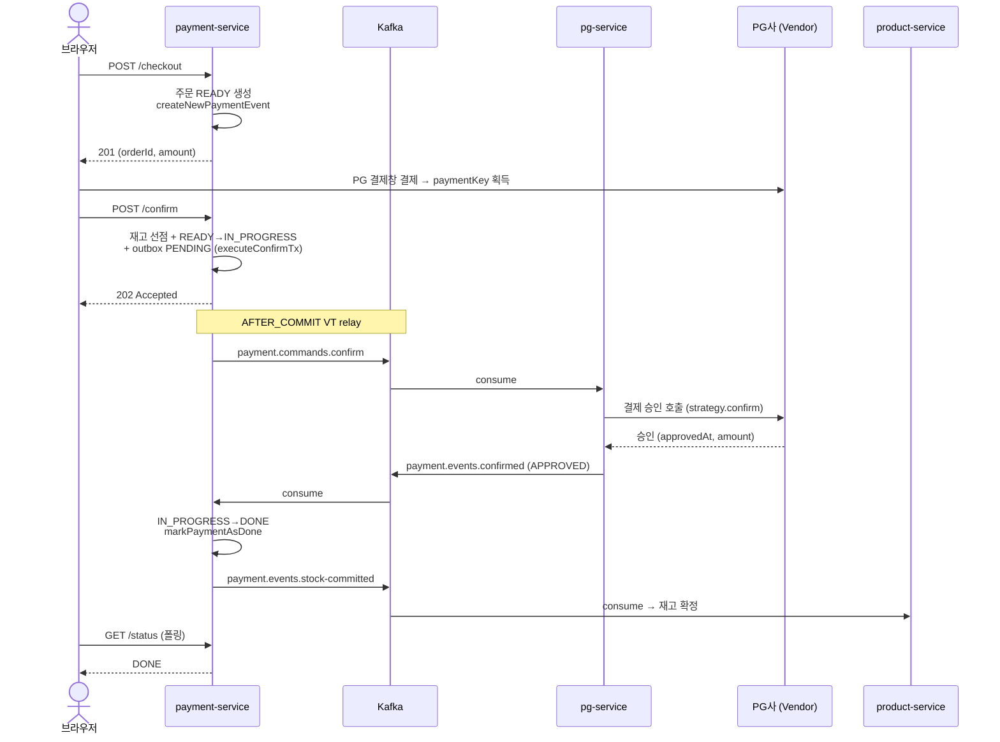
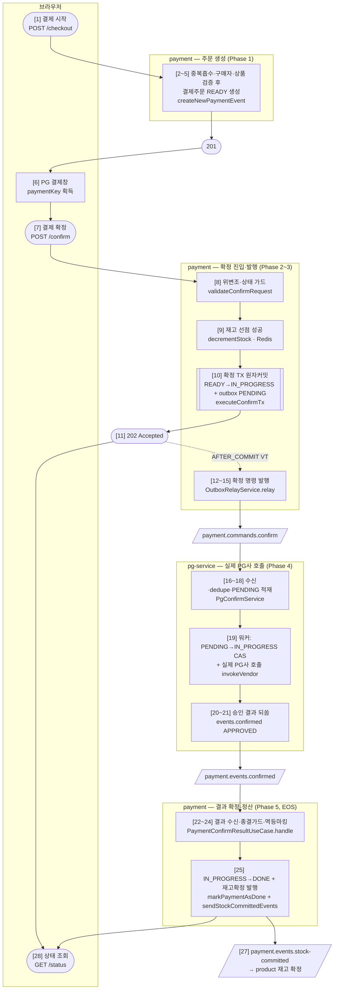
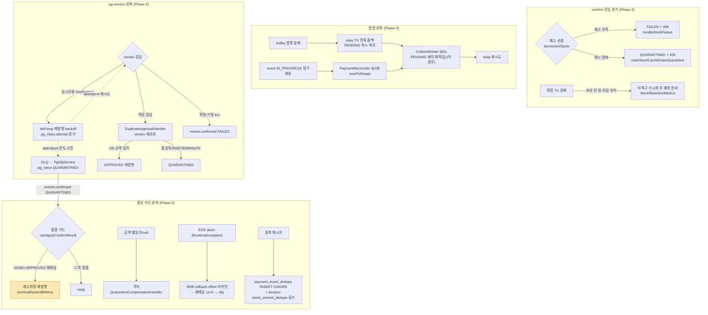
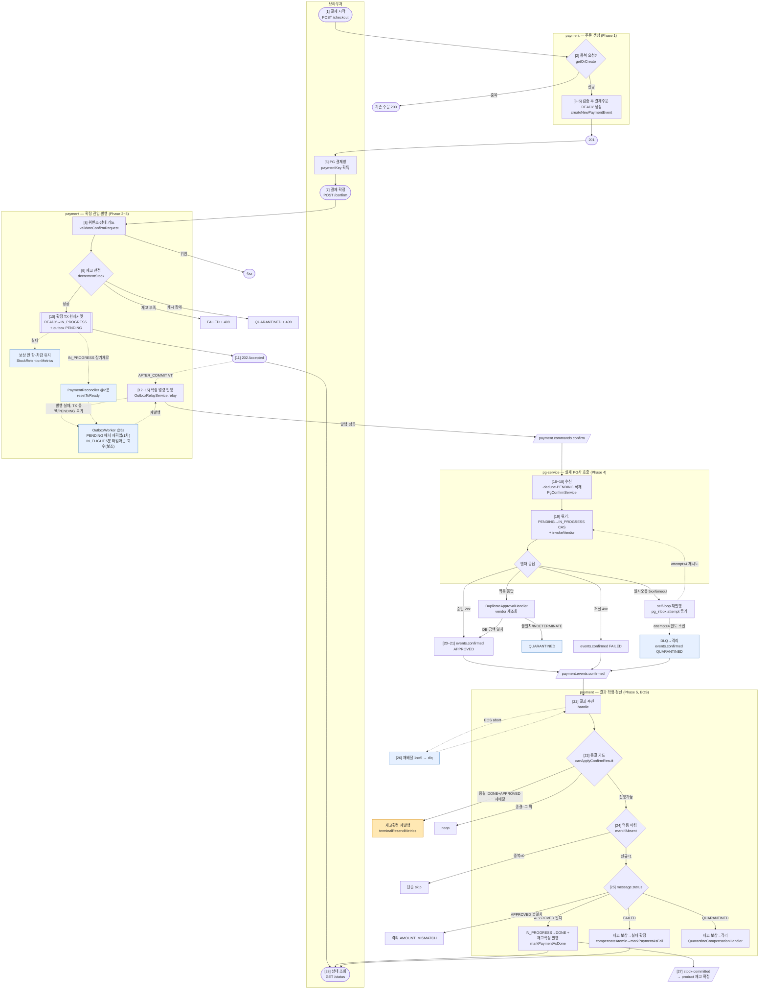

# 결제 흐름 가이드 — 사람을 위한 전체 여정

> ⚠️ **이 문서는 사람 독자용입니다.** 결제가 브라우저 요청부터 최종 상태까지 어떻게 흐르고 어떻게 수습되는지를 도메인 언어로 풀어 설명합니다.
> **에이전트(자동화) 운영 규칙**: 평소 작업 시 이 문서를 참조하지 않으며, **ship 단계에서만** 코드 변경에 맞춰 갱신합니다. 작업 정합의 기준(SSOT)은 짝 문서([PAYMENT-FLOW.md](PAYMENT-FLOW.md) / [CONFIRM-FLOW.md](CONFIRM-FLOW.md))입니다.
> 최초 작성 2026-06-22 · 승급 2026-06-23 · 정정 2026-07-03(outbox 발행 실패 회복 경로 사실 정정, DOCS-CONSISTENCY-OVERHAUL Task 12) · 범위: 브라우저 checkout → confirm → outbox 발행 → pg-service 실제 PG사 호출 → 결과 수신·재고 정산 → 상태 폴링.
> 표기 규칙: **도메인 표현** + (`메서드명`/`토픽`) 병기. §A 시퀀스의 1~28 단계와 §B-1 플로우차트의 `[n]` 라벨이 1:1 대응한다.

---

## 약어 범례

| 약어 | 의미 |
|---|---|
| EOS | Exactly-Once Semantics — Kafka 트랜잭션으로 consumer offset commit + producer send + RDB commit 을 한 단위로 묶음 |
| CAS | Compare-And-Set — 원자 조건부 UPDATE 로 동시 선점 1건만 통과 |
| SoT | Source of Truth — 결과의 단일 진실 원본 |
| AFTER_COMMIT | Spring `@TransactionalEventListener` 단계. TX 커밋 직후 실행 |
| VT | Virtual Thread (가상 스레드) |
| SETNX | Redis `SET if Not eXists` — 멱등 토큰 1회 기록 |
| P8D | 8일 TTL (Kafka retention 7d + 복구 버퍼 1d) |
| DLQ | Dead Letter Queue — 재시도 한도 초과 메시지 격리 토픽 |
| D7 / SCR-6 | 내부 설계 결정·룰 ID (상세: [CONFIRM-FLOW.md](CONFIRM-FLOW.md)) |

---

## 한 줄 요약

브라우저 → **checkout (결제주문 READY 생성)** → **PG 결제창** → **confirm (재고 선차감 → 확정 TX 원자 커밋 → 202 즉시 반환)** → payment outbox 가 `payment.commands.confirm` 발행 → pg-service 가 **실제 PG사(Toss/NicePay) 결제 승인 호출** 후 결과를 `payment.events.confirmed` 로 되쏨 → payment-service 가 **DONE/FAILED/QUARANTINED** 전이 + **재고 확정/보상** → 브라우저는 `GET /status` 폴링으로 최종 확인. 실패는 **outbox 재발행 / dedupe / 종결 가드 재발행**으로 수습한다.

---

## 0. 한눈에 — 정상 경로(happy-path) 시퀀스

서비스 간 시간순 왕복만 추린 그림. 분기·회복은 §B-2, §C 참고.

---

## A. 전체 번호 시퀀스 (도메인 언어 / `메서드명`)

### Phase 1 — 주문 생성 (checkout, 동기)

> **목적**: 구매자·상품·금액을 확정해 주문(`PaymentEvent`)을 `READY` 로 만든다. **불변식**: 같은 `Idempotency-Key` 는 항상 같은 orderId 를 돌려준다.

1. 브라우저가 **결제 요청 시작** — `POST /api/v1/payments/checkout` (+ `Idempotency-Key`) → `PaymentController.checkout`
2. **중복 요청 흡수** — 같은 키면 기존 주문 그대로 반환(200), 신규면 생성 진행 (`IdempotencyStore.getOrCreate`)
3. **구매자 검증** — user-service 조회 (`OrderedUserUseCase.getUserInfoById`)
4. **주문 상품 확정** — product-service 조회로 가격·상품 확정 (`OrderedProductUseCase.getProductInfoList`)
5. **결제 주문 생성·영속화** — `PaymentEvent`(+ `PaymentOrder` N건)를 **`READY`** 상태로 저장 (`PaymentCreateUseCase.createNewPaymentEvent`) → `201` (orderId, totalAmount)
6. 브라우저가 **PG 결제창 호출**(Toss/NicePay SDK) → 사용자 결제 → PG 가 `paymentKey` 들고 returnUrl 로 리다이렉트 *(취소/실패 시 서버 상태 변화 없음)*

### Phase 2 — 결제 확정 진입 (confirm, 동기 구간 → 202)

> **목적**: 위변조 차단 + 재고 선점 후 `IN_PROGRESS` 확정. **불변식**: `202` 반환 시점에는 outbox `PENDING` 이 반드시 존재한다(아니면 예외 전파).

7. 브라우저가 **결제 확정 요청** — `POST /confirm` (userId, orderId, amount, paymentKey) → `OutboxAsyncConfirmService.confirm`
8. **위변조·상태 가드** — 금액·소유자·상태 검증, 위반 시 `4xx` (`PaymentEvent.validateConfirmRequest`)
9. **재고 선점(선차감)** — Redis 원자 차감, **TX 밖** (`PaymentTransactionCoordinator.decrementStock` → Lua `stock_decrement_atomic.lua`)
   - **재고 부족(REJECTED)** → 결제 실패 확정(`FAILED`) + `409` (`PaymentFailureUseCase.handleStockFailure`)
   - **재고 캐시 장애(CACHE_DOWN)** → 격리(`QUARANTINED`) + `409` (`markStockCacheDownQuarantine`)
   - **선점 성공(SUCCESS)** → 다음
10. **결제 확정 트랜잭션**(원자 커밋) — `executeConfirmTx`
    - 상태 **`READY → IN_PROGRESS`** + paymentKey 기록 (`executePayment`)
    - **발행 예약** — `payment_outbox` `PENDING` 적재 (`createPendingRecord`)
    - **커밋 후 발행 트리거 등록** — `confirmPublisher.publish` (Spring ApplicationEvent, TX 동기화 활성 상태에서 등록해야 AFTER_COMMIT 리스너가 드롭되지 않음)
    - *TX 실패 시: 선차감 재고 보상 안 함(차감 유지) + 미복구 가시화 후 예외 전파 — 과매도 0 정책 (`StockRetentionMetrics`)*
11. **`202 Accepted` 즉시 반환** → 브라우저는 `/status` 폴링 시작

### Phase 3 — 확정 명령 발행 (payment outbox relay, 비동기)

> **목적**: outbox `PENDING` 을 Kafka 명령으로 정확히 1회 발행. **불변식**: `claimToInFlight` CAS 로 동시 발행이 1건으로 직렬화된다.

12. **커밋 직후 즉시 발행** — AFTER_COMMIT 리스너가 가상 스레드로 relay 호출 (`OutboxImmediateEventHandler` → `OutboxRelayService.relay`)
13. **중복 발행 방지 선점** — `PENDING → IN_FLIGHT` 원자 CAS, 실패 시 포기(다른 워커 처리 중) (`claimToInFlight`)
14. **확정 명령 Kafka 발행** — `payment.commands.confirm` (key=orderId, `PaymentConfirmCommandMessage`) (`messagePublisherPort.send`)
    - 발행 실패 → 예외가 relay 전체를 감싸는 단일 TX 를 롤백해 선점(13단계)까지 함께 되돌림 → PENDING 그대로 복귀
15. **발행 완료** — `IN_FLIGHT → DONE` (`outbox.toDone`)
    - 1차 회복 경로: TX 롤백으로 PENDING 복귀한 건은 `OutboxWorker` (`@Scheduled` fixedDelay 5s)의 5초 주기 배치 재픽업이 곧바로 다시 집어간다 (`findPendingBatch`). `IN_FLIGHT` 5분 타임아웃 회수(`recoverTimedOutInFlightRecords`)는 워커 크래시 등 드문 경로의 보조 안전장치다.

### Phase 4 — 실제 PG사 호출 (pg-service)

> **목적**: 명령을 받아 실제 PG사를 호출하고 결과를 `events.confirmed` 로 되쏨. **불변식**: orderId 당 결과 SoT 는 `pg_inbox` 1행(UNIQUE).

16. **명령 수신** — `PaymentConfirmConsumer` (groupId=pg-service, `attempt` 헤더 파싱·부재 시 1) → `PgConfirmService.handle`
17. **메시지 중복 차단** — Redis SETNX EX 1h (`EventDedupeStore.markSeen`). 처리 실패 시 dedupe 롤백(`remove`)으로 재컨슘 허용
18. **inbox 상태 분기** (`PgConfirmService`) — inbox 없으면 **`pg_inbox` `PENDING` INSERT + 채널 적재**(`PgInboxPendingService.insertPendingAndPublish`), 이미 `PENDING`/`IN_PROGRESS`면 채널 재적재(`handleActiveInbox`), terminal 재수신이면 저장 결과 재발행(`PgTerminalReemitService.reemit`, 벤더 재호출 금지)
19. **워커가 처리** — `PgInboxImmediateWorker`가 채널에서 take → `PENDING`이면 `processPending`(**`PENDING→IN_PROGRESS` CAS, SKIP LOCKED**), `IN_PROGRESS`면 `processInProgressZombie` → **실제 PG사 호출**(TX 밖, `PgVendorCallService.invokeVendor` → `PgConfirmStrategySelector` → Toss/NicePay/Fake) → `applyOutcome`(TX_B)
20. **응답 5분기 처리** (`applyOutcome`)
    - **승인(2xx)** → `pg_inbox APPROVED` + `pg_outbox` `events.confirmed` APPROVED 적재
    - **확정 거절(4xx, `PgGatewayNonRetryableException`)** → `FAILED` + `events.confirmed` FAILED
    - **일시 오류(5xx/timeout, `PgGatewayRetryableException`)** → `handleRetry`: `shouldRetry(attempt)`면 같은 토픽 self-loop 재발행(지수 backoff) + `pg_inbox.attempt` 증가, 한도(4) 소진 시 DLQ. 시도횟수는 `pg_inbox.attempt`(Flyway V5)에 영속돼 한도 도달 시 DLQ→QUARANTINED 자동 격리가 작동한다 (DLQ-REACHABILITY)
    - **멱등 응답(`PgGatewayDuplicateHandledException`)** → `DuplicateApprovalHandler`: vendor `getStatus` 재조회 후 **DB 존재·금액 일치면 APPROVED 재발행, 금액 불일치/벤더 INDETERMINATE면 QUARANTINED**
21. **결과 되쏨** — pg outbox relay 가 **`payment.events.confirmed`** 발행 (`PgOutboxRelayService` → `PgEventPublisher`)
    - DLQ 경로 → `PaymentConfirmDlqConsumer` → `PgDlqService` 가 `pg_inbox QUARANTINED` 전이 후 `events.confirmed` QUARANTINED 발행

### Phase 5 — 결제 결과 확정 + 재고 정산 (payment, EOS)

> **목적**: 수신한 결과로 결제를 종결(`DONE`/`FAILED`/`QUARANTINED`)하고 재고를 확정/보상. **불변식**: 재고 확정 이벤트는 결정적 키라 중복 발행이 무해(멱등).

22. **결과 수신** — `ConfirmedEventConsumer` (groupId=payment-service, `KafkaTransactionManager` 통합) → `PaymentConfirmResultUseCase.handle`
23. **종결 가드** — 진행 가능 상태(READY/IN_PROGRESS)만 통과 (`canApplyConfirmResult`)
    - **`DONE` + `APPROVED` 재배달(재발행 신호)** → 재고 확정 이벤트 **재발행**(RDB DONE 커밋 후 브로커 커밋 유실 복구) (`sendStockCommittedEvents` + `terminalResendMetrics.record(DONE)`)
    - 그 외 종결(QUARANTINED/FAILED 등) → noop (`guardSkipMetrics`)
24. **메시지 멱등 마킹** — `payment_event_dedupe` INSERT IGNORE (`markIfAbsent`). affected=0(중복)이면 단순 skip — 단일 컨슈머 EOS 에선 DONE 종결 가드가 먼저 흡수하므로 도달 불가, 방어적 처리
25. **상태 분기**
    - **승인(APPROVED)** → 금액 재검증(`isAmountMismatch`) 통과 시 **`IN_PROGRESS → DONE`**(`markPaymentAsDone`) + **재고 확정 이벤트 발행**(상품별 결정적 키 `StockEventUuidDeriver.derive`, `payment.events.stock-committed`) (`sendStockCommittedEvents`). 금액 불일치/null → 격리 (`QuarantineCompensationHandler` `AMOUNT_MISMATCH`)
    - **실패(FAILED)** → **재고 보상 먼저**(`compensateAtomic`) → 실패 확정(`markPaymentAsFail`) *(순서 뒤집기 = 보상 직전 crash 시 silent loss 차단, SCR-6)*
    - **격리(QUARANTINED)** → 재고 보상 → 격리 위임 (`QuarantineCompensationHandler`)
26. **EOS 원자 커밋** — RDB commit + consumer offset commit + producer commit 한 단위. abort(RuntimeException) 시 재배달 → `DefaultErrorHandler`(FixedBackOff 1s×5) → 초과 시 `payment.events.confirmed.dlq`
27. *(product-service 가 `isolation.level=read_committed` 로 재고 확정 이벤트 수신 → 실제 재고 차감 확정. 재배달은 `stock_commit_dedupe` 가 흡수)*

### Phase 6 — 결과 조회 (폴링)

> **목적**: 클라이언트가 최종 상태를 확인. **불변식**: 종결(`DONE`/`FAILED`) 전까지 `PROCESSING` 으로 응답한다.

28. 브라우저 **최종 상태 조회** — `GET /{orderId}/status` (`PaymentStatusServiceImpl`): outbox 진행 중이면 PENDING/PROCESSING, event 종결되면 `DONE`/`FAILED` 반환 → 성공/실패 페이지. *(QUARANTINED 는 default 분기 → PROCESSING, admin 강제 전이 전까지 폴링 지속)*

---

## B. 플로우차트

### B-1. 정상 경로 큰 줄기 (번호 = §A 시퀀스 단계)

성공 줄기 + 종결 분기 결과만. 재시도/타임아웃/재배달 회복 경로는 §B-2.

### B-2. 분기 · 회복 상세

정상 줄기에서 갈라지는 실패 분기와, 그것을 되돌리는 회복 경로.

> 노란 노드(`종결 가드 재발행`)는 RDB DONE 커밋 후 Kafka 커밋 유실 시 재고 확정이 영구 유실되던 갭을 메운 경로다. 수신측 product-service 가 결정적 키로 멱등 흡수하므로 over-publish 는 무해, under-publish 만 위험한 비대칭을 이용한다.

---

## C. 수습 / 회복 경로 색인 (장애별)

| 장애 | 수습 동작 | 핵심 |
|---|---|---|
| payment 리스너 스킵·크래시 | `OutboxWorker` 가 PENDING + IN_FLIGHT 5분 타임아웃 분 재픽업 | `OutboxRelayService.relay` 재실행 |
| Kafka 발행 실패(payment→broker) | relay TX 전체 롤백 → PENDING 즉시 복귀 → 5초 주기 재픽업 | `OutboxRelayService.relay` 단일 TX |
| event IN_PROGRESS 장기 체류 | `PaymentReconciler`(`@Scheduled` 2분) `resetToReady` → 재발행 | 멈춘 결제 자가 치유 |
| PG 일시 오류(5xx/timeout) | pg self-loop 재발행(지수 backoff) + `pg_inbox.attempt` 증가(attempt<4) | 같은 토픽 재발행 |
| PG 재시도 한도 초과(DLQ) | attempt≥4 → `insertDlqOutbox` → `PgDlqService` → `pg_inbox QUARANTINED` → payment `handleQuarantined`. 자동 격리 작동(DLQ-REACHABILITY) | `PaymentConfirmDlqConsumer` |
| 브로커 커밋 유실(RDB DONE 커밋 후 crash) | 재배달이 종결 가드 `DONE+APPROVED` 분기로 흡수 → **재고 확정 재발행** | best-effort 1PC 갭 복구 |
| 결과 메시지 중복(payment 측) | `payment_event_dedupe` INSERT IGNORE + Lua dedup token(`decrement:done`/`compensation:done` SETNX P8D) | product `stock_commit_dedupe` 가 재배달 흡수 |
| 금액 불일치(AMOUNT_MISMATCH) | 양방향 방어(pg non-null 강제 + payment 대조) → 격리 | `AmountConverter.fromBigDecimalStrict` + `isAmountMismatch` |
| 재고 캐시 장애(confirm 단계) | CACHE_DOWN → event QUARANTINED + `quarantine_compensation_pending=true` | 보상 보류(격리 정책) |
| EOS abort(producer tx abort) | RDB rollback + offset 미커밋 → 재배달 → 1s×5 → DLQ | product 는 abort 메시지 invisible(read_committed) |
| EOS 커밋 지속 실패(코디네이터 장애) | 명시 연결된 `AfterRollbackProcessor`(공유 DLQ recoverer + backoff) → 소진 후 `confirmed.dlq` 발행 + `payment_eos_commit_failure_dlq_total`. 단 재고 확정 자체는 유실(over-sell) — 회복 후 DLQ 재주입으로만 복구 | DLQ-REACHABILITY (잔여 한계, TQ-1) |

---

## D. 전체 통합 플로우차트 (정상 + 분기 + 회복)

정상 경로·종결 분기·회복 경로를 한 장에 모두 잇는 마스터 그림. 노드가 많으므로 큰 줄기 빠른 파악은 §0·§B-1, 세부 색인은 §B-2·§C 를 함께 본다.
번호 `[n]` = §A 시퀀스 단계. **노란 노드** = 종결 가드 재발행(갭 복구), **파란 노드·점선** = 회복/예외 흐름.

---

## 검증 메모 (2026-06-22 코드 대조)

문서를 실제 코드와 대조하며 확인한 사항. 정정 반영 완료 + 미해결 의문점.

- **Phase 4 진입은 `PENDING`을 경유한다** — 컨슈머/리스너(`PgConfirmService`)는 `pg_inbox PENDING` INSERT + 채널 적재까지만 하고, 워커(`PgInboxProcessor.processPending`)가 `PENDING→IN_PROGRESS` CAS(SKIP LOCKED) 후 벤더를 호출한다. (`NONE→IN_PROGRESS` 직접 전이 아님)
- **멱등 응답이 항상 APPROVED는 아니다** — `DuplicateApprovalHandler`는 vendor 재조회 후 금액 불일치·벤더 INDETERMINATE면 `QUARANTINED`로 종결한다.
- **pg self-loop `attempt` 한도/DLQ 작동 (DLQ-REACHABILITY, 2026-06-25 해소)** — 과거엔 `attempt`가 런타임에서 항상 1로 고정돼(relay 헤더 미발행 + `pg_inbox` attempt 컬럼 부재 + `resolveAttempt()=1`) 한도/DLQ에 도달하지 못했다. 이제 시도횟수를 `pg_inbox.attempt`(Flyway V5)에 영속(SoT)해, 워커가 읽고 retry 분기에서 결과 반영 트랜잭션 안에서 증가시킨다 → 한도(4) 소진 시 `insertDlqOutbox` → `PgDlqService` `pg_inbox QUARANTINED` 자동 격리. relay 헤더 전파는 복원하지 않았다(attempt SoT가 DB라 헤더 불요). **수용 한계**: self-loop 즉시 워커와 좀비 폴링이 동시에 같은 행에 진입하면 시도횟수가 한 번에 2 늘어 조기 격리될 수 있으나, 방향이 안전(무한 반복·금전 손실 없음)해 수용한다. 상세: `docs/archive/dlq-reachability/COMPLETION-BRIEFING.md`.

---

## 관련 문서

- end-to-end 상세(Phase 1~5 + pg-service 내부 deep-dive): [PAYMENT-FLOW.md](PAYMENT-FLOW.md)
- payment 측 비동기 confirm 사이클 deep-dive(상태 머신, 멱등성 layer, EOS): [CONFIRM-FLOW.md](CONFIRM-FLOW.md)
- 종결 가드 재발행 / 재고 확정 누락 갭 복구 설계·완료: [docs/archive/confirm-approved-resend-gap/COMPLETION-BRIEFING.md](../archive/confirm-approved-resend-gap/COMPLETION-BRIEFING.md)
- DLQ 도달 보장(pg self-loop 한도 격리 + payment EOS 커밋 실패 DLQ) 설계·완료: [docs/archive/dlq-reachability/COMPLETION-BRIEFING.md](../archive/dlq-reachability/COMPLETION-BRIEFING.md)
</content>
