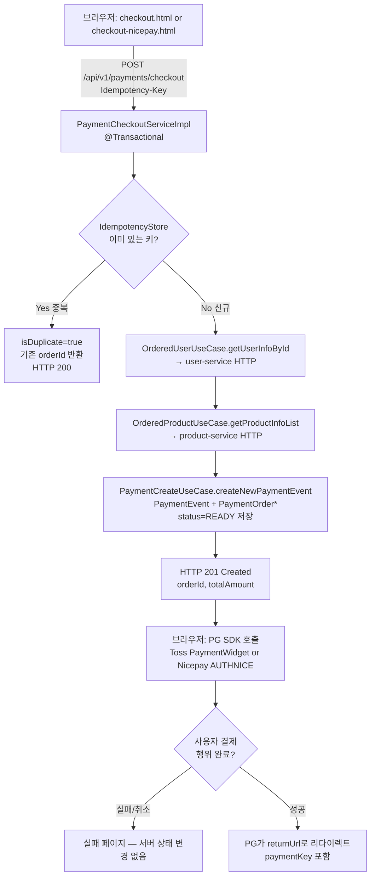
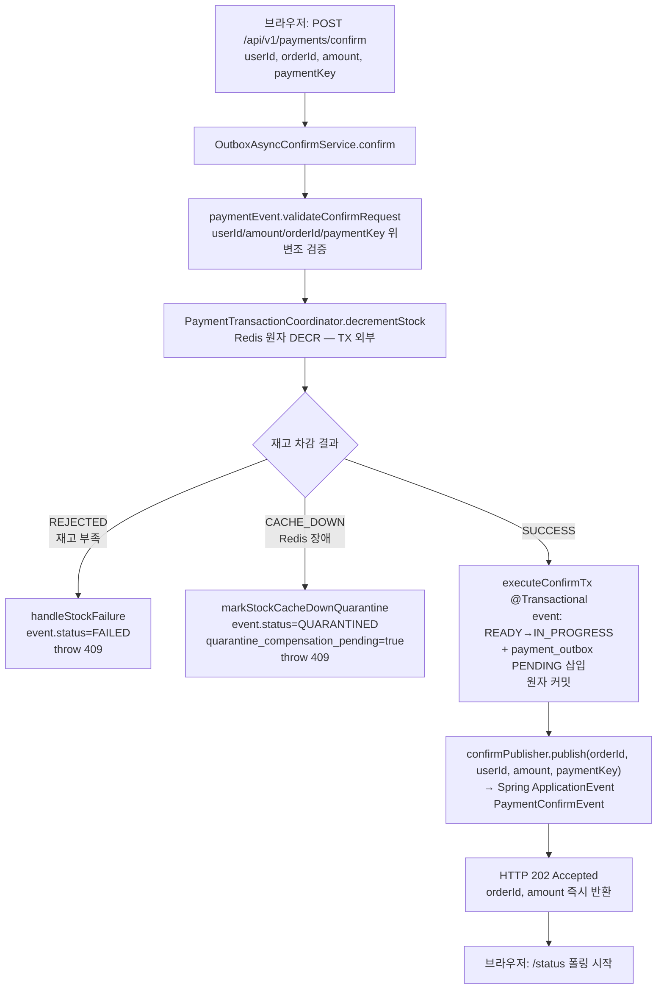
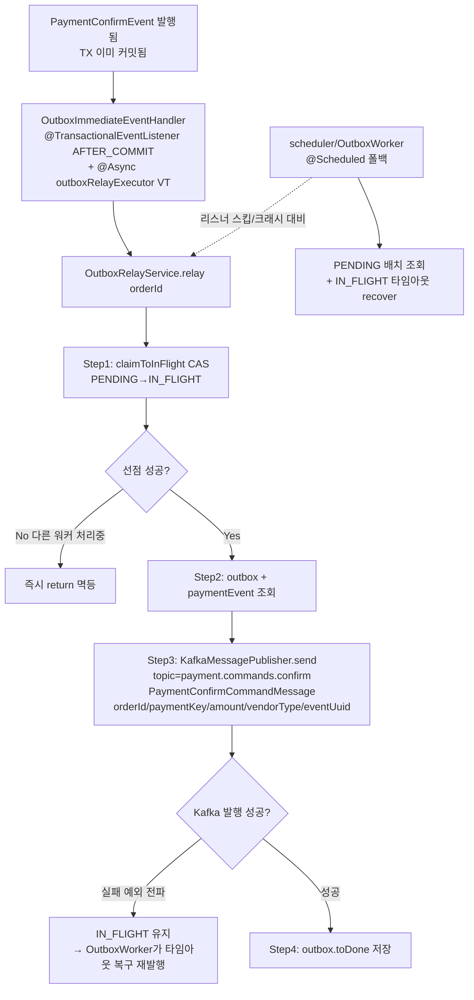
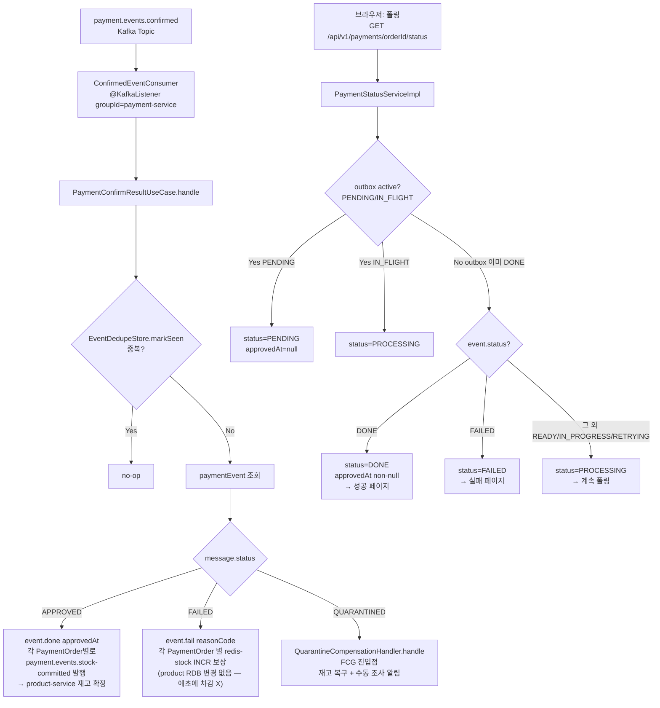
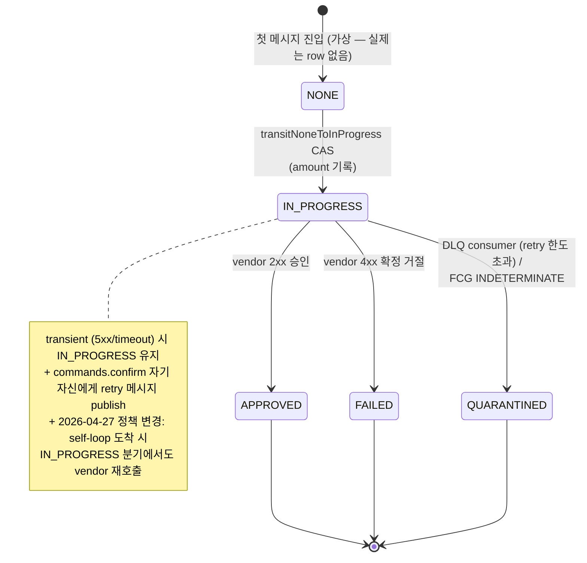
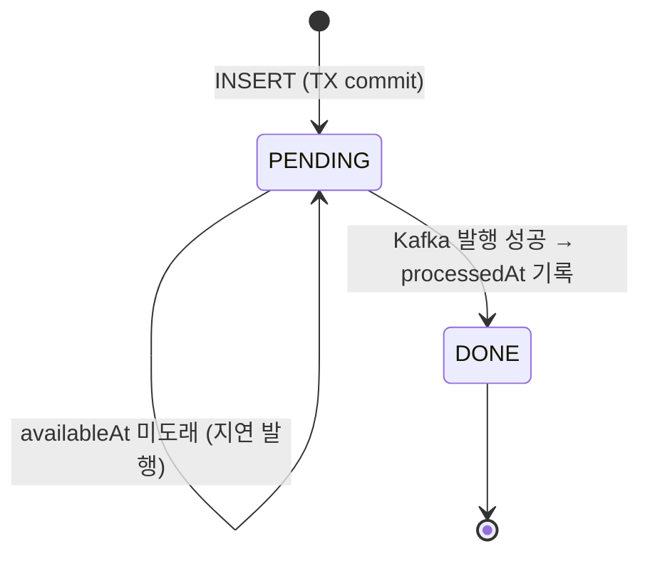
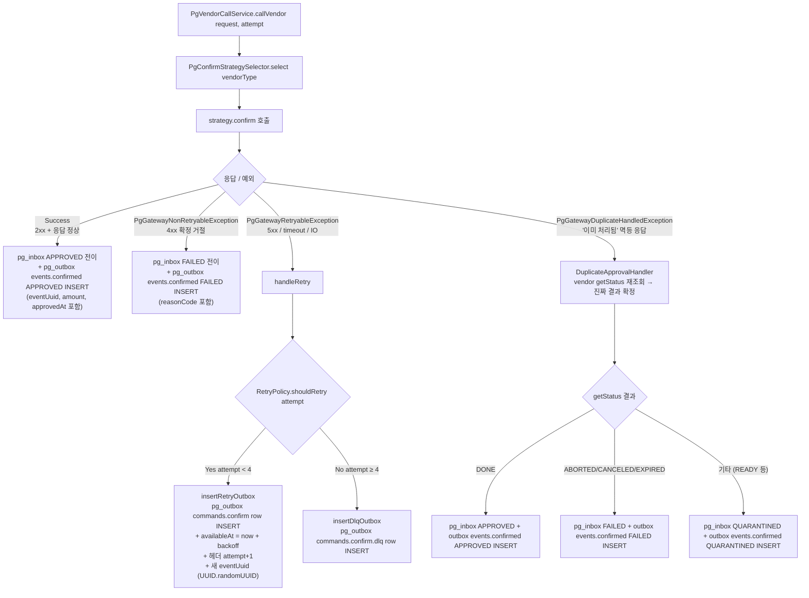
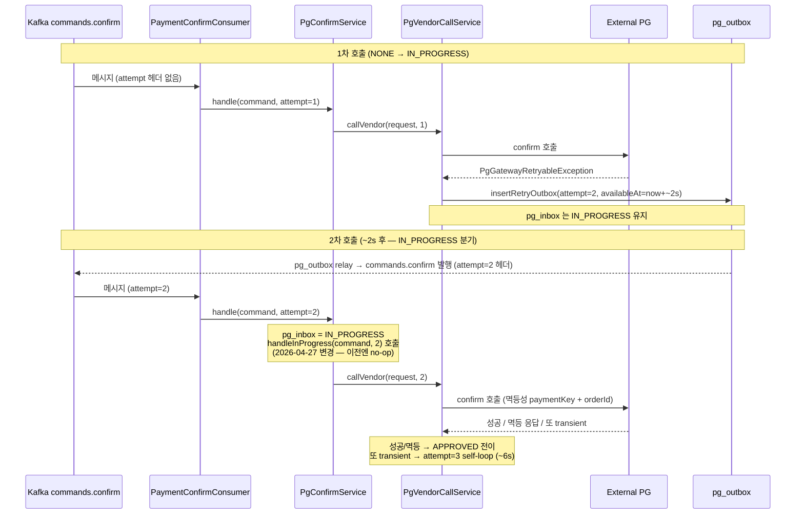
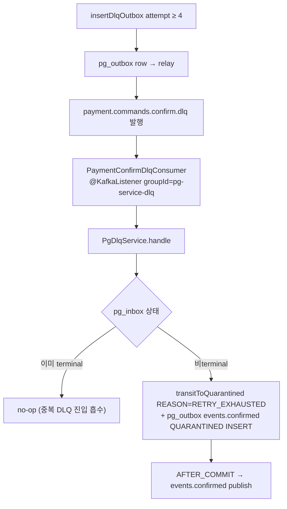

# Payment Flow — 웹에서 결제 요청 시 end-to-end 처리

> 최종 갱신: 2026-04-27 (MSA-TRANSITION + PRE-PHASE-4-HARDENING 봉인 시점)
> 짝 문서 — payment-service 측 비동기 confirm 사이클 상세: [`CONFIRM-FLOW-ANALYSIS.md`](CONFIRM-FLOW-ANALYSIS.md), [`CONFIRM-FLOW-FLOWCHART.md`](CONFIRM-FLOW-FLOWCHART.md)

현재 `main` (MSA 4서비스 분리 + Phase 0~3.5 + PRE-PHASE-4-HARDENING 봉인 시점) 코드를 기준으로, 브라우저가
결제를 시작해서 최종 DONE/FAILED까지 도달하는 전 과정을 정리한다.

---

## 한 줄 요약

브라우저 → **checkout (결제 이벤트 생성)** → **PG SDK 창** → **confirm (Redis 재고 DECR
→ outbox PENDING 커밋 → Kafka `payment.commands.confirm` 발행)** → pg-service가
소비해 **실제 Toss/Nicepay 호출** → 결과를 `payment.events.confirmed`로 되쏨 →
payment-service가 **DONE/FAILED/QUARANTINED** 전이 + **재고 commit/restore** 이벤트
발행 → 브라우저는 **GET /status 폴링**으로 최종 상태 확인.

---

## 전체 플로우차트 (분기 포함)

### Phase 1 — 주문 생성 + PG SDK 진입



### Phase 2 — confirm 비동기 진입 (핵심)



### Phase 3 — outbox relay → Kafka (payment-service)



### Phase 4 — pg-service 소비 + 실제 PG 호출 + outbox relay

pg-service 의 정책 / 흐름은 본 문서의 [Phase 4 — pg-service 상세](#phase-4-pg-service-상세) 절에서 깊이 다룬다. 여기는 입출력만:

```mermaid
flowchart TD
    T["payment.commands.confirm<br/>Kafka Topic"] --> U["PaymentConfirmConsumer<br/>@KafkaListener groupId=pg-service<br/>+ @Header attempt 파싱 (default=1)"]
    U --> V["PgConfirmService.handle command, attempt"]
    V --> V1{"EventDedupeStore.markSeen<br/>Redis SET NX EX 1h<br/>eventUUID 중복?"}
    V1 -->|Yes 중복| V1a["no-op return"]
    V1 -->|No 신규| V2["pg_inbox 조회"]

    V2 --> W{"inbox.status?"}

    W -->|NONE or null| W1["transitNoneToInProgress CAS<br/>amount 기록"]
    W1 --> W1a{"CAS 성공?"}
    W1a -->|No 선점됨| W1b["no-op<br/>다른 consumer 가 IN_PROGRESS 로 전이함"]
    W1a -->|Yes| CALL["PgVendorCallService.callVendor<br/>request, attempt"]

    W -->|IN_PROGRESS| WIP["handleInProgress<br/>vendor 재호출<br/>(2026-04-27 정책 변경 — 멱등성 의존)"]
    WIP --> CALL

    W -->|"APPROVED/FAILED/QUARANTINED<br/>terminal 재수신"| W3["stored_status_result 로<br/>pg_outbox 재발행<br/>벤더 재호출 금지"]

    CALL --> X["PgConfirmStrategySelector<br/>vendorType → strategy 빈 선택"]
    X --> X1["Toss/Nicepay/Fake HTTP 호출"]
    X1 --> X2{"응답 분류"}

    X2 -->|"2xx 승인"| X2a["pg_inbox APPROVED<br/>stored_status_result 저장<br/>pg_outbox events.confirmed APPROVED INSERT"]
    X2 -->|"4xx 확정 거절"| X2b["pg_inbox FAILED<br/>pg_outbox events.confirmed FAILED INSERT"]
    X2 -->|"5xx/timeout retryable"| RETRY["handleRetry<br/>RetryPolicy.shouldRetry attempt"]
    X2 -->|"이미 처리됨 멱등 응답"| DUP["DuplicateApprovalHandler<br/>vendor getStatus 재조회 → 결과 확정"]

    RETRY --> RETRY_CHK{"attempt &lt; 4?"}
    RETRY_CHK -->|"Yes"| RETRY_LOOP["pg_outbox commands.confirm 재발행<br/>+ availableAt = now + backoff (2s × 3^n × jitter)<br/>+ 헤더 attempt+1"]
    RETRY_CHK -->|"No 한도 초과"| DLQ_OUT["pg_outbox commands.confirm.dlq INSERT<br/>(pg_inbox 는 IN_PROGRESS 유지)"]

    DUP --> DUP_OUT["pg_inbox APPROVED/FAILED<br/>pg_outbox events.confirmed INSERT"]

    X2a --> Y["pg_outbox row → AFTER_COMMIT"]
    X2b --> Y
    DUP_OUT --> Y
    RETRY_LOOP --> Y
    DLQ_OUT --> Y
    W3 --> Y

    Y --> Y1["OutboxReadyEventHandler<br/>PgOutboxChannel.offer outboxId"]
    Y1 --> Y2["PgOutboxImmediateWorker<br/>VT 워커가 channel.take → relay"]
    Y1 -.->|"채널 full or 누락"| Y3["PgOutboxPollingWorker<br/>@Scheduled 폴백<br/>processedAt IS NULL AND availableAt&lt;=NOW"]
    Y2 --> Z["PgOutboxRelayService<br/>→ PgEventPublisher<br/>→ Kafka 발행 (events.confirmed / commands.confirm self-loop / commands.confirm.dlq)"]
    Y3 --> Z

    Z -.commands.confirm.dlq.-> DLQ_CONS["PaymentConfirmDlqConsumer<br/>@KafkaListener groupId=pg-service-dlq"]
    DLQ_CONS --> DLQ_HANDLE["PgDlqService.handle<br/>pg_inbox QUARANTINED 전이<br/>+ pg_outbox events.confirmed QUARANTINED INSERT"]
    DLQ_HANDLE --> Y
```

### Phase 5 — payment-service 수신 + 최종 상태 + 재고 정산



---

## Outbox Relay 워커 대응 관계 (Phase 3 vs Phase 4 말미)

두 서비스 모두 Transactional Outbox 패턴을 쓰지만 **다른 인스턴스 / 다른 빈 / 다른 스레드**다 — 좌우 대칭 설계.

| 역할 | payment-service (Phase 3) | pg-service (Phase 4 말미) |
|---|---|---|
| AFTER_COMMIT 리스너 | `OutboxImmediateEventHandler` | `OutboxReadyEventHandler` |
| 즉시 릴레이 엔진 | `@Async("outboxRelayExecutor")` — Spring 관리 VT 풀 | `PgOutboxChannel` (in-memory BlockingQueue) + `PgOutboxImmediateWorker` (SmartLifecycle VT 워커 N개) |
| 폴링 폴백 | `OutboxWorker` (@Scheduled, PENDING 배치) | `PgOutboxPollingWorker` (@Scheduled, `processedAt IS NULL AND availableAt <= NOW`) |
| 실제 Kafka 발행 | `OutboxRelayService` → `KafkaMessagePublisher` | `PgOutboxRelayService` → `PgEventPublisher` |
| 발행 토픽 | `payment.commands.confirm` | `payment.events.confirmed` |

pg-service는 채널(`PgOutboxChannel`, BlockingQueue)을 **명시적으로** 두고 `PgOutboxImmediateWorker`가 `channel.take()` 블로킹 수신 → VT executor 위임. payment-service는 Spring `@Async`가 큐/워커를 캡슐화. `available_at` 기반 지연 발행은 pg 쪽에만 적용한다 (재시도 시각 표현용).

---

## 시계열 요약

| # | 주체 | 동작 | 결과물 |
|---|---|---|---|
| 1 | 브라우저 | `POST /checkout` | payment_event(READY) + payment_order INSERT, 201 |
| 2 | 브라우저 | PG SDK 열림 → 결제 승인 | `paymentKey` 획득, returnUrl 리다이렉트 |
| 3 | 브라우저 | `POST /confirm` | — |
| 4 | payment | Redis stock DECR | SUCCESS / REJECTED / CACHE_DOWN |
| 5 | payment | TX 커밋: event IN_PROGRESS + outbox PENDING | — |
| 6 | payment | `confirmPublisher.publish(orderId, userId, amount, paymentKey)` (ApplicationEvent) | 호출자에게 **즉시 HTTP 202 반환** |
| 7 | payment | AFTER_COMMIT + @Async VT 리스너 | outbox IN_FLIGHT 선점 → **Kafka `payment.commands.confirm` 발행** → outbox DONE |
| 8 | pg | Kafka consume | pg_inbox NONE→IN_PROGRESS CAS |
| 9 | pg | Toss/Nicepay HTTP 호출 | APPROVED / FAILED / QUARANTINED |
| 10 | pg | pg_outbox 저장 → PgOutboxImmediateWorker relay | **Kafka `payment.events.confirmed` 발행** |
| 11 | payment | Kafka consume | APPROVED → event DONE + `payment.events.stock-committed` 발행 (product RDB 차감) / FAILED·QUARANTINED → event 전이 + redis-stock INCR 보상 (RDB 변경 X) |
| 12 | 브라우저 | `GET /status` 폴링 | PENDING → PROCESSING → DONE/FAILED |

---

## 장애 복원 포인트

- **리스너 스킵/크래시**: payment쪽은 `OutboxWorker`, pg쪽은 `PgOutboxPollingWorker`가 PENDING/타임아웃 IN_FLIGHT를 재픽업
- **PG 5xx/timeout**: pg_inbox=QUARANTINED, payment 측 `QuarantineCompensationHandler`에서 격리 처리 (FCG 경로는 pg-service `PgFinalConfirmationGate` 가 담당)
- **재고 캐시 장애**: confirm 단계에서 CACHE_DOWN → event QUARANTINED + `quarantine_compensation_pending=true` 플래그
- **IN_FLIGHT 복원**: `PaymentReconciler` (@Scheduled 2분) — IN_FLIGHT 타임아웃 결제를 READY 로 복원해 OutboxWorker 가 재픽업하게 함 (재고 발산 감지/보정은 새 모델에서 책임 제거됨)
- **중복 메시지**: payment `EventDedupeStore`(Redis two-phase lease P8D) + pg `EventDedupeStore`(Redis markSeen). inbox/outbox 상태 CAS 가 2단 멱등성

---

## Phase 4 — pg-service 상세

위 Phase 4 flowchart 의 입출력만 보이는 부분을 정책·내부 흐름까지 풀어쓴다.

### 4.1 책임 / 토폴로지

**한 줄**: payment-service 의 `commands.confirm` 명령을 받아 외부 PG (Toss/NicePay/Fake) 호출 후 결과를 `events.confirmed` 로 다시 보낸다.

```
[payment-service] ─ Kafka ─→ pg-service ─ HTTP ─→ [Vendor (Toss/NicePay/Fake)]
                              ↑              ↓
                              └─ Kafka ←─────┘ (events.confirmed 결과 발행)
```

북쪽 (Kafka) 과 남쪽 (Vendor HTTP) 의 **2-layer 번역기 + 회복 layer**. 모든 retry / DLQ / 격리 결정은 pg-service 안에서 일어난다 — payment-service 는 "결과만 받음".

### 4.2 RDB 두 테이블

| 테이블 | 카디널리티 | 책임 |
|---|---|---|
| `pg_inbox` | 1 orderId = 1 row (UNIQUE) | dedupe + 결과 SoT (NONE / IN_PROGRESS / APPROVED / FAILED / QUARANTINED) + amount 저장 (AMOUNT_MISMATCH 양방향 방어용) |
| `pg_outbox` | 1 orderId = N rows | 발행 대기 큐. topic 다양 (events.confirmed / commands.confirm self-loop / commands.confirm.dlq) + availableAt 지연 발행 + headers 의 attempt 카운터 |

inbox/outbox 모두 같은 `@Transactional` 안에서 atomic commit/rollback — Transactional Outbox 패턴.

### 4.3 inbox 상태 머신



### 4.4 outbox 상태 머신 (pg_outbox)



`payment_outbox` 와 달리 IN_FLIGHT / FAILED 명시 상태 없음 — `processedAt IS NULL` 가 PENDING, non-null 이 DONE. 폴링 워커가 `processedAt IS NULL AND availableAt <= NOW` 로 picks.

### 4.5 vendor 호출 결과 5분기 (`PgVendorCallService`)



핵심 포인트:
- **`PgGatewayDuplicateHandledException`** 분기는 vendor 멱등성 응답 ("이미 처리됨") 을 흡수하는 안전장치. IN_PROGRESS retry 시 두 번째 호출이 멱등 응답 받을 때 자연스럽게 작동.
- **새 eventUuid 발급** — retry 메시지마다 `UUID.randomUUID()` 로 새 발급 → pg-service `markSeen` 통과 (동일 eventUuid 면 dedupe 막힘).

### 4.6 self-loop retry 메커니즘

retry 의 핵심: **commands.confirm 자기 자신에게 다시 publish**. 별도 retry 토픽 없이 같은 토픽 + Kafka header `attempt` 로 처리.



backoff 시각: `2s × 3^(attempt-1) × jitter±25%`
- attempt=1: ~2s (1.5~2.5s)
- attempt=2: ~6s (4.5~7.5s)
- attempt=3: ~18s (13.5~22.5s)
- attempt=4: ~54s (40.5~67.5s) — 마지막 시도

### 4.7 DLQ 경로



`pg-service-dlq` 별도 consumer group — `pg-service` 와 분리되어 DLQ 메시지가 정상 토픽 consumer offset 진행을 막지 않음.

### 4.8 멱등성 layer 3종 (retry 안전성의 근거)

IN_PROGRESS 에서 vendor 재호출이 안전한 이유 — 3-layer 멱등성:

| Layer | 메커니즘 | 효과 |
|---|---|---|
| **Vendor (Toss/NicePay)** | `paymentKey + orderId` 단위 멱등 응답. 같은 호출 두 번 시 "이미 처리됨" 응답 | `PgGatewayDuplicateHandledException` → `DuplicateApprovalHandler` 흡수 |
| **pg-service dedupe** | `EventDedupeStore.markSeen(eventUuid)` Redis SET NX EX 1h. retry 마다 새 eventUuid 발급 | 동일 eventUuid 메시지 두 번 들어와도 한 번만 처리 |
| **payment-service dedupe** | Redis two-phase lease (`markWithLease/extendLease/remove`) + 도메인 가드 (이미 DONE 이면 no-op) + `JdbcEventDedupeStore` (product 의 stock_commit_dedupe + 재고 차감 같은 TX) | events.confirmed 두 번 받아도 한 번만 처리, 재고 중복 차감 없음 |

### 4.9 FCG (Final Confirmation Gate) — 미연결

`PgFinalConfirmationGate` 클래스 존재. vendor `getStatus` 1회 조회로 진짜 결과 확정 (재시도 한도 소진 직전 false negative 방어). 단 **production code 에서 호출처 0건** — javadoc 에 "후속 Phase 에서 DLQ 전이 대신 FCG 선행 경로로 연결 예정" 명시.

현재 retry 한도 소진 시 곧바로 DLQ → QUARANTINED. FCG 미연결 상태가 의도된 deferred (Phase 4 T4-D 묶음 가능).

### 4.10 retry 정책 표 (코드 hardcoded)

| 항목 | 값 | 위치 |
|---|---|---|
| MAX_ATTEMPTS | 4 | `pg-service/.../domain/RetryPolicy.java:43` |
| base | 2 sec | `:38` |
| multiplier | 3 | `:39` |
| jitter | ±25% (equal jitter) | `:40` |
| 알고리즘 | exponential × jitter | `computeBackoff()` |

payment-service 의 RetryPolicy 와 비대칭 (payment 는 env 주입, FIXED 5s). 정렬 작업은 TC-7 deferred.

### 4.11 동시 race 보호

`handleInProgress` no-op 폐기 후 race 시 동작:
- 두 consumer 가 동시 동일 메시지 받음 → 둘 다 vendor 호출
- vendor 가 한 호출만 새로 처리, 다른 호출엔 멱등 응답
- 한 쪽 → pg_outbox APPROVED INSERT, 다른 쪽 → DuplicateApprovalHandler → 같은 결과 INSERT (중복 row 가능)
- payment-service 측: `EventDedupeStore` 로 두 번째 events.confirmed 메시지 흡수

비용: vendor 호출 1회 추가. 멱등성으로 흡수.

### 4.12 코드 진입점 인덱스

| 무엇 | 어디 |
|---|---|
| Kafka 진입 (정상) | `pg-service/.../infrastructure/messaging/consumer/PaymentConfirmConsumer.java` |
| Kafka 진입 (DLQ) | `pg-service/.../infrastructure/messaging/consumer/PaymentConfirmDlqConsumer.java` |
| inbox 분기 orchestrator | `pg-service/.../application/service/PgConfirmService.java` |
| vendor 호출 + retry/DLQ 분기 | `pg-service/.../application/service/PgVendorCallService.java` |
| vendorType → strategy 선택 | `pg-service/.../application/service/PgConfirmStrategySelector.java` |
| Toss strategy | `pg-service/.../infrastructure/gateway/toss/TossPaymentGatewayStrategy.java` |
| NicePay strategy | `pg-service/.../infrastructure/gateway/nicepay/NicepayPaymentGatewayStrategy.java` |
| Fake strategy (smoke) | `pg-service/.../infrastructure/gateway/fake/FakePgGatewayStrategy.java` |
| amount 양방향 방어 | `pg-service/.../application/service/PgInboxAmountService.java` |
| 중복 승인 처리 | `pg-service/.../application/service/DuplicateApprovalHandler.java` |
| FCG (미연결) | `pg-service/.../application/service/PgFinalConfirmationGate.java` |
| DLQ 처리 | `pg-service/.../application/service/PgDlqService.java` |
| outbox relay | `pg-service/.../application/service/PgOutboxRelayService.java` |
| BlockingQueue 채널 | `pg-service/.../infrastructure/channel/PgOutboxChannel.java` |
| 즉시 워커 | `pg-service/.../infrastructure/scheduler/PgOutboxImmediateWorker.java` |
| 폴링 워커 | `pg-service/.../infrastructure/scheduler/PgOutboxPollingWorker.java` |

---

## 로컬 구동 시 주의사항

- `OutboxImmediateEventHandler` 는 `payment.monolith.confirm.enabled` 가 `matchIfMissing=true` 라 default 활성화 — 별도 설정 없이 동작한다. 비활성화하려면 명시적으로 `false` 지정.
  - 비활성 시 **payment 측 outbox relay 는 OutboxWorker 폴백(5초 주기)에만 의존** 하므로 HTTP 202 이후 `/status=DONE` 까지 추가 지연 가능.
- `ConfirmedEventConsumer` / `PaymentConfirmConsumer` 는 `spring.kafka.bootstrap-servers` 조건.
  - Kafka 미기동 상태로 띄우면 outbox 는 IN_FLIGHT→DONE 까지 가지만 `payment.events.confirmed` 소비자가 없어 **event.status 는 영영 PROCESSING** 에 멈춤.
- user-service / product-service 가 안 떠 있으면 Phase 1 의 HTTP 호출에서 503 (`USER_SERVICE_UNAVAILABLE` / `PRODUCT_SERVICE_UNAVAILABLE`) 반환 — checkout 자체가 안 뜸.
- redis-stock 이 시드 안 된 채로 띄우면 (compose-up.sh 외 경로로 부팅) confirm 진입 시 Lua DECR 결과가 음수가 되어 REJECTED 처리. `scripts/seed-stock.sh` 가 product RDB → redis-stock 으로 동일 수치 시드해야 정상 동작.
- Redis가 안 떠 있으면 `IdempotencyStoreRedisAdapter` 장애로 checkout 자체 실패. confirm 단계에서는 재고 DECR 실패 → `CACHE_DOWN` → QUARANTINED 전이 경로.
