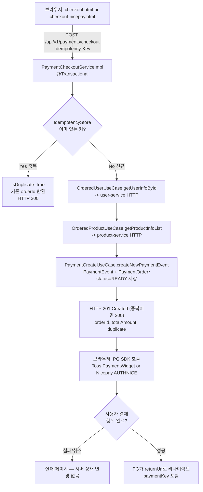
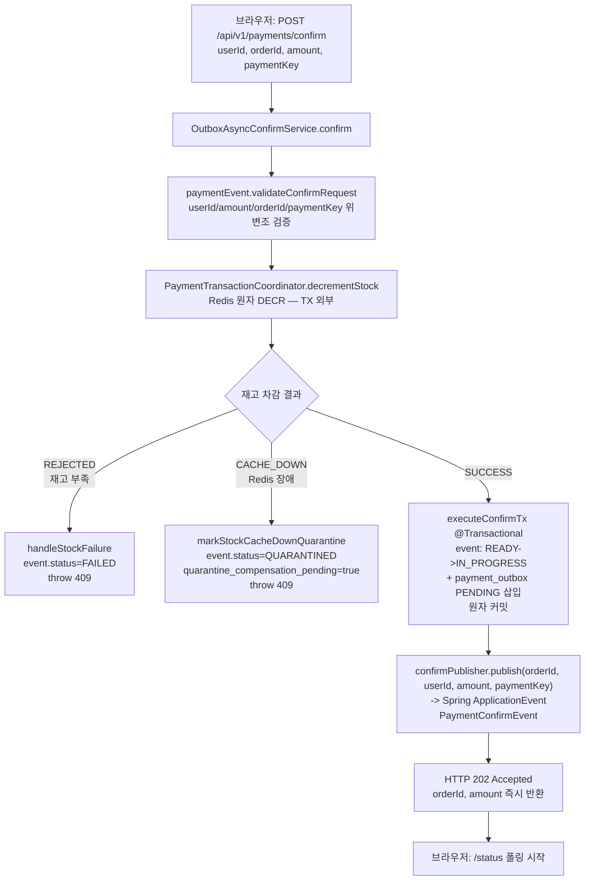
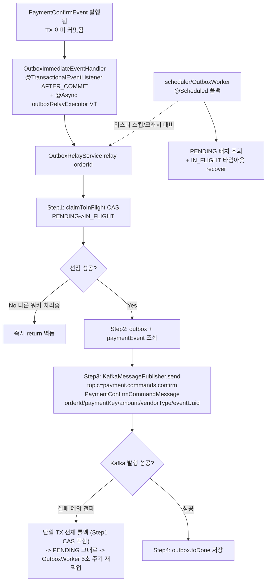
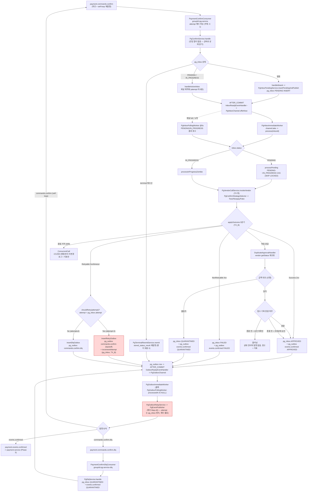
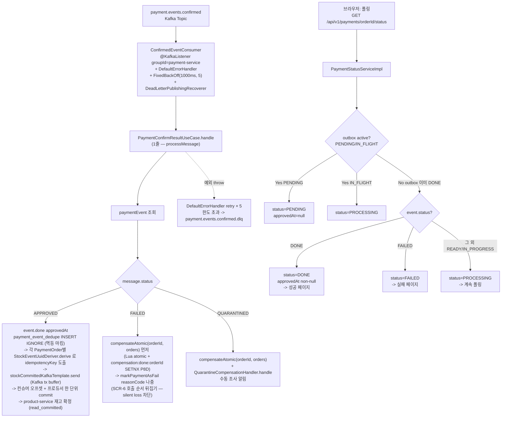
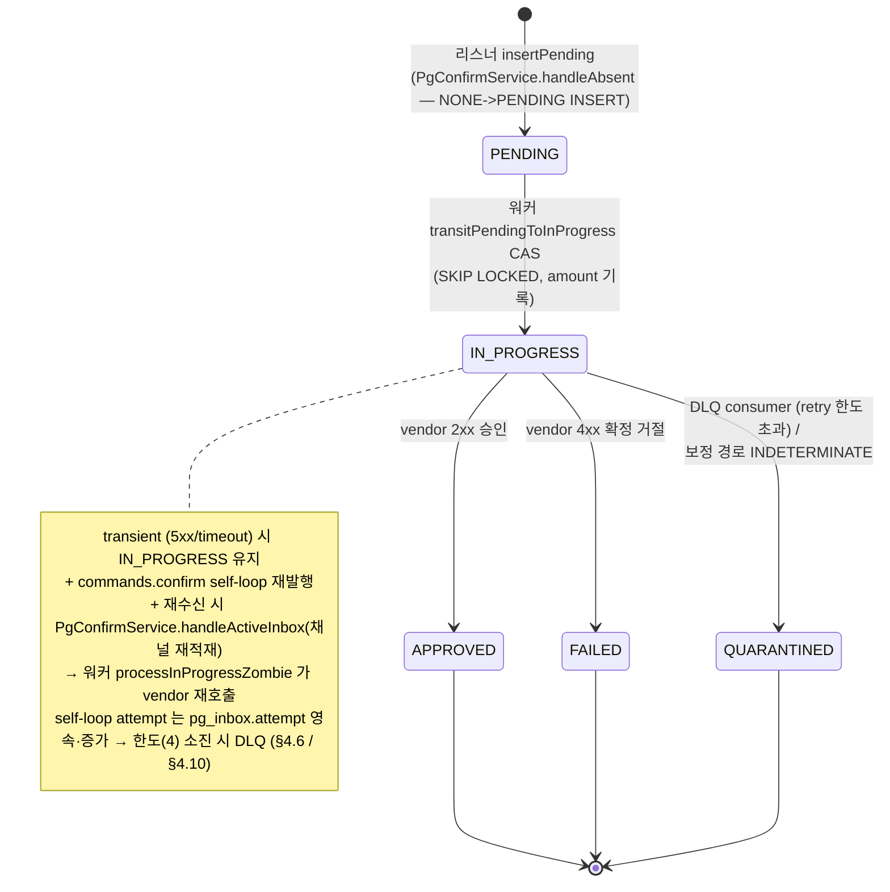
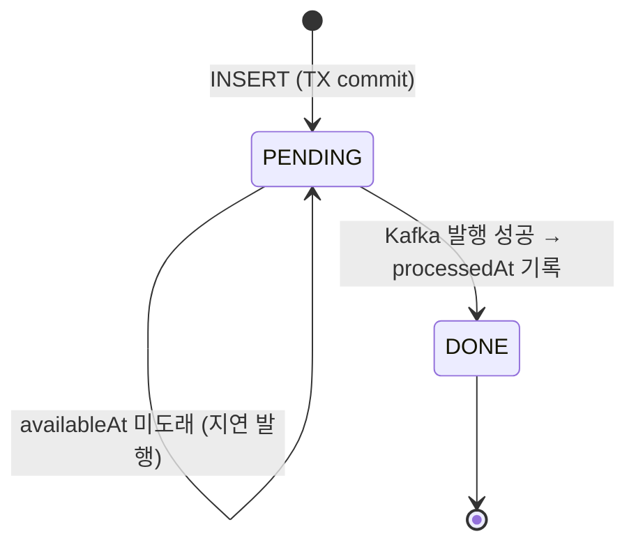
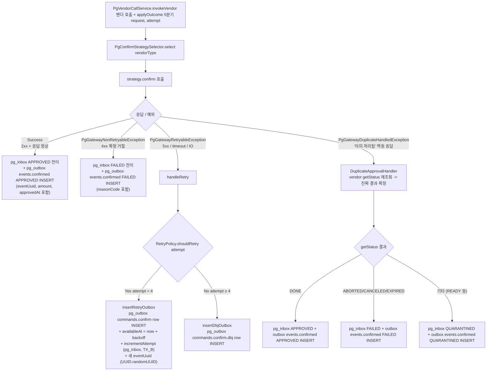
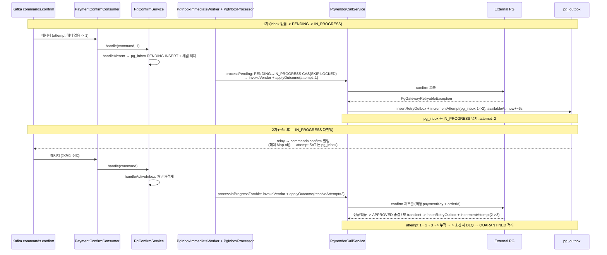
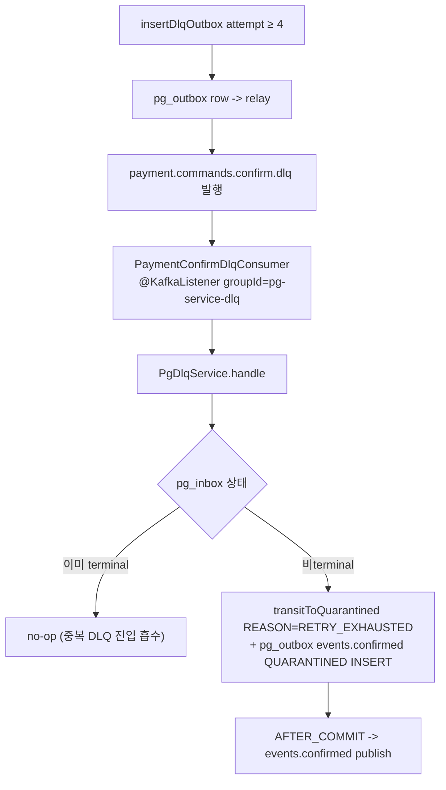

# Payment Flow — 웹에서 결제 요청 시 end-to-end 처리

> 최종 갱신: 2026-08-13 (PG-DUPLICATE-APPROVAL-SETTLEMENT — §4.11 잔여 위험을 겹침 처리 절로 교체(벤더 거부 흡수·0건 가드 수렴·NicePay 미확정만 잔여), 중복 승인 핸들러 서술에 금액 대조 선행과 종결 여부 분기 반영). 이전: 2026-08-11 (PG-MESSAGE-DEDUPE-LAYER-REMOVAL — Phase 4 플로우차트에서 리스너 진입 dedupe 노드 제거, 중복 메시지·멱등성 표의 pg 행을 접수대장 단일 층으로 정정, §4.11 에 리스너 재적재 유예 부재로 열리는 벤더 호출 겹침과 잔여 위험 추가). 이전: 2026-07-28 (ADMIN-VISIBILITY — `pg_inbox.attempt` 행에 진행 중 상태 가드 / `pg_outbox` 행에 `attempt` 컬럼 V7 제거 / `headers_json` 행 신설(읽는 쪽은 관리자 시도 이력 조립뿐) + `insertRetryOutbox` 순서 반전(증가 먼저, 반영 행 수 0 이면 INSERT·발행 생략) callout + §4.1 에 관리자 조회 HTTP 경로 예외 명시). 이전: 2026-07-02 (DOCS-CONSISTENCY-OVERHAUL Task 7 — outbox 발행 실패 복구 서술을 단일 TX 롤백 기준으로 정정, 장애 복원 포인트 우선순위 재정렬). 이전: 2026-06-25 (DLQ-REACHABILITY — self-loop attempt 를 pg_inbox.attempt 에 영속해 한도 도달 DLQ 격리 작동), 2026-06-23 (코드 대조 — Phase 4 inbox PENDING 경유 정정)
> 짝 문서 — payment-service 측 비동기 confirm 사이클 deep dive: [`CONFIRM-FLOW.md`](CONFIRM-FLOW.md)

현재 `main` (MSA 4서비스 분리 + DLQ-REACHABILITY 봉인 시점) 코드를 기준으로, 브라우저가
결제를 시작해서 최종 DONE/FAILED까지 도달하는 전 과정을 정리한다.

---

## 한 줄 요약

브라우저 → **checkout (결제 이벤트 생성)** → **PG SDK 창** → **confirm (Redis 재고 DECR
→ outbox PENDING 커밋 → Kafka `payment.commands.confirm` 발행)** → pg-service가
소비해 **실제 Toss/Nicepay 호출** → 결과를 `payment.events.confirmed`로 되쏨 →
payment-service가 **DONE/FAILED/QUARANTINED** 전이 + **재고 commit/restore** 이벤트
발행 → 브라우저는 **GET /status 폴링**으로 최종 상태 확인.

---

## 전체 플로우차트 (분기 포함)

### Phase 1 — 주문 생성 + PG SDK 진입


```mermaid
flowchart TD
    A["브라우저: checkout.html or checkout-nicepay.html"] -->|"POST /api/v1/payments/checkout<br/>Idempotency-Key"| B["PaymentCheckoutServiceImpl<br/>@Transactional"]
    B --> C{"IdempotencyStore<br/>이미 있는 키?"}
    C -->|Yes 중복| C1["isDuplicate=true<br/>기존 orderId 반환<br/>HTTP 200"]
    C -->|No 신규| D["OrderedUserUseCase.getUserInfoById<br/>-> user-service HTTP"]
    D --> E["OrderedProductUseCase.getProductInfoList<br/>-> product-service HTTP"]
    E --> F["PaymentCreateUseCase.createNewPaymentEvent<br/>PaymentEvent + PaymentOrder*<br/>status=READY 저장"]
    F --> G["HTTP 201 Created (중복이면 200)<br/>orderId, totalAmount, duplicate"]
    G --> H["브라우저: PG SDK 호출<br/>Toss PaymentWidget or Nicepay AUTHNICE"]
    H --> I{"사용자 결제<br/>행위 완료?"}
    I -->|실패/취소| I1["실패 페이지 — 서버 상태 변경 없음"]
    I -->|성공| J["PG가 returnUrl로 리다이렉트<br/>paymentKey 포함"]
```

### Phase 2 — confirm 비동기 진입 (핵심)


```mermaid
flowchart TD
    J["브라우저: POST /api/v1/payments/confirm<br/>userId, orderId, amount, paymentKey"] --> K["OutboxAsyncConfirmService.confirm"]
    K --> K1["paymentEvent.validateConfirmRequest<br/>userId/amount/orderId/paymentKey 위변조 검증"]
    K1 --> K2["PaymentTransactionCoordinator.decrementStock<br/>Redis 원자 DECR — TX 외부"]
    K2 --> L{"재고 차감 결과"}
    L -->|"REJECTED<br/>재고 부족"| L1["handleStockFailure<br/>event.status=FAILED<br/>throw 409"]
    L -->|"CACHE_DOWN<br/>Redis 장애"| L2["markStockCacheDownQuarantine<br/>event.status=QUARANTINED<br/>quarantine_compensation_pending=true<br/>throw 409"]
    L -->|SUCCESS| M["executeConfirmTx @Transactional<br/>event: READY->IN_PROGRESS<br/>+ payment_outbox PENDING 삽입<br/>원자 커밋"]
    M --> N["confirmPublisher.publish(orderId, userId, amount, paymentKey)<br/>-> Spring ApplicationEvent<br/>PaymentConfirmEvent"]
    N --> O["HTTP 202 Accepted<br/>orderId, amount 즉시 반환"]
    O --> P["브라우저: /status 폴링 시작"]
```

### Phase 3 — outbox relay → Kafka (payment-service)


```mermaid
flowchart TD
    N["PaymentConfirmEvent 발행됨<br/>TX 이미 커밋됨"] --> Q["OutboxImmediateEventHandler<br/>@TransactionalEventListener AFTER_COMMIT<br/>+ @Async outboxRelayExecutor VT"]
    Q --> R["OutboxRelayService.relay orderId"]
    R --> R1["Step1: claimToInFlight CAS<br/>PENDING->IN_FLIGHT"]
    R1 --> R2{"선점 성공?"}
    R2 -->|No 다른 워커 처리중| R2a["즉시 return 멱등"]
    R2 -->|Yes| R3["Step2: outbox + paymentEvent 조회"]
    R3 --> R4["Step3: KafkaMessagePublisher.send<br/>topic=payment.commands.confirm<br/>PaymentConfirmCommandMessage<br/>orderId/paymentKey/amount/vendorType/eventUuid"]
    R4 --> R5{"Kafka 발행 성공?"}
    R5 -->|실패 예외 전파| R5a["단일 TX 전체 롤백 (Step1 CAS 포함)<br/>-> PENDING 그대로 -> OutboxWorker 5초 주기 재픽업"]
    R5 -->|성공| R6["Step4: outbox.toDone 저장"]

    S["scheduler/OutboxWorker<br/>@Scheduled 폴백"] -.->|"리스너 스킵/크래시 대비"| R
    S --> S1["PENDING 배치 조회<br/>+ IN_FLIGHT 타임아웃 recover"]
```

### Phase 4 — pg-service 소비 + 실제 PG 호출 + outbox relay

pg-service 의 정책 / 흐름은 본 문서의 [Phase 4 — pg-service 상세](#phase-4-pg-service-상세) 절에서 깊이 다룬다. 여기는 입출력만:

> 아래 flowchart 는 PG-CONFIRM-LISTENER-SPLIT 반영 **현행**이다 — `PENDING` 경유 + inbox 채널/워커 분리 + self-loop `attempt` 를 `pg_inbox.attempt` 에 영속해 한도(4) 도달 시 DLQ→QUARANTINED 격리(DLQ-REACHABILITY). 정책 세부(상태머신·5분기·retry)는 §4.3~§4.10, payment 측 비동기 사이클은 [CONFIRM-FLOW §17](CONFIRM-FLOW.md) 참조.


```mermaid
flowchart TD
    T["payment.commands.confirm<br/>(최초 + self-loop 재발행)"] --> U["PaymentConfirmConsumer<br/>groupId=pg-service<br/>attempt 헤더 파싱 (부재 시 1)"]
    U --> SVC["PgConfirmService.handle<br/>(진입 필터 없음 — 곧바로 상태 분기)"]
    SVC --> INB{"pg_inbox 상태"}

    INB -->|없음| ABS["handleAbsent -><br/>PgInboxPendingService.insertPendingAndPublish<br/>pg_inbox PENDING INSERT"]
    INB -->|"PENDING / IN_PROGRESS"| ACT["handleActiveInbox<br/>채널 재적재 (attempt 미사용)"]
    INB -->|terminal 재수신| REEMIT["PgTerminalReemitService.reemit<br/>stored_status_result 재발행 (벤더 호출 X)"]

    ABS --> RDY["AFTER_COMMIT<br/>InboxReadyEventHandler -> PgInboxChannel.offerNow"]
    ACT --> RDY
    RDY --> IMW["PgInboxImmediateWorker<br/>channel.take -> process(inboxId)"]
    RDY -.->|"채널 full / 누락"| PLW["PgInboxPollingWorker @5s<br/>PENDING/IN_PROGRESS 좀비 회수"]

    IMW --> PROC{"inbox.status"}
    PLW --> PROC
    PROC -->|PENDING| PP["processPending<br/>PENDING->IN_PROGRESS CAS (SKIP LOCKED)"]
    PROC -->|IN_PROGRESS| PZ["processInProgressZombie"]
    PP --> VEND["PgVendorCallService.invokeVendor (TX 밖)<br/>PgConfirmStrategySelector -> Toss/Nicepay/Fake"]
    PZ --> VEND
    VEND --> OUT{"applyOutcome 5분기 (TX_B)"}

    OUT -->|"Success 2xx"| OK["pg_inbox APPROVED<br/>+ pg_outbox events.confirmed APPROVED"]
    OUT -->|"NonRetryable 4xx"| NF["pg_inbox FAILED<br/>+ pg_outbox events.confirmed FAILED"]
    OUT -->|"Retryable 5xx/timeout"| RT{"shouldRetry(attempt)?<br/>attempt = pg_inbox.attempt"}
    OUT -->|"멱등 응답"| DUP["DuplicateApprovalHandler<br/>vendor getStatus 재조회"]
    OUT -->|"겹침 거부 (409)"| CONC["ConcurrentCall<br/>시도횟수/명령/전이 미변경<br/>로그 + 지표만"]

    RT -->|"Yes (attempt&lt;4)"| RTO["insertRetryOutbox<br/>pg_outbox commands.confirm (backoff)<br/>+ incrementAttempt (pg_inbox, TX_B)"]
    RT -->|"No (attempt≥4)"| DLO["insertDlqOutbox<br/>pg_outbox commands.confirm.dlq"]
    DUP --> AMT{"금액 대조 (선행)"}
    AMT -->|"불일치"| QU["pg_inbox QUARANTINED<br/>+ pg_outbox events.confirmed QUARANTINED"]
    AMT -->|"일치"| SET{"접수 기록 종결 여부"}
    SET -->|"종결"| OK
    SET -->|"종결 전 + 조회상태 승인"| OK
    SET -->|"종결 전 + 승인 미확인"| BACK["물러남<br/>상태 전이와 발행 없음, 경고 + 지표"]

    OK --> OBX["pg_outbox row -> AFTER_COMMIT<br/>OutboxReadyEventHandler -> PgOutboxChannel"]
    NF --> OBX
    QU --> OBX
    REEMIT --> OBX
    RTO --> OBX
    DLO --> OBX

    OBX --> OBW["PgOutboxImmediateWorker<br/>(폴백 PgOutboxPollingWorker: processedAt IS NULL)"]
    OBW --> RELAY["PgOutboxRelayService -> PgEventPublisher<br/>(헤더 Map.of() — attempt 는 pg_inbox 영속, 헤더 불요)"]
    RELAY --> PUB{"발행 토픽"}
    PUB -->|events.confirmed| EC["payment.events.confirmed<br/>-> payment-service (Phase 5)"]
    PUB -->|"commands.confirm (self-loop)"| T
    PUB -->|commands.confirm.dlq| DLQT["payment.commands.confirm.dlq"]

    DLQT --> DLQC["PaymentConfirmDlqConsumer<br/>groupId=pg-service-dlq"]
    DLQC --> DLQS["PgDlqService.handle<br/>pg_inbox QUARANTINED + events.confirmed QUARANTINED"]
    DLQS --> OBX

    classDef warn fill:#ffd6d6,stroke:#c00000;
    class RTO,RELAY warn
```

### Phase 5 — payment-service 수신 + 최종 상태 + 재고 정산


```mermaid
flowchart TD
    AA["payment.events.confirmed<br/>Kafka Topic"] --> AB["ConfirmedEventConsumer<br/>@KafkaListener groupId=payment-service<br/>+ DefaultErrorHandler<br/>+ FixedBackOff(1000ms, 5)<br/>+ DeadLetterPublishingRecoverer"]
    AB --> AC["PaymentConfirmResultUseCase.handle<br/>(1줄 — processMessage)"]
    AC --> AC2["paymentEvent 조회"]
    AC2 --> AD{"message.status"}
    AD -->|APPROVED| AE1["event.done approvedAt<br/>payment_event_dedupe INSERT IGNORE (멱등 마킹)<br/>-> 각 PaymentOrder별 StockEventUuidDeriver.derive 로 idempotencyKey 도출<br/>-> stockCommittedKafkaTemplate.send (Kafka tx buffer)<br/>-> 컨슈머 오프셋 + 프로듀서 한 단위 commit<br/>-> product-service 재고 확정 (read_committed)"]
    AD -->|FAILED| AE2["compensateAtomic(orderId, orders) 먼저<br/>(Lua atomic + compensation:done:orderId SETNX P8D)<br/>-> markPaymentAsFail reasonCode 나중<br/>(SCR-6 호출 순서 뒤집기 — silent loss 차단)"]
    AD -->|QUARANTINED| AE3["compensateAtomic(orderId, orders)<br/>+ QuarantineCompensationHandler.handle<br/>수동 조사 알림"]
    AC -.예외 throw.-> AERR["DefaultErrorHandler retry × 5<br/>한도 초과 -> payment.events.confirmed.dlq"]

    AF["브라우저: 폴링<br/>GET /api/v1/payments/orderId/status"] --> AG["PaymentStatusServiceImpl"]
    AG --> AG1{"outbox active?<br/>PENDING/IN_FLIGHT"}
    AG1 -->|Yes PENDING| AG1a["status=PENDING<br/>approvedAt=null"]
    AG1 -->|Yes IN_FLIGHT| AG1b["status=PROCESSING"]
    AG1 -->|No outbox 이미 DONE| AG2{"event.status?"}
    AG2 -->|DONE| AH1["status=DONE<br/>approvedAt non-null<br/>-> 성공 페이지"]
    AG2 -->|FAILED| AH2["status=FAILED<br/>-> 실패 페이지"]
    AG2 -->|"그 외 READY/IN_PROGRESS"| AH3["status=PROCESSING<br/>-> 계속 폴링"]
```

---

## Outbox Relay 워커 대응 관계 (Phase 3 vs Phase 4 말미)

두 서비스 모두 Transactional Outbox 패턴을 쓰지만 **다른 인스턴스 / 다른 빈 / 다른 스레드**다 — 좌우 대칭 설계.

| 역할 | payment-service (Phase 3) | pg-service (Phase 4 말미) |
|---|---|---|
| AFTER_COMMIT 리스너 | `OutboxImmediateEventHandler` | `OutboxReadyEventHandler` |
| 즉시 릴레이 엔진 | `@Async("outboxRelayExecutor")` — Spring 관리 VT 풀 | `PgOutboxChannel` (in-memory BlockingQueue) + `PgOutboxImmediateWorker` (SmartLifecycle VT 워커 N개) |
| 폴링 폴백 | `OutboxWorker` (@Scheduled, PENDING 배치) | `PgOutboxPollingWorker` (@Scheduled, `processedAt IS NULL AND availableAt <= NOW`) |
| 실제 Kafka 발행 | `OutboxRelayService` → `KafkaMessagePublisher` | `PgOutboxRelayService` → `PgEventPublisher` |
| 발행 토픽 | `payment.commands.confirm` | `payment.events.confirmed` |

pg-service는 채널(`PgOutboxChannel`, BlockingQueue)을 **명시적으로** 두고 `PgOutboxImmediateWorker`가 `channel.take()` 블로킹 수신 → VT executor 위임. payment-service는 Spring `@Async`가 큐/워커를 캡슐화. `available_at` 기반 지연 발행은 pg 쪽에만 적용한다 (재시도 시각 표현용).

---

## 시계열 요약

| # | 주체 | 동작 | 결과물 |
|---|---|---|---|
| 1 | 브라우저 | `POST /checkout` | payment_event(READY) + payment_order INSERT, 201 |
| 2 | 브라우저 | PG SDK 열림 → 결제 승인 | `paymentKey` 획득, returnUrl 리다이렉트 |
| 3 | 브라우저 | `POST /confirm` | — |
| 4 | payment | Redis stock DECR | SUCCESS / REJECTED / CACHE_DOWN |
| 5 | payment | TX 커밋: event IN_PROGRESS + outbox PENDING | — |
| 6 | payment | TX 내 `confirmPublisher.publish(orderId, buyerId, totalAmount, paymentKey)` (Spring ApplicationEvent) | **즉시 HTTP 202 반환** (AFTER_COMMIT 리스너 큐잉) |
| 7 | payment | AFTER_COMMIT + @Async outboxRelayExecutor VT | outbox IN_FLIGHT 선점 (CAS) → **Kafka `payment.commands.confirm` 발행** → outbox DONE |
| 8 | pg | Kafka consume (`attempt` 헤더 파싱, 기본 1) | pg_inbox **PENDING INSERT**(리스너) → 워커가 **PENDING→IN_PROGRESS CAS**(SKIP LOCKED, amount 기록) |
| 9 | pg | Toss/Nicepay/Fake HTTP 호출 | APPROVED / FAILED (4xx) / retryable (5xx→self-loop, `attempt` 는 `pg_inbox.attempt` 영속·증가) / DLQ (attempt≥4→QUARANTINED 자동 격리, §4.10) |
| 10 | pg | pg_outbox 저장 → PgOutboxImmediateWorker (채널 + VT) relay | **Kafka `payment.events.confirmed` 발행** |
| 11 | payment | Kafka consume (Spring Kafka `DefaultErrorHandler` + `FixedBackOff(1s, 5회)` + DLQ recoverer + EOS `KafkaTransactionManager`) | D7 진입 가드 → `payment_event_dedupe` INSERT IGNORE 멱등 마킹 → APPROVED: event DONE + multi-product loop `producer.send(stock-committed)` Kafka tx buffer → 컨슈머 오프셋 동행 + 프로듀서 commit / FAILED·QUARANTINED: `compensateAtomic(orderId, orders)` Lua 1회 (재고 복원 + `compensation:done:{orderId}` SETNX P8D) → event 상태 전이. 메시지 멱등은 `payment_event_dedupe` UNIQUE INSERT, 재고 멱등은 Lua dedup token, retry/DLQ 는 Spring Kafka native (PAYMENT-EOS-TRANSITION 2026-05-17 봉인) |
| 12 | 브라우저 | `GET /status` 폴링 | PENDING → PROCESSING → DONE/FAILED |

---

## 장애 복원 포인트

- **리스너 스킵/크래시/Kafka 발행 실패**: payment 쪽은 `OutboxWorker` (fixedDelay 5초, batchSize 50) 의 PENDING 배치 재픽업이 1차 경로 — `OutboxRelayService.relay` 는 단일 TX 라 Kafka 발행 실패 시 TX 전체가 롤백돼 PENDING 그대로 남고 이 재픽업으로 즉시 회복된다. IN_FLIGHT 5분 타임아웃 복귀는 워커 프로세스 비정상 종료 등 드문 경로에 대한 보조 경로. pg 쪽은 `PgOutboxPollingWorker` (`processedAt IS NULL AND availableAt <= NOW`) 가 동일하게 PENDING 재픽업
- **PG 5xx/timeout**: pg-service 자체 retry (self-loop) → `attempt` 가 `pg_inbox.attempt` 에 영속·증가(retry 분기 TX_B `incrementAttempt`)해 한도(4) 초과 시 DLQ → pg_inbox QUARANTINED → payment `QuarantineCompensationHandler` (DLQ-REACHABILITY). 동시 진입 시 over-count(조기 격리)는 수용 한계. FCG (`PgFinalConfirmationGate`) 는 현재 호출처 0 — 미연결 (후속 Phase 예정)
- **재고 캐시 장애**: confirm 단계에서 CACHE_DOWN → event QUARANTINED + `quarantine_compensation_pending=true` 플래그
- **IN_FLIGHT 복원**: `PaymentReconciler` (@Scheduled fixedDelayMs=120000, 2분) — `findInProgressOlderThan(cutoff)` → `event.resetToReady` → `OutboxWorker` 재픽업. 재고 발산 감지/보정은 새 재고 모델에서 책임 제거됨
- **중복 메시지 (payment 측)**: 재고 멱등은 Lua atomic dedup token (`decrement:done:{orderId}` / `compensation:done:{orderId}` SETNX P8D, 같은 Lua 안 atomic) + outbox IN_FLIGHT CAS. 메시지 retry / DLQ 는 Spring Kafka `DefaultErrorHandler` + `DeadLetterPublishingRecoverer` 가 native 책임 (한도 5회 초과 시 `payment.events.confirmed.dlq`)
- **중복 메시지 (pg 측)**: `pg_inbox.order_id` UNIQUE (`insertPending` INSERT IGNORE) + 워커의 상태 조건부 선점 (`transitPendingToInProgress`, SKIP LOCKED) 단일 층. terminal 재수신은 `PgTerminalReemitService.reemit` 이 저장된 결과만 재발행한다 (벤더 호출 X). 리스너 진입부 Redis eventUuid 필터는 PG-MESSAGE-DEDUPE-LAYER-REMOVAL 에서 제거 — 잔여 한계는 §4.11

---

## Phase 4 — pg-service 상세

위 Phase 4 flowchart 의 입출력만 보이는 부분을 정책·내부 흐름까지 풀어쓴다.

### 4.1 책임 / 토폴로지

**한 줄**: payment-service 의 `commands.confirm` 명령을 받아 외부 PG (Toss/NicePay/Fake) 호출 후 결과를 `events.confirmed` 로 다시 보낸다.

```
[payment-service] ─ Kafka ─→ pg-service ─ HTTP ─→ [Vendor (Toss/NicePay/Fake)]
                              ↑              ↓
                              └─ Kafka ←─────┘ (events.confirmed 결과 발행)
```

북쪽 (Kafka) 과 남쪽 (Vendor HTTP) 의 **2-layer 번역기 + 회복 layer**. 모든 retry / DLQ / 격리 결정은 pg-service 안에서 일어난다 — 결제 확정 경로에서 payment-service 는 "결과만 받음".

**예외 — 관리자 조회 경로 (ADMIN-VISIBILITY)**: 결제 확정 흐름 밖에 payment → pg 동기 HTTP 조회가 하나 있다. 관리자 결제 상세를 렌더할 때 `GET /api/v1/confirmations/{orderId}/attempts` 로 시도 이력을 읽는다 (`PgAttemptHistoryController` — pg-service 유일한 컨트롤러). 확정 경로에는 관여하지 않으며, 조회 실패 시 이력 카드만 조회 불가로 표시하고 격리 종결·유실 메시지 재주입 버튼은 그대로 동작한다.

### 4.2 RDB 두 테이블

| 테이블 | 카디널리티 | 책임 |
|---|---|---|
| `pg_inbox` | 1 orderId = 1 row (UNIQUE) | dedupe + 결과 SoT (NONE / IN_PROGRESS / APPROVED / FAILED / QUARANTINED) + amount 저장 (AMOUNT_MISMATCH 양방향 방어용) |
| `pg_inbox.attempt` | INT DEFAULT 1 (Flyway V5) | self-loop 시도횟수 SoT. 워커 `resolveAttempt` 가 읽고 retry 분기에서 `incrementAttempt`(TX_B) 로 증가 → 한도(4) 소진 시 DLQ (DLQ-REACHABILITY). **UPDATE 에 `AND status = IN_PROGRESS` 가드** — 종결 후 뒤늦게 도착하는 재시도 신호가 attempt 와 종결 시각(`updated_at`)을 밀어내는 것을 막는다. 정상 재시도 경로는 항상 IN_PROGRESS 시점 호출이라 무동작 (ADMIN-VISIBILITY) |
| `pg_outbox` | 1 orderId = N rows | 발행 대기 큐. topic 다양 (events.confirmed / commands.confirm self-loop / commands.confirm.dlq) + availableAt 지연 발행. **`attempt` 컬럼은 Flyway V7 에서 제거** — 항상 0 인 死 컬럼이었고 그 값으로 상수 0 히스토그램을 발행하며 pending 전량을 매분 적재하던 경로까지 함께 걷어냈다 (ADMIN-VISIBILITY) |
| `pg_outbox.headers_json` | 재시도 행에 `{"attempt":N}` | relay 는 여전히 Kafka 헤더로 `Map.of()` 를 보낸다 (소비 측 회차 판정은 `pg_inbox` SoT). **읽는 쪽은 관리자 시도 이력 조립뿐** — `PgAttemptHistoryService` 가 화면 회차 표시용으로 파싱하며, 파싱 실패·부재는 회차 미지로 처리하고 예외를 던지지 않는다 (ADMIN-VISIBILITY) |

inbox/outbox 모두 같은 `@Transactional` 안에서 atomic commit/rollback — Transactional Outbox 패턴.

### 4.3 inbox 상태 머신


```mermaid
stateDiagram-v2
    [*] --> PENDING : 리스너 insertPending<br/>(PgConfirmService.handleAbsent — NONE->PENDING INSERT)

    PENDING --> IN_PROGRESS : 워커 transitPendingToInProgress CAS<br/>(SKIP LOCKED, amount 기록)

    IN_PROGRESS --> APPROVED : vendor 2xx 승인
    IN_PROGRESS --> FAILED : vendor 4xx 확정 거절
    IN_PROGRESS --> QUARANTINED : DLQ consumer (retry 한도 초과) /<br/>보정 경로 INDETERMINATE

    APPROVED --> [*]
    FAILED --> [*]
    QUARANTINED --> [*]

    note right of IN_PROGRESS
      transient (5xx/timeout) 시 IN_PROGRESS 유지
      + commands.confirm self-loop 재발행
      + 재수신 시 PgConfirmService.handleActiveInbox(채널 재적재)
        → 워커 processInProgressZombie 가 vendor 재호출
      self-loop attempt 는 pg_inbox.attempt 영속·증가 → 한도(4) 소진 시 DLQ (§4.6 / §4.10)
    end note
```

### 4.4 outbox 상태 머신 (pg_outbox)


```mermaid
stateDiagram-v2
    [*] --> PENDING : INSERT (TX commit)

    PENDING --> PENDING : availableAt 미도래 (지연 발행)
    PENDING --> DONE : Kafka 발행 성공 → processedAt 기록

    DONE --> [*]
```

`payment_outbox` 와 달리 IN_FLIGHT / FAILED 명시 상태 없음 — `processedAt IS NULL` 가 PENDING, non-null 이 DONE. 폴링 워커가 `processedAt IS NULL AND availableAt <= NOW` 로 picks.

### 4.5 vendor 호출 결과 5분기 (`PgVendorCallService`)


```mermaid
flowchart TD
    CALL["PgVendorCallService.invokeVendor 벤더 호출 + applyOutcome 5분기 request, attempt"] --> SEL["PgConfirmStrategySelector.select vendorType"]
    SEL --> HTTP["strategy.confirm 호출"]

    HTTP --> RES{"응답 / 예외"}

    RES -->|"Success<br/>2xx + 응답 정상"| SUCCESS["pg_inbox APPROVED 전이<br/>+ pg_outbox events.confirmed APPROVED INSERT<br/>(eventUuid, amount, approvedAt 포함)"]

    RES -->|"PgGatewayNonRetryableException<br/>4xx 확정 거절"| FAIL["pg_inbox FAILED 전이<br/>+ pg_outbox events.confirmed FAILED INSERT<br/>(reasonCode 포함)"]

    RES -->|"PgGatewayRetryableException<br/>5xx / timeout / IO"| RETRY["handleRetry"]

    RES -->|"PgGatewayDuplicateHandledException<br/>'이미 처리됨' 멱등 응답"| DUP["DuplicateApprovalHandler<br/>vendor getStatus 재조회 -> 진짜 결과 확정"]

    RETRY --> RC{"RetryPolicy.shouldRetry attempt"}
    RC -->|"Yes attempt &lt; 4"| RETRY_OUT["insertRetryOutbox<br/>pg_outbox commands.confirm row INSERT<br/>+ availableAt = now + backoff<br/>+ incrementAttempt (pg_inbox, TX_B)<br/>+ 새 eventUuid (UUID.randomUUID)"]
    RC -->|"No attempt ≥ 4"| DLQ_OUT["insertDlqOutbox<br/>pg_outbox commands.confirm.dlq row INSERT"]

    DUP --> DUP_RESULT{"getStatus 결과"}
    DUP_RESULT -->|"DONE"| DUP_OK["pg_inbox APPROVED + outbox events.confirmed APPROVED INSERT"]
    DUP_RESULT -->|"ABORTED/CANCELED/EXPIRED"| DUP_FAIL["pg_inbox FAILED + outbox events.confirmed FAILED INSERT"]
    DUP_RESULT -->|"기타 (READY 등)"| DUP_QUAR["pg_inbox QUARANTINED + outbox events.confirmed QUARANTINED INSERT"]
```

핵심 포인트:
- **`PgGatewayDuplicateHandledException`** 분기는 vendor 멱등성 응답 ("이미 처리됨") 을 흡수하는 안전장치. IN_PROGRESS retry 시 두 번째 호출이 멱등 응답 받을 때 자연스럽게 작동. `DuplicateApprovalHandler` 는 vendor `getStatus` 재조회 후 **금액을 먼저 대조**하고(불일치면 종결 여부와 무관하게 QUARANTINED), 일치할 때만 접수 기록의 종결 여부로 갈라진다 — 종결이면 보관 결과 재발행, 종결 전이면 조회 상태가 승인일 때만 조회 결과로 승인 종결하고 승인 미확인이면 상태를 바꾸지 않고 물러난다(PG-DUPLICATE-APPROVAL-SETTLEMENT).
- **새 eventUuid 발급** — retry 메시지마다 `UUID.randomUUID()` 로 새 발급. 리스너 진입 필터가 있던 시절 재시도를 통과시키기 위한 규약이었고, 필터 제거 후에도 payment 측 `payment_event_dedupe` 의 메시지 단위 키로 계속 쓰인다.
- **`attempt` 한도/DLQ 작동 (DLQ-REACHABILITY)** — 위 `RC` 분기의 `attempt` 는 `pg_inbox.attempt`(Flyway V5) 에서 `resolveAttempt(inbox)` 로 읽고, retry 분기에서 `incrementAttempt`(결과 반영 TX_B 의 `UPDATE attempt=attempt+1`) 로 누적된다 → 4 소진 시 `insertDlqOutbox`(attempt≥4) → DLQ → `PgDlqService` QUARANTINED 자동 격리. self-loop 즉시 워커와 좀비 폴링 동시 진입 시 over-count(조기 격리)는 수용 한계.

### 4.6 self-loop retry 메커니즘

retry 의 핵심: **commands.confirm 자기 자신에게 다시 publish**. 별도 retry 토픽 없이 같은 토픽으로 재발행한다.

> **`attempt` 카운팅은 `pg_inbox.attempt`(Flyway V5) 가 SoT (DLQ-REACHABILITY).** 워커 `PgInboxProcessor.resolveAttempt(inbox)` 가 컬럼값을 읽고, retry 분기(`PgVendorCallService.insertRetryOutbox`)에서 `incrementAttempt`(결과 반영 TX_B 의 `UPDATE attempt=attempt+1`) 로 누적한다. self-loop 명령은 "해당 주문 재처리" 신호일 뿐이며 — `PgOutboxRelayService.relay` 는 여전히 헤더를 `Map.of()` 로 보내지만 attempt SoT 가 DB 라 헤더 전파는 불요. attempt 가 1→2→3→4 로 증가해 `shouldRetry(4)=false` 에서 DLQ → QUARANTINED 격리. (동시 진입 over-count = 조기 격리, 수용 한계 — 관리자 시도 이력 화면에서는 같은 회차가 여러 행에 나타나는 형태로 드러나며 화면 문구가 이를 알린다.)
>
> **`insertRetryOutbox` 내부 순서 (ADMIN-VISIBILITY)**: `incrementAttempt` 를 **먼저** 호출하고 반영 행 수가 0(가드 발동 = 이미 종결)이면 재시도 outbox INSERT 와 `PgOutboxReadyEvent` 발행을 건너뛴다 — 종결된 주문에 stray 재시도 메시지가 나가는 것을 원천 차단한다. 같은 TX_B 안이라 원자성은 유지되며, 한도 판정(`shouldRetry`)은 증가 **전** 값으로 이미 `handleRetry` 에서 결정되므로 순서 충돌이 없다.


```mermaid
sequenceDiagram
    participant K as Kafka commands.confirm
    participant Cons as PaymentConfirmConsumer
    participant Svc as PgConfirmService
    participant W as PgInboxImmediateWorker + PgInboxProcessor
    participant V as PgVendorCallService
    participant Vendor as External PG
    participant OB as pg_outbox

    Note over K, OB: 1차 (inbox 없음 -> PENDING -> IN_PROGRESS)
    K->>Cons: 메시지 (attempt 헤더 없음 -> 1)
    Cons->>Svc: handle(command, 1)
    Svc->>Svc: handleAbsent → pg_inbox PENDING INSERT + 채널 적재
    W->>V: processPending: PENDING→IN_PROGRESS CAS(SKIP LOCKED)<br/>→ invokeVendor + applyOutcome(attempt=1)
    V->>Vendor: confirm 호출
    Vendor-->>V: PgGatewayRetryableException
    V->>OB: insertRetryOutbox + incrementAttempt(pg_inbox 1->2), availableAt=now+~6s
    Note over V, OB: pg_inbox 는 IN_PROGRESS 유지, attempt=2

    Note over K, OB: 2차 (~6s 후 — IN_PROGRESS 재진입)
    OB-->>K: relay → commands.confirm 발행<br/>(헤더 Map.of() — attempt SoT 는 pg_inbox)
    K->>Cons: 메시지 (재처리 신호)
    Cons->>Svc: handle(command)
    Svc->>Svc: handleActiveInbox: 채널 재적재
    W->>V: processInProgressZombie: invokeVendor + applyOutcome(resolveAttempt=2)
    V->>Vendor: confirm 재호출 (멱등 paymentKey + orderId)
    Vendor-->>V: 성공/멱등 -> APPROVED 종결 / 또 transient -> insertRetryOutbox + incrementAttempt(2->3)
    Note over V, OB: attempt 1→2→3→4 누적 → 4 소진 시 DLQ → QUARANTINED 격리
```

backoff: `2s × 3^(attempt-1) × jitter±25%` 지수 증가. attempt 가 `pg_inbox` 에 누적되므로 아래 증가·한도가 런타임에 그대로 작동한다:
- attempt=1: ~2s (1.5~2.5s)
- attempt=2: ~6s (4.5~7.5s)
- attempt=3: ~18s (13.5~22.5s)
- attempt=4: ~54s (40.5~67.5s) — 마지막 시도(이후 DLQ)

### 4.7 DLQ 경로


```mermaid
flowchart TD
    DLQ_OUT["insertDlqOutbox attempt ≥ 4"] --> DLQ_RELAY["pg_outbox row -> relay"]
    DLQ_RELAY --> DLQ_TOPIC["payment.commands.confirm.dlq 발행"]
    DLQ_TOPIC --> DLQ_CONS["PaymentConfirmDlqConsumer<br/>@KafkaListener groupId=pg-service-dlq"]
    DLQ_CONS --> DLQ_SVC["PgDlqService.handle"]
    DLQ_SVC --> DLQ_GUARD{"pg_inbox 상태"}
    DLQ_GUARD -->|"이미 terminal"| DLQ_NOOP["no-op (중복 DLQ 진입 흡수)"]
    DLQ_GUARD -->|"비terminal"| DLQ_TRAN["transitToQuarantined REASON=RETRY_EXHAUSTED<br/>+ pg_outbox events.confirmed QUARANTINED INSERT"]
    DLQ_TRAN --> DLQ_END["AFTER_COMMIT -> events.confirmed publish"]
```

`pg-service-dlq` 별도 consumer group — `pg-service` 와 분리되어 DLQ 메시지가 정상 토픽 consumer offset 진행을 막지 않음.

### 4.8 멱등성 layer 3종 (retry 안전성의 근거)

IN_PROGRESS 에서 vendor 재호출이 안전한 이유 — 3-layer 멱등성:

| Layer | 메커니즘 | 효과 |
|---|---|---|
| **Vendor (Toss/NicePay)** | `paymentKey + orderId` 단위 멱등 응답. 같은 호출 두 번 시 "이미 처리됨" 응답 | `PgGatewayDuplicateHandledException` → `DuplicateApprovalHandler` 흡수 |
| **pg-service inbox** | `pg_inbox.order_id` UNIQUE + `insertPending` INSERT IGNORE. 워커 선점은 `transitPendingToInProgress` (조회+전이 단일 TX) | 같은 주문 명령이 두 번 들어와도 접수 기록 1건, 벤더 호출 1회 |
| **payment-service dedupe** | Lua atomic dedup token (`decrement:done:{orderId}` / `compensation:done:{orderId}` SETNX P8D, redis-stock 안에서 같은 Lua atomic) + 도메인 가드 (이미 DONE 이면 no-op) + Spring Kafka `DefaultErrorHandler` + DLQ. product 측은 `JdbcEventDedupeStore` (stock_commit_dedupe + 재고 차감 같은 TX) | events.confirmed 두 번 받아도 재고 중복 차감/보상 없음 |

### 4.9 FCG (Final Confirmation Gate) — 미연결

`PgFinalConfirmationGate` 클래스 존재. vendor `getStatus` 1회 조회로 진짜 결과 확정 (재시도 한도 소진 직전 false negative 방어). 단 **production code 에서 호출처 0건** — javadoc 에 "후속 Phase 에서 DLQ 전이 대신 FCG 선행 경로로 연결 예정" 명시.

현재 retry 한도 소진 시 곧바로 DLQ → QUARANTINED. FCG 미연결 상태가 의도된 deferred (Phase 4 T4-D 묶음 가능).

### 4.10 retry 정책 표 (코드 hardcoded)

| 항목 | 값 | 위치 |
|---|---|---|
| MAX_ATTEMPTS | 4 | `pg-service/.../domain/RetryPolicy.java:43` |
| base | 2 sec | `:38` |
| multiplier | 3 | `:39` |
| jitter | ±25% (equal jitter) | `:40` |
| 알고리즘 | exponential × jitter | `computeBackoff()` |

payment-service 의 RetryPolicy 와 비대칭 (payment 는 env 주입, FIXED 5s). 정렬 작업은 TC-7 deferred.

> **위 정책은 런타임에 작동한다 (DLQ-REACHABILITY).** `attempt` 가 `pg_inbox.attempt`(Flyway V5) 에 영속·누적(retry 분기 TX_B `incrementAttempt`)돼 `MAX_ATTEMPTS`(4) 소진 시 `insertDlqOutbox` → DLQ → QUARANTINED 자동 격리. 동시 진입 시 over-count(조기 격리)는 수용 한계.

### 4.11 동시 race 보호

현행 IN_PROGRESS 재진입(`handleActiveInbox` 채널 재적재 → 워커 `processInProgressZombie`) race 시 동작:
- 두 consumer 가 동시 동일 메시지 받음 → 둘 다 vendor 호출
- vendor 가 한 호출만 새로 처리, 다른 호출엔 멱등 응답
- 한 쪽 → pg_outbox APPROVED INSERT, 다른 쪽 → DuplicateApprovalHandler → 상태 전이 반영 행 수가 0 이면 발행 행을 만들지 않는다(PG-DUPLICATE-APPROVAL-SETTLEMENT) — 승인·확정실패·격리 세 경로 공통
- payment-service 측: 재고 멱등은 Lua atomic dedup token (`decrement:done` / `compensation:done` SETNX P8D) 으로 같은 Lua 안 atomic 흡수, 메시지 단위 retry/DLQ 는 Spring Kafka native

비용: vendor 호출 1회 추가. 멱등성으로 흡수.

**진입 트리거 (PG-MESSAGE-DEDUPE-LAYER-REMOVAL 반영)**: 이 race 로 들어오는 경로는 동일 eventUuid 재전송 · self-loop 재시도 · 폴링 좀비 회수 셋이다. 재시도는 원 호출 종료 후 backoff(base 2s) 를 두고 발행되고 폴링은 `in-progress-timeout-ms`(60s) 유예를 갖는 반면, **리스너 재적재 경로에는 유예가 없다** — `handleActiveInbox` 가 IN_PROGRESS 를 보면 즉시 채널에 넣고 `PgInboxImmediateWorker`(기본 5 워커)가 집는다. `selectInProgressForUpdateSkipLocked` 는 락 확보 후 커밋하며 락을 놓고 벤더 호출(최대 13s = connect 3s + read 10s)은 락 없이 진행되므로, 그 창에 도착한 재전송이 선점에 다시 성공한다. 제거된 Redis eventUuid 필터가 이 갈래를 우연히 억제하고 있었다(명시 목적은 메시지 멱등성이었다).

**겹침 처리 (PG-DUPLICATE-APPROVAL-SETTLEMENT 반영)**: 두 벤더 모두 겹친 승인 호출을 거부한다 — Toss 는 주문번호 멱등키로 처리 중 재요청에 409(`IDEMPOTENT_REQUEST_PROCESSING`), NicePay 는 동일 거래번호 재승인에 2201. Toss 의 거부 코드는 `TossPaymentErrorCode` 에 등재돼 `GatewayOutcome.ConcurrentCall` 로 흡수되며, 시도횟수·재시도 명령·상태 전이를 건드리지 않고 물러난다(`PgVendorCallService.dispatchOutcome`). 등재 전에는 `UNKNOWN` 으로 떨어져 재시도 대상이 되면서 겹친 호출이 재시도 예산을 소모했다.

두 호출이 모두 성공 응답을 받는 조합에서도 결과가 갈리지 않는다 — 결과 반영 전이가 0건이면 발행 행 자체를 만들지 않으므로 발행은 한 건으로 수렴한다. 접수대장 컬럼 추가나 리스너 유예는 채택하지 않았다(벤더가 거부하고 종결 여부 판단이 진입 경로를 가리지 않는다).

**잔여 위험**: NicePay 는 멱등키가 없어 승인이 진행 중일 때도 2201 이 오는지 확정되지 않는다. 종결 여부로 처신을 가르는 설계라 이 미확정에 기대지 않으나, 핸들러에 도달하지 못하는 응답이 오면 닿지 않는다. 취소·환불 포트 부재는 그대로다(`CONCERNS.md` L-9).

### 4.12 코드 진입점 인덱스

| 무엇 | 어디 |
|---|---|
| Kafka 진입 (정상) | `pg-service/.../infrastructure/messaging/consumer/PaymentConfirmConsumer.java` |
| Kafka 진입 (DLQ) | `pg-service/.../infrastructure/messaging/consumer/PaymentConfirmDlqConsumer.java` |
| inbox 분기 orchestrator | `pg-service/.../application/service/PgConfirmService.java` |
| vendor 호출 + retry/DLQ 분기 | `pg-service/.../application/service/PgVendorCallService.java` |
| vendorType → strategy 선택 | `pg-service/.../application/service/PgConfirmStrategySelector.java` |
| Toss strategy | `pg-service/.../infrastructure/gateway/toss/TossPaymentGatewayStrategy.java` |
| NicePay strategy | `pg-service/.../infrastructure/gateway/nicepay/NicepayPaymentGatewayStrategy.java` |
| Fake strategy (smoke) | `pg-service/.../infrastructure/gateway/fake/FakePgGatewayStrategy.java` |
| amount 양방향 방어 | `AmountConverter.fromBigDecimalStrict` (`PgInboxRepositoryImpl.insertPending` + `DuplicateApprovalHandler.amountMismatch` 경로) |
| 중복 승인 처리 | `pg-service/.../application/service/DuplicateApprovalHandler.java` |
| FCG (미연결) | `pg-service/.../application/service/PgFinalConfirmationGate.java` |
| DLQ 처리 | `pg-service/.../application/service/PgDlqService.java` |
| outbox relay | `pg-service/.../application/service/PgOutboxRelayService.java` |
| BlockingQueue 채널 | `pg-service/.../infrastructure/channel/PgOutboxChannel.java` |
| 즉시 워커 | `pg-service/.../infrastructure/scheduler/PgOutboxImmediateWorker.java` |
| 폴링 워커 | `pg-service/.../infrastructure/scheduler/PgOutboxPollingWorker.java` |

---

## 로컬 구동 시 주의사항

- `OutboxImmediateEventHandler` 는 `payment.monolith.confirm.enabled` 가 `matchIfMissing=true` 라 default 활성화 — 별도 설정 없이 동작한다. 비활성화하려면 명시적으로 `false` 지정.
  - 비활성 시 **payment 측 outbox relay 는 OutboxWorker 폴백(5초 주기)에만 의존** 하므로 HTTP 202 이후 `/status=DONE` 까지 추가 지연 가능.
- `ConfirmedEventConsumer` / `PaymentConfirmConsumer` 는 `spring.kafka.bootstrap-servers` 조건.
  - Kafka 미기동 상태로 띄우면 outbox 는 IN_FLIGHT→DONE 까지 가지만 `payment.events.confirmed` 소비자가 없어 **event.status 는 영영 PROCESSING** 에 멈춤.
- user-service / product-service 가 안 떠 있으면 Phase 1 의 HTTP 호출에서 503 (`USER_SERVICE_UNAVAILABLE` / `PRODUCT_SERVICE_UNAVAILABLE`) 반환 — checkout 자체가 안 뜸.
- redis-stock 이 시드 안 된 채로 띄우면 (compose-up.sh 외 경로로 부팅) confirm 진입 시 DECR 결과가 음수가 되어 REJECTED 처리. `scripts/seed-stock.sh` 가 product RDB → redis-stock 으로 동일 수치 시드해야 정상 동작.
- Redis가 안 떠 있으면 `IdempotencyStoreRedisAdapter` 장애로 checkout 자체 실패. confirm 단계에서는 재고 DECR 실패 → `CACHE_DOWN` → QUARANTINED 전이 경로.
