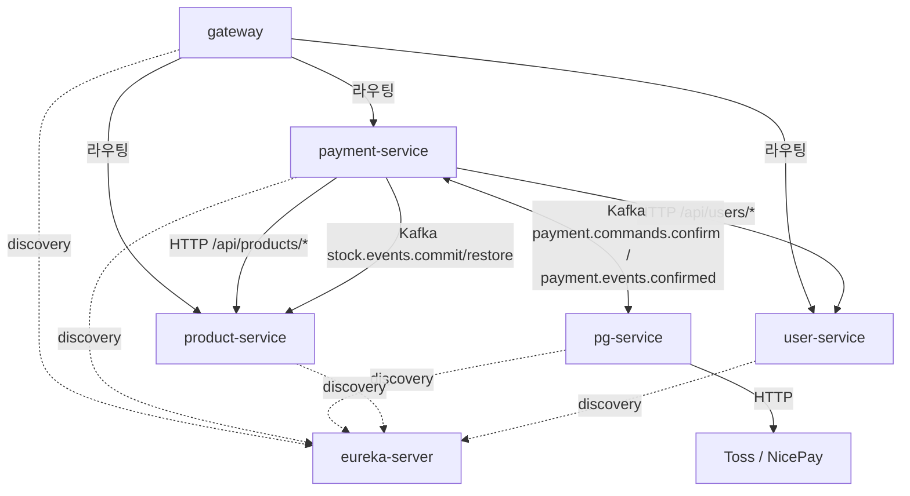

# Codebase Structure

> 최종 갱신: 2026-04-27

## 루트 레이아웃

```
payment-platform/
├── settings.gradle               # 6개 Gradle 모듈 등록
├── build.gradle                  # 루트 빌드 설정 (공통 plugin · BOM · 컴파일 옵션)
├── lombok.config                 # Lombok 글로벌 설정
├── CLAUDE.md                     # AI 에이전트 가이드 (영구 문서 인덱스)
├── README.md                     # 프로젝트 README
│
├── config/                       # 정적 분석 룰
│   ├── checkstyle/
│   └── spotbugs/                 # spotbugs-exclude*.xml
│
├── docker/                       # docker compose 정의 (인프라 + 앱 + 관측성 + 스모크)
│   ├── docker-compose.infra.yml
│   ├── docker-compose.apps.yml
│   ├── docker-compose.observability.yml
│   └── docker-compose.smoke.yml
│
├── observability/                # Prometheus / Grafana / Loki / Tempo 설정
│
├── scripts/                      # 운영 도구 (시점 무관 영구)
│   ├── common.sh
│   ├── compose-up.sh
│   └── smoke/                    # 모든 영구 smoke 도구
│       ├── infra-healthcheck.sh
│       ├── trace-continuity-check.sh
│       ├── trace-header-check.sh
│       ├── create-topics.sh
│       └── kafka-topic-config.sh
│
├── docs/
│   ├── STATE.md                  # 활성 작업 상태 (단일 파일)
│   ├── context/                  # 영구 문서 (이 디렉토리)
│   ├── smoke/                    # 영구 smoke 가이드
│   └── archive/                  # 종결된 토픽 보관 — AI 에이전트 미참조
│       ├── README.md             # 토픽 인덱스 표
│       └── <topic>/              # PLAN, CONTEXT, COMPLETION-BRIEFING, rounds, phase-gate, scripts
│
└── 6개 Gradle 모듈
    ├── eureka-server/
    ├── gateway/
    ├── payment-service/
    ├── pg-service/
    ├── product-service/
    └── user-service/
```

## 서비스 모듈 트리 (4 비즈니스 서비스 공통)

각 비즈니스 서비스(`payment` / `pg` / `product` / `user`) 는 동일한 hexagonal 6-layer 구조.

```
<service>/
├── build.gradle                  # 모듈별 의존성
└── src/
    ├── main/
    │   ├── java/com/hyoguoo/paymentplatform/<bounded>/
    │   │   ├── domain/           # 순수 도메인 — Entity, Value Object, 도메인 서비스
    │   │   │   ├── enums/
    │   │   │   └── exception/    # 도메인 예외
    │   │   ├── application/      # Use case + 포트
    │   │   │   ├── port/
    │   │   │   │   ├── in/       # 입력 포트 (use case 인터페이스)
    │   │   │   │   └── out/      # 출력 포트 (의존성 역전)
    │   │   │   ├── usecase/      # 입력 포트 구현
    │   │   │   ├── service/      # 보조 서비스 (TX 코디네이터 등)
    │   │   │   ├── dto/          # 애플리케이션 DTO
    │   │   │   └── messaging/    # 토픽명 상수, 메시지 DTO
    │   │   ├── presentation/     # HTTP 진입점
    │   │   │   ├── controller/
    │   │   │   ├── port/         # presentation 측 인터페이스 (있으면)
    │   │   │   └── dto/          # request / response DTO
    │   │   ├── infrastructure/   # 출력 포트 구현 + 외부 어댑터
    │   │   │   ├── persistence/  # JPA Entity + Repository
    │   │   │   ├── messaging/
    │   │   │   │   ├── publisher/
    │   │   │   │   └── consumer/
    │   │   │   ├── http/         # WebClient/RestClient 어댑터
    │   │   │   ├── cache/        # Redis 어댑터
    │   │   │   ├── scheduler/    # @Scheduled 워커
    │   │   │   ├── listener/     # @TransactionalEventListener 등
    │   │   │   ├── gateway/      # PG 벤더 어댑터 (pg-service 한정)
    │   │   │   └── config/
    │   │   ├── core/             # 횡단 관심사
    │   │   │   ├── config/       # @Configuration (AsyncConfig, KafkaConfig, ...)
    │   │   │   ├── aspect/       # AOP
    │   │   │   ├── log/          # LogFmt
    │   │   │   ├── filter/       # Servlet Filter
    │   │   │   ├── metrics/      # Micrometer 정의
    │   │   │   └── util/
    │   │   └── exception/        # 애플리케이션 공통 예외
    │   └── resources/
    │       ├── application.yml
    │       ├── application-docker.yml
    │       ├── application-benchmark.yml   # (payment-service 만)
    │       ├── application-smoke.yml       # (pg-service 만)
    │       ├── db/migration/               # Flyway V1 schema + (필요 시) V2 seed
    │       ├── static/                     # 결제 UI (payment-service 만)
    │       ├── templates/                  # Thymeleaf admin (payment-service 만)
    │       └── logback-spring.xml
    └── test/
        ├── java/com/hyoguoo/paymentplatform/<bounded>/
        │   ├── domain/                     # @ParameterizedTest 도메인 단위
        │   ├── application/                # Mockito 단위 + Fake 어댑터
        │   ├── infrastructure/             # Testcontainers MySQL/Redis 통합
        │   └── presentation/               # @WebMvcTest
        └── resources/
            └── application-test.yml        # (필요 시)
```

## 모듈 의존 그래프



모듈 간 코드 의존(`implementation project(':...')`) 없음 — 모든 통신은 HTTP 또는 Kafka.

## 패키지 컨벤션

- Base package: `com.hyoguoo.paymentplatform.<bounded>` — `<bounded>` 는 `payment` / `pg` / `product` / `user` / `gateway` / `eurekaserver`
- Test 코드는 main 과 동일 패키지 트리 + `*Test` / `*ContractTest` / `*MdcPropagationTest` 같은 접미사
- Fake 어댑터: `application/<area>/Fake*Adapter` 또는 `infrastructure/<area>/Fake*` (테스트 전용)
- Use case 명명: `<Action><Subject>UseCase` (예: `PaymentConfirmResultUseCase`, `StockRestoreUseCase`)
- Port 명명: 입력은 `<Verb>UseCase`, 출력은 `<Subject>Port` (예: `StockCachePort`, `PaymentConfirmPublisherPort`)
- 메시지 record: `<Subject>EventMessage` (Kafka payload 수신용), `<Subject>EventPayload` (발행용)

## 빌드 트리거

| 명령 | 동작 |
|---|---|
| `./gradlew build` | 전 모듈 컴파일 + 테스트 + JaCoCo + checkstyle/spotbugs |
| `./gradlew test` | 전 모듈 단위 + 통합 테스트 (Testcontainers MySQL/Redis 포함) |
| `./gradlew :payment-service:test` | 단일 모듈 |
| `./gradlew :payment-service:integrationTest` | 통합 태그(`@Tag("integration")`) 만 |

## 정적 분석

- Checkstyle: `config/checkstyle/checkstyle.xml`
- SpotBugs: `config/spotbugs/spotbugs-exclude.xml` (main) / `spotbugs-exclude-test.xml` (test)
- JaCoCo: 모듈별 `build.gradle` 의 `jacocoTestReport` + `jacocoTestCoverageVerification`. `dto`/`entity`/`enums`/`event`/`exception`/`infrastructure`/`presentation`/`publisher`/`mock`/`aspect`/`metrics`/`log`/`filter`/`util`/`config`/`response`/`PaymentPlatformApplication` 제외 — application/use case/domain 만 측정

## 흔히 찾는 위치

| 항목 | 경로 |
|---|---|
| 결제 confirm 진입점 | `payment-service/.../presentation/controller/PaymentController.java` |
| 비동기 confirm 사이클 | `payment-service/.../application/OutboxAsyncConfirmService.java` |
| Outbox 릴레이 | `payment-service/.../application/service/OutboxRelayService.java` + `infrastructure/listener/OutboxImmediateEventHandler.java` + `infrastructure/scheduler/OutboxWorker.java` |
| pg confirm 처리 | `pg-service/.../application/service/PgConfirmService.java` |
| 벤더 어댑터 | `pg-service/.../infrastructure/gateway/{toss,nicepay,fake}/` |
| Kafka 토픽 상수 | `payment-service/.../application/messaging/PaymentTopics.java` |
| Flyway 마이그레이션 | `<service>/src/main/resources/db/migration/V*.sql` |
| 영구 smoke | `scripts/smoke/*.sh` + `docs/smoke/*.md` |
