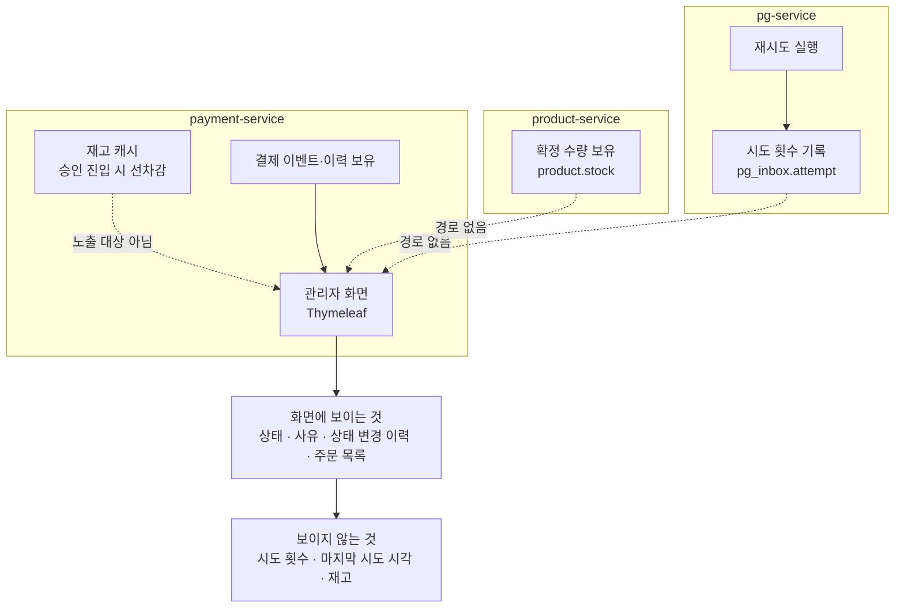

# 관리자 화면 가시성 확충 — 재시도 경과와 재고

> 최종 수정: 2026-07-27

## 사전 브리핑

### 현재 이해한 문제

결제 전 구간을 라이브로 구동해보니, **운영자가 화면만 보고는 상황을 파악할 수 없는 지점이 두 곳** 드러났다. 둘 다 확인하려면 로그를 조회하거나 DB를 직접 들여다봐야 해서, 사실상 개발자 없이는 대응이 불가능하다.

**재시도 경과가 보이지 않는다.** 격리된 결제 상세에는 최종 상태와 사유만 나온다. "재시도 소진으로 격리됨"까지는 읽히지만 몇 번 시도했는지, 마지막 시도가 언제였는지는 드러나지 않는다. 격리 건을 종결할지 되살릴지 판단해야 하는 운영자에게 이 정보가 없다.

**재고를 볼 수단이 없다.** 관리자 화면에 재고 항목 자체가 없다. 결제 실패로 재고가 제대로 되돌아왔는지 확인하려면 DB를 조회해야 하고, 캐시가 확정 수량과 어긋났을 때도 스크립트를 직접 돌려야 한다.

### 현재 시스템 동작 (as-is)

정보를 가진 쪽과 화면을 그리는 쪽이 서로 다른 서비스라는 것이 문제의 뿌리다.

| 보여줄 것 | 가진 쪽 | 화면 그리는 쪽 |
|---|---|---|
| 시도 횟수 | pg-service | payment-service |
| 확정 재고 | product-service | payment-service |

### 이번 discuss 에서 결정하려는 것

- **서비스 경계를 넘는 조회 방식** — 화면 렌더 시 직접 조회할지, 결과 이벤트에 값을 동봉할지, 별도로 전파할지. 결합도·실시간성·복잡도 trade-off 가 갈린다. 두 항목에 같은 방식을 쓸지 각각 다르게 갈지도 함께 정한다.
- **재고 조작의 허용 범위** — 캐시 재동기화 / 실수량 조정 / 잡힌 재고 수동 해제 중 무엇을 열지. 재고 조작은 돈과 직결되므로 각 기능의 오작동 파급을 따져야 한다.
- **화면 형태** — 재시도 경과는 기존 결제 상세에 얹는 것이 자연스럽다. 재고는 결제와 독립적인 정보라 별도 페이지가 맞는지, 상세 안에 함께 둘지 갈린다.
- **추적 정보 보강 범위** — 분산 추적 구간에 주문 식별자를 부여해 주문 단위로 재시도를 검색할 수 있게 할지, 이번 범위에 포함할지.

### 확정된 가정 / 열린 질문

**확정 (사용자 결정)**

- **재고는 확정 수량만 노출한다.** 캐시의 선차감 상태는 화면에 올리지 않는다 — 승인이 진행 중인 동안 캐시와 확정 수량이 어긋나며, 그 순간을 화면에서 설명하려면 오히려 혼란이 커진다.
- **재고 조작 기능은 포함한다.** 범위는 미정이나 조회 전용으로 끝내지 않는다.
- **재시도 추적이 갈리는 구조는 그대로 둔다.** 원 요청과 재시도가 별개 추적으로 남는 것은 재시도를 폴링 워커가 주도하는 구조상 자연스럽다. 합치려 하지 않고 흔적을 좇을 수단만 만든다.

**열린 질문**

- 서비스 경계 조회 방식 — 세 후보의 trade-off 를 어떻게 저울질할지
- 재고 조작 범위 — 어디까지 열어야 운영에 쓸모 있으면서 위험하지 않은지
- 재고 화면의 위치와 단위 — 상품 단위 목록인지, 결제 상세에 딸린 정보인지
- 조작 이력을 남길지 — 누가 언제 무엇을 바꿨는지 기록이 필요한 수준인지

### 확인된 사실 (라이브 실측 / 코드 조사)

- 시도 횟수의 기준 데이터는 `pg_inbox.attempt` 이며 pg-service DB 에 있다. 재시도가 돌 때마다 증가하고, 한도를 넘기면 격리로 전이된다.
- 관리자 화면은 payment-service 의 Thymeleaf 템플릿이 그린다. 결제 이벤트·상태 변경 이력은 같은 서비스가 보유하므로 화면에 바로 나온다.
- product-service 조회 경로는 이미 있다 — `ProductHttpAdapter`. 재고 조회에 재사용 여지가 있다.
- 상품 조회 API 응답에는 확정 수량이 포함된다. 다만 캐시의 선차감 상태는 반영되지 않아, 승인 진행 중에는 두 값이 어긋난다(실측 중 캐시 96 / 확정 97 관측).
- 재시도 추적은 아웃박스 폴링 워커를 뿌리로 하는 별개 추적으로 남는다. 첫 승인 요청 추적은 벤더 실패 지점에서 끊긴다.
- 추적 구간 속성에 주문 식별자가 없어, 특정 주문의 재시도를 검색으로 모을 수 없다. 실측에서는 시간순으로 뒤져 수동 식별했다.

## 리포트와의 관계

이 작업은 그 자체로 운영 도구를 늘리는 동시에, **라이브 실측 리포트의 근거를 강화하는 선행 작업**이다. 현재 리포트는 재시도 경과를 로그 조회 화면으로, 재고 되돌림을 보상 로그로 보여주는데 둘 다 개발자가 뒤져 찾은 근거다. 관리자 화면에 노출되면 운영자가 실제로 보는 화면으로 같은 장면을 대체할 수 있다.

작업 완료 후 재실측 시 교체 대상:

- 재시도 근거 — 로그 조회 화면 → 관리자 화면의 시도 횟수
- 재고 되돌림 — 보상 로그 → 재고 화면 세 장(승인 전 · 잡힌 중 · 되돌린 후)

실측 절차와 리포트 형식은 `payment-live-drill` 스킬에 정리돼 있다(`drill/payment-e2e-live` 브랜치).
