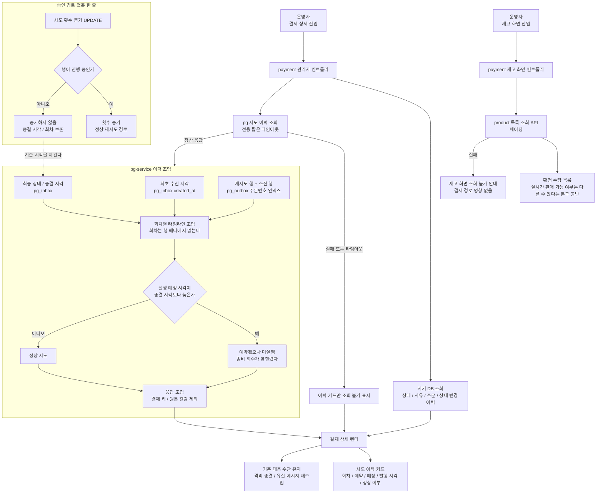
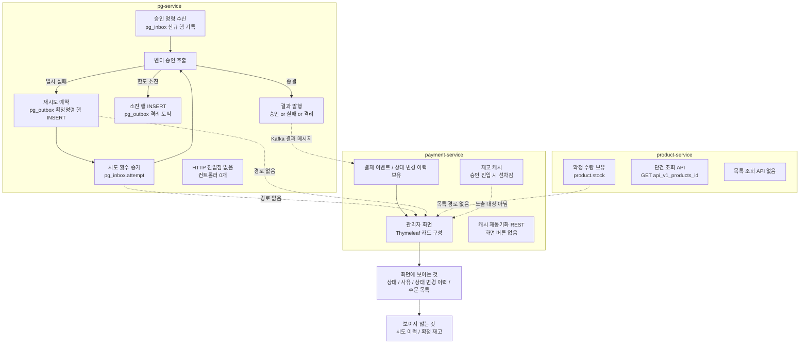

# 관리자 화면 가시성 확충 — 재시도 이력과 재고

> 최종 수정: 2026-07-27

## 요약 브리핑

### 결정된 접근

pg-service 에 관리자 조회 REST 를 새로 세우고, 결제 상세를 그릴 때 payment 가 그 API 를 호출해 시도 이력을 받아 카드로 얹는다. 이력은 새 테이블 없이 **이미 쌓여 있는 재시도 outbox 행**에서 조립한다 — 재시도가 큐가 아니라 행 INSERT 로 표현되기 때문이다. 재고는 상품 단위 별도 화면으로 확정 수량만 조회 전용으로 보여주며, 이를 위해 product-service 에 페이징 목록 API 를 신설한다.

관측 기능이지만 두 군데서 사실의 정확성을 지켜야 한다. 좀비 회수가 예약된 재시도를 앞지르면 벤더 호출 없이 발행만 된 행이 남으므로, 종결 시각보다 늦게 예정된 행은 **예약됐으나 미실행**으로 갈라낸다. 그리고 그 판정이 딛고 서는 종결 시각이 밀리지 않도록 시도 횟수 증가 UPDATE 에 상태 가드를 추가한다 — 이번 토픽이 승인 경로를 건드리는 유일한 한 줄이다.

### 변경 후 동작 (to-be)

### 핵심 결정 목록

- **시도 이력은 pg 직접 조회로 가져온다** — 결과 메시지에 관측 데이터를 태우지 않고, 진행 중인 결제도 보인다
- **이력 출처는 기존 outbox 행** — 새 테이블도, 승인 경로의 새 쓰기도 없다. 대가는 유령 행 판정 로직
- **발행 시각은 벤더 호출 시각이 아니다** — 근사값임을 화면 문구로 밝히고, 종결 이후 행은 미실행으로 갈라낸다
- **회차는 행 헤더에서 읽는다** — `pg_outbox.attempt` 컬럼은 항상 0인 죽은 컬럼이다
- **pg 가 죽어도 상세는 열린다** — 이력 카드만 조회 불가로 표시하고 격리 종결·재주입 버튼은 살아 있다
- **재고는 조회 전용, 확정 수량만** — 조작은 동시성 위험으로 다음 토픽. 캐시 재동기화 REST 는 화면에 올리지 않는다
- **시도 횟수 증가에 상태 가드 추가** — 이력의 기준 시각이 조용히 밀리는 것을 막는다

### 트레이드오프 / 후속 작업

- payment 관리자 상세가 pg 응답에 얽힌다. 전용 짧은 타임아웃과 부분 렌더로 막지만, 결합 자체는 생긴다
- 발행 큐 테이블을 이력 조회원으로 겸용한다. 주문번호 인덱스로 접근 경로를 분리하며 주문당 이력 행은 최대 5건 수준이다
- 좀비 타임아웃과 재시도 백오프가 겹치는 문제 자체는 남는다 — 표시만 교정한다. TODOS `[PG-ZOMBIE-TIMEOUT-BACKOFF-OVERLAP]`
- 추적 구간 주문 식별자 부여는 후속 — TODOS `[PG-WORKER-SPAN-ORDER-ID]`
- 재고 조작(캐시 재동기화 노출 · 확정 수량 조정 · 잡힌 재고 해제)은 별 토픽
- 작업 후 라이브 재실측으로 리포트의 로그 근거를 화면 근거로 교체한다

---

## 사전 브리핑

### 현재 이해한 문제

결제 전 구간을 라이브로 구동해보니, **운영자가 화면만 보고는 상황을 파악할 수 없는 지점이 두 곳** 드러났다. 둘 다 확인하려면 로그를 조회하거나 DB를 직접 들여다봐야 해서, 사실상 개발자 없이는 대응이 불가능하다.

**재시도 경과가 보이지 않는다.** 격리된 결제 상세에는 최종 상태와 사유만 나온다. "재시도 소진으로 격리됨"까지는 읽히지만 몇 번 시도했는지, 각 시도가 언제였는지는 드러나지 않는다. 격리 건을 종결할지 되살릴지 판단해야 하는 운영자에게 이 정보가 없다.

**재고를 볼 수단이 없다.** 관리자 화면에 재고 항목 자체가 없다. 결제 실패로 재고가 제대로 되돌아왔는지 확인하려면 DB를 조회해야 한다.

### 현재 시스템 동작 (as-is)

정보를 가진 쪽과 화면을 그리는 쪽이 서로 다른 서비스라는 것이 문제의 뿌리다.

| 보여줄 것 | 가진 쪽 | 화면 그리는 쪽 |
|---|---|---|
| 시도 이력 | pg-service | payment-service |
| 확정 재고 | product-service | payment-service |

### 이번 discuss 에서 결정하려는 것

- **서비스 경계를 넘는 조회 방식** — 화면 렌더 시 직접 조회할지, 결과 이벤트에 값을 동봉할지, 별도로 전파할지. 결합도·실시간성·복잡도 trade-off 가 갈린다.
- **재고 조작의 허용 범위** — 조회 전용으로 둘지, 캐시 재동기화·확정 수량 조정·잡힌 재고 해제 중 무엇을 열지.
- **화면 형태** — 재시도 이력은 기존 결제 상세에 얹는 것이 자연스럽다. 재고는 결제와 독립적인 정보라 별도 페이지가 맞는지 갈린다.
- **추적 정보 보강 범위** — 분산 추적 구간에 주문 식별자를 부여해 주문 단위로 재시도를 검색할 수 있게 할지.

### 확정된 가정 / 열린 질문

**확정 (사용자 결정)**

- **재고는 확정 수량만 노출한다.** 캐시의 선차감 상태는 화면에 올리지 않는다 — 승인이 진행 중인 동안 캐시와 확정 수량이 어긋나며, 그 순간을 화면에서 설명하려면 오히려 혼란이 커진다.
- **재고는 조회 전용으로 시작한다.** 조작 기능은 이번 범위에서 빠진다 — 선차감이 도는 중에 사람이 재고를 만지면 동시성 문제가 붙는다. 캐시 재동기화 REST 는 이미 있으나 화면에 노출하지 않고 그대로 둔다. *(초기 가정은 "조작 기능 포함"이었으나 동시성 위험을 이유로 뒤집혔다.)*
- **재시도 추적이 갈리는 구조는 그대로 둔다.** 원 요청과 재시도가 별개 추적으로 남는 것은 재시도를 폴링 워커가 주도하는 구조상 자연스럽다. 합치려 하지 않고 흔적을 좇을 수단만 만든다.
- **화면에 필요한 것은 횟수가 아니라 이력이다.** "몇 번"이 아니라 "언제 언제 시도했는지"가 운영자가 보려는 것이다.

**해소된 질문**

전부 아래 결정 사항 테이블로 옮겼다. 남은 열린 질문은 없다.

### 확인된 사실 (라이브 실측 / 코드 조사)

- 시도 횟수의 기준 데이터는 `pg_inbox.attempt` 이며 pg-service DB 에 있다. 재시도 결과 반영 트랜잭션에서 1씩 증가한다 (`PgVendorCallService.java:199`).
- **재시도는 별도 큐나 스케줄러가 아니라 outbox 행 INSERT 로 표현된다** (`PgVendorCallService.java:188`). 재시도 1건 = `pg_outbox` 행 1건이며, 주문번호가 `key`, 토픽이 확정 명령이다. 따라서 시도 이력 타임라인이 이미 DB 에 남아 있다.
  - `created_at` — 직전 시도가 실패해 재시도를 예약한 시각
  - `available_at` — 백오프를 반영한 실행 예정 시각
  - `processed_at` — 실제 발행 시각. NULL 이면 아직 실행 전
  - `headers_json` 의 시도 회차 값 — 몇 번째 시도인지 (`buildAttemptHeader`)
- **`headers_json` 은 현재 아무도 읽지 않는 예약 필드다.** 행 INSERT 시 회차가 정확히 기록되지만, relay 는 빈 헤더로 발행하며 (`PgOutboxRelayService.java:75` — `Map.of()`) 소비 측 회차 판정은 DB 를 본다 (`resolveAttempt` → `inbox.getAttempt()`). 이번 설계가 이 컬럼의 첫 소비자가 된다 — 값 자체는 신뢰할 수 있으나 읽는 코드가 처음 생긴다는 뜻이다.
- **`pg_outbox.attempt` 컬럼은 항상 0인 죽은 컬럼이다.** 두 생성 팩토리 모두 `0` 을 박아 넣고 (`PgOutbox.java:59,88`) 증가시키는 UPDATE 가 저장소에 없다. 발행 실패 재시도 카운트로 쓰려던 자리로 보이나 실제로 쓰이지 않는다 — 화면 회차의 출처로 삼을 수 없다.
- **좀비 회수가 예약된 재시도를 앞지를 수 있다.** IN_PROGRESS 좀비 타임아웃은 60초인데 (`application.yml:96`) 마지막 재시도 백오프는 40.5~67.5초라 겹친다. 이때 좀비 폴러가 먼저 벤더를 재호출해 종결시키고, 뒤늦게 예약 시각에 도달한 재시도 행은 relay 가 inbox 상태를 보지 않고 발행해 `processed_at` 을 채우며 (`PgOutboxRelayService.java:59-79`) 소비 측은 종결 상태를 보고 흔적 없이 건너뛴다 (`PgInboxImmediateWorker.java:159-163`). **즉 발행 시각이 채워진 행이 실제 벤더 호출을 보장하지 않는다.** 상세는 TODOS `[PG-ZOMBIE-TIMEOUT-BACKOFF-OVERLAP]`.
- `pg_outbox.payload` 에는 벤더 결제 키 원문이 직렬화돼 들어 있다 (`buildCommandPayload`). `pg_inbox.payment_key` 도 같은 키를 마스킹 없이 단독 컬럼으로 보관한다 (`PgInboxEntity.java:65-66`). 이 프로젝트는 결제 키를 로그에 남길 때 마스킹하는 선례가 있다 (`FakePgGatewayStrategy.java:138,163`).
- **시도 횟수 증가 UPDATE 에 상태 가드가 없다.** `incrementAttempt` 의 조건은 주문번호뿐이며 (`JpaPgInboxRepository.java:171-174`), 같은 파일 javadoc 이 "호출처가 확장될 경우 terminal row 의 attempt 증가를 막기 위해 상태 가드를 동반해야 한다"고 스스로 적어두었다. 다른 inbox 전이 쿼리는 전부 상태 조건을 건다.
  - 좀비 회수는 락을 짧게 잡고 놓은 뒤 트랜잭션 밖에서 벤더를 호출하므로 (`PgInboxProcessor.java:99-136`) 같은 주문에 두 호출이 겹칠 수 있고, 코드가 이를 정상 경로로 인정한다 (`PgConfirmService.java:120-131`).
  - 한쪽이 승인으로 종결시킨 직후 다른 쪽이 타임아웃으로 떨어지면 재시도 분기가 돌아 **종결된 행의 `updated_at` 을 종결 시각보다 늦게 덮고 `attempt` 를 하나 더 올린다.** 상태·사유 코드는 건드리지 않으므로 돈이 새지는 않으나, 이력의 기준 시각과 회차가 조용히 어긋난다.
- 최초 시도는 pg 가 발행한 행이 아니라 payment 가 보낸 명령을 받은 시점이다 — `pg_inbox.created_at` 이 그 시각이다. 재시도 소비는 같은 주문번호 행을 상태 전이시키므로 행이 새로 생기지 않는다 (`ux_pg_inbox_order_id` 유일 인덱스).
- 한도 소진 시 같은 주문번호로 격리 토픽 행이 하나 더 들어간다 (`insertDlqOutbox`).
- **`pg_outbox` 를 비우는 정리 작업이 없다** — 행이 지워지지 않아 이력이 사라지지 않는다.
- `pg_outbox` 인덱스는 `(processed_at, available_at)` 하나뿐이다. 주문번호로 조회하면 전체 스캔이다.
- 재시도 정책은 최대 4회, 기준 2초에 배수 3, 지터 ±25% (`RetryPolicy`). 주문 하나당 이력 행은 최대 4건 + 소진 1건 수준이다.
- **pg-service 에는 컨트롤러가 한 개도 없다.** `presentation` 하위는 인바운드 포트 하나뿐이며 서비스 간 대화는 Kafka 전용이다. 다만 `spring-boot-starter-web` 은 이미 의존성에 있고 Eureka 등록도 설정돼 있다.
- payment → product / user 는 Feign HTTP, payment ↔ pg 는 Kafka 전용이다. Feign 기본 타임아웃은 연결 2초 / 읽기 5초.
- `payment_event.retry_count` 는 죽은 컬럼이 되어 V5 에서 제거됐다. 재시도 관측은 pg 쪽으로 넘긴 결정이다.
- product-service API 는 단건 조회와 동기 재고 차감 둘뿐이다. 목록 조회도, 재고 수정도 없다.
- 상품 조회 응답에는 확정 수량이 포함된다. 캐시의 선차감 상태는 반영되지 않아 승인 진행 중에는 두 값이 어긋난다 (실측 중 캐시 96 / 확정 97 관측).
- 관리자 결제 상세는 카드 단위로 구성돼 있어 이력 카드를 하나 더 얹기 좋다 (`payment-event-detail.html`).
- `StockAdminController` 가 `/admin/stock` 경로를 REST 로 점유하고 있다 — 재고 화면은 경로가 겹치지 않게 잡아야 한다.
- 추적 구간 속성에 주문 식별자가 없다. 재시도 워커는 저장된 추적 문맥을 **복원만** 하며 (`PgInboxPollingWorker.java:182`), 복원된 구간은 원격 구간이라 기록 대상이 아니다 — 여기에 속성을 붙이면 예외 없이 버려진다. 속성을 남기려면 워커가 자체 추적 구간을 만들어야 하고, 그런 코드는 저장소에 한 곳도 없다.

---

## 문제 정의

관리자 화면이 결제의 **결과**는 보여주지만 **경과**와 **재고 여파**를 보여주지 않는다. 격리 결제를 종결할지 되살릴지 판단하려면 몇 번 · 언제 시도해서 소진됐는지 알아야 하고, 결제가 깨진 뒤 재고가 제대로 풀렸는지 확인해야 한다. 지금은 둘 다 로그와 DB 를 직접 뒤져야 나오므로 운영자 혼자 대응할 수 없다.

## 영향 범위

**pg-service — 신규 조회 경로 (최초의 HTTP 진입점)**

| 계층 | 대상 | 성격 |
|---|---|---|
| presentation | 시도 이력 조회 컨트롤러 | 신규 |
| presentation/port | 시도 이력 조회 인바운드 포트 | 신규 |
| application/service | 이력 조립 서비스 | 신규 |
| application/dto | 이력 응답 DTO | 신규 |
| application/port/out | `PgOutboxRepository` 주문번호 조회 메서드 | 변경 |
| infrastructure/repository | 위 메서드 구현 | 변경 |
| infrastructure/repository | `incrementAttempt` 에 진행 중 상태 가드 추가 | 변경 (이번 토픽의 유일한 승인 경로 접촉) |
| db/migration | `pg_outbox` 주문번호 인덱스 | 신규 |

**product-service — 목록 조회 API**

| 계층 | 대상 | 성격 |
|---|---|---|
| presentation | `ProductController` 목록 엔드포인트 | 변경 |
| presentation/port | `ProductQueryService` 목록 메서드 | 변경 |
| application/usecase | `ProductQueryUseCase` 구현 | 변경 |
| application/port/out | `ProductRepository` 페이지 조회 | 변경 |
| infrastructure/repository | 위 구현 | 변경 |

**payment-service — 조회 어댑터 + 화면**

| 계층 | 대상 | 성격 |
|---|---|---|
| application/port/out | 시도 이력 조회 포트 / 상품 목록 조회 포트 | 신규 2종 |
| infrastructure/adapter/http | 두 포트의 HTTP 어댑터 | 신규 |
| infrastructure/adapter/http/feign | pg Feign client + 전용 설정 / `ProductFeignClient` 목록 메서드 | 신규 + 변경 |
| presentation | 결제 상세 컨트롤러에 이력 조립 / 재고 화면 컨트롤러 | 변경 + 신규 |
| templates | 결제 상세에 이력 카드 / 재고 목록 화면 | 변경 + 신규 |

**무관 (건드리지 않음)**

상태 전이 도메인, 재고 캐시 선차감·보상 로직, 기존 회복 기능(격리 종결 · 유실 메시지 재주입), 기존 캐시 재동기화 REST.

승인 경로는 위 `incrementAttempt` 가드 한 줄만 예외로 손댄다. 화면이 딛고 설 기준 시각을 오염시키는 자리라 관측 기능만 얹고 넘어갈 수 없다고 판단했다 — 정상 재시도 경로에서는 행이 이미 진행 중 상태라 가드가 아무 동작도 하지 않는다.

## 설계 옵션 비교

### 시도 이력을 화면까지 가져오는 방식

**pg 에 조회 API 를 신설해 화면 렌더 시 직접 조회 — 채택**

pg 가 자기 DB 의 이력을 REST 로 내주고 payment 관리자 화면이 렌더할 때 호출한다. 진행 중인 결제도 실시간으로 보이고, 이력이 pg 한 곳에만 남아 사실의 출처가 갈리지 않는다. 대신 payment ↔ pg 에 없던 동기 결합이 생기고, pg 가 느려지면 관리자 상세 진입이 함께 느려진다. pg-service 에 첫 컨트롤러를 세우는 일이기도 하다.

**종결 결과 메시지에 시도 횟수를 동봉 — 기각**

기존 Kafka 경계를 그대로 두는 대신 종결 시점의 **횟수 하나**만 전달된다. 원하는 것은 각 시도의 시각이 담긴 이력이므로 메시지에 배열을 실어야 하고, 그러면 결과 메시지가 관측 데이터를 나르는 그릇으로 변한다. 진행 중인 결제는 종결까지 아무것도 보이지 않는다. 게다가 payment 쪽에 이력을 저장할 자리를 새로 만들어야 하는데, 이는 V5 에서 죽은 컬럼으로 지운 재시도 카운트를 형태만 바꿔 되살리는 셈이다.

**시도마다 경과 이벤트를 별도 발행 — 기각**

진행 중 경과까지 실시간으로 보이지만 토픽·소비자·저장 경로가 새로 늘고, 종결 이벤트와 순서가 어긋날 여지가 생긴다. 이미 DB 에 남아 있는 이력을 메시지로 한 번 더 복제하는 구조라 얻는 것보다 늘어나는 부품이 많다.

### 이력을 어디서 읽을지

**기존 outbox 행을 이력으로 읽는다 — 채택**

재시도가 이미 행 단위로 쌓이고 정리 작업도 없으므로 새 테이블 없이 타임라인이 나온다. 최초 시도 시각은 승인 명령 수신 시각으로 채운다. 대신 발행 큐 테이블을 이력 조회원으로 겸용하게 되므로, 조회 목적 인덱스를 붙이고 큐 본래 용도의 조회와 섞이지 않게 해야 한다.

이 선택의 대가는 **발행 행이 벤더 호출을 증명하지 않는다**는 점이다. 좀비 회수가 예약된 재시도를 앞지르면 호출 없이 발행만 된 행이 남는다. 이력 조립이 종결 시각을 기준으로 그런 행을 갈라내야 하며, 그 판정 로직이 이 방식의 실질 비용이다.

**시도 이력 전용 테이블을 신설 — 기각**

이력의 의미가 명확해지고, 벤더 호출 실제 시각을 기록하므로 위의 유령 행 문제가 애초에 생기지 않는다. 그러나 같은 사실이 두 곳에 남아 어긋날 여지가 생기고, 승인 경로의 쓰기 트랜잭션에 삽입이 하나 늘어난다 — 관측 기능이 결제 본류의 쓰기 경로를 건드리는 것은 이번 토픽이 피하려는 것이다. 유령 행은 조립 단계 판정으로 표시를 교정할 수 있으므로, 쓰기 경로를 늘리는 대가보다 낫다고 봤다.

### 재고 화면의 위치

**별도 재고 목록 화면 — 채택**

재고는 결제 한 건에 딸린 정보가 아니라 상품 단위 사실이므로 독립 화면이 맞다. 승인 전 · 잡힌 중 · 되돌린 후를 한 화면에서 이어 볼 수 있어 실측 근거로도 쓰인다. 대신 product-service 에 목록 조회 API 를 새로 만들어야 한다.

**결제 상세 안에 주문 상품 재고를 표시 — 기각**

기존 단건 조회 API 재사용으로 끝나 신규 API 가 없다. 그러나 결제 한 건에 걸린 상품만 보이고, 상세를 열 때마다 주문 수만큼 상품 조회가 붙어 결제 상세 렌더가 상품 서비스 상태에 더 얽힌다.

## 결정 사항

| 항목 | 결정 | 이유 |
|---|---|---|
| 시도 이력 전달 | pg-service 에 관리자 조회 REST 를 신설하고 화면 렌더 시 직접 조회 | 진행 중인 결제도 보이고 이력의 출처가 pg 한 곳으로 유지된다. 결과 메시지를 관측 데이터 운반에 쓰지 않는다 |
| 이력 출처 | 기존 `pg_outbox` 확정 명령 행 + 격리 토픽 행 + `pg_inbox` 최초 수신 시각 | 재시도가 이미 행 단위로 쌓이고 정리 작업이 없어 이력이 온전하다. 새 테이블·새 쓰기 경로가 없다 |
| 이력에 담을 값 | 회차 · 예약 시각 · 실행 예정 시각 · 발행 시각 · 소진 여부 · **정상 시도 여부**(예약됐으나 미실행 구분) · 최종 상태 · 사유 코드 | "언제 언제 시도했는지"에 답하는 최소 집합. 발행 시각은 벤더 호출 시각의 근사값임을 화면 문구에 반영한다. 정상 시도 여부는 아래 종결 이후 발행 행 판정의 결과를 담는 자리다 |
| 회차 값의 출처 | outbox 행의 헤더에 담긴 시도 회차 | `pg_outbox.attempt` 컬럼은 항상 0인 죽은 컬럼이라 신뢰할 수 없다. 헤더 값은 행 INSERT 시 정확히 기록된다 |
| 종결 이후 발행 행의 취급 | `pg_inbox` 의 최종 상태와 종결 시각을 1차 기준으로 삼고, 실행 예정 시각이 종결 시각보다 늦은 행은 **예약됐으나 미실행**으로 따로 라벨링한다 | 좀비 회수가 예약된 재시도를 앞지르면 벤더 호출 없는 발행 행이 남는다. 이를 정상 시도로 세면 화면이 "종결 이후에 시도가 더 있었다"는 거짓을 시간 역전 순서로 보여주고, 격리 건 판단이 그 거짓 위에서 내려진다 |
| 기준 시각의 신뢰성 | `incrementAttempt` UPDATE 에 진행 중 상태 가드를 추가한다 | 가드가 없으면 종결된 행의 종결 시각이 뒤로 밀리고 시도 횟수가 부풀려져, 유령 행 판정이 오염된 기준점 위에서 이뤄진다. 정상 재시도 경로에서는 행이 진행 중이라 무동작이고, 처방은 이미 해당 쿼리 javadoc 에 적혀 있다 |
| 원문 컬럼 비노출 | 응답 DTO 와 로그에 `pg_outbox.payload` · `pg_outbox.headers_json` · **`pg_inbox.payment_key`** 를 담지 않는다. 필요한 값만 골라 담는다 | `payload` 에 벤더 결제 키 원문이 직렬화돼 있고 `pg_inbox.payment_key` 는 그 키를 마스킹 없이 단독 컬럼으로 보관한다. 후자는 엔티티를 통째로 DTO 에 매핑하거나 `toString` 으로 로깅하면 그대로 딸려 나간다 |
| 조회 인덱스 | `pg_outbox` 에 주문번호 + 토픽 인덱스를 Flyway 로 추가 | 현재 인덱스로는 전체 스캔이다. 관리자 조회가 발행 큐 폴링과 경합하지 않게 한다 |
| pg 조회 실패 시 화면 | 이력 카드만 조회 불가로 표시하고 상세의 나머지는 그대로 렌더 | 관리자 상세는 격리 종결·재주입 버튼이 걸린 대응 화면이다. 관측 정보가 안 보인다고 대응 수단이 막히면 안 된다 |
| pg 조회 타임아웃 | pg 전용 Feign 설정으로 기본값보다 짧게 잡는다 | 기본 읽기 5초면 pg 가 느릴 때 상세 진입이 그만큼 지연된다. 관리자 화면은 빨리 실패하고 부분 렌더하는 편이 낫다 |
| 재고 조작 | 이번 범위에서 제외, 조회 전용 | 선차감이 도는 중 사람이 재고를 만지면 동시성 문제가 붙는다. 캐시 재동기화 REST 는 있으나 화면에 노출하지 않는다 |
| 재고 화면 | 상품 단위 별도 목록 화면, 확정 수량만 표시 | 재고는 상품 단위 사실이다. 캐시 선차감 상태는 승인 중 확정 수량과 어긋나 화면에서 설명이 안 된다 |
| 재고 화면 문구 | "확정 수량만 표시하며 실시간 판매 가능 여부는 다를 수 있다"를 화면에 명시한다 | 캐시가 발산한 구간에서는 확정 수량이 정상으로 보여도 판매 게이트가 깨져 있을 수 있다. 수치만 올리면 운영자가 화면을 과신한다 |
| 재고 목록 조회 | product-service 에 페이징 목록 API 를 신설 | 목록 경로가 없다. 페이징 없이 전량을 긁으면 상품이 늘수록 화면이 무너진다 |
| 조회 포트 분리 | 관리자 조회용 포트를 결제 승인 경로가 쓰는 `ProductPort` 와 분리 | 승인 경로 포트에 관리자 용도가 섞이면 나중에 떼어내기 어렵다. Feign client 는 공유해 중복을 만들지 않는다 |
| 화면 경로 | 재고 화면은 기존 캐시 재동기화 REST 경로와 겹치지 않게 복수형 경로로 신설 | 기존 REST 를 건드리지 않으면서 결제 관리자 화면의 복수형 경로 관례와 맞춘다 |
| 추적 구간 보강 | 제외. TODOS `[PG-WORKER-SPAN-ORDER-ID]` 로 등재 완료 | 이력이 화면에 나오면 추적을 뒤질 이유가 줄어든다. 워커에 자체 추적 구간을 세우는 일은 화면 가시성과 성격이 다르다 |
| 라이브 검증 | **필요하다.** 도커 스택을 기동해 관리자 상세에서 pg 이력이 실제로 그려지는지, pg 를 내렸을 때 부분 렌더가 동작하는지 눈으로 확인한다 | pg-service 에 첫 HTTP 진입점을 세우고 없던 Feign 경로를 여는 일이라, Eureka 등록·논리 이름 해석·타임아웃 동작은 단위 테스트가 증명할 수 없다. 컨트롤러 0개였던 서비스가 실제로 라우팅되는지도 기동해봐야 안다. 스택 기동 전 `bootJar` 선행이 필요하다 |

## 장애 시나리오와 대응

| 시나리오 | 지금 일어나는 일 | 대응 |
|---|---|---|
| pg-service 가 죽었거나 느리다 | 관리자 상세 렌더가 pg 응답을 기다린다 | 전용 짧은 타임아웃 + 이력 카드만 조회 불가 표시. 상태·사유·주문·상태 변경 이력·회복 버튼은 그대로 렌더 |
| product-service 가 죽었다 | 재고 화면이 목록을 못 받는다 | 재고 화면에 조회 불가 안내. 결제 승인 경로와 관리자 결제 상세에는 영향이 없어야 한다 |
| 재시도가 아직 실행 전이다 | 해당 행의 발행 시각이 비어 있다 | 실행 예정 상태로 표시. 빈 값으로 화면이 깨지지 않게 한다 |
| 옛 재시도 행에 회차 정보가 없다 | 헤더에 시도 회차가 없던 시기의 행이 섞인다 | 회차 미지로 표시하고 시각 순서로 나열. 조회 자체가 실패하지 않게 한다 |
| 좀비 회수가 예약된 재시도를 앞질렀다 | 벤더 호출이 없었던 행에 발행 시각이 채워져 종결 이후 시각으로 남는다 | 종결 시각보다 늦게 예정된 행은 예약됐으나 미실행으로 라벨링해 정상 시도와 분리한다. 화면이 종결 이후 시도를 사실처럼 보여주면 격리 판단이 거짓 위에서 내려진다 |
| 종결 직후 늦은 응답이 도착한다 | 상태 가드가 없으면 종결된 행의 종결 시각이 덮이고 시도 횟수가 하나 오른다 | `incrementAttempt` 에 진행 중 상태 가드를 걸어 종결된 행에는 적용되지 않게 한다. 상태·사유 코드는 애초에 건드리지 않는 경로다 |
| 결제 키가 이력 응답으로 새어 나간다 | `payload` 원문을 담거나 `pg_inbox` 엔티티를 통째로 매핑하면 벤더 결제 키가 노출된다 | 응답 DTO 는 필요한 값만 골라 담고, 조립 서비스·컨트롤러 로그에 `payload` 와 `payment_key` 를 찍지 않는다 |
| 주문번호가 이력에 없다 | pg 가 그 주문을 아직 못 받았거나 이력이 없다 | 이력 없음으로 구분해 표시. 조회 실패와 다른 상태로 보여준다 |
| 관리자 조회가 발행 큐 폴링과 부딪친다 | 큐 테이블을 조회 목적으로 함께 읽는다 | 주문번호 + 토픽 인덱스로 접근 경로를 분리. 주문당 이력 행은 최대 5건 수준이라 조회량 자체는 작다 |
| 재고 목록이 커진다 | 상품 전량 조회가 화면을 무너뜨린다 | 페이징을 API 계약에 넣고 화면도 페이지 단위로 렌더 |

## 검증 전략

- **pg 이력 조립 단위 테스트** — 최초 수신만 있는 경우 / 재시도 진행 중 / 소진 후 격리 / 회차 정보 없는 옛 행 혼재 / 이력 없음. 조합별로 타임라인 매핑을 검증한다.
  - **세 시각의 의미를 못으로 박는 케이스를 반드시 넣는다** — 예약 시각·실행 예정 시각·발행 시각을 회차와 짝지을 때 "예약 시각 = 그 회차가 실행된 시각"으로 잘못 붙이기 쉽다. 구현이 바뀌어도 이 매핑이 흔들리지 않게 고정한다.
  - **종결 이후 발행 행 케이스** — 실행 예정 시각이 종결 시각보다 늦은 행이 예약됐으나 미실행으로 분류되는지, 정상 시도로 세지 않는지 검증한다.
  - **원문 비노출 케이스** — 응답 DTO 에 벤더 결제 키가 담기지 않는지 확인한다.
- **pg 컨트롤러 슬라이스 테스트** — 첫 HTTP 진입점이므로 응답 형태와 없는 주문번호 처리를 고정한다.
- **payment 어댑터 계약 테스트** — 기존 상품 어댑터 계약 테스트와 같은 방식으로 pg 응답 형태를 양쪽에 고정한다.
- **부분 렌더 테스트** — pg 조회가 실패·타임아웃일 때 상세 화면이 렌더되고 회복 버튼이 살아 있는지 확인한다. 이 테스트가 없으면 관측 기능이 대응 기능을 망가뜨린 채 통과한다.
- **product 목록 API 테스트** — 페이징 경계와 빈 목록.
- **시도 횟수 가드 저장소 테스트** — 종결 상태(승인 · 실패 · 격리) 행에 시도 횟수 증가를 호출했을 때 횟수와 갱신 시각이 모두 그대로인지, 진행 중 행에서는 여전히 증가하는지 두 방향으로 확인한다. 이 테스트가 화면 타임라인의 기준 시각을 지킨다.
- **Flyway 인덱스 마이그레이션** — 통합 테스트 스키마 검증에 태운다. 예약어 컬럼명이라 인덱스 문법에 주의한다.
- **라이브 검증** — 도커 스택을 기동해 (1) 관리자 상세에서 pg 이력이 실제로 그려지는지, (2) pg-service 를 내린 상태에서 상세가 열리고 회복 버튼이 눌리는지, (3) 재고 화면이 확정 수량을 보여주고 결제 실패 후 되돌아온 수량이 반영되는지 확인한다. 앞의 단위·통합 테스트가 전부 통과해도 Eureka 논리 이름 해석과 첫 HTTP 진입점 라우팅은 기동해봐야 증명된다.

## 제외 범위

| 제외 항목 | 이유 |
|---|---|
| 재고 조작 전반 — 캐시 재동기화 화면 노출 · 확정 수량 조정 · 잡힌 재고 수동 해제 | 선차감이 도는 중 사람이 재고를 만지면 동시성 문제가 붙는다. 별 토픽에서 다룬다 |
| 캐시 선차감 상태 노출 | 승인 진행 중 확정 수량과 어긋나며 그 순간을 화면에서 설명하기 어렵다 |
| 추적 구간 주문 식별자 부여 | 이력이 화면에 나오면 급한 필요가 해소된다. 워커 자체 추적 구간 도입은 별 작업이다. TODOS `[PG-WORKER-SPAN-ORDER-ID]` |
| 좀비 회수 타임아웃과 재시도 백오프의 겹침 자체 | 이번 토픽은 표시를 교정할 뿐 겹침을 없애지 않는다. 타임아웃 값을 올릴지 백오프 off-by-one 을 정정할지는 함께 판단해야 하는 별 결정이다. TODOS `[PG-ZOMBIE-TIMEOUT-BACKOFF-OVERLAP]` |
| 시도 이력 전용 테이블 | 같은 사실이 두 곳에 남아 어긋날 여지가 생긴다. 현재 필요한 정확도는 발행 시각으로 충분하다 |
| 벤더 호출 실제 시각의 정밀 기록 | 발행 시각과 밀리초~초 단위 차이는 운영 판단에 영향이 없다. 화면 문구로 근사값임을 밝힌다 |
| 관리자 화면 인증·권한 | 기존 관리자 화면과 같은 수준을 유지한다. 이번 토픽에서 새로 손대지 않는다 |
| 재시도 추적을 원 요청과 합치는 일 | 재시도를 폴링 워커가 주도하는 구조상 갈리는 것이 자연스럽다 |

## 리포트와의 관계

이 작업은 그 자체로 운영 도구를 늘리는 동시에, **라이브 실측 리포트의 근거를 강화하는 선행 작업**이다. 현재 리포트는 재시도 경과를 로그 조회 화면으로, 재고 되돌림을 보상 로그로 보여주는데 둘 다 개발자가 뒤져 찾은 근거다. 관리자 화면에 노출되면 운영자가 실제로 보는 화면으로 같은 장면을 대체할 수 있다.

작업 완료 후 재실측 시 교체 대상:

- 재시도 근거 — 로그 조회 화면 → 관리자 화면의 시도 이력
- 재고 되돌림 — 보상 로그 → 재고 화면 세 장(승인 전 · 잡힌 중 · 되돌린 후)

실측 절차와 리포트 형식은 `payment-live-drill` 스킬에 정리돼 있다(`drill/payment-e2e-live` 브랜치).

## 참고

- `docs/context/ARCHITECTURE.md` — 계층 의존 방향, 포트·어댑터 배치 규약
- `docs/context/CONFIRM-FLOW.md` — 비동기 확정 사이클과 재시도 경로
- `docs/context/PITFALLS.md` — 도메인 함정 인덱스
- `pg-service/.../PgVendorCallService.java` — 재시도 예약과 시도 횟수 증가 지점
- `pg-service/.../RetryPolicy.java` — 재시도 한도와 백오프 파라미터
- `payment-service/.../ProductHttpAdapter.java` — 서비스 간 조회 어댑터 기존 패턴
