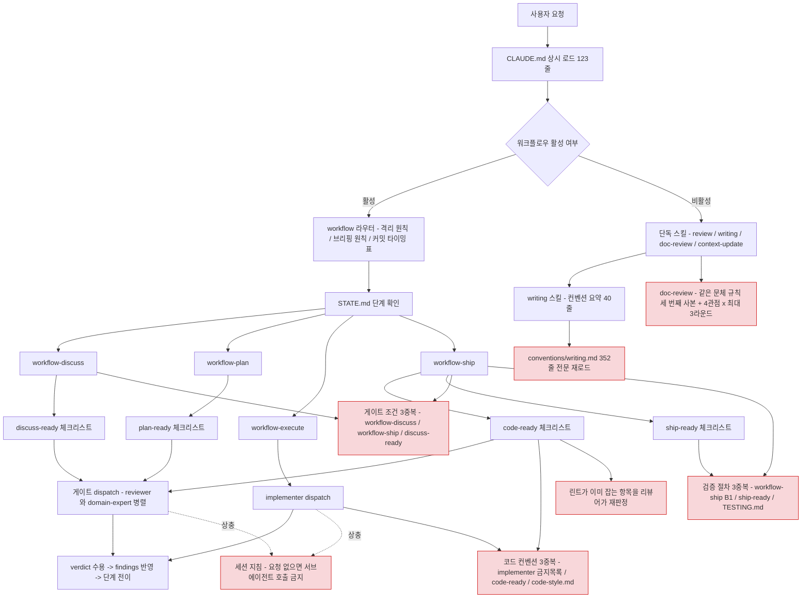
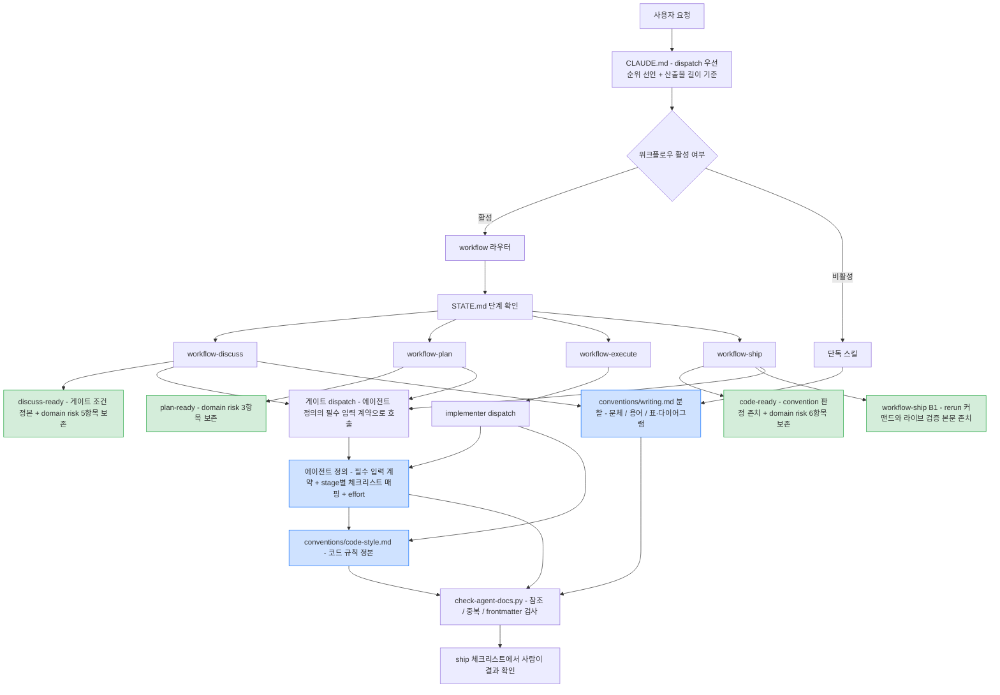

# 에이전트 컨텍스트 정비 설계

> 최종 수정: 2026-07-30

## 사전 브리핑

### 현재 이해한 문제

에이전트가 매 작업마다 읽는 지침 컨텍스트(CLAUDE.md · 스킬 · 체크리스트 · 에이전트 정의)에 상충하는 지시와 3중 중복 규칙이 쌓여 있다.
Claude 5 세대 기준(`CLAUDE-5-PROMPTING.md`)으로 보면 과잉 제약·과잉 검증·반복 지시에 해당하는 구간이 확인되며, 규칙이 여러 곳에 흩어져 한 곳만 고치면 나머지가 어긋난다.

목표는 분량 감축이 아니라 **상충 제거와 SSOT 정리**다 — 모델의 컨텍스트 처리 능력과 무관하게, 방향이 어긋난 지시는 그대로 남아 매 작업의 판단을 흔든다. 분량 감소는 결과로 따라오는 것이지 성공 기준이 아니다.

### 현재 컨텍스트 로딩 경로 (as-is)

### 이번 discuss에서 결정하려는 것

- 서브에이전트 호출 상충의 해소 방향 — 세션 지침에 워크플로우 예외를 명시할지, 워크플로우 쪽 표현을 조정할지
- 중복 규칙의 SSOT 배치 기준 — 코드 컨벤션 / 게이트 포함 조건 / 최종 검증 절차를 각각 어디 한 곳에 두고 나머지를 포인터로 바꿀지
- 리뷰 파이프라인 조정 범위 — reviewer 억제 지시 제거, 린트가 잡는 체크리스트 항목 정리, 에이전트 effort 재설정
- 점진적 공개 재편 대상 — `conventions/writing.md` 분할과 스킬 요약 중복 제거, doc-review 관점·라운드 축소
- 산출물 길이 기준 신설과 메모리 · 프로젝트 파일의 역할 분담
- 참조 형식 — 설계·플랜 브리핑을 마크다운으로 계속 둘지 아티팩트로 올릴지, `explain-diff-html` 산출물과의 역할 겹침 정리
- 체크리스트의 성격 — 지금의 yes/no 판정 항목을 유지할지, 검증자에게 넘기는 루브릭 형태로 바꿀지
- `/doctor` 자동 점검 결과와 이번 수동 점검 결과의 대조 반영 여부

### 인터뷰 결과 (확정된 가정)

| 항목 | 확정 |
|:---:|:---:|
| 수정 범위 | `.claude/` + `CLAUDE.md` + `docs/context/conventions/` + `docs/context/` 본문 + 메모리 파일 |
| 검증 방법 | 지침 문서 검사 스크립트 신설 + 게이트 리뷰 |
| effort 재설정 | 이번 작업에서 적용 |
| 브리핑 형식 | 마크다운 유지, `explain-diff-html` 산출물과 역할 경계만 정리 |

- 가정: 워크플로우 게이트 dispatch는 사용자가 정식 진행을 지시한 이상 세션 지침의 예외로 본다

## 요약 브리핑

### 결정된 접근

지침 컨텍스트를 세 갈래로 정리한다. 서로 부딪히는 지시는 우선순위를 루트 지침에 못박고, 여러 곳에 흩어진 규칙은 정본 하나와 포인터로 수렴시키며, 도구나 모델이 이미 하는 일을 다시 시키는 지시는 걷어낸다.

정본으로 옮길 때는 순서를 지킨다 — 정본에 없는 규칙은 먼저 이식한 뒤에 다른 곳을 포인터로 바꾼다. 이 순서를 어기면 규칙이 저장소에서 사라진다. 결제 도메인 방어망(체크리스트의 도메인 리스크 항목, 배차 조건, 최종 검증 커맨드, 리뷰어의 도메인 위임 의무)은 정리 대상에서 빼고 문구 그대로 둔다.

### 정비 후 컨텍스트 로딩 (to-be)

### 핵심 결정

- 코드 규칙은 `conventions/code-style.md`가 정본, 구현 에이전트 지시만 포인터화 — 리뷰 판정 항목은 정적 분석이 없어 체크리스트에 존속
- `@Data` 금지와 null 반환 금지는 정본에 없으므로 먼저 이식하고, null 규칙에는 적용 범위(공개 반환값 한정, 도메인 상태 null·wire 계약 DTO·private 헬퍼 제외)를 함께 적는다
- TDD 사이클은 개발 흐름과 커밋 타입 매핑으로 나눠 각각 `conventions/testing.md`와 `commit.md`가 정본
- 리뷰어의 억제 지시를 걷어내되 도메인 위임 의무는 보존, effort는 reviewer만 낮추고 원복 조건을 `CONCERNS.md`에 남긴다
- dispatch 예시 블록은 에이전트 정의에 필수 입력 계약을 세운 뒤에만 제거
- 검사 스크립트는 정보 제공용 — 종료 코드로 작업을 막지 않는다

### 트레이드오프와 후속

- 구현 에이전트가 컨벤션 파일을 한 번 더 열어야 한다 — 중복 제거의 대가로 수용
- `var`·`@Data`·`catch (Exception)`·null 반환은 여전히 수동 판정에 의존한다 — 정적 분석 규칙 신설은 `TODOS.md`로 위임
- 검사 스크립트의 CI 편입은 오탐이 잦아들면 후속 판단
- effort 하향의 실제 영향은 첫 도메인 인접 토픽에서 확인하고, 저하가 보이면 원복

### 게이트 구성 메모

도메인 비접촉 토픽으로 분류하지 않는다 — `code-ready.md`의 domain risk 섹션과 `domain-expert.md`의 리스크 카탈로그가 들어 있는 파일을 편집하므로, 결제 도메인 동작을 판정하는 기준 자체가 영향권에 있다. 게이트에 domain-expert를 포함한다.

이 판단은 `discuss-ready.md`의 생략 조건 중 "산출물이 결제 도메인 동작을 서술·정정" 갈래를 적용한 결과다. 소스 변경이 없다는 이유만으로 생략했다면 방어망을 건드리는 작업을 무검증으로 통과시킬 뻔했고, SSOT 정리에서 이 갈래를 보존해야 하는 근거도 여기에 있다.

---

## 문제 정의

지침 컨텍스트의 결함은 세 종류다.

**상충** — 세션 지침이 "요청 없으면 서브에이전트를 부르지 마라"인데 `workflow/SKILL.md` 핵심 원칙 1·2는 게이트 판정과 구현을 서브에이전트로만 하라고 못박는다. 워크플로우를 돌릴 때마다 두 지시가 부딪히고, 어느 쪽을 따를지가 그때그때 달라진다.

**중복** — 같은 규칙이 세 곳 이상에 본문으로 실려 있다.

| 규칙 | 실린 곳 |
|:---:|:---:|
| 코드 컨벤션(`var` / `Optional` / `catch (Exception)` / `@Data`) | `implementer.md` 금지 목록 · `code-ready.md` convention 섹션 · `conventions/code-style.md` |
| TDD 사이클(RED → GREEN → REFACTOR) | `CLAUDE.md` Coding Rules · `conventions/testing.md` · `_shared/conventions/commit.md` · `implementer.md` · `TESTING.md` TDD 흐름 절 |
| domain-expert 포함·생략 조건 | `workflow-discuss` 5절 · `workflow-ship` A1 · `discuss-ready.md` 주석 |
| 통합테스트 `--rerun` 절차 | `workflow-ship` B1 · `ship-ready.md` |
| 문체 규칙(종결·표·용어) | `_shared/conventions/writing.md` 352줄 · `writing/SKILL.md` 요약 40줄 · `doc-review` 관점 1 표 |

한 곳을 고쳐도 나머지가 그대로 남아 서로 어긋나며, 어느 쪽이 정본인지 판단할 근거가 문서 안에 없다.

중복으로 보이지만 아닌 것도 있다.

- `code-style.md`의 식별자 라벨 금지는 **소스 주석·Javadoc·로그 문자열** 대상, `writing.md`와 `workflow-discuss`의 즉석 코드 라벨 금지는 **설계 문서 프로즈** 대상 — 적용 면이 달라 통합 대상이 아니며, 정리 대상은 `writing.md` 284~291행과 `workflow-discuss` 63행 사이의 서술 중복(예시와 예외 조항까지 동일)으로 한정
- `TESTING.md`의 `--rerun-tasks` 언급은 테스트 카운트 표의 스냅샷을 갱신하는 방법 안내라, ship B1의 "캐시로 통합테스트가 조용히 스킵된다"는 안전 경고와 목적이 다름 — 중복 표에서 제외하고 문구 사전에도 넣지 않는다

**과잉** — 모델이 이미 하는 일이나 도구가 이미 잡는 일을 지시로 다시 시킨다.

- `reviewer.md`의 "영향 없는 취향 문제는 침묵이 낫다" — 보수적 판정을 지시하면 실제 결함 보고까지 줄어든다
- `code-ready.md` execution discipline 섹션의 "죽은 코드/미사용 import" 항목 중 **미사용 import 부분** — `config/checkstyle/checkstyle.xml`의 `UnusedImports`·`RedundantImport`가 ship B1 린트 게이트에서 이미 잡는다. 같은 항목에 묶인 "죽은 코드"는 정적 분석이 검출하지 않으므로 남긴다
- `doc-review` 4관점 병렬 × 최대 3라운드 — 문서 하나에 에이전트 실행이 최대 12회
- 브리핑 플로우차트의 "간략화 금지, 전체 경로" 고정 규칙 — 토픽 크기와 무관하게 강제된다

반대로 도구가 잡지 못하는 것이 확인됐다. `checkstyle.xml`에는 네이밍·포맷·import 모듈만 있고 `var` 금지 · `@Data` 금지 · `catch (Exception)` 금지 · null 반환 금지에 해당하는 규칙이 없다. spotbugs 제외 설정에도 없고, ArchUnit은 저장소에 도입돼 있지 않아 검증 경로 자체가 없다. 이 네 규칙의 유일한 검증 수단은 리뷰어의 수동 판정이므로 `code-ready.md`의 판정 항목으로 존속시킨다.

규칙이 실린 위치를 정리하다 정본 자체의 공백도 드러났다. 정본으로 지정할 `conventions/code-style.md`에는 `var` 금지와 `catch (Exception)` 금지만 있고, `@Data` 금지와 null 반환 금지는 `docs/context/` 전체에 없다 — 두 규칙은 `implementer.md`와 `code-ready.md`에만 존재한다. 정본에 없는 규칙을 포인터로 바꾸면 그 규칙이 저장소에서 사라진다.

## 영향 범위

| 영역 | 대상 | 변경 성격 |
|:---:|:---:|:---:|
| 루트 지침 | `CLAUDE.md` | dispatch 예외 선언, 중복 규칙 제거, 산출물 길이 기준 신설 |
| 워크플로우 스킬 | `workflow` · `workflow-{discuss,plan,execute,ship}` | dispatch 예시 블록 제거, 게이트 조건 SSOT 포인터화, 즉석 코드 라벨 서술 축약, 브리핑 고정 규칙 완화 |
| 에이전트 정의 | `reviewer` · `domain-expert` · `implementer` | 억제 지시 제거, 컨벤션 목록 포인터화, effort 재설정 |
| 체크리스트 | `code-ready` · `ship-ready` · `discuss-ready` · `plan-ready` | execution discipline 항목에서 미사용 import만 제거(죽은 코드 판정 존치), domain risk 섹션이 있는 3종은 문구 보존 |
| 공용 컨벤션 | `_shared/conventions/writing.md` | 주제별 분할, 스킬 요약 중복 제거 |
| 단독 스킬 | `writing` · `doc-review` | 요약 사본 제거, 관점·라운드 축소 |
| 코드 규칙 문서 | `docs/context/conventions/` | 코드 컨벤션 SSOT 확정, 중복 서술 흡수 |
| 컨텍스트 문서 | `docs/context/` 본문 | 진입 구조·상호 참조 정리, `code-style.md`에 누락 규칙 이식, `CONCERNS.md`에 effort 원복 트리거 등재 (그 밖의 사실 서술은 손대지 않음) |
| 메모리 | 사용자 메모리 디렉토리 | 적용 범위까지 동일한 중복 항목만 제거, frontmatter `name` 누락 파일 보정 |
| 검증 도구 | `scripts/` 신규 | 지침 문서 검사 스크립트 |

## 설계 옵션 비교

### 코드 규칙의 정본 위치

- **컨벤션 문서 정본 방식** — `docs/context/conventions/`를 정본으로 두고 `implementer.md`는 포인터 한 줄만 남긴다. 컨벤션 문서가 이미 상세하고 사람도 읽는 문서라 설명을 담기 적합하며, 에이전트 정의는 역할 기술에 집중된다. 리뷰 체크리스트는 성격이 달라 그대로 두고(판정 항목이지 규칙 서술이 아니다), 정본에 없는 규칙은 먼저 이식한 뒤에만 포인터화한다. 단점은 구현 에이전트가 파일을 한 번 더 열어야 한다.
- **에이전트 정의 정본 방식** — `implementer.md`에 규칙 본문을 두고 문서가 참조한다. 구현 시점 로딩은 빠르지만, 사람이 읽는 컨벤션 문서가 에이전트 정의에 종속돼 문서 자체의 완결성이 깨진다.
- **양쪽 유지 + 동기 검사 방식** — 지금 구조를 두고 검사 스크립트로 불일치만 감지한다. 변경 비용은 낮지만 중복 자체는 남고, 로딩 토큰도 그대로다.

### TDD 사이클의 정본 위치

- **역할 분리 방식** — 개발 흐름(테스트 먼저, RED → GREEN → REFACTOR)은 `conventions/testing.md`, 커밋 타입 매핑(`test:` / `feat:` / `refactor:`)은 `_shared/conventions/commit.md`를 각각 정본으로 두고 `CLAUDE.md`·`implementer.md`·`TESTING.md`는 포인터로 줄인다. 두 문서가 이미 각 축을 담당하고 있어 이동이 없다.
- **단일 정본 방식** — 다섯 곳을 한 파일로 모은다. 찾기는 쉬워지지만 개발 흐름과 커밋 규칙이 한 파일에 섞여, 커밋 규칙만 필요한 작업도 전체를 읽게 된다.
- **`CLAUDE.md` 정본 방식** — 상시 로드되는 곳에 두어 확실히 읽히게 한다. 점진적 공개 방향과 반대로 가고, 루트 지침이 다시 비대해진다.

### 서브에이전트 상충의 해소

- **루트 지침 예외 선언 방식** — `CLAUDE.md`에 "워크플로우 스킬이 규정한 게이트·구현 dispatch는 사용자가 승인한 절차"라고 명시해, 세션 지침의 일반 금지와 우선순위를 정한다.
- **스킬 자체 선언 방식** — 각 워크플로우 스킬이 dispatch 근거를 스스로 선언한다. 스킬을 안 읽은 시점의 판단에는 영향을 주지 못한다.
- **세션 설정 수정 방식** — 금지 문구 자체를 사용자 환경에서 고친다. 저장소 밖이라 이번 작업으로 보장할 수 없고, 사용자 안내 사항으로만 남는다.

### 체크리스트의 성격

- **기계 판정 분리 방식** — 린트·스크립트가 판정 가능한 항목은 체크리스트에서 빼고 "게이트 통과" 한 줄로 대체, 사람·에이전트의 판단이 필요한 항목만 남긴다.
- **루브릭 전면 전환 방식** — 전체를 서술형 기준으로 바꿔 검증자에게 넘긴다. 판정의 재현성이 떨어지고 verdict 규칙(no는 최소 major)의 기계적 연결이 끊긴다.
- **현행 유지 방식** — 중복 판정 비용을 감수한다.

### 검사 스크립트의 형태

- **Python 단일 스크립트 방식** — 링크 해석·frontmatter 파싱·중복 문구 탐지를 한 파일에서 처리한다. `scripts/usl-fit.py` 선례가 있다.
- **셸 스크립트 방식** — 기존 `scripts/*.sh`와 일관되지만, 마크다운 링크 해석과 규칙 대조 로직이 길어지면 유지보수가 나빠진다.
- **Gradle 태스크 방식** — 빌드에 묶여 CI 연동이 쉽지만, 문서 검사를 위해 JVM 빌드 그래프에 의존이 생긴다.

## 결정 사항

| 항목 | 결정 | 이유 | 기각한 대안 |
|:---:|:---:|:---:|:---:|
| 코드 규칙 정본 | 규칙 서술은 `conventions/code-style.md`, 구현 지시(`implementer.md`)만 포인터화 — 리뷰 판정 항목(`code-ready.md` convention 섹션)은 존속 | 규칙 서술과 판정 항목은 역할이 다르다. 정적 분석이 없는 네 규칙은 리뷰 판정이 유일한 검증 수단이라 체크리스트에서 뺄 수 없다 | 에이전트 정의 정본(사람이 읽는 문서가 종속됨) / 양쪽 유지 + 동기 검사(중복 존치) / 체크리스트까지 포인터화(검증 수단 소멸) |
| 정본의 규칙 공백 | `@Data` 금지와 null 반환 금지를 `code-style.md`에 먼저 이식한 뒤에만 `implementer.md`를 포인터화 | 정본에 없는 규칙을 포인터로 바꾸면 저장소에서 규칙이 사라진다 — 메모리 정리와 같은 순서 원칙 | 이식 없이 포인터화(규칙 유실) / 두 규칙을 에이전트 정의에만 존치(정본 불완전) |
| null 반환 금지의 적용 범위 | 이식 문구에 범위를 명시 — 공개 유스케이스·포트의 반환값에 한정하고, 도메인 상태로서의 null(금액 미수신 판정 등)·wire 계약 DTO 필드(비동기 메시지·HTTP 응답)·private 매핑 헬퍼는 제외 | 금액 불일치 판정은 수신 금액이 없을 때 격리로 보내는 경로라 null이 상태값이고, 메시지 페이로드와 관리자 조회 응답의 nullable 필드는 서비스 간 계약이다 — 무범위 규칙이 정본에 앉으면 리뷰가 이 가드를 위반으로 오판한다 | 범위 없이 이식(현재 코드와 즉시 모순) / 규칙 이식 자체를 포기(정본 공백 존치) |
| TDD 사이클 정본 | 역할 분리 방식 — 개발 흐름은 `conventions/testing.md`, 커밋 타입 매핑은 `commit.md`, 나머지 세 곳은 포인터 | 두 문서가 이미 각 축을 담당해 이동 없이 정리된다 | 단일 정본(축이 다른 규칙이 섞임) / `CLAUDE.md` 정본(루트 지침 비대화) |
| 상충 해소 | 루트 지침 예외 선언 방식 + 세션 설정은 사용자 안내 | 저장소 안에서 보장 가능한 유일한 수단 | 스킬 자체 선언(스킬 로드 전 판단에 무력) / 세션 설정 수정(저장소 밖) |
| 체크리스트 | execution discipline 항목을 "죽은 코드가 새로 생기지 않음"으로 좁히고 미사용 import만 제거 | 미사용 import는 checkstyle이 잡지만 죽은 코드는 못 잡고, `var`·`@Data`·`catch (Exception)`·null 반환도 정적 분석 규칙이 없어 수동 판정이 유일한 수단 | 전면 루브릭 전환(판정 재현성 저하) / convention 섹션 통째 삭제(검증 공백) / 항목 전체 삭제(죽은 코드 검증 유실) |
| 즉석 코드 라벨 금지 서술 | `writing.md`를 정본으로 두고 `workflow-discuss` 63행은 포인터로 축약, `code-style.md`의 코드 주석 규칙은 손대지 않음 | 두 문서가 예시까지 동일하게 반복하는 반면 코드 주석 규칙은 적용 면이 다르다 | 세 곳 통합(적용 면이 다른 규칙까지 뭉갬) / 현행 유지 |
| 체크리스트 domain risk 섹션 | 기계 판정 분리 대상에서 **전면 제외**, 문구 축소·포인터화 금지 | 멱등성 가드·PG 응답 검증·상태 전이 불변식·race window·부분 실패 정합·PII는 판단형이라 어떤 도구도 잡지 못한다 | 다른 섹션과 동일 취급(돈 사고 방어망 상실) |
| domain-expert 포함 조건 | 정본은 `discuss-ready.md`, 스킬 두 곳은 포인터 — "소스·런타임 설정 변경" + "결제 도메인 동작 서술·정정" 2갈래 문구를 그대로 보존 | 서술·정정 갈래가 빠지면 판정 기준을 건드리는 메타 토픽에서 domain-expert가 생략되는 회귀가 난다 | 스킬 본문 정본화(discuss·ship 두 스킬 중 어느 쪽이 정본인지 다시 모호해짐) / "소스 변경 여부"로 단순화(이번 토픽 같은 메타 작업이 무검증 통과) |
| ship 최종 검증 절차 | `workflow-ship` B1에 통합테스트 `--rerun` 커맨드와 라이브 검증 조건부 판단을 **본문으로 존치**, 체크리스트는 확인 항목만 | 캐시로 인한 통합테스트 무실행과 라이브 검증 누락은 실패 신호 없이 조용히 지나가 후행 차단이 작동하지 않는다 | 포인터화(실행 시점에 커맨드 부재) |
| reviewer 억제 지시 | 제거하고 severity 분류 지침으로 대체 | 보수적 판정 지시가 실제 결함 보고를 줄인다 | 현행 유지(과소 보고 지속) / 문구만 완화(같은 억제 신호가 남아 효과가 불확실) |
| reviewer 검토 방법 2항 | 도메인 리스크 escalation 의무는 편집 대상에서 제외·보존 | domain-expert 미배석 라운드의 유일한 도메인 감지 경로 | 다른 항목과 함께 재작성(한 파일을 여러 목적으로 편집하다 의무 조항이 축약될 위험) |
| effort | reviewer xhigh → high, domain-expert xhigh 유지, implementer high 유지 | 리뷰는 낮은 단계에서도 정확도 유지, 돈 사고 축과 구현은 현행 유지 | 전원 하향(도메인 감지 약화) / 현행 유지(한도 소모 지속) |
| effort 원복 조건의 위치 | 하향 근거와 원복 트리거를 `docs/context/CONCERNS.md`에 등재하고, `TODOS.md`에 재확인 후속 항목을 연결 | 토픽 문서는 ship 후 아카이브로 이동해 평소 참조 경로에서 빠지고, 첫 토픽 1회 확인만으로는 그 뒤에 다시 열어볼 계기가 없다 | 토픽 문서에만 기록(아카이브 후 사문화) / 에이전트 정의 주석(리뷰 판정 흐름과 무관한 위치) / CONCERNS 등재만(첫 토픽 이후 발견 경로 없음) |
| doc-review | 관점은 문서 유형별 필수만, 라운드 3 → 2 | 최대 12회 실행은 과잉 검증 | 현행 유지 / 단일 에이전트 통합(관점 독립성 상실) |
| 브리핑 플로우차트 | "전체 경로 강제" → "이해에 필요한 분기·예외를 빠짐없이" | 토픽 크기에 맞는 판단 여지 부여 | 현행 강제 유지 / 규칙 삭제(브리핑 품질 편차) |
| dispatch 예시 블록 | `domain-expert.md`·`implementer.md`에 `reviewer.md`와 동등한 필수 입력 계약(호출자 제공 항목 + 미비 시 거부)을 먼저 신설하고, stage별 체크리스트 매핑을 각 에이전트 정의에 표로 흡수한 뒤에만 스킬의 예시 블록을 제거 | 지금은 예시 블록이 stage별 매핑을 명문화하는 유일한 자리다. `reviewer.md`만 입력 미비 시 거부 규칙을 갖고 있어, 계약 없이 예시를 지우면 domain-expert가 잘못된 입력으로도 그냥 진행한다 | 계약 신설 없이 예시 제거(배차 입력 유실) / 예시 유지 + 동기 검사 추가(중복 존치, 검사 비용만 증가) |
| `writing.md` | 문체 / 용어·식별자 / 표·다이어그램으로 분할하고 `writing/SKILL.md` 요약 사본과 `doc-review` 관점 1 표를 분할 파일 포인터로 대체 | 352줄 통 로드에 요약과 검수 항목표까지 얹혀 같은 규칙이 세 번 로드된다. 검수 판정 대상이 곧 정본 파일이라 표를 복제할 이유가 없다 | 단일 파일 유지 / 요약만 제거(검수 표 사본 잔존) / 관점 1 표 존속(정본과 어긋날 여지) |
| 산출물 길이 | `CLAUDE.md`에 길이 기준 1줄 신설 | 필수 섹션만 정해져 있어 분량 상한이 없다 | 문서별 최대 줄 수 지정(작업 성격 차이 무시) |
| 메모리 | 프로젝트 파일에 동일 규칙이 **동일한 적용 범위로** 실재하는 항목만 삭제 — 대응처가 없거나 범위가 좁으면 보존하고, 누락 조건을 프로젝트 파일에 먼저 이식한 뒤에만 삭제한다 | 파일이 정본이지만, 통합테스트 캐시 메모리의 "여러 서비스를 건드리면 전부 `--rerun`" 조건과 라이브 검증 메모리의 알람 밖 일반 원칙은 프로젝트 파일 어디에도 없다 | 메모리 전면 정리(학습 유실) / 파일 단위 대응만 확인하고 삭제(좁은 사본만 남음) / 손대지 않음(중복 지속) |
| 브리핑 형식 | 마크다운 유지, `explain-diff-html`과 역할 경계만 명시 | git 이력·리뷰 대상 유지 | 아티팩트 전환 |
| `/doctor` | 실행 후 결과를 이번 점검 결과와 대조, 채택분만 반영 | 자동 점검과 수동 점검의 교차 확인 | 미실행 / 결과 전량 수용 |

## 장애 시나리오와 대응

| 시나리오 | 대응 |
|:---:|:---:|
| 포인터만 남은 규칙을 에이전트가 열지 않아 컨벤션 위반 | 구현 시작 시 해당 컨벤션 파일을 읽는 단계를 `implementer.md`에 유지, 위반은 린트·리뷰가 후행 차단 |
| 억제 지시 제거로 minor findings 폭증 | severity 분류 기준을 명시하고 ship 리뷰의 minor는 목록 표시만 — 수정 대상 진입은 사용자 선택 |
| effort 하향으로 체크리스트 판정 누락 | 적용 후 첫 토픽의 게이트 findings 건수·적중을 기록해 저하 시 xhigh로 원복 |
| 검사 스크립트 오탐이 작업을 막음 | 비차단 경고로 시작하고 ship 체크리스트에서 사람이 확인, CI 편입은 안정화 후 |
| 컨텍스트 문서를 손대다 사실 서술이 왜곡됨 | 구조·진입·상호 참조만 조정하고 사실 서술은 제외 범위로 고정 |
| 메모리 정리로 유효한 취향이 사라짐 | 삭제 전 대응하는 프로젝트 파일 경로를 근거로 남기고, 대응처가 없으면 보존 |
| 도메인 인접 diff가 비접촉으로 오분류돼 escalation이 누락됨 — findings 건수 지표로는 드러나지 않는다 | reviewer 검토 방법 2항 보존을 전제로, 적용 후 첫 도메인 인접 토픽에서 domain-expert 배석 판단 근거를 리뷰 처리 섹션에 기록. 사후 배석에서 새 critical·major가 나오면 reviewer effort를 xhigh로 원복. 판단 근거와 원복 조건은 `CONCERNS.md`에 두고 `TODOS.md` 후속 항목으로 재확인 시점을 남긴다 |
| 중복 제거가 실행 커맨드까지 지워 ship 최종 검증이 형해화됨 | `--rerun`·라이브 검증은 실행 스킬 본문 존치를 결정 사항으로 못박고, 검사 스크립트의 중복 탐지 문구 사전에서 제외 |

## 수락 조건

작업 완료를 관찰 가능한 형태로 판정하는 기준이다.

- 중복 표의 규칙 5종이 각각 정본 1곳 + 포인터로 수렴 — 검사 스크립트의 중복 탐지 결과 0건
- 세션 지침과 워크플로우 dispatch의 우선순위가 `CLAUDE.md`에 1개 문장으로 명시됨
- domain risk 섹션을 가진 체크리스트 3종이 문구 변경 없이 그대로 존재 — `code-ready.md` 6항목 · `discuss-ready.md` 5항목 · `plan-ready.md` 3항목 (`ship-ready.md`에는 이 섹션이 없으며 신설하지 않는다)
- `code-style.md`에 `@Data` 금지와 null 반환 금지 규칙이 존재하고, null 반환 금지 문구에 적용 범위와 제외 대상(도메인 상태 null · wire 계약 DTO · private 헬퍼)이 함께 적혀 있으며, 그 뒤에 `implementer.md`가 포인터로 축약됨
- `CONCERNS.md`에 reviewer effort 하향 근거와 원복 트리거가 항목으로 존재하고, `TODOS.md`에 재확인 후속 항목이 연결됨
- `domain-expert.md`와 `implementer.md`에 필수 입력 계약(호출자 제공 항목 + 미비 시 거부)과 stage별 체크리스트 매핑이 존재하고, 그 뒤에 스킬의 dispatch 예시 블록이 제거됨
- `doc-review` 관점 1 표가 분할된 문체 파일 포인터로 대체되고, 판정 형식만 스킬에 남음
- `reviewer.md` frontmatter가 `effort: high`, `domain-expert.md`는 `xhigh`, `implementer.md`는 `high` 유지
- `discuss-ready.md`의 domain-expert 생략 조건에 "결제 도메인 동작(상태 전이·멱등성·복구·정산)" 열거가 흡수된 뒤에 두 스킬이 포인터로 축약됨
- `workflow-discuss` 63행의 즉석 코드 라벨 서술이 `writing.md` 분할 파일 포인터로 축약됨
- `code-ready.md` execution discipline 항목에서 미사용 import만 빠지고 죽은 코드 판정은 남아 있음
- `workflow-ship` B1에 `--rerun` 커맨드와 라이브 검증 조건이 본문으로 존재
- `reviewer.md`에 억제 지시가 없고 검토 방법 2항(도메인 escalation 의무)은 그대로 존재
- 검사 스크립트가 현재 저장소에서 실행되고, plan 단계에서 정의하는 샘플 쌍(정본 위반 1건 · 오탐 함정 1건)에 대해 기대한 판정을 출력 — 위반은 검출, 함정은 미검출
- 지침 문서의 깨진 참조 0건

## 검증 전략

검사 스크립트(`scripts/check-agent-docs.py`)가 판정하는 항목과 그 정의다.

| 판정 항목 | 정의 | 오탐 회피 |
|:---:|:---:|:---:|
| 참조 무결성 | 마크다운 링크와 백틱 경로 중 파일 경로 형태인 것이 실제 파일로 해석되는지 | 코드 예시·커맨드 인자는 검사 대상에서 제외 |
| frontmatter 필수 필드 | 스킬은 `name`·`description`, 에이전트는 `name`·`description`·`model`·`tools` | — |
| 체크리스트 참조 | 스킬이 지정한 체크리스트 파일과 섹션 제목이 실재하는지 | 섹션명은 제목 텍스트 정규화 후 대조 |
| 중복 규칙 | plan 단계에서 확정하는 **문구 사전**의 각 항목이 정본 외 파일에 본문으로 등장하는지 — 정확 문자열 매칭 | 포인터 문장(정본 경로를 포함한 줄)은 매칭에서 제외, 실행 커맨드는 사전에 넣지 않음, 존속 결정된 판정 체크리스트 섹션(`code-ready.md`의 convention · domain risk)은 매칭 대상에서 제외 |
| Mermaid 금지 문자 | 노드·엣지 라벨의 `{`·`}`·중간점·유니코드 화살표 | 코드 펜스 밖 텍스트는 제외 |
| 고아 문서 | `.claude/` 마크다운 중 어디서도 참조되지 않는 것 | `SKILL.md`와 `agents/*.md`는 프레임워크가 frontmatter로 자동 탐색하므로 검사 대상에서 제외 |

스크립트는 **정보 제공용**이다 — 종료 코드로 작업을 막지 않고, ship 체크리스트에서 사람이 결과를 읽고 최종 판정한다. 게이트는 reviewer와 domain-expert 병렬 판정으로 수행하고, ship 단계에서는 스크립트 결과 확인과 기존 린트 게이트 통과를 함께 요구한다.

## 제외 범위

- 워크플로우 4단계 구조와 격리 원칙의 폐지 — 검토 격리는 self-rubber-stamp 방지 장치라 유지한다
- `docs/context/` 본문의 사실 서술 정정 — 진입 구조와 상호 참조만 다룬다. 다른 문서의 규칙을 재서술한 중복 문단(`TESTING.md`의 TDD 흐름 절 등)을 포인터로 교체하는 것은 구조 정리에 포함되며 이 제외 대상이 아니다
- 정적 분석 규칙 신설 — `var` 금지 등을 checkstyle·ArchUnit으로 강제하는 작업은 이번 범위 밖이며 `TODOS.md`로 위임한다
- `payment-live-drill` 등 운영 절차 스킬의 시나리오·캡처 규칙
- 검사 스크립트의 CI 편입 — 오탐 안정화 후 후속 판단
- 브리핑의 아티팩트 전환
- 모델 티어링 변경 — effort만 조정하고 모델 배정은 그대로 둔다

## 참고

- `CLAUDE-5-PROMPTING.md` — Opus 5 프롬프팅 가이드와 컨텍스트 엔지니어링 기사 정리
- `.claude/skills/README.md` — 스킬·에이전트·공용 리소스 인덱스
