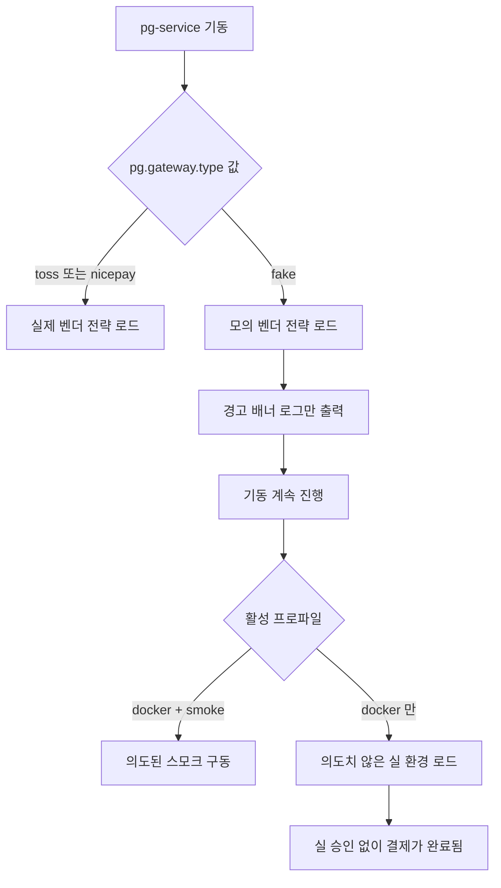
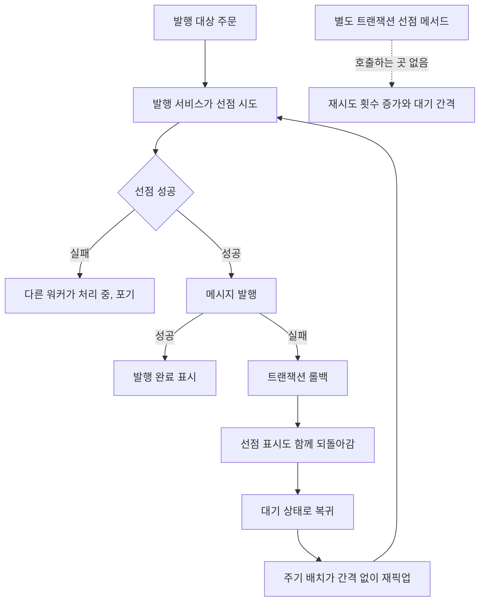
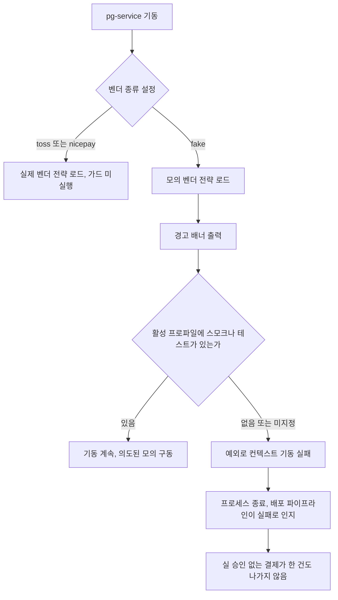

# 미해결 항목 잔여 정리 설계

> 최종 수정: 2026-08-04

## 사전 브리핑

### 현재 이해한 문제

미해결 항목 대장의 "현재 과업"에 여덟 건이 남아 있고 이번에 일곱 건을 닫는다. 성격을 나눠 보면 실제 코드를 손대야 하는 것은 셋뿐이고, 나머지는 판단만 내리면 닫히는 것들이다. 손댈 셋은 이렇다. 쓰이지 않는 선점 경로 두 메서드가 남아 재시도 정책이 실제로는 안 걸리는데도 걸리는 것처럼 읽히고, 모의 벤더가 실 환경에 로드돼도 기동을 막는 장치가 없으며, 앞선 작업에서 검출만 켜두고 억제로 덮어둔 스타일 위반 여섯 건이 그대로 있다.

### 현재 시스템 동작

**모의 벤더가 실 환경에서 뜰 수 있는 경로**

문제는 마지막 갈래다. 스모크와 벤치마크 스택은 `smoke` 프로파일을 함께 켜지만, 일반 앱 스택은 `docker` 프로파일만 켜면서 벤더 종류를 환경변수로 받는다. 그 환경변수에 `fake` 가 들어가면 아무도 막지 않는다.

**쓰이지 않는 선점 경로**

발행 서비스는 저장소 포트의 선점을 직접 호출한다. 그런데 그게 발행과 같은 트랜잭션 안이라, 발행이 실패하면 선점 표시까지 함께 되돌아간다. 재시도 횟수를 올리고 대기 간격을 두려고 만든 별도 트랜잭션 메서드 두 개는 아무도 부르지 않는다. 결과적으로 발행 실패는 재시도 간격 없이 다음 배치에서 곧바로 다시 시도된다.

배치 주기는 5초로 잡혀 있지만 실제 재시도 간격은 그보다 벌어질 수 있다 — 배치가 직전 회차의 발행 완료를 기다린 뒤 다음 지연을 시작하므로, 브로커 장애로 발행이 전송 대기 한도까지 늘어지면 그만큼 밀린다. 어느 쪽이든 **실패 횟수에 따라 간격이 늘어나는 동작은 없다**는 것이 요점이다.

### 이번 작업에서 할 일

사용자 결정이 이미 끝났다. 이 문서는 그 결정을 실행 가능한 형태로 옮긴다.

- 쓰이지 않는 선점 메서드 두 개를 지운다
- 모의 벤더 부팅 가드를 프로파일 기준으로 도입한다
- 억제로 덮어둔 스타일 위반 여섯 건을 실제로 고친다
- 판단만으로 닫히는 항목 넷을 대장에서 정리한다

### 열린 질문 / 가정

- 선점 메서드를 지우면 재시도 정책의 소진 판정이 프로덕션에서 쓰이지 않게 된다. 도메인 값 객체의 메서드라 남겨도 무해하지만, 이 사실을 대장에 남길지 판단이 필요하다.
- 부팅 가드는 기동을 막는 코드라 허용 조합을 좁게 잡으면 기존 스모크·벤치마크 구동이 깨진다. 실제 사용 조합을 전수 확인한 결과를 기준으로 삼는다.
- 검토는 도메인 검토자를 포함한다. 승인 경로의 안전장치와 발행 재시도를 건드린다.

### 다루지 않는 것

- 재시도 창 축소로 커진 격리 복구 압력 — 격리 복구와 환불 자체를 손대야 해 별도 토픽이다.
- 발행 실패에 대기 간격을 실제로 도입하는 일 — 부하 측정 없이 적정 값을 정할 수 없다.

---

## 요약 브리핑

### 결정된 접근

쓰이지 않는 선점 메서드 두 개를 지워 재시도 정책이 동작하는 것처럼 읽히는 오해를 없앤다. 모의 벤더는 스모크·테스트 프로파일에서만 뜨게 하고, 그 밖의 환경에서 로드되면 기동을 멈춘다. 억제로 덮어둔 스타일 위반 여섯 건을 실제로 고쳐 억제 목록을 비운다. 나머지 넷은 코드를 손대지 않고 대장에서 정리한다.

### 변경 후 동작

### 핵심 결정 목록

- 미사용 선점 메서드 두 개와 그 테스트를 제거한다. 저장소 포트의 선점과 재시도 정책 값 객체는 실제 사용처가 있어 남긴다.
- 모의 벤더 부팅 가드는 활성 프로파일로 판정하고, 프로파일 미지정은 허용하지 않는다.
- pg 통합 테스트 네 건에 테스트 프로파일을 명시한다. 가드 도입과 같은 작업 단위로 묶는다.
- 억제 여섯 건을 실제로 고친다. 프로덕션 두 곳이 우선이다.
- 코드 무변경 항목 넷은 대장 정리로만 닫는다.

### 트레이드오프 / 후속 작업

- 가드는 프로파일을 조작하면 우회된다. 의도적 조작은 방어 대상이 아니고, 목표는 환경변수가 배포에 남는 사고를 막는 것이다.
- 선점 메서드를 지우면 재시도 정책의 소진 판정이 프로덕션에서 쓰이지 않게 된다. 값 객체에 남기고 사실만 대장에 기록한다.
- 발행 실패의 재시도 간격은 이번에도 도입하지 않는다. 적정 값을 정하려면 부하 측정이 필요하다.
- 대장의 현재 과업은 재시도 창 축소로 커진 격리 복구 압력 한 건만 남는다.

---

## 문제 정의

**쓰이지 않는 선점 경로가 정책을 있는 것처럼 보이게 한다.** `PaymentOutboxUseCase` 의 `claimToInFlight`(별도 트랜잭션 선점)와 `incrementRetryOrFail`(재시도 횟수 증가 후 소진 판정)은 프로덕션 호출처가 0이다. 발행 서비스는 저장소 포트의 선점을 직접 호출하는데 그것은 발행과 같은 트랜잭션이라, 실패 시 선점 표시가 함께 롤백돼 대기 상태로 돌아간다. 재시도 간격 설정은 이 경로에 걸리지 않는다. 코드만 보면 정책이 동작할 것처럼 읽히는 게 문제다.

**모의 벤더에 부팅 차단 장치가 없다.** 모의 벤더는 벤더 종류 설정이 `fake` 이면 로드되고, 로드 시 경고 배너를 남기지만 기동을 막지 않는다. 일반 앱 스택은 그 값을 환경변수로 받으므로, 배포 파이프라인에 `fake` 가 남으면 실 승인 없이 결제가 완료된다.

**억제로 덮어둔 스타일 위반이 남아 있다.** 앞선 작업에서 검출을 도입하며 기준선을 0으로 만들기 위해 기존 위반 여섯 건을 억제 목록에 올렸다. 그 상태로 두면 억제 목록이 계속 자라고, 검출을 빌드 차단으로 승격할 수도 없다.

## 영향 범위

| 구분 | 대상 |
|---|---|
| 변경 (payment) | 발행 유스케이스의 미사용 메서드 2개와 그 테스트 |
| 변경 (pg) | 모의 벤더 전략에 부팅 가드 추가 + 모의 벤더를 쓰는 통합 테스트 4건에 테스트 프로파일 명시 |
| 변경 (공통) | 억제 목록 6건 해소 — 프로덕션 2곳, 테스트 4곳 |
| 변경 (문서) | 미해결 항목 대장, 우려 대장 |
| 무관 | 저장소 포트의 선점 메서드(발행 서비스가 실제로 사용), 재시도 정책 값 객체(타임아웃 회수 경로가 사용), 결제 상태 기계, 발행 재시도 동작 자체 |

## 설계 옵션 비교

### 모의 벤더 부팅을 무엇으로 판정할 것인가

- **환경변수 목록을 검사** — 특정 환경변수가 특정 값일 때만 허용한다. 환경변수는 어디서든 주입될 수 있어 검사 대상이 계속 늘고, 새 배포 방식이 생길 때마다 목록을 고쳐야 한다.
- **활성 프로파일로 판정** — 모의 벤더가 로드될 때 활성 프로파일에 스모크나 테스트가 있는지 본다. 없으면 기동을 멈춘다. 프로파일은 스프링이 관리하는 단일 지점이고, 실제 사용 조합을 전수 확인한 결과와도 맞는다.

두 번째를 택한다. 실제 조합을 확인한 결과가 근거다.

| 스택 | 활성 프로파일 | 벤더 종류 | 가드 판정 |
|---|---|---|---|
| 스모크 | `docker,smoke` | `fake` 고정 | 통과 |
| 벤치마크(모의) | `docker,smoke` | `fake` 고정 | 통과 |
| 일반 앱 | `docker` | 환경변수, 기본 `toss` | `fake` 주입 시 **차단** |
| pg 통합 테스트 (현재) | **지정 없음 → 기본값 `local`** | 테스트가 `fake` 주입 | 그대로 두면 **차단됨** |

차단 대상은 셋째 줄, 즉 스모크 프로파일 없이 모의 벤더를 켜는 경우다.

### 통합 테스트가 프로파일을 켜지 않는 문제

넷째 줄이 이번 설계의 걸림돌이다. 모의 벤더를 가장 많이 쓰는 pg 통합 테스트 네 건에 활성 프로파일 지정이 없어, 기본값 `local` 로 뜬다. 가드를 그대로 넣으면 이 테스트들이 먼저 깨진다.

- **허용 목록에 기본값을 포함** — 프로파일을 안 켠 경우를 통과시킨다. 배포 스택이 항상 프로파일을 명시한다는 사실에 기대는 근거인데, 이 가드의 목적이 바로 그 배포 설정이 잘못됐을 때를 막는 것이라 자기모순이다. 프로파일을 빠뜨린 배포가 곧 가장 위험한 배포다.
- **테스트가 프로파일을 명시하게 한다** — 네 테스트에 테스트 프로파일을 켠다. payment 쪽이 이미 쓰는 방식이라 서비스 간 일관성도 는다. pg 설정 파일에는 프로파일 조건부 블록이 없어 프로파일을 켜도 설정이 달라지지 않는다(확인함) — 부수 효과 없이 활성 프로파일 목록만 채워진다.

두 번째를 택한다. 이 때문에 이번 작업에 pg 테스트 네 건 수정이 추가된다.

### 기동을 어떻게 멈출 것인가

- **로드 시점에 예외를 던진다** — 빈 생성 과정에서 예외가 나면 애플리케이션 컨텍스트가 뜨지 못하고 프로세스가 죽는다. 원인이 로그에 남고 배포 파이프라인이 실패로 인지한다.
- **기동 후 헬스 체크를 실패시킨다** — 프로세스는 뜨지만 트래픽을 안 받는다. 그 사이 이미 로드된 모의 벤더가 요청을 처리할 여지가 남는다.

첫 번째를 택한다. 이 가드의 목적은 실 환경에서 모의 승인이 **한 건도** 나가지 않게 하는 것이라, 뜨고 나서 막는 것으로는 부족하다.

### 미사용 선점 메서드를 어디까지 지울 것인가

- **유스케이스 메서드 두 개와 그 테스트만** — 저장소 포트의 선점은 발행 서비스가 실제로 쓰므로 남긴다. 재시도 정책 값 객체도 타임아웃 회수 경로가 쓰므로 남는다.
- **재시도 정책 관련 구성 전체** — 정책 값 객체와 설정 속성까지 걷어낸다. 타임아웃 회수 경로가 그 값을 쓰고 있어 불가능하다.

첫 번째를 택한다. 연쇄 제거가 없어 범위가 좁다.

## 결정 사항

| 항목 | 결정 | 이유 |
|---|---|---|
| 미사용 선점 메서드 | `PaymentOutboxUseCase` 의 `claimToInFlight`·`incrementRetryOrFail` 과 대응 테스트를 제거한다 | 프로덕션 호출처 0. 남겨두면 재시도 정책이 동작하는 것처럼 오독된다 |
| 제거 범위 한정 | 저장소 포트의 선점 메서드와 재시도 정책 값 객체는 건드리지 않는다 | 각각 발행 서비스와 타임아웃 회수 경로가 실제로 쓴다 |
| 소진 판정 메서드 | 값 객체에 남기되, 프로덕션 사용처가 사라진 사실을 대장에 기록한다 | 도메인 값 객체의 조회 메서드라 남아도 무해하고, 재시도 정책을 실제로 연결할 때 다시 쓰인다 |
| 부팅 가드 판정 기준 | 모의 벤더 로드 시 활성 프로파일에 스모크·테스트가 없으면 기동을 멈춘다 | 프로파일은 단일 관리 지점이다 |
| 프로파일 미지정 처리 | 허용하지 않는다 | 프로파일을 빠뜨린 배포가 가장 위험한 배포다. 기본값을 통과시키면 가드가 막으려던 사고를 그대로 통과시킨다 |
| pg 통합 테스트 | 모의 벤더를 쓰는 4건(`PgConfirmListenerSplitIntegrationTest`, `PgInboxAttemptGuardIntegrationTest`, `PgSelfLoopRetryExhaustionIntegrationTest`, `PgInboxTraceparentIntegrationTest`)에 테스트 프로파일을 명시한다 | 현재 지정이 없어 기본값으로 뜨므로 가드에 걸린다. payment 쪽 방식과 맞추고, pg 설정에 프로파일 조건부 블록이 없어 부수 효과가 없다 |
| 차단 방식 | 로드 시점 예외로 컨텍스트 기동을 실패시킨다 | 뜨고 나서 막으면 그사이 모의 승인이 나갈 수 있다 |
| 경고 배너 | 유지한다 | 허용된 환경에서도 모의 벤더가 떴다는 사실은 눈에 띄어야 한다 |
| 억제 해소 | 여섯 건을 실제로 고치고 억제 항목을 지운다. 프로덕션 2곳을 먼저 처리한다 | 억제 목록이 자라면 검출을 빌드 차단으로 올릴 수 없다 |
| 코드 무변경 항목 | 종결 이후 발행 행·커버리지 집계 범위·검출 게이트 승격 세 건은 코드를 손대지 않고 대장에서 정리한다 | 각각 표시 교정으로 충분하다는 판단, 현행 정책 유지, 운용 관찰 후 판단이라는 결정을 이미 내렸다 |
| 중복 등재 정리 | 트랜잭션 매니저 체인 미채택 항목은 우려 대장에 같은 내용이 있어 대장에서 지운다 | 두 곳에 같은 보류 결정이 있으면 한쪽이 낡는다 |

## 장애 시나리오와 대응

| 시나리오 | 대응 |
|---|---|
| 가드가 허용 조합을 좁게 잡아 기존 스모크 구동이 깨진다 | 실제 사용 조합을 전수 확인해 기준을 세웠다. 스모크·벤치마크 스택이 모두 스모크 프로파일을 켜는 것을 확인했고, 그 조합으로 실제 기동이 되는지 검증에 포함한다 |
| 가드가 통합 테스트를 막는다 | 실제로 막는다 — pg 통합 테스트 4건이 프로파일을 켜지 않아 기본값으로 뜬다. 허용 목록에 테스트를 넣는 것만으로는 부족하고, 그 테스트들이 프로파일을 명시하도록 함께 고쳐야 한다. 가드 도입과 테스트 수정을 같은 작업 단위로 묶어 어느 하나만 반영되는 상태를 만들지 않는다 |
| 가드 도입 후 다른 모의 벤더 사용처가 뒤늦게 드러난다 | 저장소 전체에서 모의 벤더가 로드되는 경로를 전수 확인한 뒤 가드를 넣는다. 통합 테스트 전체를 캐시 없이 재실행해 확인한다 |
| 가드를 우회해 실 환경에서 모의 벤더가 뜬다 | 프로파일을 조작해 스모크를 켜면 우회할 수 있다. 이는 의도적 조작이라 이번 가드의 방어 대상이 아니다 — 목표는 환경변수가 배포에 남는 사고를 막는 것이다 |
| 선점 메서드 제거로 다른 경로가 깨진다 | 프로덕션 호출처가 0임을 확인했고, 포트와 값 객체는 남긴다. 전체 테스트로 확인한다 |
| 억제 해소 과정에서 프로덕션 동작이 바뀐다 | 예외 블록 밖 변수 재할당 두 건이 프로덕션 코드다. 동작을 바꾸지 않는 형태로 고치고, 해당 클래스의 기존 테스트가 통과하는지 확인한다 |

## 검증 전략

- 부팅 가드는 허용 조합과 차단 조합을 각각 테스트로 고정한다. 스모크 프로파일이 있으면 빈이 만들어지고, 프로파일이 없거나 허용 목록 밖이면 기동이 실패하는지 확인한다.
- pg 통합 테스트 4건이 프로파일을 켠 상태에서 통과하는지 캐시 없이 재실행해 확인한다. 이 항목이 가드 도입의 실질 회귀 가드다 — 가드만 넣고 테스트를 안 고치면 여기서 잡힌다.
- 스모크 스택 구동 확인 — 가드 도입 후 실제로 모의 벤더가 뜨는지 본다. 이 항목은 스택 기동이 필요하므로 못 하면 사유를 남긴다.
- 선점 메서드 제거는 전체 테스트 통과로 확인한다. 컴파일이 깨지는 곳이 없어야 한다.
- 억제 해소는 억제 항목을 지운 상태에서 검사가 위반 0으로 통과하는지 확인한다. 프로덕션 2곳은 해당 클래스 기존 테스트도 함께 돌린다.
- 전체 회귀와 린트 4종을 캐시 없이 재실행한다.
- 성공 조건: 전체 테스트 통과, 억제 목록에서 여섯 항목이 사라진 상태로 검사 통과, 대장의 현재 과업이 한 건만 남음.

## 제외 범위

- 발행 실패에 실제로 대기 간격을 도입하는 일 — 적정 값을 정하려면 부하 측정이 필요하다.
- 격리 복구·환불 경로 — 별도 토픽이다.
- 검출을 빌드 차단으로 승격하는 일 — 억제가 비워진 뒤 운용 관찰을 거쳐 판단한다.
- 커버리지 집계 대상 확대 — 현행 정책을 유지하기로 했다.

## 참고

- 미해결 항목 대장: `docs/context/TODOS.md` 섹션 A~F
- 우려 대장: `docs/context/CONCERNS.md` L-1(트랜잭션 매니저), L-18(모의 벤더)
- 직전 토픽: `docs/archive/signal-and-guardrail-sweep/COMPLETION-BRIEFING.md`
