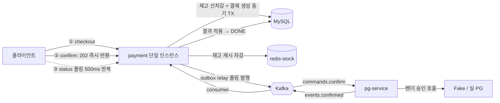
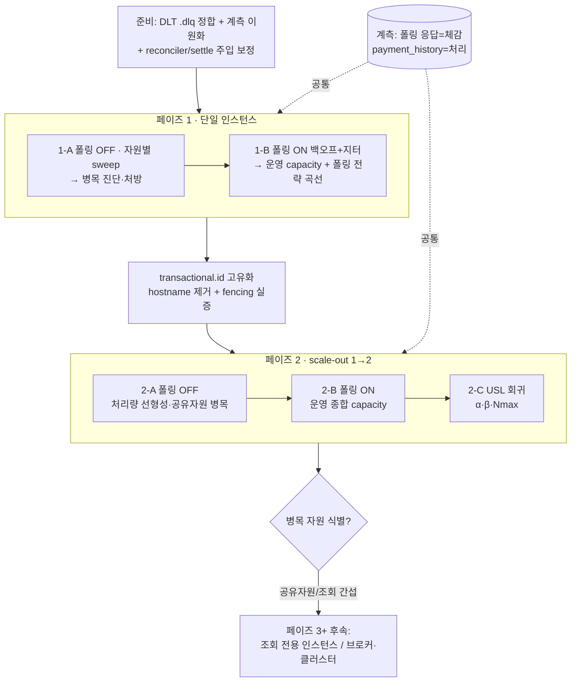

# CAPACITY-AND-SCALEOUT — 결제 처리량 부하 측정 2페이즈 설계

> 최종 수정: 2026-06-17
> 이슈/브랜치: #104
> 근거 측정: `docs/topics/K6-ASYNC-BENCHMARK-REPORT.md` (병목 사이클 1/2 + 후속 과제)
> 외부 지식: `docs/topics/CAPACITY-AND-SCALEOUT-RESEARCH.md` (서칭 정리)

---

## 사전 브리핑

### 현재 이해한 문제

직전 부하 측정에서 단일 payment 인스턴스의 동기 결제 경로는 DB 커넥션 풀 병목을 규명했고, 비동기 파이프라인은 큐 적체 0으로 처리량 병목이 없음을 입증했다. 그러나 부하 시 결제 완료 시간 급증의 원인이 status 폴링 자가 부하인지 단일 인스턴스 자원 한계인지, 단일 인스턴스 측정으로는 가를 수 없었다. 이 미해결 질문을 — 단일 인스턴스 병목을 끝까지 규명한 뒤(페이즈 1) 수평 확장으로 그 천장을 넘는(페이즈 2) — 2단 측정으로 푼다.

### 현재 시스템 동작 (as-is)

### 이번 discuss에서 결정하려는 것

- 페이즈 1 측정 대상 자원 범위 — 6개 후보(MySQL 처리력 / Kafka in-flight / 가상 스레드 throttle / outbox relay 배치 / Redis 커넥션 / pg 워커 풀) 중 우선순위·제외
- 페이즈 2 멀티 인스턴스 실행 환경 — 로컬 2개 / 클라우드 / 페이즈 1만 선행 (**토픽 범위를 가르는 최대 변수**)
- transactional.id 고유화 처방 방식 + producer fencing 실증 방법
- status 폴링 자가 부하를 이 토픽에서 `SKIP_POLL`로 우회만 할지, push 전환까지 포함할지
- 산출물 형식(REPORT 연장) + USL 회귀 분석 도구

### 열린 질문 / 가정

- (가정) 페이즈 1은 현 로컬(7.65GB, 10 CPU)에서 직전과 동일 환경으로 가능
- (해소) 페이즈 2 환경 / 폴링 / transactional.id / USL 도구 / DLT 갭 → 모두 결정됨, `## 인터뷰 결정`(D1~D6) 참조

---

## 요약 브리핑

### 결정된 접근

단일 payment 인스턴스의 자원별 병목을 **폴링 OFF sweep**으로 진단·처방하고(페이즈 1), 같은 부하에 **폴링 ON(백오프+지터)** 운영 프로파일을 얹어 현실 capacity를 잰다. 이어 `hostname` 제거로 transactional.id를 고유화해 **payment 1→2 scale-out** 처리량 선형성을 USL로 분석한다(페이즈 2). e2e 시간은 **폴링 응답 시각(체감)** 과 **append-only `payment_history` 최초 DONE 도달(처리)** 을 이원 계측해 관측자 효과 없이 분리한다. 공유 자원은 설정 튜닝까지, 인프라 갯수 확장은 병목 확인 시 후속.

### 변경 후 동작 (to-be)

### 핵심 결정 (D1~D6)

- **D1** 공유 자원 설정 튜닝까지 / 갯수 확장은 후속
- **D2** 로컬 2 인스턴스
- **D3** hostname 제거(고유화) — 정상 2 인스턴스 한정 가정(rebalance 좀비 fencing 미보장)
- **D4** 폴링 ON/OFF 2종 + 체감(폴링)·처리(`payment_history`) 이원 계측 + 백오프·지터
- **D5** DLT `.dlq` 정합 (첫 태스크)
- **D6** REPORT 형식 연장 + USL 스크립트

### 트레이드오프 / 후속

- 로컬 메모리로 N≤2, 절대 TPS 무의미·상대 비교만 유효
- transactional.id 고유화는 rebalance 좀비 fencing 미보장(알려진 한계, 별 토픽)
- 후속: 조회 전용 인스턴스 분리, Kafka 브로커/Redis 클러스터, push(SSE), 3+ 인스턴스 scale-out

---

## 인터뷰 결정 (누적 — 설계 단계에서 `## 결정 사항` 테이블로 정리)

| # | 항목 | 결정 | 이유 |
|---|---|---|---|
| D1 | 공유 자원(Redis·Kafka·DB) 조절 범위 | 이번 회차는 payment scale-out + 공유 자원 **설정 튜닝**(MySQL `max_connections`·buffer pool, Redis 커넥션 풀)까지. 인프라 **갯수(인스턴스) 확장**(Kafka 브로커 멀티 / Redis 클러스터 / DB 샤딩·레플리카)은 **병목으로 확인되면 페이즈 3+ 후속**으로 예약 | ① 측정 변수 격리 — 한 번에 한 변수만 바꿔야 처리량 변화를 자원에 귀속 가능(동시 확장은 분석 불능). ② scale-out의 통찰은 "어느 공유 자원이 먼저 병목인지 *발견*"이라, 미리 다 늘리면 발견이 사라짐. ③ 큰 인프라/도메인 재설계(특히 DB 샤딩=결제 TX 경계 재설계) 없이 이번 회차 진행 |
| D2 | 페이즈 2 실행 환경 | 로컬 2 인스턴스(heap 추가 축소 + 관측성 미기동, 3개는 포기). payment 1→2 scale-out | 로컬(7.65GB) 메모리 한계. 1→2 효율비·공유 자원 병목 출현 관측엔 충분, "큰 인프라 변경 없이"와 결 일치. 더 큰 N은 환경 확보 후 후속 |
| D3 | transactional.id 고유화 | compose `hostname: payment-service` **라인 제거** → 컨테이너 id 가 자동으로 고유 HOSTNAME. fencing 실증: 정상 2 인스턴스에서 중복 발행 0 확인 + 의도적 동일 id 충돌 시 fence 로그 관찰 | `instance-id`가 이미 `${HOSTNAME:local}` 기반이라 hostname 만 풀면 해결, 코드 변경 0 |
| D4 | 폴링 / 시간 계측 | 폴링 **ON/OFF 2종** 측정. 체감 latency = **폴링 응답 시각(1급 지표)**, 서버 처리 시각 = **append-only `payment_history` 최초 DONE 전이 시각(보조)** — 부하 종료 후 1회 SELECT 로 사후 산출(부하 중 추가 요청 0, 단조 보존). 둘의 차이 = 폴링이 만든 체감 지연. 폴링 ON 전략 = **백오프 + 지터**. push(SSE) 전환은 측정 목적엔 불필요 → 운영 UX 후속 | 폴링은 실제 운영 부하라 ON 케이스로 정식 측정하되, 폴링으로 *시간*을 재면 관측자 효과로 값 오염 → 시계만 DB 로. 체감 시각(사용자 인지 순간)은 1급 유지. `last_status_changed_at` 단조성 함정은 `## 명시 가정` 참조 |
| D5 | DLT suffix 갭 | 이 토픽 **첫 태스크**로 수정(test-first). **정합 방향 = 코드 상수 `EVENTS_CONFIRMED_DLQ`(`.dlq`)로 수렴** — `confirmedDlqKafkaTemplate` 은 이미 `.dlq` defaultTopic 을 박았으나 `DeadLetterPublishingRecoverer` 단일 인자 생성자의 기본 resolver 가 이를 무시하고 `payment.events.confirmed.DLT`(대문자 `.DLT`)로 발행 → `create-topics.sh` 미생성 → 부재 블로킹. 처방 = recoverer 에 `.dlq` 고정 destination resolver 주입(실제 토픽명·시그니처는 plan 에서 확정) | 페이즈 2 e2e 중 예외 누적 시 consumer 블로킹 재발 위험 — 측정 안정화 선결 |
| D6 | 산출물 + USL 도구 | K6-ASYNC-BENCHMARK-REPORT **형식 연장**(사이클 3·4…) + USL 회귀 **간단 피팅 스크립트**(`scripts/`) | 측정 SSOT 일관 + 재현 가능 |

---

## 배경 — 왜 이 두 페이즈를 묶는가

1. **페이즈 1 결과가 페이즈 2의 전제**다. scale-out으로 선형성을 입증하려면, 먼저 *인스턴스 1대가 어느 자원에서 막히는지*를 알고 그 자원을 인스턴스당 설정으로 정직하게 고정해야 한다. 한쪽 자원(예: 풀 크기)이 병목인 채로 scale-out하면 선형이 안 나오고 해석이 흐려진다.
2. **공유 자원 합산 제약**도 페이즈 1에서 미리 계산해야 한다 — 예: 인스턴스당 Hikari 풀 × 인스턴스 수가 MySQL `max_connections`를 넘으면 scale-out이 DB에서 막힌다(RESEARCH §4).
3. 측정 → 분석 → 처방의 한 사이클을 두 번 도는 자연스러운 흐름. K6-ASYNC-BENCHMARK의 직접 연장.

---

## 목표 / 가설

- **H1 (페이즈 1)**: 단일 payment 인스턴스에는 동기 경로(MySQL 처리력)와 비동기 경로(특정 워커/배치/in-flight) 각각에 *식별 가능한 다음 병목 자원*이 존재한다. 폴링 자가 부하를 측정에서 제거하면 비동기 파이프라인의 순수 천장이 드러난다.
- **H2 (페이즈 2)**: payment를 1→2 인스턴스로 늘리면 confirm 처리율이 *선형에 가깝게*(목표 ≥1.6×) 개선된다. 비선형이라면 USL의 contention(α, 공유 DB·Kafka·Redis) 또는 coherency(β, EOS 코디네이터·rebalance)로 그 한계를 정량 설명한다. (합격선은 `## 측정 종료·합격 기준` 참조.)

---

## 측정 종료·합격 기준 (acceptance)

정성 가설(H1/H2)을 관찰 가능한 종료/합격선으로 구체화(직전 REPORT 정량 기록 수준):

- **페이즈 1 (자원별 sweep)**: 각 자원에서 knee rate 가 actuator 포화 지표(예: Hikari active=상한 & pending↑, 큐 lag↑)와 함께 식별되고, 처방 후 재측정에서 동일 rate 의 p95 / pending 이 개선됨을 정량 확인(예: "pending 0 복귀, p95 X% 감소"). 종료 = 자원별 knee ± 샘플링 편차 확정.
- **페이즈 1-B (폴링 전략)**: 폴링 전략별 (체감 latency p95, 서버 폴링 부하 req/s) 쌍이 측정돼 트레이드오프 곡선이 그려지고 권장 간격 1개 도출.
- **페이즈 2 (scale-out)**: 합격 = 2 인스턴스 confirm 처리율 / 1 인스턴스 ≥ 목표비(≥1.6×, 인스턴스 분산 편차 ≤ 10% 전제) **그리고** 정합 교차검증 silent loss 0. 기각 관찰 = 처리율비 ≈ 1 또는 특정 공유 자원(Hikari / Kafka lag / Redis) 포화 → 그 자원을 병목으로 귀속. USL 피팅은 잔차가 측정 노이즈 수준일 때만 Nmax 채택.

---

## 명시 가정 / 알려진 한계

- **풀 합산 입력 확정 (페이즈 2, N=2)**: 인스턴스당 Hikari 풀 = min(단일 최적값, `max_connections`×0.8 / N). 기본값 151 기준 N=2 면 ≈60(=151×0.8/2) → 단일 최적 60 과 동률이라 2 인스턴스도 풀 60 유지 가능. 단일에서 60 초과로 올렸다면 그만큼 인스턴스당 하향 또는 `max_connections` 상향(D1 범위 내) 택일. (RESEARCH §4 의 60×3 산술은 N=3 예시 — 본 회차 N=2 와 구분.) **'단일 최적 60' 출처 = 직전 REPORT 사이클1 튜닝 채택값**(compose baseline 은 `HIKARI_MAX_POOL:-30`) — 페이즈 1 sweep 에서 30→최적값 재확인 후 페이즈 2 입력으로 확정.
- **transactional.id fencing trade-off (D3)**: hostname 제거로 prefix 가 인스턴스별 고유화되면 같은 partition 이라도 인스턴스 간 id 가 달라, rebalance/좀비 상황에서 새 인스턴스가 옛 좀비 producer 를 fence 하지 못한다. 따라서 측정은 **정상 2 인스턴스 정상 가동(rebalance·좀비 미발생) 한정**으로 가정. EOS fencing semantics 변경은 본 토픽 범위 외(알려진 한계 — PG 멱등성이 best-effort 안전망, PITFALLS §18 / L7). fencing 실증 항목에 'rebalance 유발 시 중복 events.confirmed 0건 확인' 포함.
- **DB 시계 단조성 (D4)**: payment_event.`last_status_changed_at` 은 last-write 라 cascade 시 오염 가능 → e2e 처리 시각은 **append-only `payment_history` 의 최초 DONE 전이**(`MIN(change_status_at) WHERE current_status='DONE'`)로 산출(단조 보존). reconciler 완화로 cascade 자체를 차단한 상태에서 측정.

---

## 페이즈 1 — 단일 인스턴스 자원 병목 sweep 확장

**방법**: 기존 `scripts/k6/sweep.sh`(constant-arrival-rate + actuator 샘플링) 재사용. 자원별로 한 변수만 바꿔가며 sweep → knee 이동 관찰 → 처방 → 재측정. 사이클1과 동일 패턴.

**측정 대상 자원 (각각 sweep)**:

| # | 자원 | 현재값 | 가설 / 관찰 메트릭 | 조정 레버 |
|---|---|---|---|---|
| 1 | MySQL 처리력 (동기) | 풀 60에서 knee ~300 | 풀 추가 상향은 효과 체감 — DB 자체 처리력이 다음 병목. confirm TX active 점유시간 ↑ | MySQL `innodb` 튜닝 / 인덱스 / 풀 80·100 비교 |
| 2 | Kafka producer in-flight | 명시 설정 없음 — `idempotence`(EOS)로 기본 ≤5 자동 제한 | outbox relay → pg commands 발행 처리량 천장 | producer config |
| 3 | 가상 스레드 throttle 부재 | 명시 throttle 0건 (TC-6) | 고부하 시 VT 무제한 spawn → 메모리·carrier pinning 위험. JFR로 pinning 관측 | Semaphore / Bulkhead (RESEARCH §5) |
| 4 | outbox relay batch-size | scheduler batch-size 50 | 비동기 발행 처리량 — 폴링 주기·배치 크기 sweep | scheduler yml 키 |
| 5 | Lettuce 단일 커넥션 (Redis) | single connection | 재고 차감/보상 DECR 직렬화 지점 가능성 | 커넥션 풀 검토 |
| 6 | pg 워커 VT 풀 / 채널 cap | 워커 5 / cap 1024 (TC-15) | 벤더 호출 동시성 천장 + overflow→폴백 빈도 | `pg.inbox.channel.*` yml |

**비동기 순수 천장 측정의 핵심**: 사이클2에서 비동기 큐가 전부 0이었던 건 폴링 자가 부하(http_reqs 664/s 중 ~460이 폴링)에 가려진 것일 수 있다. `SKIP_POLL=true`로 폴링을 제거하고 confirm만 더 높은 rate로 밀어, 순수 파이프라인(relay → pg → vendor → consumer)이 *어느 rate에서 어느 큐부터 적체되는지*를 본다.

**산출물**: K6-ASYNC-BENCHMARK-REPORT의 "사이클 3/4..." 형식으로 자원별 knee·처방·개선을 정량 기록. 인스턴스당 권장 설정값 1세트 확정(페이즈 2 입력).

---

## 페이즈 2 — payment scale-out 처리량 측정

**선행 (게이트)**:
- **EOS transactional.id 고유화** (TC-13-FOLLOW-1: compose `hostname: payment-service` 고정값이 멀티 컨테이너에서 transactional.id 충돌 → producer fencing 오동작 위험). 처방 후보: hostname 라인 제거(컨테이너 id 자동) 또는 `INSTANCE_ID` env → `transactional.id=${app}-${INSTANCE_ID}`. **RESEARCH §3** 참고 — KIP-447 이후에도 인스턴스별 고유·안정 transactional.id는 여전히 필수.
- **로드밸런싱 복귀**: payment 직접 포트(8080) 대신 gateway 경유로 인스턴스 분산.
- **공유 자원 합산 재계산**: 인스턴스당 Hikari 풀 × N ≤ MySQL `max_connections` × 0.8 (RESEARCH §4). `max_connections`는 현재 **명시 설정 없는 MySQL 기본값 151** — scale-out 시 이 값을 상향할지, 아니면 인스턴스당 풀을 N으로 나눠 재배분할지 결정.

**측정 관점**:
- 인스턴스 1→2→3에서 confirm 처리율·e2e 완료가 선형 개선되는가.
- Kafka 파티션(현재 3)이 consumer 병렬을 받쳐주는가 — 인스턴스 > 파티션이면 idle consumer 발생.
- 처방 후 USL 회귀(RESEARCH §1): 6+ 데이터 포인트로 α(contention)·β(coherency) 추정 → 선형 한계 Nmax = √((1−α)/β) 예측.

---

## 환경 전략 (로컬 한계)

- **페이즈 1**: 단일 인스턴스 → 현 로컬(7.65GB, 10 CPU)에서 진행 가능. K6-ASYNC-BENCHMARK와 동일 환경.
- **페이즈 2**: 인스턴스당 ~0.9GB heap → 로컬 7.65GB는 2개도 빠듯·3개 OOM. **결정(D2)**:
  - **채택**: (b) heap 추가 축소 + 관측성 미기동으로 로컬 2 인스턴스(3은 포기)
  - 기각: (a) 큰 머신/클라우드 — "큰 변경 없이"와 어긋남 + 환경 셋업 부담 / (c) 페이즈 1만 — scale-out 입증이 본 토픽 핵심이라 페이즈 2 포함 유지

---

## 자산 재사용

- `scripts/k6/sweep.sh` — 자원별 sweep (그대로)
- `scripts/k6/async-payment.js` — `SKIP_POLL` 토글로 동기/e2e 전환 (그대로)
- `docker-compose.benchmark.yml` — heap·풀·reconciler env override (페이즈 1 그대로, 페이즈 2는 scale 대응 + transactional.id 고유화 추가 필요)
- `scripts/k6/run-benchmark.sh` / `verify-settlement.sh` — 오케스트레이션 + 정합 교차검증 (그대로)
- `scripts/bench-seed-stock.sh` — clean 후 재시드 (그대로)

---

## 영향 범위

**코드 / 설정 변경**:
- payment compose `hostname` 라인 제거 (D3, transactional.id 고유화)
- DLT 토픽 이름 정합 `.dlq` ↔ `-dlt` (D5) — `create-topics.sh` + `DeadLetterPublishingRecoverer` 목적지
- 계측: `verify-settlement.sh` DB 처리 시각 사후 산출 확장, `scripts/k6/async-payment.js` confirm·폴링 응답 시각 기록 + 백오프·지터 폴링
- USL 피팅 스크립트 신규 (`scripts/`)
- `docker-compose.benchmark.yml` 튜닝 override(heap·Hikari 풀·`max_connections`·Redis 커넥션) + 2 인스턴스 scale 대응 + gateway 복귀

**무관 (안 건드림)**: 결제 도메인 로직·상태 전이·EOS consumer 코어. 본 토픽은 측정/설정/스크립트 위주, 도메인 엔티티 변경 없음.

---

## 제외 범위 (non-goals)

- **인프라 갯수 확장**(Kafka 브로커 멀티 / Redis 클러스터 / DB 샤딩·레플리카) — 병목 확인 시 페이즈 3+ (D1)
- **push(SSE/WebSocket) 전환** — 측정은 DB 계측으로 충분, push 는 운영 UX 개선 후속 (D4)
- **3+ 인스턴스 scale-out** — 로컬 메모리 한계, 환경 확보 후 (D2)
- **조회 전용 인스턴스 분리** — 측정이 그 필요를 가리키면 페이즈 3+ 처방
- **절대 TPS SLO 확정** — 로컬 단일 환경이라 상대 비교만 유효, 운영 환경 재측정은 별도

---

## 오픈 퀘스천 해소

사전 준비 시점의 오픈 퀘스천 5개(페이즈 2 환경 / transactional.id 처방 / 폴링 / USL 도구 / DLT 갭)는 모두 결정됨 → 위 `## 인터뷰 결정`(D1~D6) 참조.

---

## 측정 위생 / 신경쓸 함정 (discuss 추가)

직전 K6 측정에서 데인 오염원 + 이번에 새로 챙길 것:

- **변수 격리 — 튜닝 ↔ scale-out 분리 측정** *(가장 중요)*: 페이즈 2-0에서 공유 자원 설정 튜닝 적용과 인스턴스 1→2를 *동시에* 바꾸면 USL 해석이 오염된다. 순서를 (i) 1 인스턴스 + 튜닝 설정으로 baseline 재측정(튜닝 효과 격리) → (ii) 2 인스턴스(scale-out 효과 격리)로 나눠, 두 효과를 각각 귀속한다.
- **측정 결정론화**: reconciler in-flight-timeout·스케줄러 주기가 부하 중 재confirm cascade 를 유발할 수 있음(직전에 실제 발생, REPORT 사이클2 발견 2-1). 측정 중 reconciler 완화(`RECONCILER_IN_FLIGHT_TIMEOUT_SECONDS` 600s)가 표준 절차이나, **현재 변수 토폴로지가 이를 자동 보장하지 않아 두 보정을 준비 태스크로 못박는다**:
  - **(T) reconciler 600s 실제 주입 경로**: `RECONCILER_IN_FLIGHT_TIMEOUT_SECONDS`는 `${RECONCILER_TIMEOUT:-30}` 바인딩인데, `run-benchmark.sh`는 `RECONCILER_TIMEOUT`을 **pg-service force-recreate 에만** 주입하고 payment-service 는 수동 기동분을 재기동하지 않는다 → export 누락 시 reconciler 가 30s 로 돌아 cascade 재발. **payment-service 기동 시점에 `RECONCILER_TIMEOUT=600` 주입(run-benchmark 가 payment-service 에도 동일 주입 또는 사전 기동 표준화)**.
  - **(T) settle 대기 자동 추종**: `verify-settlement.sh` 의 `SETTLE_WAIT_SECONDS` 는 고정 상수 60 이라 reconciler 600s 에 자동 추종 안 됨 → 정상 IN_PROGRESS 를 silent loss 오판. **미지정 시 `RECONCILER_TIMEOUT + RECONCILER_SCAN_MS/1000 + 여유`로 자동 산출(60 상수 제거)**, 또는 미종결 판정을 `payment_history` 최초 DONE 도달 기준으로 보정.
- **워밍업**: JVM JIT·Hikari·가상 스레드 초기 ramp 구간을 버리고 steady-state 만 집계. 각 단계 앞 워밍업 여유.
- **재고 · orderId 위생**: 고rate·장시간 sweep 시 redis-stock 재고 소진 → confirm 400(재고부족) 오염. 충분한 seed + 측정 사이 재시드(`bench-seed-stock.sh`). k6 는 유니크 orderId 생성(checkout 중복 200 방지). 재시드는 **재고 카운터만 리셋, dedup token(`decrement:done`/`compensation:done`, P8D)은 보존 — `FLUSHALL` 금지**(이중차감 방지).
- **scale-out 재고 정합 게이트(페이즈 2)**: 측정 종료 후 **redis 잔여재고 vs product RDB 차감 합 교차검증**(verify-settlement 확장)으로 2 인스턴스 공유 Redis 차감 발산(L7 cascade 노출 윈도우 확대) 탐지.
- **부하 분산 검증(페이즈 2)**: gateway 가 2 인스턴스에 실제로 고르게 분산하는지 actuator 로 확인 — 한쪽 쏠리면 scale-out 측정 무의미. Kafka 파티션 3 vs consumer 2 의 배분(2:1) 비대칭도 처리량 해석 시 고려.

---

## 관련

- 측정 SSOT: `docs/topics/K6-ASYNC-BENCHMARK-REPORT.md`
- 외부 지식: `docs/topics/CAPACITY-AND-SCALEOUT-RESEARCH.md`
- 후속 항목 출처: `docs/context/TODOS.md` (TC-13-FOLLOW-1, TC-6, TC-7, TC-15, T4-B/T4-C/T4-D)
