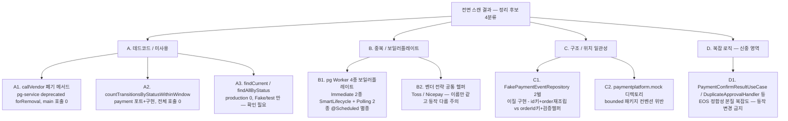
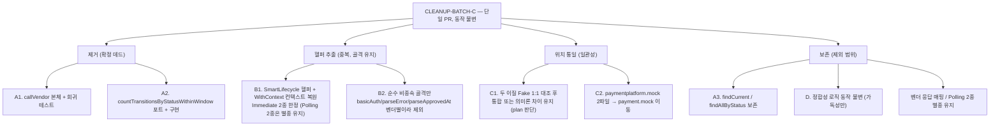

# CLEANUP-BATCH-C — 코드 레벨 정리 (데드코드 / 중복 / 일관성) 설계

> 최종 수정: 2026-06-13

---

## 사전 브리핑

### 현재 이해한 문제

코드베이스 위생 자체는 양호하다 — TODO/FIXME 0건, 빈 catch 0건, 주석처리 코드 0건, 거대 클래스 없음(최대 337줄). 따라서 이번 정리는 "쓰레기 청소"가 아니라 **참조가 끊긴 미사용 코드 제거 + 반복 보일러플레이트 통합 + 위치/네이밍 일관성 교정**이다. 결제 정합성 로직의 본질적 복잡도는 건드리지 않고, 동작 불변(behavior-preserving) 리팩토링만 한다.

### 현재 코드베이스 정리 후보 맵 (as-is)

### 발굴된 후보 상세

| ID | 후보 | 근거 (스캔 결과) | 판정 |
|---|---|---|---|
| A1 | `PgVendorCallService.callVendor` 본체 + 회귀 테스트 | `@Deprecated(forRemoval=true)`, main 호출 0건 (test 회귀만) | 확정 데드 |
| A2 | `PaymentHistoryRepository.countTransitionsByStatusWithinWindow` 포트+구현 | 전체 참조 2건 (정의+구현만), 호출 0건 | 확정 데드 |
| A3 | `StockCachePort.findCurrent`, `PaymentEventRepository.findAllByStatus` | production 호출 0건, Fake/구현에만 존재 | 의심 — 사용자 확인 |
| B1 | pg Worker 생명주기 보일러플레이트 | 워커 **4종**(Immediate 2 + Polling 2). SmartLifecycle `start/stop/stop(cb)/isRunning/getPhase/shutdown*/workerLoop` 거의 100% 동일한 건 **Immediate 2종**뿐. Polling 2종(`PgInboxPollingWorker`/`PgOutboxPollingWorker`)은 `@Scheduled` 별종. traceparent 복원도 메커니즘 상이 — Immediate=in-memory job 동봉(`job.snapshot()`/`otelContext()`), Polling=DB W3C 문자열(`TraceparentExtractor`) | 통합 후보 (Immediate 2종 한정) |
| B2 | 벤더 전략 Toss/Nicepay 공통 헬퍼 | 동일 이름 메서드 다수이나 동작 상이 — `generateBasicAuthHeaderValue`(Toss `secretKey:` vs NicePay `clientKey:secretKey`), `parseErrorResponse`·`parseApprovedAt`(벤더별 응답 record/포매터 결합) | 순수 비종속 골격만 추출, basicAuth/parseError/parseApprovedAt 제외 |
| C1 | `FakePaymentEventRepository` 2벌 (이질) | `paymentplatform.mock`(Long id 키 + ReflectionTestUtils auto-id + PaymentOrder 재조립)와 `paymentplatform.payment.mock`(String orderId 키 + `saveOrUpdateCallCount` 검증 헬퍼, order 관리 없음)이 **다른 구현**. 9개 테스트가 분산 의존(PaymentConfirmResultUseCase* 4종 포함) | plan 1:1 대조 후 통합 가능성 판단 |
| C2 | `paymentplatform.mock` 패키지 | 다른 서비스는 `<bounded>.mock` 규칙인데 payment 만 bounded 밖 디렉토리 공존 (`FakePaymentEventRepository` + `FakeIdempotencyStore`). `payment.mock` 엔 `FakeStockCachePortAtomicTest`(테스트)가 mock 에 섞임 | 위치 교정 |
| D1 | 정합성 핵심 use case/handler | 복잡도가 본질적 — EOS atomicity, 보상, 멱등 가드 | 동작 변경 금지, 가독성 한정 |

### 이번 discuss에서 결정하려는 것

- **포함 범위**: A1/A2(확정 데드) + B1(Worker 통합) + C1/C2(Fake·패키지 일관성)를 이번 배치에 넣을지
- **A3 처리**: `findCurrent`/`findAllByStatus`를 (a) 제거 (b) 운영 디버깅용 의도로 보존 중 택1
- **B1 추상화 수위**: Worker 3종을 공통 base/generic으로 묶을지, 아니면 보일러플레이트를 헬퍼로만 뽑을지 (동시성 코드 가독성 trade-off)
- **B2 벤더 전략**: 공통 헬퍼 추출을 할지(벤더 독립성 vs DRY), 아니면 이번 범위에서 제외할지
- **D 복잡 로직**: 동작 변경 금지 원칙 확정 — 정합성 로직은 가독성(주석/메서드명/추출) 개선만 허용
- **산출물 단위**: 단일 PR인지, 위험도별 분리인지

### 열린 질문 / 가정

- (가정) 모든 정리는 **동작 불변 + `./gradlew test` 무회귀**가 절대 기준. 동작이 바뀌면 그건 이 토픽 범위 밖.
- (가정) 시리즈 일관성을 위해 TOPIC은 `CLEANUP-BATCH-C` (앞선 CLEANUP-BATCH-A 영역분리 / B 게이트위생 계보).
- (질문) A3·B2의 처리 방향, B1 추상화 수위는 사용자 판단 필요.
- (질문) plan 단계에서 전수 데드코드 스캔(in 포트·도메인·use case public 메서드 전반)을 더 돌릴지 — 사전 스캔은 대표 후보 위주였다.

---

## 요약 브리핑

### 결정된 접근

전면 스캔으로 발굴한 후보를 **동작 불변(behavior-preserving) 단일 PR**로 정리한다. 확정 데드코드(A1·A2)는 제거, 반복 보일러플레이트(B1은 Immediate 워커 2종, B2는 순수 비종속 골격)는 골격을 유지한 채 진짜 동일한 부분만 헬퍼로 추출, 테스트 헬퍼 위치 불일치(C2)는 bounded-context 규칙으로 통일하되 두 이질 Fake 통합(C1)은 plan에서 1:1 대조 후 판단한다. 미사용 포트 메서드(A3)와 결제 정합성 로직(D)은 손대지 않는다. plan 단계에서 전수 데드 스캔을 한 번 더 돌려 누락 후보를 보강하고, 동작 불변 검증은 추출 대상이 닿는 동작을 커버하는 기존 테스트를 식별하거나(미커버 시) characterization test를 추출 전에 추가한다.

### 변경 후 처리 방향 (to-be)

### 핵심 결정 목록

- 동작 불변이 절대 기준 — 추출 대상이 닿는 동작(phase/stop 순서, fallback 파싱)을 커버하는 테스트가 없으면 추출 전 characterization test를 먼저 추가한다.
- A1·A2 제거 후 grep 0건 확인. A3는 보존.
- B1은 Immediate 워커 2종 한정으로 SmartLifecycle 보일러플레이트 + WithContext 컨텍스트 복원만 추출(워커 골격·phase·stop 순서 불변). Polling 2종은 별종 유지.
- B2는 진짜 벤더 비종속 골격만 공통화 — basicAuth 시크릿 조합·parseError record 타입·parseApprovedAt 포매터는 벤더별이라 제외.
- C2는 `<bounded>.mock` 규칙으로 위치 통일. C1 두 이질 Fake 통합은 plan에서 1:1 대조 후 판단(본질적 차이 크면 통합 강행 않고 의미론 유지).

### 트레이드오프 / 후속 작업

- B1 헬퍼 추출은 중복을 완전히 없애지 않는다(골격 유지 선택). 동시성 코드 가독성을 DRY보다 우선한 결정.
- B2도 부분 추출이라 벤더 전략 간 잔여 유사 코드가 남는다. 벤더 독립성 우선.
- A3 보존분은 장기 미사용 시 후속 토픽에서 재검토 여지.

---

## 문제 정의

코드베이스 위생은 양호하나 (1) 참조가 끊긴 미사용 코드(`@Deprecated(forRemoval)` 메서드, 호출 0 포트 메서드), (2) 반복되는 워커 생명주기·벤더 헬퍼 보일러플레이트, (3) 테스트 헬퍼의 패키지 위치 불일치가 누적돼 있다. 결제 정합성을 건드리지 않는 선에서 동작 불변 리팩토링으로 정리한다.

## 영향 범위

| 구분 | 대상 |
|---|---|
| **변경** | `PgVendorCallService`(+그 테스트 2종), `PaymentHistoryRepository`(포트)·`PaymentHistoryRepositoryImpl`, `PgInboxImmediateWorker`·`PgOutboxImmediateWorker`(SmartLifecycle 헬퍼 추출 대상 2종), `TossPaymentGatewayStrategy`·`NicepayPaymentGatewayStrategy`, C1 Fake에 의존하는 테스트 **9개**(`PaymentLoadUseCaseTest` + `PaymentConfirmResultUseCase*` 등 8개) |
| **신규** | Immediate 워커 2종 생명주기/WithContext 헬퍼(또는 base), 벤더 비종속 골격 유틸 |
| **이동/삭제** | `paymentplatform/mock`의 `FakePaymentEventRepository`·`FakeIdempotencyStore` → `payment.mock`, C1 통합 시 Fake 1벌 정리, `FakeStockCachePortAtomicTest` 위치 정리 |
| **별종 유지 (헬퍼 비대상)** | `PgInboxPollingWorker`·`PgOutboxPollingWorker`(`@Scheduled`, DB-기반 traceparent 복원) |
| **무관 (동작 변경 금지)** | `PaymentConfirmResultUseCase`·`DuplicateApprovalHandler` 등 정합성 로직, `StockCachePort.findCurrent`·`PaymentEventRepository.findAllByStatus` |

## 결정 사항

| 항목 | 결정 | 이유 | 기각 대안 |
|---|---|---|---|
| 포함 범위 | A1·A2 데드 제거 + B1 헬퍼 추출 + B2 비종속 골격 + C1·C2 일관성 | 전면 스캔 + 사용자 확정 | 위험도별 분리 PR — 단일 배치로 충분, 리뷰 1회 |
| A3 미사용 포트 메서드 | 보존 | 향후 조회/디버깅 대비, 호출 0이라 위험 없음 | 제거 — 사용자가 보존 선택(필요 시 후속 토픽) |
| B1 추상화 수위 | 보일러플레이트 헬퍼/base만, 워커 골격 유지 | 동시성 코드 가독성을 DRY보다 우선 | 공통 base/generic 워커 통합 — 추상화로 디버깅 난이도 상승 우려 |
| B1 대상 정밀화 | SmartLifecycle + WithContext 헬퍼는 **Immediate 2종 한정** | Polling 2종은 `@Scheduled` 별종 + DB-기반 traceparent 복원으로 메커니즘 상이 | Polling 포함 4종 공통화 — in-memory vs DB 복원 혼동, trace 연속성 회귀 위험 |
| B2 추상화 수위 | 진짜 비종속 골격만 추출, basicAuth 시크릿 조합·에러 record·parseApprovedAt 포매터는 벤더별 유지 | 벤더 독립성(Strategy 의도) + 인증/에러분류 오염 방지 | parseApprovedAt/parseError 공통화 — 벤더별 타입/포맷 결합으로 통합 불가 |
| C1 두 이질 Fake | plan에서 1:1 대조 후 통합 가능성 판단, 본질적 차이 크면 의미론 유지 | 게이트 결과 두 Fake가 별개 구현(키 타입·order 재조립·검증 헬퍼 상이) | 즉시 1벌 통합 — 정합성 가드 테스트(PaymentConfirmResultUseCase* 4종) 약화 위험 |
| D 복잡 로직 | 동작 불변, 가독성(주석/메서드 추출)만 | 정합성 회귀 위험 | 로직 단순화 — EOS atomicity·보상·멱등 가드는 본질 복잡도 |
| 산출물 단위 | 단일 PR | 사용자 확정 | 위험도별 분리 — 배치 규모가 1 PR로 관리 가능 |

## 회귀 위험과 대응

| 위험 | 대응 |
|---|---|
| R1. B1 헬퍼 추출이 SmartLifecycle phase/stop 순서를 미세 변경 → graceful shutdown 회귀 | phase/stop 순서를 직접 검증하는 기존 테스트를 plan에서 식별, 없으면 추출 전 characterization test 추가. Immediate 2종 한정으로 범위 축소 |
| R2. B2 헬퍼가 벤더별 차이(인증 시크릿 조합·에러 분류·파싱 포맷)를 뭉갬 → 인증 전건 실패/retryable 오분류 | basicAuth/parseError/parseApprovedAt 추출 제외, 진짜 비종속 골격(base64 인코딩 등)만. fallback 파싱 경로는 characterization test로 가드 |
| R3. C1 두 이질 Fake 통합이 정합성 가드 테스트의 RED 탐지력을 약화 | **의존 분포**: 정합성 가드 8개(`PaymentConfirmResultUseCase*` 7종 + `ConfirmedEventConsumerTest`)는 `payment.mock`(orderId 키) 변종, `PaymentLoadUseCaseTest` 1개만 `mock`(id 키 + `findById` order 재조립 + auto-id) 변종에 의존 → 어느 방향 통합이든 한쪽 의미론 누락. plan에서 양 변종 의미론(키 조회 + order 재조립 + `saveOrUpdateCallCount`) 모두 보존, 보존 불가 시 통합 포기. 통합 전/후 동일 단언(실패 케이스 RED) 유지를 AC에 명시 |
| R4. A1 `callVendor` 제거가 `PgVendorCallServiceVendorTypeTest`(vendorType 선택 검증)를 깨뜨림 | 해당 검증을 `invokeVendor` 기반으로 이전하거나 동등 보존 (게이트 확인: invokeVendor+applyOutcome가 5분기 동등 커버) |
| R5. B1 traceparent 헬퍼 잘못 통합 시 Polling 좀비 회수 부모 trace 단절 (PITFALL 12 재발) | Immediate(in-memory job 동봉)와 Polling(DB W3C 문자열) 메커니즘 분리 유지, Polling은 헬퍼 비대상 |

## 검증 전략

- 각 정리 후 `./gradlew test` 무회귀 (전 모듈 단위 + Testcontainers 통합).
- 데드 제거 후 `callVendor` / `countTransitionsByStatusWithinWindow` grep 0건 확인.
- **동작 불변 검증 (핵심)**: "기존 테스트 GREEN 유지"만으로는 미커버 동작(B1 phase/stop 순서, B2 fallback 파싱 같은 예외 경로)이 빠져나간다. plan에서 추출 대상이 닿는 동작을 커버하는 기존 테스트를 식별하고, **미커버 동작은 추출 전 characterization test를 먼저 추가**한 뒤 리팩토링한다.
- C1 통합 시 의존 테스트 9개 전수 개별 GREEN 확인 — 특히 정합성 가드 8개(`PaymentConfirmResultUseCase*` 7종 + `ConfirmedEventConsumerTest`)는 통합 전/후 동일 단언 유지(실패 케이스에서 여전히 RED)인지 검증.
- 최종 `./gradlew build`로 정적 분석(checkstyle/spotbugs/JaCoCo 게이트) 통과.

## 제외 범위

- A3 `findCurrent`/`findAllByStatus` 제거 — 보존 결정.
- D 정합성 로직 동작 변경 — 가독성 외 금지.
- 벤더 응답 매핑/에러 분류/`parseApprovedAt`/`parseError`/`basicAuth` 시크릿 조합 통합 (B2 벤더 결합 회피).
- Polling 워커 2종(`PgInboxPollingWorker`/`PgOutboxPollingWorker`)을 SmartLifecycle로 강제 통일 — `@Scheduled` 별종 + DB-기반 traceparent 복원 유지.
- 측정/인프라 의존 정리(Phase 5 TODOS 항목).

## 참고

- `docs/context/TODOS.md` — CLEANUP-BATCH-A(영역 분리)/B(게이트 위생) 계보
- `docs/context/STRUCTURE.md` — `<bounded>.mock` 패키지 컨벤션
- `docs/context/INTEGRATIONS.md` — 벤더 Strategy 패턴(독립성 근거)
- `docs/context/CONVENTIONS.md` — 코드 스타일/안티패턴

---

## discuss 게이트 처리

### 1라운드 (reviewer + domain-expert, 둘 다 revise)

| # | finding | 심각도 | 반영 |
|---|---|---|---|
| 1 | C1 두 Fake가 "동일 클래스"가 아니라 이질 구현 — import 교체 단순 통합 전제 붕괴, 정합성 가드 테스트 약화 위험 | critical / major | 결정 사항 C1 행 신설("plan 1:1 대조 후 판단"), 후보 표·to-be·영향 범위(9개 테스트)·R3 전면 재작성 |
| 2 | "동작 불변"을 기존 테스트 GREEN에만 의존 — 미커버 동작(phase/stop, fallback 파싱) 누출 | major | 검증 전략에 characterization test 선행 추가 명시, R1·R2 보강 |
| 3 | B1 워커 집합 오류 — Polling도 2종(Outbox 누락), traceparent 메커니즘 상이(in-memory vs DB) | minor | 워커 4종 정정, SmartLifecycle/WithContext 헬퍼는 Immediate 2종 한정, R5 신설, 별종 유지 행 추가 |
| 4 | B2 `basicAuth`/`parseError`/`parseApprovedAt`는 이름만 같고 벤더별 상이 — 추출 시 인증/분류 오염 | minor | 후보 표·to-be·결정·제외 범위에서 추출 제외 명시 |
| 5 | 결정마다 기각 대안 미기록 | minor | 결정 사항 테이블에 "기각 대안" 컬럼 추가 |

A1(`callVendor`)·A2(`countTransitions`) 데드 제거는 양 게이트가 소스 교차검증으로 안전 확인(invokeVendor+applyOutcome 5분기 동등 커버, confirm/멱등/retry/금액 분류 영향 없음).

### 2라운드 (reviewer + domain-expert, 둘 다 pass)

- reviewer: pass (yes 9 / no 0 / n-a 6). 1라운드 실패 2항목(근거+기각 대안, 관찰 가능 성공 조건) 해소 확인, 신규 결함 없음.
- domain-expert: pass. 결제 정합성 사고 경로(상태 전이/멱등/race/PG 실패/금전/PII) 신규 위험 미도입 확인.
- 잔여 minor(공통): R3·검증전략의 "4종" 표기 → 정합성 가드 8개로 정정 + 의존 분포(가드 8개는 `payment.mock`, `PaymentLoadUseCaseTest` 1개만 `mock`) 명시. 반영 완료.
