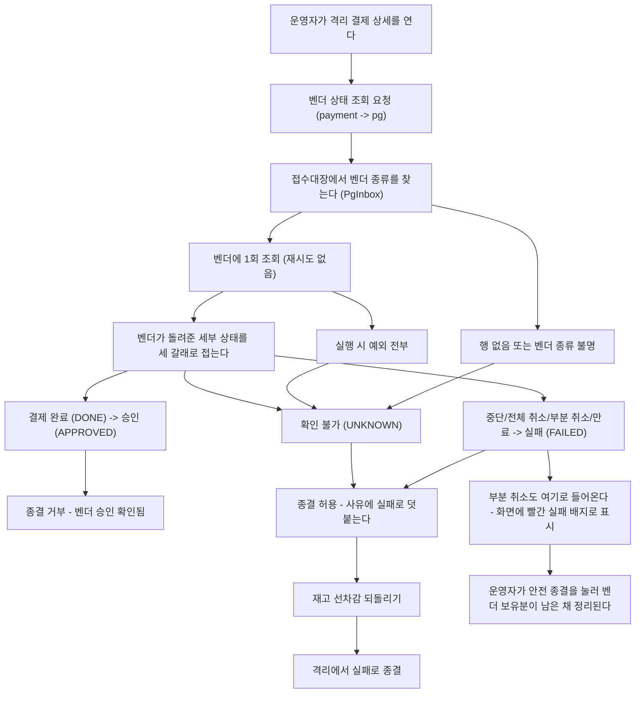
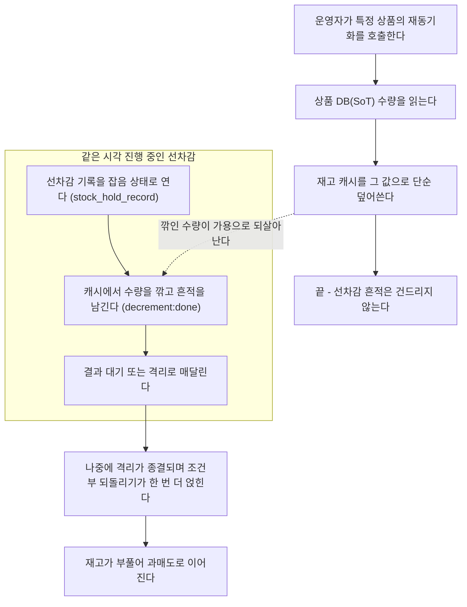
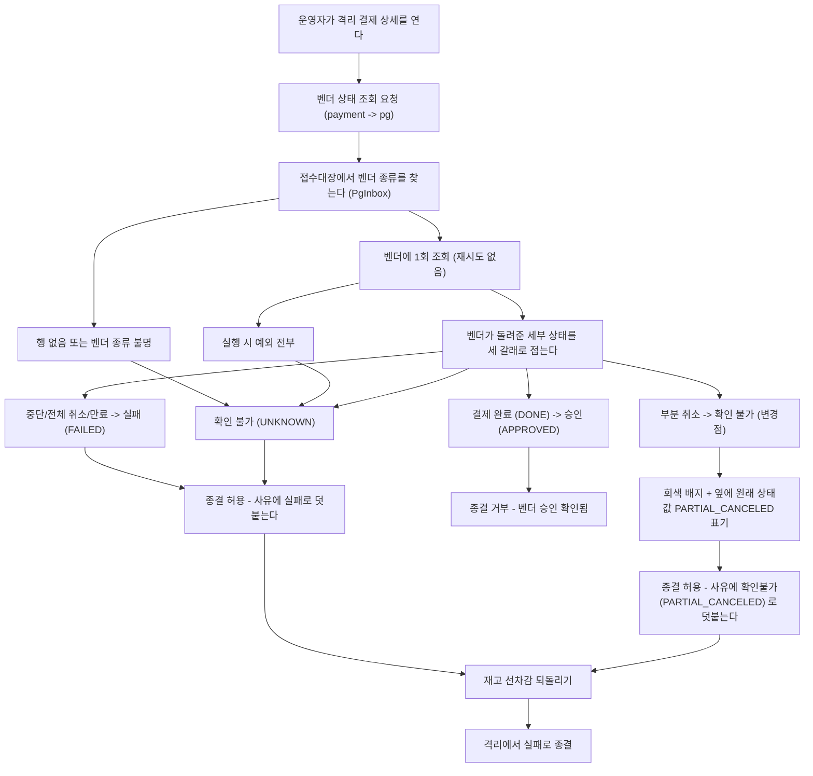
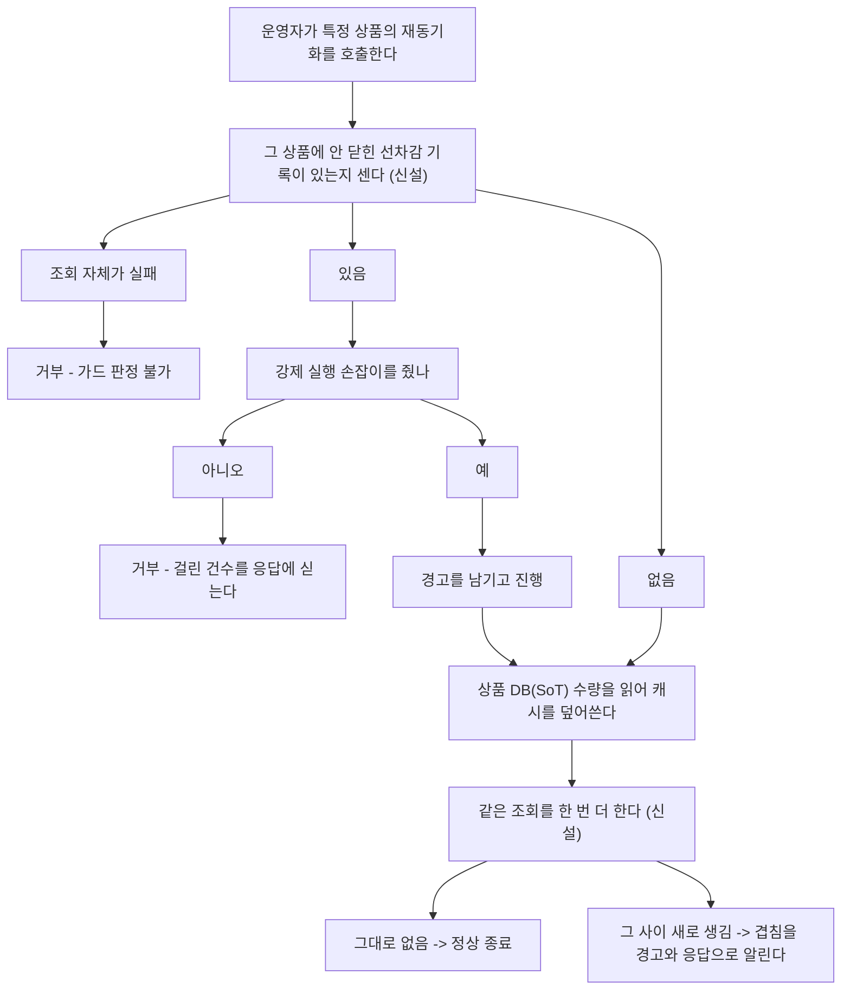

# CLEANUP-BATCH-F 설계

> 최종 수정: 2026-09-10

## 사전 브리핑

### 현재 이해한 문제

`docs/context/TODOS.md` 의 현재 과업 중 각각은 작지만 서로 무관한 후속 6건을 한 묶음으로 처리한다 (cleanup-batch-a~e 선례). 둘은 돈·재고 경로에 닿고(관리자 격리 종결의 부분 취소 분류 / 재고 재동기화의 진행 중 선차감 가드), 둘은 회귀 가드의 구멍이며(멱등키 해시 고정값 부재 / 테스트용 Fake 저장소의 조회 별칭), 둘은 측정·검증 도구의 공백이다(벤치 결과의 측정 손잡이 누락 / 가드레일 훅 자체 검증 부재).

| 항목 | 성격 | 도메인 접촉 |
|:---:|:---:|:---:|
| 관리자 벤더 조회의 부분 취소 분류 | 판정 + 종결 가드 | 있음 |
| 재고 재동기화 진행 중 선차감 가드 | 운영 도구 가드 | 있음 |
| 멱등키 해시 고정 기대값 | 회귀 가드 | 값 산출 규칙 |
| Fake 결제 저장소 조회 방어적 복사 | 테스트 인프라 | 없음 |
| 벤치 결과에 파티션/컨슈머 동시성 기록 | 측정 도구 | 없음 |
| 가드레일 훅 자체 검증 | 개발 도구 | 없음 |

### 현재 시스템 동작 (as-is)

#### 관리자 격리 종결 — 부분 취소가 실패로 접힌다

자동 경로(확정 관문)는 PG-VENDOR-SIGNAL-CONSOLIDATION 에서 부분 취소를 확정 실패에서 빼 전용 사유로 격리시켰다. 관리자 조회 경로만 옛 분류로 남았다.

#### 재고 재동기화 — 진행 중 선차감을 덮어쓴다

부분 취소 격리가 즉시 보상을 건너뛰면서 선차감이 떠 있는 창이 초 단위에서 관리자가 종결할 때까지(며칠)로 늘었다. 겹칠 확률이 그만큼 올라갔다.

#### 나머지 넷 — 흐름이 아니라 빈자리

- **멱등키 해시**: 네 테스트가 전부 "같은 입력이면 같은 값 / 순서 무관 / 다른 입력이면 다른 값" 상대 비교다. 산출식에 필드가 하나 섞여도 전부 통과한다. 배포 중 신·구 인스턴스가 같은 요청에 다른 키를 내면 한 결제가 두 주문으로 갈라진다.
- **테스트용 Fake 결제 저장소**: `save` 는 방어적 복사를 하는데 `find*` 는 저장소가 들고 있는 객체를 그대로 돌려준다. 조건부 갱신은 인자를 도메인 전이로 먼저 바꾼 뒤 호출되므로, 조회 결과를 그대로 넘기면 선행조건 검사가 이미 바뀐 값을 보고 정상 케이스를 충돌로 오판한다. 실제 리컨실러와 실제 위임 메서드를 이 Fake 와 조립하는 첫 테스트가 조용히 항상 실패한다.
- **벤치 결과 파일**: `conditions` 블록에 payment 쪽 컨슈머 동시성만 남는다. 처리량 상한을 정한 인자인 파티션 수와 pg 컨슈머 동시성은 스크립트가 참조조차 하지 않아, 사이클 간 비교를 결과 파일만으로 재현할 수 없다.
- **가드레일 훅**: 다른 모든 변경을 검증하는 자리에 있으면서 자신은 어떤 자동 검사도 받지 않는다. 도구 부재나 경로 이상에서 조용히 통과하도록 짜여 있어, 무력화돼도 드러나지 않는다.

### 이번 discuss에서 결정하려는 것

1. **부분 취소를 어떤 판정으로 접을지** — 판정값을 넷으로 늘릴지, 기존 확인 불가로 접을지. 그리고 격리 종결을 거부할지 경고만 남길지.
2. **두 서비스가 각자 들고 있는 판정 목록의 배포 순서** — pg 가 먼저 새 값을 내보낼 때 payment 구버전이 어떻게 접히는지, 그 동작을 계약 테스트로 고정할지.
3. **재고 재동기화 가드의 강도** — 미종결 선차감이 있으면 무조건 막을지, 운영자가 넘길 수 있는 손잡이를 둘지. 판정 기준을 잡음 상태 행 존재로 할지 나이까지 볼지.
4. **훅 자체 검증의 도입 형태와 사정거리** — 별도 셸 스크립트 + CI job 인지 Gradle 태스크인지. 실제 테스트를 돌리는 비싼 구간을 어떻게 대체해 검증 가능하게 만들지.
5. **벤치 파티션 값의 출처** — 환경변수를 그대로 적을지, 토픽 생성 후 브로커에서 되읽은 실제 값을 적을지.

### 열린 질문 / 가정

- 6건은 서로 독립이다 — 하나가 막혀도 나머지를 진행한다. 커밋은 항목별로 나누고 PR 은 하나로 묶는다.
- 파티션·컨슈머 동시성을 기본값으로 올릴지 판단하는 항목은 이번 범위 밖이다. 여기서는 측정 조건을 결과에 남기는 데까지만 한다.
- 위키의 끊긴 참조 2곳은 별도 저장소라 이번 PR 에 들어가지 않는다 — 이 작업 뒤에 따로 처리한다.
- 재고 재동기화 가드가 닿는 호출자는 관리자 REST 한 곳뿐이다 (확인함 — `StockAdminController.resync` 외에 `resyncStockCache` 를 부르는 운영 코드가 없다). 가드를 넣어도 자동 경로에 영향이 없다.

## 요약 브리핑

### 결정된 접근

여섯 항목을 각각 가장 작은 변경으로 끝낸다. 관리자 화면이 부분 취소를 "실패"라고 잘못 말하던 것은 실패 목록에서 그 상태 하나만 빼서 확인 불가로 떨어뜨린다 — 판정값도 서비스 간 계약도 그대로다. 재고 재동기화는 그 상품에 안 닫힌 선차감 기록이 있으면 거부하되, 운영자가 넘길 수 있는 손잡이를 둔다. 나머지 넷은 회귀 가드와 검증 장치를 채우는 일이라 돈 경로에 닿지 않는다.

### 변경 후 동작 (to-be)

#### 관리자 격리 종결 — 부분 취소가 제 이름으로 표시된다

#### 재고 재동기화 — 진행 중 선차감이 있으면 멈춘다

### 핵심 결정 목록

- 부분 취소는 실패 목록에서 빼는 것으로 끝낸다 — 전용 판정값 추가와 종결 차단은 취소·환불 포트가 생길 때 함께 본다
- 재동기화 가드의 판정 기준은 그 상품의 잡음 상태 선차감 기록 존재 여부다. 기존 상태 예외를 재사용해 400 으로 거부한다
- 확인과 덮어쓰기 사이의 좁은 창은 막지 않고, 덮어쓴 뒤 재확인해 겹침을 드러낸다 — 원자화하려면 돈 경로에 락이 필요하다
- 훅 자체 검증은 셸 스크립트 + 실패시키는 CI job. 실제 빌드를 부르지 않도록 픽스처에 가짜 `gradlew` 를 심는다
- 벤치 결과의 파티션 수는 설정값이 아니라 브로커에서 되읽은 실제 값을 적는다
- 항목별로 커밋하고 PR 은 하나로 묶는다

### 트레이드오프 / 후속 작업

- 부분 취소여도 격리 종결은 계속 허용된다. 벤더 보유분이 남은 채 정리될 여지는 그대로다 — 표시와 기록이 정확해질 뿐이다
- 재확인이 잡는 것은 그 시점까지 열려 있는 겹침뿐이다. 경고가 없다고 겹침이 없었다고 단정할 수 없다
- 강제 실행은 위험을 알고 넘기는 손잡이다. 사용 사실만 경고로 남고 결과는 막지 않는다
- 후속으로 남는 것: 선차감 흔적 만료 임박 알람, 파티션·컨슈머 동시성 기본값 승격 판단, 위키의 끊긴 참조 2곳

---

## 문제 정의

서로 무관한 후속 6건을 한 묶음으로 처리한다. 각각은 작지만 성격이 갈린다 — 둘은 잘못된 표시·덮어쓰기로 사람이 오판하게 만들고(관리자 화면의 부분 취소 분류 / 재고 재동기화), 둘은 회귀를 못 잡는 가드이며(멱등키 해시 / 테스트용 Fake 저장소), 둘은 검증·측정 장치의 공백이다(가드레일 훅 / 벤치 결과 파일). 상세 현황은 위 사전 브리핑 참고.

## 영향 범위

| 항목 | 변경 | 레이어 |
|:---:|:---:|:---:|
| 부분 취소 분류 | `PgVendorStatusQueryServiceImpl.FAILED_STATUSES` 에서 부분 취소 제외 | pg application |
| 재동기화 가드 | `StockHoldRecordRepository` 포트 메서드 추가 + JPA 어댑터 + `StockResyncUseCase` 가드 + 관리자 REST 손잡이 + 에러코드 | payment port/infrastructure/application/presentation |
| 멱등키 고정값 | `IdempotencyKeyHasherTest` 케이스 1건 추가 | payment test |
| Fake 조회 복사 | `FakePaymentEventRepository` 조회 계열 + 자식 주문 리스트 복사 | payment test |
| 벤치 측정 손잡이 | `scripts/bench-scaleout-cycle.sh` conditions 블록 | scripts |
| 훅 자체 검증 | `scripts/test-hooks.sh` 신설 + CI job 1개 | scripts / CI |

무관: 도메인 엔티티, 결제 상태 전이, Kafka·outbox 경로, product/user/gateway/eureka 서비스.

## 설계 옵션 비교

### 부분 취소를 어떤 판정으로 접을지

- **실패 목록에서 빼기만 한다 (채택)** — 부분 취소가 자동으로 확인 불가로 떨어진다. 배지가 빨강에서 회색으로 바뀌고, 옆에 이미 찍히는 원래 상태값이 부분 취소임을 그대로 보여준다. 종결 사유에도 `확인불가(PARTIAL_CANCELED)` 로 남는다. 서비스 간 판정 목록을 건드리지 않아 배포 순서 문제가 없다. 한계 — 종결 자체는 계속 허용되므로 벤더 보유분이 남은 채 정리될 여지는 남는다.
- **전용 판정값을 넷째로 추가** — 화면에 부분 취소임을 못박고 종결까지 거부할 수 있다. 대신 두 서비스가 각자 들고 있는 판정 목록, 계약 테스트, 화면, 종결 가드를 모두 건드려야 하고, pg 가 먼저 새 값을 내보내는 배포 창을 따로 검토해야 한다. 이번 묶음의 무게를 넘어선다.
- **그대로 둔다** — 자동 확정 관문은 부분 취소를 전용 사유로 격리시키는데 관리자 조회만 실패로 묶는 어긋남이 남는다. 한 줄로 없앨 수 있는 어긋남이라 유지할 이유가 약하다.

### 재동기화 가드의 강도

- **막되 강제 실행 손잡이를 둔다 (채택)** — 기본은 거부하고 걸린 건수를 응답에 실어 준다. `force` 를 주면 통과하되 경고를 남긴다. 선차감 흔적이 만료돼 영영 안 닫히는 기록 때문에 도구가 영구 봉쇄되는 것을 막는다.
- **예외 없이 막는다** — 구현이 가장 단순하지만, 위 상황에서 그 상품은 재동기화 자체가 불가능해진다. 재동기화는 캐시가 이미 발산했을 때 쓰는 마지막 수단이라 탈출구가 없으면 곤란하다.
- **경고만 남기고 실행한다** — 지금과 같은 사고가 그대로 난다. 관측만 늘고 막지는 못한다.

### 재동기화 가드가 못 막는 창

가드는 확인하고 나서 덮어쓴다. 확인과 덮어쓰기 사이에 새로 시작되는 결제의 선차감은 구조상 막지 못한다.

이미 매달려 있는 선차감은 전부 잡힌다 — 결제 경로가 선차감 기록을 먼저 열고 캐시를 나중에 깎기 때문에(`PaymentTransactionCoordinator`), 확인 시점에 진행 중이던 건은 기록이 먼저 보인다. 격리 종결의 되돌리기와 겹치는 경우도 되돌리기가 캐시를 복원한 뒤에 기록을 닫으므로 그 구간 내내 기록이 남아 있다. 남는 것은 **확인이 끝난 뒤 새로 진입하는 건**뿐이다.

- **한계로 인정하고 덮어쓴 뒤 재확인한다 (채택)** — 덮어쓰기 직후 같은 조회를 한 번 더 해서 그 사이 새 선차감이 생겼으면 경고를 남기고 응답에도 싣는다. 이미 덮어쓴 것을 되돌리지는 못하지만, 겹쳤다는 사실이 조용히 묻히지 않아 운영자가 곧바로 재실행하거나 대사할 수 있다. **잡히는 것은 재확인 시점까지 열려 있는 겹침뿐이다** — 그 사이 확정이나 되돌림으로 이미 닫힌 기록은 두 번의 조회 모두에 안 보인다. 실제로 그렇게 되려면 벤더 왕복과 비동기 확정 사이클이 연속된 DB 호출 두어 번보다 빨라야 해서 실 벤더에서는 사실상 닿지 않지만, 경고가 없다고 겹침이 없었다고 단정하면 안 된다. 이 가드가 겨냥하는 것은 격리로 며칠 떠 있는 선차감이고, 실행 중 새로 들어오는 트래픽은 원래 이 도구의 전제(조용한 시점 한정)가 맡는 몫이다.
- **상품 단위 락으로 확인부터 덮어쓰기까지 묶는다** — 창 자체는 사라진다. 다만 결제 경로가 같은 락을 잡아야 실효가 있어, 관리자 도구 하나 때문에 돈 경로에 락이 하나 늘어난다. 이 묶음의 무게를 넘어서고 트레이드오프도 나쁘다.
- **아무 것도 하지 않는다** — 겹쳤는지를 아무도 모른 채 재고가 부푼다. 지금과 같다.

### 훅 자체 검증의 형태

- **셸 스크립트 + CI 게이트 (채택)** — 검사 대상이 셸이라 같은 말로 쓰는 것이 읽기 쉽고, 로컬에서도 바로 돌아간다. 저장소 단위 스크립트를 독립 job 으로 돌리는 선례가 이미 있다(지침 문서 검사). 그 job 과 달리 이쪽은 실패시킨다 — 조용히 통과하는 것을 막는 것이 이 항목의 목적이라, 검사 자체가 조용히 통과하면 의미가 없다.
- **Gradle 태스크로 편입** — 기존 빌드 한 줄로 같이 돌지만, 셸 스크립트 검사를 JVM 빌드에 묶는 결합이 생긴다. 훅은 제품 코드가 아니라 에이전트 도구다.
- **스크립트만 두고 자동 실행 없음** — 사람이 안 돌리면 지금과 같다.

### 훅 검증의 사정거리

턴 종료 훅은 변경 모듈의 테스트를 실제로 돌린다 — 검증에 그 실행까지 넣으면 테스트 하나가 전체 빌드를 부른다. 픽스처 저장소에 **가짜 `gradlew`** 를 심어 통과·실패를 지시하는 방식으로 그 구간을 대체한다. 그러면 판정 로직(읽기 전용 에이전트 건너뛰기, 종류 미상 종료 이벤트, 변경 없음, 문서만 변경, 같은 변경 상태 재판정, 세션 차단 한도)을 종료 코드로 전부 확인할 수 있다. 편집 시점 훅은 실제 검사기 실행이 필요하므로, 실행 파일이 준비돼 있으면 위반 파일로 종료 코드를 확인하고 준비되지 않았으면 **건너뛰지 않고 실패로 보고한다**.

### 벤치 파티션 값의 출처

환경변수를 그대로 적으면 앱 기동 후 파티션을 늘린 경우 설정과 실제가 어긋난 채 기록된다. 사이클 스크립트가 결과를 쓰는 시점에 **브로커에서 되읽은 실제 값**을 적는다. 되읽기에 실패하면 값을 지어내지 않고 미상으로 남긴다.

## 결정 사항

| 항목 | 결정 | 이유 |
|:---:|:---:|:---:|
| 부분 취소 판정 | 실패 목록에서 제외 (확인 불가로 떨어짐) | 잘못된 실패 표시만 없애는 최소 변경. 서비스 간 계약 무변경 |
| 서비스 간 판정 계약 테스트 | 추가하지 않음 | 판정 목록 자체를 바꾸지 않아 두 서비스가 주고받는 값이 그대로다. 배포 순서도 무관 |
| 부분 취소 종결 차단 | 하지 않음 | 취소·환불 포트가 없어 차단해도 운영자가 할 수 있는 일이 없다. 포트 신설 시 재검토 |
| 재동기화 가드 판정 기준 | 그 상품의 잡음 상태 선차감 기록 존재 여부 | 상품별 미회수 차감을 이미 기록이 들고 있다. 격리 주문을 따로 조회할 필요 없음 |
| 재동기화 가드 강도 | 기본 거부 + 강제 실행 손잡이 | 안 닫히는 기록으로 도구가 영구 봉쇄되는 것을 막는다 |
| 재동기화 거부 응답 | 기존 상태 예외 재사용 (400) + 새 에러코드 | 승인 확인 시 종결 거부와 같은 형태. 새 예외·핸들러 불필요 |
| 확인~덮어쓰기 사이의 창 | 막지 않고 덮어쓴 뒤 재확인해 알린다 | 원자화하려면 돈 경로에 락이 필요하다. 겹침을 관측 가능하게 만드는 쪽이 값이 싸다 |
| 가드 조회 실패 시 | 거부 | 운영 도구라 거부의 손해가 작고, 통과시키면 가드가 없는 것과 같다 |
| 포트 메서드 위치 | `application/port/out/StockHoldRecordRepository` 에 건수 조회 추가 | 기존 미회수 잔량 조회와 같은 자리. 어댑터는 infrastructure |
| 훅 검증 형태 | `scripts/` 셸 스크립트 + 실패시키는 CI job | 로컬·CI 양쪽에서 돌고, 조용한 통과를 만들지 않는다 |
| 훅 검증 대체 장치 | 픽스처 저장소 + 가짜 `gradlew` | 실제 빌드 없이 판정 로직 전체를 종료 코드로 확인 |
| 벤치 파티션 기록 | 브로커에서 되읽은 실제 값, 실패 시 미상 | 설정과 실제가 어긋난 경우까지 결과 파일에 드러난다 |
| 멱등키 고정값 | 고정 입력 1건에 리터럴 기대 해시 | 산출식이 바뀌면 그 테스트만 깨진다 |
| Fake 저장소 복사 | 조회도 방어적 복사 + 자식 주문 리스트 깊은 복사 | 저장 경로와 시맨틱을 맞춘다 |
| 커밋·PR 단위 | 항목별 커밋, PR 하나 | 6건이 서로 독립이라 되돌리기 단위를 항목으로 유지 |

## 장애 시나리오와 대응

| 시나리오 | 대응 |
|:---:|:---:|
| 재동기화 가드 조회가 DB 오류로 실패 | 거부한다. 운영 도구라 거부의 손해가 작고, 통과시키면 가드가 없는 것과 같다 |
| 선차감 기록이 오래 안 닫혀 재동기화가 계속 막힘 | 강제 실행 손잡이로 넘긴다. 사용 사실을 경고로 남겨 사후 대사 가능하게 한다 |
| 가드 통과 직후 새 결제가 선차감을 시작해 덮어쓰기와 겹침 | 막지 못한다 (수용하는 한계). 덮어쓰기 직후 재확인이 아직 열려 있는 겹침을 잡아 경고와 응답으로 알린다 — 운영자가 재실행하거나 대사한다. 최악의 경우에도 상품 DB 확정 시점의 음수 가드가 초과분을 거부해 조용한 과매도로는 가지 않는다 |
| 강제 실행이 진행 중 선차감을 실제로 덮어씀 | 막지 않는다 — 운영자가 위험을 알고 넘긴 경우다. 흔적은 그대로 남아 나중 회수 판정에 쓰인다 |
| 부분 취소를 확인 불가로 접은 뒤 운영자가 종결 | 지금과 같은 결과지만 화면과 종결 사유에 부분 취소임이 그대로 표기돼 오인하지 않는다 |
| 조회가 부분 취소를 돌려주는데 벤더 연동이 끊김 | 기존과 같이 확인 불가로 접힌다. 두 경우의 표시가 같아지는 것은 감수한다 — 원래 상태값이 옆에 찍혀 구분된다 |
| 훅 검증이 CI 환경의 도구 부재로 실패 | 실패시킨다. 건너뛰면 이 항목이 없애려는 조용한 통과를 그대로 재현한다 |
| Fake 복사 도입으로 기존 테스트가 깨짐 | 조회 객체를 고쳐 저장소 반영을 기대하던 테스트가 있으면 저장 호출을 명시하도록 고친다 |

멱등성: 새 키를 도입하지 않는다. 기존 주문 접수 키의 산출 규칙(사용자 + 상품·수량 정렬 목록)을 고정값으로 잠그는 것이 이번 범위다. 수명·충돌 처리는 그대로 둔다.

재시도: 해당 없음. 재동기화는 운영자가 직접 부르는 단발 도구이고, 가드 거부는 재시도 대상이 아니다.

PII: 새로 도입되는 민감정보 없다.

## 검증 전략

| 항목 | 계층 | 관찰 가능한 성공 조건 |
|:---:|:---:|:---:|
| 부분 취소 분류 | 단위 | 부분 취소 응답에 판정이 확인 불가로 나오고, 나머지 실패 상태는 그대로 실패다 |
| 재동기화 가드 | 단위 + 통합 | 잡음 기록이 있는 상품에 400 + 새 에러코드, 강제 실행이면 통과 + 경고 로그. 덮어쓴 뒤 새 기록이 생긴 경우 경고와 응답에 겹침이 실린다. 새 조회가 상태별로 정확한 건수를 돌려준다 |
| 멱등키 고정값 | 단위 | 고정 입력의 해시가 리터럴과 일치 |
| Fake 조회 복사 | 단위 | 조회 결과를 고쳐도 저장소 상태가 안 변한다. 실제 리컨실러 + 실제 위임 메서드 + 이 Fake 조립 시 결과 대기 전이가 성공한다 (지금은 실패) |
| 벤치 측정 손잡이 | 스크립트 | 결과 파일에 파티션·pg 컨슈머 동시성 키가 있고, 파티션은 브로커 실제 값이다 |
| 훅 자체 검증 | 셸 + CI | 픽스처마다 기대 종료 코드가 나오고, CI job 이 통과한다. 스크립트를 일부러 망가뜨리면 job 이 실패한다 |

라이브 스택 기동은 하지 않는다. 벤치 스크립트는 전체 사이클을 돌리지 않고 결과 조립 구간만 확인한다.

## 제외 범위

- 부분 취소 전용 판정값 추가와 종결 차단 — 취소·환불 포트가 생길 때 함께 본다
- 파티션·컨슈머 동시성을 기본값으로 올릴지 판단 — 이번엔 측정 조건 기록까지만
- 선차감 흔적 만료 임박 알람, 격리 나이 지표 — 별건으로 남긴다
- 위키의 끊긴 참조 2곳 — 별도 저장소라 이 PR 에 못 들어간다. 이 작업 뒤 따로 처리
- 재동기화의 전체 상품 일괄 실행, 자동 주기 실행 — 지금도 없고 이번에도 만들지 않는다

## 참고

- `docs/context/TODOS.md` — 여섯 항목의 원 등재 내용
- `docs/archive/pg-vendor-signal-consolidation/COMPLETION-BRIEFING.md` — 자동 관문이 부분 취소를 분리한 경위
- `docs/archive/stock-gate-per-product/COMPLETION-BRIEFING.md` — 상품별 선차감 기록 도입
- `docs/archive/ai-change-guardrails/COMPLETION-BRIEFING.md` — 훅 두 개의 도입 배경
- `docs/archive/shared-resource-scaleout/COMPLETION-BRIEFING.md` — 파티션이 처리량 상한을 정한 측정
