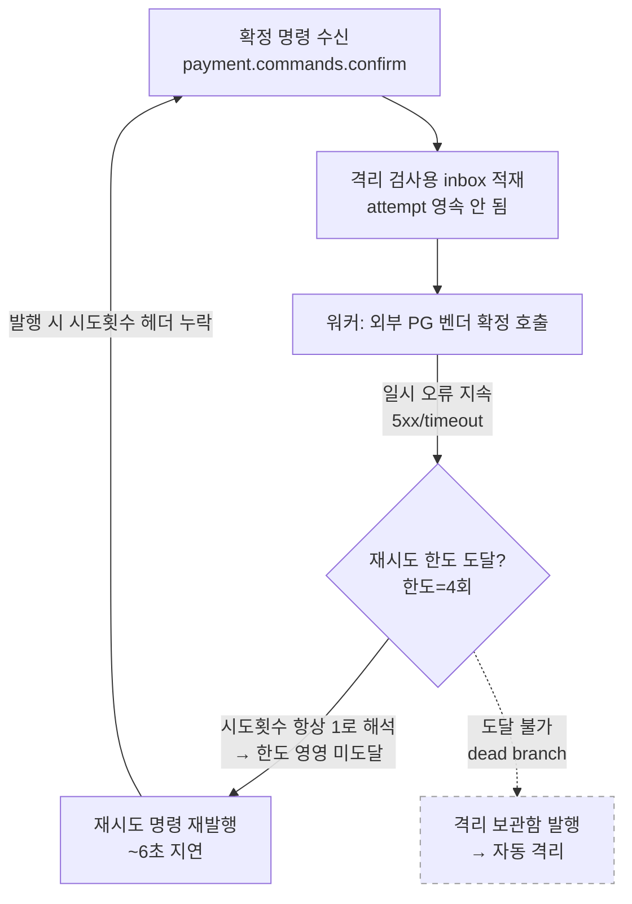
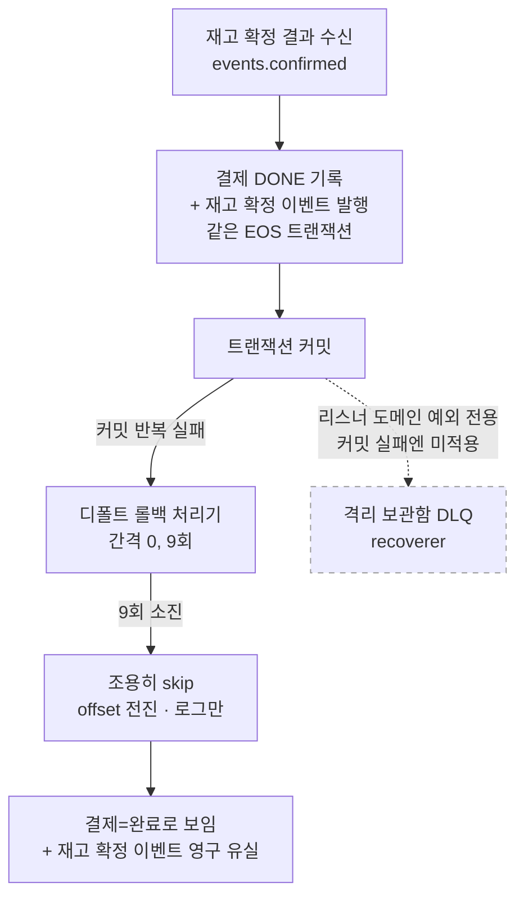
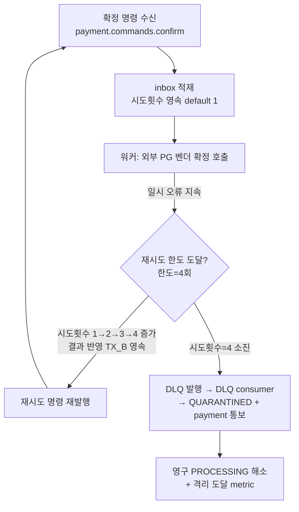
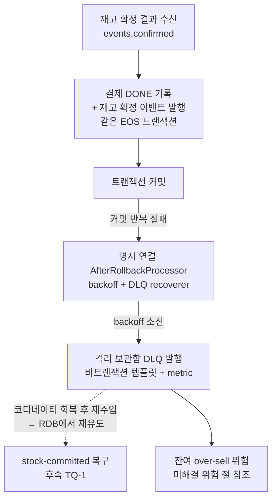

# DLQ 도달 보장 설계

> 최종 수정: 2026-06-23

## 사전 브리핑

### 1. 현재 이해한 문제

결제 확정 과정에서 일시적 장애가 **지속**될 때, 두 서비스 모두 메시지가 격리 보관함(DLQ)에 도달하지 못한다.

- **pg-service** — 외부 PG 벤더의 일시 오류가 계속되면 같은 확정 명령을 약 6초 간격으로 **무한히 되돌려 보낸다**(self-loop). 재시도 한도에 도달하지 못해 격리되지 않고, 결제는 영영 처리 중 상태로 남으며 운영 격리 알림도 누락된다.
- **payment-service** — 재고 확정 결과를 기록하는 트랜잭션의 커밋이 반복 실패하면, 메시지가 격리 보관함에 들어가지 않고 **조용히 건너뛰어진다**(skip). 재고 확정 이벤트도 같은 트랜잭션 안에서 발행되므로 함께 사라져, 결제는 완료로 보이지만 재고 확정 신호는 영구 유실된다.

### 2. 현재 시스템 동작 (as-is)

**Track P — pg-service self-loop (재시도 한도 미작동)**

> 시도횟수가 항상 1로 고정되는 3중 원인: (a) 재발행 릴레이가 저장된 시도횟수 헤더를 빈 맵으로 덮어 누락, (b) 따라서 소비 시 헤더 부재로 1 해석, (c) inbox에 시도횟수 보관 컬럼이 없어 워커도 1 고정.

**Track E — payment-service EOS 커밋 반복 실패 (조용한 유실)**

> 격리 보관함 recoverer(DLQ)는 리스너가 던진 도메인 예외에만 적용되고, 트랜잭션 **커밋 실패**는 컨테이너 디폴트 롤백 처리기(별도 명시 설정 없음 → 간격 0·9회·단순 로그)로 처리돼 DLQ를 거치지 않는다. 게다가 재고 확정 이벤트 재발행이 같은 트랜잭션 안이라 커밋이 매번 실패하면 재발행도 매번 abort → 완전 유실.

### 3. 이번 discuss에서 결정하려는 것

- **[정책]** pg-service의 무한 재시도가 의도된 동작인지, 아니면 한도 도달 시 격리(DLQ→자동 격리)가 올바른 정책인지 확정
- **[Track P 기전]** 한도 도달을 보장한다면 시도횟수 전파 방식 — 재발행 릴레이의 헤더 복원 + inbox 시도횟수 영속화
- **[Track E 기전]** payment EOS 커밋 반복 실패를 격리 보관함으로 보내는 방식(롤백 처리기 명시 연결) 채택 여부
- **[Track E 결합]** 재고 확정 이벤트 재발행이 실패하는 EOS 트랜잭션에 묶여 함께 abort되는 결합을 끊을지 / 끊는다면 어떻게
- **[공통 원칙]** "장애 지속 시 격리 + 가시화(metric/alert)"를 두 트랙에 일관 적용할지

### 4. 열린 질문 / 가정

- pg-service 무한 재시도가 학습 의도였는지 여부가 미확정(TODOS에 명시) — 이 답에 따라 Track P 방향이 갈린다.
- payment EOS 커밋이 "반복 실패"하는 현실 시나리오는 Kafka tx coordinator 장애 등으로 한정 — 실제 운영 위험도와 처방의 무게를 가늠해야 한다.
- DLQ 도달 **이후** 자동 트리아지/재처리는 범위 밖(별도 후속 TQ-1 DLQ admin tool)이라 가정.
- (확인됨) payment의 DLQ 발행 템플릿은 EOS 트랜잭션과 별개의 비트랜잭션 ProducerFactory를 사용 → DLQ 발행 경로 자체는 실패하는 EOS 트랜잭션에 묶여있지 않다.
- (확인됨) pg-service 재발행 릴레이는 저장된 시도횟수 헤더를 빈 맵으로 발행 → 헤더 전파가 끊긴 지점은 릴레이 1곳으로 특정됨.

---

## 요약 브리핑

### 1. 결정된 접근

두 트랙 모두 **일시 장애가 지속되면 격리 보관함(DLQ)에 도달시키고 메트릭으로 가시화**한다. pg-service는 시도횟수를 `pg_inbox.attempt` 컬럼 하나가 소유하게 해(Option B) 워커가 결과 반영 트랜잭션에서 증가시키고, 한도(4회) 소진 시 기존 DLQ 격리 체인(→ QUARANTINED + payment 통보)으로 보낸다. payment-service는 컨테이너 팩토리에 롤백 처리기를 명시 연결해 EOS 커밋 반복 실패 메시지를 비트랜잭션 DLQ 템플릿으로 발행한다(조용한 skip 제거). 재고 확정 이벤트 자동 복구는 범위 밖이며, 그로 인한 **over-sell 잔여 위험을 §미해결 위험으로 명시**한다.

### 2. 변경 후 동작 (to-be)

**Track P — pg-service 한도 도달 격리**

**Track E — payment-service EOS 커밋 실패 격리**

### 3. 핵심 결정 목록

- PG 재시도 정책: 한도(4회) 도달 시 격리(DLQ→QUARANTINED) — 무한 self-loop·영구 PROCESSING 차단
- PG 시도횟수 기전: `pg_inbox.attempt` SoT(Option B), 워커가 TX_B에서 1씩 증가 (헤더 라운드트립 복원 불필요)
- payment EOS 커밋 실패: 컨테이너 팩토리에 AfterRollbackProcessor 명시 연결, 기존 비트랜잭션 DLQ 템플릿 재사용
- 가시화: 두 트랙 격리 도달 카운터 metric 추가 (alerting rule은 후속)

### 4. 트레이드오프 / 후속 작업

- **잔여 over-sell 위험**: payment EOS 코디네이터 지속 장애 시 결제 DONE인데 재고 확정 영구 유실 → redis 선차감과 product RDB 영구 발산. 이번 작업은 가시화까지만 더하고 자동 복구는 안 한다.
- **후속(TQ-1 DLQ admin tool)**: DLQ 메시지 재주입 복구 경로 + 소비/재처리 주체 + 수동 복구 SLA.
- **후속(alerting 인프라, TC-13-FOLLOW-3/4)**: 격리 도달 metric 기반 임계 알람.
- **Phase 5(측정 의존)**: RetryPolicy MAX/backoff, EOS backoff 값 정밀 튜닝.

---

## 문제 정의

일시 장애가 **지속**될 때 두 서비스 모두 메시지가 격리 보관함(DLQ)에 도달하지 못한다 — pg-service는 시도횟수가 항상 1로 고정돼 한도(4회) 도달 분기가 dead branch가 되어 약 6초 간격 무한 self-loop, payment-service는 EOS 커밋 반복 실패가 컨테이너 디폴트 롤백 처리기로 빠져 9회 소진 후 조용히 skip + 같은 트랜잭션의 재고 확정 이벤트도 함께 유실. 인터뷰 결정: 두 트랙 모두 **한도/소진 도달 시 격리 보관함으로 보내고 메트릭으로 가시화**한다. 재고 확정 이벤트의 자동 복구는 범위 밖(후속).

## 영향 범위

**Track P (pg-service)**
- 변경: `PgInboxProcessor.resolveAttempt` (하드코딩 1 → `inbox.getAttempt()` 읽기), `PgVendorCallService` retry 분기 (재시도 시 inbox 시도횟수 증가 영속), `PgInbox` 도메인 (attempt 필드), `PgInboxRepository`/구현·`PgInboxPendingService` (insert 시 attempt=1 + 증가 매핑)
- 신규: Flyway V5 (`pg_inbox.attempt` 컬럼, default 1), pg 격리 도달 카운터 metric (배치 layer는 기존 `infrastructure/metrics` 또는 `core/common/metrics` 패턴 중 plan에서 확정)
- 무관(변경 불필요): DLQ 격리 체인(`PaymentConfirmDlqConsumer`/`PgDlqService` — 이미 완성), `RetryPolicy`(MAX=4 유지), `PgOutboxRelayService`(Option B 채택 시 헤더 전파 불필요)

**Track E (payment-service)**
- 변경: `KafkaConsumerConfig.kafkaListenerContainerFactory` (`setAfterRollbackProcessor` 추가)
- 신규: AfterRollbackProcessor용 `DeadLetterPublishingRecoverer`(기존 `confirmedDlqKafkaTemplate` 재사용) + backoff, EOS 커밋 실패 격리 카운터 metric (배치 layer는 plan에서 확정)
- 무관(변경 불필요): `KafkaErrorHandlerConfig`(리스너 RuntimeException 경로 유지), `PaymentConfirmResultUseCase`(종결 가드 재발행 로직 무변경), `confirmedDlqKafkaTemplate`(이미 비트랜잭션)

## 설계 옵션 비교

### Track P — 시도횟수 전파 기전

**Option A — 헤더 라운드트립 복원 (TODOS 원안)**
- 릴레이가 `pg_outbox.headers_json` → Kafka `attempt` 헤더 발행 → consumer가 헤더 읽어 inbox에 영속 → 워커가 inbox 읽음.
- 장점: 기존 `buildAttemptHeader`/consumer 헤더 파싱 코드 재사용.
- 단점: 전파 경로가 길다(릴레이→헤더→consumer→inbox→워커). 한 곳만 끊겨도 재발. "예약 필드" `headers_json` 활성화 부담.

**Option B — pg_inbox 시도횟수 SoT, 서버측 증가 (권장)**
- 시도횟수를 `pg_inbox.attempt` 컬럼으로만 보유. 워커의 결과 반영(TX_B)에서 재시도 분기일 때 inbox 시도횟수를 증가·영속. self-loop 명령은 "해당 주문 재처리" 신호로만 작동하고, 시도횟수는 DB가 소유.
- 장점: 단일 SoT, 전파 경로 짧음, 릴레이/헤더 변경 불필요(끊긴 경로 복원 자체가 불필요). 멱등 자연 성립.
- 단점: 결과 반영 로직에 시도횟수 증가 책임 추가. consumer의 헤더 파싱이 vestigial(로그 용도로 축소).
- **권장 이유**: 끊긴 전파 경로를 복원하는 대신 시도횟수 소유를 DB 한 곳으로 모아 재발 여지를 구조적으로 없앤다. 삭제·교체 비용이 낮다.

**Option B 시도횟수 불변식 (구현 함정 예방)**
- 시도횟수는 **벤더 호출 1회당 1 증가**하며, retry 분기 / 좀비 회수(`processInProgressZombie`) / IN_PROGRESS 재진입(`handleActiveInbox` 경유) 모든 재호출 경로에서 동일 규칙을 따른다.
- 증가는 결과 반영 TX_B의 `pg_inbox` UPDATE에 **포함**한다(별도 round-trip 금지 — 증가·재시도 명령 INSERT가 원자적으로 한 트랜잭션).
- 검증 전략의 "1→2→3→4 증가" 통합 테스트에 좀비 회수 경로 1건을 반드시 포함한다.

**소진 시 inbox 전이 결정**
- 시도횟수 소진 시 현재 `insertDlqOutbox`는 `pg_outbox`만 INSERT하고 `pg_inbox`는 IN_PROGRESS로 둔다 → DLQ 소비(`PgDlqService`가 QUARANTINED 전이) 전까지 좀비 폴링이 벤더를 재호출할 수 있는 경합 window.
- **결정**: 즉시 QUARANTINED 전이를 추가하지 않고 **현행 DLQ 격리 체인에 위임**한다. 그 사이 좀비 회수의 벤더 재호출은 PG 멱등성(ALREADY_PROCESSED → `DuplicateApprovalHandler`, TC-9에서 추가된 Fake 멱등 모드로 검증 가능)으로 무해하다. 변경 최소화 우선.

**consumer 시도횟수 헤더/파라미터 처리 방침**
- Option B에서 consumer의 `attempt` 헤더 파싱과 `handle(command, attempt, ...)` 파라미터는 실효성이 사라진다(시도횟수 SoT가 DB로 이동). plan 단계에서 minimal-change 원칙에 맞춰 **로그 전용 유지 vs 제거**를 명시한다.

### Track E — EOS 커밋 실패 처리

**Option E1 — AfterRollbackProcessor 명시 연결 (채택)**
- 컨테이너 팩토리에 `AfterRollbackProcessor`를 명시 설정하고 동일 `DeadLetterPublishingRecoverer`(비트랜잭션 DLQ 템플릿) + backoff를 연결 → 커밋 반복 실패 메시지를 backoff 소진 후 DLQ로 발행(조용한 skip 제거).
- DLQ 템플릿이 EOS 트랜잭션과 분리된 비트랜잭션 ProducerFactory라 커밋 실패 중에도 발행 가능.

**Option E2 — 재고 확정 이벤트 EOS 결합 해소 (기각)**
- 재발행을 EOS 트랜잭션 밖으로 빼 커밋 실패 후에도 살아남게 함. 변경 범위·복잡도 큼 — 인터뷰 결정(DLQ 가시화까지)에 따라 범위 밖.

## 결정 사항

| 항목 | 결정 | 이유 |
|---|---|---|
| PG 재시도 정책 | 한도(4회) 도달 시 격리(DLQ→QUARANTINED) | 벤더 장애 지속 시 무한 self-loop + 영구 PROCESSING 차단 |
| PG 시도횟수 전파 기전 | `pg_inbox.attempt` SoT, 워커가 TX_B에서 증가 (Option B) | 끊긴 헤더 라운드트립 복원 대신 소유를 DB 한 곳으로 모아 재발 여지 제거 |
| PG 시도횟수 컬럼 | Flyway V5 `pg_inbox.attempt` (default 1) | 워커 재처리 간 시도횟수 영속 |
| payment EOS 커밋 실패 처리 | 컨테이너 팩토리에 AfterRollbackProcessor 명시 연결 (DLQ recoverer + backoff) | 조용한 skip 대신 DLQ 가시화 |
| payment DLQ 발행 경로 | 기존 비트랜잭션 `confirmedDlqKafkaTemplate` 재사용 | 실패하는 EOS 트랜잭션과 분리돼 커밋 실패 중에도 발행 가능 |
| 재고 확정 이벤트 유실 복구 | 범위 밖 (DLQ 가시화까지) | 자동 복구는 후속 DLQ admin tool(TQ-1); 이번은 가시화로 한정. **잔여 over-sell 위험은 §미해결 위험에 명시** |
| 가시화 | 두 트랙 격리 도달 카운터 metric 추가 | 기존 metrics 문화 일관; 알람 rule은 alerting 인프라 후속 |
| RetryPolicy/backoff baseline | MAX=4 / 지수백오프 유지 (재튜닝 안 함) | 측정 의존 — Phase 5 별도 |

## 장애 시나리오와 대응

- **PG 벤더 일시 오류 1~3회 후 회복** → 시도횟수 증가하며 재시도, 회복 시 정상 종결(격리 없음).
- **PG 벤더 장애 4회 지속** → 시도횟수=4에서 DLQ 발행 → DLQ consumer → QUARANTINED + payment에 QUARANTINED 통보 → 영구 PROCESSING 해소.
- **payment EOS 커밋 1~N회 실패 후 회복** → 재배달 시 종결 가드 재발행 성공 → 정상(기존 CONFIRM-APPROVED-RESEND-GAP 복구 경로).
- **payment EOS 커밋 backoff 소진까지 지속 실패** → AfterRollbackProcessor recoverer가 events.confirmed 메시지를 DLQ로 발행(비트랜잭션) → 조용한 유실 제거·가시화. **단, 이때 재고 확정 이벤트는 여전히 미발행이며 이는 단순 메시지 유실이 아니라 over-sell 위험이다** — 아래 §미해결 위험 참조.
- **DLQ 발행 자체 실패(브로커 다운 등)** → offset 미커밋 → 재배달 재시도(at-least-once).

## 미해결 위험 (residual risk)

> Track E를 "DLQ 가시화까지"로 한정한 결과 남는 위험. 인터뷰에서 자동 복구는 범위 밖으로 결정했으나, 잔여 위험의 성격을 명시한다.

**잔여 위험 — payment DONE + 재고 확정 영구 유실 = over-sell**
- EOS 코디네이터가 **지속 장애**일 때: JPA inner TX는 이미 커밋돼 `payment=DONE` + dedupe row가 박히지만, 같은 EOS 트랜잭션의 재고 확정 발행은 backoff 소진까지 매번 abort → stock-committed 완전 유실.
- 결과: confirm 진입 시 redis-stock은 이미 선차감됐고 APPROVED라 보상도 안 한다. product RDB(SoT)는 차감되지 않으므로 **redis(차감) < product RDB(미차감) 영구 발산** → 동일 재고를 다시 팔 수 있는 over-sell + 고객 결제는 이미 성공(DONE).
- 자동 회복 부재: `PaymentReconciler`는 IN_PROGRESS만 READY 복원하므로 **DONE 결제는 자동 회복 대상이 아니다**. (PITFALLS §20 동일 위험 명시)
- 즉 발생 시 손실의 성격은 "조용한 skip"과 본질적으로 동일하며, 이번 작업이 더하는 것은 **가시화(DLQ 도달 + metric)뿐**이다. 발생 조건(Kafka tx coordinator 지속 장애)은 희귀하나 손실은 작지 않다.

**DLQ 라이프사이클 — 가시화 ≠ 복구**
- 코디네이터 장애 **중**에는 DLQ에 담긴 events.confirmed(APPROVED) 메시지를 재처리해도 다시 종결 가드 재발행 → 같은 EOS tx → 또 abort. DLQ는 이 구간에선 "유실 신호"일 뿐 복구 경로가 아니다.
- 복구는 코디네이터 **회복 후** DLQ 메시지 재주입으로 이뤄진다(후속 TQ-1). 재주입 시 종결 가드가 `payment_event`(RDB)에서 stock-committed를 재유도하므로(`sendStockCommittedEvents`는 orderId로 로드한 paymentEvent에서 productId/수량 구성) **events.confirmed DLQ 페이로드만으로 복구 정보가 충분 — 별도 필드 보존 불요**.
- 후속 책임: DLQ 소비/재처리 주체와 수동 복구 SLA는 TQ-1(DLQ admin tool)에서 정의한다.

**Track E backoff 정책 고려 (plan)**
- AfterRollbackProcessor backoff는 일시적 코디네이터 blip이 재배달로 self-heal될 만큼 충분히 관대해야 한다(과도하게 짧으면 자동 회복 가능한 상황을 조기에 수동 복구 대상으로 전환). 동시에 파티션을 영구 블록하지 않도록 상한을 둔다. 정확한 값은 측정 의존(Phase 5).

## 검증 전략

- **Track P**: TODOS에 기록된 원복된 임시 검증 2건을 RED 기준으로 재작성 — (1) self-loop N회 반복 시 결과 반영에 넘어가는 시도횟수가 1→2→3→4로 증가, (2) 시도횟수 소진 시 DLQ outbox 1건 + 격리 도달. 단위(Fake) + Testcontainers 통합(self-loop → QUARANTINED 종단).
- **Track E**: 기존 `PaymentEosIntegrationTest#7`을 갭-문서화에서 갭-수정-검증으로 전환 — N회 결정적 commit 실패 주입 후 confirmed.dlq 1건 도달 + payment DONE + stock-committed 0건. 결정적 주입(`CommitFailureInjectingProducerPostProcessor`) 재사용.
- **metric**: 두 카운터 증가 단정.
- **회귀**: `./gradlew test` 전체 GREEN.

## 제외 범위

- 재고 확정 이벤트 유실 자동 복구(EOS tx 결합 해소) — 후속(TQ-1 DLQ admin tool). 단 §미해결 위험으로 over-sell 잔여 위험 명시.
- DLQ 도달 후 자동 트리아지/재처리/재발행 + 수동 복구 SLA/책임 — 후속(TQ-1).
- Prometheus alerting rule — alerting 인프라 미구축, 후속(TC-13-FOLLOW-3/4).
- RetryPolicy MAX/backoff, EOS backoff 값 측정 기반 재튜닝 — Phase 5.
- pg_inbox multi-instance SKIP LOCKED 정합 검증 — 별도(TC-15).

## 참고

- `docs/context/TODOS.md` — [PG-SELFLOOP-ATTEMPT-GAP], TC-13-FOLLOW-7
- `docs/archive/confirm-approved-resend-gap/COMPLETION-BRIEFING.md` — 종결 가드 재발행 SSOT
- `docs/context/TODOS.md` [PG-SELFLOOP-ATTEMPT-GAP] — PG self-loop 갭 상세 분석 (실증 2건 포함)
- `docs/context/PITFALLS.md` §20 — under-publish → 재고 차감 누락 → redis/RDB 발산 → over-sell
- `docs/context/ARCHITECTURE.md` — layer 룰
