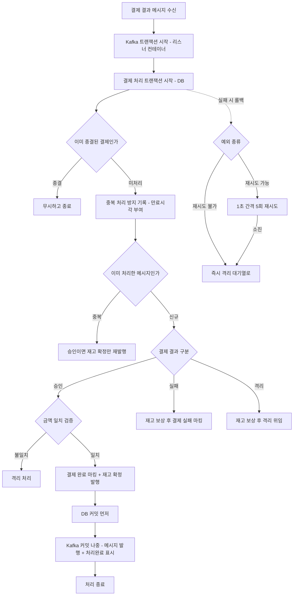
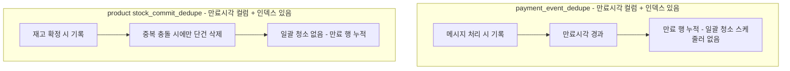
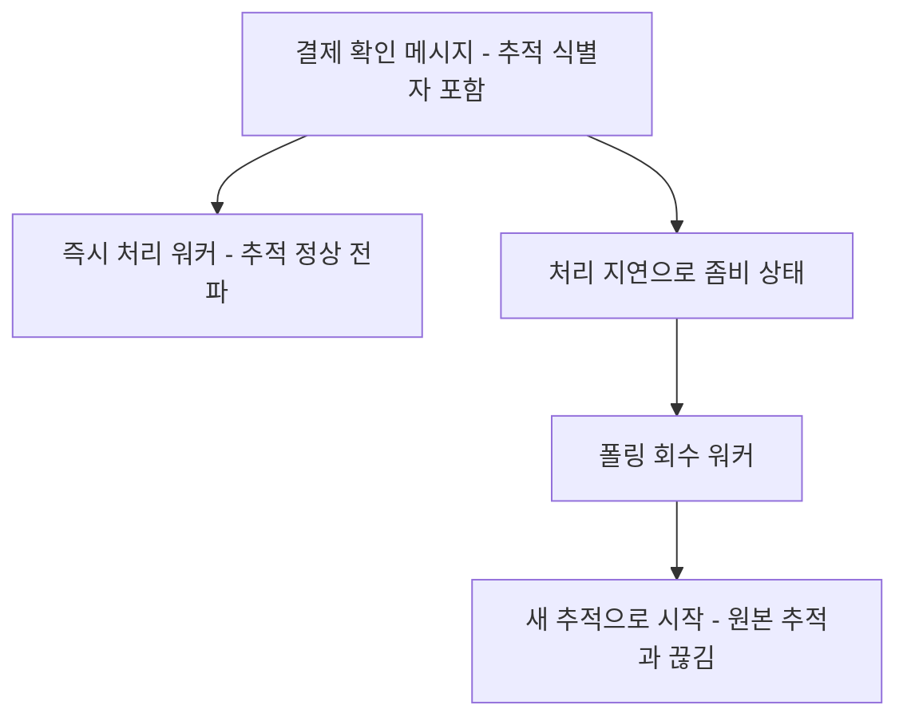
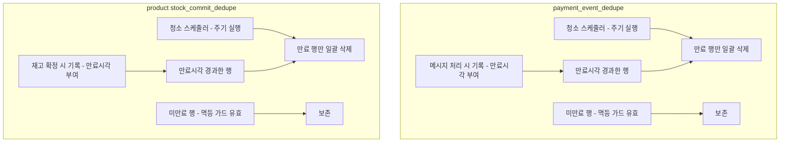
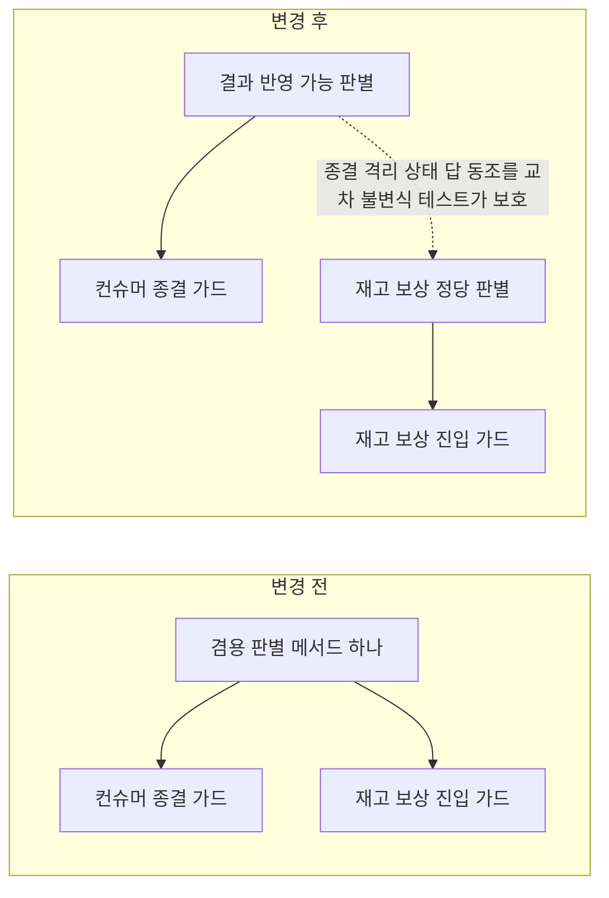
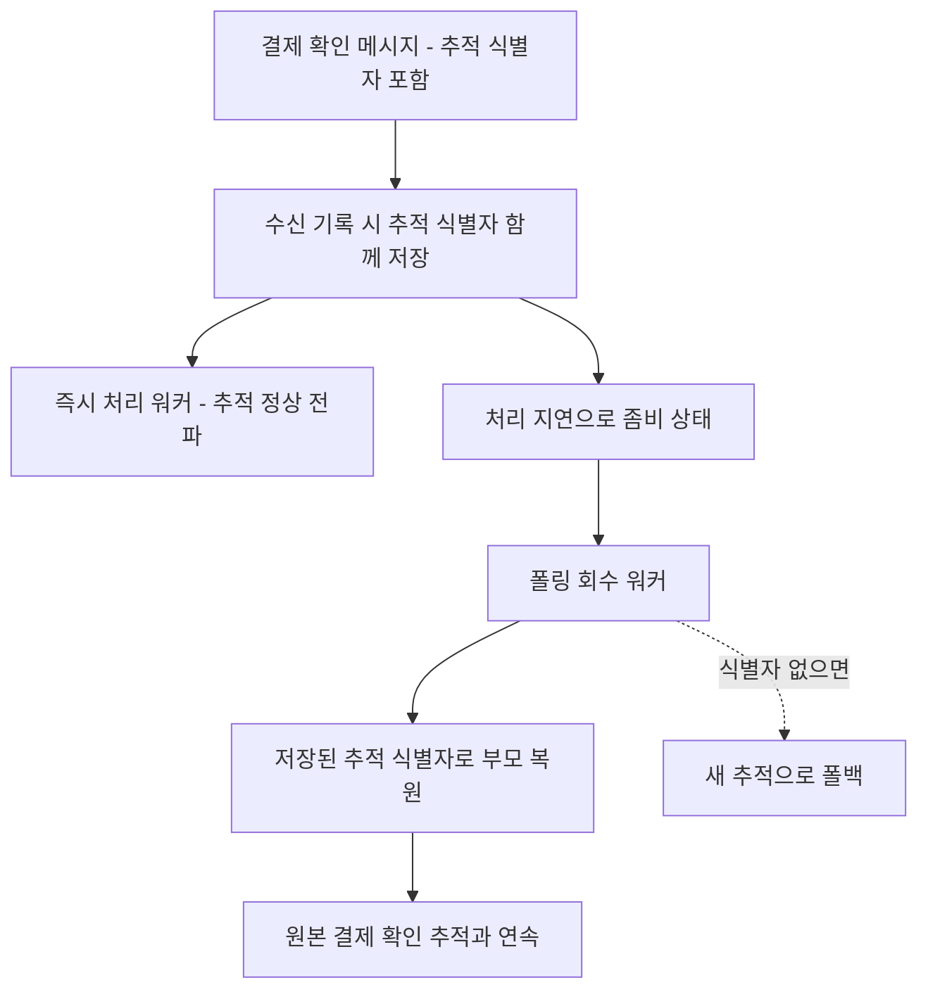
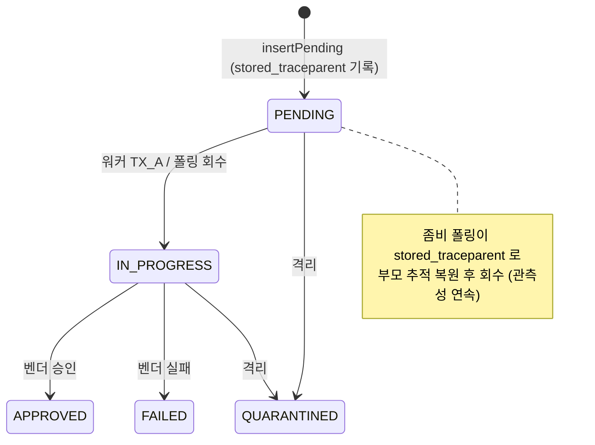

# EOS-FOLLOWUP-CLEANUP

> EOS 전환(PAYMENT-EOS-TRANSITION, PR #77) 후속 정합 + 결제 비동기 경로 청소 묶음.
> 범위: payment / product / pg 3서비스 횡단. 측정·멀티 인스턴스 환경 무관한 코드 작업만.
> cleanup 대상은 payment / product 두 dedupe 기록이며, pg-service는 폴링 회수 분산 추적 복원만 받는다.

## 사전 브리핑

### 1. 현재 이해한 문제

EOS 전환을 마치며 남긴 후속 항목과, 결제 비동기 처리 경로에 흩어진 운영 정합성 부채를 한 번에 청소한다. 크게 셋 — (a) 결제 결과 컨슈머의 트랜잭션 경계가 코드만 봐선 의도가 안 보이고 일부 API가 deprecated, (b) 중복 처리 방지 기록(dedupe)에 만료 행을 지우는 청소 수단이 없어 무한 누적, (c) 한 판별 로직이 서로 다른 두 목적에 겸용돼 변경 시 한쪽이 조용히 깨질 위험. 부차적으로 결제 확인 폴링 회수 시 분산 추적이 끊기는 갭도 함께 손본다.

### 2. 현재 시스템 동작 (as-is)

#### 2-A. 결제 결과 비동기 처리 + 트랜잭션 경계 (FOLLOW-6 / FOLLOW-5 맥락)

- **트랜잭션 경계**: 바깥 Kafka 트랜잭션(리스너 컨테이너) 안에서 DB 트랜잭션이 중첩으로 돈다. DB 커밋이 먼저, Kafka 커밋이 나중 — best-effort 1PC. 그 사이 crash 시 메시지 재배달(중복)이 가능하나 중복 처리 방지 기록 + 받는 쪽 멱등으로 흡수. **이 중첩 구조는 Spring Kafka 공식 권장 패턴임을 confirm 완료.**
- **숨은 부채 1**: DB 트랜잭션에 트랜잭션 매니저 이름(qualifier)이 없어 코드만 보면 의도가 안 보인다. payment-service 전체에 이름 없는 트랜잭션이 14개+ 존재 — 전부 기본(DB) 매니저를 쓰는 게 의도.
- **숨은 부채 2**: 리스너 컨테이너 트랜잭션 매니저 설정 API가 deprecated.
- **숨은 부채 3 (FOLLOW-5)**: `이미 종결된 결제인가`(컨슈머 진입 가드)와 `재고 보상 가능한가`(보상 핸들러 진입 가드)가 **같은 판별 메서드 하나를 공유**한다. 두 목적의 정답표가 우연히 같아 한쪽 정책이 바뀌면 다른 쪽이 조용히 깨질 수 있다.

#### 2-B. 중복 방지 기록의 청소 부재 (FOLLOW-2 / TC-11)

- payment / product 두 기록: **만료시각 컬럼 + 인덱스 이미 존재** → 일괄 청소 쿼리만 추가하면 됨.
- 기존 스케줄러 패턴: `fixedDelay` + 설정 기반 배치 크기 + Micrometer 카운터, 분산 락 미도입(단일 인스턴스 가정).

#### 2-C. 결제 확인 폴링 회수 시 분산 추적 끊김 (TC-15 항목3)

- 즉시 처리 경로는 추적 식별자를 정상 전파. 폴링 회수 경로만 새 추적으로 시작해 원본과 끊긴다.
- pg_inbox에 추적 식별자 보관 컬럼이 없어 회수 시 이어붙일 근거가 없음.

### 3. 이번 discuss에서 결정하려는 것

- **D-TM-QUALIFIER**: 트랜잭션 매니저 이름 명시 범위 — 결제 결과 컨슈머 진입점만 vs payment-service 전체(14개+) vs 코드 대신 문서·기본 매니저 선언으로 의도 표현. 어느 선까지가 적정한가.
- **D-METHOD-SPLIT**: 겸용 판별 메서드를 두 목적별 메서드로 분리하는 명명과, 보상 가드 호출처 동시 갱신 방식.
- **D-DEDUPE-CLEANUP**: payment / product 청소 스케줄러의 형태 — 주기·배치 크기·보존 기간(현 만료시각 8일과 정합), 멀티 인스턴스에서 동시 실행되어도 무해함(idempotent DELETE) 확인, 두 서비스 공통화 여부.
- **D-TRACEPARENT**: 추적 식별자 보관 컬럼 추가 + 폴링 회수 시 부모 추적 복원 방식. pg_inbox 마이그레이션은 추적 컬럼 단독 1건.

### 4. 열린 질문 / 가정

- 1PC 한계는 "수용 + 문서화"로 확정인가(재설계 불요)? — 기존 검증상 공식 권장 패턴이라 수용 전제.
- 재시도 제외 목록(형식·불변식 위반 예외)이 재시도가 필요한 DB 인프라 실패(락·타임아웃)를 잘못 즉시 격리시키는 경계가 있는지 — discuss 중 검증, 갭 발견 시 작업 추가.
- 청소 스케줄러는 현 프로젝트 관행대로 분산 락 없이 둔다(동시 DELETE는 무해). 가정 맞는지 확인.
- 토픽명(EOS-FOLLOWUP-CLEANUP)이 traceparent까지 포함한 범위를 잘 대표하는지.

---

## 요약 브리핑

> discuss 라운드 2에서 Critic·Domain Expert 양쪽 pass. Round 1 Domain Expert critical(pg_inbox 종결 행 삭제 = 멱등 SoT 파괴)에 대응해 pg_inbox 청소를 범위에서 제외, 남은 청소는 dedupe 두 종으로 좁혔다.

### 결정된 접근

다섯 작업군 모두 "새 경계를 긋지 않고 흐려진 경계를 또렷이 하거나 빠진 청소 수단을 채우는" 최소 침습 변경으로 확정. payment의 트랜잭션 매니저 의도는 컨슈머 진입점 한 곳에만 코드로 드러내고 나머지는 주석으로, 겸용 판별 메서드는 의미가 다른 두 술어로 쪼개되 그 답이 의도적으로 같아야 하는 종결·격리 상태는 교차 불변식 테스트로 묶는다. 중복 방지 기록 청소는 만료 행만 지우는 독립 스케줄러로 두 dedupe(payment·product)에만 적용하고, 결제 확인 수신 기록(pg_inbox)은 멱등 진실원이라 청소하지 않는다. 폴링 회수 시 끊기던 분산 추적은 수신 기록에 추적 식별자를 함께 저장해 원본과 잇는다.

### 변경 후 동작 (to-be)

#### 1) 중복 방지 기록 청소 (FOLLOW-2 / TC-11) — payment·product 두 dedupe만

#### 2) 판별 메서드 분리 (FOLLOW-5)

#### 3) 폴링 회수 시 분산 추적 복원 (TC-15 항목3)

> FOLLOW-6(트랜잭션 매니저 의도 명시 + deprecated 설정 API 교체 + 1PC 한계 문서화)은 동작 변경이 0인 의미 보존 리팩토링이라 결제 흐름 다이어그램(사전 브리핑 2-A)이 그대로 유지된다.

### 핵심 결정 ID

- **D-TM-1** — 컨슈머 진입점(`handle`)에만 트랜잭션 매니저 qualifier 명시, 나머지 13개+는 무변경.
- **D-TM-3** — deprecated `setTransactionManager` → `setKafkaAwareTransactionManager` 1줄 교체.
- **D-TM-4** — best-effort 1PC 한계(재배달=중복, dedupe 흡수) 문서화.
- **D-SPLIT-1/2** — 겸용 메서드를 `canApplyConfirmResult` / `canCompensateStock`로 분리, 기존 메서드 제거 + 두 호출처 동시 갱신.
- **D-SPLIT-3** — 두 메서드의 종결·QUARANTINED·EXPIRED 답 동조를 단언하는 교차 불변식 회귀 테스트(D7 침묵 DLQ 회귀 1차 방어선).
- **D-CLEAN-1~4** — payment·product 각 기존 출력 포트에 `deleteExpired` 추가 + `infrastructure/scheduler`에 독립 청소 워커(만료 조건 idempotent batch DELETE).
- **D-TRACE-1~3** — `pg_inbox.stored_traceparent` 컬럼(Flyway 1건) + 수신 기록 시 저장 + 폴링 회수 시 부모 추적 복원(추적 추출·복원은 infrastructure에 격리).

### 알려진 트레이드오프 / 후속

- **1PC 한계 수용**: DB 커밋 후 Kafka 커밋 전 crash 시 재배달(중복) 가능 — 재설계 대신 dedupe 흡수 + 문서화로 마무리(공식 권장 패턴 확인됨).
- **단일 인스턴스 가정**: 청소 스케줄러에 분산 락 미도입(만료 조건 DELETE는 멱등이라 무해). 멀티 인스턴스 전환 시 별도 토픽.
- **폴링 회수 추적 의도 전환**: 기존 "복구 추적을 비즈니스 추적과 분리(새 root)"를 "원본과 연속(parent 복원)"으로 뒤집음 — 폴링 워커 Javadoc 갱신 의무.
- **plan 전 확인 의무 2건**: (1) `setKafkaAwareTransactionManager`가 현 Spring Kafka 버전에 존재하는지, (2) 추적 식별자 추출 소스(OTel 컨텍스트 vs Kafka 헤더) 택일.

---

## 1. 배경

EOS 전환(PAYMENT-EOS-TRANSITION, PR #77)을 마치며 후속 정합 항목 4종과 결제 비동기 경로의 운영 부채를 한 묶음으로 청소한다. 다섯 작업군은 서로 독립적이지만 한 가지 공통 성격을 공유한다 — **모두 기존 경계를 새로 긋는 것이 아니라, 흐려진 경계를 또렷하게 만들거나 누락된 청소 수단을 채우는 작업**이다. 따라서 본 설계의 기준은 "새 추상화를 도입하지 않고, 기존 포트/어댑터 경계 안에서 최소 침습으로 의도를 드러낸다"이다.

- **FOLLOW-6** (payment): 결제 결과 컨슈머의 트랜잭션 매니저 의도가 코드에 안 보이고 설정 API가 deprecated.
- **FOLLOW-5** (payment): 한 판별 메서드(`isCompensatableByFailureHandler`)가 두 목적에 겸용돼 변경 시 한쪽이 조용히 깨진다.
- **FOLLOW-2** (payment): `payment_event_dedupe` 만료 행 청소 수단 부재 → 무한 누적.
- **TC-11** (product): `stock_commit_dedupe` 만료 행 청소 수단 부재 → 무한 누적.
- **TC-15 항목3** (pg): 결제 확인 폴링 회수 경로에서 분산 추적이 끊긴다.

> 설계 관점 한 줄: dedupe 청소는 **삭제 비용이 낮은 독립 어댑터**(스케줄러 + 포트 메서드 1개)로 격리해, 정책이 바뀌거나 분산 락 도입 시 통째로 떼어낼 수 있게 둔다. traceparent 저장은 **inbox 회수 경로에만 영향을 주는 한 컬럼 + 한 흐름**으로 가두어 confirm 본류와 결합하지 않는다.

## 2. 목표 / 범위

### 2-1. in-scope (이번에 한다)

| 작업군 | 서비스 | 한 줄 |
|---|---|---|
| FOLLOW-6 | payment | `handle`에만 TM qualifier 명시 + deprecated 설정 API 교체 + 1PC 한계 문서화 |
| FOLLOW-5 | payment | 겸용 판별 메서드를 목적별 2개로 분리, 두 호출처 동시 갱신 |
| FOLLOW-2 | payment | `payment_event_dedupe` 만료 행 일괄 cleanup 스케줄러 |
| TC-11 | product | `stock_commit_dedupe` 만료 행 일괄 cleanup 스케줄러 |
| TC-15 항목3 | pg | `pg_inbox.stored_traceparent` 컬럼(Flyway) + 회수 시 부모 추적 복원 |

### 2-2. non-goals (이번에 안 한다) — interview-0.md §non-goals 참조

- **멀티 인스턴스 / 측정 의존 후속**: TC-13-FOLLOW-1(hostname 충돌), -3(tx coordinator 모니터링), -4(D7 분기 알람 SLO). 단일 인스턴스 가정을 유지한다.
- **`payment_outbox` retry 정책 재검토**(TC-7) — k6 측정 자물쇠.
- **보상 경로 silent loss 정리**(STOCK-COMPENSATION-OTHER-PATHS / TQ-7) — 별도 토픽.
- **분산 락(ShedLock) 도입** — 청소 DELETE는 idempotent라 단일 인스턴스 가정에서 불필요. 멀티 인스턴스 전환 시 별도 토픽.
- **1PC 구조 재설계** — Spring Kafka 공식 권장 패턴으로 확인됨. 한계는 수용 + 문서화만.
- **즉시 처리 경로(`PgInboxImmediateWorker`)의 추적 동작 변경** — 이미 정상 전파. traceparent 저장은 회수 경로에만 영향.

### 2-3. 모듈 / 패키지 경계

- **payment-service**: `domain/enums`(FOLLOW-5 enum), `application/usecase`(FOLLOW-6 qualifier·FOLLOW-5 호출처), `application/port/out`(FOLLOW-2 포트 메서드), `infrastructure/dedupe`(어댑터), `infrastructure/scheduler`(워커), `infrastructure/config`(FOLLOW-6 설정 API). dedupe `expires_at` 인덱스 기존재 → Flyway 불요.
- **product-service**: `application/port/out`(포트 메서드), `infrastructure/idempotency`(어댑터), `infrastructure/scheduler`(워커). `stock_commit_dedupe`의 `expires_at` + `idx_expires_at` 인덱스가 `db/schema` baseline에 이미 존재 → **Flyway 마이그레이션 불요**(product는 `db/schema` 디렉토리 사용).
- **pg-service**: `application/port/out`(포트 메서드 — traceparent 전달), `infrastructure/repository`(어댑터·INSERT 시 traceparent 기록), `infrastructure/scheduler`(polling 워커 회수 시 부모 추적 복원), `infrastructure/entity`(컬럼 매핑), `db/migration`(Flyway 1건 — `stored_traceparent` 컬럼). cleanup 워커 없음.
- user-service / gateway / eureka 무관.

## 3. 결정 사항

### 3-A. FOLLOW-6 — 트랜잭션 매니저 의도 명시 + 설정 API 교체

**D-TM-1 (qualifier 명시 범위)**: `PaymentConfirmResultUseCase.handle`의 `@Transactional`에만 `transactionManager`(또는 `value`) qualifier로 `@Primary` JPA 매니저 빈 이름(`transactionManager`)을 명시한다. payment-service의 나머지 13개+ `@Transactional`은 변경하지 않는다.
- **근거**: `handle`은 바깥 Kafka tx 안에서 도는 유일한 컨슈머 진입 DB tx다. 이 한 곳만 "여기 DB tx는 Kafka tx와 별개의 `@Primary` JPA 매니저로 돈다"를 코드에 드러내면 EOS 중첩 구조의 의도가 읽힌다. 나머지는 전부 단일 `@Primary` 매니저를 쓰는 게 자명하므로 qualifier를 일괄로 박으면 노이즈만 늘고 삭제 비용이 커진다.
- **기각된 대안**: (a) 전체 14개+ 일괄 명시 — 의도 표현 이득 대비 변경 면적·리뷰 비용 과다, 사용자 기각(D-TM-QUALIFIER). (b) 코드 변경 0 + 문서만 — `handle`의 중첩 tx만은 코드에서 안 보이면 다음 유지보수자가 오해할 위험이 가장 큰 지점이라 최소 1곳은 명시 필요.

**D-TM-2 (원칙 문서화 위치)**: 트랜잭션 매니저 분리 원칙(`@Primary` = JPA `transactionManager`, EOS wiring = `kafkaTransactionManager`, 둘은 별개)은 `PaymentConfirmResultUseCase` 클래스 레벨 Javadoc에 문서화한다. `JpaConfig`에는 이미 동일 취지 주석이 존재하므로(`transactionManager` 빈 Javadoc) 상호 참조만 추가한다.
- **근거**: 의도 표현은 "그 의도가 깨질 위험이 있는 코드 옆"에 둔다. `handle`이 그 지점이다. layer 관점에서 application use-case 클래스 주석은 정당 — 트랜잭션 경계 결정은 application 책임이다.

**D-TM-3 (deprecated 설정 API 교체)**: `KafkaConsumerConfig.kafkaListenerContainerFactory`의 `factory.getContainerProperties().setTransactionManager(kafkaTransactionManager)`를 `setKafkaAwareTransactionManager(kafkaTransactionManager)`로 교체한다. 이는 infrastructure/config 안의 1줄 wiring 교체이며 layer 영향 없음.
- **근거**: `setTransactionManager(PlatformTransactionManager)`는 deprecated, `setKafkaAwareTransactionManager(KafkaAwareTransactionManager)`가 대체 API. `KafkaTransactionManager`는 `KafkaAwareTransactionManager`를 구현하므로 현재 주입 빈 타입 그대로 호출 가능 — 동작 동일, 컴파일 경고 제거.
- **검증 의무(Domain Expert)**: `setKafkaAwareTransactionManager`가 현재 Spring Kafka 버전에 존재하는지 plan 단계 전에 확인. 부재 시 버전별 대체 시그니처 확인 후 Critic으로 끌어올림.

**D-TM-4 (1PC 한계 문서화)**: best-effort 1PC 한계 — "DB 커밋 후 Kafka 커밋 전 crash 시 메시지 재배달(중복), dedupe(`payment_event_dedupe` INSERT IGNORE) + product 측 멱등으로 흡수"를 `PaymentConfirmResultUseCase` 또는 `KafkaConsumerConfig` Javadoc에 명시한다. 코드 동작 변경 없음.
- **근거**: 이 한계는 "수용된 trade-off"다. 문서화 위치는 그 trade-off를 직접 만드는 곳 — 커밋 순서를 결정하는 `handle`/EOS wiring 옆. interview-0 확정 가정 1·2와 정합.

### 3-B. FOLLOW-5 — 겸용 판별 메서드 분리

**D-SPLIT-1 (목적별 2개 메서드로 분리)**: `PaymentEventStatus.isCompensatableByFailureHandler()`를 두 도메인 의미의 메서드로 분리한다. 둘 다 domain 엔티티(`PaymentEventStatus` enum)에만 둔다 — 상태 판별은 도메인 책임(layer 룰: 상태 전이·판별은 domain).

| 새 메서드(확정) | 호출처 | 도메인 의미 | 현재 정답표(분리 시 동일하게 시작) |
|---|---|---|---|
| `canApplyConfirmResult()` | `PaymentConfirmResultUseCase.handle` 컨슈머 진입(종결) 가드 | "EOS 컨슈머가 벤더 confirm 결과를 반영할 수 있는 미종결 상태인가" | READY/IN_PROGRESS/RETRYING = true, 나머지 = false |
| `canCompensateStock()` | `PaymentTransactionCoordinator.executePaymentFailureCompensationWithOutbox` 보상 가드 | "재고 차감이 일어났을 수 있어 재고 보상 진입이 정당한 상태인가" | READY/IN_PROGRESS/RETRYING = true, 나머지 = false |

- **명명 확정 근거**: 두 이름은 **호출처가 묻는 질문의 의미 차이**를 드러낸다 — `canApplyConfirmResult`는 "컨슈머가 결과를 반영해도 되는가"(결과 반영 가능성), `canCompensateStock`은 "재고 보상에 진입해도 정당한가"(보상 정당성). 가칭(`isPendingConfirmResult`/`isStockCompensatable`)을 버리고 동사 `can*`로 통일해 두 가드가 서로 다른 행위를 허가하는 술어임을 명확히 한다.
- **근거**: 두 메서드의 정답표는 **현재 우연히 같지만 의미가 다르다**. 컨슈머 가드는 "결과 반영 가능 상태"를, 보상 가드는 "재고 보상 정당 상태"를 묻는다. 분리하면 한쪽 정책(예: QUARANTINED를 컨슈머에서 재처리 허용)이 바뀌어도 다른 쪽이 영향받지 않는다 = 삭제·교체 비용 하락.
- **기각된 대안**: (a) 메서드 유지 + 주석으로 "두 목적 겸용"만 명시 — 컴파일러가 분기 변경의 파급을 못 막음, 다음 변경자가 한쪽만 보고 고칠 위험 그대로. (b) 두 메서드를 application 서비스에 두기 — 상태 판별이 domain 밖으로 새, hexagonal 룰 위반.

**D-SPLIT-2 (두 호출처 동시 갱신 + 기존 메서드 제거)**: 분리 후 `isCompensatableByFailureHandler()`는 제거하고 두 호출처를 각각 새 메서드로 동시 교체한다. 남겨 두면 "어느 걸 써야 하나" 혼란 + 죽은 분기가 다시 겸용 위험을 만든다.
- **근거**: 떼어내기 쉬운 경계 = 죽은 겸용 API를 남기지 않는다. 두 호출처는 모두 알려진 단일 지점이라 동시 갱신 가능.
- **TDD 의무**: `PaymentEventStatus` enum은 `@ParameterizedTest @EnumSource`로 9개 상태 × 2개 메서드 = 18케이스 모두 커버(CLAUDE.md 코딩 룰 1).

**D-SPLIT-3 (교차 불변식 회귀 테스트 — 두 가드 정답표 동조 보호)**: 두 메서드가 **현재 의도적으로 같은 답을 내는 종결/QUARANTINED/EXPIRED 상태**에 대해, 두 메서드의 답이 서로 동조한다는 사실을 **명시적으로 단언하는 교차 불변식 테스트**를 추가한다. 9상태×2메서드 EnumSource(D-SPLIT-2)는 각 메서드의 '현재 값'만 고정할 뿐, "두 메서드의 QUARANTINED/EXPIRED 답이 의도적으로 같아야 한다"는 관계 불변식은 보호하지 못하므로 별도 단언이 필수다.
- **보호 대상 불변식**: 적어도 QUARANTINED와 EXPIRED(및 그 외 종결 상태)에서 `canApplyConfirmResult()`와 `canCompensateStock()`이 **둘 다 false로 동조**한다. 한쪽만 true로 드리프트하면 회귀 테스트가 실패하도록 단언한다.
- **근거**: 분리 후 컴파일러는 한쪽 정답표만 바뀐 것을 막지 못한다. 컨슈머 가드에서 QUARANTINED를 true로 바꾸면 늦은 APPROVED가 `markPaymentAsDone` not-retryable 예외 → DLQ silent로 빠지는 D7 침묵 DLQ 사고(PITFALLS §21)가 재현된다. 두 메서드 답 동조를 명시 단언하는 테스트만이 이 드리프트를 회귀 가드로 잡는다. 기존 D7/D12 가드 통합 테스트(`PaymentEosIntegrationTest`)와 연계해 도메인 불변식과 통합 동작을 이중으로 묶는다.

### 3-C. FOLLOW-2 / TC-11 — dedupe 청소 스케줄러

**D-CLEAN-1 (포트 메서드 위치 — 각 서비스 기존 포트에 추가)**: 청소용 일괄 삭제 메서드를 **각 서비스의 기존 출력 포트(`application/port/out`)에 추가**한다. 새 포트 인터페이스를 만들지 않는다.

| 서비스 | 포트 | 추가 메서드(가칭) | 어댑터(구현) |
|---|---|---|---|
| payment | `PaymentEventDedupeStore` | `int deleteExpired(Instant now, int batchSize)` | `JdbcPaymentEventDedupeStore` |
| product | `EventDedupeStore`(product) | `int deleteExpired(Instant now, int batchSize)` | `JdbcEventDedupeStore` |

- **근거**: dedupe 삭제는 이미 그 테이블을 소유한 어댑터의 책임 범위다. 포트는 application이 정의(layer 룰), 어댑터가 구현. 새 포트를 만들면 동일 자원에 포트가 둘 생겨 경계가 흐려진다. 기존 포트에 메서드 1개 추가가 가장 떼어내기 쉽다.
- **포트 동명 주의(plan 디스패치)**: product의 `EventDedupeStore`(`product-service/.../application/port/out/EventDedupeStore.java`, `JdbcEventDedupeStore` 구현)와 pg-service의 동명 `EventDedupeStore`(Redis 어댑터, dedupe 청소와 무관)가 공존한다. 본 cleanup 대상은 **product의 `EventDedupeStore` 단독**이다. plan 디스패치 시 서비스 prefix 또는 FQCN으로 구분 명시할 것.
- **기각된 대안**: 별도 `CleanupPort` 신설 — dedupe store와 같은 테이블을 만지는 두 번째 포트가 생겨 SoT가 둘로 갈라짐.

**D-CLEAN-2 (스케줄러 위치 + 패턴)**: 청소 워커는 각 서비스 `infrastructure/scheduler`에 `@Scheduled` 컴포넌트로 둔다(`OutboxWorker`와 동일 위치·패턴).
- 패턴: `@Scheduled(fixedDelayString=...)` + `@Value` 설정 기반 batch-size + Micrometer 카운터(삭제 행 수). 분산 락 없음(단일 인스턴스 가정, 확정 가정 4).
- **근거**: `@Scheduled`는 Spring Scheduler 의존이라 infrastructure(ARCHITECTURE.md 비동기 어댑터 표 — `OutboxWorker` 위치 룰과 동일). 기존 패턴 재사용 = 신규 추상화 0.
- **기각된 대안**: 두 서비스 공통 청소 추상화(공유 라이브러리/베이스 클래스) — 서비스 간 코드 결합이 생겨 DB per service 격리 원칙과 상충, 삭제 비용 상승. 각 서비스가 자기 워커를 독립 소유한다.

**D-CLEAN-3 (삭제 쿼리 형태 — idempotent batch DELETE)**:
- payment: `DELETE FROM payment_event_dedupe WHERE expires_at < :now LIMIT :batchSize`
- product: `DELETE FROM stock_commit_dedupe WHERE expires_at < :now LIMIT :batchSize`
- batch가 batchSize에 도달하면 다음 fixedDelay 주기에 이어서 삭제(한 주기 long-running 방지). `now`는 `LocalDateTimeProvider`/`Clock` 주입 시계 기준(직접 `now()` 금지 — 기존 컨벤션).
- **근거**: 만료 조건 DELETE는 멱등 — 동시 실행돼도 한 행을 두 번 지우면 두 번째는 0 row affected, 무해(확정 가정 4). `idx_expires_at` 인덱스 기존재로 풀스캔 회피.

**D-CLEAN-4 (설정 키 네이밍)**: 기존 `scheduler.*` 트리 관행을 따른다.
- payment: `scheduler.dedupe-cleanup-worker.{fixed-delay-ms, batch-size}`
- product: `scheduler.dedupe-cleanup-worker.{fixed-delay-ms, batch-size}`

### 3-D. TC-15 항목3 — 폴링 회수 시 분산 추적 복원

**D-TRACE-1 (`stored_traceparent` 컬럼 — Flyway 1건)**: pg_inbox에 W3C `traceparent` 문자열 저장용 `stored_traceparent VARCHAR(64) NULL` 컬럼을 추가한다(Flyway `V4__add_pg_inbox_stored_traceparent.sql`). NULL 허용 — 헤더 부재/구버전 행 호환.
- **근거**: traceparent는 회수 시점에 원본 추적을 이어붙일 유일한 근거다. pg_inbox는 이미 회수 SoT이므로 같은 행에 둔다(별도 테이블 = 조인 비용 + 생명주기 분리 부담). VARCHAR(64) — W3C traceparent는 `00-<32hex>-<16hex>-<2hex>` = 55자.

**D-TRACE-2 (traceparent 기록 시점·경로 — listener INSERT 시)**: 결제 확인 메시지 컨슘 → `handleAbsent` → `PgInboxPendingService.insertPendingAndPublish` → `PgInboxRepository.insertPending` 경로의 INSERT 시점에 현재 OTel 컨텍스트의 traceparent를 추출해 컬럼에 함께 기록한다.
- **layer 배치**: traceparent **추출**(OTel `Context.current()` → W3C 문자열 직렬화)은 OTel 의존이므로 **infrastructure** 책임이다. `PgInboxChannel.offerNow`가 이미 `Context.current()`를 잡는 것과 동일 계층. 포트 메서드 `insertPending`/`insertPendingAndPublish` 시그니처에 `String storedTraceparent` 파라미터를 추가하되, 그 값을 만드는 직렬화는 infrastructure(어댑터 또는 consumer 인접 헬퍼)에서 수행한다. application 서비스는 문자열을 전달만 한다(application은 OTel API에 직접 의존하지 않음).
- **근거**: 흐려지는 경계를 막는 핵심. application(`PgInboxPendingService`)이 OTel API를 직접 부르면 application이 추적 인프라에 결합된다. 문자열로 받아 넘기면 application은 "불투명한 추적 토큰"만 다루고 OTel 의존은 infrastructure에 갇힌다 → 추적 백엔드 교체 시 application 무변경.
- **기각된 대안**: (a) consumer에서 헤더를 직접 읽어 파라미터로 주입 — Kafka 헤더(`traceparent`)를 `@Header`로 받아 전달하는 방식도 가능하나, OTel 자동 계측이 이미 컨텍스트를 활성화하므로 `Context.current()` 추출이 더 일관적. plan 단계에서 둘 중 안정적인 쪽 택일(Domain Expert/Critic 검토). (b) application에서 OTel 직접 호출 — layer 위반, 기각.

**D-TRACE-3 (폴링 회수 시 부모 추적 복원)**: `PgInboxPollingWorker`가 좀비 행을 회수할 때, 저장된 `stored_traceparent`가 있으면 그것을 부모로 하는 새 span을 만들어 처리한다. 없으면 현행대로 새 root span.
- **layer 배치**: traceparent 문자열 → OTel `Context` 복원(`extract`)은 infrastructure(폴링 워커 또는 인접 헬퍼). 워커가 `PgInboxRepository`로 `stored_traceparent`를 읽고(조회 메서드 또는 기존 `findById` 확장), OTel propagator로 부모 컨텍스트를 만들어 `makeCurrent()` 스코프 안에서 `processor.processPending/processInProgressZombie` 호출.
- **현행 동작과의 차이**: 기존 폴링 워커는 "복구 트레이스를 비즈니스 트레이스와 분리하려고 의도적으로 새 root span"을 썼다(PgInboxPollingWorker Javadoc). 본 변경은 **원본 confirm 추적과 연속성**을 우선해 그 의도적 분리를 뒤집는다 — 이 의도 변경을 Javadoc에 명시 갱신해야 한다(놓치면 다음 변경자가 혼란).
- **근거**: 추적 연속성은 관측성 가치다. 즉시 처리 경로는 이미 연속(InboxJob에 OTel Context 동봉). 폴링 회수만 끊겼으므로 동일 연속성으로 맞춘다. 부모 복원은 **링크가 아닌 parent** — 좀비 회수는 원본 confirm의 인과적 연속(같은 결제 처리의 지연된 후속)이므로 parent 복원이 도메인상 정확하다(span link는 서로 다른 trace 간 약한 연관에 적합, 여기선 동일 작업의 지연 처리). Round 1 Domain Expert 판정으로 확정.
- **idempotent 기록**: 같은 inbox 행에 traceparent를 다시 INSERT하려 해도 `insertPending`은 INSERT IGNORE라 기존 행 보존 → traceparent 덮어쓰기 없음(최초 기록 고정). 회수는 같은 traceparent를 여러 번 읽어도 멱등.

## 4. 상태 전이 / 데이터 모델 영향

새 비즈니스 상태는 추가하지 않는다. 변경은 둘:

1. **`PaymentEventStatus` (payment domain)**: enum 상수 불변. 판별 메서드만 1개 → 2개로 분리(D-SPLIT-1). 상태 전이 다이어그램 변경 없음.
2. **`pg_inbox` (pg)**: 컬럼 1개(`stored_traceparent`) 추가(D-TRACE-1). 상태 ENUM(PENDING/IN_PROGRESS/APPROVED/FAILED/QUARANTINED) 불변. 상태 전이 다이어그램 변경 없음.

pg_inbox 생명주기 + 추적 시점 (전이 자체는 기존과 동일, 추가는 INSERT 시 traceparent 기록 한 가지뿐):

## 5. 전체 결제 흐름과의 호환성 검토

- **FOLLOW-6 / FOLLOW-5 (payment)**: 동작 변경 0. qualifier 명시·메서드 분리·설정 API 교체는 모두 의미 보존 리팩토링. confirm 결과 처리 분기(APPROVED/FAILED/QUARANTINED)와 EOS 중첩 트랜잭션 동작 불변.
- **FOLLOW-2 / TC-11 cleanup (payment / product dedupe)**: confirm 본류와 **시간적으로 분리된 백그라운드 삭제**. `expires_at` 경과 행만 지우므로 진행 중 결제·미만료 dedupe 행에 무영향. dedupe 행은 "이미 처리했다"는 사실 기록이며 만료시각이 곧 그 멱등 가드의 유효 창이다 — 만료 후 삭제는 멱등성에 손실이 없다. pg-service는 본 cleanup 대상이 아니므로 confirm 회수 SoT(pg_inbox)에 어떤 백그라운드 삭제도 가하지 않는다.
- **TC-15 (pg)**: `stored_traceparent`는 **관측성 전용** 컬럼 — confirm 비즈니스 판정(상태 전이·금액 검증·멱등)에 일절 참여하지 않는다. 컬럼 NULL이어도 회수는 정상 동작(새 root span 폴백). 즉시 처리 경로(`PgInboxImmediateWorker`)는 무변경. 회수 경로의 추적 부모가 root → 원본 confirm으로 바뀔 뿐, 처리 로직·결과는 동일. payment-service의 confirm 결과 수신(`payment.events.confirmed`)에 영향 없음.

## 6. 도메인 리스크

### 6-1. 멱등성

- **cleanup DELETE (FOLLOW-2/TC-11, payment / product dedupe)**: 조건 기반 DELETE는 본질적으로 멱등. 동시 실행/재실행 시 이미 삭제된 행은 0 row affected. 멱등성 키 불요(만료시각이 곧 판정자). 대상이 만료된 dedupe 사실 기록뿐이라 멱등 판정의 SoT를 지우지 않는다. 단일 인스턴스 가정이나 멀티에서도 무해(확정 가정 4).
- **traceparent 기록 (TC-15)**: `insertPending`이 INSERT IGNORE라 동일 orderId 재컨슘 시 기존 행 보존 — traceparent는 **최초 기록 고정, 덮어쓰기 없음**. 회수 시 읽기는 부수효과 없는 멱등 조회. 같은 행을 여러 워커가 회수해도 SKIP LOCKED + 상태 CAS가 중복 처리 차단(기존 구조).
- **FOLLOW-5 분리**: 멱등성과 무관(순수 판별 함수 분리). 단 두 가드의 정답표 동조는 D7 침묵 DLQ 회귀를 막는 도메인 불변식이므로 D-SPLIT-3 교차 불변식 테스트로 보호한다.

### 6-2. 장애 시나리오 (최소 3개)

| # | 시나리오 | 대응 | 관찰 수단 |
|---|---|---|---|
| L-1 | cleanup DELETE 도중 DB 장애 / 트랜잭션 롤백 (payment / product) | 부분 삭제분만 롤백, 다음 fixedDelay 주기에 재시도. 만료 조건은 시간 지나도 유효하므로 누락 행이 다음 주기에 다시 잡힘 | cleanup 워커 ERROR 로그 + 삭제 행 수 카운터 정체 |
| L-2 | FOLLOW-5 분리 후 두 가드 정답표 드리프트 (한쪽만 QUARANTINED=true로 변경) | D-SPLIT-3 교차 불변식 회귀 테스트가 두 메서드 답 동조를 단언해 빌드 단계에서 차단. 미차단 시 늦은 APPROVED → not-retryable 예외 → DLQ silent(D7 사고) | D-SPLIT-3 테스트 RED + (운영 시) `payment.events.confirmed.dlq` 적재. **교차 불변식 테스트가 1차 방어선** |
| L-3 | traceparent 추출/복원 중 예외 (잘못된 헤더 형식, OTel API 변경) | 추출·복원은 best-effort — 실패 시 traceparent 없이 진행(새 root span 폴백), confirm 처리 자체는 절대 막지 않는다. 추적 끊김은 관측성 손실일 뿐 비즈니스 무영향 | 추출/복원 실패 WARN 로그 (회수 카운터는 정상 증가) |
| L-4 | cleanup batch가 매 주기 batchSize 가득 차 누적 행을 못 따라잡음 (payment / product) | batch-size/fixed-delay 설정으로 처리량 조정(설정 기반). 부하 측정은 non-goal이나 카운터로 누적 추세 관찰 가능 | 삭제 행 수 카운터가 매 주기 batchSize 도달 지속 |

### 6-3. 재시도 정책

- **cleanup 워커 (payment / product)**: 명시 재시도 없음. `@Scheduled(fixedDelay)`의 다음 주기가 곧 재시도 — 만료 조건이 영속적이라 누락 행은 자연히 다음 주기에 재포착. 백오프/포기 조건 불요.
- **traceparent**: best-effort, 재시도 없음(실패 시 폴백). 좀비 회수 자체의 재시도는 기존 폴링 워커 동작(`processSafely` catch + 다음 주기) 그대로.

### 6-4. PII / 민감정보

- **traceparent**: W3C `traceparent`는 `00-<trace-id>-<span-id>-<flags>` 형식의 **불투명 추적 식별자**로, 카드정보·금액·고객정보 등 민감정보를 포함하지 않는다. 저장(pg_inbox 컬럼)·로깅(기존 LogFmt가 이미 traceparent 첨부 중)·전송 경로 모두 민감정보 신규 도입 없음. 컬럼은 운영 추적용으로만 쓰이며 외부 노출 경로 없음.
- cleanup/메서드 분리: 데이터 신규 저장·전송 없음.

## 7. 수락 조건 (관찰 가능 형태)

- **FOLLOW-6**: `PaymentConfirmResultUseCase.handle`에 TM qualifier가 명시되고, `KafkaConsumerConfig`에 deprecated `setTransactionManager` 호출이 0건(`./gradlew compileJava` 경고 없음). 1PC 한계·TM 분리 원칙 Javadoc 존재. EOS 통합 테스트(기존 confirm 결과 처리 테스트) 전부 green.
- **FOLLOW-5**: `isCompensatableByFailureHandler` 참조 0건(grep). 새 메서드 2개(`canApplyConfirmResult` / `canCompensateStock`) 각각 9개 상태 `@EnumSource` 단위 테스트 pass. 두 호출처가 각각 새 메서드 호출. **교차 불변식 테스트 존재(D-SPLIT-3)** — 두 메서드의 종결/QUARANTINED/EXPIRED 답 동조를 명시 단언하며, 한쪽만 드리프트 시 RED. 기존 D7/D12 가드 통합 테스트(`PaymentEosIntegrationTest`) green 유지.
- **FOLLOW-2**: 통합 테스트 — `payment_event_dedupe`에 만료/미만료 행 혼재 시 cleanup 워커 1회 실행 후 만료 행만 삭제·미만료 행 잔존. 삭제 행 수 카운터 노출.
- **TC-11 (product)**: 통합 테스트 — `stock_commit_dedupe` 만료 행만 삭제, 미만료 잔존. 삭제 행 수 카운터 노출.
- **TC-15**: 통합 테스트 — 회수된 좀비 행 처리 span의 trace-id가 원본 confirm 메시지 trace-id와 동일(연속성). traceparent NULL/형식 오류 시 폴백으로 회수 정상 완료.
- 전 작업군: `./gradlew test` 회귀 0(매 태스크 후, CLAUDE.md 코딩 룰 3).

### 실패 관찰 수단

- 로그: cleanup 워커 ERROR(L-1), traceparent 추출/복원 WARN(L-3).
- 지표(Micrometer): 신규 — cleanup 삭제 행 수 카운터(서비스별, 예 `payment_event_dedupe.cleanup_deleted_total` / `stock_commit_dedupe.cleanup_deleted_total`).
- 테스트: 위 통합 테스트 + D-SPLIT-3 교차 불변식 테스트(L-2)가 회귀 가드.

## 8. 검증 계획 (테스트 계층)

| 작업군 | 단위 | 통합(Testcontainers) | k6 |
|---|---|---|---|
| FOLLOW-6 (qualifier·API 교체·문서화) | 컴파일 + 기존 EOS 단위 테스트 회귀 | 기존 confirm 결과 처리 통합 테스트 회귀(동작 보존 확인) | 불요 |
| FOLLOW-5 (메서드 분리) | `@ParameterizedTest @EnumSource` 9상태×2메서드 + **교차 불변식 테스트(D-SPLIT-3: 두 메서드 종결/QUARANTINED/EXPIRED 답 동조 단언)** + 두 호출처 mock 단위 | 기존 D7/D12 가드 통합 테스트(`PaymentEosIntegrationTest`) 회귀 green | 불요 |
| FOLLOW-2 (payment cleanup) | 워커 분기 mock 단위 | **필수** — 실제 DELETE 동작(만료/미만료 분별) | 불요 |
| TC-11 (product cleanup) | 워커 분기 mock 단위 | **필수** — 실제 DELETE 동작(만료/미만료 분별) | 불요 |
| TC-15 (traceparent) | traceparent 직렬화/역직렬화 헬퍼 단위 | **필수** — Flyway 마이그레이션 적용 + 회수 span trace-id 연속성 + NULL 폴백 | 불요 |

- k6 벤치마크: 본 토픽 전 작업군 불요(측정 의존 non-goal). cleanup 처리량 튜닝은 부하 측정 후속(non-goal).
- **검증 의무 항목 (interview-0 §verification)**: 재시도 제외 목록(`IllegalArgumentException`/`IllegalStateException`/`MessageConversionException`)이 재시도 필요한 DB 인프라 실패(`DataAccessException` 계열 락/타임아웃)를 잘못 즉시 DLQ로 보내지 않는지 경계 확인. → `DataAccessException`은 not-retryable 화이트리스트에 없으므로 `FixedBackOff(1000ms,5)` 재시도 대상이 맞음을 단위/검토 수준에서 확인(코드 변경 불요면 확인만, 갭 발견 시 Critic으로 끌어올림).

## 9. 미해결 아키텍처 적신호 (Domain Expert / Critic 판정 요청)

- **D-TM-3**: `setKafkaAwareTransactionManager` 시그니처가 현 Spring Kafka 버전에 존재하는지 plan 전 확인 필요. 부재 시 대체 API 재조사.
- **D-TRACE-2**: traceparent 추출 소스(OTel `Context.current()` vs Kafka `@Header("traceparent")`) 택일 — plan 단계에서 안정적인 쪽 확정.

> D-TRACE-3(폴링 회수 시 parent 복원의 정확성)과 D-SPLIT-1(메서드 명명)은 Round 1 Domain Expert 판정으로 닫혔다 — 좀비 회수는 원본 confirm의 인과적 연속이라 span link가 아닌 parent 복원이 정확하며, 메서드 명명은 `canApplyConfirmResult` / `canCompensateStock`으로 확정(D-SPLIT-1).
