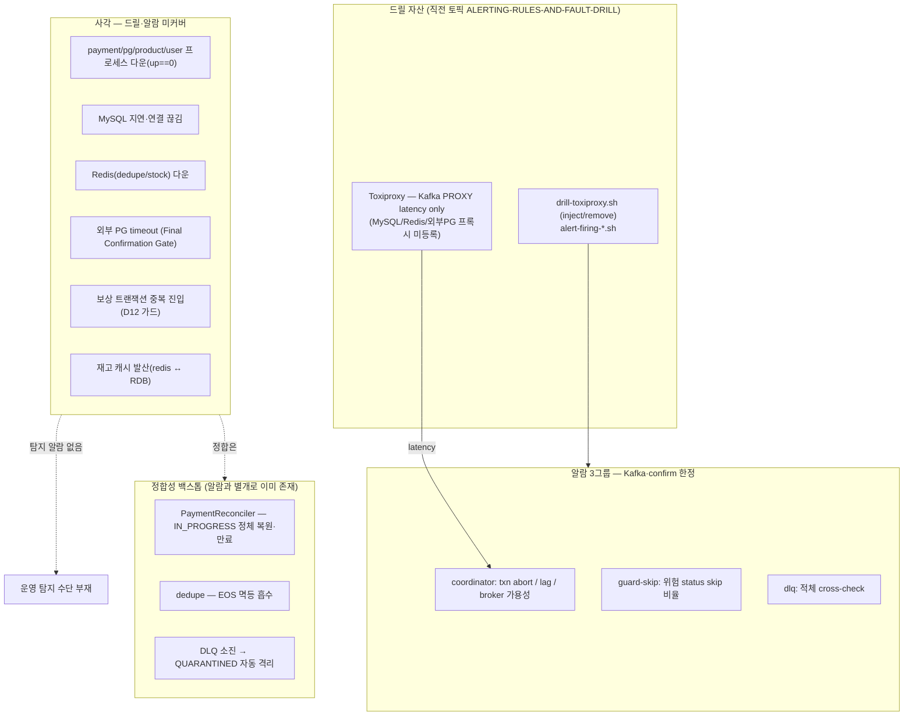
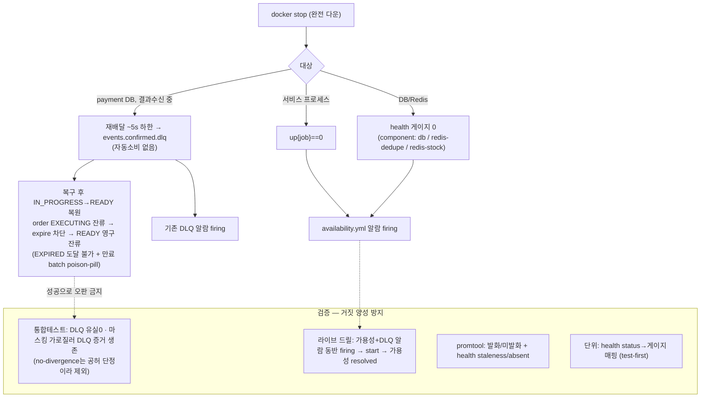

# 장애 주입 회복성 검증 설계 (FAULT-INJECTION-RESILIENCE)

> 최종 수정: 2026-06-29 (plan 게이트 reconcile — no-divergence 검증 포함→제외 번복, redis-dedupe 거동 정정)

## 사전 브리핑

### 현재 이해한 문제

결제 플랫폼은 DB·Redis·Kafka·외부 PG·서비스 프로세스 등 여러 인프라 장애에 노출되지만, 직전 작업에서는 **Kafka 지연 1종**만 드릴로 검증했다. 나머지 장애 유형에서 (a) 결제·재고 **정합성이 백스톱(정합 스캐너·dedupe·DLQ)으로 유지되는지**, (b) 운영자가 장애를 **탐지할 알람이 있는지**가 미검증이다. 특히 **서비스/DB/Redis 가용성에는 알람 자체가 없다** — 현 알람 3그룹은 전부 Kafka·confirm 도메인 신호이고, prometheus가 각 서비스를 scrape하지만 `up{job="payment-service"}` 등에 걸린 규칙이 없어 프로세스 kill·DB 다운·Redis 다운은 어떤 알람도 울리지 않는다.

### 현재 시스템 동작 (as-is)

### 이번 discuss에서 결정하려는 것

- **스코프**: T4-A 8종 중 이번 토픽에 무엇을 담을지 (전부는 과대 — 묶음 분할 필요).
- **방향**: ① 가용성 알람 사각 메우기(서비스/DB/Redis `up`·가용성 신규 rule) / ② 정합성 불변식 실증(장애 시 백스톱이 결제·재고 정합 유지) / ③ 둘 다 — 어디에 무게를 둘지.
- **장애 주입 수단**: Toxiproxy 프록시를 MySQL·Redis까지 확장할지(인프라 작업 증가) vs `docker stop`/기존 Kafka 프록시로 커버 가능한 범위로 제한.
- **검증 깊이**: 결제·재고 정합 교차검증을 라이브 드릴로 볼지, 통합테스트 위임으로 둘지 (단일 broker·환경 제약 고려).

### 열린 질문 / 가정

- 가정: 기존 드릴 자산(drill 프로파일·`drill-toxiproxy.sh`·`alert-firing-*.sh`·가이드)을 재사용·확장한다.
- 질문: 신규 알람 rule 추가까지 갈지, 아니면 "장애 → 기존 백스톱이 정합 유지"를 실증하는 데 집중할지.
- 질문: 보상 중복 진입(D12)·FCG PG timeout은 도메인 불변식 검증(통합테스트)이 더 적합한가, 라이브 드릴 대상인가.
- 질문: 단일 broker처럼 환경상 결정적 재현이 어려운 장애는 직전 토픽처럼 격하 폴백으로 둘지.

---

## 요약 브리핑

### 결정된 접근

가용성 사각(서비스 프로세스/DB/Redis 다운)을 메운다. 서비스 다운은 `up{job}==0` 알람(rule-only), DB/Redis 다운은 actuator `HealthIndicator`를 **컴포넌트별 폴링 게이지**(payment redis는 dedupe/stock 2분리)로 브리지해 신규 `availability.yml` 그룹에서 탐지한다. 동시에 docker stop **완전 다운**에서 백스톱이 정합을 유지하지 못하는 **실제 전이**(결과수신 중 DB 다운 → ~5s 후 `events.confirmed.dlq` stranded → IN_PROGRESS→READY 복원하되 order EXECUTING 잔류로 **EXPIRED 도달 불가·READY 영구 잔류 + 만료 batch poison-pill** → 벤더 과금+미이행 stranded)를 통합테스트 단정(**DLQ 유실0**·expire 차단/READY 잔류를 가로질러 DLQ 증거 생존)으로 고정한다. no-divergence(over-sell 0)는 공허 단정이라 제외(별 토픽 위임). 신규 복구 로직은 만들지 않고(TQ-1/TC-3 위임), 위험을 드러내고 가용성+DLQ 알람으로 탐지하는 데까지가 범위다.

### 변경 후 동작 (to-be)

### 핵심 결정 목록

- 서비스 다운 = `up==0` rule-only / DB·Redis 다운 = actuator health → **컴포넌트별 폴링 게이지**(payment redis dedupe/stock 분리, 전용 prefix, staleness·absent 분기).
- 신규 `availability.yml` 그룹, health 브리지는 4서비스 db + payment/pg redis (infrastructure/metrics 배치).
- 장애 주입은 docker stop 완전 다운만(Toxiproxy 미확장).
- 정합 검증은 "이상적 복원"이 아니라 **실제 전이 단정으로 거짓 양성 차단**; load-bearing은 DLQ 유실0. **no-divergence(over-sell 0)는 이 토픽 통합테스트에서 제외**(plan 게이트 reconcile 2026-06-29) — `resetToReady` 단독은 §18 발산 3전제 미충족이라 violation 불가능한 공허 단정이고, exactly-once 차감은 기존 `PaymentEosIntegrationTest`가 이미 가드. over-sell 실구동 회귀 시드는 도메인 정합 별 토픽 위임.
- **신규 복구 로직 없음** — 자동 복구는 TQ-1(DLQ 재주입)·TC-3(재고 재동기) 위임.

### 트레이드오프 / 후속 작업

- 완전 다운만 다뤄 DB/Redis **지연·부분 장애**는 사각 잔존(Toxiproxy 확장 별 토픽).
- over-sell 발산은 §18 3전제 미충족이라 redis ≤ RDB 단정이 공허 → **이 토픽 통합테스트에서 제외**. 발산 실제 구동(§18 전제 시드) 회귀는 도메인 정합 별 토픽으로 위임.
- expire 차단 READY 영구 잔류·DLQ-stranded·만료 batch poison-pill은 **가시화까지**, 자동 회복은 TQ-1/TC-3.

---

## 문제 정의

서비스 프로세스·DB·Redis 가용성에 대한 탐지 알람이 없다. 직전 토픽의 알람 3그룹은 Kafka·confirm 도메인 신호 한정이고, prometheus가 각 서비스의 `/actuator/prometheus`를 scrape하지만 `up{job=...}` 에 걸린 규칙이 없어 **프로세스 다운조차 알람이 없다**. 더 까다로운 건 **DB/Redis 다운**이다 — docker stop으로 의존성만 죽이면 서비스 프로세스는 살아있어 `up=1`이고, 현재 노출 메트릭(도메인 health `payment_health_*`)은 인프라 의존성 상태를 담지 않아 **어떤 신호로도 보이지 않는다**.

두 번째 문제는 그 장애에서의 **정합 거동**이다. discuss 게이트(domain-expert)가 밝힌 핵심: docker stop **완전 다운(분 단위)** 에서는 백스톱이 정합을 유지하지 못한다. confirm 결과 수신 중 payment MySQL이 다운되면 리스너 DB 쓰기가 실패하고 에러 핸들러가 **~5초(1s×5)만 재시도한 뒤 `events.confirmed.dlq`로 흘린다**(자동 소비자 없음 — CONCERNS C-5). 복구 후 재배달은 없고 결제는 IN_PROGRESS 잔류 → `PaymentReconciler`가 READY로 복원하지만, 이때 `PaymentOrder`는 **EXECUTING으로 잔류**해 이후 `PaymentExpirationServiceImpl`의 `order.expire()`(NOT_STARTED 전용)가 **INVALID_STATUS_TO_EXPIRE로 차단** → **EXPIRED 도달 불가, 결제는 READY로 영구 잔류**(plan 게이트 실측 정정 2026-06-30). 즉 **벤더 APPROVED인데 주문 미이행·재고 미차감·redis 선차감 미보상(stranded)** 이 비종결 READY로 고착되고, 만료 batch가 단일 `@Transactional`이라 이 stranded event 1건이 무관한 정상 READY 만료까지 롤백시키는 **poison-pill**이 된다(CONCERNS L-14). 또 IN_PROGRESS 정체분의 `resetToReady` 재confirm cascade는 redis↔RDB 발산(over-sell 방향, PITFALLS §18·CONCERNS L-7/L-12)의 진입점이다.

따라서 이 토픽은 (1) 서비스/DB/Redis 가용성을 직접 신호화해 알람 사각을 메우고, (2) 그 장애에서의 **실제 전이(DLQ-stranded·expire 차단 READY 잔류·poison-pill)를 통합테스트 단정으로 고정**해 "백스톱이 정합 유지"라는 거짓 양성을 막으며, (3) 그 위험을 가용성+DLQ 알람으로 탐지 가능하게 한다. **신규 복구 로직은 만들지 않는다** — 위험을 드러내고 탐지하는 데까지가 범위이고, 자동 복구는 TQ-1(DLQ 재주입)·TC-3(재고 재동기)로 위임한다.

## 영향 범위

| 구분 | 대상 | 비고 |
|---|---|---|
| **신규 (앱)** | 각 서비스 `infrastructure/metrics` 에 의존성 health → 게이지 브리지 | 메커니즘(AtomicLong + `@Scheduled` 폴링 + `Gauge`)은 `PaymentHealthMetrics` 계승, **배치는 infrastructure/metrics**(인프라 신호이므로 `core/common/metrics` 아님) |
| **신규 (관측)** | `observability/prometheus/rules/availability.yml` 알람 그룹 | 서비스 프로세스 다운 + 의존성 health 다운 + health 게이지 staleness |
| **신규 (드릴/검증)** | `scripts/smoke/` 다운 주입·발화 검증 스크립트, smoke 가이드 확장 | docker stop/start 기반 |
| **신규 (테스트)** | ① health 브리지 단위테스트(status→게이지 매핑) ② DB/Redis 다운→복구 정합 통합테스트 | test-first |
| **변경 없음** | 결제 상태 전이 도메인, 알람 3그룹, Toxiproxy 드릴 프로파일 | 가용성은 별개 신호 축 |
| **서비스별 의존성** | payment = db + **redis-dedupe(6379) + redis-stock(6380)** 2개 / pg = db + redis / product·user = db only | health 컴포넌트 분리에 반영 |

## 설계 옵션 비교

### 의존성 health 를 메트릭으로 노출하는 방식

- **전체 health 단일 게이지 방식**: `HealthEndpoint.health().getStatus()` 하나만 게이지화. 구현 최소지만 **어느 의존성이 죽었는지 구분 불가** → 알람 가치 낮음.
- **컴포넌트별 health 게이지 방식**: `HealthContributorRegistry`/개별 `HealthIndicator`에서 컴포넌트별 status를 `component` 라벨 게이지(1=UP, 0=그외)로 노출. **채택**. payment는 RedisConnectionFactory가 2개(`redisConnectionFactory`=dedupe 6379 / `stockCacheRedisConnectionFactory`=stock 6380)라 Spring이 `redis`를 composite로 묶으므로, **`redis-dedupe`/`redis-stock` 으로 컴포넌트를 분리**해야 한다 — 단일 redis 게이지는 stock 다운을 dead branch로 만들거나(default만 읽을 때) 식별 불가(composite)가 되어, 이 옵션을 채택한 이유(어느 의존성이 죽었는지 식별)를 스스로 무력화한다(직전 토픽 `kafka_brokers` dead branch와 동형 리스크).

### 게이지 갱신 시점

- **scrape 시점 콜백 게이지**: Micrometer `Gauge` 콜백이 scrape마다 health 조회 → DB/Redis ping이 scrape 빈도로 발생(부하·타임아웃 시 scrape 지연).
- **폴링 갱신 게이지**: `@Scheduled`로 주기 조회해 AtomicLong 갱신, scrape는 값만 읽음. **채택**. 단 health 조회(`SELECT 1`/redis ping)가 Hikari `connectionTimeout`(기본 30s)까지 블로킹하면 단일 폴러가 직렬화·지연되어 게이지가 stale(직전 1=UP) 유지 → **다운 알람 false-negative** 위험 → health 조회에 **짧은 타임아웃(예 2s)** + 폴링 게이지 **staleness/`absent` 알람 분기**(PITFALLS §24 absent 처방과 동형)로 보강.

### health 브리지 적용 서비스 범위

- **결제 직결 2서비스 한정(payment/pg)**: 변경 최소. 단 product(재고 SoT)·user DB 다운 사각 잔존.
- **4서비스 전체**: db health 4서비스 + redis health payment/pg. 동형 코드라 확장 비용 낮음. **채택**(plan 에서 서비스당 1태스크).

### 가용성 알람 그룹 배치

- **기존 그룹에 편입**: 도메인 신호와 인프라 신호 혼재.
- **신규 `availability.yml` 그룹**: 서비스 `up==0` + 의존성 health 다운 + staleness를 한 그룹으로. **채택**.

## 결정 사항

| 항목 | 결정 | 이유 |
|---|---|---|
| 서비스 프로세스 다운 탐지 | `up{job=~"...service"} == 0` 알람 (rule-only) | scrape 타깃 이미 존재, 앱 코드 무관 |
| DB/Redis 다운 탐지 | 컴포넌트별 health 게이지(폴링 갱신, 1=UP/0=그외), payment redis는 **`redis-dedupe`/`redis-stock` 2컴포넌트 분리** | 어느 의존성이 죽었는지 식별 + stock 다운 dead branch 방지 |
| 게이지 메트릭 이름 | 도메인 `payment_health_*` 와 구분되는 **의존성 가용성 전용 prefix**(예 `dependency_up{component=...}`, 최종명은 plan) | 인프라 신호 ↔ 도메인 신호 네이밍 충돌 회피 |
| health 조회 안정성 | 조회 타임아웃 짧게(예 2s) + 게이지 **staleness/absent 알람 분기** | 폴러 블로킹 시 stale=UP false-negative 차단 |
| health 브리지 범위 | 4서비스 db + payment/pg redis(payment redis 2종) | 동형 코드, 사각 완전 제거 |
| 알람 그룹 | 신규 `availability.yml` | 인프라 가용성 ↔ 도메인 신호 관심사 분리 |
| 장애 주입 수단 | docker stop/start (Toxiproxy 미확장) | 완전 다운만 — 지연/끊김 정밀 주입 제외 |
| 정합 검증 성격 | **실제 전이를 단정으로 고정(거짓 양성 방지)** — "이상적 복원" 단정 금지 | 완전 다운에서 백스톱이 정합 유지 못 함이 게이트로 드러남 |
| 정합 백스톱 | 기존 `PaymentReconciler`/dedupe/QUARANTINED **검증만**, 신규 복구 로직 없음 | 가용성 토픽 — 자동 복구는 TQ-1/TC-3 위임 |

## 장애 시나리오와 대응

| 장애 (docker stop, 완전 다운) | 기대 신호 | 실제 거동 (백스톱 + 한계) |
|---|---|---|
| 서비스 프로세스 다운(payment/pg/product/user) | `up{job}==0` → firing | Eureka 제외, 재기동 시 복귀. 무상태라 정합 영향 없음 |
| payment MySQL 다운 — confirm 결과수신 중 | db health 0 + EOS 실패 누적 시 `events.confirmed.dlq` offset↑ → 가용성+DLQ 알람 | 재배달 backoff **~5s(1s×5)는 하한** — 실 DLQ 도달은 Hikari 커넥션 획득 지연에 좌우(자동소비 없음, C-5). 복구 후 재배달 없음 → IN_PROGRESS 잔류 → `PaymentReconciler` IN_PROGRESS→READY(300s). 단 `PaymentOrder`는 EXECUTING 잔류 → `PaymentExpirationServiceImpl`의 `order.expire()`(NOT_STARTED 전용)가 **INVALID_STATUS_TO_EXPIRE로 차단 → EXPIRED 도달 불가, READY 영구 잔류 + 만료 batch poison-pill**(plan 실측 — L-14). **벤더 과금+미이행 stranded**(돈 새는 경로, 비종결 READY 고착). load-bearing 단정은 **DLQ 유실0**(시간 무관); 마스킹 시도는 expire 차단·READY 잔류로 단정(EXPIRED 미도달) |
| payment MySQL 다운 — confirm 진입 부분창(DECR 후 TX 진입) | db health 0 → 알람 | redis 선차감 후 `executeConfirmTx` 실패 → event READY 잔류, 선차감 retention(보수적 stranded redis<RDB, TC-3 위임) |
| payment IN_PROGRESS 정체 → reconciler `resetToReady` | (정체 동안) db health | reset은 READY 복원만 — 새 outbox 미생성이라 **자동 재confirm 없음**. over-sell 발산은 §18 전제(`compensation:done` 토큰 + 재confirm + 벤더 APPROVED) 동시 충족 시에만 발생 → **resetToReady 단독으로는 미구동**. 따라서 redis ≤ RDB(over-sell 0) 단정은 violation 불가능한 공허 단정 → **이 토픽 통합테스트에서 제외**(over-sell 회귀 시드는 별 토픽 위임). exactly-once 차감은 기존 `PaymentEosIntegrationTest`가 가드 |
| payment redis-dedupe(6379) 다운 | `redis-dedupe` health 0 → 알람 | **체크아웃 멱등(`IdempotencyStore`, 6379) 호출 자체가 차단점** — `IdempotencyStoreRedisAdapter`가 redis 다운 시 예외 전파(fail-open 폴백 없음) → checkout **fail-closed(5xx)** → 결제 생성 차단 = **가용성 저하**(중복 과금 경로 없음). EOS 메시지 멱등 `payment_event_dedupe`는 MySQL이라 redis-dedupe 무관 — `db` 컴포넌트 귀속 |
| payment redis-stock(6380) 다운 — confirm 진입 | `redis-stock` health 0 → 알람 | 선차감 실패 → CACHE_DOWN → QUARANTINED 격리(선차감 0이라 무누수) |
| payment redis-stock 다운 — 결과수신(FAILED/QUARANTINED) | `redis-stock` health 0 + DLQ↑ | `compensateAtomic` 실패 → EOS abort → 재배달 ~5s → DLQ. **보상 미수행 → 선차감 stranded**(redis<RDB 보수적, DLQ 영구) — entry 경로와 달리 QUARANTINED로 흡수 안 됨 |
| product MySQL 다운 | product db health 0 → 알람 | 재고 SoT 조회 실패 → 결제 진입 차단/실패 경로 |
| 의존성 복구(start) | health 게이지 1 복귀 → 가용성 resolved | 정체분 일부 reconciler 회수, **DLQ-stranded·READY 영구 잔류분은 자동 회복 안 됨**(가시화까지 — TQ-1) |

## 검증 전략

- **통합테스트 (거짓 양성 방지 — 실제 전이 단정)**: DB/Redis 다운→복구 사이클에서 "이상적 복원"이 아니라 실제 전이를 단정으로 고정한다.
  - 결과수신 중 DB 다운: 재배달 ~5s 바운드 후 `events.confirmed.dlq` **메시지 보존(유실 0)** 단정.
  - 복구 후 reconciler 명시 호출 → event READY + order EXECUTING 잔류 단정. expiration 명시 호출 시 `order.expire()`가 **INVALID_STATUS_TO_EXPIRE로 차단(EXPIRED 도달 불가)** + event는 READY 잔류 단정. 그 전이 시도를 **가로질러 `events.confirmed.dlq` 메시지 유실0 보존(= silent 아님; DLQ 메시지 생존→기존 DLQ 알람)** load-bearing 단정. (plan 게이트에서 "EXPIRED 2단 마스킹" 전제가 실제 코드와 다름이 실측됨 — order EXECUTING이 expire를 차단, CONCERNS L-14.)
  - redis-stock 결과수신 보상 실패: DLQ 보존 + 선차감 **stranded(redis ≤ RDB 보수적 갭만 허용)** 단정.
  - **no-divergence (over-sell 0): 이 토픽 통합테스트에서 제외**(plan 게이트 reconcile 2026-06-29). `resetToReady` 단독은 §18 전제(`compensation:done` 토큰+재confirm+APPROVED) 미충족이라 발산을 구동하지 못해 redis ≤ RDB 단정이 violation 불가능한 공허 단정이 된다 → 충실한 가드가 못 되므로 제외. exactly-once 차감 불변식은 기존 `PaymentEosIntegrationTest`(+ Lua dedup 토큰)가 이미 가드하고, 발산을 실제 구동하는 §18 전제 시드는 도메인 정합 별 토픽으로 위임.
- **라이브 드릴**: docker stop으로 서비스/DB/Redis 다운 → 가용성 게이지 0 + (해당 시)DLQ offset↑ → **가용성 알람 + 기존 DLQ 알람 동반 firing** 폴링 → start → 가용성 resolved(DLQ-stranded는 미해소 — 가시화 한계 명시). 직전 토픽 `alert-firing-*.sh` 패턴 확장.
- **promtool**: `availability.yml` 규칙 발화/미발화 + **health 게이지 staleness/absent 분기** 픽스처 회귀 고정.
- **단위테스트**: health 브리지 status→게이지 매핑(UP=1 / DOWN·OUT_OF_SERVICE·UNKNOWN=0 / composite 컴포넌트 처리) test-first.

## 제외 범위

- **DB/Redis 지연·연결 끊김(부분 장애)** — docker stop 완전 다운만. Toxiproxy DB/Redis 프록시 확장 제외(정밀 지연 주입은 별 토픽).
- **외부 PG timeout(FCG)·보상 중복 진입(D12)** — 도메인 정합 묶음(별 토픽).
- **발산/EXPIRED 마스킹/DLQ-stranded를 막는 신규 복구 로직** — 이 토픽은 그 위험을 **드러내고 탐지**하는 데까지. 자동 복구(DLQ 재주입·재고 재동기)는 **TQ-1·TC-3 위임**.
- **no-divergence(redis ≤ RDB over-sell 0) 단정** — `resetToReady` 단독은 §18 발산 3전제 미충족이라 violation 불가능한 공허 단정이라 통합테스트에서 제외(plan 게이트 reconcile 2026-06-29, domain-expert 동의). exactly-once 차감은 기존 `PaymentEosIntegrationTest`가 가드하고, 발산 실구동 회귀 시드는 도메인 정합 별 토픽 위임. (discuss에선 "안전방향 회귀 가드로 검증 포함"이었으나 plan에서 공허성 확인 후 번복.)
- **MySQL/Redis exporter 도입** — health 브리지로 대체.
- **Alertmanager 통지 채널** — rule 평가까지만.

## 참고

- 직전 토픽: `docs/archive/alerting-rules-and-fault-drill/COMPLETION-BRIEFING.md` (드릴 자산·알람 3그룹)
- `docs/context/TODOS.md` T4-A·Phase 5 / TQ-1(DLQ 재주입)·TC-3(재고 재동기) 위임처
- `docs/context/CONCERNS.md` C-5(DLQ 자동소비 부재)·L-7/L-12(resetToReady 발산), `docs/context/PITFALLS.md` §18(재confirm cascade)·§24(absent 처방)
- `payment-service/.../metrics/PaymentHealthMetrics.java`(게이지 메커니즘), `PaymentReconciler.java`(IN_PROGRESS→READY)·`KafkaErrorHandlerConfig.java`(재시도 바운드→DLQ)·`OutboxAsyncConfirmService.java`(선차감 retention)·`RedisConfig.java`/`StockRedisConfig.java`(2 RedisConnectionFactory)
