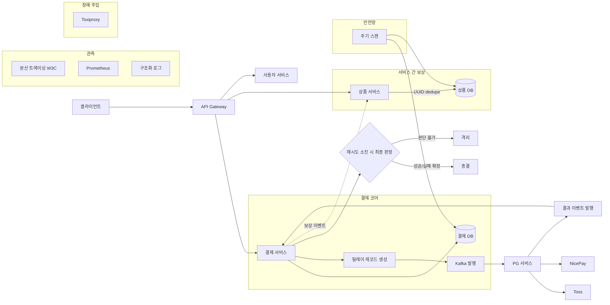
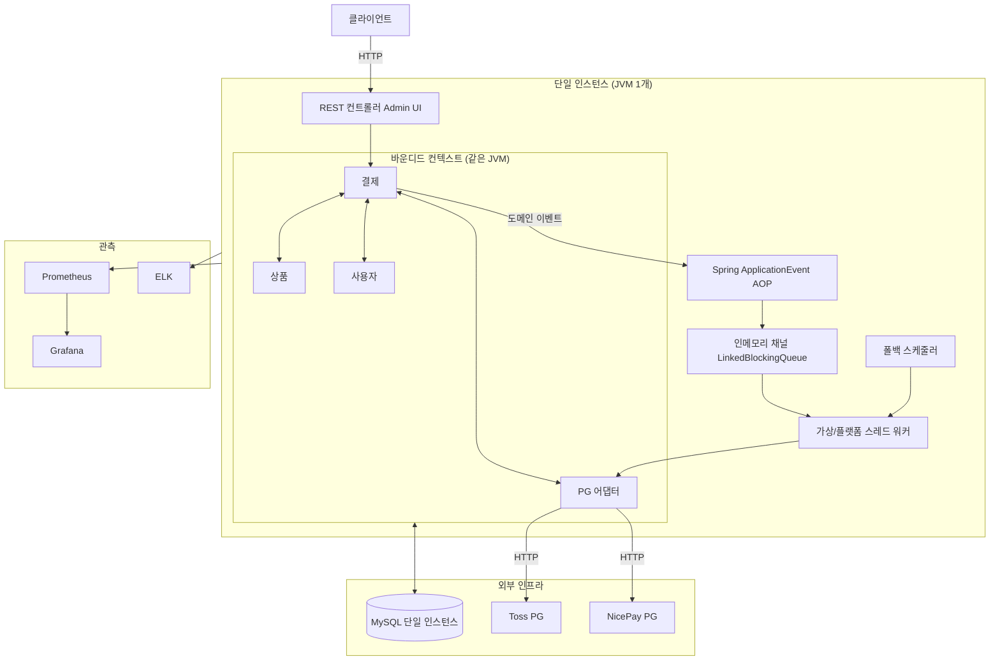
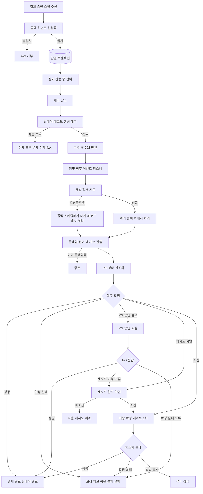
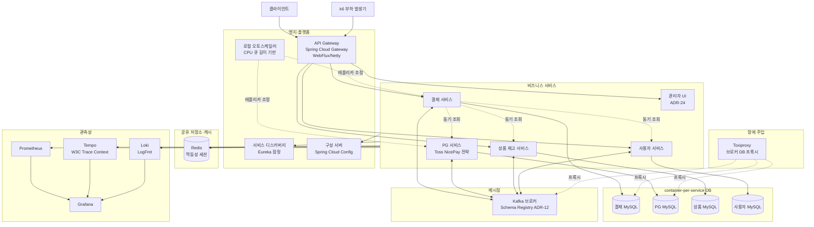
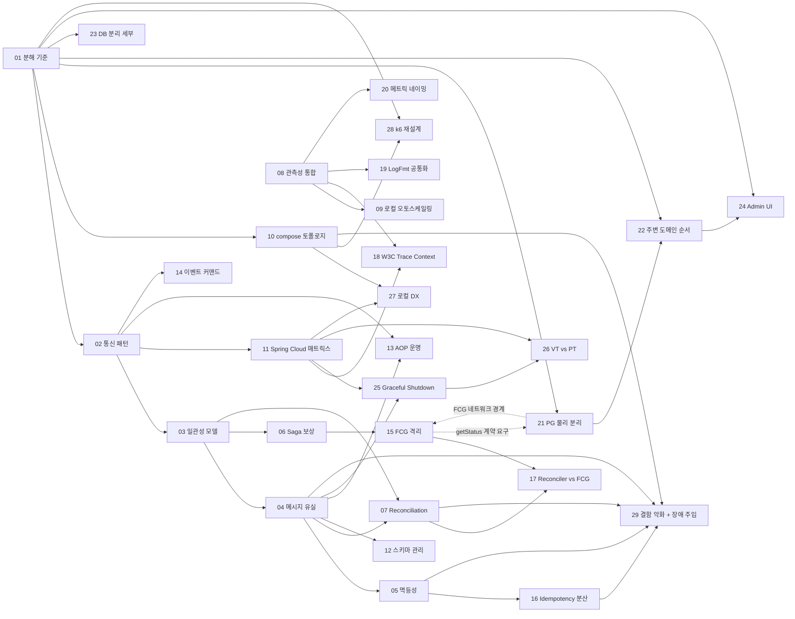

# MSA-TRANSITION

## 요약 브리핑

### 1. 결정된 접근

모놀리스를 **컨테이너 단위 서비스 분리 + 데이터베이스 완전 물리 분리** 구조로 전환한다. 분산 트랜잭션을 원천 배제하고, **DB 진실의 원천 + Kafka 전달 수단 + at-least-once + 멱등 consumer + Saga(Choreography 기본, 결제 승인만 Orchestrator 고려) + Reconciliation 루프** 5중 방어선으로 최종 정합성을 달성한다. 현 결제 비동기 자산(릴레이 테이블 · 복구 사이클 · FCG · 격리 상태)은 각 서비스의 로컬 책임으로 이관되며, `@PublishDomainEvent` AOP의 "감사 원자성"(같은 트랜잭션 리스너)은 결제 서비스 내부에 잔류시켜 끊지 않는다. 스택은 Spring Cloud 잠정안(Eureka · Gateway · Config · Resilience4j · Micrometer Tracing) + raw Spring Kafka로 시작하되 ADR별로 탈락 가능. **런타임은 Gateway만 WebFlux(Netty), 내부 서비스는 MVC + Virtual Threads**로 고정 — 리액티브 확산 금지. 검증은 **Toxiproxy 수준 장애 주입**까지 목표.

### 2. 변경 후 동작 (to-be — 상위 흐름)

### 3. 핵심 결정 ID

- **ADR-01** 서비스 분해 경계 (P0) — 3~5서비스 중 plan에서 확정
- **ADR-03** 최종 정합성 모델 (P0) — Saga Choreography 기본 + 결제 승인 Orchestrator 검토
- **ADR-04** 메시지 유실 대응 (P0) — Transactional Outbox(DB-first) 기본, CDC 보조 검토
- **ADR-05** 멱등성·중복 처리 (P0) — **Toss `ALREADY_PROCESSED_PAYMENT` / NicePay `2201` 가면 방어 Phase 1 전제**
- **ADR-12** 이벤트 스키마 관리 — 포맷(Avro/Protobuf/JSON) × PG 에러 코드 귀속(어댑터-local vs 도메인 중립 enum 매핑) 조합을 plan에서
- **ADR-13** `@PublishDomainEvent` AOP 운명 — 감사 원자성 유지 가능한 (a)/(a') 권고. 감사 분리(c)는 원자성 포기 tradeoff
- **ADR-15 × ADR-21** FCG × PG 분리 계약 — PG `getStatus` raw state 반환 + FCG timeout 시 격리 불변
- **ADR-16** Idempotency 저장소 분산화 — UUID 키 + consumer 소유 dedupe 테이블 수락 기준 확정
- **ADR-23** DB 분리 정책 — **container-per-service 확정** (Round 0)
- **ADR-29** 장애 주입 도구 스택 — Toxiproxy 포함 (Round 0)
- **§ 2-8 / ADR-11** 런타임 스택 — **Gateway만 WebFlux(Netty), 내부 서비스는 MVC + Virtual Threads**. 리액티브는 엣지 이후 전파 금지

### 4. 알려진 트레이드오프 / 후속 작업

- **plan 단계에서 phase 분할 필수** — 총 29개 ADR + 전면 구현 + 로컬 오토스케일러 코드 범위가 한 PR에 담기지 않음. Phase 0(인프라) → 1(결제 코어) → 2(PG) → 3(주변 도메인) → 4(장애 주입·오토스케일) → 5(잔재 정리) 제안안
- **container-per-service 비용** — Mac Docker I/O 한계(≈100 req/s) 가 로컬 벤치마크 상한선으로 유지되며, 컨테이너 개수 증가 시 현실적 상한이 더 낮아질 수 있음
- **Spring Cloud 컴포넌트 탈락 가능성** — Eureka · Config Server는 plan 세부 검토에서 "필요 없다"로 뒤집힐 여지. 의사결정 자체가 ADR-11 자산
- **Domain Expert Round 2 minor** (후속 반영):
  - ADR-05: Toss `ALREADY_PROCESSED_PAYMENT` 경로에서 금액 검증 순서 명시
  - ADR-16: dedupe TTL 정량 기준 (Phase 4 장애 주입에서 false positive 방지)
  - § 6 Phase 1-3 이행 구간 `stock.restore` 보상 경로 소유자 명시
- **후속 TODO**: `INTEGRATIONS.md` 의 "AFTER_COMMIT, @Async" 문구 정리는 본 토픽 범위 밖 (현 AOP는 실제로 BEFORE_COMMIT + 같은 TX — `PaymentHistoryEventListener.java:20`)

---

## 사전 브리핑

### 1. 현재 이해한 문제

모놀리스로 운영 중인 결제 플랫폼을 마이크로서비스로 전환한다. 단순한 물리적 분해가 아니라 **서버가 언제 죽어도 최종 정합성이 보장되는 구조**를 목표로 한다. 무작정 Spring Cloud 스택을 박는 방식이 아니라, 각 결정이 "왜 이렇게 했는가"에 답할 수 있도록 **메시지 유실 대응, 중복 처리, 장애 격리, 관측성, 로컬 오토스케일링**까지 의도된 설계 기록을 남긴다. 실배포는 하지 않고 `docker-compose` 기반으로 로컬에서 MSA 경험을 완결한다.

### 2. 현재 시스템 동작 (as-is)

#### 2-1. 전체 토폴로지

#### 2-2. 결제 승인 비동기 처리 (as-is)

### 3. 이번 discuss에서 결정하려는 것

- **서비스 분해 경계** — 결제 / PG / 상품 / 사용자 / 관리자 UI를 몇 개 서비스로 쪼갤지, 남길 부분은 무엇인지
- **서비스 간 통신 패턴** — 동기(HTTP/gRPC)와 비동기(이벤트) 경계선, 현 Spring ApplicationEvent AOP의 운명
- **메시지 유실·중복 대응 뼈대** — 현 릴레이 테이블 + 워커 + 폴백 구조를 MSA에서 어떻게 진화시킬지 (전면 Kafka 전환 여부 포함)
- **멱등성 / 최종 정합성 / Reconciliation** — 크래시 지점 매트릭스에 대응하는 방어선 구성
- **관측성 자산 이행** — TraceId 전파, LogFmt, 메트릭 네이밍 규약의 공통화 방식
- **스택 선택 매트릭스** — Spring Cloud 컴포넌트별 채택/미채택 근거 (포터빌리티보다 제어권 우선 원칙)
- **로컬 오토스케일링 방식** — docker-compose 기반에서 HPA 원리를 어떻게 흉내낼지
- **이행 순서 (Strangler)** — 어떤 서비스부터 분리하고 어떤 것을 마지막까지 모놀리스에 둘지

### 4. 열린 질문 / 가정

- **보안 범위 제외** 확정 — 인증/인가, mTLS, 시크릿 관리, PCI 관련 결정은 이번 작업에서 다루지 않는다
- **실배포 제외** 확정 — k8s / 실 클러스터 대상 결정은 하지 않는다. docker-compose 안에서 완결
- **Spring Cloud 잠정안**(Eureka · Gateway · Config Server · Resilience4j · LoadBalancer · Micrometer Tracing · raw Spring Kafka)은 discuss 도중 개별 ADR에서 뒤집힐 수 있음
- **메시징은 Kafka 단일** — 현 릴레이 테이블을 Kafka 기반으로 갈아탈지는 ADR에서 판단. 갈아타더라도 "DB 진실의 원천 + Kafka 전달 수단" 원칙은 불변
- **현 알려진 결함**(재시도 중복 confirm, 보상 재고 이중 복원, AOP 이력 유실 등)이 MSA에서 **악화·개선·유지** 중 어디로 가는지도 이번에 점검한다
- **Mac Docker I/O 한계** 를 로컬 오토스케일링 평가를 고려한다
- **Admin UI**(Thymeleaf) 의 분리 여부는 후순위 — 결제 코어 분해가 선결
- **이벤트 스키마 포맷**(Avro / Protobuf / JSON Schema) 은 열린 질문 — 포터빌리티·검증·도구 생태계 관점에서 별도 ADR

---

## § 1. 배경 및 목표

### 1-1. 현재 모놀리스의 경계와 자산

- 단일 JVM / 단일 MySQL 위에 네 개의 바운디드 컨텍스트(`payment` · `paymentgateway` · `product` · `user`)가 헥사고날 layer 규칙을 따라 공존한다. 공통 DB를 통해 강한 일관성을 확보해 왔다.
- 결제 승인 경로는 이미 **비동기 단일 전략**으로 확정되어 있다. `OutboxAsyncConfirmService` 하나만 존재하며, 릴레이 테이블 + `PaymentConfirmChannel`(인메모리 큐) + `OutboxImmediateWorker`(즉시 처리) + `OutboxWorker`(폴백) + `OutboxProcessingService`(복구 사이클 · FCG · 격리) 조합이 최종 정합성의 현 방어선이다. (`docs/context/ARCHITECTURE.md`)
- PG 어댑터는 `PaymentGatewayStrategy` 기반으로 Toss · NicePay 이중 전략을 이미 수용한다. `PaymentEvent.gatewayType`이 이벤트 단위로 선택된다. (`docs/context/INTEGRATIONS.md`)
- Spring `ApplicationEvent` + AOP(`@PublishDomainEvent`, `@PaymentStatusChange`, `@TossApiMetric`)가 감사(audit) · 메트릭 전파의 축이다. **현 사실 재확인**: `DomainEventLoggingAspect`는 `@PublishDomainEvent`가 붙은 도메인 메서드가 끝난 직후 같은 스레드에서 `PaymentEventPublisher`로 Spring `ApplicationEvent`를 발행하고, 실제 감사 기록 주체인 `PaymentHistoryEventListener`는 `@TransactionalEventListener(phase = BEFORE_COMMIT)`로 **같은 TX 경계 안에서** `payment_history`에 insert 한다. 즉 **감사 원자성은 "AOP"가 아니라 "같은 TX 이벤트 리스너"가 보장**하고 있다. MSA 전환 시 취약점은 "AOP가 안 불린다"가 아니라 **`payment_history`가 cross-service 경계를 타면 상태 전이 TX와 감사 insert의 원자성이 깨진다** 쪽이다(Pitfall 10 재해석 — ADR-13 본문에서 상세화).
- 관측성 자산: `TraceIdFilter`(MDC 기반 traceId), `LogFmt`(LogDomain × EventType 구조화 로그), `MaskingPatternLayout`, `PaymentStateMetrics` / `PaymentHealthMetrics` / `PaymentTransitionMetrics` / `PaymentQuarantineMetrics` / `TossApiMetrics` 5종 Micrometer 메트릭.

### 1-2. 전환의 동기 — "서버가 언제 죽어도 최종 정합성"

- 단순 분해가 목표가 아니다. 현 비동기 자산(릴레이 테이블 + 복구 사이클 + FCG + 격리)이 **단일 JVM / 단일 DB**라는 환경 가정에 묶여 있다. 이를 **프로세스·DB가 분리된 환경에서도 동일한 보증**이 성립하도록 재구성하는 것이 본질이다.
- 크래시 지점 확장: 프로세스 경계, 브로커 경계, 네트워크 경계, 컨테이너 재시작이 새로 생긴다. 각 지점에서 **at-least-once + 멱등 consumer + reconciliation + 격리**가 방어선이 되어야 한다.
- 포트폴리오 완결 관점: "왜 Spring Cloud 중 이것은 쓰고 저것은 안 쓰는가"라는 의사결정 기록을 ADR 29건으로 남겨, 스택 선택이 유행이 아닌 **제어권/교체 비용 기반 판단**임을 증명한다.

### 1-3. 비목표 (non-goals)

- **보안** — 인증·인가, mTLS, Secret 관리, PCI 준수는 본 토픽 범위 밖.
- **실배포** — Kubernetes, 실제 클라우드, CI/CD 파이프라인은 본 토픽 범위 밖. `docker-compose` 단일 환경에서 완결.
- **성능 절대값 목표치** — Mac Docker VirtioFS I/O 한계(약 100 req/s, DB ops ~600/s; STACK.md) 때문에 TPS/latency 절대값 기준은 세우지 않는다. 대신 **상대 비교**(분해 전 vs 분해 후 동일 한계 내에서 정합성 유지)와 **장애 주입 후 최종 정합성 복원 여부**를 본다.
- **현재 발견된 결함의 즉시 제거**(CONCERNS.md의 `E03002` 중복, `EO3009` 오타, `recoverTimedOutInFlightRecords` 중복 confirm, 보상 재고 이중 복원 등)는 ADR-29에서 **MSA 전환이 악화시키는지만 점검**하고, 개별 수정은 후속 토픽으로 분리.
- **이벤트 스키마 포맷 완전 고정** — ADR-12에서 방향은 결정하되, 전면 Avro/Protobuf 도입의 러닝커브는 phase 3 이후로 미룰 수 있음.

### 1-4. 성공 조건 (관찰 가능한 형태)

- 29개 ADR 모두 "결정 · 근거 · 기각된 대안 · 검증 방법" 4요소를 갖는다.
- docker-compose 상에서 모든 서비스가 기동되고, k6 기반 결제 시나리오가 통과한다.
- Toxiproxy(또는 동등 도구)로 **브로커 지연 · DB 지연 · 프로세스 kill** 3종 장애를 주입했을 때 **최종 정합성**(재고 일치 + 결제 상태 종결)이 복원된다.
- 로컬 오토스케일러 코드가 CPU/큐 길이 기반으로 결제 서비스 레플리카를 조정한다(설계 의도를 보이는 수준 — 절대 TPS 목표 없음).

---

## § 2. 이행 원칙 (결정 사항)

본 섹션의 각 항목은 이번 discuss에서 확정된 **결정 사항**이며, § 4 ADR 인덱스의 개별 의사결정이 기대는 **전제**다. 개별 결정 질문 · 기각된 대안의 세부는 § 4 ADR 표로 귀속한다.

### 2-1. Strangler Fig — 분리 순서와 잔재 허용

- 모놀리스를 먼저 죽이지 않는다. **결제 코어 → PG → 주변 도메인 → Admin UI** 순으로 절개하며, 각 단계 사이에 모놀리스가 공존한다. 분리 중인 서비스와 모놀리스가 같은 이벤트 토픽을 공유하거나, Gateway가 둘 사이를 라우팅한다.
- 잔재 허용 범위: Admin UI(Thymeleaf)는 본 토픽에서 분리 여부를 ADR-24에서 판단하되, 미분리를 기본값으로 둔다. 관리자 쿼리가 여러 서비스 DB를 직접 건드릴 수 없게 되므로 `AdminPaymentQueryRepositoryImpl`의 QueryDSL 자산은 **조회 전용 서비스로 흡수되거나 이벤트 기반 Read Model**로 재구성해야 한다 (ADR-24).

### 2-2. DB = 진실의 원천, Kafka = 전달 수단

- **DB 분리 정책은 container-per-service 확정**(Round 0 interview) — 서비스별 MySQL 컨테이너, 분산 트랜잭션 불가.
- 이벤트의 권위 있는 상태는 **각 서비스의 DB**에만 있다. Kafka는 상태를 전달할 뿐 **저장소가 아니다**. Kafka 보관 기간이 지나도, 각 서비스의 릴레이 테이블/상태 테이블로부터 재발행이 가능해야 한다.
- 릴레이 테이블(현재 `payment_outbox`)은 **각 서비스가 자기 DB 안에 소유**하는 형태로 일반화된다(ADR-04/16).

### 2-3. at-least-once + 멱등 consumer (exactly-once 포기)

- Kafka exactly-once(트랜잭셔널 프로듀서/컨슈머)를 포기한다. 이유:
  - container-per-service에서 트랜잭셔널 참여자가 늘어날수록 조정 비용이 급증.
  - Mac I/O 한계에서 Kafka 트랜잭션 오버헤드가 측정 가치보다 크다.
- **consumer 멱등성**이 이 결정의 전제 조건이다. 멱등성 키의 소스·수명·충돌 처리는 ADR-05/16에서 결정.

### 2-4. Saga — Choreography 기본, 필요 시 Orchestrator

- 기본 패턴: **Choreography**(서비스가 이벤트를 구독·발행해 상태를 자력으로 이행). 결합도를 낮추고 각 서비스의 삭제·교체 비용을 낮춘다.
- 예외: 결제 승인처럼 **여러 서비스가 순차적으로 엮이고 보상이 복잡한** 플로우는 Orchestrator가 필요할 수 있다(ADR-06). Orchestrator를 도입하더라도 **상태 저장은 결제 서비스 DB 안**(진실의 원천 원칙 준수).

### 2-5. Reconciliation 루프 — 최종 안전망

- Saga · 멱등 consumer · FCG 모두가 실패한 경우의 최종 방어선. 각 서비스는 자기 도메인의 릴레이·상태 테이블을 **주기적으로 스캔**하여 종결되지 않은 레코드를 복구 대상으로 집어낸다(ADR-07/17).
- FCG(Final Confirmation Gate)는 retry 소진 시 1회 재조회로 종결/격리를 판정하는 현 자산이며, reconciliation 루프는 그 상위(더 긴 주기, 더 넓은 스캔)에서 동작한다. 두 방어선의 역할이 겹치지 않도록 ADR-17에서 재정의.

### 2-6. Hexagonal 배치 원칙 — 신규 컴포넌트 layer 매핑

본 토픽이 도입하는 신규 컴포넌트(Kafka producer/consumer, 분산 Idempotency 저장소, API Gateway, Service Discovery, Config Server, Resilience4j 래퍼, 로컬 오토스케일러)는 **기존 hexagonal 규칙**(port → domain → application → infrastructure → controller) 위에 다음과 같이 배치된다. 이는 개별 ADR 결정의 **방향성 제약**이며, 특정 기술 선택(Kafka vs Pulsar, Redis vs DB 테이블)은 adapter 구현체로만 드러낸다.

- **Domain** (`<service>/domain`): 결제 도메인 이벤트 payload 값 객체, Saga 상태 머신(Orchestrator 채택 시 상태 enum · 전이 규칙), 릴레이 레코드 값 객체(현 `PaymentOutbox` 승계), 멱등성 키 값 객체. Spring 의존 없음.
- **Application/port** (`<service>/application/port/{in,out}`): 모든 신규 **outbound 포트**의 소유지. `MessagePublisherPort`(outbox relay 발행), `MessageConsumerPort`(이벤트 구독 추상), `IdempotencyStore`(현 `application/port/IdempotencyStore` 승계), `PgStatusPort`(PG 서비스 분리 시 ADR-21), `ReconciliationPort`. **inbound 포트**는 기존 관례대로 `<service>/presentation/port`에 둔다.
- **Application/service** (`<service>/application/usecase` · `application/service`): Saga orchestrator(채택 시), reconciliation 루프 로직, FCG 게이트 로직, consumer 측 비즈니스 처리(멱등성 판정 포함). 트랜잭션 경계는 여기서 선언.
- **Infrastructure/adapter** (`<service>/infrastructure/adapter/...`): Kafka producer 어댑터(`messaging/KafkaMessagePublisher`), Kafka consumer 어댑터(`messaging/consumer/...` — Spring Kafka listener는 여기), Redis 멱등성 어댑터(`idempotency/RedisIdempotencyStore`), Resilience4j 래퍼, PG HTTP 클라이언트(분리 시 `PgStatusHttpAdapter`), Eureka 클라이언트 설정. **기술 의존은 infrastructure 밖으로 새지 않는다**.
- **Infrastructure/config**: Spring Cloud Gateway route 정의, Discovery client config, Config Server client config는 `infrastructure/config` 하위 Spring `@Configuration` 클래스로 배치. Application 계층은 이들의 존재를 모른다.
- **Presentation** (`<service>/presentation`): REST 컨트롤러는 기존 위치 유지. 이벤트 소비는 controller가 아닌 consumer 어댑터(infrastructure) 경유로만 진행한다.

**포트 인터페이스 위치 원칙**: 모든 신규 포트는 `application/port/{in,out}` 하위에 둔다. `infrastructure/port`는 사용하지 않는다(기존 프로젝트 관례 승계 — `PaymentGatewayPort`, `ProductPort`, `UserPort`, `IdempotencyStore` 모두 `application/port` 소유). 인프라 기술(Kafka · Redis · Eureka) 선택은 adapter 구현체로만 노출되며, port 시그니처는 기술 중립으로 유지한다.

**AOP 축의 재배치 원칙**: 현 `@PublishDomainEvent` · `@PaymentStatusChange` · `@TossApiMetric` AOP는 **서비스 내부 동일 JVM 안에서만** 유효함을 전제로 각 서비스에 **복제 배치**한다. cross-service 상태 전파는 AOP가 아니라 outbox relay + Kafka publisher로만 흐르게 한다. 이는 § 1-1에서 재해석한 "감사 원자성 = 같은 TX 리스너" 사실을 각 서비스 로컬로 축소 유지하기 위한 배치다(상세는 ADR-13).

### 2-7. 테스트 계층 — MSA 전환이 추가하는 계층

본 토픽의 검증은 기존 `./gradlew test` 단위/통합 테스트 관례를 **각 서비스 분리 phase에서 승계**하면서, MSA 경계에서 새로 생기는 계층을 다음과 같이 추가한다. 실 도구(Pact · Spring Cloud Contract · WireMock 등) 선택은 plan 단계에서 확정하며, 본 discuss에서는 **계층의 존재와 책임**만 확정한다.

- **단위 (unit)**: 도메인 엔티티 상태 전이, Saga 상태 머신 전이 규칙, 멱등성 키 해싱/동등성, `RecoveryDecision` 생성 — 기존 관례 승계.
- **통합 (integration)**: outbox relay → Kafka publisher 흐름(Testcontainers Kafka + MySQL), consumer 멱등성(동일 이벤트 2회 수신 시 부작용 1회), PG 어댑터 HTTP 레벨(기존 WireMock 패턴 승계).
- **계약 (contract)**: 서비스 간 이벤트 스키마(ADR-12에서 포맷 결정 후 구체화) · REST 경계의 consumer-driven contract. 본 discuss에서는 **"컨슈머 관점 스키마 고정 + provider 검증"** 책임의 존재만 확정(도구는 plan).
- **E2E · 부하 (k6)**: ADR-28이 재설계하는 k6 시나리오 — Gateway 경유 단일 시나리오 유지(a) / 서비스별 분리(b) / 상태 머신 재작성(c) 중 선택.
- **장애 주입 (chaos)**: ADR-29가 결정하는 Toxiproxy(a) / Chaos Mesh 경량(b) / 수동 스크립트(c). **브로커 지연 · DB 지연 · 프로세스 kill** 3종 최소 커버.

### 2-8. 런타임 스택 — 리액티브는 엣지 한정

- **API Gateway**: Spring Cloud Gateway 기본 스택인 **WebFlux(Netty + Reactor)** 채택. 필터 체인·라우팅·rate limit 전부 I/O 바운드라 구조적 적합. 비즈니스 로직 없음으로 Mono/Flux 학습 영역이 필터 범위로 제한됨.
- **내부 서비스**(결제·PG·상품·사용자·관리자): **MVC + Virtual Threads** 유지. VT가 "동기 코드로 비동기 처리량"을 제공하므로 WebFlux 대안으로 충분. R2DBC(MySQL 지원 불안정)·Reactor Kafka·MDC 재구축·스택 다원화 비용을 회피한다.
- **경계 원칙**: 리액티브는 Gateway 이후로 전파되지 않는다. Gateway → 서비스는 일반 HTTP/REST + W3C `traceparent` 헤더로 MDC 전파(ADR-18). 이 원칙은 ADR-26(VT vs PT)·ADR-21(PG 물리 분리)의 전제다.

---

## § 3. 제안 목표 토폴로지 (to-be)

> NOTE: 아래 서비스 개수는 **현 시점 best guess**로, **ADR-01에서 뒤집힐 수 있다**.

토폴로지 주석:
- **엣지·플랫폼 네 컴포넌트**(Gateway · Discovery · Config · Autoscaler)는 각각 ADR-10 · ADR-11 · ADR-11 · ADR-09에서 개별 검증된다. Eureka는 가장 탈락 가능성이 큰 후보로 — docker-compose DNS + 클라이언트 사이드 LB로 대체 가능.
- **PG 서비스의 물리 분리 여부**(현재 `paymentgateway` 컨텍스트를 별도 서비스로 뽑을지 vs 결제 서비스 내부 모듈로 유지할지)는 **ADR-21**에서 확정. 그림은 분리를 가정하고 그렸다.
- **Redis**는 분산 멱등성 저장소(ADR-16) 및 세션성 데이터 용도. 분산 락 용도는 의도적으로 비움 — Kafka 파티션 키로 순서 보장을 우선.
- **Schema Registry**는 ADR-12 결론에 따라 Confluent/Apicurio 등을 추가하거나, JSON Schema + 클라이언트 검증으로 축소할 수 있음.

---

## § 4. ADR 인덱스 (29개)

우선순위 범례: **P0** = 선행 결정 없이는 다음 단계 진행 불가 / **P1** = phase 2 이전 확정 필요 / **P2** = 대안 존재 · 후순위 결정 가능.

### 4-1. 거시 — 분해 / 통신 / 정합성 (ADR-01 ~ 07)

| # | 제목 | 결정 질문 | 대안 | 선행 | 우선순위 |
|---|------|----------|------|------|---------|
| 01 | 서비스 분해 기준 | 결제 / PG / 상품(+재고) / 사용자 / 관리자 UI를 몇 개 서비스로 절개할 것인가? | (a) 3서비스(결제+PG · 상품 · 사용자 + 관리자=모놀리스) (b) 4서비스(PG 분리) (c) 5서비스(관리자 분리) | — | **P0** |
| 02 | 통신 패턴 | 동기(HTTP/gRPC)와 비동기(이벤트) 경계를 어디에 그을 것인가? | (a) 조회는 동기 HTTP, 상태 변경은 이벤트 (b) 전면 이벤트(조회도 Read Model) (c) gRPC 도입 | 01 | **P0** |
| 03 | 데이터 일관성 모델 | 분산 TX 없이 최종 정합성을 어떤 조합으로 달성할 것인가? | (a) Saga Choreography + 릴레이 (b) Saga Orchestrator 중심 (c) 2PC(기각) | 01, 02 | **P0** |
| 04 | 메시지 유실 대응 | DB 릴레이 + Kafka 페어링을 어떻게 안전하게 결합할 것인가? | (a) Transactional Outbox(DB-first) (b) CDC(Debezium) (c) Kafka 직접 발행(기각) | 03 | **P0** |
| 05 | 멱등성·중복 처리 + PG 가면 응답 방어 | consumer 멱등성 키를 어떻게 정의/저장하고, PG의 가면 응답(Toss `ALREADY_PROCESSED_PAYMENT` · NicePay `2201`)을 어떻게 방어할 것인가? | (a) `orderId` 단일 키 + Redis (b) `(topic, partition, offset)` 복합 키 (c) 도메인 이벤트 UUID + DB 테이블 / **가면 방어는 (a/b/c)와 직교로 필수 수락 기준**(아래 본문) | 04 | **P0** |
| 06 | Saga·보상 | Choreography 기본 위에서 Orchestrator가 언제 필요한가? | (a) 결제 승인만 Orchestrator (b) 전면 Choreography (c) 전면 Orchestrator | 03 | **P1** |
| 07 | Reconciliation | 종결되지 않은 레코드를 어떻게 발견·복구할 것인가? | (a) 각 서비스 자체 스캔(현 OutboxWorker 확장) (b) 중앙 Reconciler 서비스 (c) 외부 Job 스크립트 | 03, 04 | **P1** |

### 4-2. 운영 — 관측성·스케일·토폴로지 (ADR-08 ~ 10)

| # | 제목 | 결정 질문 | 대안 | 선행 | 우선순위 |
|---|------|----------|------|------|---------|
| 08 | 관측성·로깅 통합 | 분산된 로그/메트릭/트레이스를 어떻게 상관관계로 엮을 것인가? | (a) Prometheus + Tempo + Loki 3종 (b) OpenTelemetry Collector 단일 게이트웨이 (c) 기존 ELK 유지 | — | **P1** |
| 09 | 로컬 오토스케일링 | docker-compose에서 HPA 원리를 어떻게 흉내낼 것인가? | (a) Docker SDK 기반 custom scaler(결제 서비스 레플리카 조정) (b) docker-compose `deploy.replicas` 수동 조정 (c) scale 미구현(기각) | 08 | **P1** |
| 10 | docker-compose 토폴로지 | 단일 compose 파일 vs 프로필 분리 vs 파일 분할 중 어느 구조를 고를 것인가? | (a) 단일 파일 + profile (b) override 파일 분할 (c) 서비스별 파일 + include | 01 | **P1** |

### 4-3. 스택 (ADR-11)

| # | 제목 | 결정 질문 | 대안 | 선행 | 우선순위 |
|---|------|----------|------|------|---------|
| 11 | Spring Cloud 컴포넌트 매트릭스 + 런타임 스택 | Eureka · Gateway · Config Server · Resilience4j · LoadBalancer · Micrometer Tracing · raw Spring Kafka 각각 채택/미채택 근거는? 서비스별 런타임 스택(MVC vs WebFlux)은? | 컴포넌트별 (채택 · 대체 · 기각) 매트릭스 / **런타임 스택 원칙**: (i) **API Gateway는 WebFlux(Netty + Reactor)** — Spring Cloud Gateway 기본 스택이며 엣지 프록시가 I/O 바운드인 특성에 적합 (ii) **내부 서비스(결제·PG·상품·사용자·관리자)는 MVC + Virtual Threads** — 동기 코드로 비동기 처리량 확보, R2DBC·Reactor Kafka 생태계 지뢰 회피, 스택 단일성 유지 (iii) 리액티브 확산 금지 — Gateway 이후로 내려가지 않는다. MDC traceId는 W3C `traceparent` 헤더로 Gateway→서비스 경계에서 재주입(ADR-18) | 02, 08 | **P0** |

### 4-4. 이벤트 (ADR-12 ~ 14)

| # | 제목 | 결정 질문 | 대안 | 선행 | 우선순위 |
|---|------|----------|------|------|---------|
| 12 | 이벤트 스키마 관리 + PG 에러 코드 귀속 결정 | 스키마 포맷과 호환성 관리는 어떻게 할 것인가? PG별 에러 코드(Toss/NicePay)를 이벤트 payload 어디에 둘 것인가? | 스키마 포맷: (a) Avro + Schema Registry (b) Protobuf + gRPC 겸용 (c) JSON Schema + 클라이언트 검증 / 에러 코드 귀속: (d) **어댑터-local 유지 + 도메인 중립 enum(`RETRYABLE`/`NON_RETRYABLE`/`AMBIGUOUS`/`DUPLICATE_APPROVAL`)만 payload 발행** (e) **PG 에러 코드 원문을 payload에 포함**해 consumer가 PG별 분류 공유 | 04 | **P1** |
| 13 | `@PublishDomainEvent` AOP 운명 + `PaymentHistory` 경계 결정 | 현 "같은 TX 이벤트 리스너로 감사 원자성을 보장"하는 구조(§ 1-1, `PaymentHistoryEventListener` BEFORE_COMMIT)를 MSA에서 어떻게 이행시킬 것인가? | (a) **각 서비스 내부 AOP + `payment_history` 테이블을 결제 서비스 DB에 유지**(원자성 보존) (b) AOP 폐기 + 도메인 메서드가 직접 이벤트 반환 + outbox (c) `PaymentHistory`를 별도 서비스로 분리 — **tradeoff: 상태 전이 TX와 감사 insert 원자성 포기, 감사 유실 가능성** (a') 감사는 서비스 내부 `payment_history`로, cross-service 전파는 별도 outbox 이벤트로 이원화 | 02, 04 | **P0** |
| 14 | 이벤트 vs 커맨드 구분 | 토픽 명명·라우팅 시 이벤트와 커맨드를 어떻게 분리할 것인가? | (a) `<domain>.events.<name>` / `<domain>.commands.<name>` 네임스페이스 (b) 혼합 금지(커맨드는 동기) (c) 단일 토픽 네임스페이스 | 02 | **P1** |

### 4-5. 상태 / 정합성 자산 (ADR-15 ~ 17)

| # | 제목 | 결정 질문 | 대안 | 선행 | 우선순위 |
|---|------|----------|------|------|---------|
| 15 | FCG · Quarantine 운영 모델 결정 | 현 Final Confirmation Gate + `QUARANTINED` 상태를 MSA에서 어떻게 운영할 것인가? PG 서비스 분리(ADR-21) 시 FCG `getStatus` 호출이 네트워크 홉이 되는 사실을 어떻게 흡수할 것인가? | (a) 결제 서비스 내부 유지 (b) 격리 전용 서비스 신설 (c) 대시보드 알림 경로만 분리 / **불변(채택과 무관)**: FCG가 PG 서비스 호출에서 timeout · 네트워크 에러 시 **무조건 `QUARANTINED` 전이**(재시도 래핑 금지). | 06, 21 | **P1** |
| 16 | Idempotency 저장소 분산화 + 보상 이벤트 dedupe 소유 결정 | 현 `IdempotencyStoreImpl`을 분산 환경으로 어떻게 확장할 것인가? cross-service **보상 이벤트**(`stock.restore` 등)의 중복 수신 dedupe 는 어느 서비스가 어떤 키로 소유할 것인가? | 멱등성 저장소: (a) Redis 중앙 저장 (b) 각 서비스 DB 테이블 (c) Kafka Compacted Topic / **보상 dedupe**: (i) consumer 서비스(상품 등)가 자기 DB에 dedupe 테이블 소유 (ii) 키는 **이벤트 UUID**(도메인 식별자 단독은 중복 경로 구분 불가) | 05 | **P0** |
| 17 | Reconciliation vs FCG 역할 재정의 | 두 방어선의 책임 경계를 어디에 그을 것인가? | (a) FCG=즉시경로 · Reconciler=지연경로(분/시간) (b) FCG 흡수 → 단일 Reconciler (c) FCG 유지 + Reconciler는 격리만 | 07, 15 | **P1** |

### 4-6. 관측성 자산 (ADR-18 ~ 20)

| # | 제목 | 결정 질문 | 대안 | 선행 | 우선순위 |
|---|------|----------|------|------|---------|
| 18 | TraceIdFilter → W3C Trace Context | 현 MDC 기반 traceId를 어떻게 분산 추적으로 이행시킬 것인가? | (a) Micrometer Tracing(OTel bridge) (b) 직접 W3C `traceparent` 헤더 전파 (c) Sleuth(EoL, 기각) | 08, 11 | **P0** |
| 19 | LogFmt · Masking 공통화 | `LogFmt` + `MaskingPatternLayout` 자산을 어떻게 공유할 것인가? | (a) 공통 Jar 라이브러리 추출 (b) 서비스별 복제 + 컨벤션 문서 (c) Sidecar(Fluent Bit)로 마스킹 이관 | 08 | **P1** |
| 20 | 메트릭 네이밍 규약 + stock lock-in 감지 | `Payment*Metrics` 5종의 이름·태그 체계를 MSA에서 어떻게 통일할 것인가? Kafka publisher 지연에 따른 PENDING 장기 체류(= stock lock-in) 감지 지표는? | (a) `<service>.<domain>.<event>` 컨벤션 (b) OTel Semantic Conventions 준수 (c) 현행 유지 / **수락 기준(채택과 무관)**: `payment.outbox.pending_age_seconds`(histogram) 추가 — PENDING 레코드의 생성 시각 대비 체류 시간 분포 | 08 | **P1** |

### 4-7. 이행 (ADR-21 ~ 24)

| # | 제목 | 결정 질문 | 대안 | 선행 | 우선순위 |
|---|------|----------|------|------|---------|
| 21 | `paymentgateway` 물리 분리 결정 | PG 어댑터를 별도 서비스로 뽑을지 결제 서비스 내부 모듈로 둘지? 분리 선택 시 PG 서비스 `getStatus` API 계약은? | (a) 물리 분리(PG 서비스 신설) (b) 결제 내부 유지 (c) Toss/NicePay 서비스 각각 분리 / **(a) 선택 시 수락 기준**: (i) PG 서비스 `getStatus`는 **재시도 래핑 없이 raw state 반환**(`DONE`/`IN_PROGRESS`/`FAILED`/`NOT_FOUND`/`DUPLICATE_ATTEMPT`) (ii) 재시도는 호출자(결제 서비스) 책임 (iii) 가면 응답(`ALREADY_PROCESSED_PAYMENT`/`2201`) 금지 — 원문 코드를 DUPLICATE_ATTEMPT로 매핑해 노출 | 01 | **P0** |
| 22 | `product` · `user` 분리 순서 | 주변 도메인 분리의 선후 관계를 어떻게 잡을 것인가? | (a) product → user (b) 동시 분리 (c) user 유지 + product만 분리 | 01, 21 | **P1** |
| 23 | DB 분리 정책 세부 | container-per-service 확정 위에서 스키마 마이그레이션·시드 데이터·Flyway를 어떻게 운영할 것인가? | (a) 서비스별 Flyway 마이그레이션 디렉토리 분리 (b) 공통 Flyway → 서비스별 스키마 분기 (c) DDL auto(기각) | 01 | **P1** |
| 24 | Admin UI 서비스화 여부 | Thymeleaf 관리자 UI를 별도 서비스로 분리할지, cross-service Read Model로 재구성할지, 모놀리스 잔재로 둘지? | (a) 별도 서비스 + Read Model (b) 모놀리스 잔재 (c) 완전 폐기 | 01, 22 | **P2** |

### 4-8. 런타임 / DX (ADR-25 ~ 28)

| # | 제목 | 결정 질문 | 대안 | 선행 | 우선순위 |
|---|------|----------|------|------|---------|
| 25 | Graceful Shutdown · Drain | SIGTERM 시 처리 중인 outbox/컨슈머를 어떻게 안전하게 정리할 것인가? | (a) `SmartLifecycle.stop()`에서 in-process Set 드레인 (b) Kafka consumer pause + offset commit 후 종료 (c) 즉시 kill(기각) | 04, 11 | **P0** |
| 26 | VT vs PT 정책 재검토 | 현 `outbox.channel.virtual-threads` 설정을 MSA 환경에서 어떻게 재조정할 것인가? | (a) 전면 VT (b) PT 고정(기존 Tomcat 공유 풀) (c) 서비스별 선택 | 11, 25 | **P2** |
| 27 | 로컬 DX 프로필 | 개발자가 서비스 일부만 띄우고 나머지는 Fake로 작동하도록 어떻게 구성할 것인가? | (a) 서비스별 `local` 프로필 + `@Profile("benchmark")`와 유사한 Fake (b) docker-compose profile + override (c) Testcontainers 기반 부분 스택 | 10, 11 | **P1** |
| 28 | k6 벤치마크 재설계 | 기존 k6 스크립트를 MSA 환경(여러 서비스 엔드포인트 · 비동기 폴링)에 맞게 어떻게 재구성할 것인가? | (a) Gateway 경유 단일 시나리오 유지 (b) 서비스별 개별 시나리오 분리 (c) 상태 머신 기반 시나리오 재작성 | 01, 10 | **P1** |

### 4-9. 결함 연계 (ADR-29)

| # | 제목 | 결정 질문 | 대안 | 선행 | 우선순위 |
|---|------|----------|------|------|---------|
| 29 | 알려진 결함 MSA 악화 검증 + 장애 주입 도구 스택 | CONCERNS.md/PITFALLS.md의 기존 결함(`recoverTimedOutInFlightRecords` 중복 confirm, 보상 재고 이중 복원, AOP 이력 유실, `ALREADY_PROCESSED_PAYMENT` 가면 등)이 분해 후 **악화·유지·개선** 중 어디로 가는지 장애 주입으로 확인. 도구 스택은? | (a) Toxiproxy 단독(브로커·DB 지연 + 프로세스 kill 스크립트) (b) Chaos Mesh 경량 프로파일(ADR-10 compose에 결합) (c) 수동 스크립트만 | 04, 05, 07, 10 | **P0** |

### 4-10. ADR 본문 보강 — 표에 담기 긴 수락 기준과 상호 참조

#### ADR-05 보강 — PG 가면 응답 방어를 phase 1 전제로 승격

at-least-once consumer 전제(§ 2-3)에서 멱등성 키는 "같은 이벤트 두 번 들어와도 한 번만 처리"를 보장하지만, **PG가 "성공"으로 분류해 반환하는 가면 응답**(Toss `ALREADY_PROCESSED_PAYMENT` — `TossPaymentErrorCode.isSuccess()=true`; NicePay `2201` 중복 승인)은 이 방어선을 **통과**시킨다. consumer는 "성공"을 받아 DONE 전이를 시도하고, 실제 첫 번째 처리가 만든 최종 상태와 충돌한다. Phase 1(결제 코어 분리)에서 이 방어를 선택한 멱등성 키 전략(a/b/c)과 **직교로** 배치한다.

- **수락 기준**(채택 키 전략과 무관):
  1. PG가 "성공"으로 분류하는 코드를 수신한 consumer는 **반드시 DB에서 현 `PaymentEvent.status`를 재조회**한다.
  2. 재조회 결과가 `DONE`이면: no-op(이미 종결). `payment.pg.masked_success` 카운터 +1.
  3. 재조회 결과가 `DONE`이 아니면: **DONE으로 마킹하지 않는다**. 경고 로그 + 격리(`QUARANTINED`) 전이. 투자된 재고 상태는 건드리지 않는다.
  4. NicePay `2201` 경로의 현 `handleDuplicateApprovalCompensation`(tid 재조회 + 금액 일치 검증) 로직은 Toss 쪽에도 대칭으로 확보한다(금액 위변조 가능성 방어).
- **Phase 배치**: 본 방어선은 **Phase 1(결제 코어 분리)의 필수 산출물**이다. "후속 토픽 분리"로 미루지 않는다(Round 1 Domain 판정 반영).

#### ADR-13 보강 — 감사 원자성 재설계

§ 1-1에서 재확인한 사실: 현 `PaymentHistoryEventListener`는 `@TransactionalEventListener(BEFORE_COMMIT)`로 **상태 전이 TX와 같은 TX 안에서** `payment_history` insert를 수행한다. `DomainEventLoggingAspect`의 AOP는 같은 스레드에서 `ApplicationEvent`를 발행할 뿐이며, **감사 원자성을 지키는 주체는 AOP가 아니라 TX 리스너**다.

- **재해석된 리스크**: MSA 전환에서 실제 문제는 "AOP 호출 누락"이 아니라 **`payment_history` 테이블이 결제 서비스 밖으로 이동할 때 상태 전이 TX와 감사 insert가 서로 다른 TX 경계로 찢어지는 것**이다.
- **대안별 tradeoff**:
  - **(a) 각 서비스 내부 AOP 유지 + `payment_history`를 결제 서비스 DB에 잔류**: 현 원자성 그대로 보존. **권고 방향**(plan 단계 최종 판정).
  - (b) AOP 폐기 + 도메인 메서드가 `List<DomainEvent>` 반환 + outbox 발행: AOP의 암묵성 제거로 테스트성↑, 단 모든 호출 지점 수정 비용.
  - (c) `PaymentHistory`를 별도 서비스로 분리: **상태 전이 TX와 감사 insert 원자성 포기**. 이벤트 유실 시 감사 기록도 유실될 수 있음(돈과 직접 연결되진 않으나 규제/조사 관점 손실).
  - **(a')** 감사는 결제 서비스 내부 `payment_history`로 유지(원자성 보존), cross-service 전파용 도메인 이벤트는 별도 outbox로 이원화. (a)의 엄격 버전.
- **권고**: plan 단계에서 (a) 또는 (a')를 기본안으로 제시. (c)는 "감사 유실 허용"이 명시적 요구로 확인되기 전까진 기각 후보.

#### ADR-15 × ADR-21 상호 참조 — FCG의 네트워크 경계 계약

`OutboxProcessingService.process()`의 FCG는 현재 **같은 JVM 내 PG 어댑터 호출**로 `getPaymentStatusByOrderId` 1회 재조회를 수행한다. ADR-21에서 **PG 서비스 물리 분리**(대안 a)를 선택하면 이 호출은 **네트워크 홉**으로 전환되며, 다음 두 불변을 고정한다.

- **ADR-21 수락 기준**(분리 선택 시):
  1. PG 서비스의 `getStatus` API는 **raw state만 반환**한다(`DONE`/`IN_PROGRESS`/`FAILED`/`NOT_FOUND`/`DUPLICATE_ATTEMPT`). PG 벤더의 가면 응답을 "성공"으로 흡수하지 않는다.
  2. PG 서비스는 **재시도 래핑을 내장하지 않는다**. 재시도 정책(횟수 · 백오프)은 호출자인 결제 서비스가 소유한다. 이는 FCG의 "1회 재조회" 계약을 네트워크 경계에서도 유지하기 위함이다.
  3. PG 벤더 원문 에러 코드는 ADR-12 결정(d/e)을 따라 payload에 담긴다 — 어느 쪽이든 **가면 매핑 없이** 원문 또는 도메인 중립 enum으로 투명하게.
- **ADR-15 불변**(분리/미분리 무관):
  - FCG 호출이 **timeout · 네트워크 에러 · 5xx**로 실패하면 결과는 "판단 불가" → **무조건 `QUARANTINED` 전이**. 재시도·폴백·추측성 `DONE` 모두 금지. 이 불변이 깨지면 FCG의 "종결 판정 단일 지점" 성격이 붕괴한다.
  - 결제 서비스는 PG 서비스 장애에 **끌려 들어가지 않는다** — PG 서비스가 죽으면 결제 서비스는 "정상 결제의 격리 증가"라는 관측 가능한 상태로 degrade 된다(ADR-20의 `PaymentQuarantineMetrics` 추적).

#### ADR-16 보강 — 보상 이벤트의 consumer 측 dedupe 책임

모놀리스의 D12 가드(`executePaymentFailureCompensationWithOutbox`의 TX 내 outbox/event 재조회)는 **결제 서비스 단일 DB** 전제에서만 성립한다. MSA에서 상품 서비스가 분리(ADR-01)되면 재고 복원 주체가 상품 서비스로 이동하고, D12 가드가 보는 outbox/event는 결제 서비스 DB에 있고 실제 재고 테이블은 상품 서비스 DB에 있어 **한 TX 안에 담기지 않는다**. at-least-once 전제에서 `stock.restore` 이벤트 중복 수신 시 **재고 이중 복원**이 발생할 경로가 열린다.

- **수락 기준**(멱등성 저장소 선택 a/b/c와 무관):
  1. 모든 보상 이벤트(`stock.restore`, `payment.refund` 등)는 **이벤트 UUID**를 필수 payload 필드로 가진다(도메인 식별자 단독 불가 — 재시도·수동 보상이 같은 orderId로 여러 경로 발생할 수 있음).
  2. **dedupe 테이블의 소유는 consumer 측**이다. 상품 서비스가 `stock.restore`의 이벤트 UUID를 자기 DB의 dedupe 테이블(또는 선택한 저장소)에 기록하고, 동일 UUID 재수신 시 no-op.
  3. dedupe 레코드의 보존 기간은 "가능한 중복 수신 윈도우 + 안전 마진"이어야 하며, Kafka 파티션 재할당 시나리오(파티션 이동 후 과거 offset 재처리) 커버.
- **ADR-06 연계**: 보상의 이중 실행 방어는 **consumer 서비스의 책임**임을 Saga 설계의 결정 원칙으로 고정한다. Orchestrator를 도입하더라도 이 책임은 consumer에 남는다(Orchestrator는 "발행"만 보장, "수신 부작용 1회"는 consumer가 보장).

---

## § 5. ADR 의존 그래프

P0 체인(선행 결정 필수): **01 → 02 → 03 → 04 → 05** 축이 모든 phase의 전제. 관측성 축(**08 → 18**)과 스택 축(**11**)은 P0에 준한다.

---

## § 6. Phase 분할 제안

plan 단계에서 쓸 phase 초안. 각 phase의 수락 조건은 "해당 phase의 ADR 결정이 구현으로 내려와 k6 시나리오가 통과"를 최소로 둔다.

### Phase 0 — 인프라 준비
- **목적**: 모놀리스가 그대로 떠 있어도 동작하는 새 런타임 기반 확보.
- **산출물**: Kafka 브로커 + Schema Registry(선택) + Redis + Config Server + Discovery + Gateway가 docker-compose로 기동. 모놀리스는 이 위에서 **기존 기능 100% 유지**한 채 떠 있음.
- **핵심 ADR**: 04, 05, 08, 09, 10, 11, 12(방향), 16, 18, 29(도구 스택 결정).

### Phase 1 — 결제 코어 분리
- **목적**: 결제 컨텍스트를 **독립 서비스**로 뽑고, 모놀리스의 결제 엔드포인트는 Strangler Gateway 라우팅으로 교체.
- **산출물**: 결제 서비스 + 결제 DB 컨테이너 + Kafka 기반 릴레이(현 `payment_outbox` 테이블 이행). 모놀리스는 PG·상품·사용자·Admin UI만 보유.
- **필수 산출물(본 라운드 승격)**:
  - ADR-05 가면 방어선 — Toss `ALREADY_PROCESSED_PAYMENT` / NicePay `2201` 수신 시 DB 재조회 + DONE이 아니면 격리(§ 4-10 ADR-05 보강).
  - ADR-13 감사 원자성 — `payment_history`를 결제 서비스 DB에 잔류(대안 a/a' 중 plan 단계 선택). cross-service 이동 지연.
- **핵심 ADR**: 01(결정), 02, 03, 04, 05, 06, 07, 13, 15, 17, 23, 25, 26.

### Phase 2 — PG 서비스 분리
- **목적**: `paymentgateway` 컨텍스트를 물리 분리 여부(ADR-21)에 따라 진행.
- **산출물**: PG 서비스(분리 시) 또는 결제 서비스 내부 모듈 공고화(미분리 시). 이벤트 경로로 confirm/status가 오가도록 전환.
- **핵심 ADR**: 21, 04(재확정), 14, 20.

### Phase 3 — 상품 · 사용자 분리
- **목적**: 주변 도메인 분리. ADR-22에서 정한 순서로 진행.
- **산출물**: 각 도메인 서비스 + DB 컨테이너 + 이벤트 토픽. 결제 서비스의 cross-context 어댑터(`InternalProductAdapter`, `InternalUserAdapter`)가 HTTP/이벤트 기반 어댑터로 교체.
- **핵심 ADR**: 22, 23, 02(재확정), 14.

### Phase 4 — 장애 주입 검증 · 로컬 오토스케일러
- **목적**: 전 ADR을 교차 검증하는 단계. **이 phase의 통과가 본 토픽의 최종 성공 조건**.
- **산출물**: Toxiproxy(또는 선택 도구) 기반 장애 시나리오 스위트, k6 재설계 시나리오(ADR-28), 로컬 오토스케일러 코드.
- **핵심 ADR**: 29, 09, 28, 17.

### Phase 5 — 잔재 정리
- **목적**: Admin UI 등 잔재 처리.
- **산출물**: ADR-24 결정에 따른 Admin UI 분리/유지/폐기, 최종 문서화.
- **핵심 ADR**: 24, 19, 20.

### Phase 범위 축소 가능성
- Phase 3(주변 도메인 분리)과 Phase 5(Admin UI)는 Mac I/O 한계에 부딪혀 **plan 단계에서 축소**될 수 있다.

---

## § 7. 크래시 지점 × 방어선 매트릭스

11개 크래시 지점별 방어선과 대응 ADR. 현 모놀리스의 릴레이/복구 사이클 자산이 MSA에서 어느 ADR로 재구성되는지 추적한다.

| # | 크래시 지점 | 현 모놀리스 방어선 | MSA 방어선 | 대응 ADR |
|---|------------|------------------|-----------|---------|
| 1 | HTTP 요청 수신 직후 JVM 크래시 | 단일 TX 미커밋 → 고스트 레코드 없음 | Gateway retry + consumer 멱등성 | 05, 16, 29 |
| 2 | 결제 TX 커밋 직전 크래시 (stock-- + outbox 생성 중간) | `executePaymentAndStockDecreaseWithOutbox` 단일 TX — 전체 롤백 | **각 서비스의 로컬 TX로 축소**(결제 서비스 내부만) + 이벤트는 outbox에서 발행 | 04, 13, 25 |
| 3 | 결제 TX 커밋 직후 · 이벤트 발행 전 크래시 | `@TransactionalEventListener(AFTER_COMMIT)` + 폴백 `OutboxWorker` 5s | outbox relay → Kafka publisher + reconciler | 04, 07, 25 |
| 4 | Kafka publisher 전송 실패 / 지연 → stock lock-in | — (현재 Kafka 미사용) | outbox 재발행 루프 + producer retry + **`payment.outbox.pending_age_seconds` histogram** 으로 PENDING 장기 체류 감지(ADR-20) | 04, 20, 29 |
| 5 | Kafka 브로커 파티션/지연 | — | consumer rebalance 내성 + 지연 SLA 모니터 | 04, 08, 29 |
| 6 | consumer 중복 수신 | — | consumer 멱등성 키(Redis/DB) + 이벤트 UUID | 05, 16 |
| 7 | PG 호출 중 결제 서비스 크래시 | `PaymentOutbox.IN_FLIGHT` + timeout 5분 후 PENDING 복원 | 각 서비스의 in-flight 레코드 + timeout 단축(TODOS 반영) + graceful drain | 07, 25 |
| 8 | PG 성공 후 응답 전 크래시 | 복구 사이클: `getPaymentStatusByOrderId` 선행 조회 → `RecoveryDecision` | PG 서비스(분리 시)의 상태 API + 결제 서비스 복구 사이클 유지 | 06, 15, 21 |
| 9 | 보상(재고 복원) 중 크래시 / 중복 수신 | D12 가드(TX 내 outbox/event 재조회 — 같은 DB 전제) | D12 가드(결제 서비스 로컬만 유효) + **consumer(상품 서비스) 측 dedupe 테이블(이벤트 UUID 키)** — cross-service에서 재고 이중 복원 방어 (§ 4-10 ADR-16 보강) | 05, 06, 16, 29 |
| 10 | FCG 판단 불가 (격리 전이) | `PaymentEvent.QUARANTINED` + `PaymentQuarantineMetrics` | FCG 유지 + Reconciler가 격리 레코드 주기 스캔 | 15, 17 |
| 11 | 관측 파이프라인 크래시 (log/metric 손실) | 단일 JVM 로컬 로그 · Prometheus scrape 누락 시 gap | Loki buffer + Prometheus scrape retry + Tempo span drop 허용(샘플링) | 08, 18, 19, 20 |

---

## § 8. 알려진 리스크와 미결 질문

### 8-1. Mac Docker I/O 상한
- VirtioFS I/O 한계(약 100 req/s, DB ops ~600/s; STACK.md)가 **모든 성능 측정의 천장**이다. 이 한계에서는 Kafka 추가에 의한 오버헤드, 서비스 분해의 네트워크 홉 증가, 오토스케일링의 효과가 **통계적 노이즈에 묻힐 가능성**이 크다.
- 대응: 본 토픽의 성공 조건에서 "성능 절대값"을 비목표로 선언(§ 1-3). 측정은 **장애 주입 후 정합성 복원 여부**로 치환.

### 8-2. Spring Cloud 스택 탈락 가능성
- **Eureka**: docker-compose DNS + 클라이언트 LB로 대체 가능. 실제로 필요한가를 ADR-11에서 검증.
- **Config Server**: 서비스 5~6개 규모에서 오버엔지니어링일 수 있음 — 환경변수 + volume mount로 축소 가능.
- **Spring Cloud Gateway**: Strangler Facade 역할로 가장 가치가 높음 — 탈락 가능성 낮음.
- **Resilience4j**: 서비스 간 동기 호출이 최소인 설계(§ 2-4 Choreography 기본)라면 적용 범위가 좁아짐 — 채택하더라도 **PG 동기 호출 경로 한정**이 될 가능성.

### 8-3. 구현 범위 축소 가능성
- 산출물이 **ADR 29개 + 전면 구현 + 로컬 오토스케일러 코드**로 대형. plan 단계에서 **Phase 3(주변 도메인)과 Phase 5(Admin UI)를 축소**할 현실적 판단이 필요.

### 8-4. 이월되는 열린 질문 (Round 0 인계 + 본 라운드 추가)

- 이벤트 스키마 포맷(Avro/Protobuf/JSON Schema) 최종 선택 — ADR-12.
- Admin UI 분리 전략 — ADR-24.
- `paymentgateway` 물리 분리 여부 — ADR-21.
- 장애 주입 도구 스택(Toxiproxy 단독 vs Chaos Mesh 경량) — ADR-29.
- 현 `OutboxAsyncConfirmService` + 릴레이 테이블 자산의 운명(각 서비스 DB로 일반화) — ADR-04/16.
- **(Round 1 판정 반영)** CONCERNS.md의 기존 결함 중 **`ALREADY_PROCESSED_PAYMENT`/`2201` 가면 방어는 Phase 1 전제로 승격**(§ 4-10 ADR-05 보강, § 6 Phase 1). "후속 토픽 분리" 방침을 번복한다. 나머지 결함(`E03002` 중복, `EO3009` 오타, `recoverTimedOutInFlightRecords` 중복 confirm)은 ADR-29에서 악화 점검만 하고 수정은 후속 토픽으로 유지.
- **(Round 1 판정 반영)** 결제 승인 비동기 경로 구성 재확인 — `PaymentConfirmEvent`의 `@TransactionalEventListener(AFTER_COMMIT)`는 `channel.offer`만 호출(`OutboxImmediateEventHandler`), 실제 워커는 `OutboxImmediateWorker`(VT/PT)가 `channel.take()`로 처리. 별개로 `PaymentHistoryEventListener`는 `@TransactionalEventListener(BEFORE_COMMIT)`로 **상태 전이 TX와 같은 TX 안에서** `payment_history` insert(§ 1-1 · § 4-10 ADR-13 보강). INTEGRATIONS.md의 "AFTER_COMMIT, @Async" 문구는 전자(`PaymentConfirmEvent`)에 관한 설명이 시점상 오래된 것으로, 본 토픽의 ADR-13 전제 판단에는 영향 없음(후자 `PaymentHistoryEventListener`의 BEFORE_COMMIT 사실은 소스 코드와 ARCHITECTURE.md가 일치). INTEGRATIONS.md 문구 최종 정리는 후속 TODOS로 분리하되, 본 토픽 내 ADR-13 전제 재서술은 § 1-1과 § 4-10에서 완료.
