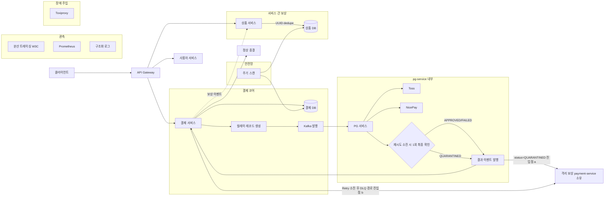
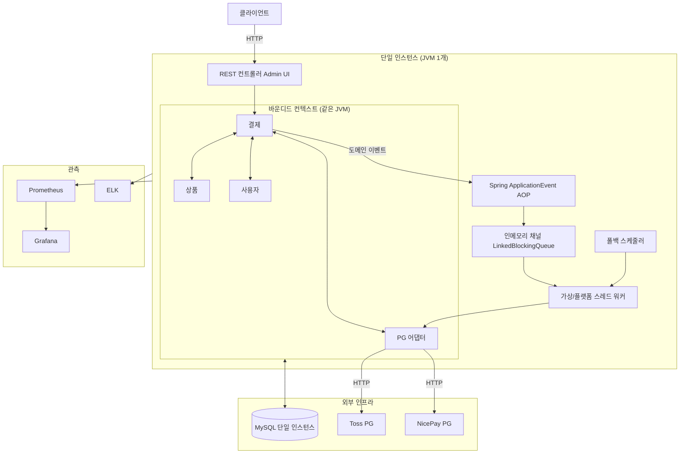
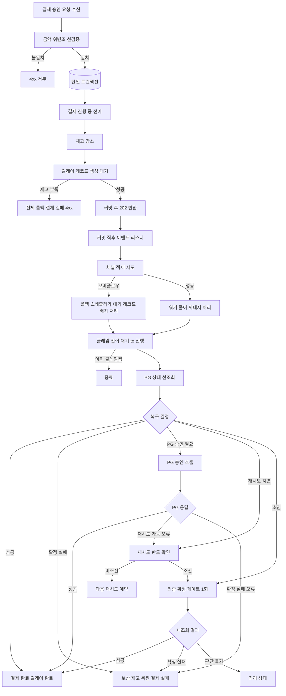
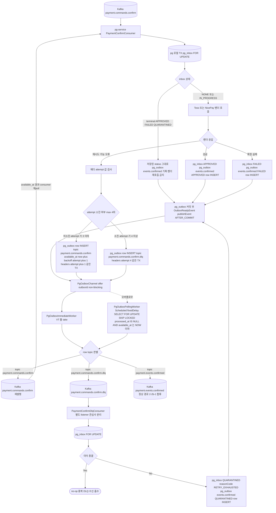
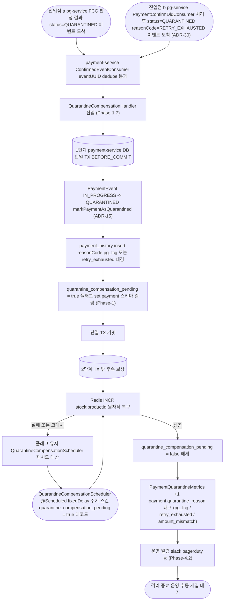
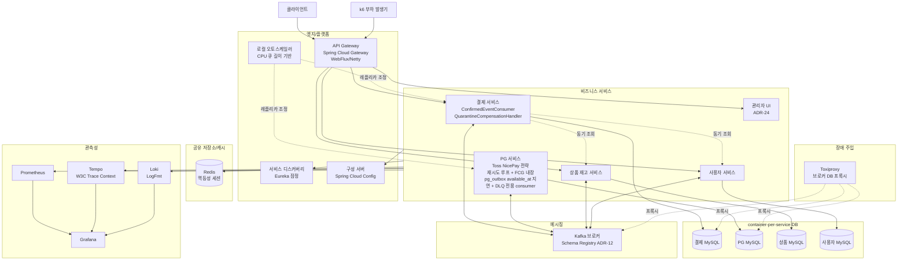
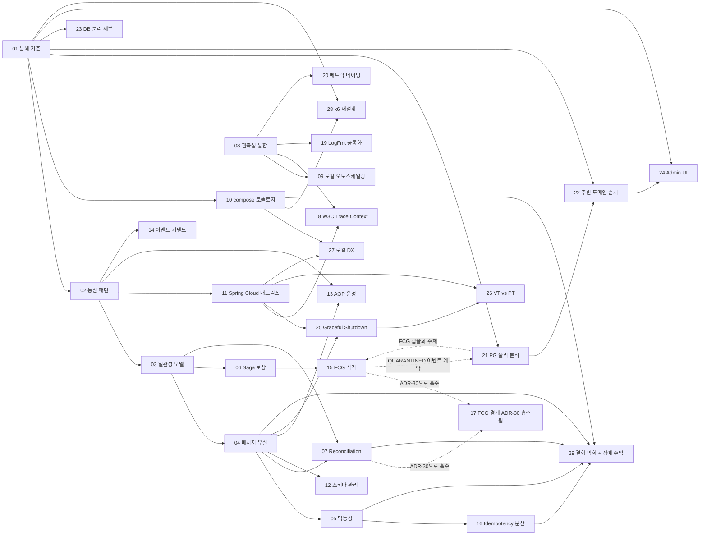

# MSA-TRANSITION

## 요약 브리핑

### 1. 결정된 접근

모놀리스를 **컨테이너 단위 서비스 분리 + 데이터베이스 완전 물리 분리** 구조로 전환한다. 분산 트랜잭션을 원천 배제하고, **DB 진실의 원천 + Kafka 전달 수단 + at-least-once + 멱등 consumer + Saga(Choreography 기본, 결제 승인만 Orchestrator 고려) + Reconciliation 루프** 5중 방어선으로 최종 정합성을 달성한다. 현 결제 비동기 자산(릴레이 테이블 · 복구 사이클 · FCG · 격리 상태)은 각 서비스의 로컬 책임으로 이관되며, `@PublishDomainEvent` AOP의 "감사 원자성"(같은 트랜잭션 리스너)은 결제 서비스 내부에 잔류시켜 끊지 않는다. 스택은 Spring Cloud 잠정안(Eureka · Gateway · Config · Resilience4j · Micrometer Tracing) + raw Spring Kafka로 시작하되 ADR별로 탈락 가능. **런타임은 Gateway만 WebFlux(Netty), 내부 서비스는 MVC + Virtual Threads**로 고정 — 리액티브 확산 금지. 검증은 **Toxiproxy 수준 장애 주입**까지 목표.

### 2. 변경 후 동작 (to-be — 상위 흐름)



### 3. 핵심 결정 ID

- **ADR-01** 서비스 분해 경계 (P0) — 3~5서비스 중 plan에서 확정
- **ADR-03** 최종 정합성 모델 (P0) — Saga Choreography 기본 + 결제 승인 Orchestrator 검토
- **ADR-04** 메시지 유실 대응 (P0) — Transactional Outbox(DB-first) 기본, CDC 보조 검토
- **ADR-05** 멱등성·중복 처리 (P0) — **Toss `ALREADY_PROCESSED_PAYMENT` / NicePay `2201` 중복 승인 응답 방어는 pg-service 내부 2자 금액 대조(pg DB vs 벤더 재조회) + pg DB 승인 레코드 부재 케이스는 벤더 재조회 amount와 command payload amount 일치 검증 통과 시에만 APPROVED 처리(불일치 시 QUARANTINED 전이) + business inbox `amount` 컬럼 명시 + 운영 알림 (Phase 2)**
- **ADR-12** 이벤트 스키마 관리 — 포맷(Avro/Protobuf/JSON) × PG 에러 코드 귀속(어댑터-local vs 도메인 중립 enum 매핑) 조합을 plan에서
- **ADR-13** `@PublishDomainEvent` AOP 운명 — 감사 원자성 유지 가능한 (a)/(a') 권고. 감사 분리(c)는 원자성 포기 tradeoff
- **ADR-15 × ADR-21** FCG × PG 분리 계약 — PG `getStatus` raw state 반환 + FCG timeout 시 격리 불변
- **ADR-16** Idempotency 저장소 분산화 — UUID 키 + consumer 소유 dedupe 테이블 수락 기준 확정
- **ADR-23** DB 분리 정책 — **container-per-service 확정** (Round 0)
- **ADR-29** 장애 주입 도구 스택 — Toxiproxy 포함 (Round 0)
- **ADR-30** 재시도·DLQ 발행 메커니즘 — Outbox + ApplicationEvent + In-process Worker. 단일 `payment.commands.confirm` 재사용 + outbox `available_at` 지연 + `payment.commands.confirm.dlq` 전용 consumer 분리. reconciler 제거 근거
- **ADR-31** 결제 관측성 4계층 스택 — Metric(Prometheus/Grafana) · Trace(Micrometer Tracing→Zipkin/Tempo) · Log(LogFmt→Loki/ELK) · Kafka-native(kafka-exporter). Phase 0에 5개 컴포넌트 프로비저닝
- **§ 2-8 / ADR-11** 런타임 스택 — **Gateway만 WebFlux(Netty), 내부 서비스는 MVC + Virtual Threads**. 리액티브는 엣지 이후 전파 금지

### 4. 알려진 트레이드오프 / 후속 작업

- **plan 단계에서 phase 분할 필수** — 총 29개 ADR + 전면 구현 + 로컬 오토스케일러 코드 범위가 한 PR에 담기지 않음. Phase 0(인프라) → 1(결제 코어) → 2(PG) → 3(주변 도메인) → 4(장애 주입·오토스케일) → 5(잔재 정리) 제안안
- **container-per-service 비용** — Mac Docker I/O 한계 가 로컬 벤치마크 상한선으로 유지되며, 컨테이너 개수 증가 시 현실적 상한이 더 낮아질 수 있음
- **Spring Cloud 컴포넌트 탈락 가능성** — Eureka · Config Server는 plan 세부 검토에서 "필요 없다"로 뒤집힐 여지. 의사결정 자체가 ADR-11 자산
- **Domain Expert Round 2 minor** (후속 반영):
  - ADR-05: Toss `ALREADY_PROCESSED_PAYMENT` 경로에서 금액 검증 순서 명시
  - ADR-16: dedupe TTL 정량 기준 (Phase 4 장애 주입에서 false positive 방지)
  - § 6 Phase 1-3 이행 구간 `stock.events.restore` 보상 경로 소유자 명시
- **후속 TODO**: `INTEGRATIONS.md` 의 "AFTER_COMMIT, @Async" 문구 정리는 본 토픽 범위 밖 (현 AOP는 실제로 BEFORE_COMMIT + 같은 TX — `PaymentHistoryEventListener.java:20`)

---

## 사전 브리핑

### 1. 현재 이해한 문제

모놀리스로 운영 중인 결제 플랫폼을 마이크로서비스로 전환한다. 단순한 물리적 분해가 아니라 **서버가 언제 죽어도 최종 정합성이 보장되는 구조**를 목표로 한다. 무작정 Spring Cloud 스택을 박는 방식이 아니라, 각 결정이 "왜 이렇게 했는가"에 답할 수 있도록 **메시지 유실 대응, 중복 처리, 장애 격리, 관측성, 로컬 오토스케일링**까지 의도된 설계 기록을 남긴다. 실배포는 하지 않고 `docker-compose` 기반으로 로컬에서 MSA 경험을 완결한다.

### 2. 현재 시스템 동작 (as-is)

#### 2-1. 전체 토폴로지



#### 2-2. 결제 승인 비동기 처리 (as-is)



#### 2-2b. 결제 승인 비동기 처리 (to-be, MSA 전환 이후)

Phase-1 ~ Phase-3 반영 최종 상태. as-is와 비교해 가장 큰 구조 변경은 **payment-service와 pg-service 사이에 HTTP 동기 조회 경로가 존재하지 않는다**는 점이다. 두 서비스는 **Kafka 단일 경로**로만 통신하며, PG 벤더 선택·재시도 루프·PG 상태 조회·최종 확인(FCG)은 **pg-service 내부**에 완전 캡슐화된다. payment-service는 `payment.commands.confirm`을 발행하고 `payment.events.confirmed(status)`를 소비할 뿐, PG 벤더와 상태를 모른다.

**핵심 차이 (as-is 대비)**:
- **통신**: 같은 JVM 내 `PaymentGatewayPort` 직접 호출이 **Kafka command/event 쌍**으로 전환 (ADR-02, ADR-14, ADR-21)
- **PG 책임 경계**: 벤더 선택·재시도·상태 조회·FCG 전부 pg-service 소유. payment-service는 벤더·상태·FCG 존재를 모름 (ADR-21)
- **멱등성 2단 키**: consumer dedupe(eventUUID)로 메시지 레벨 리플레이 차단 + business inbox(orderId)로 이미 승인 완료된 주문의 PG 재호출 차단 (ADR-04, ADR-16)
- **재전송 루프**: pg-service가 일시 실패를 감지하면 `pg_outbox`에 `topic=payment.commands.confirm`, `available_at=now()+backoff(attempt)` row를 삽입해 지연 재발행한다. 재발행도 같은 `payment.commands.confirm` 토픽으로 이뤄지며 pg-service 자신이 다시 consume. 4회(`base=2s, multiplier=3, jitter ±25%`) 소진 시 outbox row의 토픽을 `payment.commands.confirm.dlq`로 지정해 발행 → `PaymentConfirmDlqConsumer`가 QUARANTINED 전이 (ADR-30). 재전송이 조회와 실행을 흡수하므로 상태 조회 명령은 발행되지 않는다.
- **QUARANTINED 보상**: Redis DECR 복구는 payment-service 소유. 진입점은 (a) pg-service FCG 결과 QUARANTINED, (b) `PaymentConfirmDlqConsumer`가 처리한 `status=QUARANTINED` 이벤트 — 둘 다 공통 `QuarantineCompensationHandler`로 수렴
- **존속·재배치된 개념**: 기존 payment-service의 `PaymentConfirmChannel`·`OutboxImmediateEventHandler`·`OutboxImmediateWorker`·`OutboxWorker`(폴링) 4구성은 **존속**하되, 워커의 처리 대상이 "PG 직접 호출"에서 "Kafka `payment.commands.confirm` 발행"으로 교체된다. pg-service도 같은 4구성을 **독립 복제 구현**한다(공통 라이브러리 없음). payment-service의 `GET /internal/pg/status/{orderId}` HTTP 엔드포인트 및 `PgStatusPort` / `PgStatusHttpAdapter`는 전부 삭제. outbox → Kafka 발행은 ApplicationEvent + 인메모리 채널 + Immediate 워커가 정상 경로, `@Scheduled` Polling 워커가 오버플로우·크래시 안전망.

**파티션·전달 보장**:
- 토픽 3개: `payment.commands.confirm`(command — 초기 발행과 지연 재발행 공용), `payment.commands.confirm.dlq`(retry 소진 최종 실패), `payment.events.confirmed`(event with `status: APPROVED | FAILED | QUARANTINED` enum). 상태별 토픽 분할 금지 — 주문 단위 순서 보장을 위해.
- 파티션 키는 **orderId**(command·dlq·event 공통). 동일 주문의 상태 전이 순서가 파티션 내에서 유지됨.
- Kafka 설정: `acks=all`, `replication.factor=3`, `min.insync.replicas=2`. at-least-once 전제.
- 지연 재시도는 Kafka 토픽 체인이 아닌 `pg_outbox.available_at` DB 컬럼으로 구현. polling 워커가 `WHERE processed_at IS NULL AND available_at <= NOW()` 조건으로 발행 시점을 결정.

---

##### 2-2b-1. 정상 경로 — 주문 생성부터 결제 확정까지

```mermaid
flowchart TD
    A([클라이언트 결제 승인 요청]) --> GW

    GW["API Gateway WebFlux/Netty traceparent 주입 (Phase-0.3)"]
    GW --> IDEM

    IDEM["멱등성 확인 Redis SETNX idem:key (ADR-16, Phase-0.1a)"]
    IDEM -->|이미 처리됨| DUP([기존 결과 반환])
    IDEM -->|최초 진입| LVAL

    LVAL["LVAL 금액 위변조 선검증 TX 진입 전 로컬 검증 (중복 승인 응답 방어)"]
    LVAL -->|불일치| X1([4xx 거부])
    LVAL --> DECR

    DECR["재고 캐시 원자 차감 Redis Lua DECR stock:productId (ADR-05, Phase-1.4d)"]
    DECR -->|DECR 결과 음수| ROLL["INCR 복구 Overselling 0 보장"]
    ROLL --> FAIL1["PaymentEvent FAILED 사용자 에러 보상 불필요"]
    FAIL1 --> X2([4xx 재고 부족])

    DECR -->|Redis 연결 실패| QCACHE["PaymentEvent QUARANTINED Redis 상태 미확정 Retry 체인 재소비 대상"]
    QCACHE --> X3([5xx 시스템 장애])

    DECR -->|DECR 성공 양수| TX

    TX[(단일 트랜잭션 payment-service DB 시작)]
    TX --> EVT["PaymentEvent READY -> IN_PROGRESS paymentKey 기록"]
    EVT --> OB["PaymentOutbox PENDING insert eventUUID 발급 attemptCount=0"]
    OB --> HIST["payment_history insert BEFORE_COMMIT 이벤트 리스너 같은 TX 원자적 감사 (ADR-13)"]
    HIST --> COMMIT[커밋]
    COMMIT --> ACCEPT([202 Accepted 반환])

    ACCEPT --> RELAY["OutboxReadyEvent AFTER_COMMIT PaymentConfirmChannel offer OutboxImmediateWorker take 또는 OutboxWorker polling 안전망"]
    RELAY --> PUB["payment.commands.confirm 발행 key=orderId payload=eventUUID,orderId,paymentKey,amount (ADR-04, ADR-14, ADR-30)"]
    PUB --> OB_DONE["payment_outbox processed_at 기록"]

    PUB --> KAFKA_C[(Kafka payment.commands.confirm)]
    KAFKA_C --> PGCONS["pg-service ConfirmCommandConsumer"]

    PGCONS --> DEDUP{eventUUID dedupe 이미 처리된 메시지}
    DEDUP -->|Yes| NOOP1([no-op 메시지 레벨 리플레이 차단])
    DEDUP -->|No| INBOX

    INBOX{pg-service inbox orderId 상태 5상태 모델}
    INBOX -->|종결 APPROVED/FAILED/QUARANTINED| REEMIT["저장된 status 그대로 payment.events.confirmed 재발행 벤더 재호출 금지 (ADR-21 inbox terminal 집합)"]
    INBOX -->|IN_PROGRESS 진행 중| WAIT([no-op 대기 벤더 재호출 금지])
    INBOX -->|NONE 신규| TRANSIT["inbox NONE to IN_PROGRESS 원자 전이 UNIQUE order_id 제약"]

    TRANSIT --> VENDOR["벤더 전략 선택 Toss 또는 NicePay PaymentGatewayStrategy"]
    VENDOR --> PGCALL["PG 벤더 confirm 호출 Toss NicePay 재시도 루프 pg-service 내부"]
    PGCALL --> PGRES{PG 응답}

    PGRES -->|SUCCESS| AMOUNT["금액 2자 대조 pg DB amount vs 벤더 재조회 amount (ADR-05/21)"]
    PGRES -->|중복 승인 응답 Toss ALREADY_PROCESSED_PAYMENT NicePay 2201| DUPCHK{pg DB 승인 레코드 조회}
    PGRES -->|확정 실패| PG_FAIL["pg-service DB FAILED 기록 inbox FAILED 전이"]
    PGRES -->|재시도 가능 오류| PGRETRY["pg-service 내부 재시도 루프 유지"]
    PGRETRY -->|재시도 성공| AMOUNT
    PGRETRY -->|한도 소진| FCG["pg-service FCG 1회 최종 확인"]

    DUPCHK -->|존재| AMOUNT
    DUPCHK -->|부재| REFETCH["벤더 재조회로 승인 금액 확인 비정상 정상 경로"]
    REFETCH -->|금액 확인 성공| ABSENT_OK["pg-service DB 승인 결과 저장 inbox APPROVED 전이 운영 알림 발생"]
    REFETCH -->|금액 확인 실패| QMISMATCH

    FCG -->|APPROVED| PG_OK["pg-service DB 승인 결과 저장 inbox APPROVED 전이"]
    FCG -->|FAILED| PG_FAIL
    FCG -->|판정 불가 timeout 5xx 네트워크 에러| FCG_INT[QUARANTINED 경로 다이어그램 2-2b-3]

    AMOUNT -->|2자 일치| PG_OK
    AMOUNT -->|불일치| QMISMATCH["pg-service DB QUARANTINED 기록 reasonCode=AMOUNT_MISMATCH inbox QUARANTINED 전이"]
    ABSENT_OK --> PG_OUT

    PG_OK --> PG_OUT["pg-service outbox PENDING insert status=APPROVED"]
    PG_FAIL --> PG_OUT2["pg-service outbox PENDING insert status=FAILED"]
    QMISMATCH --> PG_OUT4["pg-service outbox PENDING insert status=QUARANTINED"]
    REEMIT --> PG_OUT3["저장된 status 그대로 발행"]

    PG_OUT --> PGRELAY
    PG_OUT2 --> PGRELAY
    PG_OUT3 --> PGRELAY
    PG_OUT4 --> PGRELAY
    PGRELAY["pg-service OutboxReadyEvent AFTER_COMMIT PgOutboxChannel offer PgOutboxImmediateWorker take 또는 PgOutboxPollingWorker 안전망"]
    PGRELAY --> EVTPUB["payment.events.confirmed 발행 key=orderId status=APPROVED/FAILED/QUARANTINED eventUUID 신규 (ADR-14, ADR-30)"]
    EVTPUB --> KAFKA_E[(Kafka payment.events.confirmed)]

    KAFKA_E --> PAYCONS["payment-service ConfirmedEventConsumer"]
    PAYCONS --> PAYDEDUP{eventUUID dedupe}
    PAYDEDUP -->|Yes| NOOP2([no-op])
    PAYDEDUP -->|No| STATUS{status}

    STATUS -->|APPROVED| SUC["PaymentEvent IN_PROGRESS -> DONE approvedAt 기록"]
    STATUS -->|FAILED| COMP["PaymentEvent IN_PROGRESS -> FAILED stock.events.restore 이벤트 발행 (Phase-3.3)"]
    STATUS -->|QUARANTINED| QH[QUARANTINED 경로 다이어그램 2-2b-3]

    SUC --> EMIT_SC["StockCommitEventPublisher payment.events.stock-committed 발행 (Phase-1.5b)"]
    EMIT_SC --> CONS_SC["product-service StockCommitConsumer UUID dedupe -> RDB UPDATE (Phase-3.1c)"]
    CONS_SC --> END_OK([결제 완료])
    COMP --> END_COMP([재고 복구 후 종료])
```



---

##### 2-2b-2. 복구 경로 — Outbox available_at 지연 재발행 + DLQ 전용 consumer (ADR-30)



설계 근거 (Round 4.2 outbox + ApplicationEvent + Channel + ImmediateWorker 패턴):

- **토픽 감소**: 이전 설계의 delay 구간별 재시도 토픽 4개가 사라진다. 정상 재전송은 모두 `payment.commands.confirm` 동일 토픽을 재사용하므로 총 토픽 수가 7개에서 3개(`commands.confirm`, `commands.confirm.dlq`, `events.confirmed`)로 줄어든다. DLQ는 전용 consumer 관심사 분리를 위해 유지.
- **지연은 DB 컬럼으로 자연 표현**: `pg_outbox.available_at`이 재시도 시점을 직접 가리키므로, Spring Kafka `RetryableTopic`·그에 딸린 delay 토픽 운영을 생략한다. 토픽 체인 파티션 수 drift 이슈(§ 9-8 구 목차)도 해소.
- **payment-service 기존 자산 재사용**: `PaymentConfirmChannel` + `OutboxImmediateEventHandler` + `OutboxImmediateWorker` + `OutboxWorker` 4구성은 이미 단일 JVM에서 검증된 구조. pg-service는 동일 패턴을 독립 복제 구현(공통 라이브러리 금지는 사용자 방침).
- **DLQ 전용 consumer 분리**: `PaymentConfirmDlqConsumer`를 `PaymentConfirmConsumer`와 분리해 DLQ 처리 책임(inbox QUARANTINED 전이 + 보상 outbox row 기록)을 관심사별로 격리. 정상 경로 consumer에 DLQ 분기 로직이 섞이지 않는다.
- **관측성 교체**: "retry 단계별 토픽 lag" 지표는 사라지고, 대신 `pg_outbox` 테이블의 `attempt_count` 분포와 `future_pending_count`(available_at 미래) · `pending_count`(available_at 경과분) 쿼리로 retry 적체를 관측한다(ADR-31).

**재시도 정책 상수 (equal jitter)**:

- 수식: `delay = base_delay × multiplier^(attempt-1) × (1 ± jitter)`
- 상수: `base=2s`, `multiplier=3`, `attempts=4`, `jitter=±25%`
- 실효 지연 p99: 약 150s 이내 (2s + 6s + 18s + 54s = 80s 기대값, jitter 상한 25% 기준 약 100s, TX와 네트워크 여유 마진 포함 p99 150s)
- 4회 소진 시: pg-service consumer가 `pg_outbox.topic = payment.commands.confirm.dlq` row를 기록 → `PaymentConfirmDlqConsumer`가 해당 DLQ 메시지를 consume하여 pg_inbox를 `QUARANTINED`로 전이하고 `payment.events.confirmed(status=QUARANTINED)`·보상 이벤트 outbox row를 기록
- 지터 목적: pg-service 다중 replica 동시 재시도 분산(thundering herd 완화)
- 헤더 규약: Kafka 메시지 헤더 `attempt`가 0~4 범위의 누적 시도 수를 운반. pg-service consumer가 `attempt + 1`을 기반으로 backoff·DLQ 분기 판정.

**파티션·복제 설정**:

- 3개 토픽(`payment.commands.confirm`, `payment.commands.confirm.dlq`, `payment.events.confirmed`)은 **동일 파티션 수** 유지. 파티션 키는 모두 `orderId` 고정.
- `replication.factor=3`, `min.insync.replicas=2`, `acks=all` 공통.
- Spring Kafka `RetryableTopic` 자동 구성은 **사용하지 않는다** — 지연 큐는 outbox available_at으로 대체.

**DLQ consumer 행동 분기**:

- **정상 deserialize**: 4회 재시도 소진 메시지 → pg_inbox FOR UPDATE 후 terminal이면 no-op, 아니면 `QUARANTINED` 전이 + `pg_outbox`에 `payment.events.confirmed(status=QUARANTINED, reasonCode=RETRY_EXHAUSTED)` row INSERT(같은 TX) → AFTER_COMMIT 이벤트로 worker가 실제 Kafka 발행. 재고 INCR 보상은 payment-service 측 consumer가 `QUARANTINED` 이벤트 수신 후 `QuarantineCompensationHandler`로 내부 수렴(§ 2-2b-3).
- **deserialize 실패 / malformed**: poison pill. `ErrorHandlingDeserializer`가 값을 역직렬화 실패 상태로 넘겨주면 consumer는 운영 알림만 띄우고 offset commit(처리하지 않는 정책은 § 9에서 조정 가능).
- **DLQ consumer 자체 실패**: Kafka offset 미커밋 + pg_inbox `UNIQUE(order_id)` + terminal 체크로 재처리 시 중복 QUARANTINED 전이 방어.

---

##### 2-2b-3. QUARANTINED 경로 — 두 진입점 공통 수렴



pg-service FCG는 본 경로의 **진입점 a**에만 관여한다. FCG는 pg-service가 Toss/NicePay 재시도 루프를 소진했을 때 **자기 내부에서 1회 최종 확인**을 시도하고, 판정 가능하면 `APPROVED`, 불가하면 `QUARANTINED`로 결정해 `payment.events.confirmed`를 1건만 발행한다. payment-service는 FCG 존재를 모르고, 전달받은 `status` enum만 소비한다(ADR-15, ADR-21).

**2단계 복구 설계 근거 (Round 4 M4 정정)**:

- `PaymentEvent.status` 전이 + `payment_history` insert는 payment-service DB 단일 TX로 원자 처리 가능(같은 DB).
- Redis INCR은 DB TX 밖 외부 I/O이므로 같은 TX에 엮을 수 없다. TX 내 Redis 호출은 DB 롤백 시 Redis 복구 불가의 반대 문제도 만든다.
- 해결: (1) TX 내에 `quarantine_compensation_pending=true` 플래그를 같이 set. (2) TX 커밋 후 Redis INCR 시도. 성공하면 플래그 해제, 실패·크래시면 플래그 유지.
- `QuarantineCompensationScheduler`가 주기적으로 `quarantine_compensation_pending=true`인 레코드를 스캔해 Redis INCR을 멱등 재시도(Redis INCR은 본질적으로 비멱등이라 보상 레코드에 "복구 완료 마커"를 두고 스캔 조건에서 제외).
- **payment 스키마 영향(Phase-1)**: `payment_event` 또는 별도 `payment_quarantine_compensation` 테이블에 `quarantine_compensation_pending BOOLEAN NOT NULL DEFAULT FALSE` 컬럼 추가. § 6 Phase 1 산출물에 포함.

---

##### 2-2b-4. 불변식 표 (자가 검증용)

| # | 불변 | 근거 | 검증 테스트/Task |
|---|---|---|---|
| 1 | Overselling = 0 (Redis DECR 음수는 즉시 INCR 복구) | ADR-05, Phase-1.4d | `decrement_WhenStockWouldGoNegative_ShouldRollbackAndReturnFalse` |
| 2 | 감사 원자성 (payment_history는 상태 전이와 재시도 consumer 모두 같은 TX BEFORE_COMMIT) | ADR-13, Phase-1.4 | `PaymentHistoryEventListenerTest`, `retry_consumer_WhenInvoked_ShouldInsertPaymentHistory` |
| 3 | payment-service는 Toss/NicePay API를 호출하지 않으며 벤더 코드·FCG·중복 승인 응답 방어·금액 대조를 모른다 | ADR-21 (v) | Phase-1.6 InboundPort 계약 테스트 |
| 4 | pg-service inbox terminal 집합(APPROVED/FAILED/QUARANTINED) 레코드가 존재하면 저장된 status 그대로 재발행하며 벤더 재호출 금지 | ADR-21, Phase-2.1 | `pg_inbox_WhenTerminalStateReceived_ShouldNotCallVendor` |
| 4b | pg-service inbox IN_PROGRESS 재수신은 no-op 대기, 벤더 재호출 0건 (NONE to IN_PROGRESS 전이는 UNIQUE order_id 제약으로 원자 보장) | ADR-21 (vi vii), Phase-2.1 | `pg_inbox_WhenInProgressReceived_ShouldBeNoOp` |
| 4c | 중복 승인 응답(Toss ALREADY_PROCESSED_PAYMENT / NicePay 2201) 수신 시 pg DB 승인 레코드 존재 → 2자 금액 대조(pg DB vs 벤더 재조회) 실행, 불일치는 QUARANTINED + reasonCode=AMOUNT_MISMATCH. pg DB 레코드 부재 → 벤더 재조회로 금액 확인 + APPROVED 처리 + 운영 알림(관측만) | ADR-05 보강, ADR-21 (ix), Phase-2.x | `pg_duplicate_approval_WhenAmountMismatch_ShouldQuarantine`, `pg_duplicate_approval_WhenPgDbAbsent_ShouldAlertAndApprove` |
| 5 | consumer dedupe는 eventUUID 기준 (메시지 레벨 리플레이 차단) | ADR-04, ADR-16 | `consumer_WhenSameEventUUIDReceived_ShouldNoOp` |
| 6 | 재시도는 outbox `available_at`으로 지연 표현 + 동일 `payment.commands.confirm` 토픽 재발행. equal jitter 지수 백오프(base=2s · multiplier=3 · attempts=4 · ±25%), 4회 소진 시 `pg_outbox.topic = payment.commands.confirm.dlq` 기록 → `PaymentConfirmDlqConsumer`가 QUARANTINED 전이 | ADR-30, Phase-0.2 | `retry_WhenAttemptExceeded_ShouldWriteDlqOutboxRow`, `dlq_consumer_WhenNormalMessage_ShouldQuarantine` |
| 6b | 3개 Kafka 토픽(`payment.commands.confirm`, `payment.commands.confirm.dlq`, `payment.events.confirmed`)은 동일 파티션 수 · 동일 파티션 키(orderId) 보유 | ADR-30, Phase-0.2 | `topic_config_WhenProvisioned_ShouldShareSamePartitionCount` |
| 6c | pg_inbox terminal 3상태(APPROVED / FAILED / QUARANTINED)는 모두 PG 재호출 차단. DLQ consumer도 terminal 체크로 중복 QUARANTINED 전이 방어 | ADR-21, ADR-30 | `pg_inbox_WhenAnyTerminalState_ShouldBlockVendorCall`, `dlq_consumer_WhenAlreadyTerminal_ShouldBeNoOp` |
| 7 | QUARANTINED 전이 시 payment-service DB 단일 TX 내 PaymentEvent 전이 + payment_history insert + quarantine_compensation_pending=true 플래그 set, Redis INCR은 TX 밖 (성공 시 플래그 해제, 실패 시 Scheduler 재시도) | ADR-15, Phase-1.7 | `QuarantineCompensationHandlerTest`, `QuarantineCompensationSchedulerTest` |
| 7b | quarantine_compensation_pending=true는 Redis INCR 복구 완료까지 유지 | ADR-15, Phase-1.7 | `quarantine_flag_WhenRedisIncrFails_ShouldRemainTrue` |
| 8 | 토픽은 command 2개(초기·재발행 공용 `commands.confirm` + 최종 실패 `commands.confirm.dlq`) + event 1개 = 총 3개 (status별 event 분할 금지) | ADR-14, ADR-30 | 토폴로지 검증 스크립트 |
| 9 | 파티션 키는 command·event·DLQ 공통 orderId (주문 단위 순서 보장) | ADR-14, ADR-30 | `partition_key_WhenSameOrderId_ShouldGoToSamePartition` |
| 10 | payment.events.confirmed status enum은 APPROVED / FAILED / QUARANTINED 3종 단조 전이 (inbox terminal 집합 포함 재수신 시 status 불변 재발행) | ADR-14, ADR-21 | PaymentEventStatusTest |
| 11 | outbox -> Kafka 발행 경로는 AFTER_COMMIT 이벤트 + in-process 채널 + Immediate 워커(정상) + Polling 워커(안전망) 4구성 단일 파이프라인. 같은 `<svc>_outbox` row를 두 경로가 보더라도 `UPDATE ... WHERE processed_at IS NULL` 원자 선점으로 중복 발행 차단 | ADR-04 | `outbox_publish_WhenImmediateAndPollingRace_ShouldEmitOnce` |
| 12 | PG 호출과 DB TX가 한 트랜잭션에 엮이지 않는다 (I/O와 TX 분리) | ADR-04, Phase-1.6 | `executePaymentAndOutbox_ShouldNotWrapPgCall` |
| 13 | Kafka 전달 보장: acks=all, replication.factor=3, min.insync.replicas=2 (원본·retry·DLQ 공통) | ADR-04, ADR-30, Phase-0.2 | `kafka-topic-config.sh` phase gate |
| 14 | 보상(`stock.events.restore`)은 UUID 키로 consumer 측 dedupe (상품 서비스 소유) | ADR-16, Phase-3.3 | Phase-3.3 EventDedupeStore 테스트 |
| 14b | paymentKey · buyerId 포함 Kafka payload의 보존 기간은 Kafka retention = dedupe TTL로 동기화되며, at-rest 보호(브로커 암호화 또는 민감 필드 토큰화) 적용 | ADR-14, ADR-16, Phase-0.2 | `kafka-retention-config.sh` phase gate, dedupe TTL 검증 테스트 |
| 15 | 결제 DONE -> product RDB 감산은 `payment.events.stock-committed` 소비로만 | Phase-1.5b, Phase-3.1c | `StockCommitEventPublisherTest` |
| 16 | product 재고 변경 -> Redis 직접 SET (Kafka 경유 아님) | Phase-3.1c | Phase-3.1c 어댑터 테스트 |
| 17 | 멱등성 저장소 수평 확장 (Caffeine -> Redis SETNX) | ADR-16, Phase-0.1a | `IdempotencyStoreRedisAdapterTest` |
| 18 | payment-service 기동 후 재고 캐시 warmup 완료 전까지 결제 차단 | Phase-1.12 | `StockCacheWarmupServiceTest` |
| 19 | payment-service와 pg-service 사이 HTTP 동기 조회 경로는 존재하지 않는다 (Kafka only) | ADR-02, ADR-21 | 토폴로지 계약 테스트 (`PgStatusPort` 부재 확인) |
| 20 | 각 Phase 종료 시 Phase Gate E2E 검증 통과 후에만 다음 Phase 진입 | Phase-0~5-Gate | `scripts/phase-gate/phase-N-gate.sh` |
| 21 | 발행·종결 카운터 invariant: `published_total = Σ terminal_total`(APPROVED + FAILED + QUARANTINED)가 장기 구간에서 성립 (짧은 지연은 허용하나 누적 drift 0) | ADR-31, Phase-0.2 | `invariant_published_equals_terminal_longRun` |

---

##### 2-2b-5. 허점 점검 포인트 (A-F)

- **A**: Kafka 브로커 영구 유실 — `replication.factor=3` + `min.insync.replicas=2`로 단일 브로커 크래시는 흡수. 2대 이상 동시 손실은 `pg_outbox` row가 DB에 보존되므로 브로커 복구 후 polling 워커가 모두 재발행. 3대 동시 손실은 수동 운영 영역.
- **B**: pg-service 장기 다운 시 `pg_outbox` 테이블이 점진적으로 채워짐(retry row + 신규 row). 같은 `payment.commands.confirm` 토픽을 쓰므로 consumer lag은 단일 토픽 지표로 통합 관측 가능. pg-service 복구 시 polling 워커가 `available_at` 경과 row부터 순차 발행한다. 완화책: `pg_outbox.pending_count > 100` · `oldest_pending_age_seconds > 300s` 알림(ADR-31).
- **C**: Toss/NicePay 자체 상태와 pg-service 기록 불일치 — PG 측 "승인 완료"이지만 pg-service는 "응답 수신 실패 후 FAILED"로 기록. pg-service 내부 FCG가 Toss/NicePay 상태 조회 API로 최종 확인한 뒤 결정하므로 일반적 경로는 방어. 단 pg-service DB 크래시 시점과 겹치면 불일치 가능. Phase-4.1 장애 주입 시나리오 커버 대상.
- **D**: backoff 상수 튜닝 실수(`available_at` 값이 너무 짧게 설정) — 이중 처리는 2단 키(eventUUID + orderId inbox)가 차단하므로 발생하지 않지만, **불필요한 Kafka 트래픽 증가 + pg-service inbox 조회 부하 증가**. 운영 지표(`pg_outbox.attempt_count` 분포, DLQ 유입률)로 모니터링(ADR-31).
- **E**: QUARANTINED 복구 중 payment-service 크래시 — Redis INCR 미실행 또는 PaymentEvent 상태 전이 미완료. 트랜잭션 경계가 "Redis INCR + PaymentEvent.status 전이 + payment_history insert"를 한 TX에 묶지 못한다(Redis는 DB TX 밖). **2단계 분할 설계로 해소**(§ 2-2b-3): (1) TX 내에서 `PaymentEvent → QUARANTINED` + `payment_history insert` + `quarantine_compensation_pending=true` 플래그 set을 한 TX에 묶는다(같은 DB). (2) TX 커밋 후 Redis INCR 시도 → 성공하면 플래그 해제, 실패·크래시면 플래그 유지. `QuarantineCompensationScheduler`가 주기적으로 `quarantine_compensation_pending=true` 레코드를 스캔해 Redis INCR을 멱등 재시도. 이로써 "재시도 불가 구간"이 2단계 사이 수 ms 윈도우로 한정되고, 해당 윈도우에서 크래시해도 플래그만 남아 다음 스캔 주기에 복구.
- **F**: command와 event가 다른 파티션에 떨어질 가능성 — `commands.confirm` · `commands.confirm.dlq` · `events.confirmed` 3개 토픽 모두 **파티션 키=orderId**로 고정(ADR-14, ADR-30). 같은 orderId의 command(초기·재발행)·dlq·event는 각 토픽 내에서 동일 파티션·순서 보장. 3개 토픽은 동일 파티션 수 강제(§ 2-2b-4 불변식 6b).

### 3. 이번 discuss에서 결정하려는 것

- **서비스 분해 경계** — 결제 / PG / 상품 / 사용자 / 관리자 UI를 몇 개 서비스로 쪼갤지, 남길 부분은 무엇인지
- **서비스 간 통신 패턴** — 동기(HTTP/gRPC)와 비동기(이벤트) 경계선, 현 Spring ApplicationEvent AOP의 운명
- **메시지 유실·중복 대응 뼈대** — 현 릴레이 테이블 + 워커 + 폴백 구조를 MSA에서 어떻게 진화시킬지 (전면 Kafka 전환 여부 포함)
- **멱등성 / 최종 정합성 / Reconciliation** — 크래시 지점 매트릭스에 대응하는 방어선 구성
- **관측성 자산 이행** — TraceId 전파, LogFmt, 메트릭 네이밍 규약의 공통화 방식
- **스택 선택 매트릭스** — Spring Cloud 컴포넌트별 채택/미채택 근거 (포터빌리티보다 제어권 우선 원칙)
- **로컬 오토스케일링 방식** — docker-compose 기반에서 HPA 원리를 어떻게 흉내낼지
- **이행 순서 (Strangler)** — 어떤 서비스부터 분리하고 어떤 것을 마지막까지 모놀리스에 둘지

### 4. 열린 질문 / 가정

- **보안 범위 제외** 확정 — 인증/인가, mTLS, 시크릿 관리, PCI 관련 결정은 이번 작업에서 다루지 않는다
- **실배포 제외** 확정 — k8s / 실 클러스터 대상 결정은 하지 않는다. docker-compose 안에서 완결
- **Spring Cloud 잠정안**(Eureka · Gateway · Config Server · Resilience4j · LoadBalancer · Micrometer Tracing · raw Spring Kafka)은 discuss 도중 개별 ADR에서 뒤집힐 수 있음
- **메시징은 Kafka 단일** — 현 릴레이 테이블을 Kafka 기반으로 갈아탈지는 ADR에서 판단. 갈아타더라도 "DB 진실의 원천 + Kafka 전달 수단" 원칙은 불변
- **현 알려진 결함**(재시도 중복 confirm, 보상 재고 이중 복원, AOP 이력 유실 등)이 MSA에서 **악화·개선·유지** 중 어디로 가는지도 이번에 점검한다
- **Mac Docker I/O 한계** 를 로컬 오토스케일링 평가를 고려한다
- **Admin UI**(Thymeleaf) 의 분리 여부는 후순위 — 결제 코어 분해가 선결
- **이벤트 스키마 포맷**(Avro / Protobuf / JSON Schema) 은 열린 질문 — 포터빌리티·검증·도구 생태계 관점에서 별도 ADR

---

## § 1. 배경 및 목표

### 1-1. 현재 모놀리스의 경계와 자산

- 단일 JVM / 단일 MySQL 위에 네 개의 바운디드 컨텍스트(`payment` · `paymentgateway` · `product` · `user`)가 헥사고날 layer 규칙을 따라 공존한다. 공통 DB를 통해 강한 일관성을 확보해 왔다.
- 결제 승인 경로는 이미 **비동기 단일 전략**으로 확정되어 있다. `OutboxAsyncConfirmService` 하나만 존재하며, 릴레이 테이블 + `PaymentConfirmChannel`(인메모리 큐) + `OutboxImmediateWorker`(즉시 처리) + `OutboxWorker`(폴백) + `OutboxProcessingService`(복구 사이클 · FCG · 격리) 조합이 최종 정합성의 현 방어선이다. (`docs/context/ARCHITECTURE.md`)
- PG 어댑터는 `PaymentGatewayStrategy` 기반으로 Toss · NicePay 이중 전략을 이미 수용한다. `PaymentEvent.gatewayType`이 이벤트 단위로 선택된다. (`docs/context/INTEGRATIONS.md`)
- Spring `ApplicationEvent` + AOP(`@PublishDomainEvent`, `@PaymentStatusChange`, `@TossApiMetric`)가 감사(audit) · 메트릭 전파의 축이다. **현 사실 재확인**: `DomainEventLoggingAspect`는 `@PublishDomainEvent`가 붙은 도메인 메서드가 끝난 직후 같은 스레드에서 `PaymentEventPublisher`로 Spring `ApplicationEvent`를 발행하고, 실제 감사 기록 주체인 `PaymentHistoryEventListener`는 `@TransactionalEventListener(phase = BEFORE_COMMIT)`로 **같은 TX 경계 안에서** `payment_history`에 insert 한다. 즉 **감사 원자성은 "AOP"가 아니라 "같은 TX 이벤트 리스너"가 보장**하고 있다. MSA 전환 시 취약점은 "AOP가 안 불린다"가 아니라 **`payment_history`가 cross-service 경계를 타면 상태 전이 TX와 감사 insert의 원자성이 깨진다** 쪽이다(Pitfall 10 재해석 — ADR-13 본문에서 상세화).
- 관측성 자산: `TraceIdFilter`(MDC 기반 traceId), `LogFmt`(LogDomain × EventType 구조화 로그), `MaskingPatternLayout`, `PaymentStateMetrics` / `PaymentHealthMetrics` / `PaymentTransitionMetrics` / `PaymentQuarantineMetrics` / `TossApiMetrics` 5종 Micrometer 메트릭.

### 1-2. 전환의 동기 — "서버가 언제 죽어도 최종 정합성"

- 단순 분해가 목표가 아니다. 현 비동기 자산(릴레이 테이블 + 복구 사이클 + FCG + 격리)이 **단일 JVM / 단일 DB**라는 환경 가정에 묶여 있다. 이를 **프로세스·DB가 분리된 환경에서도 동일한 보증**이 성립하도록 재구성하는 것이 본질이다.
- 크래시 지점 확장: 프로세스 경계, 브로커 경계, 네트워크 경계, 컨테이너 재시작이 새로 생긴다. 각 지점에서 **at-least-once + 멱등 consumer + reconciliation + 격리**가 방어선이 되어야 한다.
- 포트폴리오 완결 관점: "왜 Spring Cloud 중 이것은 쓰고 저것은 안 쓰는가"라는 의사결정 기록을 ADR 29건으로 남겨, 스택 선택이 유행이 아닌 **제어권/교체 비용 기반 판단**임을 증명한다.

### 1-3. 비목표 (non-goals)

- **보안** — 인증·인가, mTLS, Secret 관리, PCI 준수는 본 토픽 범위 밖.
- **실배포** — Kubernetes, 실제 클라우드, CI/CD 파이프라인은 본 토픽 범위 밖. `docker-compose` 단일 환경에서 완결.
- **성능 절대값 목표치** — Mac Docker VirtioFS I/O 한계(약 100 req/s, DB ops ~600/s; STACK.md) 때문에 TPS/latency 절대값 기준은 세우지 않는다. 대신 **상대 비교**(분해 전 vs 분해 후 동일 한계 내에서 정합성 유지)와 **장애 주입 후 최종 정합성 복원 여부**를 본다.
- **현재 발견된 결함의 즉시 제거**(CONCERNS.md의 `E03002` 중복, `EO3009` 오타, `recoverTimedOutInFlightRecords` 중복 confirm, 보상 재고 이중 복원 등)는 ADR-29에서 **MSA 전환이 악화시키는지만 점검**하고, 개별 수정은 후속 토픽으로 분리.
- **이벤트 스키마 포맷 완전 고정** — ADR-12에서 방향은 결정하되, 전면 Avro/Protobuf 도입의 러닝커브는 phase 3 이후로 미룰 수 있음.

### 1-4. 성공 조건 (관찰 가능한 형태)

- 29개 ADR 모두 "결정 · 근거 · 기각된 대안 · 검증 방법" 4요소를 갖는다.
- docker-compose 상에서 모든 서비스가 기동되고, k6 기반 결제 시나리오가 통과한다.
- Toxiproxy(또는 동등 도구)로 **브로커 지연 · DB 지연 · 프로세스 kill** 3종 장애를 주입했을 때 **최종 정합성**(재고 일치 + 결제 상태 종결)이 복원된다.
- 로컬 오토스케일러 코드가 CPU/큐 길이 기반으로 결제 서비스 레플리카를 조정한다(설계 의도를 보이는 수준 — 절대 TPS 목표 없음).

---

## § 2. 이행 원칙 (결정 사항)

본 섹션의 각 항목은 이번 discuss에서 확정된 **결정 사항**이며, § 4 ADR 인덱스의 개별 의사결정이 기대는 **전제**다. 개별 결정 질문 · 기각된 대안의 세부는 § 4 ADR 표로 귀속한다.

### 2-1. Strangler Fig — 분리 순서와 잔재 허용

- 모놀리스를 먼저 죽이지 않는다. **결제 코어 → PG → 주변 도메인 → Admin UI** 순으로 절개하며, 각 단계 사이에 모놀리스가 공존한다. 분리 중인 서비스와 모놀리스가 같은 이벤트 토픽을 공유하거나, Gateway가 둘 사이를 라우팅한다.
- 잔재 허용 범위: Admin UI(Thymeleaf)는 본 토픽에서 분리 여부를 ADR-24에서 판단하되, 미분리를 기본값으로 둔다. 관리자 쿼리가 여러 서비스 DB를 직접 건드릴 수 없게 되므로 `AdminPaymentQueryRepositoryImpl`의 QueryDSL 자산은 **조회 전용 서비스로 흡수되거나 이벤트 기반 Read Model**로 재구성해야 한다 (ADR-24).

### 2-2. DB = 진실의 원천, Kafka = 전달 수단

- **DB 분리 정책은 container-per-service 확정**(Round 0 interview) — 서비스별 MySQL 컨테이너, 분산 트랜잭션 불가.
- 이벤트의 권위 있는 상태는 **각 서비스의 DB**에만 있다. Kafka는 상태를 전달할 뿐 **저장소가 아니다**. Kafka 보관 기간이 지나도, 각 서비스의 릴레이 테이블/상태 테이블로부터 재발행이 가능해야 한다.
- 릴레이 테이블(현재 `payment_outbox`)은 **각 서비스가 자기 DB 안에 소유**하는 형태로 일반화된다(ADR-04/16).

### 2-3. at-least-once + 멱등 consumer (exactly-once 포기)

- Kafka exactly-once(트랜잭셔널 프로듀서/컨슈머)를 포기한다. 이유:
  - container-per-service에서 트랜잭셔널 참여자가 늘어날수록 조정 비용이 급증.
  - Mac I/O 한계에서 Kafka 트랜잭션 오버헤드가 측정 가치보다 크다.
- **consumer 멱등성**이 이 결정의 전제 조건이다. 멱등성 키의 소스·수명·충돌 처리는 ADR-05/16에서 결정.

### 2-4. Saga — Choreography 기본, 필요 시 Orchestrator

- 기본 패턴: **Choreography**(서비스가 이벤트를 구독·발행해 상태를 자력으로 이행). 결합도를 낮추고 각 서비스의 삭제·교체 비용을 낮춘다.
- 예외: 결제 승인처럼 **여러 서비스가 순차적으로 엮이고 보상이 복잡한** 플로우는 Orchestrator가 필요할 수 있다(ADR-06). Orchestrator를 도입하더라도 **상태 저장은 결제 서비스 DB 안**(진실의 원천 원칙 준수).

### 2-5. Reconciliation 루프 — 최종 안전망

- Saga · 멱등 consumer · FCG 모두가 실패한 경우의 최종 방어선. 각 서비스는 자기 도메인의 릴레이·상태 테이블을 **주기적으로 스캔**하여 종결되지 않은 레코드를 복구 대상으로 집어낸다(ADR-07/17).
- FCG(Final Confirmation Gate)는 retry 소진 시 1회 재조회로 종결/격리를 판정하는 현 자산이며, reconciliation 루프는 그 상위(더 긴 주기, 더 넓은 스캔)에서 동작한다. 두 방어선의 역할이 겹치지 않도록 ADR-17에서 재정의.

### 2-6. Hexagonal 배치 원칙 — 신규 컴포넌트 layer 매핑

본 토픽이 도입하는 신규 컴포넌트(Kafka producer/consumer, 분산 Idempotency 저장소, API Gateway, Service Discovery, Config Server, Resilience4j 래퍼, 로컬 오토스케일러)는 **기존 hexagonal 규칙**(port → domain → application → infrastructure → controller) 위에 다음과 같이 배치된다. 이는 개별 ADR 결정의 **방향성 제약**이며, 특정 기술 선택(Kafka vs Pulsar, Redis vs DB 테이블)은 adapter 구현체로만 드러낸다.

- **Domain** (`<service>/domain`): 결제 도메인 이벤트 payload 값 객체, Saga 상태 머신(Orchestrator 채택 시 상태 enum · 전이 규칙), 릴레이 레코드 값 객체(현 `PaymentOutbox` 승계), 멱등성 키 값 객체. Spring 의존 없음.
- **Application/port** (`<service>/application/port/{in,out}`): 모든 신규 **outbound 포트**의 소유지. `MessagePublisherPort`(outbox relay 발행), `MessageConsumerPort`(이벤트 구독 추상), `IdempotencyStore`(현 `application/port/IdempotencyStore` 승계), `ReconciliationPort`. **inbound 포트**는 기존 관례대로 `<service>/presentation/port`에 둔다. 주의: `PgStatusPort`는 존재하지 않는다(§ 4-10 ADR-21 보강 — payment↔pg는 Kafka only, HTTP 동기 조회 경로 부재).
- **Application/service** (`<service>/application/usecase` · `application/service`): Saga orchestrator(채택 시), reconciliation 루프 로직, FCG 게이트 로직, consumer 측 비즈니스 처리(멱등성 판정 포함). 트랜잭션 경계는 여기서 선언.
- **Infrastructure/adapter** (`<service>/infrastructure/adapter/...`): Kafka producer 어댑터(`messaging/KafkaMessagePublisher`), Kafka consumer 어댑터(`messaging/consumer/...` — Spring Kafka listener는 여기), Redis 멱등성 어댑터(`idempotency/RedisIdempotencyStore`), Resilience4j 래퍼, Eureka 클라이언트 설정. Toss/NicePay HTTP 클라이언트는 **pg-service 내부**에만 배치된다(payment-service는 PG HTTP 클라이언트를 소유하지 않음 — § 4-10 ADR-21 보강). **기술 의존은 infrastructure 밖으로 새지 않는다**.
- **Infrastructure/config**: Spring Cloud Gateway route 정의, Discovery client config, Config Server client config는 `infrastructure/config` 하위 Spring `@Configuration` 클래스로 배치. Application 계층은 이들의 존재를 모른다.
- **Presentation** (`<service>/presentation`): REST 컨트롤러는 기존 위치 유지. 이벤트 소비는 controller가 아닌 consumer 어댑터(infrastructure) 경유로만 진행한다.

**포트 인터페이스 위치 원칙**: 모든 신규 포트는 `application/port/{in,out}` 하위에 둔다. `infrastructure/port`는 사용하지 않는다(기존 프로젝트 관례 승계 — `PaymentGatewayPort`, `ProductPort`, `UserPort`, `IdempotencyStore` 모두 `application/port` 소유). 인프라 기술(Kafka · Redis · Eureka) 선택은 adapter 구현체로만 노출되며, port 시그니처는 기술 중립으로 유지한다.

**AOP 축의 재배치 원칙**: 현 `@PublishDomainEvent` · `@PaymentStatusChange` · `@TossApiMetric` AOP는 **서비스 내부 동일 JVM 안에서만** 유효함을 전제로 각 서비스에 **복제 배치**한다. cross-service 상태 전파는 AOP가 아니라 outbox relay + Kafka publisher로만 흐르게 한다. 이는 § 1-1에서 재해석한 "감사 원자성 = 같은 TX 리스너" 사실을 각 서비스 로컬로 축소 유지하기 위한 배치다(상세는 ADR-13).

### 2-7. 테스트 계층 — MSA 전환이 추가하는 계층

본 토픽의 검증은 기존 `./gradlew test` 단위/통합 테스트 관례를 **각 서비스 분리 phase에서 승계**하면서, MSA 경계에서 새로 생기는 계층을 다음과 같이 추가한다. 실 도구(Pact · Spring Cloud Contract · WireMock 등) 선택은 plan 단계에서 확정하며, 본 discuss에서는 **계층의 존재와 책임**만 확정한다.

- **단위 (unit)**: 도메인 엔티티 상태 전이, Saga 상태 머신 전이 규칙, 멱등성 키 해싱/동등성, `RecoveryDecision` 생성 — 기존 관례 승계.
- **통합 (integration)**: outbox relay → Kafka publisher 흐름(Testcontainers Kafka + MySQL), consumer 멱등성(동일 이벤트 2회 수신 시 부작용 1회), PG 어댑터 HTTP 레벨(기존 WireMock 패턴 승계).
- **계약 (contract)**: 서비스 간 이벤트 스키마(ADR-12에서 포맷 결정 후 구체화) · REST 경계의 consumer-driven contract. 본 discuss에서는 **"컨슈머 관점 스키마 고정 + provider 검증"** 책임의 존재만 확정(도구는 plan).
- **E2E · 부하 (k6)**: ADR-28이 재설계하는 k6 시나리오 — Gateway 경유 단일 시나리오 유지(a) / 서비스별 분리(b) / 상태 머신 재작성(c) 중 선택.
- **장애 주입 (chaos)**: ADR-29가 결정하는 Toxiproxy(a) / Chaos Mesh 경량(b) / 수동 스크립트(c). **브로커 지연 · DB 지연 · 프로세스 kill** 3종 최소 커버.

### 2-8. 런타임 스택 — 리액티브는 엣지 한정

- **API Gateway**: Spring Cloud Gateway 기본 스택인 **WebFlux(Netty + Reactor)** 채택. 필터 체인·라우팅·rate limit 전부 I/O 바운드라 구조적 적합. 비즈니스 로직 없음으로 Mono/Flux 학습 영역이 필터 범위로 제한됨.
- **내부 서비스**(결제·PG·상품·사용자·관리자): **MVC + Virtual Threads** 유지. VT가 "동기 코드로 비동기 처리량"을 제공하므로 WebFlux 대안으로 충분. R2DBC(MySQL 지원 불안정)·Reactor Kafka·MDC 재구축·스택 다원화 비용을 회피한다.
- **경계 원칙**: 리액티브는 Gateway 이후로 전파되지 않는다. Gateway → 서비스는 일반 HTTP/REST + W3C `traceparent` 헤더로 MDC 전파(ADR-18). 이 원칙은 ADR-26(VT vs PT)·ADR-21(PG 물리 분리)의 전제다.

---

## § 3. 제안 목표 토폴로지 (to-be — Phase 2.c 이후 최종 상태)

> NOTE: 아래 서비스 개수는 **현 시점 best guess**로, **ADR-01에서 뒤집힐 수 있다**.
> 본 도식은 **Phase 2.c 정리 이후의 최종 상태**를 그린다. Phase 1~2.b 사이의 과도기 컴포넌트(예: payment reconciler)는 부재한다. 시간적 잔존 범위는 § 6 Phase 2 · § 4-10 ADR-30 · § 2-2b-2를 참조한다.



토폴로지 주석:
- **엣지·플랫폼 네 컴포넌트**(Gateway · Discovery · Config · Autoscaler)는 각각 ADR-10 · ADR-11 · ADR-11 · ADR-09에서 개별 검증된다. Eureka는 가장 탈락 가능성이 큰 후보로 — docker-compose DNS + 클라이언트 사이드 LB로 대체 가능.
- **PG 서비스의 물리 분리 여부**(현재 `paymentgateway` 컨텍스트를 별도 서비스로 뽑을지 vs 결제 서비스 내부 모듈로 유지할지)는 **ADR-21**에서 확정. 그림은 분리를 가정하고 그렸다.
- **payment ↔ pg 통신은 Kafka only**(ADR-02/21). 동기 HTTP 조회 화살표는 그림에서 의도적으로 제거. PG 벤더 선택·재시도·상태 조회·FCG는 pg-service 내부에 캡슐화되며 payment-service는 `payment.commands.confirm`/`payment.events.confirmed` 쌍만 알고 있다.
- **payment reconciler**는 본 최종 상태 도식에 부재한다. Phase 1 단계의 잔존 컴포넌트로, Phase 2.a Shadow 기간 동안 pg-service outbox 파이프라인(ADR-30)과 병행 운영되다가 Phase 2.b 스위치 이후 OFF 상태로 전환되고 Phase 2.c에서 코드·스키마가 삭제된다(§ 6 Phase 2). Phase 2.c 이후의 `IN_PROGRESS` 장기 체류 감지·재전송·격리 전이 책임은 pg-service의 outbox 지연 재발행 파이프라인(`pg_outbox.available_at` + Immediate/Polling 워커)과 `PaymentConfirmDlqConsumer`가 대체하며, QUARANTINED 진입 후 Redis INCR 복구는 payment-service의 `QuarantineCompensationHandler`가 소유한다(§ 2-2b-2, § 2-2b-3).
- **Redis**는 분산 멱등성 저장소(ADR-16), 재고 캐시(ADR-05), 세션성 데이터 용도. 분산 락 용도는 의도적으로 비움 — Kafka 파티션 키(orderId)로 순서 보장을 우선.
- **Schema Registry**는 ADR-12 결론에 따라 Confluent/Apicurio 등을 추가하거나, JSON Schema + 클라이언트 검증으로 축소할 수 있음.

---

## § 4. ADR 인덱스 (29개)

우선순위 범례: **P0** = 선행 결정 없이는 다음 단계 진행 불가 / **P1** = phase 2 이전 확정 필요 / **P2** = 대안 존재 · 후순위 결정 가능.

### 4-1. 거시 — 분해 / 통신 / 정합성 (ADR-01 ~ 07)

| # | 제목 | 결정 질문 | 대안 | 선행 | 우선순위 |
|---|------|----------|------|------|---------|
| 01 | 서비스 분해 기준 | 결제 / PG / 상품(+재고) / 사용자 / 관리자 UI를 몇 개 서비스로 절개할 것인가? | (a) 3서비스(결제+PG · 상품 · 사용자 + 관리자=모놀리스) (b) 4서비스(PG 분리) (c) 5서비스(관리자 분리) | — | **P0** |
| 02 | 통신 패턴 | 동기(HTTP/gRPC)와 비동기(이벤트) 경계를 어디에 그을 것인가? | (a) **payment↔pg는 Kafka only(HTTP 동기 조회 경로 부재), 주변 도메인 조회는 동기 HTTP 허용** (b) 전면 이벤트(조회도 Read Model) (c) gRPC 도입 / **불변(채택과 무관)**: payment-service는 PG 벤더·상태·FCG를 모른다 — § 4-10 ADR-02 보강 | 01 | **P0** |
| 03 | 데이터 일관성 모델 | 분산 TX 없이 최종 정합성을 어떤 조합으로 달성할 것인가? | (a) Saga Choreography + 릴레이 (b) Saga Orchestrator 중심 (c) 2PC(기각) | 01, 02 | **P0** |
| 04 | 메시지 유실 대응 | DB 릴레이 + Kafka 페어링을 어떻게 안전하게 결합할 것인가? | (a) Transactional Outbox(DB-first) + **AFTER_COMMIT 이벤트 + 인메모리 채널 + Immediate 워커(정상) + Polling 워커(안전망) 4구성 단일 파이프라인** + at-least-once(`acks=all`, `replication.factor=3`, `min.insync.replicas=2`) (b) CDC(Debezium) (c) Kafka 직접 발행(기각) / **수락 기준**: dedupe 2단 키(§ 4-10 ADR-04 보강) | 03 | **P0** |
| 05 | 멱등성·중복 처리 + PG 중복 승인 응답 방어 | consumer 멱등성 키를 어떻게 정의/저장하고, PG의 중복 승인 응답(Toss `ALREADY_PROCESSED_PAYMENT` · NicePay `2201`)을 어떻게 방어할 것인가? | (a) `orderId` 단일 키 + Redis (b) `(topic, partition, offset)` 복합 키 (c) 도메인 이벤트 UUID + DB 테이블 / **중복 승인 응답 방어 주체는 pg-service 고정**(ADR-21 (v)), 2자 금액 대조(pg DB vs 벤더 재조회) + 불일치 시 QUARANTINED + AMOUNT_MISMATCH + pg DB 레코드 부재 시 벤더 재조회 + APPROVED + 운영 알림 — § 4-10 ADR-05 보강 | 04 | **P0** |
| 06 | Saga·보상 | Choreography 기본 위에서 Orchestrator가 언제 필요한가? | (a) 결제 승인만 Orchestrator (b) 전면 Choreography (c) 전면 Orchestrator | 03 | **P1** |
| 07 | Reconciliation | 종결되지 않은 레코드를 어떻게 발견·복구할 것인가? | (a) 각 서비스 자체 스캔(현 OutboxWorker 확장) **— 배제됨 · ADR-30 채택(Kafka 지연 재시도 + DLQ 자동 격리)으로 대체** (b) 중앙 Reconciler 서비스 **— 배제됨 · ADR-30 채택(Kafka 지연 재시도 + DLQ 자동 격리)으로 대체** (c) 외부 Job 스크립트 **— 배제됨 · ADR-30 채택(Kafka 지연 재시도 + DLQ 자동 격리)으로 대체** | 03, 04 | **P1** |

### 4-2. 운영 — 관측성·스케일·토폴로지 (ADR-08 ~ 10)

| # | 제목 | 결정 질문 | 대안 | 선행 | 우선순위 |
|---|------|----------|------|------|---------|
| 08 | 관측성·로깅 통합 | 분산된 로그/메트릭/트레이스를 어떻게 상관관계로 엮을 것인가? | (a) Prometheus + Tempo + Loki 3종 (b) OpenTelemetry Collector 단일 게이트웨이 (c) 기존 ELK 유지 | — | **P1** |
| 09 | 로컬 오토스케일링 | docker-compose에서 HPA 원리를 어떻게 흉내낼 것인가? | (a) Docker SDK 기반 custom scaler(결제 서비스 레플리카 조정) (b) docker-compose `deploy.replicas` 수동 조정 (c) scale 미구현(기각) | 08 | **P1** |
| 10 | docker-compose 토폴로지 | 단일 compose 파일 vs 프로필 분리 vs 파일 분할 중 어느 구조를 고를 것인가? | (a) 단일 파일 + profile (b) override 파일 분할 (c) 서비스별 파일 + include | 01 | **P1** |

### 4-3. 스택 (ADR-11)

| # | 제목 | 결정 질문 | 대안 | 선행 | 우선순위 |
|---|------|----------|------|------|---------|
| 11 | Spring Cloud 컴포넌트 매트릭스 + 런타임 스택 | Eureka · Gateway · Config Server · Resilience4j · LoadBalancer · Micrometer Tracing · raw Spring Kafka 각각 채택/미채택 근거는? 서비스별 런타임 스택(MVC vs WebFlux)은? | 컴포넌트별 (채택 · 대체 · 기각) 매트릭스 / **런타임 스택 원칙**: (i) **API Gateway는 WebFlux(Netty + Reactor)** — Spring Cloud Gateway 기본 스택이며 엣지 프록시가 I/O 바운드인 특성에 적합 (ii) **내부 서비스(결제·PG·상품·사용자·관리자)는 MVC + Virtual Threads** — 동기 코드로 비동기 처리량 확보, R2DBC·Reactor Kafka 생태계 지뢰 회피, 스택 단일성 유지 (iii) 리액티브 확산 금지 — Gateway 이후로 내려가지 않는다. MDC traceId는 W3C `traceparent` 헤더로 Gateway→서비스 경계에서 재주입(ADR-18) | 02, 08 | **P0** |

### 4-4. 이벤트 (ADR-12 ~ 14)

| # | 제목 | 결정 질문 | 대안 | 선행 | 우선순위 |
|---|------|----------|------|------|---------|
| 12 | 이벤트 스키마 관리 + PG 에러 코드 귀속 결정 | 스키마 포맷과 호환성 관리는 어떻게 할 것인가? PG별 에러 코드(Toss/NicePay)를 이벤트 payload 어디에 둘 것인가? | 스키마 포맷: (a) Avro + Schema Registry (b) Protobuf + gRPC 겸용 (c) JSON Schema + 클라이언트 검증 / 에러 코드 귀속: (d) **어댑터-local 유지 + 도메인 중립 enum(`RETRYABLE`/`NON_RETRYABLE`/`AMBIGUOUS`/`DUPLICATE_APPROVAL`)만 payload 발행** (e) **PG 에러 코드 원문을 payload에 포함**해 consumer가 PG별 분류 공유 | 04 | **P1** |
| 13 | `@PublishDomainEvent` AOP 운명 + `PaymentHistory` 경계 결정 | 현 "같은 TX 이벤트 리스너로 감사 원자성을 보장"하는 구조(§ 1-1, `PaymentHistoryEventListener` BEFORE_COMMIT)를 MSA에서 어떻게 이행시킬 것인가? | (a) **각 서비스 내부 AOP + `payment_history` 테이블을 결제 서비스 DB에 유지**(원자성 보존) (b) AOP 폐기 + 도메인 메서드가 직접 이벤트 반환 + outbox (c) `PaymentHistory`를 별도 서비스로 분리 — **tradeoff: 상태 전이 TX와 감사 insert 원자성 포기, 감사 유실 가능성** (a') 감사는 서비스 내부 `payment_history`로, cross-service 전파는 별도 outbox 이벤트로 이원화 | 02, 04 | **P0** |
| 14 | 이벤트 vs 커맨드 구분 | 토픽 명명·라우팅 시 이벤트와 커맨드를 어떻게 분리할 것인가? | (a) `<domain>.events.<name>` / `<domain>.commands.<name>` 네임스페이스 (b) 혼합 금지(커맨드는 동기) (c) 단일 토픽 네임스페이스 / **확정(채택과 무관)**: payment 구간 토픽 2개 = `payment.commands.confirm` + `payment.events.confirmed(status enum)`, 파티션 키 orderId — § 4-10 ADR-14 보강 | 02 | **P1** |

### 4-5. 상태 / 정합성 자산 (ADR-15 ~ 17)

| # | 제목 | 결정 질문 | 대안 | 선행 | 우선순위 |
|---|------|----------|------|------|---------|
| 15 | FCG · Quarantine 운영 모델 결정 | Final Confirmation Gate + `QUARANTINED` 상태를 MSA에서 어떻게 운영할 것인가? FCG 수행 주체와 QUARANTINED 보상 주체는 누구인가? | (a) **pg-service 내부 FCG + payment-service QUARANTINED 보상** (벤더 재시도 소진 시 pg-service가 1회 최종 확인 → APPROVED/QUARANTINED 판정 후 단일 이벤트 발행; payment-service는 status 소비 후 Redis DECR 복구) (b) 격리 전용 서비스 신설 (c) 대시보드 알림 경로만 분리 / **불변(채택과 무관)**: FCG timeout·네트워크 에러 시 **무조건 `QUARANTINED`**(재시도 래핑 금지). payment-service는 FCG 존재를 모른다 — § 4-10 ADR-15 보강 | 06, 21 | **P1** |
| 16 | Idempotency 저장소 분산화 + 보상 이벤트 dedupe 소유 결정 | 현 `IdempotencyStoreImpl`을 분산 환경으로 어떻게 확장할 것인가? cross-service **보상 이벤트**(`stock.events.restore` 등)의 중복 수신 dedupe 는 어느 서비스가 어떤 키로 소유할 것인가? | 멱등성 저장소: (a) Redis 중앙 저장 (b) 각 서비스 DB 테이블 (c) Kafka Compacted Topic / **보상 dedupe**: (i) consumer 서비스(상품 등)가 자기 DB에 dedupe 테이블 소유 (ii) 키는 **이벤트 UUID**(도메인 식별자 단독은 중복 경로 구분 불가) | 05 | **P0** |
| 17 | Reconciliation vs FCG 역할 재정의 | 두 방어선의 책임 경계를 어디에 그을 것인가? | (a) FCG=즉시경로 · Reconciler=지연경로(분/시간) **— 배제됨 · ADR-30 채택(Kafka 지연 재시도 + DLQ 자동 격리)으로 대체** (b) FCG 흡수 → 단일 Reconciler **— 배제됨 · ADR-30 채택(Kafka 지연 재시도 + DLQ 자동 격리)으로 대체** (c) FCG 유지 + Reconciler는 격리만 **— 배제됨 · ADR-30 채택(Kafka 지연 재시도 + DLQ 자동 격리)으로 대체** / **ADR-30 흡수 후 ADR-17의 잔여 의의**: FCG는 pg-service 내부 단일 방어선으로 확정(§ 4-10 ADR-15 보강), reconciler 축은 제거. 본 결정은 ADR-15 + ADR-30에 흡수되며 ADR-17은 역사적 맥락으로만 보존 | 07, 15 | **P1** |

### 4-6. 관측성 자산 (ADR-18 ~ 20)

| # | 제목 | 결정 질문 | 대안 | 선행 | 우선순위 |
|---|------|----------|------|------|---------|
| 18 | TraceIdFilter → W3C Trace Context | 현 MDC 기반 traceId를 어떻게 분산 추적으로 이행시킬 것인가? | (a) Micrometer Tracing(OTel bridge) (b) 직접 W3C `traceparent` 헤더 전파 (c) Sleuth(EoL, 기각) | 08, 11 | **P0** |
| 19 | LogFmt · Masking 공통화 | `LogFmt` + `MaskingPatternLayout` 자산을 어떻게 공유할 것인가? | (a) 공통 Jar 라이브러리 추출 (b) 서비스별 복제 + 컨벤션 문서 (c) Sidecar(Fluent Bit)로 마스킹 이관 | 08 | **P1** |
| 20 | 메트릭 네이밍 규약 + stock lock-in 감지 | `Payment*Metrics` 5종의 이름·태그 체계를 MSA에서 어떻게 통일할 것인가? Kafka publisher 지연에 따른 PENDING 장기 체류(= stock lock-in) 감지 지표는? | (a) `<service>.<domain>.<event>` 컨벤션 (b) OTel Semantic Conventions 준수 (c) 현행 유지 / **수락 기준(채택과 무관)**: `payment.outbox.pending_age_seconds`(histogram) 추가 — PENDING 레코드의 생성 시각 대비 체류 시간 분포 | 08 | **P1** |

### 4-7. 이행 (ADR-21 ~ 24)

| # | 제목 | 결정 질문 | 대안 | 선행 | 우선순위 |
|---|------|----------|------|------|---------|
| 21 | `paymentgateway` 물리 분리 결정 | PG 어댑터를 별도 서비스로 뽑을지 결제 서비스 내부 모듈로 둘지? 분리 선택 시 PG 책임 경계는? | (a) **물리 분리(PG 서비스 신설) + 책임 완전 캡슐화** (b) 결제 내부 유지 (c) Toss/NicePay 서비스 각각 분리 / **(a) 선택 시 수락 기준**: (i) pg-service가 벤더 선택(Toss/NicePay) · 재시도 루프 · 상태 조회 · FCG를 **전부 내부에서** 수행 (ii) payment-service와 pg-service 사이 통신은 **Kafka 단일 경로**(HTTP 동기 조회 경로 부재) (iii) payment-service는 벤더·상태·FCG를 모른다 (iv) pg-service는 **orderId 기준 business inbox**를 운영해 이미 승인 완료된 orderId에 대한 재명령 수신 시 Toss/NicePay 재호출 없이 저장된 결과를 event로 재발행 — § 4-10 ADR-21 보강 | 01 | **P0** |
| 22 | `product` · `user` 분리 순서 | 주변 도메인 분리의 선후 관계를 어떻게 잡을 것인가? | (a) product → user (b) 동시 분리 (c) user 유지 + product만 분리 | 01, 21 | **P1** |
| 23 | DB 분리 정책 세부 | container-per-service 확정 위에서 스키마 마이그레이션·시드 데이터·Flyway를 어떻게 운영할 것인가? | (a) 서비스별 Flyway 마이그레이션 디렉토리 분리 (b) 공통 Flyway → 서비스별 스키마 분기 (c) DDL auto(기각) | 01 | **P1** |
| 24 | Admin UI 서비스화 여부 | Thymeleaf 관리자 UI를 별도 서비스로 분리할지, cross-service Read Model로 재구성할지, 모놀리스 잔재로 둘지? | (a) 별도 서비스 + Read Model (b) 모놀리스 잔재 (c) 완전 폐기 | 01, 22 | **P2** |

### 4-8. 런타임 / DX (ADR-25 ~ 28)

| # | 제목 | 결정 질문 | 대안 | 선행 | 우선순위 |
|---|------|----------|------|------|---------|
| 25 | Graceful Shutdown · Drain | SIGTERM 시 처리 중인 outbox/컨슈머를 어떻게 안전하게 정리할 것인가? | (a) `SmartLifecycle.stop()`에서 in-process Set 드레인 (b) Kafka consumer pause + offset commit 후 종료 (c) 즉시 kill(기각) | 04, 11 | **P0** |
| 26 | VT vs PT 정책 재검토 | 현 `outbox.channel.virtual-threads` 설정을 MSA 환경에서 어떻게 재조정할 것인가? | (a) 전면 VT (b) PT 고정(기존 Tomcat 공유 풀) (c) 서비스별 선택 | 11, 25 | **P2** |
| 27 | 로컬 DX 프로필 | 개발자가 서비스 일부만 띄우고 나머지는 Fake로 작동하도록 어떻게 구성할 것인가? | (a) 서비스별 `local` 프로필 + `@Profile("benchmark")`와 유사한 Fake (b) docker-compose profile + override (c) Testcontainers 기반 부분 스택 | 10, 11 | **P1** |
| 28 | k6 벤치마크 재설계 | 기존 k6 스크립트를 MSA 환경(여러 서비스 엔드포인트 · 비동기 폴링)에 맞게 어떻게 재구성할 것인가? | (a) Gateway 경유 단일 시나리오 유지 (b) 서비스별 개별 시나리오 분리 (c) 상태 머신 기반 시나리오 재작성 | 01, 10 | **P1** |

### 4-9. 결함 연계 (ADR-29)

| # | 제목 | 결정 질문 | 대안 | 선행 | 우선순위 |
|---|------|----------|------|------|---------|
| 29 | 알려진 결함 MSA 악화 검증 + 장애 주입 도구 스택 | CONCERNS.md/PITFALLS.md의 기존 결함(`recoverTimedOutInFlightRecords` 중복 confirm, 보상 재고 이중 복원, AOP 이력 유실, `ALREADY_PROCESSED_PAYMENT` 중복 승인 응답 등)이 분해 후 **악화·유지·개선** 중 어디로 가는지 장애 주입으로 확인. 도구 스택은? | (a) Toxiproxy 단독(브로커·DB 지연 + 프로세스 kill 스크립트) (b) Chaos Mesh 경량 프로파일(ADR-10 compose에 결합) (c) 수동 스크립트만 | 04, 05, 07, 10 | **P0** |

### 4-10. ADR 본문 보강 — 표에 담기 긴 수락 기준과 상호 참조

#### ADR-05 보강 — PG 중복 승인 응답 방어를 phase 1 전제로 승격

at-least-once 전제(§ 2-3)에서 멱등성 키는 "같은 이벤트 두 번 들어와도 한 번만 처리"를 보장하지만, **PG가 "성공"으로 분류해 반환하는 중복 승인 응답**(Toss `ALREADY_PROCESSED_PAYMENT` — `TossPaymentErrorCode.isSuccess()=true`; NicePay `2201` 중복 승인)은 이 방어선을 **통과**시킨다. 중복 승인 응답은 벤더 API 계약의 영역이므로 **방어 주체는 pg-service**로 고정한다. payment-service는 벤더 코드를 모르며(ADR-21 (v) 불변), 벤더 응답을 직접 해석하지 않는다.

- **방어 위치**: **pg-service 내부**. payment-service consumer가 아니다.
- **방어 시나리오**: pg-service가 Toss `ALREADY_PROCESSED_PAYMENT` 또는 NicePay `2201`을 수신한 시점에 다음 절차를 수행한다.
  1. **inbox 조회**: pg-service 자기 DB의 business inbox에서 해당 `orderId` 레코드를 조회한다(상태·저장된 승인 결과·저장된 amount 확인).
  2. **분기**:
     - **pg DB에 승인 레코드 존재**: (3)으로 진행 — 정상 중복 수신 경로.
     - **pg DB에 승인 레코드 부재**: (6)으로 진행 — 비정상이나 정상 처리 가능 경로(최초 명령 처리 TX가 커밋 실패했거나 벤더 쪽이 먼저 승인 반영된 극소 케이스).
  3. **벤더 재조회**: 벤더 `getStatus` API(Toss `GET /v1/payments/orders/{orderId}`, NicePay 조회 API)로 현 PG 측 상태 · amount · 승인 시각을 재조회한다.
  4. **2자 금액 대조**: pg-service DB amount vs 벤더 재조회 amount 두 값을 비교한다. 일치하면 (5)로, 불일치하면 (7)로 진입한다. (payload amount는 이미 inbox 적재 시점에 DB amount로 고정되었으므로 2자 비교로 충분하다. payload는 LVAL에서 선검증되고 inbox 생성 TX에 기록된다.)
  5. **일치 경로**: inbox의 저장된 status(APPROVED / FAILED) 그대로 `payment.events.confirmed`를 재발행한다. 벤더 재호출 없음. `pg.duplicate_approval_hit` 카운터 +1.
  6. **pg DB 레코드 부재 경로**: 벤더 재조회로 현 PG 측 상태 · amount · 승인 시각을 확인한다. 벤더 측 status=paid 이면 **벤더 재조회 amount와 command payload(Kafka 메시지) 요청 amount의 일치를 검증한다**(Domain Expert Round 4 major M1 적용 — 이 경로도 불변식 4c "벤더 2자 amount 검증" 보호 범위에 포함된다). 일치 시에만 pg-service DB에 승인 결과를 신규 insert하며 이때 inbox `amount` 컬럼에 command payload amount를 함께 기록한다(inbox NONE → APPROVED 원자 전이) → `payment.events.confirmed(status=APPROVED)` 발행 + **운영 알림 발생**(관측 전용 · 차단 없음) — 이 경로는 정상이나 비정상이므로 빈도 증가를 모니터해야 한다. 불일치 시에는 inbox를 QUARANTINED로 전이(§ 2-2b-3 QUARANTINED 2단계 복구 루틴 재사용) + `payment.events.confirmed(status=QUARANTINED, reasonCode=AMOUNT_MISMATCH)` 발행, 그 외 `payment.events.confirmed` 재발행은 금지하며 기존 QUARANTINED 알럿 흐름(§ 8)을 그대로 재사용한다. 벤더 측 status=failed 또는 확인 불가한 경우도 QUARANTINED 경로(7)로 진입.
  7. **불일치 경로**: `payment.events.confirmed(status=QUARANTINED, reasonCode=AMOUNT_MISMATCH)`를 1건 발행한다. pg-service는 이 시점에 추가 벤더 호출을 시도하지 않는다. payment-service가 이 status를 소비해 격리 보상 루틴(§ 2-2b-3)을 실행한다.
- **payment-service 책임**: status enum(APPROVED / FAILED / QUARANTINED)만 소비. `payment.events.confirmed`의 status가 QUARANTINED이면 `QuarantineCompensationHandler`로 진입(§ 2-2b-3). payment-service는 AMOUNT_MISMATCH의 "의미"를 알 필요 없이 reasonCode 태그로 관측 지표만 분기한다.
- **대칭화 요구**: NicePay 기존 `handleDuplicateApprovalCompensation`(tid 재조회 + 금액 일치 검증) 로직이 pg-service 경계로 이관되며, Toss 경로도 동일 2자 대조 + 불일치 시 AMOUNT_MISMATCH 격리 경로를 갖는다(pg-service 내부 벤더 전략 대칭화).
- **Phase 배치**: 본 방어선은 **Phase 2(PG 서비스 분리)의 pg-service 산출물**이다. Phase 1에서 payment-service LVAL(금액 위변조 선검증)만 유지하고, 중복 승인 코드 재조회 로직은 Phase 2에서 pg-service 내부로 이관한다(Round 1 Domain 판정 반영, Round 4 정정 라운드 주체 재배치).

#### ADR-13 보강 — 감사 원자성 재설계

§ 1-1에서 재확인한 사실: 현 `PaymentHistoryEventListener`는 `@TransactionalEventListener(BEFORE_COMMIT)`로 **상태 전이 TX와 같은 TX 안에서** `payment_history` insert를 수행한다. `DomainEventLoggingAspect`의 AOP는 같은 스레드에서 `ApplicationEvent`를 발행할 뿐이며, **감사 원자성을 지키는 주체는 AOP가 아니라 TX 리스너**다.

- **재해석된 리스크**: MSA 전환에서 실제 문제는 "AOP 호출 누락"이 아니라 **`payment_history` 테이블이 결제 서비스 밖으로 이동할 때 상태 전이 TX와 감사 insert가 서로 다른 TX 경계로 찢어지는 것**이다.
- **대안별 tradeoff**:
  - **(a) 각 서비스 내부 AOP 유지 + `payment_history`를 결제 서비스 DB에 잔류**: 현 원자성 그대로 보존. **권고 방향**(plan 단계 최종 판정).
  - (b) AOP 폐기 + 도메인 메서드가 `List<DomainEvent>` 반환 + outbox 발행: AOP의 암묵성 제거로 테스트성↑, 단 모든 호출 지점 수정 비용.
  - (c) `PaymentHistory`를 별도 서비스로 분리: **상태 전이 TX와 감사 insert 원자성 포기**. 이벤트 유실 시 감사 기록도 유실될 수 있음(돈과 직접 연결되진 않으나 규제/조사 관점 손실).
  - **(a')** 감사는 결제 서비스 내부 `payment_history`로 유지(원자성 보존), cross-service 전파용 도메인 이벤트는 별도 outbox로 이원화. (a)의 엄격 버전.
- **권고**: plan 단계에서 (a) 또는 (a')를 기본안으로 제시. (c)는 "감사 유실 허용"이 명시적 요구로 확인되기 전까진 기각 후보.

#### ADR-02 보강 — payment↔pg는 Kafka only, 주변 도메인은 선택적 동기

ADR-02의 결정은 "동기/비동기 경계"의 일괄 규정이 아니라 **경계별 차등 적용**이다.

- **payment-service ↔ pg-service 구간**: **Kafka 단일 경로**. HTTP 동기 조회 경로는 존재하지 않는다. payment-service의 `GET /internal/pg/status/{orderId}` 엔드포인트, `PgStatusPort`, `PgStatusHttpAdapter`는 **삭제**. 근거:
  - **불변 최소화**: payment-service가 PG 상태 조회 API 계약을 알면 벤더 교체·재시도 정책 변경이 payment-service 코드를 건드린다. Kafka로 한정하면 PG 변경이 pg-service 내부에 격리된다.
  - **장애 도메인 일원화**: HTTP 조회 경로가 있으면 "HTTP timeout 시 격리"·"Kafka 지연 시 재전송" 두 가지 장애 대응 루틴을 별도로 유지해야 한다. Kafka로 통일하면 **retry 토픽 체인 + DLQ 자동 격리**(ADR-30) 단일 루틴이 모든 응답 지연을 흡수한다.
  - **상태 조회 명령 불필요**: 재전송이 조회+실행을 subsume 한다. pg-service inbox가 orderId 기준 멱등이므로, 재전송은 "이미 처리된 주문이면 결과 재발행"·"미처리면 신규 PG 호출"로 자동 분기.
- **payment-service ↔ product / user 구간**: 조회성 호출은 동기 HTTP 허용(읽기 일관성 요구 차이). 상태 변경성 전파는 이벤트(`payment.events.stock-committed`, `stock.events.restore`).
- **실현 수단**: `PgStatusPort` · `PgStatusHttpAdapter` · `GET /internal/pg/status/{orderId}` **존재 금지**를 계약 테스트로 고정(Phase-1.6 gate).

#### ADR-04 보강 — Outbox + ApplicationEvent + Channel + ImmediateWorker 단일 파이프라인 + 2단 dedupe

- **발행 파이프라인 (4단계)**: 각 서비스의 outbox → Kafka 발행 경로는 하나의 파이프라인으로 통일한다. 파이프라인은 네 컴포넌트로 구성되며 payment-service와 pg-service 양쪽에 **독립 복제 구현**(공통 라이브러리는 도입하지 않는다 — 사용자 방침).
  1. **Domain TX**: 도메인 로직 완료와 함께 `<svc>_outbox` row INSERT(`topic`, `key=orderId`, `payload`, `available_at`, `processed_at=NULL`, `attempt=0` 또는 header에 상속) + `ApplicationEventPublisher.publishEvent(OutboxReadyEvent)` 호출 → TX commit.
  2. **AFTER_COMMIT 리스너**: `@TransactionalEventListener(AFTER_COMMIT)`가 `<Svc>OutboxChannel.offer(outboxId)` 호출(인메모리 BlockingQueue). HTTP 요청 스레드는 바로 해방.
  3. **Immediate 워커**: `SmartLifecycle` 구현체가 앱 시작 시 가상 스레드 N개로 `channel.take()` 루프. 꺼낸 `outboxId`로 row를 로드해 `KafkaTemplate.send(topic, key, payload).get()` 동기 발행 후 `processed_at = NOW()` 업데이트.
  4. **Polling 워커 (안전망)**: `@Scheduled(fixedDelay)`가 `SELECT ... WHERE processed_at IS NULL AND available_at <= NOW() FOR UPDATE SKIP LOCKED LIMIT N`으로 배치 조회 후 발행. 채널 오버플로우·크래시 직후 재기동·장애 지연을 흡수.
- **payment-service 기존 구현 경로** (재사용 대상):
  - `src/main/java/com/hyoguoo/paymentplatform/payment/listener/OutboxImmediateEventHandler.java` — AFTER_COMMIT 리스너
  - `src/main/java/com/hyoguoo/paymentplatform/core/channel/PaymentConfirmChannel.java` — 인메모리 채널
  - `src/main/java/com/hyoguoo/paymentplatform/payment/scheduler/OutboxImmediateWorker.java` — SmartLifecycle + 가상 스레드 풀 200
  - `src/main/java/com/hyoguoo/paymentplatform/payment/scheduler/OutboxWorker.java` — fixedDelay polling 안전망
  - MSA 전환에서는 워커의 `process()` 호출 자리가 "PG 직접 호출"에서 "KafkaTemplate produce"로 바뀔 뿐, 4구성 자체는 유지된다.
- **pg-service 복제 대상**: `PaymentConfirmDlqConsumer`, `PgOutboxChannel`, `OutboxReadyEventHandler`(pg-service), `PgOutboxImmediateWorker`(SmartLifecycle), `PgOutboxPollingWorker`(@Scheduled). 동일 패턴을 타입만 바꿔 독립 구현.
- **지연 재시도 (retry)는 available_at으로 표현**: Kafka 토픽 체인(`.retry.Ns`) 미사용. pg-service consumer가 재발행 결정을 할 때 `pg_outbox` row에 `topic=payment.commands.confirm`, `available_at = NOW() + backoff(attempt)` 값을 채워 넣는다. polling 워커가 조건에 맞는 시점에 같은 토픽으로 produce → pg-service 자신이 재소비. 헤더 `attempt` 카운터로 상한 판정.
- **전달 보장**: Kafka 브로커 설정 `acks=all`, `replication.factor=3`, `min.insync.replicas=2`. at-least-once 전제.
- **중복 발행 방어**: Immediate 워커와 Polling 워커가 같은 row를 동시에 볼 수 있다. `UPDATE <svc>_outbox SET processed_at=NOW() WHERE id=? AND processed_at IS NULL` 조건부 UPDATE 결과 0이면 다른 워커가 이미 발행했다고 판정하고 skip. Polling 워커는 `SELECT ... FOR UPDATE SKIP LOCKED`로 Immediate와 겹치지 않게 잠금 경쟁.
- **멱등성 2단 키 설계**:
  - **consumer dedupe (eventUUID)**: 같은 메시지가 중복 도착했을 때 no-op. 메시지 레벨 리플레이 방지. 저장소는 consumer 측 DB dedupe 테이블 또는 Redis.
  - **business inbox (orderId)**: pg-service가 orderId 기준으로 inbox 테이블 운영. 이미 승인 완료된 orderId에 재명령 도착 시 **Toss/NicePay 재호출 없이** 저장된 결과를 event로 재발행.
  - **두 키 분리 이유**: orderId만 쓰면 "최초 실패 후 정당한 재전송"과 "단순 리플레이"를 구분 못 한다. eventUUID만 쓰면 재전송이 새 UUID로 와서 중복 PG 호출 발생.
- **유지되는 개념**: `LinkedBlockingQueue` / `PaymentConfirmChannel` / `OutboxImmediateWorker` / `OutboxImmediateEventHandler`는 **모놀리식 잔재가 아니라 본 파이프라인의 정상 경로**. MSA 전환 이후에도 payment-service에서 그대로 운영되며 pg-service가 같은 패턴을 복제 구축한다.

#### ADR-14 보강 — payment 구간 토픽·스키마 고정

- **토픽 구성**: command 1개 + event 1개 = **총 2개**.
  - `payment.commands.confirm` — command(요청자가 결과를 기다림). payload: `{eventUUID, orderId, paymentKey, amount, buyerId, gatewayHint?}`
  - `payment.events.confirmed` — event(상태 전이 사실 통보). payload: `{eventUUID, orderId, status: APPROVED | FAILED | QUARANTINED, paymentKey?, approvedAt?, reasonCode?}`
- **command vs event 분리 이유**:
  - **command**(의도 전달): 특정 수신자에게 "이 작업을 수행하라"는 지시. 단일 consumer 그룹이 처리. 요청자가 결과를 기다린다.
  - **event**(사실 통보): "이런 상태 전이가 일어났다"는 브로드캐스트. 여러 consumer 그룹이 각자 관심사로 구독. 발행자는 수신자에 무관심.
  - 같은 토픽에 섞으면 consumer의 처리 의미가 흐려진다(예: pg-service가 `payment.events.confirmed`를 구독하면 자기가 발행한 이벤트를 자기가 받는 순환 발생).
- **status enum 단일 토픽**: `payment.events.confirmed`는 status별로 토픽을 쪼개지 않는다. 근거: 같은 orderId의 상태 전이(IN_PROGRESS→APPROVED 또는 IN_PROGRESS→QUARANTINED)가 파티션 내에서 **순서 보장**되어야 하는데, 토픽을 쪼개면 cross-topic 순서 보장이 불가능해 보상 로직이 복잡해진다.
- **파티션 키**: command·event **공통 orderId**. 동일 주문의 command와 그에 대한 event가 각 토픽 내에서 같은 파티션·순서에 위치.

#### ADR-15 보강 — FCG는 pg-service 내부, QUARANTINED 보상은 payment-service 소유

이전 설계(payment-service가 PG 서비스 getStatus를 호출해 FCG 수행)는 **폐기**한다. 새 설계에서 책임은 다음과 같이 분할된다.

- **FCG 수행 주체 = pg-service**:
  - Toss/NicePay 재시도 루프(pg-service 내부)를 소진하면 pg-service가 **스스로 1회 최종 확인**을 시도한다.
  - 판정 가능: `APPROVED` 또는 `FAILED` 결정 후 `payment.events.confirmed`를 1건 발행.
  - 판정 불가(timeout · 5xx · 네트워크 에러): `QUARANTINED` 결정 후 `payment.events.confirmed(status=QUARANTINED)`를 1건 발행.
  - payment-service는 FCG 존재를 모른다 — 전달받은 `status` enum만 소비.
- **QUARANTINED 보상 주체 = payment-service**:
  - 재고는 payment 도메인의 상태이므로 Redis DECR 복구는 payment-service가 소유.
  - 진입점 2개: (a) pg-service FCG 판정 결과 `status=QUARANTINED` 이벤트 도착, (b) pg-service DlqConsumer가 retry 4회 소진 후 처리한 `status=QUARANTINED, reasonCode=RETRY_EXHAUSTED` 이벤트 도착(ADR-30). 두 진입점 모두 공통 `QuarantineCompensationHandler`로 수렴.
  - 처리: `PaymentEvent.status` → `QUARANTINED` 전이, Redis INCR로 stock 복구, `payment_history` insert, `PaymentQuarantineMetrics` +1, 운영 알림.
- **FCG 불변**(수행 주체와 무관): timeout · 네트워크 에러 · 5xx로 최종 확인이 실패하면 **무조건 `QUARANTINED`**. 재시도·폴백·추측성 `APPROVED` 모두 금지. 이 불변이 깨지면 "종결 판정 단일 지점"의 성격이 붕괴한다.
- **payment-service 장애 독립성**: pg-service 장애 시 payment-service는 끌려 들어가지 않고, "정상 결제의 `IN_PROGRESS` 체류 증가 + retry 토픽 체인 lag 누적 + DLQ 유입 시 QUARANTINED 증가"라는 관측 가능한 상태로 degrade 된다.

#### ADR-21 보강 — PG 책임 완전 캡슐화

- **캡슐화 대상**:
  - 벤더 선택(Toss · NicePay `PaymentGatewayStrategy`).
  - 벤더 API 호출 + 재시도 루프(pg-service 내부 `RetryPolicy`).
  - PG 상태 조회(벤더의 `GET /v1/payments/orders/{orderId}`).
  - FCG(최종 확인 게이트 · ADR-15 보강).
  - **중복 승인 응답 방어 + 금액 일치 2자 대조**(ADR-05 보강): Toss `ALREADY_PROCESSED_PAYMENT` · NicePay `2201` 수신 시 벤더 `getStatus` 재조회 후 pg-service DB amount vs 벤더 재조회 amount 2자 비교. 불일치 시 `QUARANTINED + reasonCode=AMOUNT_MISMATCH` 이벤트 발행. pg DB에 승인 레코드가 없는 극소 케이스는 벤더 재조회 + APPROVED 처리 + 운영 알림 경로로 별도 분기(§ 4-10 ADR-05 보강 6단계).
- **payment-service가 모르는 것(ADR-21 (v) 불변)**:
  - Toss · NicePay 중 어느 벤더를 사용하는지.
  - 벤더의 응답 코드(Toss `ALREADY_PROCESSED_PAYMENT`, NicePay `2201` 등)가 어떻게 분류되는지.
  - FCG 내부 로직.
  - 벤더별 재시도 정책.
  - 중복 승인 응답 2자 금액 대조의 존재와 pg DB 부재 분기.
- **삭제되는 payment-service 산출물**:
  - `GET /internal/pg/status/{orderId}` 엔드포인트 — **존재하지 않는다**.
  - `PgStatusPort` 인터페이스 — **존재하지 않는다**.
  - `PgStatusHttpAdapter` 어댑터 — **존재하지 않는다**.
  - 이들을 참조하는 코드는 payment-service 어디에도 남아서는 안 된다(계약 테스트로 고정).
- **pg-service 소유 자산**:
  - **business inbox (orderId 기준)**: orderId 단위 멱등 경계. 5상태 모델 운영(아래 "inbox 상태 모델" 참고). 재명령 수신 시 상태별로 처리 분기. 레코드 보존 기간은 payment 재전송 시나리오와 consumer rebalance 시나리오 모두를 커버하는 수준(최소 수 일, Kafka retention과 동기화).
  - **business inbox 스키마 필드(Domain Expert Round 4 major M2 적용 — 불변식 4c 좌변 출처 확정)**: `order_id`(UNIQUE), `status`(5상태 ENUM), `amount BIGINT NOT NULL`(원화 최소 단위 정수 표기, `PaymentEvent.totalAmount`와 동일 단위), `stored_status_result`(승인 결과 메타), `reason_code`(QUARANTINED/FAILED 사유), `created_at`, `updated_at`. `amount` 저장 규약: (a) NONE → IN_PROGRESS 전이 시 command payload(Kafka 메시지)의 요청 amount를 그대로 기록, (b) IN_PROGRESS → APPROVED 전이 시 **벤더 2자 재조회 amount와 inbox.amount 일치 검증**을 통과한 값만 저장(불일치 시 QUARANTINED 전이), (c) "pg DB 부재 경로"(§ 4-10 ADR-05 보강 6번)에서도 NONE → APPROVED 직접 전이 시 벤더 재조회 amount == command payload amount 검증을 통과한 값만 기록. 이로써 불변식 4c "pg business inbox.amount vs 벤더 재조회 amount 2자 대조"의 좌변 출처가 스키마 수준에서 확정된다.
  - **consumer dedupe (eventUUID 기준)**: command 메시지 리플레이 차단.
  - **pg-service outbox**: 자기 DB에 `pg_outbox` row(`topic`/`key`/`payload`/`available_at`/`processed_at`) 저장 후 § 4-10 ADR-04 보강의 4구성 파이프라인(ApplicationEvent + `PgOutboxChannel` + `PgOutboxImmediateWorker` + `PgOutboxPollingWorker`)을 통해 발행.
- **inbox 상태 모델 (5상태 · Round 4 정정)**:
  - 상태 집합: `{NONE, IN_PROGRESS, APPROVED, FAILED, QUARANTINED}`.
  - **종결(terminal) 집합 = `{APPROVED, FAILED, QUARANTINED}`** — 세 상태 모두 저장된 status 그대로 재발행하며 **벤더 재호출 금지**. QUARANTINED도 종결에 포함됨이 본 라운드 핵심 보강(이전 라운드는 APPROVED 단일 종결이라 QUARANTINED 재수신 시 단조 전이 불변이 깨졌다).
  - 상태별 재수신 동작:
    - **NONE**: 신규 orderId. 정상 처리(IN_PROGRESS로 전이한 뒤 Toss/NicePay 호출).
    - **IN_PROGRESS**: 동일 orderId에 대한 벤더 호출이 **진행 중**. **no-op 대기**(재수신 메시지는 기록만 남기고 즉시 리턴). 재호출 금지. 진행 중이던 호출의 결과가 저장되면 그 저장 루틴이 `payment.events.confirmed`를 발행해 retry 토픽 체인 사이클이 자연 수렴(ADR-30).
    - **APPROVED / FAILED / QUARANTINED (종결)**: 저장된 status 그대로 `payment.events.confirmed` 재발행. 벤더 재호출 금지.
  - **race 봉쇄**: 동시성 윈도우에서 같은 orderId에 대한 중복 벤더 호출을 막기 위해, 상태 조회와 전이를 원자 연산으로 묶는다. 구현 수단:
    - DB `UNIQUE(order_id)` 제약 + `INSERT ... ON DUPLICATE KEY UPDATE`로 NONE → IN_PROGRESS 전이를 단일 SQL로 확정.
    - 또는 `SELECT ... FOR UPDATE`로 inbox 행을 잠근 상태에서 상태 분기.
    - 두 방식 중 선택은 plan에서 확정. 수락 기준에 race 봉쇄가 UNIQUE 제약 혹은 row lock으로 원자화됨을 명시.
  - **수락 기준(본 라운드 추가)**:
    - (vi) inbox `UNIQUE(order_id)` 제약 존재 + NONE → IN_PROGRESS 전이가 단일 원자 연산.
    - (vii) IN_PROGRESS 상태의 재수신은 항상 no-op 대기, 벤더 재호출 0건.
    - (viii) 종결 상태(APPROVED/FAILED/QUARANTINED)의 재수신은 저장된 status 재발행만, 벤더 재호출 0건.
    - (ix) Toss `ALREADY_PROCESSED_PAYMENT` · NicePay `2201` 수신 시 2자 금액 대조(pg DB vs 벤더 재조회)가 실행되며, 불일치 시 QUARANTINED + reasonCode=AMOUNT_MISMATCH로 전이. pg DB 승인 레코드 부재 시 벤더 재조회 + APPROVED 처리 + 운영 알림 경로로 분기.

#### ADR-30 — 재시도·DLQ 발행 메커니즘 (Outbox + ApplicationEvent + In-process Worker)

- **결정**: 이전 Round 4.1이 채택했던 Kafka 지연 재시도 토픽 체인(delay 구간별 별도 retry 토픽 4개 + DLQ)을 **폐기**한다. 재시도는 단일 `payment.commands.confirm` 토픽을 재사용하며, 지연은 `pg_outbox.available_at` DB 컬럼으로 표현한다. DLQ 토픽(`payment.commands.confirm.dlq`)은 유지하되 전용 consumer(`PaymentConfirmDlqConsumer`)로 분리한다. Spring Kafka `RetryableTopic` 자동 구성은 사용하지 않는다.
- **발행 구조**: § 4-10 ADR-04 보강의 4단계 파이프라인(Domain TX → AFTER_COMMIT 이벤트 → 인메모리 채널 → Immediate 워커 + Polling 안전망)이 retry·DLQ 발행에도 동일하게 적용된다. pg-service consumer는 재시도 판정 결과에 따라 `pg_outbox` row의 `topic` 컬럼을 다음 중 하나로 지정한다.
  - 정상 재시도 미소진: `topic = payment.commands.confirm`, `available_at = NOW() + backoff(attempt + 1)`, header `attempt = attempt + 1`
  - 재시도 소진 (`attempt + 1 >= MAX_ATTEMPTS`): `topic = payment.commands.confirm.dlq`, header `attempt = 4`
  - 종결 이벤트: `topic = payment.events.confirmed`, payload status는 APPROVED / FAILED / QUARANTINED 중 하나
- **재시도 상한 판정 위치**: **pg-service consumer 내부**가 소유. payment-service는 initial `payment.commands.confirm` 발행만 담당하며 재시도 카운트를 알지 못한다. pg-service consumer 의사 코드:
  ```
  consume(confirm 메시지):
    inbox FOR UPDATE
    if terminal: skip
    PG 호출
    if 성공: inbox APPROVED + pg_outbox(events.confirmed APPROVED) INSERT
    if 실패:
      attempt = headers.attempt ?: 0
      if attempt + 1 >= MAX_ATTEMPTS:
        pg_outbox(topic=dlq, headers.attempt=4) INSERT
      else:
        pg_outbox(topic=commands.confirm, available_at=NOW()+backoff(attempt+1), headers.attempt=attempt+1) INSERT
  ```
- **재시도 정책**: `base=2s`, `multiplier=3`, `attempts=4`, `jitter=±25% equal jitter`. 누적 지연 p99 ≤ 150s.
- **DLQ 경로 (전용 consumer 분리)**: `PaymentConfirmDlqConsumer`가 `payment.commands.confirm.dlq`를 별도 listener로 구독하고 처리한다. 정상 `PaymentConfirmConsumer`와 분리해 관심사를 격리한다.
  - inbox `FOR UPDATE` → 이미 terminal이면 no-op(중복 DLQ 수신 흡수), 아니면 `QUARANTINED` 전이.
  - 같은 TX 안에서 `pg_outbox`에 `payment.events.confirmed(status=QUARANTINED, reasonCode=RETRY_EXHAUSTED)` row 1건 INSERT. 재고 INCR 보상은 payment-service 측 consumer가 해당 이벤트를 수신해 `QuarantineCompensationHandler`로 수렴(§ 2-2b-3 2단계 복구 재사용).
  - TX commit 후 AFTER_COMMIT 이벤트 → 채널 → Immediate 워커 경로로 실제 Kafka 발행.
  - DLQ consumer 자체 실패: Kafka offset 미커밋 → 재기동 후 재처리. pg_inbox `UNIQUE(order_id)` + terminal 체크로 중복 QUARANTINED 전이 방어.
  - deserialize 실패 / malformed 메시지: 운영 알림만 발생. 세분화는 § 9 후속 개선 대상.
- **트레이드오프**:
  - **장점**: (1) 토픽 수 7개 → 3개(`commands.confirm`, `commands.confirm.dlq`, `events.confirmed`)로 축소. (2) Spring Kafka `RetryableTopic` 의존 제거. (3) 지연을 DB 컬럼으로 자연 표현 → 토픽 파티션 수 drift 이슈(구 § 9-8) 해소. (4) payment-service 기존 `OutboxImmediateEventHandler` + `PaymentConfirmChannel` + `OutboxImmediateWorker` + `OutboxWorker` 패턴을 그대로 재사용·복제.
  - **단점**: (1) Kafka 토픽 lag(`kafka_consumer_lag`) 단일 지표만으로는 "retry 단계별 적체"를 직접 볼 수 없다. 대신 `pg_outbox.attempt_count` 분포·`future_pending_count`·`oldest_pending_age_seconds` 쿼리로 관측해야 한다(ADR-31). (2) retry row의 미래 `available_at`이 누적되면 outbox 테이블 크기가 증가 → 주기적 archiving 필요(후속 개선).
- **배제된 대안**: `Spring Kafka RetryableTopic` + `payment.commands.confirm.retry.{2s,6s,18s,54s}` 토픽 체인. 이전 Round 4.1에서 채택됐으나 Round 4.2에서 본 결정으로 대체되며 **완전 배제**. 배제 근거: (a) 토픽 폭증(5→2개로 축소 가능), (b) payment-service 기존 in-process 채널/워커 구조를 이어 쓰면 같은 보증을 훨씬 단순하게 얻음, (c) retry 토픽별 파티션 수 drift 관리 부담. 본 문서에서 `RetryableTopic` 용어는 이 배제 맥락 외에서는 사용하지 않는다.
- **수락 기준**:
  - 초기 발행과 재발행 모두 `payment.commands.confirm`에 `key=orderId`로 produce되며 파티션 순서가 유지된다.
  - DLQ produce는 오직 `pg_outbox.topic = payment.commands.confirm.dlq` row가 워커에 의해 발행될 때만 발생한다(consumer가 KafkaTemplate으로 직접 DLQ를 쏘지 않는다).
  - DLQ consumer는 `PaymentConfirmConsumer`와 **물리적으로 다른 Spring bean**(`PaymentConfirmDlqConsumer`)이다.
  - 재시도 상한 판정 코드는 pg-service 안에만 존재하고 payment-service는 `attempt` 헤더를 읽거나 쓰지 않는다.
  - 동일 outbox row에 대해 Immediate 워커와 Polling 워커가 경쟁해도 produce는 정확히 1회 발생(`UPDATE ... WHERE processed_at IS NULL`로 방어).
- **상호 참조**: § 2-2b-2(복구 flowchart), § 2-2b-4 불변식 6·6b·6c·8·9·11, § 4-10 ADR-04·ADR-15·ADR-21, § 6 Phase 2.a/2.b/2.c, § 7 행 3·7·8·10·12·13, § 9 후속 개선.

#### ADR-31 — 결제 관측성 4계층 + Outbox 관측 지표

- **결정**: 관측성은 metric(Prometheus/Grafana) · trace(Micrometer Tracing → Zipkin/Tempo) · log(LogFmt → Loki/ELK) · Kafka-native(kafka-exporter) 4계층으로 구성한다. Phase 0에 5개 컴포넌트 프로비저닝(ADR 본문 참조).
- **Kafka 토픽 lag 관측 범위 축소(ADR-30 반영)**: 기존 delay 구간별 retry 토픽 체인 5개(원본 + retry 4개)에서 2개(`commands.confirm`, `commands.confirm.dlq`)로 축소. `kafka_consumer_lag`은 이제 "전체 confirm 처리 지연"과 "DLQ 유입량"만 직접 보여 준다.
- **Outbox 관측 지표 (신규 필수)**: 각 서비스 outbox 테이블에서 다음을 수집한다.
  - `{payment,pg}_outbox.pending_count` — `processed_at IS NULL AND available_at <= NOW()` 카운트. 발행 적체 감지.
  - `{payment,pg}_outbox.future_pending_count` — `processed_at IS NULL AND available_at > NOW()` 카운트. retry 대기 적체 감지.
  - `{payment,pg}_outbox.oldest_pending_age_seconds` — 가장 오래된 pending row의 `NOW() - created_at`. stall 감지.
  - `{payment,pg}_outbox.attempt_count_histogram` — attempt별 분포. retry 단계별 적체를 토픽 lag 대체 지표로 관측.
- **대시보드 invariant**: `count(pg_outbox.topic = payment.events.confirmed) ≈ count(payment_outbox.topic = payment.commands.confirm)`가 장기 구간에서 성립(짧은 지연은 허용, 누적 drift 0). 불일치 시 알림.
- **알림 4종**:
  - DLQ 유입률 > 0 (즉시).
  - `pg_outbox.future_pending_count > N` 지속(retry 대기 누적 징후 — 이전 설계의 delay 최장 토픽 lag 알림을 대체).
  - `{payment,pg}_outbox.oldest_pending_age_seconds > 300s`(stall 감지).
  - 발행·종결 invariant 불일치(§ 2-2b-4 불변식 21).
- **상호 참조**: § 6 Phase 0 알림 4종, § 2-2b-4 불변식 21, § 4-10 ADR-30, § 7 행 11.

#### ADR-16 보강 — 보상 이벤트의 consumer 측 dedupe 책임

모놀리스의 D12 가드(`executePaymentFailureCompensationWithOutbox`의 TX 내 outbox/event 재조회)는 **결제 서비스 단일 DB** 전제에서만 성립한다. MSA에서 상품 서비스가 분리(ADR-01)되면 재고 복원 주체가 상품 서비스로 이동하고, D12 가드가 보는 outbox/event는 결제 서비스 DB에 있고 실제 재고 테이블은 상품 서비스 DB에 있어 **한 TX 안에 담기지 않는다**. at-least-once 전제에서 `stock.events.restore` 이벤트 중복 수신 시 **재고 이중 복원**이 발생할 경로가 열린다.

- **수락 기준**(멱등성 저장소 선택 a/b/c와 무관):
  1. 모든 보상 이벤트(`stock.events.restore`, `payment.refund` 등)는 **이벤트 UUID**를 필수 payload 필드로 가진다(도메인 식별자 단독 불가 — 재시도·수동 보상이 같은 orderId로 여러 경로 발생할 수 있음).
  2. **dedupe 테이블의 소유는 consumer 측**이다. 상품 서비스가 `stock.events.restore`의 이벤트 UUID를 자기 DB의 dedupe 테이블(또는 선택한 저장소)에 기록하고, 동일 UUID 재수신 시 no-op.
  3. dedupe 레코드의 보존 기간은 "가능한 중복 수신 윈도우 + 안전 마진"이어야 하며, Kafka 파티션 재할당 시나리오(파티션 이동 후 과거 offset 재처리) 커버.
- **ADR-06 연계**: 보상의 이중 실행 방어는 **consumer 서비스의 책임**임을 Saga 설계의 결정 원칙으로 고정한다. Orchestrator를 도입하더라도 이 책임은 consumer에 남는다(Orchestrator는 "발행"만 보장, "수신 부작용 1회"는 consumer가 보장).

---

## § 5. ADR 의존 그래프



P0 체인(선행 결정 필수): **01 → 02 → 03 → 04 → 05** 축이 모든 phase의 전제. 관측성 축(**08 → 18**)과 스택 축(**11**)은 P0에 준한다.

---

## § 6. Phase 분할 제안

plan 단계에서 쓸 phase 초안. 각 phase의 수락 조건은 "해당 phase의 ADR 결정이 구현으로 내려와 k6 시나리오가 통과"를 최소로 둔다.

### Phase 0 — 인프라 준비
- **목적**: 모놀리스가 그대로 떠 있어도 동작하는 새 런타임 기반 확보.
- **산출물**: Kafka 브로커 + Schema Registry(선택) + Redis + Config Server + Discovery + Gateway가 docker-compose로 기동. 모놀리스는 이 위에서 **기존 기능 100% 유지**한 채 떠 있음.
- **관측성 5개 컴포넌트 프로비저닝(ADR-31)**:
  - **Prometheus** — Micrometer metric 수집.
  - **Grafana** — 대시보드. 결제 전용 보드 초기 스켈레톤 생성(핵심 위젯: `published_total vs terminal_total`, DLQ 유입률, `pg_outbox.future_pending_count` 추이, `oldest_pending_age_seconds`, attempt_count 분포, invariant 불일치).
  - **kafka-exporter** — JMX 기반 consumer lag / 토픽 throughput 수집 Prometheus 엔드포인트.
  - **Zipkin / Tempo** — Micrometer Tracing(Brave) span backend.
  - **Loki / ELK** — LogFmt 구조화 로그 backend(기존 ELK 승계 또는 Loki 신규).
- **알림 4종 정의(ADR-31)**:
  - DLQ 유입률 > 0 (즉시).
  - `{payment,pg}_outbox.future_pending_count > N` 지속 (retry 대기 누적 징후).
  - `{payment,pg}_outbox.oldest_pending_age_seconds > 300s` (stall 감지).
  - 발행·종결 카운터 invariant 불일치 (§ 2-2b-4 불변식 21).
- **Kafka 토픽 프로비저닝(ADR-30)**: `payment.commands.confirm`, `payment.commands.confirm.dlq`, `payment.events.confirmed` 3개 토픽. 동일 파티션 수, `replication.factor=3`, `min.insync.replicas=2`, `acks=all`. retry 전용 토픽(`.retry.Ns`)은 생성하지 않는다 — 지연은 outbox `available_at`으로 표현.
- **핵심 ADR**: 04, 05, 08, 09, 10, 11, 12(방향), 16, 18, 29(도구 스택 결정), 30, 31.

### Phase 1 — 결제 코어 분리
- **목적**: 결제 컨텍스트를 **독립 서비스**로 뽑고, 모놀리스의 결제 엔드포인트는 Strangler Gateway 라우팅으로 교체.
- **산출물**: 결제 서비스 + 결제 DB 컨테이너 + Kafka 기반 릴레이(현 `payment_outbox` 테이블 이행). 모놀리스는 PG·상품·사용자·Admin UI만 보유.
- **필수 산출물(본 라운드 승격)**:
  - ADR-05 중복 승인 응답 방어선 — 금액 위변조 선검증 수준(payment-service LVAL)만 Phase 1에서 확보. 중복 승인 코드 2자 금액 대조 · QUARANTINED + AMOUNT_MISMATCH 경로 · pg DB 부재 알림 경로는 **Phase 2 pg-service 산출물**(§ 4-10 ADR-05 보강 Round 4 재배치).
  - ADR-13 감사 원자성 — `payment_history`를 결제 서비스 DB에 잔류(대안 a/a' 중 plan 단계 선택). cross-service 이동 지연.
  - **payment 스키마 컬럼 추가** — `quarantine_compensation_pending BOOLEAN NOT NULL DEFAULT FALSE`(§ 2-2b-3 2단계 복구 설계). payment_event 또는 별도 `payment_quarantine_compensation` 테이블로 위치 결정은 plan 단계.
- **영향 Phase 마킹(정정 라운드 반영, plan 단계에서 재작성 예정)**:
  - Phase-1.6 (Outbox 발행 파이프라인) — **payment-service 4구성(AFTER_COMMIT 리스너 + 채널 + Immediate 워커 + Polling 안전망) 유지. 워커의 처리 대상이 "PG 직접 호출"에서 "Kafka produce"로 교체** (§ 4-10 ADR-04·ADR-30 보강)
  - Phase-1.7 (`QuarantineCompensationHandler`) — **2단계 분할**: (1) TX 내 상태 전이 + history + 플래그 set, (2) TX 밖 Redis INCR. 신설 `QuarantineCompensationScheduler`가 플래그 잔존 레코드 주기 스캔 재시도.
  - Phase-1.8 (in-memory channel `LinkedBlockingQueue` / `PaymentConfirmChannel` / `OutboxImmediateWorker` / `OutboxImmediateEventHandler`) — **유지 및 발행 대상 교체** (ADR-30 outbox 파이프라인의 정상 경로로 승격. 워커 처리 대상이 "PG 직접 호출"에서 "Kafka `payment.commands.confirm` 발행"으로 교체됨, § 4-10 ADR-04·ADR-30 보강)
- **핵심 ADR**: 01(결정), 02, 03, 04, 05, 06, 07, 13, 14, 15, 17, 21, 23, 25, 26.

### Phase 2 — PG 서비스 분리 (4단계 분할)
- **목적**: `paymentgateway` 컨텍스트를 물리 분리 여부(ADR-21)에 따라 진행. 재시도 메커니즘을 기존 `OutboxProcessingService` 내 PG 직접 호출에서 **outbox + ApplicationEvent + Channel + ImmediateWorker 패턴** 기반 Kafka 발행(ADR-30)으로 전환.
- **산출물**: PG 서비스(분리 시) 또는 결제 서비스 내부 모듈 공고화(미분리 시). **command/event 이벤트 경로로만** confirm/결과 전파가 오가도록 전환. `payment.commands.confirm` 단일 토픽 재사용 + `payment.commands.confirm.dlq` 전용 consumer(`PaymentConfirmDlqConsumer`)로 재시도·DLQ 완결.
- **영향 Phase 마킹(정정 라운드 반영, plan 단계에서 재작성 예정)**:
  - Phase-2.1 `GET /internal/pg/status` 엔드포인트 — **삭제 예정** (payment↔pg Kafka only 원칙, § 4-10 ADR-02/21 보강)
  - Phase-2.3b `PgStatusHttpAdapter` / `PgStatusPort` — **삭제 예정** (동일 근거)
  - Phase-2.x (신규 추가) — **pg-service business inbox 5상태 모델** 구현: `{NONE, IN_PROGRESS, APPROVED, FAILED, QUARANTINED}`. UNIQUE(order_id) 제약 + NONE to IN_PROGRESS 원자 전이. terminal 집합(APPROVED/FAILED/QUARANTINED) 재수신 시 저장된 status 재발행 + 벤더 재호출 금지. IN_PROGRESS 재수신은 no-op 대기.
  - Phase-2.x (신규 추가) — **pg-service 내부 FCG** 구현: Toss/NicePay 재시도 루프 소진 시 1회 최종 확인 후 APPROVED/FAILED/QUARANTINED 단일 이벤트 발행
  - Phase-2.x (신규 추가) — **pg-service 중복 승인 응답 2자 금액 대조** 구현: Toss `ALREADY_PROCESSED_PAYMENT` · NicePay `2201` 수신 시 pg DB 레코드 존재 여부 분기 → 존재하면 벤더 `getStatus` 재조회 후 pg DB vs 벤더 2자 비교(일치하면 저장된 status 재발행, 불일치하면 `QUARANTINED + reasonCode=AMOUNT_MISMATCH` 발행). 부재하면 벤더 재조회 + APPROVED + 운영 알림 경로로 분기. NicePay 기존 `handleDuplicateApprovalCompensation` 로직의 pg-service 이관 + Toss 대칭화.

- **Phase 2.a (Shadow)** — pg-service outbox 파이프라인 + DLQ consumer 구축, `pg.retry.mode=dry_run`.
  - 신규 구현 산출물:
    - `pg_outbox` 테이블 신설(`id`, `topic`, `key`, `payload`, `headers_json`, `available_at`, `processed_at`, `attempt`, `created_at`, 인덱스 `(processed_at, available_at)`, `UNIQUE(id)`).
    - `PgOutboxChannel` (core/channel; `LinkedBlockingQueue<Long>` 래퍼, payment-service `PaymentConfirmChannel` 구조 복제).
    - `OutboxReadyEventHandler` (pg-service listener; `@TransactionalEventListener(AFTER_COMMIT)` — channel.offer).
    - `PgOutboxImmediateWorker` (pg-service scheduler; `SmartLifecycle` + 가상 스레드 풀 — `channel.take()` → row 로드 → `KafkaTemplate.send(topic, key, payload).get()` → `processed_at = NOW()`).
    - `PgOutboxPollingWorker` (pg-service scheduler; `@Scheduled(fixedDelay=500~5000ms)` — `SELECT ... FOR UPDATE SKIP LOCKED` 배치).
    - `PaymentConfirmConsumer` (pg-service; 정상 경로 — PG 호출 + inbox 전이 + `pg_outbox` row INSERT, 단 dry_run 모드에서는 metric만 기록).
    - `PaymentConfirmDlqConsumer` (pg-service; 별도 Spring bean — DLQ 수신 → inbox FOR UPDATE → QUARANTINED 전이 + 보상 outbox row INSERT).
  - dry_run 모드: 기존 `OutboxProcessingService`의 PG 직접 호출 경로를 그대로 두고, pg-service consumer는 **metric 기록만** 수행. 기존 경로 vs 신규 consumer 결정 discrepancy < 0.1% SLO.
  - 관측 지표: `pg.outbox.shadow.discrepancy_total`, `pg.outbox.shadow.retry_would_fire_total`, `pg.outbox.shadow.dlq_would_fire_total`.

- **Phase 2.b (스위치)** — feature flag `pg.retry.mode=outbox` 즉시 전환.
  - pg-service `PaymentConfirmConsumer` + `PaymentConfirmDlqConsumer`를 실제 경로로 활성화. 기존 `OutboxProcessingService`의 PG 직접 호출 경로 OFF.
  - QUARANTINED 진입점은 `PaymentConfirmDlqConsumer`(진입점 b)와 pg-service 내부 FCG(진입점 a) 둘로 확정(§ 2-2b-3).
  - 롤백 절차: flag 복원 시 기존 `OutboxProcessingService` 재활성, 신규 consumer는 dry_run 모드로 회귀.

- **Phase 2.c (정리)** — 기존 reconciler/직접 호출 코드 삭제.
  - `OutboxProcessingService`의 PG 호출 로직 삭제. `claimToInFlight` / `getStatus` / `applyDecision` 체인은 pg-service consumer로 완전 이관되므로 payment-service에서 제거.
  - 관련 reconciler 코드 및 `@Scheduled` 삭제. `SELECT ... FOR UPDATE SKIP LOCKED` 결제 서비스 측 쿼리 제거.
  - `payment_outbox.attempt_count`, `lastEmittedAt` 컬럼 참조처 확인 후 필요 시 제거(plan 단계 결정).
  - 운영 안정화(2주 관측 + DLQ 유입률 0 유지 확인) 후 진입.

- **Phase 2.d (검증)** — 관측 대시보드 + 알림 활성화.
  - Grafana 결제 전용 보드에 `pg_outbox.pending_count`, `future_pending_count`, `oldest_pending_age_seconds`, `attempt_count` 분포 위젯 배포.
  - 알림 4종(ADR-31) 활성화.
  - invariant `payment_outbox produce(commands.confirm) ≈ pg_outbox produce(events.confirmed)` 대시보드에 노출.

- **핵심 ADR**: 21, 04(재확정 — outbox 파이프라인 복제), 14, 15, 20, 05(중복 승인 응답 방어 주체), 30(outbox + available_at + DLQ 전용 consumer), 31(관측 알림).

### Phase 3 — 상품 · 사용자 분리
- **목적**: 주변 도메인 분리. ADR-22에서 정한 순서로 진행.
- **산출물**: 각 도메인 서비스 + DB 컨테이너 + 이벤트 토픽. 결제 서비스의 cross-context 어댑터(`InternalProductAdapter`, `InternalUserAdapter`)가 HTTP/이벤트 기반 어댑터로 교체.
- **핵심 ADR**: 22, 23, 02(재확정), 14.

### Phase 4 — 장애 주입 검증 · 로컬 오토스케일러
- **목적**: 전 ADR을 교차 검증하는 단계. **이 phase의 통과가 본 토픽의 최종 성공 조건**.
- **산출물**: Toxiproxy(또는 선택 도구) 기반 장애 시나리오 스위트, k6 재설계 시나리오(ADR-28), 로컬 오토스케일러 코드.
- **핵심 ADR**: 29, 09, 28, 17.

### Phase 5 — 잔재 정리
- **목적**: Admin UI 등 잔재 처리.
- **산출물**: ADR-24 결정에 따른 Admin UI 분리/유지/폐기, 최종 문서화.
- **핵심 ADR**: 24, 19, 20.

### Phase 범위 축소 가능성
- Phase 3(주변 도메인 분리)과 Phase 5(Admin UI)는 Mac I/O 한계에 부딪혀 **plan 단계에서 축소**될 수 있다.

---

## § 7. 크래시 지점 × 방어선 매트릭스

크래시 지점별 방어선과 대응 ADR. 현 모놀리스의 릴레이/복구 사이클 자산이 MSA에서 어느 ADR로 재구성되는지 추적한다. outbox 파이프라인 워커·DLQ consumer 관련 행은 ADR-30(outbox + available_at + DLQ 전용 consumer) 채택 이후의 방어선이다.

| # | 크래시 지점 | 현 모놀리스 방어선 | MSA 방어선 | 대응 ADR |
|---|------------|------------------|-----------|---------|
| 1 | HTTP 요청 수신 직후 JVM 크래시 | 단일 TX 미커밋 → 고스트 레코드 없음 | Gateway retry + consumer 멱등성 | 05, 16, 29 |
| 2 | 결제 TX 커밋 직전 크래시 (stock-- + outbox 생성 중간) | `executePaymentAndStockDecreaseWithOutbox` 단일 TX — 전체 롤백 | **각 서비스의 로컬 TX로 축소**(결제 서비스 내부만) + 이벤트는 outbox에서 발행 | 04, 13, 25 |
| 3 | 결제 TX 커밋 직후 · 이벤트 발행 전 크래시 | `@TransactionalEventListener(AFTER_COMMIT)` + 폴백 `OutboxWorker` 5s | AFTER_COMMIT 이벤트 + Immediate 워커(채널) + Polling 워커 안전망 → Kafka produce. 크래시 시 row는 `processed_at=NULL`로 남아 polling이 available_at 경과 후 재발행(ADR-30) | 04, 07, 25, 30 |
| 4 | Kafka publisher 전송 실패 / 지연 → stock lock-in | — (현재 Kafka 미사용) | outbox 재발행 루프 + producer retry + **`payment.outbox.pending_age_seconds` histogram** 으로 PENDING 장기 체류 감지(ADR-20) | 04, 20, 29 |
| 5 | Kafka 브로커 파티션/지연 | — | consumer rebalance 내성 + 지연 SLA 모니터 | 04, 08, 29 |
| 6 | consumer 중복 수신 | — | consumer 멱등성 키(Redis/DB) + 이벤트 UUID | 05, 16 |
| 7 | PG 호출 중 pg-service 크래시 | `PaymentOutbox.IN_FLIGHT` + timeout 5분 후 PENDING 복원 (Phase 2.c까지만 유효 — reconciler 시간적 맥락) | pg-service 내부 in-flight 레코드 + timeout 단축 + graceful drain / Kafka consumer가 offset 미커밋 상태로 재시작 후 재소비. pg_inbox `UNIQUE(order_id)` + NONE→IN_PROGRESS 원자 전이로 중복 PG 호출 차단. 벤더 호출 실패면 consumer가 `pg_outbox(topic=commands.confirm, available_at=NOW()+backoff)` row INSERT → worker가 지연 발행 | 04, 07, 21, 25, 30 |
| 8 | PG 성공 후 응답 전 크래시 (pg-service 내부) | 복구 사이클: `getPaymentStatusByOrderId` 선행 조회 → `RecoveryDecision` | pg-service가 자기 내부 재시도 루프 소진 후 **FCG**로 벤더 상태 최종 확인 → APPROVED/QUARANTINED 판정 → 단일 `payment.events.confirmed` 발행 (payment-service는 status 소비만) | 15, 21 |
| 9 | 보상(재고 복원) 중 크래시 / 중복 수신 | D12 가드(TX 내 outbox/event 재조회 — 같은 DB 전제) | D12 가드(결제 서비스 로컬만 유효) + **consumer(상품 서비스) 측 dedupe 테이블(이벤트 UUID 키)** — cross-service에서 재고 이중 복원 방어 (§ 4-10 ADR-16 보강) | 05, 06, 16, 29 |
| 10 | FCG 판단 불가 (격리 전이) | `PaymentEvent.QUARANTINED` + `PaymentQuarantineMetrics` | pg-service FCG → `status=QUARANTINED` 이벤트 발행 → payment-service `QuarantineCompensationHandler`가 Redis INCR 복구 + `PaymentEvent` QUARANTINED 전이 + `PaymentConfirmDlqConsumer`가 retry 소진 레코드를 QUARANTINED 전이(ADR-30) | 15, 17, 21, 30 |
| 11 | 관측 파이프라인 크래시 (log/metric 손실) | 단일 JVM 로컬 로그 · Prometheus scrape 누락 시 gap | Loki buffer + Prometheus scrape retry + Tempo span drop 허용(샘플링) | 08, 18, 19, 20, 31 |
| 12 | Outbox Immediate 워커 크래시 (Kafka produce 직전·도중) | — (현재 미적용) | row는 `processed_at=NULL` 그대로 보존. Polling 워커가 다음 fixedDelay 주기에 `WHERE processed_at IS NULL AND available_at <= NOW()` 조건으로 동일 row 선점(`FOR UPDATE SKIP LOCKED`) 후 발행. `UPDATE ... WHERE processed_at IS NULL` 원자 조건으로 Immediate 복구 재시도와의 중복 produce 차단 | 04, 25, 30 |
| 13 | pg-service `PaymentConfirmConsumer` 크래시 (confirm 처리 중) | — (현재 미적용) | Kafka group rebalance로 다른 replica가 파티션 인수. offset 미커밋 상태라 재처리됨. pg_inbox `UNIQUE(order_id)` + terminal 상태 체크로 중복 벤더 호출 방어. 재시도 row(`pg_outbox.topic=commands.confirm, available_at=future`)는 TX 커밋 전 크래시면 로스트 없이 소실 → 재소비된 원본 메시지가 attempt 헤더 기준으로 다시 결정 | 21, 25, 30 |
| 14 | `PaymentConfirmDlqConsumer` 크래시 (QUARANTINED 전이 도중) | — (현재 미적용) | Kafka offset 미커밋 → 재기동 후 재처리. pg_inbox `UNIQUE(order_id)` + terminal(QUARANTINED) 재진입 no-op으로 이중 전이 방어. `payment.events.confirmed(status=QUARANTINED)` 재발행은 payment-service consumer의 eventUUID dedupe가 흡수 | 04, 16, 21, 25, 30 |

---

## § 8. 알려진 리스크와 미결 질문

### 8-1. Mac Docker I/O 상한
- VirtioFS I/O 한계(약 100 req/s, DB ops ~600/s; STACK.md)가 **모든 성능 측정의 천장**이다. 이 한계에서는 Kafka 추가에 의한 오버헤드, 서비스 분해의 네트워크 홉 증가, 오토스케일링의 효과가 **통계적 노이즈에 묻힐 가능성**이 크다.
- 대응: 본 토픽의 성공 조건에서 "성능 절대값"을 비목표로 선언(§ 1-3). 측정은 **장애 주입 후 정합성 복원 여부**로 치환.

### 8-2. Spring Cloud 스택 탈락 가능성
- **Eureka**: docker-compose DNS + 클라이언트 LB로 대체 가능. 실제로 필요한가를 ADR-11에서 검증.
- **Config Server**: 서비스 5~6개 규모에서 오버엔지니어링일 수 있음 — 환경변수 + volume mount로 축소 가능.
- **Spring Cloud Gateway**: Strangler Facade 역할로 가장 가치가 높음 — 탈락 가능성 낮음.
- **Resilience4j**: 서비스 간 동기 호출이 최소인 설계(§ 2-4 Choreography 기본)라면 적용 범위가 좁아짐 — 채택하더라도 **PG 동기 호출 경로 한정**이 될 가능성.

### 8-3. 구현 범위 축소 가능성
- 산출물이 **ADR 29개 + 전면 구현 + 로컬 오토스케일러 코드**로 대형. plan 단계에서 **Phase 3(주변 도메인)과 Phase 5(Admin UI)를 축소**할 현실적 판단이 필요.

### 8-4. 이월되는 열린 질문 (Round 0 인계 + 본 라운드 추가)

- 이벤트 스키마 포맷(Avro/Protobuf/JSON Schema) 최종 선택 — ADR-12.
- Admin UI 분리 전략 — ADR-24.
- `paymentgateway` 물리 분리 여부 — ADR-21.
- 장애 주입 도구 스택(Toxiproxy 단독 vs Chaos Mesh 경량) — ADR-29.
- 현 `OutboxAsyncConfirmService` + 릴레이 테이블 자산의 운명(각 서비스 DB로 일반화) — ADR-04/16.
- **(Round 1 판정 반영 + Round 4 재배치)** CONCERNS.md의 기존 결함 중 **`ALREADY_PROCESSED_PAYMENT`/`2201` 중복 승인 응답 방어는 본 토픽의 필수 산출물로 승격**. Phase 1에서는 payment-service LVAL(금액 위변조 선검증)만 확보하고, **벤더 재조회 + 2자 금액 대조 + QUARANTINED + AMOUNT_MISMATCH 경로 및 pg DB 부재 알림 경로는 Phase 2 pg-service 산출물**로 재배치(ADR-21 (v) 불변 — payment-service는 벤더 코드를 모른다). "후속 토픽 분리" 방침은 번복한 상태 유지. 나머지 결함(`E03002` 중복, `EO3009` 오타, `recoverTimedOutInFlightRecords` 중복 confirm)은 ADR-29에서 악화 점검만 하고 수정은 후속 토픽으로 유지.
- **(Round 1 판정 반영)** 결제 승인 비동기 경로 구성 재확인 — `PaymentConfirmEvent`의 `@TransactionalEventListener(AFTER_COMMIT)`는 `channel.offer`만 호출(`OutboxImmediateEventHandler`), 실제 워커는 `OutboxImmediateWorker`(VT/PT)가 `channel.take()`로 처리. 별개로 `PaymentHistoryEventListener`는 `@TransactionalEventListener(BEFORE_COMMIT)`로 **상태 전이 TX와 같은 TX 안에서** `payment_history` insert(§ 1-1 · § 4-10 ADR-13 보강). INTEGRATIONS.md의 "AFTER_COMMIT, @Async" 문구는 전자(`PaymentConfirmEvent`)에 관한 설명이 시점상 오래된 것으로, 본 토픽의 ADR-13 전제 판단에는 영향 없음(후자 `PaymentHistoryEventListener`의 BEFORE_COMMIT 사실은 소스 코드와 ARCHITECTURE.md가 일치). INTEGRATIONS.md 문구 최종 정리는 후속 TODOS로 분리하되, 본 토픽 내 ADR-13 전제 재서술은 § 1-1과 § 4-10에서 완료.

---

## § 9. 후속 개선 항목

본 토픽(초기 릴리즈) 범위 밖. **Phase 2.c 이후 별도 토픽**으로 분리하여 처리한다. 각 항목은 "문제 — 현재 mitigation — 개선 방향" 구조.

### 9-1. DLQ replay admin endpoint
- **문제**: QUARANTINED 상태로 격리된 결제의 재처리 또는 inbox 상태 reopen 절차가 수동 SQL + Kafka CLI로 이루어진다. 운영자 실수·감사 추적 부재 위험.
- **현재 mitigation**: runbook 문서화(§ 6 Phase 0)와 2단계 승인(human-in-the-loop) 원칙에 의존.
- **개선 방향**: `POST /admin/dlq/replay`, `POST /admin/inbox/reopen` 관리 API 신설. 요청자·사유·대상 orderId를 audit log로 영구 저장. RBAC + 2-man rule 적용. ADR-24(Admin UI) 범위에 포함 가능.

### 9-2. Poison pill 정책 세분화
- **문제**: outbox 재시도 4회는 "스키마 호환 + 일시적 PG 오류"를 가정한다. deserialize 실패(스키마 drift, null 필드) 메시지는 재시도해도 항상 실패하므로 4회 시도는 낭비이며 p99 지연 150s를 소진한다.
- **현재 mitigation**: `ErrorHandlingDeserializer`가 deserialize 실패를 개별 처리하나, 기본 정책으로 consumer가 `pg_outbox` retry row를 INSERT해 동일 경로로 진입한다.
- **개선 방향**: deserialize 실패 / 검증 불가 메시지는 **retry 생략 + 즉시 DLQ row INSERT**(consumer가 `pg_outbox.topic = commands.confirm.dlq, attempt=4`로 바로 기록). `PaymentConfirmDlqConsumer`에서 "unrecoverable(운영 알림만)" vs "recoverable(2단계 보상 수행)" 두 분기로 나누고 alerting 채널 분리.

### 9-3. events 토픽 재시도 구조
- **문제**: `payment.events.*` 토픽 consumer(현재 `DefaultErrorHandler` 수준)는 일시 실패 시 Spring Kafka 기본 재시도(in-memory)만 수행한다. commands 경로와 달리 지연 재시도·DLQ가 없어 downstream consumer 장애 시 lag 누적 + 유실 위험.
- **현재 mitigation**: `min.insync.replicas=2` + consumer group rebalance로 가용성은 확보. 실패 이벤트는 lag 증가로만 관측.
- **개선 방향**: events 토픽에도 payment-service 측에서 outbox 기반 재처리 구조 확장(ADR-30 패턴 재사용 — consumer가 실패 시 `payment_outbox.topic=events.retry` row INSERT 등). 단, 이벤트는 pub-sub이라 consumer별 DLQ가 필요 — consumer group별 DLQ 분리 설계.

### 9-4. eventUUID 정책 정형화
- **문제**: retry 재발행 시 eventUUID를 유지할지 재생성할지 현재 "유지"로 결정했으나(§ 2-2b-4 row 15 가정), attempt 횟수·생성 시각 정보가 메시지 헤더와 페이로드 양쪽에 산재할 가능성.
- **현재 mitigation**: Kafka header에 `attempt` 주입(ADR-30). inbox 측은 orderId만 key로 사용.
- **개선 방향**: eventUUID = 원본 고정, attempt 정보는 별도 header 표준화. inbox에 `last_seen_attempt` 컬럼 추가하여 "같은 orderId에 대한 총 시도 횟수"를 DB에서 직접 조회 가능하게 한다.

### 9-5. 재시도 상한 동적 조정
- **문제**: retry 4회 + p99 150s는 정적 설정. 벤더 장애 장기화 시(예: Toss 전체 장애 30분) 대량 DLQ 유입 → 운영 부하 급증.
- **현재 mitigation**: DLQ 유입 rate alert(§ 6 Phase 0)로 수동 개입. circuit breaker(ADR-15)가 PG 호출 직전에 차단하여 outbox retry 발행 자체를 일시 중단시키지는 않는다.
- **개선 방향**: circuit breaker OPEN 상태와 consumer 연동. OPEN 구간에서는 재시도 outbox row의 `available_at`을 대폭 증가시키거나(scheduled backoff 증대) pg-service consumer가 일시 pause. HALF_OPEN 전환 시 점진 재개.

### 9-6. available_at 실효 해석 정형화
- **문제**: `pg_outbox.available_at`은 **Polling 워커가 다음 스캔 시점에 해석하는 최소 대기**이며, 워커 lag·DB 부하가 있으면 실제 발행 시각은 그보다 뒤가 된다. 이 의미를 운영자가 오해할 여지.
- **현재 mitigation**: ADR-30 본문에 "lag 없을 때의 p50 지연" 주석 + 런북 설명.
- **개선 방향**: 운영 대시보드에 `first_publish_at - available_at` 히스토그램을 노출하여 실효 지연을 관측. Polling 주기를 `available_at` 분포 기반으로 adaptive 조정.

### 9-7. 파티션 수 drift 방지 CI 검사
- **문제**: 3개 Kafka 토픽(`commands.confirm`, `commands.confirm.dlq`, `events.confirmed`)은 파티션 수가 같아야 orderId 기반 순서 보장이 유지된다(§ 2-2b-4 row 6b). 토픽 증설·재생성 시 수동 설정 오류로 drift 발생 가능.
- **현재 mitigation**: Kafka AdminClient 초기화 스크립트(§ 6 Phase 0)에서 명시적 파티션 지정. 런타임 drift 탐지는 없음.
- **개선 방향**: CI 파이프라인에 "토픽 파티션 수 일치 검사" 추가. Terraform/Kafka-Topic-Operator 등 IaC 도구로 선언적 관리. 불일치 감지 시 빌드 실패.
