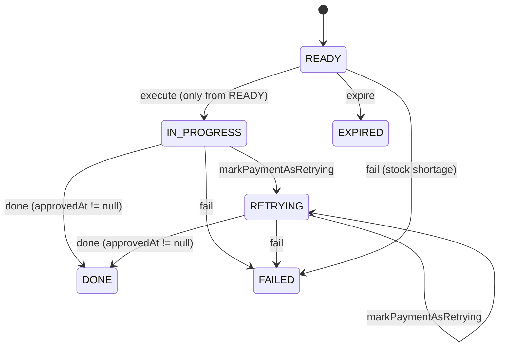
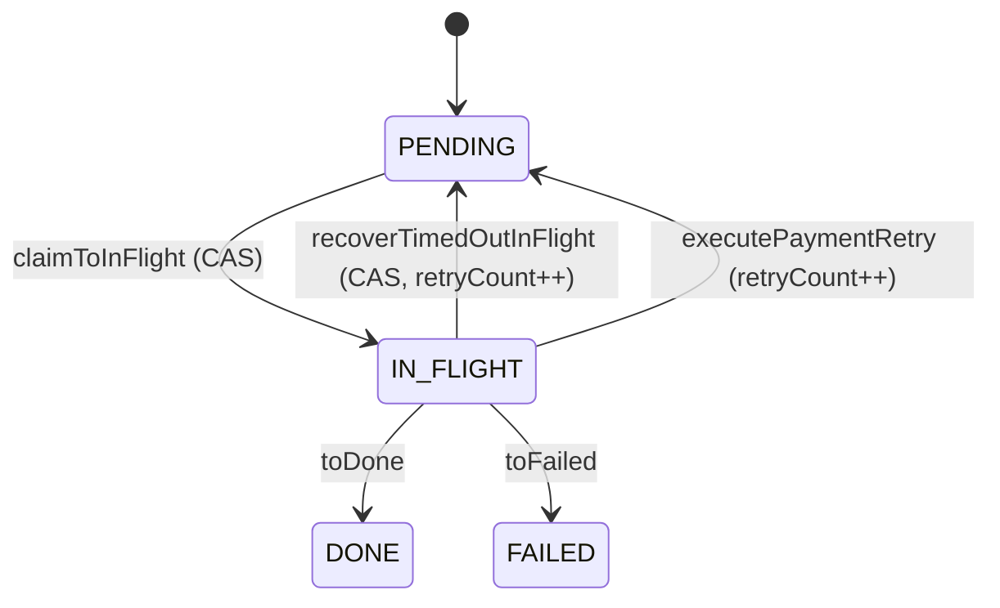
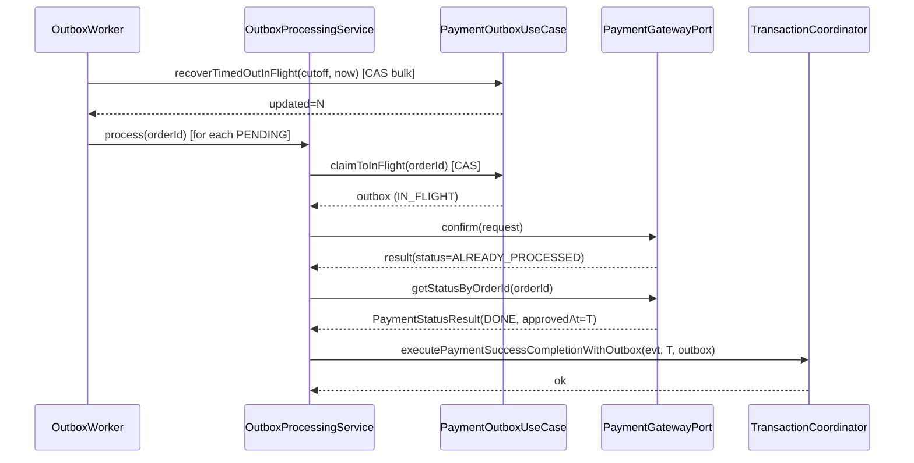

# PAYMENT-DOUBLE-FAULT-RECOVERY

> Round 2 — Architect (revise)
> 일자: 2026-04-09
> 근거 입력: `docs/rounds/payment-double-fault-recovery/discuss-interview-0.md`
> Round 1 피드백: `discuss-critic-1.md` (C1 major, C2 minor), `discuss-domain-1.md` (D4 major, D1/D2/D3/D5 minor)

---

## 1. 배경

Outbox 단일 전략의 confirm 흐름은 "PG 호출은 되었으나 로컬 결과 반영 전에 worker/앱이 죽는" 이중 장애(Double Fault)에 대비해 `OutboxWorker.recoverTimedOutInFlightRecords()` + `OutboxProcessingService.process()` 재실행으로 복구한다. 코드를 직접 교차검증한 결과 이 복구 경로에 **도메인 불변식/CAS/조회 편입/도메인 재진입 방어**가 누락된 7개 허점(F1~F7)이 발견되었으며, 특히 F1+F3+F5는 서로 엮여 "**복구 시 실제 승인된 결제의 `approved_at`이 `null`로 확정되는 critical 데이터 손상**"을 만든다.

본 문서는 이 체인을 일관된 한 가지 해법으로 풀고, 도메인 레벨 방어 강화(F6), CAS(F4), 조회 편입(F7)을 한 라운드에 통합 설계한다.

---

## 2. 문제 정의 (F1~F7)

| ID | 심각도 | 파일 | 라인 | 현상 |
|----|-------|------|------|------|
| F1 | Critical | `payment/domain/PaymentEvent.java` | 92–103 (`done`) | `approvedAt=null`을 무조건 수용. `DONE ⇒ approvedAt != null` 도메인 불변식 미강제. |
| F2 | Moderate | `payment/application/usecase/PaymentCommandUseCase.java` | 85–103 | 실패/재시도 응답에서도 `PaymentDetails(status=DONE, approvedAt=result.approvedAt())` 하드코딩 — "유령 DONE" DTO가 상류로 흐름. |
| F3 | Critical | `payment/scheduler/OutboxProcessingService.java` | 63–64 | `gatewayInfo.getPaymentDetails().getApprovedAt()`를 null 가드 없이 그대로 `executePaymentSuccessCompletionWithOutbox`에 전달. F1·F5와 직렬로 연결. |
| F4 | Major | `payment/application/usecase/PaymentOutboxUseCase.java` | 57–66 | `recoverTimedOutInFlightRecords`가 read → mutate → save. 조건부 UPDATE(CAS) 없음 → 다중 워커 동시 복구 경쟁. |
| F5 | Critical | `paymentgateway/exception/common/TossPaymentErrorCode.java` 70–72, `PaymentConfirmResultStatus.java` 22–23 | `ALREADY_PROCESSED_PAYMENT.isSuccess()=true` → `PaymentConfirmResultStatus.SUCCESS` 분기 → `confirmPaymentWithGateway`가 승인 상세 없이 `approvedAt=null`인 `PaymentDetails`를 조립 → F3/F1을 관통해 **DONE 확정**. |
| F6 | Moderate | `payment/domain/PaymentEvent.java` 64–67 + `PaymentOutboxEntity.java` 40 | `execute()`가 READY/IN_PROGRESS 모두 허용 → 도메인 재진입 방어 없음. 재고 이중 차감은 현재 `payment_outbox.order_id` UNIQUE 제약에 의해 "우연히" 막히는 상태. |
| F7 | Major | `OutboxProcessingService.process` 전체 | — | 복구 시 첫 호출의 성공 여부를 모른 채 무조건 재confirm. `PaymentGatewayPort.getStatusByOrderId`는 이미 포트에 존재(`payment/application/port/PaymentGatewayPort.java:19`)하나 call-site 없음. |

**Critical 체인**: F5 → F2 → F3 → F1 직렬. 어느 한 곳만 고쳐도 증상은 가려지지만, "단일 근본 원인"은 **복구 경로가 PG의 실제 상태를 확인하지 않고 confirm 재호출의 응답만으로 DONE을 확정**한다는 것.

---

## 3. 설계 대안 비교

### 대안 A — 방어만 (Null Guard + 도메인 불변식)
- F1 `done()`에 `Objects.requireNonNull(approvedAt)`, F3 null 가드, F2 실패 응답에 `PaymentDetails`를 null로.
- **장점**: 최소 변경, 포트/어댑터 시그니처 무변경.
- **단점**: F5 발생 시 `NullPointerException`/`PaymentStatusException`이 터져 outbox가 무한 IN_FLIGHT/PENDING 반복 → `approvedAt`은 복구 불가. **근본 해결 아님**.

### 대안 B — ALREADY_PROCESSED일 때만 getStatus 폴백
- `TossPaymentErrorCode.ALREADY_PROCESSED_PAYMENT`를 `isSuccess()=false` + 새 `PaymentConfirmResultStatus.ALREADY_PROCESSED`로 분리.
- `OutboxProcessingService`가 이 분기에서만 `paymentGatewayPort.getStatusByOrderId(orderId)` 호출 → 실제 `approvedAt` 확보 후 성공 완료.
- **장점**: 정상 경로 레이턴시 무영향, 변경 범위 명확, 포트 시그니처 이미 존재.
- **단점**: "첫 호출이 네트워크 단절로 응답만 유실된 경우"는 여전히 재confirm → Toss가 idempotency-key로 재승인 응답을 돌려주므로 **실질 문제 없음**. 다만 Toss 측 `ALREADY_PROCESSED` 매핑 외의 경로로 idempotency가 동작하는 경우에 한해 여전히 `approvedAt`이 유실될 리스크 존재 → 이 경우 `confirmPaymentWithGateway`가 돌려준 response에 `approvedAt`이 있으면 OK, 없으면 `NULL_APPROVED_AT`을 RETRYABLE로 처리.

### 대안 C — 복구 경로 진입 시 무조건 getStatus 선행
- `process()` Step 2에 앞서 `PaymentOutbox.retryCount > 0` 또는 복구 클레임된 레코드(=이전 IN_FLIGHT에서 복귀한 것)만 `getStatusByOrderId` 선행 호출. 이미 DONE이면 confirm 생략.
- **장점**: "재호출 = 사실 확인" 의미론. F5 경로가 아예 열리지 않음.
- **단점**: 트래픽 2x (복구 건 한정이지만 스파이크 시 Toss 레이트 한도 영향), 포트 호출 1회 추가. 클린 복구 판정(=retryCount 인덱스 + in_flight_at 복원 여부) 로직 필요.

### 추천: **대안 B + 부분 C**
- **Primary**: 대안 B. `ALREADY_PROCESSED`를 별도 결과 status로 분리하고 그 분기에서만 `getStatusByOrderId` 폴백 호출 → 실제 `approvedAt`으로 DONE 확정. 정상 경로는 변경 없음.
- **Safety net**: 대안 A의 도메인 불변식(`PaymentEvent.done(approvedAt)`에서 `approvedAt` non-null 강제)을 **함께** 도입. Primary가 실수로 null을 통과시키면 `PaymentStatusException` → 레코드는 IN_FLIGHT 유지 → 수동/재처리 대상.
- **F7 경미 편입**: `process()`가 `getStatusByOrderId` 폴백을 갖게 되면 F7의 "재호출 전 조회" 요구는 `ALREADY_PROCESSED` 분기에서 자연스럽게 만족. "복구 진입 시 무조건 조회"는 도입하지 않는다(레이트 한도와 복잡도 대비 ROI 낮음) — plan 단계에서 재검토.

이 추천안은 **도메인 불변식(A) + 응답 분기 정정(B)** 을 이중 방어로 두며, 어느 한 층이 깨져도 데이터 손상은 발생하지 않는다.

---

## 4. 추천안 상세 (레이어별 변경)

### 4-1. Domain 계층 — 불변식 강화

**`PaymentEvent.done(approvedAt, lastStatusChangedAt)`**:
- `approvedAt == null` 이면 `PaymentStatusException.of(PaymentErrorCode.INVALID_STATUS_TO_SUCCESS)` (또는 신규 `DONE_REQUIRES_APPROVED_AT`).
- 기존 status 가드는 **IN_PROGRESS / RETRYING에서만 허용**으로 축소. DONE → DONE 자기루프 차단(D1). 재진입 호출은 `PaymentStatusException`.
- 이미 DONE 상태 + 동일 approvedAt 재할당 역시 도메인 예외. outbox CAS가 1차 방어, 도메인 가드가 2차 방어로 "단독 안전성" 확보.

**`PaymentEvent.execute(paymentKey, executedAt, lastStatusChangedAt)` (F6)**:
- 상태 가드는 **READY만 허용**으로 축소 (IN_PROGRESS 허용 제거).
- 재진입 호출은 도메인 예외. `OutboxAsyncConfirmService.confirm()`의 "동일 orderId 재호출" 시나리오는 이미 `payment_outbox.order_id` UNIQUE 제약으로 먼저 차단되므로 상위 흐름 영향 없음.
- 이중 방어: UNIQUE 제약은 그대로 유지(인프라 최후 방패), 도메인 가드는 "의도된 1차 방패"로 승격.

**`PaymentOutbox` 상태 머신**: 변경 없음. 단 CAS 반영(아래 4-3)으로 IN_FLIGHT 간 경합이 사라진다.

### 4-2. Application 계층 — 결과 분기 정정 + 폴백 조회

**`PaymentConfirmResultStatus` (도메인 enum)**:
- 신규 값: `ALREADY_PROCESSED` 추가 (또는 `SUCCESS` 서브타입). "PG가 이 결제는 이미 성공 처리되었다고 응답" 의미.
- `PaymentConfirmResultStatus.of()`가 `TossPaymentErrorCode.ALREADY_PROCESSED_PAYMENT`를 이 신규 값으로 매핑. 기타 `isSuccess()=true` 코드가 있다면 동일 매핑(plan에서 전수 조사).

**`PaymentCommandUseCase.confirmPaymentWithGateway` (F2)**:
- `PaymentConfirmResult.status`가 `SUCCESS`가 아닌 경우 `PaymentDetails`를 `null`로 조립. "DONE 하드코딩" 제거.
- 실패 시 `PaymentFailure`만 채움.

**`OutboxProcessingService.process` (F3, F5, F7, D4)**:
- `switch`에 `ALREADY_PROCESSED` 분기 추가 — PG `PaymentStatusResult.status`(= `PaymentStatus` enum) 값 전체에 대해 **명시적 매핑**을 수행한다. `isDone()` 단일 판정 금지.

  | PG 응답 status | approvedAt | 처리 | 분류 | 근거 |
  |----------------|-----------|------|------|------|
  | `DONE` | non-null | `executePaymentSuccessCompletionWithOutbox(evt, approvedAt, outbox)` | SUCCESS | 정상 복구 경로 |
  | `DONE` | null | skip + `incrementRetry` + **alert LogFmt** (`pg_status=DONE approved_at=null`) | RETRYABLE | PG 응답 이상, 재조회로 회복 시도 |
  | `CANCELED` | — | `executePaymentFailureCompletionWithOutbox(evt, outbox, reason=PG_CANCELED)` → FAILED + 재고 복구(멱등) | NON_RETRYABLE | 이미 PG가 취소 상태. 재confirm 금지(money-risk). 재고 복구는 `StockService.restoreForOrders`가 멱등이어야 함 — plan 확인 |
  | `ABORTED` | — | 동일 (`reason=PG_ABORTED`) | NON_RETRYABLE | 동일 |
  | `EXPIRED` | — | 동일 (`reason=PG_EXPIRED`) | NON_RETRYABLE | 결제 만료 확정 |
  | `IN_PROGRESS` | — | skip + `incrementRetry` (상태 전이 없이 outbox만 PENDING 재편성) | RETRYABLE | PG가 처리 중 — 다음 주기 재조회 |
  | `WAITING_FOR_DEPOSIT` | — | 동일 skip + `incrementRetry` | RETRYABLE | 가상계좌 대기. 본 TOPIC scope에서는 RETRYABLE로 두고 별도 대기 큐 분기는 non-goal |
  | `READY` | — | skip + `incrementRetry` + **alert** | RETRYABLE | 우리가 confirm을 보낸 뒤 PG가 READY를 돌려주는 것은 이상 상황 |
  | `PARTIAL_CANCELED` | — | skip + `incrementRetry` + **alert** | RETRYABLE(1회) → escalate | 복구 경로에서 부분취소는 범위 밖. 운영 알람 후 수동 처리. plan에서 정책 재확인 |
  | 기타/`UNKNOWN`/null | — | skip + `incrementRetry` + **alert** | RETRYABLE | 방어적 처리, 운영 알람 |

  `PaymentStatus` enum에 누락된 값이 추가될 경우 `switch`는 컴파일 실패하도록 exhaustive 처리(`default -> throw`).

- 기존 `SUCCESS` 분기: `approvedAt`이 null이면 도메인 예외가 터지도록 방치(4-1). 이는 설계 의도된 실패.
- `loadPaymentEvent`는 그대로. 재진입은 `PaymentEvent.execute`가 아니라 `markPaymentAsDone`/`markPaymentAsRetrying` 경로이므로 F6 변경과 충돌 없음.
- **복구 시 PaymentEvent 상태 불변 원칙(D2)**: `recoverTimedOutInFlightRecords`는 `payment_outbox`만 IN_FLIGHT→PENDING으로 되돌리고, `PaymentEvent`의 상태(IN_PROGRESS/RETRYING)는 그대로 둔다. 따라서 이후 재confirm에서 `markPaymentAsDone`이 `done(approvedAt)` 가드를 통과한다(READY 가드와 무관). 본 원칙은 §5에도 주석으로 명기.
- **잔존 read-then-save(D3)**: `OutboxProcessingService.process` 경로의 `loadPaymentEvent` 실패 → `incrementRetryOrFail`은 여전히 read-then-save 패턴이다. 이 경로는 단일 워커가 이미 `claimToInFlight`로 CAS 획득한 레코드에만 도달하므로 race window는 닫혀 있으나, plan 단계에서 "전수 감사 후 필요 시 CAS 전환"을 과제로 명시(scope 외).

- **재시도 포기 조건(C1)**: 위 RETRYABLE 분기는 기존 `RetryPolicyProperties`(`MaxRetryPolicy`)를 공유한다. 복구 경로 전용 별도 budget을 두지 **않는다**.
  - 근거: 복구 레코드와 정상 재시도는 동일한 "PG 불확정" 실패 모드이므로 budget 분리의 이득 없음. budget 분리는 관측과 정책이 이중화되어 운영 복잡도만 증가.
  - 초과 시 동작: 기존 `incrementRetryOrFail` 경로를 그대로 사용 → `retryCount >= maxRetry`이면 `PaymentOutbox.toFailed(reason=RETRY_BUDGET_EXHAUSTED)` + `PaymentEvent.fail`. 이후 레코드는 운영 수동 복구 큐(= outbox `status=FAILED` 조회 쿼리) 대상.
  - plan에서 세부 수치(maxRetry, backoff)만 조정.

**`PaymentOutboxUseCase.recoverTimedOutInFlightRecords` (F4)**:
- read-then-save 제거. 새 리포지토리 메서드 `recoverTimedOutInFlight(LocalDateTime cutoff, LocalDateTime now, Duration nextDelay)` 도입. 구현은 조건부 UPDATE:
  ```sql
  UPDATE payment_outbox
     SET status = 'PENDING',
         retry_count = retry_count + 1,
         next_retry_at = :now + :nextDelay,
         in_flight_at = NULL,
         updated_at = :now
   WHERE status = 'IN_FLIGHT'
     AND in_flight_at <= :cutoff
  ```
- 반환값: `int updatedRows`. 로그/메트릭용.
- 다중 워커 동시 recover는 MySQL row-lock + `WHERE status='IN_FLIGHT' AND in_flight_at<=:cutoff`로 자연 직렬화 → 정확히 1회만 PENDING 전환.
- backoff 계산이 레코드별 retryCount에 의존한다는 점 때문에 한 번의 UPDATE로 모든 레코드에 동일한 `next_retry_at`을 주는 것은 근사치다. 정확한 per-record 백오프가 필요하면 "SELECT ... FOR UPDATE SKIP LOCKED → per-row UPDATE ... WHERE in_flight_at=:prev" 2-step CAS로 대체. plan 단계 결정.
- 대체(정확 CAS per-row) 예시:
  ```sql
  UPDATE payment_outbox
     SET status='PENDING', retry_count=retry_count+1,
         next_retry_at=:next, in_flight_at=NULL, updated_at=:now
   WHERE id=:id AND status='IN_FLIGHT' AND in_flight_at=:prevInFlightAt
  ```
  updated=0이면 다른 워커가 이미 복구한 것 → skip.

### 4-3. Infrastructure 계층

- `PaymentOutboxRepository` 포트에 `recoverTimedOutInFlight(...)` 또는 `casRecoverSingle(...)` 시그니처 추가.
- `JpaPaymentOutboxRepository`에 `@Modifying @Query` bulk UPDATE 또는 per-row CAS 쿼리 추가.
- `PaymentInfrastructureMapper` 영향 없음.
- `PaymentGatewayPort`/어댑터 시그니처 변경 **없음** (`getStatusByOrderId` 이미 존재).
- `PaymentStatusResult`: `isDone()` 류의 boolean 헬퍼 추가 금지. §4-2 매핑표가 `PaymentStatus` enum에 직접 분기하도록 한다(누락 값 컴파일 감지).

**gateway/domain enum 수정 경계(D5)**:
- `paymentgateway` 컨텍스트 수정은 **`TossPaymentErrorCode.ALREADY_PROCESSED_PAYMENT` 한 항목에 한정**.
  - 옵션 (i): `isSuccess()=false`로 직접 수정 — `isFailure()=!isSuccess() && !retryable`가 연동되어 `isFailure()=true`로 뒤집힘. 다른 call-site 전수 조사 필요(plan scope).
  - 옵션 (ii): `TossPaymentErrorCode`에 `isAlreadyProcessed()` 플래그 별도 추가, `isSuccess()`는 그대로. 기존 `isFailure()/isRetryable()` 연동 무변경. **추천**.
- `paymentgateway` → `payment/domain/dto/enums/PaymentConfirmResultStatus` 매핑 함수(`PaymentConfirmResultStatus.of`)에서 `isAlreadyProcessed()` 를 먼저 검사하여 신규 `ALREADY_PROCESSED` 값으로 매핑. `isSuccess()` 분기는 손대지 않는다.
- 이 경계 분리로 domain enum의 신규 값 도입과 gateway enum의 의미 변경이 서로 독립적으로 진행되며, 다른 Toss 에러코드 사용처에 side-effect가 없음이 보장된다.

### 4-4. Hexagonal 경계 준수 확인

- 신규 호출 `paymentGatewayPort.getStatusByOrderId(...)`은 `application` → `application/port` 방향. OK.
- CAS 쿼리는 infrastructure에만 존재. 포트는 의도(`recoverTimedOutInFlight`)만 노출. OK.
- 도메인 불변식은 `domain/PaymentEvent`에만. OK.

---

## 5. 상태 머신 / 시퀀스

### 5-1. PaymentEvent 상태 변화 (F6 반영)



변경점: `execute`의 자기 루프(IN_PROGRESS → IN_PROGRESS) 제거. `done`은 approvedAt non-null 강제, DONE → DONE 자기루프 금지(D1).

**복구 시 PaymentEvent 상태 불변(D2)**: `recoverTimedOutInFlightRecords`와 §4-2 매핑표의 skip/retry 분기 모두 `PaymentEvent`의 상태를 건드리지 않는다. 상태 전이는 최종 완료(`done`/`fail`) 시점에만 발생한다.

### 5-2. PaymentOutbox 상태 (변경 없음, CAS 흐름만 도시)



### 5-3. 복구 + ALREADY_PROCESSED 경로



---

## 6. 장애 시나리오 및 대응

1. **복구 중 워커 재크래시** — CAS bulk UPDATE 후 PENDING 레코드만 남음. 다음 주기에 `claimToInFlight` CAS로 다시 진입. 중복 없음.
2. **PG가 `ALREADY_PROCESSED` 후 `getStatusByOrderId`도 실패** — `RETRYABLE_FAILURE`로 폴백. 다음 주기에 재시도. `approvedAt`은 실제 값으로 확정될 때까지 DONE 전환 금지 (도메인 불변식이 이를 강제).
3. **`getStatusByOrderId`가 DONE을 반환하나 approvedAt=null** — 매핑표 2행에 따라 skip + incrementRetry + alert. DONE 전환 금지. 도메인 불변식이 2차 방패.
4. **다중 워커가 같은 IN_FLIGHT 레코드 복구 시도** — CAS(`WHERE status='IN_FLIGHT' AND in_flight_at<=:cutoff`)로 1회만 성공. F4 해소.
5. **중복 confirm HTTP 요청** — `payment_outbox.order_id` UNIQUE가 먼저 차단 → TX 롤백 → 재고/이벤트 영향 없음. F6 도메인 가드는 "단위 테스트로 명시되는 2차 방패".
6. **F5 동일 시나리오(이전 코드 기준)** — 새 코드에서는 `ALREADY_PROCESSED` 분기로 진입 → 실제 `approvedAt` 확보. 만약 분기 매핑이 누락되더라도 `PaymentEvent.done(null)`에서 즉시 실패 → 데이터 손상 차단.
7. **복구 중 PG 상태가 `CANCELED`/`ABORTED`/`EXPIRED`** (D4) — 매핑표에 따라 `executePaymentFailureCompletionWithOutbox`로 진입 → `PaymentEvent.fail` + `PaymentOutbox.toFailed` + 재고 복구(`StockService.restoreForOrders` 멱등 호출). 재confirm 금지. 이 분기가 **본 라운드가 닫는 새 money-risk**.
8. **복구 중 PG 상태가 `IN_PROGRESS`/`WAITING_FOR_DEPOSIT`** — skip + incrementRetry. `PaymentEvent` 상태는 그대로(D2), outbox만 PENDING으로 되돌림. 다음 주기 재조회.
9. **`CANCELED` 복구 후 재고 복구 멱등성 깨짐** — `PaymentEvent.fail`이 이미 이전 사이클에 수행되어 재고가 복구되었을 경우 중복 호출 방지. `StockService.restoreForOrders`는 `PaymentEvent.status == FAILED` 재진입 시 no-op이어야 함(plan 검증 항목).
10. **retry budget 소진** (C1) — `incrementRetryOrFail`이 `retryCount >= maxRetry` 시 `PaymentOutbox.toFailed(reason=RETRY_BUDGET_EXHAUSTED)` + `PaymentEvent.fail`. 운영 수동 복구 큐(= `WHERE status='FAILED'`) 대상.

---

## 7. 검증 전략

### 단위 테스트
- `PaymentEventTest#done_rejectsNullApprovedAt` — `@ParameterizedTest` null / non-null 경계.
- `PaymentEventTest#done_rejectsReentryFromDone` — DONE→DONE 자기루프 차단(D1).
- `PaymentEventTest#execute_rejectsNonReadyStatus` — READY 제외 모든 상태 invalid (F6).
- `PaymentCommandUseCaseTest#confirmPaymentWithGateway_failureResponse_paymentDetailsIsNull` (F2).
- `OutboxProcessingServiceTest` — Fake `PaymentGatewayPort`, **`PaymentStatus` enum 전 값 @ParameterizedTest** (D4):
  - `SUCCESS` 정상 → DONE.
  - `ALREADY_PROCESSED` + PG status=`DONE`/approvedAt non-null → 성공 완료.
  - `ALREADY_PROCESSED` + PG status=`DONE`/approvedAt null → skip + incrementRetry + alert 로그.
  - `ALREADY_PROCESSED` + PG status=`CANCELED`/`ABORTED`/`EXPIRED` → `PaymentEvent.fail` + `PaymentOutbox.FAILED` + 재고 복구 1회 (money-risk 회귀 테스트).
  - `ALREADY_PROCESSED` + PG status=`IN_PROGRESS`/`WAITING_FOR_DEPOSIT`/`READY` → skip + incrementRetry, `PaymentEvent` 상태 불변.
  - `ALREADY_PROCESSED` + `getStatusByOrderId` throws → RETRYABLE 폴백.
  - `SUCCESS` + approvedAt=null → `PaymentStatusException` (F1 이중 방패 검증).
  - retry budget 소진 → `PaymentOutbox.status=FAILED`, `PaymentEvent.status=FAILED` (C1).
- `PaymentConfirmResultStatusOfTest` — `TossPaymentErrorCode.isAlreadyProcessed()` → `ALREADY_PROCESSED` 매핑(D5).

### 런타임 관측 (in-scope, C2)
본 라운드 in-scope로 최소 LogFmt 로그 키를 **확정**한다. Micrometer 카운터는 plan에서 추가 검토.
- `OutboxProcessingService`:
  - 정상: `event=outbox.process outcome=success order_id=... approved_at=...`
  - 복구 폴백 진입: `event=outbox.process already_processed=true pg_status=<PaymentStatus> approved_at=<nullable>`
  - 이상 상태 분기: `event=outbox.process already_processed=true pg_status=DONE approved_at=null alert=true`
  - 취소류 보상: `event=outbox.process already_processed=true pg_status=CANCELED action=compensate`
  - 재시도 소진: `event=outbox.process outcome=retry_budget_exhausted retry_count=N`
- `PaymentOutboxUseCase.recoverTimedOutInFlight`:
  - `event=outbox.recover cas_recovered=N cutoff=... now=...`
- 도메인 예외:
  - `PaymentEvent.done(null)` 진입 시 기존 예외 로그에 `event=payment.done.reject reason=null_approved_at` 추가.

위 키들은 운영 대시보드에서 `already_processed=true` 건수·`cas_recovered` 합계·`retry_budget_exhausted` 카운트를 즉시 쿼리 가능하게 한다.

### 통합 테스트
- `PaymentOutboxUseCaseConcurrentRecoverIT` — 2개 스레드가 동일 `recoverTimedOutInFlight` 호출 시 CAS로 1회만 PENDING 전환 (F4).
- `OutboxDoubleFaultRecoveryIT` — IN_FLIGHT 레코드 주입 → recover → ALREADY_PROCESSED 시나리오(Fake PG) → DONE + approvedAt 실제 값 확정.
- 기존 동시 confirm UNIQUE 제약 테스트는 그대로 유지(F6 이중 방어 회귀 방지).

---

## 8. 트랜잭션 경계 원칙

- PG I/O(`confirm`, `getStatusByOrderId`)는 **트랜잭션 밖**에서 호출. 기존 원칙 유지.
- `ALREADY_PROCESSED` 분기의 `getStatusByOrderId` 호출도 `process()` 내 TX 밖에서 수행. 이후 `executePaymentSuccessCompletionWithOutbox`만 TX 경계.
- CAS `recoverTimedOutInFlight`는 단일 `@Transactional(REQUIRES_NEW)` 또는 auto-commit UPDATE로 수행. plan에서 확정.

---

## 9. 범위

### In-scope
- F1~F7 모두.
- `PaymentConfirmResultStatus`에 `ALREADY_PROCESSED` 추가 및 매핑.
- `PaymentOutboxRepository` 포트에 CAS 복구 메서드 추가.
- 단위/통합 테스트.

### Non-goals
- `PaymentGatewayPort` 시그니처 변경 (이미 `getStatusByOrderId` 존재).
- 다른 PG 어댑터 신규 추가.
- `PaymentCancel`/보상 경로 재설계.
- "복구 시 무조건 getStatus 선행" 정책(대안 C) — 본 라운드 제외.
- `paymentgateway` 컨텍스트 내부 에러 코드 테이블 전면 재분류 — `ALREADY_PROCESSED_PAYMENT` 항목만 수정.

---

## 10. 영향 파일 목록 (plan 이관용)

**Domain**
- `payment/domain/PaymentEvent.java` — `done` non-null 가드, `execute` READY-only
- `payment/domain/dto/enums/PaymentConfirmResultStatus.java` — `ALREADY_PROCESSED` 추가
- `payment/domain/dto/PaymentStatusResult.java` — `isDone()` 헬퍼(없는 경우)
- `payment/exception/common/PaymentErrorCode.java` — 신규 에러코드 후보 (`DONE_REQUIRES_APPROVED_AT` 등)

**Application**
- `payment/application/usecase/PaymentCommandUseCase.java` — `confirmPaymentWithGateway` 실패 응답 처리 정정
- `payment/application/usecase/PaymentOutboxUseCase.java` — `recoverTimedOutInFlightRecords` CAS 전환
- `payment/application/port/PaymentOutboxRepository.java` — CAS 메서드 추가

**Infrastructure**
- `payment/infrastructure/repository/PaymentOutboxRepositoryImpl.java` + `JpaPaymentOutboxRepository.java` — `@Modifying` CAS 쿼리
- `paymentgateway/exception/common/TossPaymentErrorCode.java` — `ALREADY_PROCESSED_PAYMENT` 분류 재검토 (isSuccess=false 또는 별도 플래그)
- `paymentgateway` → domain enum 매핑 위치 (plan 단계 확정)

**Scheduler**
- `payment/scheduler/OutboxProcessingService.java` — `ALREADY_PROCESSED` 분기 추가, `paymentGatewayPort` 주입

**Tests (신규/수정)**
- `PaymentEventTest`, `PaymentCommandUseCaseTest`, `OutboxProcessingServiceTest`
- `PaymentOutboxUseCaseConcurrentRecoverIT`, `OutboxDoubleFaultRecoveryIT`

---

## 11. 미결 질문 / plan 이월 사항

1. **스키마 변경 허용?** — 현 설계는 기존 컬럼만 사용(스키마 변경 없음). plan에서 확인.
2. **PaymentEvent.execute 상태 가드 축소** — F6 READY-only 가드가 checkout/재처리 경로에 부작용 없는지 전수 확인.
3. **`recoverTimedOutInFlight` 정확 백오프 vs bulk 근사** — per-row CAS vs 단일 UPDATE 트레이드오프, plan에서 결정.
4. **`StockService.restoreForOrders` 멱등성** — `PaymentEvent.status=FAILED` 재진입 시 no-op 보장(§6-9). plan에서 소스 확인.
5. **`PARTIAL_CANCELED` 정책** — 현재는 RETRYABLE + alert로 두었으나 운영 정책에 따라 NON_RETRYABLE+수동 처리로 전환 가능. plan 재검토.
6. **잔존 read-then-save 감사(D3)** — `OutboxProcessingService.loadPaymentEvent` 실패 경로 외에도 누락된 곳이 있는지 plan에서 전수.
7. **Micrometer 카운터** — LogFmt 최소 관측은 본 라운드 in-scope. Micrometer `already_processed_total`, `cas_recovered_total`, `retry_budget_exhausted_total` 등은 plan 추가 검토.
